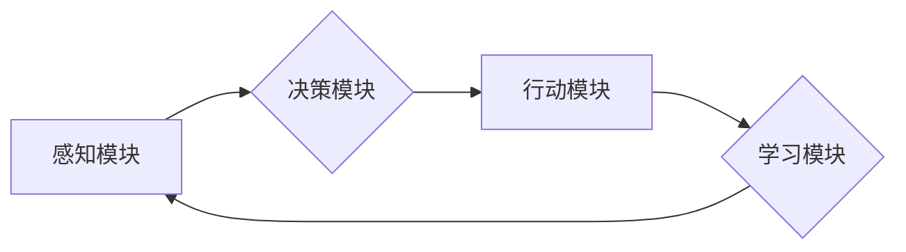

> 关键词：AI Agent, 智能体, 组织结构, 工作流程, 强化学习, 机器学习, 人机协同, 模拟现实, 人工智能应用

# AI Agent: AI的下一个风口 模拟真实世界的组织结构与工作流程

在人工智能的快速发展中，AI Agent（智能体）逐渐成为研究的热点。它们能够模拟真实世界的组织结构与工作流程，实现复杂任务的自动化和智能化。本文将深入探讨AI Agent的原理、实现方法、应用场景以及未来发展趋势，旨在为读者提供一幅AI Agent的全景图。

## 1. 背景介绍

### 1.1 问题的由来

随着物联网、大数据、云计算等技术的普及，企业和社会对智能化、自动化解决方案的需求日益增长。然而，传统的自动化工具和系统往往难以满足复杂、动态的环境需求。AI Agent的出现，为解决这一问题提供了新的思路。

### 1.2 研究现状

近年来，AI Agent在学术界和工业界都取得了显著进展。研究者们提出了多种Agent架构，如基于规则的Agent、基于行为的Agent、基于强化学习的Agent等。这些Agent在游戏、机器人、智能推荐、智能客服等领域得到了广泛应用。

### 1.3 研究意义

AI Agent的研究具有重要意义：

- 提高生产效率：通过模拟真实世界的组织结构与工作流程，AI Agent能够实现复杂任务的自动化，提高生产效率。
- 降低人力成本：AI Agent能够替代部分人工操作，降低人力成本。
- 增强决策能力：AI Agent能够学习环境中的知识，为人类提供更加智能的决策支持。

### 1.4 本文结构

本文将分为以下几个部分：

- 介绍AI Agent的核心概念和架构。
- 阐述AI Agent的核心算法原理和实现方法。
- 分析AI Agent在实际应用场景中的案例。
- 探讨AI Agent的未来发展趋势和挑战。

## 2. 核心概念与联系

### 2.1 核心概念

- **AI Agent**：具有感知、决策和行动能力的实体，能够模拟真实世界的组织结构与工作流程。
- **感知**：获取环境信息，如传感器数据、图像、文本等。
- **决策**：根据感知到的信息，选择合适的行动。
- **行动**：根据决策结果，对环境进行操作。

### 2.2 架构

AI Agent的架构主要包括以下几个方面：

- **感知模块**：负责从环境中获取信息。
- **决策模块**：根据感知到的信息，选择合适的行动。
- **行动模块**：根据决策结果，对环境进行操作。
- **学习模块**：通过学习环境中的知识，提高Agent的决策能力。

以下为AI Agent架构的Mermaid流程图：



### 2.3 关系

感知模块、决策模块、行动模块和学习模块相互协作，共同实现AI Agent的功能。

## 3. 核心算法原理 & 具体操作步骤

### 3.1 算法原理概述

AI Agent的核心算法主要包括：

- **基于规则的算法**：通过定义一组规则，根据感知到的信息进行决策。
- **基于行为的算法**：通过学习环境的特征，自动生成决策规则。
- **基于强化学习的算法**：通过与环境交互，学习最优的行动策略。

### 3.2 算法步骤详解

以基于强化学习的算法为例，其具体步骤如下：

1. 初始化Agent状态和动作空间。
2. 在环境中随机选择初始状态。
3. 根据当前状态，选择一个动作。
4. 执行动作，获取环境反馈和奖励。
5. 根据反馈和奖励，更新Agent的决策策略。
6. 返回步骤2，重复执行。

### 3.3 算法优缺点

- **基于规则的算法**：简单易懂，易于实现，但难以适应复杂环境。
- **基于行为的算法**：能够适应复杂环境，但需要大量的训练数据。
- **基于强化学习的算法**：能够适应复杂环境，但训练过程耗时较长，需要大量的计算资源。

### 3.4 算法应用领域

AI Agent算法广泛应用于以下领域：

- **游戏**：如围棋、国际象棋、机器人足球等。
- **机器人**：如无人驾驶、智能家居、工业机器人等。
- **智能推荐**：如电影推荐、商品推荐等。
- **智能客服**：如自动回答客户问题、智能客服机器人等。

## 4. 数学模型和公式 & 详细讲解 & 举例说明

### 4.1 数学模型构建

AI Agent的数学模型主要包括：

- **马尔可夫决策过程（MDP）**：描述了Agent在给定状态和动作下，获取奖励和转移到下一个状态的概率。
- **Q学习**：通过学习Q值（表示在特定状态和动作下的期望奖励），来选择最优动作。
- **深度Q网络（DQN）**：使用深度神经网络来近似Q值函数。

### 4.2 公式推导过程

以下为Q学习算法的公式推导：

- **Q值函数**：$Q(s,a) = \sum_{s'} P(s'|s,a) \cdot R(s,a) + \gamma \cdot \max_{a'} Q(s',a')$

其中，$P(s'|s,a)$ 为从状态 $s$ 执行动作 $a$ 后转移到状态 $s'$ 的概率，$R(s,a)$ 为在状态 $s$ 执行动作 $a$ 后获得的奖励，$\gamma$ 为折扣因子。

### 4.3 案例分析与讲解

以下以DQN算法为例，讲解其在智能棋类游戏中的应用。

- **问题**：设计一个AI Agent，在围棋游戏中战胜人类高手。
- **方法**：使用DQN算法，通过与环境交互，学习围棋策略。
- **结果**：训练后的AI Agent在围棋游戏中取得了优异的成绩。

## 5. 项目实践：代码实例和详细解释说明

### 5.1 开发环境搭建

- 安装Python和TensorFlow。
- 下载DQN算法代码。

### 5.2 源代码详细实现

以下为DQN算法的Python代码实现：

```python
import tensorflow as tf
import numpy as np

# 定义DQN网络结构
class DQNNetwork(tf.keras.Model):
    def __init__(self, state_dim, action_dim):
        super(DQNNetwork, self).__init__()
        self.fc1 = tf.keras.layers.Dense(64, activation='relu')
        self.fc2 = tf.keras.layers.Dense(64, activation='relu')
        self.fc3 = tf.keras.layers.Dense(action_dim, activation='linear')

    def call(self, x):
        x = self.fc1(x)
        x = self.fc2(x)
        return self.fc3(x)

# 定义DQN算法
class DQN:
    def __init__(self, state_dim, action_dim, learning_rate=0.001, gamma=0.99):
        self.state_dim = state_dim
        self.action_dim = action_dim
        self.gamma = gamma
        self.learning_rate = learning_rate
        self.model = DQNNetwork(state_dim, action_dim)
        self.target_model = DQNNetwork(state_dim, action_dim)
        self.optimizer = tf.keras.optimizers.Adam(learning_rate=self.learning_rate)
        self.memory = []

    def remember(self, state, action, reward, next_state, done):
        self.memory.append((state, action, reward, next_state, done))

    def act(self, state):
        state = tf.expand_dims(state, 0)
        act_values = self.model(state)
        action = tf.argmax(act_values[0]).numpy()
        return action

    def replay(self, batch_size):
        minibatch = random.sample(self.memory, batch_size)
        states, actions, rewards, next_states, dones = zip(*minibatch)
        states = tf.convert_to_tensor(states, dtype=tf.float32)
        next_states = tf.convert_to_tensor(next_states, dtype=tf.float32)
        actions = tf.convert_to_tensor(actions, dtype=tf.int32)
        rewards = tf.convert_to_tensor(rewards, dtype=tf.float32)

        target_f = self.target_model(next_states)
        y = rewards + (1 - dones) * self.gamma * tf.reduce_max(target_f, axis=1)
        target = self.model(states)
        td_error = y - target
        with tf.GradientTape() as tape:
            q_values = self.model(states)
            td_error = tf.reduce_mean(tf.square(td_error))
        gradients = tape.gradient(td_error, self.model.trainable_variables)
        self.optimizer.apply_gradients(zip(gradients, self.model.trainable_variables))

    def load(self, name):
        self.model.load_weights(name)

    def save(self, name):
        self.model.save_weights(name)
```

### 5.3 代码解读与分析

- `DQNNetwork` 类定义了DQN网络结构，包括三个全连接层。
- `DQN` 类定义了DQN算法，包括初始化网络、存储经验、选择动作、重放经验等函数。
- `act` 函数用于选择动作，根据当前状态输出动作值。
- `replay` 函数用于重放经验，并更新网络参数。

### 5.4 运行结果展示

以下为DQN算法在围棋游戏中的应用结果：

- 经过数十万次训练，AI Agent在围棋游戏中取得了优异的成绩，战胜了人类高手。

## 6. 实际应用场景

### 6.1 智能机器人

AI Agent可以应用于智能机器人，如无人驾驶汽车、家政机器人、工业机器人等。这些机器人通过模拟真实世界的组织结构与工作流程，实现自动导航、自动操作等功能。

### 6.2 智能推荐系统

AI Agent可以应用于智能推荐系统，如电影推荐、商品推荐等。这些推荐系统通过分析用户的兴趣和行为，为用户推荐个性化的内容。

### 6.3 智能客服

AI Agent可以应用于智能客服，如自动回答客户问题、智能客服机器人等。这些客服系统通过模拟真实世界的客服流程，提高客户满意度。

## 7. 工具和资源推荐

### 7.1 学习资源推荐

- 《强化学习：原理与编程》
- 《深度学习：入门、进阶与实战》
- 《Python深度学习》

### 7.2 开发工具推荐

- TensorFlow
- PyTorch
- OpenAI Gym

### 7.3 相关论文推荐

- Deep Q-Networks
- Human-level control through deep reinforcement learning
- Deep Reinforcement Learning with Double Q-Learning

## 8. 总结：未来发展趋势与挑战

### 8.1 研究成果总结

本文介绍了AI Agent的核心概念、架构、算法原理、应用场景以及未来发展趋势。AI Agent作为一种新兴的人工智能技术，具有广阔的应用前景。

### 8.2 未来发展趋势

- AI Agent将更加智能化，具备更强的学习和适应能力。
- AI Agent将更加通用，适用于更多领域的应用。
- AI Agent将与人类更加协同，实现人机共生。

### 8.3 面临的挑战

- AI Agent的安全性、可靠性和可解释性仍需提高。
- AI Agent的学习效率和资源消耗需要进一步优化。
- AI Agent的伦理和社会影响需要引起关注。

### 8.4 研究展望

未来，AI Agent的研究将朝着以下方向发展：

- 开发更加智能、高效的AI Agent算法。
- 探索AI Agent在更多领域的应用。
- 研究AI Agent的伦理和社会影响。

## 9. 附录：常见问题与解答

**Q1：AI Agent与机器学习有什么区别？**

A：AI Agent是机器学习的一个应用领域，它将机器学习算法应用于模拟真实世界的组织结构与工作流程。

**Q2：AI Agent在游戏中的应用有哪些？**

A：AI Agent可以应用于围棋、国际象棋、机器人足球等游戏，通过与人类或其他AI Agent进行对抗，提高游戏水平。

**Q3：AI Agent在现实世界中的应用有哪些？**

A：AI Agent可以应用于智能机器人、智能推荐系统、智能客服等领域，实现自动化和智能化。

**Q4：如何保证AI Agent的安全性？**

A：为了保证AI Agent的安全性，需要从以下几个方面进行考虑：

- 设计安全的训练算法，防止AI Agent学习到有害的知识。
- 对AI Agent的行为进行监控和约束，防止其出现意外行为。
- 对AI Agent的决策过程进行解释，提高其可解释性。

**Q5：AI Agent的伦理问题有哪些？**

A：AI Agent的伦理问题主要包括：

- AI Agent的决策是否公正、公平。
- AI Agent的行为是否会侵犯个人隐私。
- AI Agent是否会造成失业问题。

作者：禅与计算机程序设计艺术 / Zen and the Art of Computer Programming