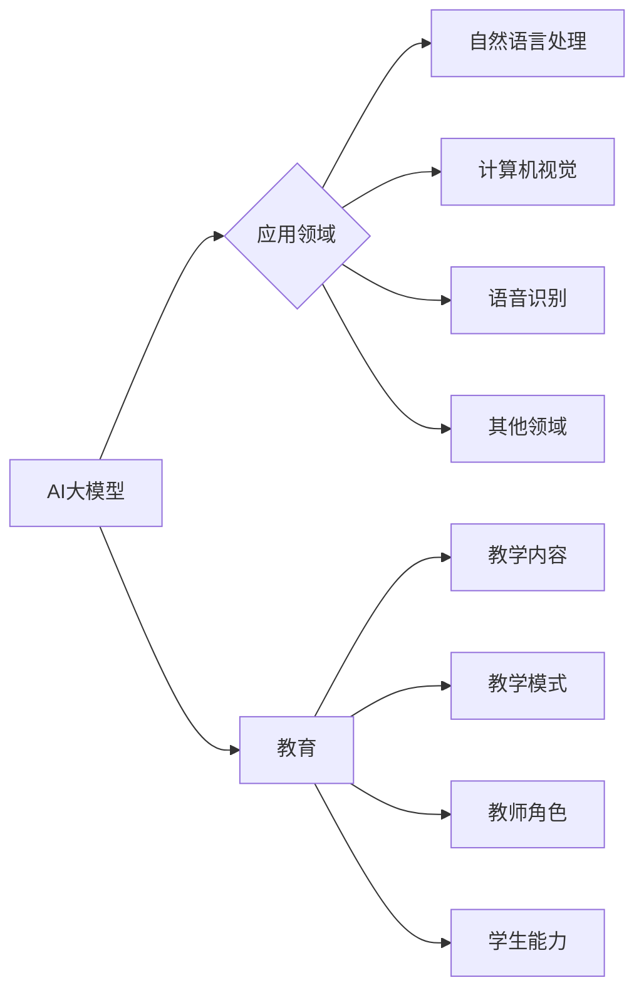

> 关键词：AI大模型，创新精神，教育，包容性，教育技术，学习范式，个性化学习，终身学习

# AI 大模型时代：教育怎样实现对创新精神的培养和包容

在人工智能(AI)技术飞速发展的今天，大模型时代的到来正在深刻地改变着我们的生活和工作方式。教育领域也不例外，AI大模型的出现为教育创新提供了前所未有的机遇，同时也对教育体系提出了新的挑战。如何在这一时代背景下培养和包容创新精神，成为了教育工作者和决策者共同面临的课题。

## 1. 背景介绍

### 1.1 AI大模型时代的到来

近年来，随着计算能力的提升和海量数据的积累，AI大模型如BERT、GPT-3等相继问世，它们在自然语言处理、计算机视觉、语音识别等领域取得了突破性进展。这些大模型拥有海量参数和强大的学习能力，能够处理复杂任务，生成高质量内容，甚至进行创造性思维。

### 1.2 教育面临的挑战

AI大模型的发展对教育领域提出了以下挑战：

- **教学内容更新**: AI大模型的应用使得知识更新速度加快，传统的教学内容和课程体系需要不断更新以适应时代变化。
- **教学模式变革**: AI大模型能够提供个性化学习体验，对传统的班级授课模式提出了挑战。
- **教师角色转变**: AI大模型的应用需要教师转变角色，从知识传授者转变为学习引导者和创新精神的培养者。

### 1.3 教育创新精神的培养

在AI大模型时代，培养创新精神显得尤为重要。创新精神包括好奇心、探索精神、批判性思维、问题解决能力等，这些能力对于学生适应未来社会至关重要。

## 2. 核心概念与联系

### 2.1 核心概念

- **AI大模型**: 拥有海量参数和强大学习能力的AI模型，能够在多个领域进行复杂任务处理。
- **创新精神**: 指个体在面对问题时，能够提出新颖的解决方案，不断探索和突破的能力。
- **教育技术**: 利用技术手段改进教育过程，提高教学效果和学生学习体验的学科。
- **学习范式**: 指学生学习的方式和方法，包括传统的课堂学习、在线学习、混合式学习等。

### 2.2 Mermaid 流程图



## 3. 核心算法原理 & 具体操作步骤

### 3.1 算法原理概述

AI大模型的原理主要基于深度学习技术，通过多层神经网络的学习和优化，实现对海量数据的特征提取和模式识别。

### 3.2 算法步骤详解

1. **数据收集**: 收集大量相关领域的文本、图像、音频等数据。
2. **数据预处理**: 对数据进行清洗、标注、转换等预处理操作。
3. **模型构建**: 选择合适的深度学习模型架构，如Transformer、CNN等。
4. **模型训练**: 使用预处理的训练数据对模型进行训练，优化模型参数。
5. **模型评估**: 使用验证集评估模型性能，调整模型结构或参数。
6. **模型部署**: 将训练好的模型部署到实际应用场景中。

### 3.3 算法优缺点

**优点**:

- 强大的数据处理和模式识别能力。
- 能够自动学习特征，减少人工标注工作量。
- 可应用于多个领域，具有广泛的应用前景。

**缺点**:

- 模型复杂度高，计算量大。
- 需要大量的训练数据和计算资源。
- 模型可解释性差，难以理解其决策过程。

### 3.4 算法应用领域

AI大模型在以下领域有广泛的应用：

- 自然语言处理：机器翻译、文本生成、问答系统等。
- 计算机视觉：图像识别、物体检测、图像生成等。
- 语音识别：语音到文本、语音合成、语音翻译等。
- 其他领域：推荐系统、游戏AI、机器人等。

## 4. 数学模型和公式 & 详细讲解 & 举例说明

### 4.1 数学模型构建

AI大模型的核心是深度学习模型，以下以Transformer模型为例进行讲解。

**公式**：

$$
Y = M_{\theta}(X)
$$

其中，$Y$ 表示模型的输出，$X$ 表示输入数据，$M_{\theta}$ 表示模型参数。

### 4.2 公式推导过程

Transformer模型由自注意力机制和前馈神经网络组成，其核心思想是计算输入序列中每个元素与其他元素之间的注意力分数，并将这些分数作为权重进行加权求和。

### 4.3 案例分析与讲解

假设我们有一个简单的文本分类任务，使用BERT模型进行微调。

1. **数据预处理**: 将文本数据转换为BERT模型所需的输入格式。
2. **模型初始化**: 加载预训练的BERT模型作为初始化参数。
3. **模型微调**: 在标注数据上训练BERT模型，优化模型参数。
4. **模型评估**: 在测试集上评估模型性能。

## 5. 项目实践：代码实例和详细解释说明

### 5.1 开发环境搭建

1. 安装Python和PyTorch。
2. 安装Transformers库。

### 5.2 源代码详细实现

```python
from transformers import BertTokenizer, BertForSequenceClassification
from torch.utils.data import DataLoader, Dataset
import torch

# ...（代码实现略）

# 使用预训练的BERT模型进行文本分类
model = BertForSequenceClassification.from_pretrained('bert-base-uncased')
# ...（代码实现略）
```

### 5.3 代码解读与分析

上述代码展示了使用PyTorch和Transformers库进行文本分类的流程。首先加载预训练的BERT模型，然后定义数据集和数据加载器，最后进行模型微调和评估。

## 6. 实际应用场景

### 6.1 个性化学习

AI大模型可以根据学生的学习进度和学习风格，提供个性化的学习内容和路径，从而提高学习效率。

### 6.2 创意写作

AI大模型可以帮助学生进行创意写作，如写作文、诗歌等，激发学生的创造力和想象力。

### 6.3 问题解答

AI大模型可以为学生提供实时的问题解答，帮助学生解决学习中的困难。

## 7. 工具和资源推荐

### 7.1 学习资源推荐

- 《深度学习》
- 《自然语言处理与深度学习》
- 《Transformer：原理与实践》

### 7.2 开发工具推荐

- PyTorch
- TensorFlow
- Hugging Face Transformers

### 7.3 相关论文推荐

- "Attention is All You Need"
- "BERT: Pre-training of Deep Bidirectional Transformers for Language Understanding"
- "Generative Adversarial Text to Image Synthesis"

## 8. 总结：未来发展趋势与挑战

### 8.1 研究成果总结

AI大模型在教育和学习领域具有巨大的潜力，可以促进教育创新，提高学习效率，培养创新精神。

### 8.2 未来发展趋势

- 个性化学习
- 混合式学习
- 创新精神的培养

### 8.3 面临的挑战

- 数据安全和隐私保护
- 技术可解释性和可解释性
- 教育公平和资源分配

### 8.4 研究展望

未来，AI大模型将在教育和学习领域发挥更大的作用，为教育创新提供更多可能性。

## 9. 附录：常见问题与解答

**Q1：AI大模型对教育有什么影响？**

A1：AI大模型可以促进教育创新，提高学习效率，培养创新精神，但同时也对教学内容、教学模式、教师角色等提出了挑战。

**Q2：如何利用AI大模型培养创新精神？**

A2：可以通过个性化学习、创意写作、问题解答等方式，利用AI大模型培养学生的创新精神。

**Q3：AI大模型在教育领域有哪些应用场景？**

A3：AI大模型在教育领域的应用场景包括个性化学习、创意写作、问题解答、虚拟助手等。

作者：禅与计算机程序设计艺术 / Zen and the Art of Computer Programming