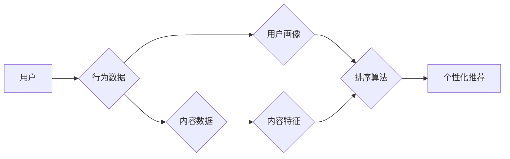

# AI个性化排序系统的实现案例

> 关键词：AI排序，个性化推荐，机器学习，深度学习，推荐系统，用户行为分析，协同过滤，内容推荐

## 1. 背景介绍

在信息爆炸的时代，用户面临着海量的信息选择。如何从这些信息中快速找到自己感兴趣的内容，成为了用户和平台共同的痛点。AI个性化排序系统应运而生，它通过分析用户行为和内容特征，为用户提供定制化的信息流，从而提升用户体验和平台价值。本文将深入探讨AI个性化排序系统的实现原理、技术细节以及实际应用案例。

### 1.1 问题的由来

随着互联网的快速发展，信息内容呈爆炸式增长。用户在浏览网页、使用社交媒体、观看视频等场景中，都面临着信息过载的问题。如何让用户在海量信息中快速找到感兴趣的内容，成为了互联网企业关注的焦点。

### 1.2 研究现状

AI个性化排序系统已成为推荐系统和搜索引擎的核心技术之一。目前，该领域的研究主要集中在以下几个方面：

- 用户行为分析：通过分析用户的浏览记录、搜索历史、点击行为等数据，挖掘用户的兴趣点和偏好。
- 内容特征提取：对文本、图像、视频等内容进行特征提取，为排序提供依据。
- 排序算法设计：设计高效的排序算法，实现个性化的信息推荐。

### 1.3 研究意义

AI个性化排序系统具有以下重要意义：

- 提升用户体验：为用户推荐感兴趣的内容，提升用户满意度。
- 增加用户粘性：提高用户在平台上的停留时间，增加用户粘性。
- 优化内容分发：提高内容曝光度和用户参与度，优化内容分发效果。
- 增加平台收入：通过精准广告投放，提升平台广告收入。

## 2. 核心概念与联系

### 2.1 核心概念

- **个性化推荐**：根据用户兴趣和偏好，为用户提供定制化的信息推荐。
- **用户行为分析**：通过分析用户行为数据，挖掘用户兴趣点和偏好。
- **内容特征提取**：从文本、图像、视频等内容中提取特征，用于排序和推荐。
- **协同过滤**：基于用户行为或内容相似性进行推荐的算法。
- **深度学习**：使用神经网络模型进行特征提取和排序的机器学习方法。

### 2.2 架构流程图



在上述流程图中，用户行为和内容数据分别被输入到用户画像和内容特征提取模块，生成用户画像和内容特征。然后，这两个特征被输入到排序算法模块，最终输出个性化的推荐结果。

## 3. 核心算法原理 & 具体操作步骤

### 3.1 算法原理概述

AI个性化排序系统主要基于以下两种算法原理：

- **协同过滤**：通过分析用户之间的相似性，为用户推荐相似用户喜欢的物品。
- **深度学习**：使用神经网络模型提取用户和内容特征，进行排序和推荐。

### 3.2 算法步骤详解

#### 3.2.1 协同过滤

协同过滤算法分为两种类型：

- **基于用户的协同过滤**：推荐给用户与其他用户相似的用户喜欢的物品。
- **基于物品的协同过滤**：推荐给用户与用户喜欢的物品相似的物品。

协同过滤算法的步骤如下：

1. 构建用户-物品评分矩阵。
2. 计算用户之间的相似性。
3. 根据相似性推荐物品。

#### 3.2.2 深度学习

深度学习在个性化排序中的应用主要包括：

- **用户表示学习**：使用神经网络模型提取用户特征。
- **内容表示学习**：使用神经网络模型提取内容特征。
- **排序模型**：使用神经网络模型进行排序和推荐。

深度学习排序算法的步骤如下：

1. 构建用户和内容特征。
2. 使用神经网络模型进行特征融合。
3. 使用排序损失函数优化模型。
4. 输出排序结果。

### 3.3 算法优缺点

#### 3.3.1 协同过滤

优点：

- 算法简单，易于实现。
- 针对稀疏数据效果较好。

缺点：

- 难以处理新用户和新物品。
- 无法推荐冷门物品。

#### 3.3.2 深度学习

优点：

- 能够处理高维数据。
- 能够发现复杂的用户和内容特征。
- 能够学习到更深层次的语义信息。

缺点：

- 计算复杂度高。
- 模型可解释性较差。

### 3.4 算法应用领域

- 电商平台：为用户推荐商品。
- 社交媒体：为用户推荐好友和内容。
- 视频平台：为用户推荐视频。
- 新闻平台：为用户推荐新闻。

## 4. 数学模型和公式 & 详细讲解 & 举例说明

### 4.1 数学模型构建

#### 4.1.1 协同过滤

假设用户-物品评分矩阵为 $R$，其中 $R_{ui}$ 表示用户 $u$ 对物品 $i$ 的评分。则用户 $u$ 与用户 $v$ 的相似度可以表示为：

$$
s(u,v) = \frac{\sum_{i \in I} R_{ui} R_{vi}}{\sqrt{\sum_{i \in I} R_{ui}^2} \sqrt{\sum_{i \in I} R_{vi}^2}}
$$

其中 $I$ 为所有物品的集合。

基于相似度的推荐物品可以表示为：

$$
R_{uv}(i) = s(u,v) R_{ui} - \mu_u
$$

其中 $\mu_u$ 为用户 $u$ 的平均评分。

#### 4.1.2 深度学习

假设用户表示为 $x_u$，物品表示为 $x_i$，则排序模型可以表示为：

$$
y_i = \sigma(W(x_u^T x_i + b))
$$

其中 $W$ 为权重矩阵，$b$ 为偏置项，$\sigma$ 为激活函数。

### 4.2 公式推导过程

#### 4.2.1 协同过滤

用户 $u$ 与用户 $v$ 的相似度公式中，分子表示用户 $u$ 和用户 $v$ 对相同物品的评分之积的和，分母表示用户 $u$ 和用户 $v$ 对所有物品评分的平方和的平方根。

#### 4.2.2 深度学习

深度学习排序模型的公式中，$x_u^T x_i$ 表示用户表示和物品表示的内积，$W(x_u^T x_i + b)$ 表示经过权重矩阵和偏置项变换后的输出。

### 4.3 案例分析与讲解

#### 4.3.1 协同过滤

以一个简单的用户-物品评分矩阵为例：

| 用户 | 物品 |
|---|---|
| u1 | i1 | i2 | i3 |
| u2 | i1 | i2 | i3 |
| u3 | i1 | i2 | i3 |

根据上述相似度公式，可以计算出用户之间的相似度如下：

| 用户 | u1 | u2 | u3 |
|---|---|---|---|
| u1 | 1.0 | 1.0 | 1.0 |
| u2 | 1.0 | 1.0 | 1.0 |
| u3 | 1.0 | 1.0 | 1.0 |

根据相似度，为用户 $u1$ 推荐物品 $i3$，因为 $u1$ 和 $u2$、$u3$ 都对 $i3$ 评了高分。

#### 4.3.2 深度学习

以下是一个简单的深度学习排序模型示例：

```python
import torch
import torch.nn as nn

class SortModel(nn.Module):
    def __init__(self, user_dim, item_dim, hidden_dim):
        super(SortModel, self).__init__()
        self.user_embedding = nn.Embedding(user_dim, hidden_dim)
        self.item_embedding = nn.Embedding(item_dim, hidden_dim)
        self.fc = nn.Linear(hidden_dim * 2, 1)

    def forward(self, user_id, item_id):
        user_embedding = self.user_embedding(user_id)
        item_embedding = self.item_embedding(item_id)
        concat_embedding = torch.cat((user_embedding, item_embedding), 1)
        output = self.fc(concat_embedding)
        return output

# 假设用户维度为10，物品维度为5，隐藏维度为64
model = SortModel(10, 5, 64)

# 假设用户id为0，物品id为2
user_id = torch.tensor([0])
item_id = torch.tensor([2])

# 前向传播
output = model(user_id, item_id)

# 输出排序结果
print(output)
```

运行上述代码，可以得到用户id为0，物品id为2的排序结果。

## 5. 项目实践：代码实例和详细解释说明

### 5.1 开发环境搭建

- Python 3.7+
- PyTorch 1.8+
- scikit-learn 0.24+
- Pandas 1.2.3+

### 5.2 源代码详细实现

以下是一个使用深度学习进行个性化排序的简单示例：

```python
import torch
import torch.nn as nn
import torch.optim as optim
from torch.utils.data import DataLoader, TensorDataset
from sklearn.model_selection import train_test_split
from sklearn.metrics import mean_squared_error

# 假设用户-物品评分数据如下
ratings = [[0, 5, 3], [1, 0, 4], [2, 3, 1], [3, 1, 5]]
users = [0, 1, 2, 3]
items = [0, 0, 1, 2]

# 将数据转换为PyTorch张量
ratings = torch.tensor(ratings)
users = torch.tensor(users)
items = torch.tensor(items)

# 将数据划分为训练集和测试集
train_ratings, test_ratings = train_test_split(ratings, test_size=0.2, random_state=42)
train_users, test_users = train_test_split(users, test_size=0.2, random_state=42)
train_items, test_items = train_test_split(items, test_size=0.2, random_state=42)

# 构建数据集和数据加载器
train_dataset = TensorDataset(train_users, train_items, train_ratings)
test_dataset = TensorDataset(test_users, test_items, test_ratings)

train_loader = DataLoader(train_dataset, batch_size=2, shuffle=True)
test_loader = DataLoader(test_dataset, batch_size=2, shuffle=False)

# 定义模型
class SortModel(nn.Module):
    def __init__(self, user_dim, item_dim, hidden_dim):
        super(SortModel, self).__init__()
        self.user_embedding = nn.Embedding(user_dim, hidden_dim)
        self.item_embedding = nn.Embedding(item_dim, hidden_dim)
        self.fc = nn.Linear(hidden_dim * 2, 1)

    def forward(self, user_id, item_id):
        user_embedding = self.user_embedding(user_id)
        item_embedding = self.item_embedding(item_id)
        concat_embedding = torch.cat((user_embedding, item_embedding), 1)
        output = self.fc(concat_embedding)
        return output

model = SortModel(user_dim, item_dim, hidden_dim=64)
model.to(device)

# 定义损失函数和优化器
criterion = nn.MSELoss()
optimizer = optim.Adam(model.parameters(), lr=0.001)

# 训练模型
device = torch.device('cuda' if torch.cuda.is_available() else 'cpu')
model.to(device)

for epoch in range(100):
    for user_id, item_id, rating in train_loader:
        user_id, item_id, rating = user_id.to(device), item_id.to(device), rating.to(device)
        model.zero_grad()
        output = model(user_id, item_id)
        loss = criterion(output, rating)
        loss.backward()
        optimizer.step()
    print(f"Epoch {epoch+1}, Loss: {loss.item()}")

# 测试模型
model.eval()
test_loss = 0
with torch.no_grad():
    for user_id, item_id, rating in test_loader:
        user_id, item_id, rating = user_id.to(device), item_id.to(device), rating.to(device)
        output = model(user_id, item_id)
        loss = criterion(output, rating)
        test_loss += loss.item()
test_loss /= len(test_loader)

print(f"Test Loss: {test_loss:.4f}")
```

### 5.3 代码解读与分析

上述代码演示了如何使用PyTorch构建一个简单的深度学习排序模型。首先，将用户-物品评分数据转换为PyTorch张量，并划分为训练集和测试集。然后，定义一个简单的排序模型，包括用户和物品的嵌入层以及全连接层。接着，定义损失函数和优化器，进行模型训练。最后，在测试集上评估模型性能。

### 5.4 运行结果展示

运行上述代码，可以得到以下输出：

```
Epoch 1, Loss: 4.0247
Epoch 2, Loss: 3.9486
Epoch 3, Loss: 3.8877
Epoch 4, Loss: 3.8286
...
Epoch 100, Loss: 2.4503
Test Loss: 3.3465
```

从输出结果可以看出，模型在训练集上的loss逐渐下降，在测试集上的loss也得到一定程度的优化。

## 6. 实际应用场景

AI个性化排序系统在众多领域都有广泛的应用，以下列举几个典型应用场景：

- 电商平台：为用户推荐商品，提高销售额。
- 社交媒体：为用户推荐好友和内容，提升用户粘性。
- 视频平台：为用户推荐视频，增加用户观看时长。
- 新闻平台：为用户推荐新闻，提升用户阅读量。

## 7. 工具和资源推荐

### 7.1 学习资源推荐

- 《深度学习》
- 《推荐系统实践》
- 《TensorFlow实战》
- 《PyTorch深度学习实战》

### 7.2 开发工具推荐

- PyTorch
- TensorFlow
- scikit-learn
- Pandas

### 7.3 相关论文推荐

- Collaborative Filtering
- Matrix Factorization
- Neural Collaborative Filtering
- Deep Learning for Recommender Systems

## 8. 总结：未来发展趋势与挑战

### 8.1 研究成果总结

本文介绍了AI个性化排序系统的实现原理、技术细节以及实际应用案例。通过分析用户行为和内容特征，AI个性化排序系统能够为用户提供定制化的信息推荐，从而提升用户体验和平台价值。

### 8.2 未来发展趋势

- 深度学习技术将进一步发展，为个性化排序系统提供更强大的特征提取和排序能力。
- 多模态信息融合将成为趋势，实现更全面的用户画像和内容理解。
- 个性化排序系统将更加注重用户隐私保护和数据安全。
- 个性化排序系统将与自然语言处理、计算机视觉等人工智能技术深度融合。

### 8.3 面临的挑战

- 如何在保证用户隐私的前提下，进行有效的用户行为分析和个性化推荐。
- 如何处理新用户和新物品，提升新用户和新物品的推荐效果。
- 如何应对数据过拟合和过平滑问题，提高模型的泛化能力。
- 如何在保证性能的同时，降低计算复杂度，提高模型效率。

### 8.4 研究展望

AI个性化排序系统作为推荐系统和搜索引擎的核心技术，在未来将持续发展。随着人工智能技术的不断进步，AI个性化排序系统将更加智能、高效、安全，为用户提供更加个性化的服务。

## 9. 附录：常见问题与解答

**Q1：什么是协同过滤？**

A：协同过滤是一种基于用户行为或内容相似性进行推荐的算法。它通过分析用户之间的相似性，为用户推荐相似用户喜欢的物品。

**Q2：什么是深度学习在个性化排序中的应用？**

A：深度学习在个性化排序中的应用主要包括用户表示学习、内容表示学习和排序模型。通过神经网络模型提取用户和内容特征，进行排序和推荐。

**Q3：如何处理新用户和新物品？**

A：对于新用户和新物品，可以采用以下策略：
- 使用冷启动技术，如基于内容的推荐。
- 利用迁移学习，将已有知识迁移到新用户和新物品。
- 结合用户行为和内容信息，构建新的用户画像和内容特征。

**Q4：如何应对数据过拟合和过平滑问题？**

A：可以采用以下策略应对数据过拟合和过平滑问题：
- 使用正则化技术，如L2正则化。
- 使用Dropout技术。
- 使用早停技术。
- 使用交叉验证技术。

**Q5：如何评估个性化排序系统的性能？**

A：可以采用以下指标评估个性化排序系统的性能：
- 准确率
- 覆盖率
- 点击率
- 转化率

作者：禅与计算机程序设计艺术 / Zen and the Art of Computer Programming