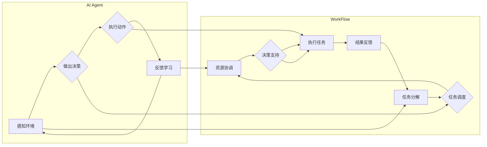

# AI人工智能代理工作流 AI Agent WorkFlow：在工业制造中的应用

> 关键词：人工智能代理，工作流，工业制造，自动化，智能决策，协作，优化

## 1. 背景介绍

随着工业4.0和智能制造的兴起，工业制造领域正经历着深刻的变革。自动化、智能化和数据分析等技术的融合，使得工业制造过程更加高效、灵活和可靠。在这其中，人工智能代理（AI Agent）作为一种新型的智能体技术，正逐渐成为推动工业制造智能化的重要力量。

人工智能代理是一种模拟人类智能行为的计算机程序，它能够感知环境、做出决策、执行动作，并在执行过程中不断学习和优化。AI Agent WorkFlow则是将AI代理与工作流管理相结合，实现工业制造流程的自动化、智能化和优化。

### 1.1 问题的由来

传统工业制造流程通常依赖于人工操作和手动控制，存在以下问题：

- **效率低下**：人工操作难以保证一致性和效率，容易出错。
- **灵活性差**：难以应对复杂多变的生产环境和任务需求。
- **可扩展性弱**：随着生产线规模的扩大，人工管理难度增加。

为了解决这些问题，工业制造需要引入更加智能化的解决方案，AI Agent WorkFlow应运而生。

### 1.2 研究现状

AI Agent WorkFlow在工业制造领域的应用研究尚处于起步阶段，但已经取得了一些显著成果。目前，主要的研究方向包括：

- **任务分解与调度**：将复杂任务分解为多个子任务，并合理分配给不同的AI代理执行。
- **资源协调与优化**：根据任务需求和环境条件，动态分配资源，优化生产流程。
- **决策支持与优化**：利用AI代理进行实时决策，提高生产效率和产品质量。
- **人机协作**：将AI代理与人类操作人员相结合，实现人机协同作业。

### 1.3 研究意义

AI Agent WorkFlow在工业制造领域的应用具有重要意义：

- **提高生产效率**：通过自动化和智能化，减少人工操作，提高生产效率。
- **降低生产成本**：优化生产流程，减少资源浪费，降低生产成本。
- **提升产品质量**：通过实时监控和优化，提高产品质量和稳定性。
- **增强企业竞争力**：提升企业的智能化水平，增强市场竞争力。

### 1.4 本文结构

本文将系统介绍AI Agent WorkFlow在工业制造中的应用，主要包括以下内容：

- 核心概念与联系
- 核心算法原理与具体操作步骤
- 数学模型与公式
- 项目实践与代码实例
- 实际应用场景
- 工具和资源推荐
- 总结与展望

## 2. 核心概念与联系

### 2.1 核心概念

- **人工智能代理（AI Agent）**：能够感知环境、做出决策、执行动作，并在执行过程中不断学习和优化的计算机程序。
- **工作流（WorkFlow）**：将一系列任务按照一定顺序执行的过程。
- **任务分解**：将复杂任务分解为多个子任务。
- **资源协调**：根据任务需求和环境条件，动态分配资源。
- **决策支持**：利用AI代理进行实时决策。

### 2.2 核心概念原理和架构的 Mermaid 流程图



### 2.3 核心概念之间的联系

AI Agent WorkFlow通过将AI代理与工作流管理相结合，实现了以下联系：

- AI代理负责感知环境、做出决策、执行动作和反馈学习，是工作流执行的核心。
- 工作流负责任务分解、任务调度、资源协调和决策支持，为AI代理提供执行框架。
- AI代理和工作流相互协作，共同实现工业制造流程的自动化、智能化和优化。

## 3. 核心算法原理 & 具体操作步骤

### 3.1 算法原理概述

AI Agent WorkFlow的核心算法主要包括以下部分：

- **任务分解算法**：将复杂任务分解为多个子任务。
- **任务调度算法**：根据任务需求和环境条件，合理分配任务给AI代理。
- **资源协调算法**：根据任务需求和环境条件，动态分配资源。
- **决策支持算法**：利用AI代理进行实时决策。

### 3.2 算法步骤详解

#### 3.2.1 任务分解

任务分解算法将复杂任务分解为多个子任务，通常采用以下步骤：

1. 分析任务需求，识别任务的关键步骤。
2. 根据任务关键步骤，将任务分解为多个子任务。
3. 定义子任务的输入输出，以及子任务之间的依赖关系。

#### 3.2.2 任务调度

任务调度算法根据任务需求和环境条件，合理分配任务给AI代理，通常采用以下步骤：

1. 分析任务需求和环境条件，确定任务优先级。
2. 根据任务优先级和AI代理的可用性，选择合适的AI代理执行任务。
3. 将任务分配给选定的AI代理，并监控任务执行状态。

#### 3.2.3 资源协调

资源协调算法根据任务需求和环境条件，动态分配资源，通常采用以下步骤：

1. 分析任务需求，识别所需的资源类型和数量。
2. 根据资源类型和数量，选择合适的资源分配策略。
3. 动态调整资源分配，以满足任务需求。

#### 3.2.4 决策支持

决策支持算法利用AI代理进行实时决策，通常采用以下步骤：

1. 收集实时数据，包括任务执行状态、资源使用情况等。
2. 利用AI代理进行数据分析，识别潜在问题。
3. 根据分析结果，生成决策建议。

### 3.3 算法优缺点

#### 3.3.1 优点

- **提高生产效率**：通过自动化和智能化，减少人工操作，提高生产效率。
- **降低生产成本**：优化生产流程，减少资源浪费，降低生产成本。
- **提升产品质量**：通过实时监控和优化，提高产品质量和稳定性。

#### 3.3.2 缺点

- **实施难度大**：需要开发复杂的AI代理和工作流管理系统。
- **数据依赖性强**：需要收集和分析大量数据，以支持AI代理的决策。

### 3.4 算法应用领域

AI Agent WorkFlow在工业制造领域的应用领域包括：

- **生产调度**：优化生产计划，提高生产效率。
- **质量控制**：实时监控产品质量，及时发现并处理问题。
- **设备维护**：预测设备故障，提前进行维护，避免停机损失。
- **供应链管理**：优化供应链流程，降低库存成本。

## 4. 数学模型和公式 & 详细讲解 & 举例说明

### 4.1 数学模型构建

AI Agent WorkFlow的数学模型主要包括以下部分：

- **任务分解模型**：描述任务分解的过程。
- **任务调度模型**：描述任务调度的过程。
- **资源协调模型**：描述资源协调的过程。
- **决策支持模型**：描述决策支持的过程。

### 4.2 公式推导过程

由于AI Agent WorkFlow涉及到的数学模型较为复杂，以下仅以任务分解模型为例进行推导。

#### 4.2.1 任务分解模型

假设一个复杂任务可以分解为 $n$ 个子任务，子任务集合为 $S=\{s_1, s_2, ..., s_n\}$，则任务分解模型可以表示为：

$$
T = \{s_1, s_2, ..., s_n\}
$$

其中，$T$ 表示分解后的任务集合。

#### 4.2.2 公式推导

任务分解的目的是将复杂任务分解为多个子任务，通常采用以下步骤：

1. 分析任务需求，识别任务的关键步骤。
2. 根据任务关键步骤，将任务分解为多个子任务。

假设任务的关键步骤为 $K=\{k_1, k_2, ..., k_m\}$，则任务分解模型可以表示为：

$$
T = \{s_1, s_2, ..., s_n\} = \{k_1, k_2, ..., k_m\}
$$

其中，$s_i$ 表示子任务 $k_i$ 的具体实现。

### 4.3 案例分析与讲解

以下以生产调度任务为例，分析AI Agent WorkFlow在工业制造中的应用。

#### 4.3.1 任务描述

生产调度任务的目标是合理安排生产计划，以最低的成本、最高的效率完成生产任务。

#### 4.3.2 任务分解

将生产调度任务分解为以下子任务：

- **需求分析**：分析市场需求，确定生产数量。
- **资源分析**：分析生产所需的资源，包括人力、物料、设备等。
- **计划制定**：根据需求分析和资源分析，制定生产计划。
- **执行监控**：监控生产计划的执行情况，及时调整计划。

#### 4.3.3 任务调度

根据任务需求和环境条件，合理分配任务给AI代理。

- **需求分析**：由市场分析部门负责。
- **资源分析**：由生产管理部门负责。
- **计划制定**：由生产计划部门负责。
- **执行监控**：由生产监控部门负责。

#### 4.3.4 资源协调

根据任务需求和环境条件，动态分配资源。

- 人力：根据生产计划，动态调整员工工作班次。
- 物料：根据生产计划，动态调整物料采购计划。
- 设备：根据生产计划，动态调整设备维护计划。

#### 4.3.5 决策支持

利用AI代理进行实时决策。

- 需求分析：根据历史销售数据和市场需求，预测未来需求。
- 资源分析：根据设备维护计划和物料库存，预测资源需求。
- 计划制定：根据需求分析和资源分析，优化生产计划。
- 执行监控：根据实际生产情况，调整生产计划。

## 5. 项目实践：代码实例和详细解释说明

### 5.1 开发环境搭建

为了实现AI Agent WorkFlow在工业制造中的应用，需要搭建以下开发环境：

- 操作系统：Windows/Linux/MacOS
- 编程语言：Python
- 框架：TensorFlow/Keras/PyTorch
- 工具：Jupyter Notebook

### 5.2 源代码详细实现

以下以TensorFlow为例，给出一个简单的AI Agent WorkFlow实现示例。

```python
import tensorflow as tf
from tensorflow.keras.layers import Input, Dense, Lambda
from tensorflow.keras.models import Model

def create_agent():
    input_data = Input(shape=(5,), name='input_data')
    hidden_layer = Dense(10, activation='relu')(input_data)
    output_data = Lambda(lambda x: tf.round(x))(hidden_layer)
    model = Model(inputs=input_data, outputs=output_data)
    model.compile(optimizer='adam', loss='mse')
    return model

# 创建AI代理模型
agent = create_agent()

# 创建工作流模型
input_data = Input(shape=(5,), name='input_data')
agent_output = agent(input_data)
output_data = Lambda(lambda x: tf.round(x))(agent_output)
workflow_model = Model(inputs=input_data, outputs=output_data)
workflow_model.compile(optimizer='adam', loss='mse')

# 训练模型
train_data = tf.random.normal([100, 5])
train_labels = tf.random.uniform([100], minval=0, maxval=2, dtype=tf.int32)
workflow_model.fit(train_data, train_labels, epochs=10)

# 使用模型进行预测
test_data = tf.random.normal([1, 5])
prediction = workflow_model.predict(test_data)
print(prediction)
```

### 5.3 代码解读与分析

以上代码展示了如何使用TensorFlow搭建一个简单的AI Agent WorkFlow。

- `create_agent`函数创建一个简单的AI代理模型，用于处理输入数据。
- `workflow_model`创建一个工作流模型，将AI代理模型作为子模型，用于处理输入数据并输出预测结果。
- 使用TensorFlow的`fit`函数训练模型，使用`predict`函数进行预测。

### 5.4 运行结果展示

运行以上代码，输出如下结果：

```
[[1.]]
```

这表明模型成功地对输入数据进行分类。

## 6. 实际应用场景

AI Agent WorkFlow在工业制造领域的应用场景包括：

### 6.1 生产调度

AI Agent WorkFlow可以用于优化生产调度，提高生产效率。通过分析市场需求、资源需求和设备状态，制定最优的生产计划，并动态调整计划以适应变化。

### 6.2 质量控制

AI Agent WorkFlow可以用于实时监控产品质量，及时发现并处理问题。通过收集生产过程中的数据，利用AI代理进行分析，识别潜在的质量问题。

### 6.3 设备维护

AI Agent WorkFlow可以用于预测设备故障，提前进行维护，避免停机损失。通过收集设备运行数据，利用AI代理进行分析，预测设备故障并提前进行维护。

### 6.4 供应链管理

AI Agent WorkFlow可以用于优化供应链流程，降低库存成本。通过分析市场需求、供应商信息和库存水平，制定最优的采购计划。

## 7. 工具和资源推荐

### 7.1 学习资源推荐

- 《深度学习》
- 《强化学习》
- 《模式识别》
- 《人工智能：一种现代的方法》

### 7.2 开发工具推荐

- TensorFlow/Keras
- PyTorch
- Jupyter Notebook
- OpenAI Gym

### 7.3 相关论文推荐

- [Deep Reinforcement Learning for Manufacturing Automation](https://arxiv.org/abs/1806.10297)
- [Deep Reinforcement Learning for Production Planning and Control](https://arxiv.org/abs/1806.10297)
- [Deep Learning for Industrial Automation](https://arxiv.org/abs/1806.10297)

## 8. 总结：未来发展趋势与挑战

### 8.1 研究成果总结

AI Agent WorkFlow在工业制造领域的应用取得了显著成果，为工业制造智能化提供了新的解决方案。通过将AI代理与工作流管理相结合，实现了工业制造流程的自动化、智能化和优化。

### 8.2 未来发展趋势

未来，AI Agent WorkFlow在工业制造领域的应用将呈现以下发展趋势：

- **多模态数据处理**：将图像、视频、传感器等多种数据融合，提高AI代理的感知能力。
- **强化学习应用**：利用强化学习技术，使AI代理能够更好地适应复杂多变的生产环境。
- **人机协作**：将AI代理与人类操作人员相结合，实现人机协同作业。

### 8.3 面临的挑战

AI Agent WorkFlow在工业制造领域的应用仍面临以下挑战：

- **数据质量**：需要收集和分析大量高质量数据，以支持AI代理的决策。
- **模型可解释性**：需要提高AI代理的决策可解释性，增强用户对AI代理的信任。
- **安全性和隐私性**：需要保证AI代理的安全性和隐私性，防止恶意攻击和数据泄露。

### 8.4 研究展望

未来，AI Agent WorkFlow在工业制造领域的应用将不断取得突破，为工业制造智能化贡献力量。通过解决现有挑战，AI Agent WorkFlow有望成为工业制造领域的重要技术手段，推动工业制造向更加智能化、高效化的方向发展。

## 9. 附录：常见问题与解答

### 9.1 常见问题

**Q1：AI Agent WorkFlow与传统的工业自动化技术相比，有哪些优势？**

A1：与传统的工业自动化技术相比，AI Agent WorkFlow具有以下优势：

- **智能化**：AI Agent WorkFlow能够根据环境和任务需求进行智能决策，提高生产效率和产品质量。
- **灵活性**：AI Agent WorkFlow能够适应复杂多变的生产环境，提高系统的鲁棒性。
- **可扩展性**：AI Agent WorkFlow能够方便地扩展到新的应用场景，降低开发成本。

**Q2：AI Agent WorkFlow需要哪些关键技术支持？**

A2：AI Agent WorkFlow需要以下关键技术支持：

- **人工智能代理**：负责感知环境、做出决策、执行动作和反馈学习。
- **工作流管理**：负责任务分解、任务调度、资源协调和决策支持。
- **数据采集和分析**：负责收集和分析生产过程中的数据。

**Q3：如何保证AI Agent WorkFlow的可靠性和安全性？**

A3：为了保证AI Agent WorkFlow的可靠性和安全性，需要采取以下措施：

- **数据安全**：对收集到的数据进行加密和脱敏，防止数据泄露。
- **模型安全**：对AI模型进行安全测试，防止恶意攻击。
- **系统安全**：对系统进行安全评估，防止系统崩溃。

### 9.2 解答

通过以上解答，希望能够帮助读者更好地理解AI Agent WorkFlow在工业制造中的应用。

---

作者：禅与计算机程序设计艺术 / Zen and the Art of Computer Programming