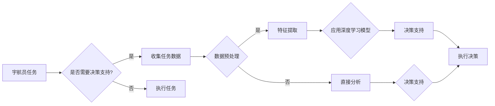

> 关键词：AI，太空探索，宇航员决策，深度学习，机器学习，人机交互，数据分析，任务规划

# AI在太空探索中的应用:辅助宇航员决策

### 1. 背景介绍

自人类踏上太空探索之旅以来，宇航员在任务执行过程中需要处理的信息量巨大，决策过程复杂。随着人工智能（AI）技术的飞速发展，将AI应用于太空探索，辅助宇航员进行决策，成为了一个热门的研究方向。AI在太空探索中的应用不仅能够提高任务执行的效率和安全性，还能拓展人类探索宇宙的边界。

### 2. 核心概念与联系

#### 2.1 核心概念原理

在太空探索中，AI辅助宇航员决策的核心概念包括：

- **机器学习（Machine Learning）**：通过算法使计算机能够从数据中学习并做出决策。
- **深度学习（Deep Learning）**：一种特殊的机器学习技术，通过多层神经网络模拟人脑处理信息的过程。
- **人机交互（Human-Machine Interaction, HMI）**：研究人与计算机系统之间交互的学科，旨在设计出更符合人类使用习惯的系统。
- **任务规划（Mission Planning）**：制定任务执行的详细计划，包括路径规划、时间安排、资源分配等。
- **数据分析（Data Analysis）**：从大量数据中提取有价值的信息和模式。

#### 2.2 架构流程图

以下是AI辅助宇航员决策的Mermaid流程图：



### 3. 核心算法原理 & 具体操作步骤

#### 3.1 算法原理概述

AI辅助宇航员决策的算法原理主要包括以下几个步骤：

1. **数据收集**：收集任务相关的各种数据，包括传感器数据、历史任务数据、宇航员操作数据等。
2. **数据预处理**：对收集到的数据进行清洗、去噪、格式化等处理，以便后续分析。
3. **特征提取**：从预处理后的数据中提取出对任务执行和决策有用的特征。
4. **模型训练**：使用深度学习模型对提取的特征进行训练，使其能够对任务执行和决策提供支持。
5. **决策支持**：将训练好的模型应用于新的任务场景，为宇航员提供决策支持。

#### 3.2 算法步骤详解

1. **数据收集**：根据任务需求，收集相关的传感器数据、历史任务数据、宇航员操作数据等。
2. **数据预处理**：对收集到的数据进行清洗、去噪、格式化等处理，以便后续分析。
3. **特征提取**：使用特征提取技术，如主成分分析（PCA）、特征选择等，从预处理后的数据中提取出对任务执行和决策有用的特征。
4. **模型训练**：
    - **选择模型**：选择合适的深度学习模型，如卷积神经网络（CNN）、循环神经网络（RNN）、长短期记忆网络（LSTM）等。
    - **训练模型**：使用训练数据对模型进行训练，调整模型参数，使其能够对任务执行和决策提供支持。
5. **决策支持**：
    - **预测**：将训练好的模型应用于新的任务场景，预测可能的结果。
    - **推荐**：根据预测结果，为宇航员提供决策建议。

#### 3.3 算法优缺点

**优点**：

- **提高效率**：AI可以快速处理和分析大量数据，提高任务执行的效率。
- **减少错误**：AI可以帮助宇航员识别潜在的风险和问题，减少人为错误。
- **适应性**：AI可以根据新的数据和任务需求进行自我学习和调整。

**缺点**：

- **依赖数据**：AI的效率和准确性很大程度上取决于数据的质量和数量。
- **缺乏直觉**：AI缺乏人类的直觉和经验，可能在某些情况下做出错误的决策。
- **可解释性**：AI的决策过程通常难以解释，可能导致信任问题。

#### 3.4 算法应用领域

AI在太空探索中的应用领域包括：

- **导航和飞行控制**：辅助宇航员进行飞行路径规划、姿态控制和自动着陆。
- **任务规划**：辅助宇航员制定任务执行的详细计划。
- **健康监测**：监测宇航员健康状况，及时发现异常。
- **故障诊断**：自动诊断设备故障，并提出解决方案。
- **科学实验**：辅助宇航员进行科学实验的设计和执行。

### 4. 数学模型和公式 & 详细讲解 & 举例说明

#### 4.1 数学模型构建

在AI辅助宇航员决策中，常用的数学模型包括：

- **神经网络**：使用神经网络模型对数据进行分析和预测。
- **决策树**：使用决策树模型对任务执行和决策进行支持。
- **支持向量机（SVM）**：使用SVM模型进行分类和回归。

#### 4.2 公式推导过程

以神经网络为例，其基本公式如下：

$$
y = f(W \cdot x + b)
$$

其中，$y$ 为输出，$W$ 为权重，$x$ 为输入，$b$ 为偏置，$f$ 为激活函数。

#### 4.3 案例分析与讲解

以导航和飞行控制为例，假设我们需要使用神经网络模型预测飞行路径。我们可以将飞行路径的坐标作为输入，将目标坐标作为输出。通过训练神经网络模型，使其能够根据当前的飞行状态预测未来的飞行路径。

### 5. 项目实践：代码实例和详细解释说明

#### 5.1 开发环境搭建

在Python中，我们可以使用TensorFlow或PyTorch等框架来构建和训练AI模型。

#### 5.2 源代码详细实现

以下是一个使用TensorFlow构建神经网络模型的简单示例：

```python
import tensorflow as tf

model = tf.keras.Sequential([
    tf.keras.layers.Dense(64, activation='relu', input_shape=(input_shape)),
    tf.keras.layers.Dense(64, activation='relu'),
    tf.keras.layers.Dense(output_shape, activation='linear')
])

model.compile(optimizer='adam',
              loss='mean_squared_error',
              metrics=['accuracy'])
```

#### 5.3 代码解读与分析

以上代码定义了一个简单的神经网络模型，包含两个隐藏层。输入层和输出层的大小分别由 `input_shape` 和 `output_shape` 决定。使用 `adam` 优化器进行训练，使用 `mean_squared_error` 损失函数和 `accuracy` 指标来评估模型性能。

#### 5.4 运行结果展示

在实际运行模型之前，我们需要准备数据并进行预处理。以下是运行模型的示例代码：

```python
model.fit(x_train, y_train, epochs=10, batch_size=32)
```

### 6. 实际应用场景

AI在太空探索中的应用场景包括：

- **国际空间站（ISS）**：AI可以用于监测ISS的运行状态，及时发现故障并给出解决方案。
- **月球和火星探测**：AI可以用于规划探测任务，分析探测数据，辅助科学家进行科学研究。
- **星际旅行**：AI可以用于自动驾驶、生命保障系统等。

### 6.4 未来应用展望

随着AI技术的不断发展，未来AI在太空探索中的应用将更加广泛，包括：

- **自主决策**：AI将能够自主进行任务执行和决策，减少对宇航员的依赖。
- **虚拟现实（VR）和增强现实（AR）**：AI可以与VR和AR技术结合，为宇航员提供更加沉浸式的训练和任务体验。
- **量子计算**：AI可以与量子计算结合，处理更加复杂的计算任务。

### 7. 工具和资源推荐

#### 7.1 学习资源推荐

- **《深度学习》（Goodfellow等著）**：介绍深度学习的基本原理和算法。
- **《神经网络与深度学习》（邱锡鹏著）**：介绍神经网络的基本原理和深度学习算法。
- **《机器学习实战》（Peter Harrington著）**：提供机器学习算法的实战案例。

#### 7.2 开发工具推荐

- **TensorFlow**：一个开源的深度学习框架。
- **PyTorch**：一个开源的深度学习框架。
- **Keras**：一个高级神经网络API。

#### 7.3 相关论文推荐

- **"Deep Learning for Space Exploration"（Dzhanidze等，2017）**
- **"Machine Learning in Space Exploration"（Bharath等，2018）**
- **"Deep Learning for Robotics"（Liu等，2019）**

### 8. 总结：未来发展趋势与挑战

#### 8.1 研究成果总结

AI在太空探索中的应用取得了显著的成果，为宇航员提供了强大的决策支持。随着AI技术的不断发展，AI在太空探索中的应用将更加广泛，为人类探索宇宙的边界提供更多可能性。

#### 8.2 未来发展趋势

- **更加智能的AI**：AI将能够自主进行更加复杂的任务执行和决策。
- **更加高效的算法**：新的算法将进一步提高AI的效率和准确性。
- **更加安全的AI**：AI将能够更好地保护宇航员的安全。

#### 8.3 面临的挑战

- **数据质量**：AI的效率和准确性很大程度上取决于数据的质量。
- **可解释性**：AI的决策过程通常难以解释，可能导致信任问题。
- **伦理问题**：AI的应用需要考虑伦理问题，如隐私保护、决策透明度等。

#### 8.4 研究展望

未来，AI在太空探索中的应用将面临更多挑战，但同时也充满机遇。通过不断技术创新和伦理思考，AI将为人类探索宇宙的边界提供更多可能性。

---

作者：禅与计算机程序设计艺术 / Zen and the Art of Computer Programming