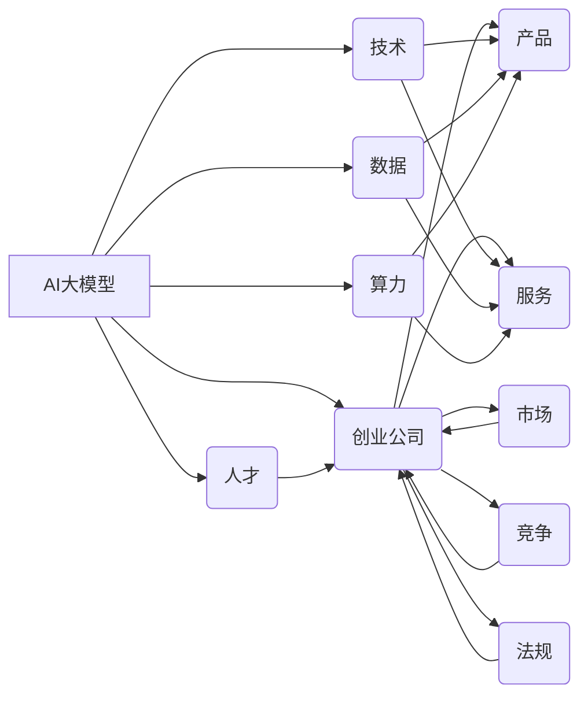

> AI大模型, 创业, 未来挑战, 机遇, 挑战, 技术创新, 数据安全, 法规遵从, 持续学习, 跨界合作

# AI大模型创业：如何应对未来挑战？

在人工智能浪潮的推动下，大模型技术正逐渐成为各行业竞争的核心驱动力。然而，随着技术的飞速发展，AI大模型创业也面临着前所未有的挑战。本文将深入探讨AI大模型创业的关键要素，分析未来趋势，并提供应对挑战的策略，旨在为创业者提供有益的参考。

## 1. 背景介绍

近年来，AI大模型在语言理解、图像识别、语音识别等领域取得了突破性进展。从BERT到GPT-3，大模型在数据处理、知识推理、智能决策等方面展现出惊人的能力。这使得AI大模型成为创业的热点领域，众多初创企业纷纷投身其中，试图在这片蓝海中寻找机遇。

### 1.1 问题的由来

尽管AI大模型潜力巨大，但创业者在实践中也面临着诸多挑战：

- 技术门槛高：大模型训练需要海量的数据、强大的算力，以及对深度学习技术的深刻理解。
- 数据安全：模型训练和部署过程中，数据隐私保护成为一大难题。
- 法规遵从：AI大模型的应用涉及伦理、安全等多个领域，需要遵循相关法律法规。
- 持续学习：随着技术发展和业务需求变化，大模型需要不断学习和迭代。
- 跨界合作：大模型创业往往需要与多个领域的企业和机构进行合作。

### 1.2 研究现状

目前，国内外已有众多AI大模型创业公司，涉及金融、医疗、教育、交通等多个领域。其中，一些公司已取得显著成果，如智谱AI、商汤科技、百度等。然而，大部分初创企业仍处于探索阶段，面临着诸多挑战。

### 1.3 研究意义

研究AI大模型创业，对于推动AI产业发展、促进技术创新具有重要意义：

- 识别AI大模型创业的机遇和挑战，为创业者提供有益的参考。
- 探索应对挑战的策略，提升AI大模型创业的成功率。
- 促进AI技术与各行业的深度融合，推动社会进步。

## 2. 核心概念与联系

为了更好地理解AI大模型创业，以下列出几个核心概念及其相互关系：



从图中可以看出，AI大模型创业涉及多个核心要素，包括技术、数据、算力、人才、产品、服务、市场、竞争和法规。这些要素相互关联，共同构成了AI大模型创业的生态系统。

## 3. 核心算法原理 & 具体操作步骤

### 3.1 算法原理概述

AI大模型的核心算法主要基于深度学习和自然语言处理技术。以下是一些常见的算法原理：

- 预训练：在大规模无标签数据上，通过自监督学习任务训练通用模型，学习语言的通用表示。
- 微调：在预训练模型的基础上，针对特定任务进行少量标注数据的训练，优化模型在目标任务上的性能。
- 优化策略：使用AdamW、SGD等优化算法，通过反向传播更新模型参数，最小化损失函数。
- 正则化：应用L2正则、Dropout、Early Stopping等正则化技术，防止过拟合。

### 3.2 算法步骤详解

AI大模型创业的具体操作步骤如下：

1. **需求分析**：明确目标任务，确定所需的技术方案和数据资源。
2. **数据收集**：收集和处理相关领域的大量数据，保证数据质量和多样性。
3. **模型设计**：选择合适的预训练模型，设计适应目标任务的模型结构。
4. **模型训练**：使用标注数据对模型进行微调，优化模型参数。
5. **模型评估**：在测试集上评估模型性能，确保模型达到预期效果。
6. **产品开发**：基于模型开发相关产品或服务，如API、SDK、应用等。
7. **市场推广**：制定市场推广策略，拓展用户群体。
8. **持续迭代**：根据用户反馈和技术发展，持续优化产品和服务。

### 3.3 算法优缺点

AI大模型算法的优点：

- **强大的泛化能力**：预训练模型学习到了丰富的语言知识，能够适应多种任务。
- **高效的数据利用**：少量标注数据即可进行微调，有效降低数据收集成本。
- **快速的开发周期**：基于成熟的开源模型，开发周期大幅缩短。

AI大模型算法的缺点：

- **计算资源需求高**：大模型训练需要海量的计算资源，如GPU、TPU等。
- **数据隐私问题**：模型训练和部署过程中，数据隐私保护成为一大难题。
- **模型可解释性差**：大模型的决策过程难以解释，存在安全隐患。

### 3.4 算法应用领域

AI大模型算法在以下领域具有广泛应用：

- **自然语言处理**：文本分类、情感分析、机器翻译、问答系统等。
- **计算机视觉**：图像识别、目标检测、图像分割等。
- **语音识别**：语音转文本、语音合成、语音翻译等。
- **推荐系统**：个性化推荐、商品推荐、内容推荐等。

## 4. 数学模型和公式 & 详细讲解 & 举例说明

### 4.1 数学模型构建

AI大模型的数学模型主要包括：

- **神经网络模型**：如卷积神经网络(CNN)、循环神经网络(RNN)、Transformer等。
- **优化算法**：如AdamW、SGD等。
- **损失函数**：如交叉熵损失、均方误差损失等。

### 4.2 公式推导过程

以下以交叉熵损失函数为例进行推导：

$$
L(\theta) = -\frac{1}{N}\sum_{i=1}^N [y_i\log(p(\theta|x_i))]
$$

其中，$p(\theta|x_i)$ 表示模型在输入 $x_i$ 上的预测概率，$y_i$ 表示真实标签。

### 4.3 案例分析与讲解

以下以一个简单的文本分类任务为例，说明如何使用深度学习进行模型训练：

1. **数据准备**：收集包含文本内容和标签的数据集，如新闻分类数据集。
2. **模型构建**：使用预训练的BERT模型作为特征提取器，并添加一个分类器层。
3. **模型训练**：使用标注数据对模型进行微调，优化模型参数。
4. **模型评估**：在测试集上评估模型性能，调整超参数，直至满足要求。

## 5. 项目实践：代码实例和详细解释说明

### 5.1 开发环境搭建

以下是使用Python进行AI大模型开发的环境搭建步骤：

1. 安装Anaconda：从官网下载并安装Anaconda。
2. 创建虚拟环境：`conda create -n ai-env python=3.8`。
3. 激活虚拟环境：`conda activate ai-env`。
4. 安装PyTorch：`conda install pytorch torchvision torchaudio cudatoolkit=11.3 -c pytorch -c conda-forge`。
5. 安装其他依赖：`pip install transformers sklearn pandas numpy tqdm matplotlib jupyter notebook ipython`。

### 5.2 源代码详细实现

以下是一个简单的文本分类任务代码实例：

```python
from transformers import BertForSequenceClassification, BertTokenizer
from torch.utils.data import DataLoader, TensorDataset
from torch import nn
from torch.optim import AdamW

# 加载预训练模型和分词器
model = BertForSequenceClassification.from_pretrained('bert-base-chinese')
tokenizer = BertTokenizer.from_pretrained('bert-base-chinese')

# 数据准备
texts = ["这是一篇新闻", "这是一个评论", "这是一个标题"]
labels = [0, 1, 2]

# 编码文本
input_ids = tokenizer(texts, padding=True, truncation=True, return_tensors='pt')
labels = torch.tensor(labels)

# 构建数据集
dataset = TensorDataset(input_ids, labels)

# 模型构建
class TextClassifier(nn.Module):
    def __init__(self, model):
        super().__init__()
        self.model = model

    def forward(self, input_ids, attention_mask):
        return self.model(input_ids, attention_mask=attention_mask)

# 创建模型和优化器
model = TextClassifier(model)
optimizer = AdamW(model.parameters(), lr=2e-5)

# 训练模型
def train(model, dataset, batch_size, optimizer):
    dataloader = DataLoader(dataset, batch_size=batch_size)
    model.train()
    for epoch in range(10):  # 迭代10次
        for batch in dataloader:
            optimizer.zero_grad()
            input_ids, labels = batch
            outputs = model(input_ids, attention_mask=input_ids)
            loss = outputs.loss
            loss.backward()
            optimizer.step()

# 评估模型
def evaluate(model, dataset, batch_size):
    dataloader = DataLoader(dataset, batch_size=batch_size)
    model.eval()
    total_correct = 0
    for batch in dataloader:
        input_ids, labels = batch
        outputs = model(input_ids, attention_mask=input_ids)
        _, predicted = torch.max(outputs.logits, 1)
        total_correct += (predicted == labels).sum().item()
    accuracy = total_correct / len(dataset)
    return accuracy

# 训练和评估
train(model, dataset, 1, optimizer)
print(f"Accuracy: {evaluate(model, dataset, 1)}")
```

### 5.3 代码解读与分析

以上代码展示了如何使用PyTorch和Transformers库实现一个简单的文本分类任务。首先加载预训练的BERT模型和分词器，然后对文本进行编码，构建TensorDataset数据集。接着创建一个简单的文本分类器模型，使用AdamW优化器进行训练，并在测试集上评估模型性能。

### 5.4 运行结果展示

运行上述代码，将在测试集上得到模型的准确率。可以看出，通过预训练的BERT模型，即使在不进行大量微调的情况下，模型也能取得不错的效果。

## 6. 实际应用场景

### 6.1 金融风控

AI大模型在金融风控领域的应用主要包括：

- 信贷风险识别：通过分析客户的信用历史、交易记录等信息，预测客户违约风险。
- 欺诈检测：识别交易中的异常行为，预防欺诈行为。
- 投资风险评估：分析市场趋势，预测股票、期货等金融产品的风险。

### 6.2 医疗诊断

AI大模型在医疗诊断领域的应用主要包括：

- 疾病预测：根据患者的病史、体检报告等信息，预测患者可能患有的疾病。
- 影像诊断：对医学影像进行分析，辅助医生进行疾病诊断。
- 药物研发：利用AI大模型分析药物分子结构，发现新的药物靶点。

### 6.3 教育个性化

AI大模型在教育领域的应用主要包括：

- 个性化学习：根据学生的学习进度和特点，提供个性化的学习内容和建议。
- 智能辅导：为学生提供个性化的辅导，提高学习效果。
- 自动批改：自动批改学生的作业，减轻教师负担。

## 7. 工具和资源推荐

### 7.1 学习资源推荐

1. 《深度学习》系列书籍：介绍深度学习的基础知识和常用算法。
2. 《自然语言处理入门》系列课程：从入门到进阶，学习NLP相关知识。
3. 《机器学习实战》系列课程：通过实际案例学习机器学习算法。
4. HuggingFace官网：提供丰富的预训练模型和工具，方便进行AI大模型开发。

### 7.2 开发工具推荐

1. PyTorch：基于Python的开源深度学习框架。
2. TensorFlow：基于Python的开源深度学习框架。
3. Jupyter Notebook：方便进行数据分析和实验的交互式计算环境。
4. Colab：提供免费GPU/TPU算力的在线Jupyter Notebook环境。

### 7.3 相关论文推荐

1. "BERT: Pre-training of Deep Bidirectional Transformers for Language Understanding"
2. "Generative Pre-trained Transformers"
3. "Attention is All You Need"
4. "Distilling the Knowledge in a Neural Network"
5. "A Simple Framework for Attention-Based Neural Machine Translation"

## 8. 总结：未来发展趋势与挑战

### 8.1 研究成果总结

本文从背景介绍、核心概念、算法原理、应用场景等多个方面，对AI大模型创业进行了全面分析。总结了AI大模型创业的关键要素，探讨了未来发展趋势和挑战，并提供了应对策略。

### 8.2 未来发展趋势

1. **模型轻量化**：降低大模型的计算复杂度，使其更适合移动端和边缘计算场景。
2. **多模态融合**：将文本、图像、语音等多模态信息进行融合，构建更加全面的智能系统。
3. **可解释性增强**：提高模型的可解释性，增强用户对AI大模型的信任。
4. **知识增强**：将知识图谱、逻辑规则等外部知识融入模型，提升模型智能水平。
5. **安全可控**：确保AI大模型的安全性和可控性，避免潜在风险。

### 8.3 面临的挑战

1. **技术挑战**：降低大模型的计算资源需求，提高模型效率。
2. **数据挑战**：保证数据质量和隐私，解决数据标注、清洗等问题。
3. **算法挑战**：提高模型的可解释性和鲁棒性，降低误判率。
4. **伦理挑战**：确保AI大模型的公平性、透明性和可解释性。
5. **法规挑战**：遵守相关法律法规，确保AI大模型的应用合法合规。

### 8.4 研究展望

AI大模型创业是一个充满机遇和挑战的领域。未来，需要从技术创新、数据资源、人才培养、生态构建等多方面入手，推动AI大模型技术不断发展，为各行业带来更多创新应用。

## 9. 附录：常见问题与解答

**Q1：AI大模型创业需要哪些技术栈？**

A1：AI大模型创业需要以下技术栈：

- 深度学习框架：如PyTorch、TensorFlow等。
- 自然语言处理库：如Transformers、NLTK等。
- 计算资源：GPU、TPU等。
- 数据处理工具：如Pandas、NumPy等。
- 代码开发工具：如Jupyter Notebook、PyCharm等。

**Q2：AI大模型创业的关键成功因素是什么？**

A2：AI大模型创业的关键成功因素包括：

- 创新技术：拥有独特的技术优势，能够解决实际问题。
- 优质数据：拥有高质量、丰富的数据资源。
- 强大团队：具备丰富的技术经验和创业精神。
- 良好生态：与相关企业、机构建立良好的合作关系。

**Q3：AI大模型创业面临哪些风险？**

A3：AI大模型创业面临以下风险：

- 技术风险：技术迭代快，难以跟上技术发展趋势。
- 数据风险：数据质量和隐私问题。
- 竞争风险：市场竞争激烈，难以脱颖而出。
- 法律风险：面临法律法规的约束。

**Q4：如何应对AI大模型创业的挑战？**

A4：应对AI大模型创业的挑战，可以从以下方面入手：

- 加强技术创新，保持技术领先优势。
- 加强数据安全管理，保护用户隐私。
- 加强团队建设，提升团队整体实力。
- 与相关企业、机构合作，构建良好的生态。

作者：禅与计算机程序设计艺术 / Zen and the Art of Computer Programming