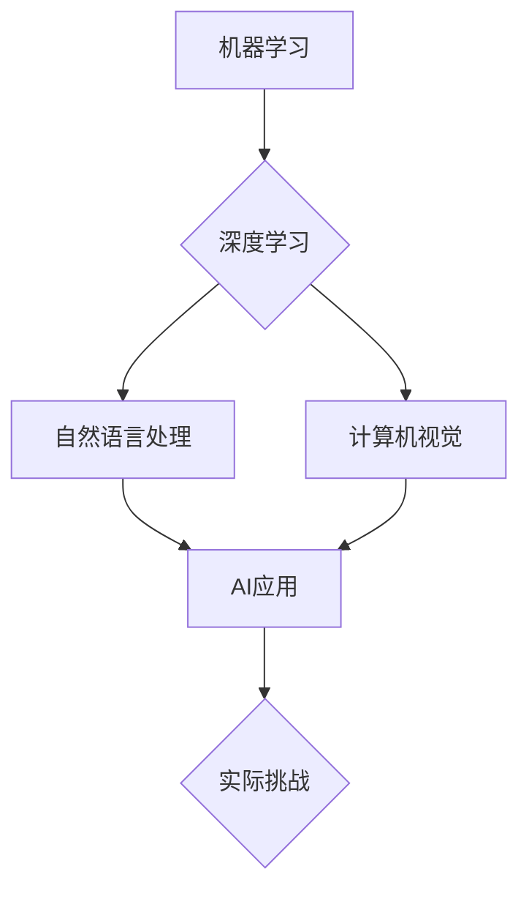

> 关键词：人工智能，应用挑战，技术瓶颈，伦理问题，可持续发展，集成与创新

# AI技术在实际应用中的挑战

随着人工智能技术的飞速发展，它已经在各行各业中展现出巨大的潜力。从智能助手到自动驾驶，从医疗诊断到金融服务，AI的应用几乎触及了生活的每一个角落。然而，尽管AI技术取得了显著的进步，其在实际应用中仍然面临着诸多挑战。本文将深入探讨AI技术在实际应用中遇到的挑战，并展望其未来的发展趋势。

## 1. 背景介绍

人工智能（AI）是指由人制造出来的系统所表现出的智能行为。这些系统可以学习、推理、感知、理解和创造。近年来，随着计算能力的提升、大数据的积累以及深度学习等技术的突破，AI技术取得了前所未有的进展。然而，在实际应用中，AI技术仍然面临着一系列挑战，这些挑战不仅涉及技术层面，还包括伦理、社会和经济等方面。

## 2. 核心概念与联系

### 2.1 AI技术核心概念

- **机器学习（Machine Learning）**：机器学习是AI的核心组成部分，它使计算机能够从数据中学习并做出决策或预测，而不是通过明确的编程指令。

- **深度学习（Deep Learning）**：深度学习是机器学习的一种，它使用多层神经网络模拟人脑处理信息的方式。

- **自然语言处理（Natural Language Processing，NLP）**：NLP是AI的一个分支，它使计算机能够理解、解释和生成人类语言。

- **计算机视觉（Computer Vision）**：计算机视觉使计算机能够从图像或视频中理解场景和对象。

### 2.2 Mermaid 流程图



## 3. 核心算法原理 & 具体操作步骤

### 3.1 算法原理概述

AI技术的核心是算法，这些算法使得机器能够执行复杂任务。以下是一些关键的AI算法：

- **神经网络（Neural Networks）**：模拟人脑神经元连接的算法，用于处理复杂数据。

- **强化学习（Reinforcement Learning）**：通过奖励和惩罚机制使机器学习如何进行决策。

- **生成对抗网络（GANs）**：由两个神经网络组成的模型，用于生成数据或图像。

### 3.2 算法步骤详解

AI应用开发通常包括以下步骤：

1. **问题定义**：明确AI要解决的问题和目标。
2. **数据收集**：收集相关数据用于训练和测试AI模型。
3. **数据预处理**：清洗和转换数据，以便模型可以处理。
4. **模型选择**：选择合适的算法和模型。
5. **模型训练**：使用训练数据训练模型。
6. **模型评估**：评估模型的性能。
7. **部署**：将模型部署到实际应用中。

### 3.3 算法优缺点

每种AI算法都有其优缺点：

- **神经网络**：能够处理复杂任务，但训练时间长，需要大量数据。
- **强化学习**：能够学习复杂策略，但需要大量时间和计算资源。
- **GANs**：能够生成高质量数据，但训练不稳定，难以控制生成数据的分布。

### 3.4 算法应用领域

AI算法应用广泛，包括：

- **医疗诊断**：辅助医生进行疾病诊断。
- **自动驾驶**：实现无人驾驶汽车。
- **金融分析**：用于风险评估和欺诈检测。

## 4. 数学模型和公式 & 详细讲解 & 举例说明

### 4.1 数学模型构建

AI模型通常涉及复杂的数学公式。以下是一个简单的神经网络数学模型：

$$
y = \sigma(W \cdot x + b)
$$

其中 $y$ 是输出，$W$ 是权重矩阵，$x$ 是输入，$b$ 是偏置，$\sigma$ 是激活函数。

### 4.2 公式推导过程

神经网络的训练通常涉及梯度下降法，以下是一个简单的梯度下降公式：

$$
W_{\text{new}} = W_{\text{old}} - \alpha \cdot \nabla_W J(W)
$$

其中 $W_{\text{new}}$ 是新的权重，$W_{\text{old}}$ 是旧的权重，$\alpha$ 是学习率，$J(W)$ 是损失函数。

### 4.3 案例分析与讲解

以自动驾驶为例，AI模型需要处理来自摄像头、雷达和传感器的数据，以识别道路上的障碍物和交通标志。模型通过学习大量数据，能够识别不同的场景，并在驾驶时做出决策。

## 5. 项目实践：代码实例和详细解释说明

### 5.1 开发环境搭建

为了进行AI项目实践，需要以下开发环境：

- 操作系统：Linux或MacOS
- 编程语言：Python
- 框架：TensorFlow或PyTorch
- 数据集：Keras Datasets或PyTorch Datasets

### 5.2 源代码详细实现

以下是一个简单的神经网络代码示例：

```python
import torch
import torch.nn as nn

class SimpleNN(nn.Module):
    def __init__(self):
        super(SimpleNN, self).__init__()
        self.fc1 = nn.Linear(784, 128)
        self.fc2 = nn.Linear(128, 10)

    def forward(self, x):
        x = torch.relu(self.fc1(x))
        x = self.fc2(x)
        return x

# 创建模型实例
model = SimpleNN()
```

### 5.3 代码解读与分析

这个简单的神经网络模型包含两个全连接层，每个层之间有一个ReLU激活函数。模型的输入是一个784维的向量，输出是一个10维的向量，对应10个类别。

### 5.4 运行结果展示

运行此代码将创建一个简单的神经网络模型，可以用于图像分类等任务。

## 6. 实际应用场景

AI技术已经在许多领域得到应用，以下是一些例子：

- **医疗诊断**：AI可以帮助医生进行疾病诊断，提高诊断的准确性和效率。
- **金融分析**：AI可以用于风险评估、欺诈检测和投资建议。
- **工业自动化**：AI可以用于优化生产流程、预测维护和质量管理。

## 7. 工具和资源推荐

### 7.1 学习资源推荐

- 《深度学习》（Goodfellow, Bengio, Courville）
- Coursera上的《机器学习》课程
- fast.ai的《Practical Deep Learning for Coders》课程

### 7.2 开发工具推荐

- TensorFlow
- PyTorch
- Keras

### 7.3 相关论文推荐

- "Playing Atari with Deep Reinforcement Learning" (Silver et al., 2016)
- "Generative Adversarial Nets" (Goodfellow et al., 2014)
- "BERT: Pre-training of Deep Bidirectional Transformers for Language Understanding" (Devlin et al., 2018)

## 8. 总结：未来发展趋势与挑战

### 8.1 研究成果总结

AI技术已经取得了显著的进展，并在许多领域取得了成功。然而，AI技术在实际应用中仍然面临着许多挑战。

### 8.2 未来发展趋势

未来，AI技术将朝着以下方向发展：

- **更强大的模型**：随着计算能力的提升，AI模型将变得更加复杂和强大。
- **更加高效的数据处理**：AI将能够处理更多的数据，并以更高的效率进行分析。
- **更加通用的AI**：未来的AI将能够执行更广泛的任务，而不仅仅是特定任务。

### 8.3 面临的挑战

AI技术在实际应用中面临的挑战包括：

- **数据隐私**：如何保护用户数据隐私是一个重要问题。
- **算法偏见**：AI算法可能存在偏见，导致不公平的结果。
- **伦理问题**：AI的应用可能引发伦理问题，例如机器人权利和自动化失业。

### 8.4 研究展望

为了克服这些挑战，未来的研究将集中在以下方面：

- **可解释AI**：开发可解释的AI模型，使其决策过程更加透明。
- **可信赖AI**：确保AI系统的可靠性和安全性。
- **公平AI**：开发避免偏见和歧视的AI模型。

## 9. 附录：常见问题与解答

**Q1：AI技术是否会导致大规模失业？**

A：AI技术可能会取代一些低技能的工作，但也会创造新的就业机会。长期来看，AI技术将促进劳动力的转型和技能升级。

**Q2：如何确保AI系统的安全性？**

A：确保AI系统的安全性需要从设计、开发、部署和维护等各个环节进行综合考虑，包括数据安全、模型安全、系统安全等。

**Q3：AI技术是否会导致算法偏见？**

A：AI技术可能会加剧现有的社会偏见，因此开发公平的AI模型是一个重要挑战。需要采取措施，如数据清洗、算法评估和透明度等，以减少偏见。

**Q4：AI技术如何影响医疗行业？**

A：AI技术可以辅助医生进行诊断和治疗，提高医疗服务的质量和效率。然而，也需要关注AI技术在医疗领域的伦理和隐私问题。

**Q5：AI技术是否可以完全替代人类？**

A：AI技术可以执行许多复杂的任务，但人类的创造力、同理心和道德判断是AI无法完全替代的。

---

作者：禅与计算机程序设计艺术 / Zen and the Art of Computer Programming