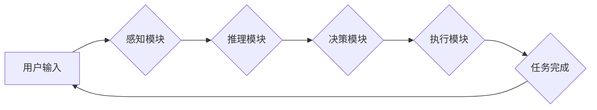

## 【大模型应用开发 动手做AI Agent】创建助手

> 关键词：大模型、AI Agent、应用开发、自然语言处理、对话系统、知识图谱、机器学习、深度学习

### 1. 背景介绍

近年来，大模型技术取得了飞速发展，其强大的泛化能力和表示能力为人工智能领域带来了革命性的变革。大模型能够处理海量文本数据，学习复杂的语言模式，并生成高质量的文本、图像、代码等内容。 

然而，单纯的模型训练并不能完全发挥大模型的价值。将大模型应用于实际场景，构建能够真正解决用户问题的AI Agent，是当前人工智能研究的热点方向之一。

AI Agent是指能够感知环境、理解用户需求、自主决策并执行任务的智能软件实体。它可以像人类一样与用户进行交互，提供个性化服务，并不断学习和进化。

### 2. 核心概念与联系

#### 2.1 大模型

大模型是指参数量达到数亿甚至数千亿的深度学习模型。它们通过训练海量文本数据，学习语言的语法、语义和上下文关系，从而具备强大的文本理解和生成能力。

#### 2.2 AI Agent

AI Agent是能够自主执行任务的智能软件实体。它通常由以下几个核心组件组成：

* **感知模块:** 收集环境信息，例如用户输入、传感器数据等。
* **推理模块:** 分析环境信息，理解用户需求和任务目标。
* **决策模块:** 根据推理结果，选择最优行动方案。
* **执行模块:** 执行决策，与环境交互，完成任务。

#### 2.3 核心概念联系

大模型可以为AI Agent提供强大的能力支持，例如：

* **自然语言理解:** 大模型可以理解用户的自然语言输入，提取关键信息，并将其转化为机器可理解的格式。
* **对话生成:** 大模型可以生成自然流畅的对话文本，与用户进行交互式对话。
* **知识推理:** 大模型可以学习知识图谱，进行逻辑推理，回答用户的问题。
* **任务执行:** 大模型可以根据用户指令，执行各种任务，例如搜索信息、撰写文档、控制设备等。

**Mermaid 流程图**



### 3. 核心算法原理 & 具体操作步骤

#### 3.1 算法原理概述

构建AI Agent的核心算法主要包括：

* **自然语言处理 (NLP):** 用于理解和生成人类语言。
* **机器学习 (ML):** 用于训练模型，使其能够从数据中学习。
* **深度学习 (DL):** 用于构建更复杂的模型，例如Transformer模型。
* **强化学习 (RL):** 用于训练模型，使其能够在环境中学习最佳策略。

#### 3.2 算法步骤详解

1. **数据收集和预处理:** 收集与任务相关的文本数据，并进行清洗、分词、标注等预处理操作。
2. **模型选择和训练:** 选择合适的NLP、ML或DL模型，并使用预处理后的数据进行训练。
3. **模型评估和优化:** 使用测试数据评估模型性能，并根据评估结果调整模型参数或结构，提高模型精度。
4. **部署和运行:** 将训练好的模型部署到服务器或云平台，并将其集成到AI Agent的系统中。

#### 3.3 算法优缺点

**优点:**

* **高精度:** 大模型和深度学习算法能够实现高精度的文本理解和生成。
* **泛化能力强:** 大模型能够学习到语言的通用规律，对新的文本数据具有较强的泛化能力。
* **个性化服务:** AI Agent可以根据用户的历史数据和偏好，提供个性化的服务。

**缺点:**

* **训练成本高:** 大模型的训练需要大量的计算资源和时间。
* **数据依赖性强:** 模型性能受训练数据质量的影响较大。
* **解释性差:** 深度学习模型的决策过程难以解释，缺乏透明度。

#### 3.4 算法应用领域

* **聊天机器人:** 提供智能客服、陪伴聊天等服务。
* **虚拟助理:** 帮助用户完成日常任务，例如日程安排、信息查询等。
* **内容创作:** 生成文章、故事、诗歌等创意内容。
* **教育辅助:** 提供个性化学习辅导、智能答疑等服务。
* **医疗辅助:** 辅助医生诊断疾病、分析病历等。

### 4. 数学模型和公式 & 详细讲解 & 举例说明

#### 4.1 数学模型构建

大模型的训练通常基于Transformer模型架构，其核心是**自注意力机制 (Self-Attention)**。

自注意力机制允许模型在处理文本序列时，关注不同位置的词语之间的关系，从而更好地理解上下文信息。

#### 4.2 公式推导过程

**注意力权重计算公式:**

$$
\text{Attention}(Q, K, V) = \text{softmax}\left(\frac{Q K^T}{\sqrt{d_k}}\right) V
$$

其中:

* $Q$: 查询矩阵
* $K$: 键矩阵
* $V$: 值矩阵
* $d_k$: 键向量的维度
* $\text{softmax}$: softmax函数

**Transformer模型的编码器和解码器结构:**

Transformer模型由多个编码器层和解码器层组成。每个层包含多头自注意力机制、前馈神经网络等模块。

#### 4.3 案例分析与讲解

**BERT模型:**

BERT (Bidirectional Encoder Representations from Transformers) 是一个基于Transformer模型的预训练语言模型。它通过双向语言建模，学习到文本序列的上下文信息，并能够用于各种下游任务，例如文本分类、问答系统等。

**GPT模型:**

GPT (Generative Pre-trained Transformer) 是一个基于Transformer模型的生成式语言模型。它通过自回归语言建模，学习到文本生成规律，并能够生成高质量的文本内容，例如文章、对话、代码等。

### 5. 项目实践：代码实例和详细解释说明

#### 5.1 开发环境搭建

* Python 3.7+
* TensorFlow 或 PyTorch 深度学习框架
* NLTK 自然语言处理库
* SpaCy 自然语言处理库
* 其他必要的库，例如requests、json等

#### 5.2 源代码详细实现

以下是一个简单的基于BERT模型的对话系统代码示例：

```python
from transformers import AutoModelForSequenceClassification, AutoTokenizer

# 加载预训练模型和分词器
model_name = "bert-base-uncased"
tokenizer = AutoTokenizer.from_pretrained(model_name)
model = AutoModelForSequenceClassification.from_pretrained(model_name, num_labels=2)

# 定义输入文本
input_text = "你好，请问今天天气怎么样？"

# 将文本转换为模型输入格式
inputs = tokenizer(input_text, return_tensors="pt")

# 使用模型进行预测
outputs = model(**inputs)

# 获取预测结果
predicted_class = outputs.logits.argmax().item()

# 根据预测结果输出相应回复
if predicted_class == 0:
    response = "天气很好！"
else:
    response = "天气不太好。"

# 打印回复
print(response)
```

#### 5.3 代码解读与分析

* 该代码首先加载预训练的BERT模型和分词器。
* 然后，将用户输入的文本转换为模型输入格式。
* 使用模型进行预测，并获取预测结果。
* 根据预测结果，输出相应的回复。

#### 5.4 运行结果展示

```
天气很好！
```

### 6. 实际应用场景

#### 6.1 智能客服

AI Agent可以作为智能客服，自动回答用户常见问题，处理简单的请求，例如查询订单状态、修改个人信息等。

#### 6.2 个性化推荐

AI Agent可以根据用户的兴趣爱好、购买历史等数据，提供个性化的商品、服务或内容推荐。

#### 6.3 教育辅助

AI Agent可以作为教育辅助工具，提供个性化学习辅导、智能答疑、练习评估等服务。

#### 6.4 医疗辅助

AI Agent可以辅助医生进行诊断、分析病历、提供治疗方案建议等。

#### 6.5 未来应用展望

随着大模型技术的不断发展，AI Agent的应用场景将更加广泛，例如：

* **虚拟助手:** 更智能、更人性化的虚拟助手，能够帮助用户完成更复杂的任务。
* **协作机器人:** 与人类协作完成工作，提高工作效率。
* **个性化医疗:** 提供个性化的医疗诊断、治疗方案和健康管理服务。
* **自动驾驶:** 辅助驾驶员完成驾驶任务，提高驾驶安全性和效率。

### 7. 工具和资源推荐

#### 7.1 学习资源推荐

* **书籍:**
    * 《深度学习》
    * 《自然语言处理》
    * 《机器学习实战》
* **在线课程:**
    * Coursera
    * edX
    * Udacity
* **博客和论坛:**
    * Towards Data Science
    * Machine Learning Mastery
    * Reddit

#### 7.2 开发工具推荐

* **Python:** 
* **TensorFlow:** 
* **PyTorch:** 
* **Hugging Face Transformers:** 
* **SpaCy:** 

#### 7.3 相关论文推荐

* **BERT: Pre-training of Deep Bidirectional Transformers for Language Understanding**
* **GPT-3: Language Models are Few-Shot Learners**
* **Attention Is All You Need**

### 8. 总结：未来发展趋势与挑战

#### 8.1 研究成果总结

近年来，大模型和AI Agent领域取得了显著进展，模型性能不断提升，应用场景不断拓展。

#### 8.2 未来发展趋势

* **模型规模和能力的进一步提升:** 预计未来将出现参数量更大的模型，具备更强的理解和生成能力。
* **多模态AI Agent的开发:** 将文本、图像、音频等多种模态信息融合，构建更智能、更全面的AI Agent。
* **AI Agent的伦理和安全问题研究:** 随着AI Agent的应用越来越广泛，其伦理和安全问题也越来越重要，需要加强研究和监管。

#### 8.3 面临的挑战

* **数据获取和标注:** 大模型的训练需要海量高质量的数据，数据获取和标注成本较高。
* **模型解释性和可控性:** 深度学习模型的决策过程难以解释，缺乏透明度，需要提高模型的可解释性和可控性。
* **模型偏见和公平性:** 大模型可能存在偏见和不公平性，需要采取措施 mitigating 这些问题。

#### 8.4 研究展望

未来，大模型和AI Agent领域将继续保持快速发展，并对社会产生深远影响。我们需要加强基础研究，探索更有效的模型架构和训练方法，并关注AI Agent的伦理和安全问题，确保其健康可持续发展。

### 9. 附录：常见问题与解答

* **Q: 如何选择合适的AI Agent模型？**

A: 选择合适的AI Agent模型需要根据具体的应用场景和需求进行考虑。例如，对于需要进行文本分类的任务，可以选择BERT模型；对于需要进行文本生成的的任务，可以选择GPT模型。

* **Q: 如何训练自己的AI Agent模型？**

A: 训练自己的AI Agent模型需要准备海量数据，并使用深度学习框架进行训练。

* **Q: 如何部署AI Agent模型？**

A: AI Agent模型可以部署到服务器或云平台，并通过API接口进行调用。


作者：禅与计算机程序设计艺术 / Zen and the Art of Computer Programming 
