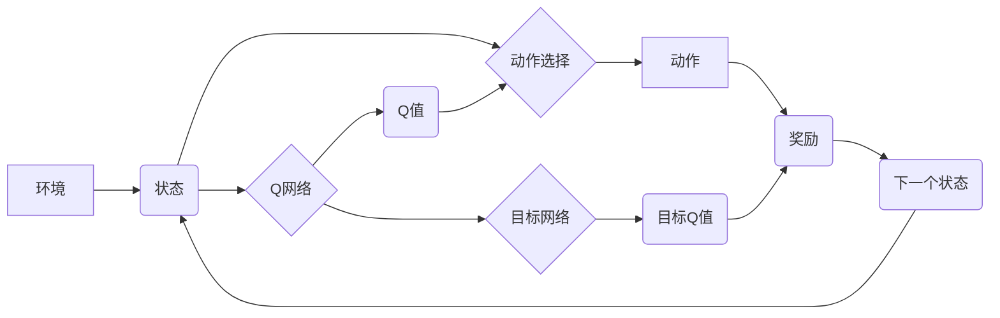

## 一切皆是映射：DQN的模型评估与性能监控方法

> 关键词：深度强化学习，DQN，模型评估，性能监控，强化学习算法，神经网络，环境交互，奖励机制

## 1. 背景介绍

深度强化学习 (Deep Reinforcement Learning, DRL) 近年来取得了令人瞩目的进展，在游戏、机器人控制、自动驾驶等领域展现出强大的应用潜力。其中，深度Q网络 (Deep Q-Network, DQN) 作为DRL领域的重要里程碑，成功将深度神经网络与Q学习算法相结合，为解决复杂决策问题提供了新的思路。

然而，DQN模型的训练过程复杂，需要大量的样本数据和计算资源。同时，DQN模型的性能评估和监控也是一个重要的课题。如何有效地评估DQN模型的学习效果，并及时监控其在实际应用中的性能，对于确保模型的稳定性和可靠性至关重要。

本文将深入探讨DQN模型的评估与性能监控方法，旨在帮助读者理解DQN模型的评估指标、监控策略以及相关技术，从而更好地应用DQN模型解决实际问题。

## 2. 核心概念与联系

DQN模型的核心思想是利用深度神经网络来逼近Q函数，即估计在给定状态下采取特定动作的期望回报。DQN模型的架构通常包含以下几个部分：

* **环境 (Environment):** DQN模型与环境交互，接收环境的状态信息并根据模型的输出选择动作。
* **状态空间 (State Space):** 环境的状态信息集合，可以是连续的或离散的。
* **动作空间 (Action Space):** 模型可以采取的动作集合。
* **Q网络 (Q-Network):** 深度神经网络，用于逼近Q函数，输入状态信息，输出各个动作的Q值。
* **经验回放 (Experience Replay):** 将训练过程中收集到的状态、动作、奖励和下一个状态存储在经验池中，并随机采样经验进行训练，以提高训练效率和稳定性。
* **目标网络 (Target Network):** 与Q网络结构相同，但参数更新频率较低，用于计算目标Q值，避免训练过程中的震荡。

**Mermaid 流程图**



## 3. 核心算法原理 & 具体操作步骤

### 3.1  算法原理概述

DQN算法的核心是利用深度神经网络来逼近Q函数，并通过Q学习算法进行训练。

Q学习算法是一种基于价值函数的强化学习算法，其目标是学习一个策略，使得在给定状态下采取的动作能够最大化累积的奖励。DQN算法将Q函数表示为一个深度神经网络，并使用梯度下降算法进行训练。

训练过程如下：

1. 从环境中获取初始状态。
2. 根据当前状态，利用Q网络预测各个动作的Q值。
3. 选择动作，并执行该动作。
4. 从环境中获取奖励和下一个状态。
5. 更新Q网络的参数，使得Q值朝着最大化的方向调整。

### 3.2  算法步骤详解

1. **初始化:** 初始化Q网络的参数，并设置学习率、折扣因子等超参数。
2. **环境交互:** 与环境交互，获取初始状态。
3. **动作选择:** 根据当前状态，利用Q网络预测各个动作的Q值，并选择Q值最大的动作。
4. **状态转移:** 执行选择的动作，并从环境中获取奖励和下一个状态。
5. **经验存储:** 将当前状态、动作、奖励和下一个状态存储在经验池中。
6. **经验回放:** 从经验池中随机采样多个经验样本，并利用这些样本更新Q网络的参数。
7. **目标网络更新:** 定期更新目标网络的参数，使其与Q网络的参数保持一致。
8. **重复步骤3-7:** 重复上述步骤，直到模型达到预设的性能指标。

### 3.3  算法优缺点

**优点:**

* 可以解决高维状态空间的问题。
* 可以学习复杂的策略。
* 训练效率较高。

**缺点:**

* 训练过程需要大量的样本数据和计算资源。
* 容易出现震荡和不稳定性。
* 难以解释模型的决策过程。

### 3.4  算法应用领域

DQN算法在以下领域具有广泛的应用前景:

* **游戏:** 训练游戏AI，例如AlphaGo、AlphaStar等。
* **机器人控制:** 训练机器人进行复杂的任务规划和执行。
* **自动驾驶:** 训练自动驾驶系统进行决策和控制。
* **推荐系统:** 训练推荐系统，根据用户的历史行为推荐感兴趣的内容。

## 4. 数学模型和公式 & 详细讲解 & 举例说明

### 4.1  数学模型构建

DQN算法的核心是Q函数，它表示在给定状态下采取特定动作的期望回报。

数学模型：

$$Q(s, a) = E[\sum_{t=0}^{\infty} \gamma^t r_{t+1}|s_t = s, a_t = a]$$

其中：

* $s$ 表示状态。
* $a$ 表示动作。
* $r_{t+1}$ 表示在时间步$t+1$获得的奖励。
* $\gamma$ 表示折扣因子，控制未来奖励的权重。
* $E$ 表示期望值。

### 4.2  公式推导过程

DQN算法利用深度神经网络来逼近Q函数，并使用梯度下降算法进行训练。

目标函数：

$$L(\theta) = E[(y_i - Q(s_i, a_i))^2]$$

其中：

* $\theta$ 表示Q网络的参数。
* $y_i$ 表示目标Q值，计算公式如下：

$$y_i = r_{i+1} + \gamma \max_{a'} Q(s_{i+1}, a')$$

### 4.3  案例分析与讲解

假设一个机器人需要学习在迷宫中找到出口。

* 状态空间：迷宫中的每个位置。
* 动作空间：向上、向下、向左、向右四个方向。
* 奖励函数：到达出口时获得最大奖励，迷宫中其他位置获得较小的奖励。

DQN算法可以训练机器人学习一个策略，使得在迷宫中找到出口的概率最大化。

## 5. 项目实践：代码实例和详细解释说明

### 5.1  开发环境搭建

* Python 3.x
* TensorFlow 或 PyTorch 深度学习框架
* OpenAI Gym 或其他强化学习环境

### 5.2  源代码详细实现

```python
import tensorflow as tf
import numpy as np

# 定义DQN网络
class DQN(tf.keras.Model):
    def __init__(self, state_size, action_size):
        super(DQN, self).__init__()
        self.dense1 = tf.keras.layers.Dense(64, activation='relu')
        self.dense2 = tf.keras.layers.Dense(64, activation='relu')
        self.output = tf.keras.layers.Dense(action_size)

    def call(self, state):
        x = self.dense1(state)
        x = self.dense2(x)
        return self.output(x)

# 定义DQN训练器
class DQNAgent:
    def __init__(self, state_size, action_size, learning_rate=0.001, gamma=0.99):
        self.state_size = state_size
        self.action_size = action_size
        self.learning_rate = learning_rate
        self.gamma = gamma
        self.model = DQN(state_size, action_size)
        self.optimizer = tf.keras.optimizers.Adam(learning_rate=self.learning_rate)

    def train(self, state, action, reward, next_state, done):
        with tf.GradientTape() as tape:
            target_q_values = self.model(next_state)
            q_values = self.model(state)
            y_true = reward + self.gamma * tf.reduce_max(target_q_values, axis=1) * (1 - done)
            loss = tf.keras.losses.MeanSquaredError()(y_true, q_values[tf.range(tf.shape(state)[0]), action])
        gradients = tape.gradient(loss, self.model.trainable_variables)
        self.optimizer.apply_gradients(zip(gradients, self.model.trainable_variables))

#... 其他训练和测试代码...
```

### 5.3  代码解读与分析

* `DQN`类定义了DQN网络的结构，包含两个全连接层和一个输出层。
* `DQNAgent`类定义了DQN训练器的逻辑，包括模型初始化、训练步骤和参数更新。
* `train`方法实现DQN的训练过程，利用经验回放和目标网络更新等技术提高训练效率和稳定性。

### 5.4  运行结果展示

训练完成后，可以评估DQN模型的性能，例如在迷宫环境中找到出口的成功率。

## 6. 实际应用场景

DQN算法在实际应用场景中具有广泛的应用前景，例如：

* **游戏AI:** 训练游戏AI，例如AlphaGo、AlphaStar等，在游戏中取得优异的成绩。
* **机器人控制:** 训练机器人进行复杂的任务规划和执行，例如在复杂环境中导航、抓取物体等。
* **自动驾驶:** 训练自动驾驶系统进行决策和控制，例如识别交通信号灯、避开障碍物等。
* **推荐系统:** 训练推荐系统，根据用户的历史行为推荐感兴趣的内容，例如电影、音乐、商品等。

### 6.4  未来应用展望

随着深度学习技术的不断发展，DQN算法的应用场景将会更加广泛。未来，DQN算法可能应用于以下领域：

* **医疗保健:** 辅助医生诊断疾病、制定治疗方案。
* **金融市场:** 进行股票预测、风险管理等。
* **科学研究:** 探索新的科学规律、加速科学发现。

## 7. 工具和资源推荐

### 7.1  学习资源推荐

* **书籍:**
    * Deep Reinforcement Learning Hands-On by Maxim Lapan
    * Reinforcement Learning: An Introduction by Richard S. Sutton and Andrew G. Barto
* **在线课程:**
    * Deep Reinforcement Learning Specialization by DeepLearning.AI
    * Reinforcement Learning by David Silver (University of DeepMind)

### 7.2  开发工具推荐

* **TensorFlow:** https://www.tensorflow.org/
* **PyTorch:** https://pytorch.org/
* **OpenAI Gym:** https://gym.openai.com/

### 7.3  相关论文推荐

* **Playing Atari with Deep Reinforcement Learning** by Mnih et al. (2013)
* **Human-level control through deep reinforcement learning** by Mnih et al. (2015)
* **Deep Q-Network** by Mnih et al. (2015)

## 8. 总结：未来发展趋势与挑战

### 8.1  研究成果总结

DQN算法在强化学习领域取得了显著的成果，成功应用于多个实际问题，推动了深度强化学习的发展。

### 8.2  未来发展趋势

* **模型效率提升:** 研究更有效的DQN模型架构，降低模型参数量和计算复杂度。
* **样本效率提升:** 研究更有效的训练策略，减少模型训练所需的样本数据。
* **可解释性增强:** 研究更易于解释的DQN模型，帮助人类理解模型的决策过程。
* **多智能体强化学习:** 研究多智能体DQN算法