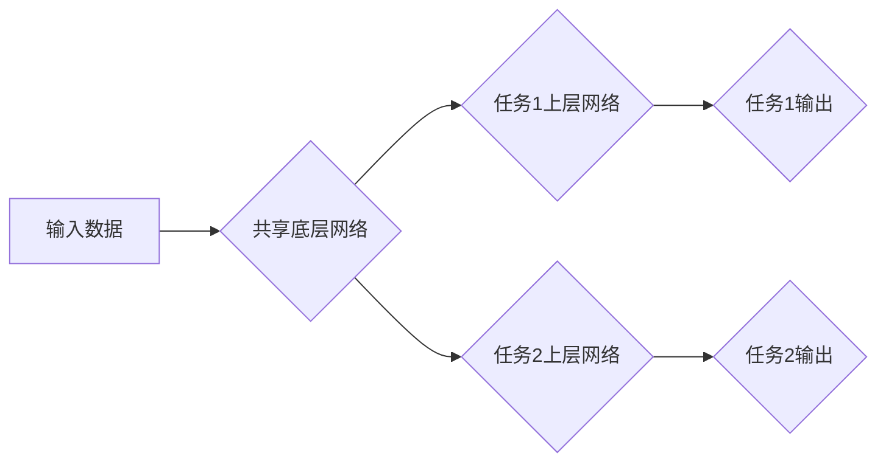

## 一切皆是映射：多任务学习与神经网络的协同训练

> 关键词：多任务学习，协同训练，神经网络，迁移学习，模型泛化，深度学习

### 1. 背景介绍

在深度学习领域，模型的性能通常取决于其所训练的数据量和数据质量。然而，获取大量高质量标注数据的成本往往很高，并且特定任务的数据可能非常稀缺。为了解决这个问题，多任务学习 (Multi-Task Learning, MTL) 应运而生。

多任务学习是一种机器学习范式，它训练一个共享参数的模型来同时学习多个相关任务。通过共享参数，模型可以从多个任务中学习到的知识进行迁移，从而提高每个任务的性能，尤其是在数据有限的情况下。

### 2. 核心概念与联系

**2.1 多任务学习的优势**

* **数据利用率提升:**  共享参数可以有效利用多个任务的训练数据，即使每个任务的数据量较少，也能获得更好的性能。
* **泛化能力增强:**  学习多个相关任务可以帮助模型学习更通用的特征表示，从而提高其在未见过的任务上的泛化能力。
* **模型训练效率提高:**  共享参数可以减少模型参数的数量，从而降低训练时间和计算资源需求。

**2.2 多任务学习的架构**

多任务学习的架构通常由一个共享的底层网络和多个任务特定的上层网络组成。

* **共享底层网络:**  负责提取通用特征，例如图像的边缘、纹理等。
* **任务特定上层网络:**  根据不同的任务进行特征融合和分类或回归。

**2.3 Mermaid 流程图**



### 3. 核心算法原理 & 具体操作步骤

**3.1 算法原理概述**

多任务学习的核心思想是通过共享参数来学习多个相关任务。在训练过程中，模型会同时优化所有任务的损失函数，从而学习到更通用的特征表示。

**3.2 算法步骤详解**

1. **数据准备:**  收集多个相关任务的数据集。
2. **模型构建:**  构建一个共享参数的模型，包括共享底层网络和多个任务特定的上层网络。
3. **损失函数定义:**  定义每个任务的损失函数，例如分类任务使用交叉熵损失，回归任务使用均方误差损失。
4. **模型训练:**  使用梯度下降算法等优化算法，同时优化所有任务的损失函数，更新模型参数。
5. **模型评估:**  使用测试集评估模型在每个任务上的性能。

**3.3 算法优缺点**

**优点:**

* 数据利用率提升
* 泛化能力增强
* 模型训练效率提高

**缺点:**

* 任务相关性要求高
* 训练过程可能更复杂
* 可能会出现任务之间负迁移的情况

**3.4 算法应用领域**

* **自然语言处理:**  例如，训练一个模型同时进行文本分类、情感分析和机器翻译。
* **计算机视觉:**  例如，训练一个模型同时进行图像分类、目标检测和图像分割。
* **医疗诊断:**  例如，训练一个模型同时进行疾病诊断、影像分析和药物推荐。

### 4. 数学模型和公式 & 详细讲解 & 举例说明

**4.1 数学模型构建**

假设我们有 $N$ 个任务，每个任务都有自己的输出空间 $Y_i$。我们用 $f_i(x)$ 表示第 $i$ 个任务的预测函数，其中 $x$ 是输入数据。

多任务学习的目标是学习一个共享参数的模型 $θ$，使得所有任务的预测函数都能够达到最佳性能。

**4.2 公式推导过程**

多任务学习的损失函数通常是所有任务损失函数的加权平均：

$$L(θ) = \sum_{i=1}^{N} \lambda_i L_i(θ)$$

其中：

* $L(θ)$ 是多任务学习的总损失函数。
* $L_i(θ)$ 是第 $i$ 个任务的损失函数。
* $\lambda_i$ 是第 $i$ 个任务的权重，用于平衡不同任务的贡献。

**4.3 案例分析与讲解**

例如，我们训练一个模型同时进行图像分类和物体检测两个任务。

* 图像分类任务的损失函数可以使用交叉熵损失。
* 物体检测任务的损失函数可以使用边界框回归损失和分类损失。

我们可以根据任务的重要性设置不同的权重，例如，图像分类任务的权重可以设置为 0.7，物体检测任务的权重可以设置为 0.3。

### 5. 项目实践：代码实例和详细解释说明

**5.1 开发环境搭建**

* Python 3.6+
* TensorFlow 或 PyTorch

**5.2 源代码详细实现**

```python
import tensorflow as tf

# 定义共享底层网络
def shared_network(input_tensor):
    #...

# 定义任务1上层网络
def task1_network(shared_output):
    #...

# 定义任务2上层网络
def task2_network(shared_output):
    #...

# 输入数据
input_data = tf.random.normal((100, 224, 224, 3))

# 共享底层网络输出
shared_output = shared_network(input_data)

# 任务1输出
task1_output = task1_network(shared_output)

# 任务2输出
task2_output = task2_network(shared_output)

# 定义损失函数
task1_loss = tf.keras.losses.CategoricalCrossentropy()(task1_output, tf.one_hot(labels, num_classes))
task2_loss = tf.keras.losses.MeanSquaredError()(task2_output, target_values)

# 定义多任务学习损失函数
total_loss = 0.7 * task1_loss + 0.3 * task2_loss

# 优化器
optimizer = tf.keras.optimizers.Adam()

# 训练模型
optimizer.minimize(total_loss)
```

**5.3 代码解读与分析**

* 代码首先定义了共享底层网络和两个任务特定的上层网络。
* 然后，使用输入数据通过共享底层网络进行特征提取。
* 接着，将共享网络的输出分别输入到两个任务的上层网络中，得到每个任务的预测结果。
* 最后，定义了两个任务的损失函数，并将其加权平均得到多任务学习的总损失函数。

**5.4 运行结果展示**

训练完成后，可以评估模型在每个任务上的性能，例如，计算图像分类任务的准确率和物体检测任务的平均精度。

### 6. 实际应用场景

**6.1 自然语言处理**

* **机器翻译:**  训练一个模型同时进行英语到中文、中文到英语的翻译。
* **文本摘要:**  训练一个模型同时进行新闻摘要和会议记录摘要。
* **情感分析:**  训练一个模型同时进行电影评论的情感分类和社交媒体评论的情感分析。

**6.2 计算机视觉**

* **图像分类:**  训练一个模型同时进行动物分类和物体分类。
* **目标检测:**  训练一个模型同时进行行人检测和车辆检测。
* **图像分割:**  训练一个模型同时进行细胞分割和道路分割。

**6.3 其他领域**

* **医疗诊断:**  训练一个模型同时进行疾病诊断、影像分析和药物推荐。
* **金融预测:**  训练一个模型同时进行股票价格预测和信用风险评估。

**6.4 未来应用展望**

随着深度学习技术的不断发展，多任务学习将在更多领域得到应用。例如，可以训练一个模型同时进行多个传感器数据的融合和分析，从而提高智能设备的感知能力和决策能力。

### 7. 工具和资源推荐

**7.1 学习资源推荐**

* **书籍:**
    * Deep Learning by Ian Goodfellow, Yoshua Bengio, and Aaron Courville
    * Hands-On Machine Learning with Scikit-Learn, Keras & TensorFlow by Aurélien Géron
* **论文:**
    * Multi-Task Learning by Richard S. Sutton
    * A Survey on Multi-Task Learning by  Yanjun Qi et al.
* **在线课程:**
    * Coursera: Deep Learning Specialization
    * Udacity: Deep Learning Nanodegree

**7.2 开发工具推荐**

* **TensorFlow:**  https://www.tensorflow.org/
* **PyTorch:**  https://pytorch.org/
* **Keras:**  https://keras.io/

**7.3 相关论文推荐**

* **Multi-Task Learning with Deep Networks** by  Caruana et al. (1997)
* **Learning Transferable Features with Multi-Task Neural Networks** by  Pan et al. (2010)
* **Multi-Task Deep Learning** by  Ruder (2017)

### 8. 总结：未来发展趋势与挑战

**8.1 研究成果总结**

多任务学习在近年来取得了显著的进展，并在多个领域取得了成功应用。

**8.2 未来发展趋势**

* **更复杂的模型架构:**  探索更复杂的模型架构，例如 Transformer 和 Graph Neural Networks，以更好地学习多任务关系。
* **更有效的训练方法:**  研究更有效的训练方法，例如动态任务分配和知识蒸馏，以提高多任务学习的效率。
* **更广泛的应用场景:**  将多任务学习应用到更多领域，例如自动驾驶、机器人控制和个性化推荐。

**8.3 面临的挑战**

* **任务相关性:**  找到相关性强的任务对多任务学习至关重要。
* **负迁移:**  任务之间可能存在负迁移现象，需要采取措施避免。
* **数据效率:**  多任务学习仍然需要大量的训练数据，如何提高数据效率是一个重要的挑战。

**8.4 研究展望**

未来，多任务学习的研究将继续朝着更智能、更高效、更广泛的方向发展。

### 9. 附录：常见问题与解答

**9.1 如何选择合适的任务？**

选择合适的任务是多任务学习的关键。任务之间应该存在一定的相关性，例如，图像分类和目标检测任务。

**9.2 如何避免负迁移？**

负迁移是指一个任务的学习对另一个任务的性能产生负面影响。可以采用以下措施避免负迁移：

* 使用不同的损失函数对不同的任务进行优化。
* 使用正则化技术来防止模型过拟合。
* 使用任务特定的网络结构。

**9.3 如何提高多任务学习的效率？**

可以采用以下措施提高多任务学习的效率：

* 使用预训练模型进行迁移学习。
* 使用知识蒸馏技术来训练更小的模型。
* 使用动态任务分配策略来根据任务的重要性调整训练资源。


作者：禅与计算机程序设计艺术 / Zen and the Art of Computer Programming 
