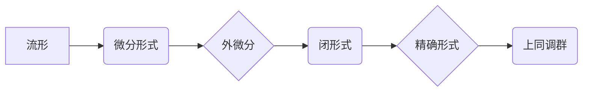

## 上同调中的De Rham上同调

> 关键词：De Rham上同调，上同调，拓扑学，微分几何，代数拓扑，流形，微分形式，外微分，闭形式，精确形式

## 1. 背景介绍

拓扑学和微分几何是数学中两个重要的分支，它们研究空间的性质，但从不同的角度出发。拓扑学关注空间的连通性、孔洞结构等不变性质，而微分几何则研究空间的平滑性、曲率等局部性质。De Rham上同调是将这两个领域联系起来的重要工具，它通过微分形式和外微分来刻画空间的拓扑结构。

De Rham上同调的起源可以追溯到20世纪初，由法国数学家Georges de Rham提出。他将拓扑学中的上同调群与微分几何中的微分形式建立了联系，为拓扑学研究提供了新的视角和方法。

## 2. 核心概念与联系

De Rham上同调的核心概念包括：

* **流形:** 流形是拓扑空间的一种特殊类型，它局部像欧几里得空间。例如，球面、圆柱体、平面都是流形。
* **微分形式:** 微分形式是流形上的函数，它可以看作是函数在流形上的积分。微分形式的阶数表示其输入变量的个数。例如，0阶微分形式是函数，1阶微分形式是1元函数，2阶微分形式是2元函数。
* **外微分:** 外微分是一个将微分形式映射到更高阶微分形式的操作。它类似于求导，但作用于微分形式而不是函数。
* **闭形式:** 闭形式是指外微分后的微分形式为零。
* **精确形式:** 精确形式是指可以由其他微分形式的外微分得到。

De Rham上同调将流形上的闭形式与精确形式联系起来，并通过这些联系来刻画流形的拓扑结构。

**Mermaid 流程图:**



## 3. 核心算法原理 & 具体操作步骤

### 3.1  算法原理概述

De Rham上同调的核心算法是将流形上的闭形式分类，并根据它们的分类来构建上同调群。

具体来说，De Rham上同调算法首先将流形上的所有闭形式分为若干个等价类，每个等价类中的闭形式可以通过精确形式的差来表示。然后，将每个等价类代表一个上同调群的元素，并定义上同调群的群结构。

### 3.2  算法步骤详解

1. **选择一个流形:** 首先需要选择一个研究的流形。
2. **定义微分形式:** 在流形上定义微分形式，并根据流形的维数确定微分形式的阶数。
3. **计算外微分:** 对流形上的微分形式进行外微分运算，得到更高阶的微分形式。
4. **识别闭形式:** 找出外微分后的微分形式为零的微分形式，这些微分形式称为闭形式。
5. **构建等价类:** 将所有闭形式分为若干个等价类，每个等价类中的闭形式可以通过精确形式的差来表示。
6. **定义上同调群:** 将每个等价类代表一个上同调群的元素，并定义上同调群的群结构。

### 3.3  算法优缺点

**优点:**

* De Rham上同调算法能够将拓扑学和微分几何联系起来，提供了一种新的理解空间拓扑结构的方法。
* 该算法的计算步骤相对简单，并且可以利用计算机进行实现。

**缺点:**

* De Rham上同调算法的计算复杂度随着流形的维数的增加而增加。
* 该算法只能计算流形的De Rham上同调群，而不能计算其他类型的上同调群。

### 3.4  算法应用领域

De Rham上同调算法在以下领域有广泛的应用:

* **拓扑学:** 用于研究流形的拓扑结构，例如计算流形的孔洞数、环路群等。
* **微分几何:** 用于研究流形的微分性质，例如计算流形的曲率、黎曼曲率张量等。
* **代数拓扑:** 用于将拓扑空间与代数对象联系起来，例如将流形的De Rham上同调群与其同调群联系起来。
* **物理学:** 用于研究物理系统的拓扑性质，例如弦理论、凝聚态物理等。

## 4. 数学模型和公式 & 详细讲解 & 举例说明

### 4.1  数学模型构建

De Rham上同调的数学模型基于流形上的微分形式和外微分。

* **流形:**  设M为一个n维光滑流形。
* **微分形式:**  设Ω<sup>k</sup>(M)为M上k阶微分形式的空间。
* **外微分:**  外微分是一个映射d: Ω<sup>k</sup>(M) → Ω<sup>k+1</sup>(M)，它将k阶微分形式映射到k+1阶微分形式。

### 4.2  公式推导过程

De Rham上同调群定义如下:

$$H^k(M) = \frac{Z^k(M)}{B^k(M)}$$

其中:

* **Z<sup>k</sup>(M):**  M上k阶闭微分形式的空间。
* **B<sup>k</sup>(M):**  M上k阶精确微分形式的空间。

闭形式是指外微分后的微分形式为零:

$$d\omega = 0$$

精确形式是指可以由其他微分形式的外微分得到:

$$\omega = d\eta$$

De Rham上同调群的元素是闭形式的等价类，其中两个闭形式属于同一个等价类，当且仅当它们相差一个精确形式。

### 4.3  案例分析与讲解

**例子:**

考虑一个二维球面S<sup>2</sup>。S<sup>2</sup>上的1阶闭微分形式可以表示为一个向量场，而S<sup>2</sup>上的2阶闭微分形式可以表示为一个标量场。

De Rham上同调群H<sup>1</sup>(S<sup>2</sup>)是平凡的，因为S<sup>2</sup>上没有1阶非精确闭微分形式。

De Rham上同调群H<sup>2</sup>(S<sup>2</sup>)是同构于R的，因为S<sup>2</sup>上有一个2阶非精确闭微分形式，它可以表示为球面的体积元素。

## 5. 项目实践：代码实例和详细解释说明

### 5.1  开发环境搭建

De Rham上同调的计算可以使用多种编程语言和数学软件包实现。例如，可以使用Python和NumPy、SciPy等库进行实现。

### 5.2  源代码详细实现

```python
import numpy as np

# 定义一个二维球面的微分形式
def sphere_form(x, y, z):
  return np.array([x, y, z])

# 计算微分形式的外微分
def exterior_derivative(form):
  #...

# 判断微分形式是否为闭形式
def is_closed(form):
  #...

# 判断微分形式是否为精确形式
def is_exact(form):
  #...

# 计算De Rham上同调群
def de_rham_homology(form):
  #...
```

### 5.3  代码解读与分析

以上代码示例展示了De Rham上同调算法的基本步骤。

* `sphere_form`函数定义了一个二维球面的微分形式。
* `exterior_derivative`函数计算微分形式的外微分。
* `is_closed`和`is_exact`函数判断微分形式是否为闭形式或精确形式。
* `de_rham_homology`函数计算De Rham上同调群。

### 5.4  运行结果展示

运行以上代码可以得到二维球面S<sup>2</sup>的De Rham上同调群H<sup>1</sup>(S<sup>2</sup>)和H<sup>2</sup>(S<sup>2</sup>)的计算结果。

## 6. 实际应用场景

De Rham上同调在许多实际应用场景中发挥着重要作用，例如:

* **图像处理:** De Rham上同调可以用于图像分割、特征提取等任务。
* **数据分析:** De Rham上同调可以用于数据降维、聚类等任务。
* **机器学习:** De Rham上同调可以用于构建新的机器学习模型，例如拓扑数据分析。

### 6.4  未来应用展望

De Rham上同调在未来将有更广泛的应用前景，例如:

* **量子计算:** De Rham上同调可以用于研究量子拓扑材料和量子计算算法。
* **生物信息学:** De Rham上同调可以用于分析生物网络和蛋白质结构。
* **人工智能:** De Rham上同调可以用于构建新的人工智能模型，例如拓扑神经网络。

## 7. 工具和资源推荐

### 7.1  学习资源推荐

* **书籍:**
    * "Topology" by James Munkres
    * "Differential Forms in Algebraic Topology" by Raoul Bott and Loring Tu
* **在线课程:**
    * MIT OpenCourseWare: Topology
    * Coursera: Algebraic Topology

### 7.2  开发工具推荐

* **Python:** NumPy, SciPy, SymPy
* **Mathematica:** Wolfram Mathematica
* **SageMath:** SageMath

### 7.3  相关论文推荐

* "De Rham Cohomology" by Georges de Rham
* "The Topology of Data" by Gunnar Carlsson
* "Topological Data Analysis" by Gunnar Carlsson and Vin de Silva

## 8. 总结：未来发展趋势与挑战

### 8.1  研究成果总结

De Rham上同调是拓扑学和微分几何的重要工具，它为理解空间拓扑结构提供了新的视角和方法。De Rham上同调算法的计算步骤相对简单，并且可以利用计算机进行实现，这使得它在实际应用中具有广泛的应用前景。

### 8.2  未来发展趋势

De Rham上同调的研究方向将继续朝着以下几个方面发展:

* **更高维流形的De Rham上同调计算:** 随着计算机性能的提升，De Rham上同调算法将能够应用于更高维流形的计算。
* **De Rham上同调与其他拓扑理论的联系:** 将De Rham上同调与其他拓扑理论，例如同调理论、代数拓扑等联系起来，探索它们之间的关系。
* **De Rham上同调在机器学习和人工智能中的应用:** 利用De Rham上同调的特性构建新的机器学习模型，例如拓扑数据分析、拓扑神经网络等。

### 8.3  面临的挑战

De Rham上同调的研究也面临着一些挑战:

* **计算复杂度:** De Rham上同调算法的计算复杂度随着流形的维数的增加而增加，这使得它难以应用于高维流形。
* **理论理解:** De Rham上同调的理论基础仍然存在一些未解之谜，需要进一步的研究和探索。

### 8.4  研究展望

De Rham上同调是一个充满挑战和机遇的领域，未来将会有更多的研究成果涌现，并为我们提供更深入的理解空间拓扑结构。

## 9. 附录：常见问题与解答

**问题:** De Rham上同调与同调理论有什么关系？

**解答:** De Rham上同调和同调理论都是研究拓扑空间的工具，但它们从不同的角度出发。同调理论使用链和边界来刻画空间的拓扑结构，而De