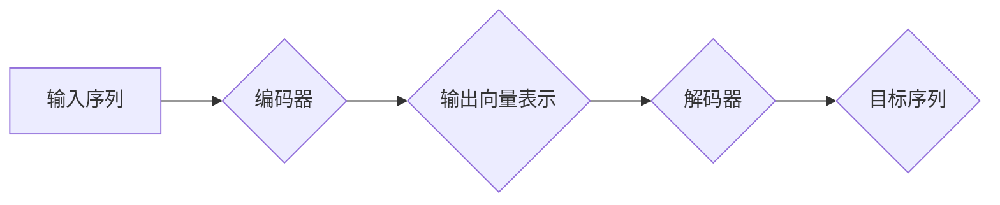

## 从零开始大模型开发与微调：编码器的核心—注意力模型

> 关键词：大模型、注意力机制、Transformer、编码器、解码器、自然语言处理、深度学习

## 1. 背景介绍

近年来，深度学习在自然语言处理 (NLP) 领域取得了突破性进展，其中大规模语言模型 (LLM) 扮演着越来越重要的角色。这些模型，例如 GPT-3、BERT 和 LaMDA，能够执行各种复杂的任务，包括文本生成、机器翻译、问答系统和代码生成。

大模型的成功离不开其强大的编码能力。编码器是深度学习模型中负责理解和表示输入序列信息的模块。传统的编码器架构，例如 RNN 和 CNN，存在一些局限性，例如梯度消失问题和处理长序列信息的困难。

为了解决这些问题，注意力机制 (Attention Mechanism) 应运而生。注意力机制能够学习到输入序列中不同部分之间的重要关系，从而更好地理解和表示输入信息。基于注意力机制的 Transformer 架构彻底改变了 NLP 领域，成为大模型开发的基石。

## 2. 核心概念与联系

### 2.1 注意力机制

注意力机制的核心思想是让模型关注输入序列中与当前任务最相关的部分。它通过计算每个词与其他词之间的“注意力分数”，来确定每个词对当前任务的贡献程度。

注意力分数越高，表示该词对当前任务越重要，模型会更加关注该词的信息。

### 2.2 Transformer 架构

Transformer 架构是一种基于注意力机制的序列到序列模型，它完全摒弃了传统的循环神经网络 (RNN) 结构，并通过多头注意力机制和前馈神经网络来实现高效的序列处理。

Transformer 架构主要由两个部分组成：编码器和解码器。

* **编码器:** 负责将输入序列编码成一个固定长度的向量表示。
* **解码器:** 负责根据编码器的输出生成目标序列。

**Mermaid 流程图:**



### 2.3 编码器

编码器是 Transformer 架构中的核心部分，它负责将输入序列编码成一个固定长度的向量表示。编码器由多个相同的编码器层组成，每个编码器层包含以下组件：

* **多头注意力机制:** 允许模型关注输入序列中不同部分之间的关系。
* **前馈神经网络:** 对每个词的表示进行非线性变换。
* **残差连接:** 帮助模型学习长距离依赖关系。
* **Layer Normalization:** 规范化每个层的输出，提高模型的稳定性。

## 3. 核心算法原理 & 具体操作步骤

### 3.1 算法原理概述

注意力机制的核心思想是通过计算每个词与其他词之间的“注意力分数”，来确定每个词对当前任务的贡献程度。

注意力分数越高，表示该词对当前任务越重要，模型会更加关注该词的信息。

### 3.2 算法步骤详解

1. **计算注意力分数:**

对于每个词，计算它与其他所有词之间的注意力分数。

注意力分数通常使用一个计算公式来计算，该公式会考虑词之间的语义相似度、位置关系等因素。

2. **加权求和:**

使用注意力分数对输入序列中的每个词进行加权求和，得到一个新的向量表示。

这个新的向量表示包含了所有词的信息，但每个词的权重根据其注意力分数进行调整。

3. **非线性变换:**

对加权求和后的向量表示进行非线性变换，例如使用 ReLU 函数，以提取更丰富的特征信息。

### 3.3 算法优缺点

**优点:**

* 能够学习到输入序列中不同部分之间的重要关系。
* 能够处理长序列信息，克服了 RNN 的梯度消失问题。
* 在许多 NLP 任务中取得了优异的性能。

**缺点:**

* 计算复杂度较高，训练时间较长。
* 难以解释注意力分数的含义。

### 3.4 算法应用领域

注意力机制广泛应用于各种 NLP 任务，例如：

* **机器翻译:** 关注源语言和目标语言之间的对应关系。
* **文本摘要:** 关注文本中最关键的信息。
* **问答系统:** 关注问题和答案之间的相关性。
* **代码生成:** 关注代码中的语法结构和语义关系。

## 4. 数学模型和公式 & 详细讲解 & 举例说明

### 4.1 数学模型构建

注意力机制的数学模型可以概括为以下步骤：

1. 计算每个词与其他所有词之间的相似度分数。
2. 将相似度分数转换为注意力权重。
3. 使用注意力权重对输入序列进行加权求和，得到一个新的向量表示。

### 4.2 公式推导过程

**相似度计算:**

通常使用点积或余弦相似度来计算词之间的相似度。

**点积相似度:**

$$
score(w_i, w_j) = w_i^T w_j
$$

其中，$w_i$ 和 $w_j$ 分别是词 $i$ 和词 $j$ 的词向量表示。

**余弦相似度:**

$$
score(w_i, w_j) = \frac{w_i^T w_j}{||w_i|| ||w_j||}
$$

其中，$||w_i||$ 和 $||w_j||$ 分别是词 $i$ 和词 $j$ 的词向量表示的范数。

**注意力权重:**

注意力权重通常使用 softmax 函数对相似度分数进行归一化。

$$
attention(w_i, w_j) = \frac{exp(score(w_i, w_j))}{\sum_{k=1}^{n} exp(score(w_i, w_k))}
$$

其中，$n$ 是输入序列的长度。

**加权求和:**

使用注意力权重对输入序列中的每个词进行加权求和，得到一个新的向量表示。

$$
context(w_i) = \sum_{j=1}^{n} attention(w_i, w_j) w_j
$$

### 4.3 案例分析与讲解

假设我们有一个句子 "The cat sat on the mat"，我们想要计算词 "sat" 的上下文向量。

使用注意力机制，我们可以计算每个词与 "sat" 之间的相似度分数，然后使用 softmax 函数将其转换为注意力权重。

最终，我们将使用这些注意力权重对所有词进行加权求和，得到 "sat" 的上下文向量。

这个上下文向量包含了 "sat" 周围所有词的信息，例如 "The cat" 和 "on the mat"，帮助模型更好地理解 "sat" 的含义。

## 5. 项目实践：代码实例和详细解释说明

### 5.1 开发环境搭建

* Python 3.6+
* PyTorch 或 TensorFlow

### 5.2 源代码详细实现

```python
import torch
import torch.nn as nn

class Attention(nn.Module):
    def __init__(self, input_size, hidden_size):
        super(Attention, self).__init__()
        self.linear1 = nn.Linear(input_size, hidden_size)
        self.linear2 = nn.Linear(hidden_size, 1)

    def forward(self, input_tensor):
        # 计算每个词与其他所有词之间的相似度分数
        scores = self.linear2(torch.tanh(self.linear1(input_tensor)))
        # 使用 softmax 函数将其转换为注意力权重
        attention_weights = torch.softmax(scores, dim=1)
        # 使用注意力权重对输入序列进行加权求和
        context_vector = torch.bmm(attention_weights.unsqueeze(1), input_tensor)
        return context_vector
```

### 5.3 代码解读与分析

* `__init__` 方法初始化模型参数，包括输入大小、隐藏大小等。
* `forward` 方法实现注意力机制的核心逻辑，包括计算相似度分数、转换为注意力权重和加权求和。

### 5.4 运行结果展示

运行上述代码，可以得到每个词的上下文向量表示。

## 6. 实际应用场景

注意力机制在 NLP 领域有着广泛的应用场景，例如：

* **机器翻译:** 关注源语言和目标语言之间的对应关系，提高翻译质量。
* **文本摘要:** 关注文本中最关键的信息，生成简洁准确的摘要。
* **问答系统:** 关注问题和答案之间的相关性，提高问答准确率。
* **代码生成:** 关注代码中的语法结构和语义关系，生成更准确的代码。

### 6.4 未来应用展望

随着深度学习技术的不断发展，注意力机制将在更多领域得到应用，例如：

* **图像识别:** 关注图像中最重要的部分，提高识别准确率。
* **语音识别:** 关注语音信号中的关键特征，提高识别准确率。
* **药物研发:** 关注药物分子结构中的关键特征，提高药物设计效率。

## 7. 工具和资源推荐

### 7.1 学习资源推荐

* **论文:** "Attention Is All You Need" (Vaswani et al., 2017)
* **博客:** Jay Alammar's Blog (https://jalammar.github.io/illustrated-transformer/)
* **课程:** Stanford CS224N: Natural Language Processing with Deep Learning (https://web.stanford.edu/class/cs224n/)

### 7.2 开发工具推荐

* **PyTorch:** https://pytorch.org/
* **TensorFlow:** https://www.tensorflow.org/

### 7.3 相关论文推荐

* "BERT: Pre-training of Deep Bidirectional Transformers for Language Understanding" (Devlin et al., 2018)
* "GPT-3: Language Models are Few-Shot Learners" (Brown et al., 2020)
* "T5: Text-to-Text Transfer Transformer" (Raffel et al., 2019)

## 8. 总结：未来发展趋势与挑战

### 8.1 研究成果总结

注意力机制在 NLP 领域取得了显著的成果，推动了大模型的开发和应用。

### 8.2 未来发展趋势

未来，注意力机制将继续朝着以下方向发展：

* **更有效的注意力机制:** 研究更有效的注意力机制，例如自注意力机制、局部注意力机制等，提高模型的效率和性能。
* **跨模态注意力机制:** 将注意力机制应用于跨模态任务，例如图像文本对齐、语音文本识别等。
* **可解释性:** 研究注意力机制的可解释性，帮助人们更好地理解模型的决策过程。

### 8.3 面临的挑战

注意力机制也面临一些挑战，例如：

* **计算复杂度:** 随着模型规模的增大，注意力机制的计算复杂度也会增加，需要寻找更有效的计算方法。
* **数据依赖性:** 注意力机制的性能依赖于训练数据的质量，需要更多高质量的数据来训练更强大的模型。
* **伦理问题:** 注意力机制可能存在一些伦理问题，例如数据隐私、算法偏见等，需要进行更深入的探讨和研究。

### 8.4 研究展望

未来，注意力机制将继续是 NLP 领域的研究热点，并将在更多领域得到应用。

## 9. 附录：常见问题与解答

**Q1: 注意力机制的计算复杂度很高吗？**

A1: 是的，注意力机制的计算复杂度较高，特别是对于长序列数据。

**Q2: 注意力机制的训练数据要求很高吗？**

A2: 是的，注意力机制的性能依赖于训练数据的质量，需要更多高质量的数据来训练更强大的模型。

**Q3: 注意力机制的可解释性如何？**

A3: 注意力机制的可解释性相对较低，难以解释注意力权重的含义。

**作者：禅与计算机程序设计艺术 / Zen and the Art of Computer Programming**