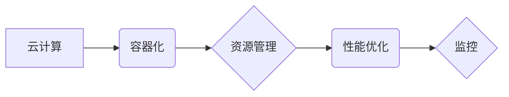

## 优化计算基础设施的实用策略

> 关键词：计算基础设施、性能优化、资源管理、云计算、容器化、自动化、监控

### 1. 背景介绍

随着数字化转型和人工智能等新兴技术的蓬勃发展，对计算基础设施的需求量呈指数级增长。传统的计算基础设施架构难以满足日益增长的计算能力、存储容量和网络带宽需求，同时面临着成本高、维护复杂、可扩展性差等挑战。因此，优化计算基础设施已成为企业数字化转型和业务发展的重要课题。

### 2. 核心概念与联系

**2.1 核心概念**

* **计算基础设施 (Compute Infrastructure):** 包括服务器、存储、网络、操作系统、虚拟化技术等硬件和软件资源，为应用程序和数据提供运行环境。
* **性能优化 (Performance Optimization):** 通过提高计算资源利用率、减少资源浪费、优化应用程序代码和数据访问方式等手段，提升计算基础设施的处理速度、响应时间和吞吐量。
* **资源管理 (Resource Management):**  有效分配和调度计算资源，确保资源按需使用，避免资源浪费和冲突。
* **云计算 (Cloud Computing):**  一种基于互联网的计算服务模式，提供弹性、可扩展、按需付费的计算资源。
* **容器化 (Containerization):** 将应用程序及其依赖项打包成独立的容器，方便部署、运行和管理。
* **自动化 (Automation):**  通过脚本、工具和平台，自动化执行重复性任务，提高效率和降低人工成本。
* **监控 (Monitoring):**  实时收集和分析计算基础设施的运行状态，及时发现和解决问题。

**2.2 架构关系**



### 3. 核心算法原理 & 具体操作步骤

**3.1 算法原理概述**

优化计算基础设施涉及多种算法和技术，例如：

* **负载均衡 (Load Balancing):** 将请求分发到多个服务器，提高系统吞吐量和可用性。
* **缓存 (Caching):** 将经常访问的数据存储在高速缓存中，减少数据库访问次数，提高响应速度。
* **数据压缩 (Data Compression):**  压缩数据大小，减少存储空间和网络传输带宽。
* **代码优化 (Code Optimization):**  优化应用程序代码，提高执行效率。

**3.2 算法步骤详解**

以负载均衡为例，其基本步骤如下：

1. **请求到达:** 用户发送请求到负载均衡器。
2. **请求转发:** 负载均衡器根据预设的策略，将请求转发到合适的服务器。
3. **服务器处理:** 服务器处理请求并返回结果。
4. **结果返回:** 负载均衡器将结果转发回用户。

**3.3 算法优缺点**

* **优点:** 提高系统吞吐量、可用性、响应速度。
* **缺点:** 需要额外的硬件和软件成本，配置复杂。

**3.4 算法应用领域**

负载均衡广泛应用于网站、电商平台、游戏服务器等高并发场景。

### 4. 数学模型和公式 & 详细讲解 & 举例说明

**4.1 数学模型构建**

假设一个系统有 N 个服务器，每个服务器的处理能力为 P，请求到达率为 R。则系统的处理能力为：

$$
总处理能力 = N * P
$$

**4.2 公式推导过程**

负载均衡器的目标是将请求均匀分配到所有服务器，以最大化系统的处理能力。

假设负载均衡器采用轮询算法，则每个服务器的请求处理量为：

$$
每个服务器请求处理量 = R / N
$$

**4.3 案例分析与讲解**

假设一个网站有 1000 个并发用户，每个用户每秒发送 1 个请求，网站有 5 台服务器，每台服务器的处理能力为 1000 请求/秒。

* 系统总处理能力：5 * 1000 = 5000 请求/秒
* 每个服务器请求处理量：1000 / 5 = 200 请求/秒

在这种情况下，负载均衡器可以将请求均匀分配到所有服务器，确保系统能够满足用户请求。

### 5. 项目实践：代码实例和详细解释说明

**5.1 开发环境搭建**

* 操作系统：Linux (Ubuntu 或 CentOS)
* 虚拟化软件：Docker 或 Kubernetes
* 编程语言：Python 或 Go

**5.2 源代码详细实现**

以下是一个使用 Python 实现的简单负载均衡器的代码示例：

```python
import threading
import random

class LoadBalancer:
    def __init__(self, servers):
        self.servers = servers

    def get_server(self):
        return random.choice(self.servers)

# 定义服务器列表
servers = ["http://server1", "http://server2", "http://server3"]

# 创建负载均衡器实例
lb = LoadBalancer(servers)

# 模拟用户请求
def handle_request():
    server = lb.get_server()
    print(f"Request forwarded to {server}")

# 创建多个线程模拟并发请求
for _ in range(10):
    threading.Thread(target=handle_request).start()
```

**5.3 代码解读与分析**

* `LoadBalancer` 类负责管理服务器列表和分配请求。
* `get_server()` 方法随机选择一个服务器返回。
* `handle_request()` 方法模拟用户请求，将请求转发到负载均衡器获取的服务器。
* 使用多个线程模拟并发请求，测试负载均衡器的性能。

**5.4 运行结果展示**

运行代码后，会看到多个线程分别将请求转发到不同的服务器，实现请求的均衡分配。

### 6. 实际应用场景

**6.1 云计算平台**

云计算平台利用负载均衡、容器化、自动化等技术，提供弹性、可扩展、按需付费的计算资源。

**6.2 大型网站和应用程序**

大型网站和应用程序需要处理大量用户请求，负载均衡器可以提高系统的可用性和性能。

**6.3 数据中心**

数据中心需要高效地管理和调度计算资源，资源管理和监控技术可以帮助优化数据中心运营效率。

**6.4 未来应用展望**

随着人工智能、物联网等新兴技术的快速发展，对计算基础设施的需求将持续增长。未来，计算基础设施优化将更加智能化、自动化和可扩展化。

### 7. 工具和资源推荐

**7.1 学习资源推荐**

* **书籍:**
    * 《云计算架构设计》
    * 《容器化技术》
    * 《性能优化实践》
* **在线课程:**
    * Coursera: 云计算、容器化、性能优化
    * Udemy: 云计算、容器化、性能优化

**7.2 开发工具推荐**

* **容器化平台:** Docker, Kubernetes
* **负载均衡器:** Nginx, HAProxy
* **监控工具:** Prometheus, Grafana

**7.3 相关论文推荐**

* 《云计算资源管理的挑战与机遇》
* 《容器化技术在软件开发中的应用》
* 《性能优化算法研究》

### 8. 总结：未来发展趋势与挑战

**8.1 研究成果总结**

本文介绍了优化计算基础设施的必要性、核心概念、算法原理、实践案例以及未来发展趋势。

**8.2 未来发展趋势**

* **智能化:** 利用人工智能技术，实现自动化的资源调度、性能优化和故障诊断。
* **自动化:** 通过自动化工具和平台，简化基础设施管理流程，提高效率。
* **可扩展性:**  构建更加灵活、可扩展的计算基础设施，满足不断增长的计算需求。

**8.3 面临的挑战**

* **复杂性:** 计算基础设施越来越复杂，需要更先进的技术和工具来管理和优化。
* **安全:**  保障计算基础设施的安全性和数据隐私。
* **成本:**  降低计算基础设施的运营成本，提高资源利用率。

**8.4 研究展望**

未来，将继续研究和探索新的计算基础设施优化技术，以满足不断变化的业务需求和技术发展趋势。

### 9. 附录：常见问题与解答

* **Q1: 如何选择合适的负载均衡算法？**

* **A1:**  选择负载均衡算法需要根据实际应用场景和需求进行考虑。常见的算法包括轮询、加权轮询、最小连接数和最短响应时间等。

* **Q2: 如何监控计算基础设施的性能？**

* **A2:**  可以使用监控工具收集和分析计算基础设施的运行状态，例如 CPU 使用率、内存使用率、网络流量等指标。

* **Q3: 如何优化应用程序代码以提高性能？**

* **A3:**  可以通过代码优化、数据结构选择、算法改进等手段提高应用程序代码的执行效率。


作者：禅与计算机程序设计艺术 / Zen and the Art of Computer Programming 
