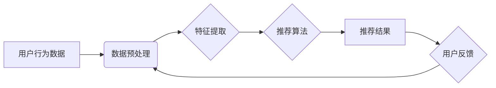

## 基于大数据的电商平台用户个性化推荐的分析与研究

> 关键词：电商平台、用户个性化推荐、大数据、协同过滤、内容过滤、深度学习、推荐算法、用户行为分析

## 1. 背景介绍

随着电商平台的蓬勃发展，用户数量激增，商品种类日益丰富，用户在海量商品中寻找自己所需产品变得越来越困难。为了提升用户体验，提高商品曝光率和转化率，电商平台纷纷投入大量资源进行用户个性化推荐。

个性化推荐是指根据用户的历史行为、偏好、兴趣等信息，为用户推荐最符合其需求的商品或服务。传统的推荐系统主要依赖于商品的类别、属性等静态信息，缺乏对用户动态行为的捕捉和分析。而大数据技术的出现为个性化推荐提供了强大的数据支撑，使得推荐系统能够更加精准、智能化。

## 2. 核心概念与联系

### 2.1  核心概念

* **大数据:** 指规模庞大、结构复杂、更新速度快的数据集合，其特点是“五V”：**V**olume (体积)、**V**elocity (速度)、**V**ariety (多样性)、**V**eracity (真实性)、**V**alue (价值)。
* **用户个性化推荐:** 根据用户的个人特征和行为模式，为用户提供定制化的商品或服务推荐。
* **协同过滤:** 通过分析其他用户对商品的评分或购买行为，预测用户对特定商品的喜好。
* **内容过滤:** 基于商品的属性和描述信息，以及用户的兴趣偏好，推荐用户可能感兴趣的商品。
* **深度学习:** 一种机器学习方法，利用多层神经网络模拟人类大脑的学习过程，能够从海量数据中提取更深层次的特征和模式。

### 2.2  架构图



## 3. 核心算法原理 & 具体操作步骤

### 3.1  算法原理概述

基于大数据的电商平台用户个性化推荐主要依赖于以下几种算法：

* **协同过滤:** 
    * 基于用户的相似性，推荐与相似用户喜欢的商品。
    * 基于商品的相似性，推荐与相似商品相关的商品。
* **内容过滤:** 
    * 基于商品的属性和描述信息，以及用户的兴趣偏好，推荐用户可能感兴趣的商品。
* **深度学习:** 
    * 利用深度神经网络，从用户行为数据中学习用户兴趣和偏好，进行个性化推荐。

### 3.2  算法步骤详解

**协同过滤算法:**

1. **数据收集:** 收集用户对商品的评分、购买记录、浏览历史等行为数据。
2. **数据预处理:** 清洗数据，处理缺失值，对数据进行标准化处理。
3. **相似性计算:** 计算用户之间的相似度或商品之间的相似度。常用的方法包括余弦相似度、皮尔逊相关系数等。
4. **推荐生成:** 根据用户与相似用户的行为模式，推荐用户可能感兴趣的商品。

**内容过滤算法:**

1. **商品特征提取:** 从商品的属性、描述信息、图片等方面提取特征向量。
2. **用户兴趣建模:** 根据用户的历史行为数据，构建用户的兴趣偏好模型。
3. **推荐生成:** 计算商品特征向量与用户兴趣模型之间的相似度，推荐相似度高的商品。

**深度学习算法:**

1. **数据预处理:** 对用户行为数据进行清洗、标准化等预处理。
2. **模型构建:** 利用深度神经网络，构建用户兴趣预测模型。常用的模型包括多层感知机 (MLP)、卷积神经网络 (CNN)、循环神经网络 (RNN) 等。
3. **模型训练:** 使用训练数据训练模型，优化模型参数。
4. **推荐生成:** 将用户行为数据输入模型，预测用户对商品的兴趣，并生成推荐结果。

### 3.3  算法优缺点

| 算法 | 优点 | 缺点 |
|---|---|---|
| 协同过滤 | 能够发现隐含的用户兴趣，推荐个性化商品 | 需要大量用户行为数据，容易陷入数据稀疏问题 |
| 内容过滤 | 基于商品属性，推荐更精准 | 难以捕捉用户隐性需求，容易陷入冷启动问题 |
| 深度学习 | 能够从海量数据中学习更深层次的特征，推荐更精准 | 需要大量数据和计算资源，模型解释性较差 |

### 3.4  算法应用领域

* **电商平台:** 商品推荐、用户画像、精准营销
* **社交媒体:** 内容推荐、用户匹配、广告投放
* **音乐平台:** 音乐推荐、用户发现、个性化播放列表
* **视频平台:** 视频推荐、用户兴趣分析、内容创作

## 4. 数学模型和公式 & 详细讲解 & 举例说明

### 4.1  数学模型构建

协同过滤算法的核心是计算用户之间的相似度或商品之间的相似度。常用的相似度度量方法包括余弦相似度和皮尔逊相关系数。

**余弦相似度:**

$$
\text{相似度} = \frac{\mathbf{u} \cdot \mathbf{v}}{\|\mathbf{u}\| \|\mathbf{v}\|}
$$

其中，$\mathbf{u}$ 和 $\mathbf{v}$ 分别表示两个用户的特征向量，$\cdot$ 表示点积，$\|\mathbf{u}\|$ 和 $\|\mathbf{v}\|$ 分别表示两个特征向量的模长。

**皮尔逊相关系数:**

$$
\text{相关系数} = \frac{\sum_{i=1}^{n}(u_i - \bar{u})(v_i - \bar{v})}{\sqrt{\sum_{i=1}^{n}(u_i - \bar{u})^2} \sqrt{\sum_{i=1}^{n}(v_i - \bar{v})^2}}
$$

其中，$u_i$ 和 $v_i$ 分别表示两个用户在第 $i$ 个商品上的评分，$\bar{u}$ 和 $\bar{v}$ 分别表示两个用户的平均评分。

### 4.2  公式推导过程

余弦相似度的推导过程如下：

1. 两个向量之间的夹角越小，相似度越高。
2. 向量之间的夹角可以用点积和模长来计算。
3. 点积表示两个向量的投影长度，模长表示向量的长度。
4. 将点积除以两个向量的模长乘积，可以得到两个向量之间的夹角余弦值，即余弦相似度。

### 4.3  案例分析与讲解

假设有两个用户 A 和 B，他们的评分记录如下：

| 商品 | 用户 A | 用户 B |
|---|---|---|
| 商品 1 | 5 | 4 |
| 商品 2 | 3 | 5 |
| 商品 3 | 4 | 3 |

我们可以计算用户 A 和 B 的余弦相似度：

1. 将用户 A 和 B 的评分记录转换为特征向量：

$$
\mathbf{u} = [5, 3, 4], \quad \mathbf{v} = [4, 5, 3]
$$

2. 计算点积：

$$
\mathbf{u} \cdot \mathbf{v} = 5 \cdot 4 + 3 \cdot 5 + 4 \cdot 3 = 20 + 15 + 12 = 47
$$

3. 计算模长：

$$
\|\mathbf{u}\| = \sqrt{5^2 + 3^2 + 4^2} = \sqrt{50}, \quad \|\mathbf{v}\| = \sqrt{4^2 + 5^2 + 3^2} = \sqrt{50}
$$

4. 计算余弦相似度：

$$
\text{相似度} = \frac{47}{\sqrt{50} \cdot \sqrt{50}} = \frac{47}{50} = 0.94
$$

因此，用户 A 和 B 的余弦相似度为 0.94，说明他们具有较高的相似度。

## 5. 项目实践：代码实例和详细解释说明

### 5.1  开发环境搭建

* **操作系统:** Linux/macOS/Windows
* **编程语言:** Python
* **库依赖:** pandas, numpy, scikit-learn, tensorflow/pytorch

### 5.2  源代码详细实现

```python
import pandas as pd
from sklearn.metrics.pairwise import cosine_similarity

# 加载用户评分数据
ratings_data = pd.read_csv('ratings.csv')

# 构建用户-商品评分矩阵
user_item_matrix = ratings_data.pivot_table(index='user_id', columns='item_id', values='rating')

# 计算用户之间的余弦相似度
user_similarity = cosine_similarity(user_item_matrix)

# 获取用户 A 的相似用户
user_A_id = 1
similar_users = user_similarity[user_A_id].argsort()[:-6:-1]  # 排序获取前 5 个相似用户

# 推荐商品
recommended_items = []
for similar_user in similar_users:
    # 获取相似用户喜欢的商品
    similar_user_ratings = user_item_matrix.loc[similar_user].dropna()
    # 推荐用户 A 没有评分过的商品
    for item_id in similar_user_ratings.index:
        if user_item_matrix.loc[user_A_id, item_id] is None:
            recommended_items.append(item_id)

# 打印推荐结果
print(f'推荐给用户 {user_A_id} 的商品：{recommended_items}')
```

### 5.3  代码解读与分析

1. **数据加载:** 使用 pandas 库加载用户评分数据。
2. **数据预处理:** 将数据转换为用户-商品评分矩阵。
3. **相似度计算:** 使用 scikit-learn 库的 `cosine_similarity` 函数计算用户之间的余弦相似度。
4. **相似用户获取:** 根据用户 A 的相似度排序，获取前 5 个相似用户。
5. **商品推荐:** 遍历相似用户的评分记录，推荐用户 A 没有评分过的商品。
6. **结果输出:** 打印推荐结果。

### 5.4  运行结果展示

运行代码后，将输出用户 A 的推荐商品列表。

## 6. 实际应用场景

### 6.1  电商平台商品推荐

电商平台可以根据用户的浏览历史、购买记录、收藏列表等数据，利用协同过滤或内容过滤算法，推荐用户可能感兴趣的商品。

### 6.2  个性化广告投放

电商平台可以根据用户的兴趣偏好、购买行为等数据，精准投放广告，提高广告点击率和转化率。

### 6.3  用户画像分析

电商平台可以利用大数据分析技术，构建用户的画像，了解用户的兴趣、需求、消费习惯等信息，为用户提供更个性化的服务。

### 6.4  未来应用展望

随着大数据技术的不断发展，用户个性化推荐将在更多领域得到应用，例如：

* **教育领域:** 个性化学习推荐、智能辅导系统
* **医疗领域:** 个性化医疗方案推荐、疾病风险预测
* **金融领域:** 个性化理财产品推荐、风险控制

## 7. 工具和资源推荐

### 7.1  学习资源推荐

* **书籍:**
    * 《推荐系统实践》
    * 《机器学习》
    * 《深度学习》
* **在线课程:**
    * Coursera: Recommender Systems
    * edX: Machine Learning
    * Udacity: Deep Learning Nanodegree

### 7.2  开发工具推荐

* **Python:** 
    * pandas
    * numpy
    * scikit-learn
    * tensorflow/pytorch
* **Spark:** 
    * Apache Spark

### 7.3