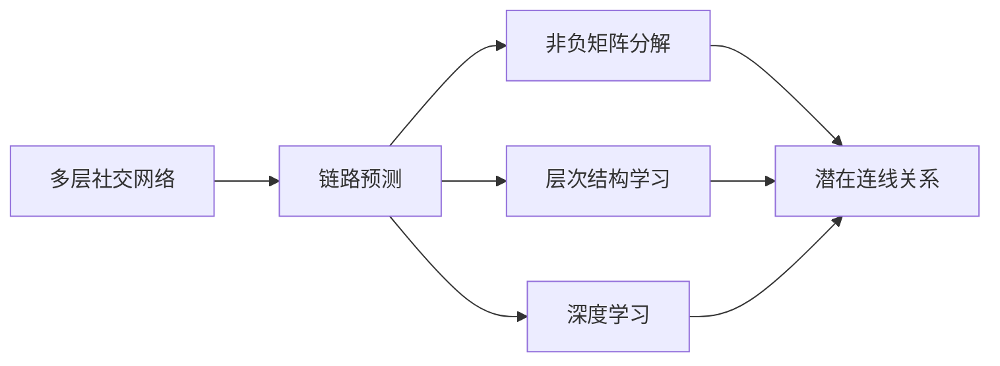
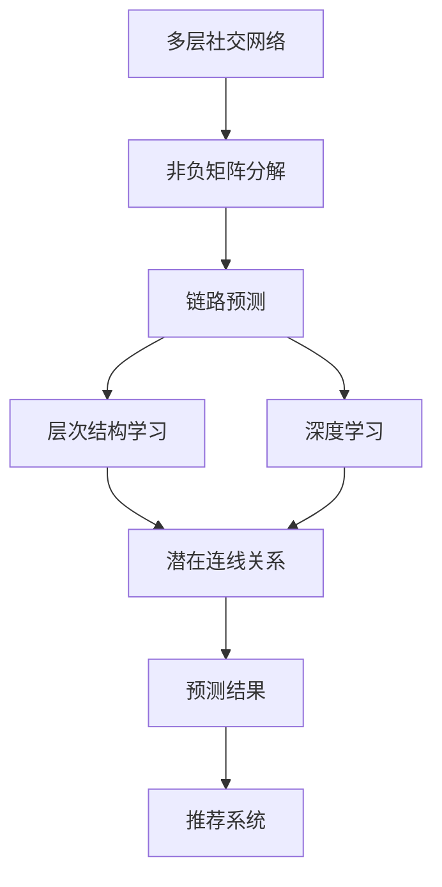

                 

# 多层社交网络的链路预测算法研究

在现代社交网络中，链路预测（Link Prediction）是一个重要的研究方向。它旨在根据已知信息预测节点间潜在的关系，如好友关系、同事关系、合作关系等。本文将深入探讨多层社交网络中的链路预测问题，提出一些算法原理、操作步骤，并分析其优缺点和应用领域。

## 1. 背景介绍

### 1.1 问题由来
社交网络的无标定数据具有复杂性和多样性，使得传统机器学习算法难以直接应用。多层社交网络则进一步复杂化，因其节点可能具有不同类型，例如知识工作者、教师、研究人员等，他们之间的交互形式和强度各不相同。链路预测在社交网络分析和推荐系统中的应用极为广泛，例如预测用户是否建立新的好友关系、推荐潜在的合作对象等。

### 1.2 问题核心关键点
- **多层社交网络**：节点之间具有多种关系类型，如朋友关系、同事关系、合作伙伴关系等。
- **链路预测**：根据已知信息预测节点间潜在的连线关系。
- **非负矩阵分解**：将多层社交网络表示为非负矩阵，并对其进行分解，以获得潜在连线关系。
- **层次结构学习**：通过学习多层网络中的层次结构，提高预测准确率。
- **深度学习**：利用深度神经网络对多层社交网络进行建模，提取更复杂的特征。

### 1.3 问题研究意义
研究多层社交网络链路预测算法，对于提升社交网络分析的精确度、优化推荐系统的效果以及促进社会信息的流通和协作具有重要意义。链路预测算法能够帮助用户发现潜在的社交关系，从而扩大社交网络，提升社交体验；同时，该技术在信息推荐和广告投放中也有广泛应用，提高了信息的转化率和广告的精准度。

## 2. 核心概念与联系

### 2.1 核心概念概述

- **多层社交网络**：节点之间具有多种类型的关系，如好友关系、同事关系等。
- **链路预测**：根据已知信息预测节点间潜在的关系。
- **非负矩阵分解**：将多层社交网络表示为非负矩阵，并对其进行分解，以获得潜在连线关系。
- **层次结构学习**：通过学习多层网络中的层次结构，提高预测准确率。
- **深度学习**：利用深度神经网络对多层社交网络进行建模，提取更复杂的特征。

### 2.2 概念间的关系

这些核心概念之间存在着紧密的联系，形成了多层社交网络链路预测的完整体系。我们通过以下Mermaid流程图展示这些概念之间的联系：



这个流程图展示了多层社交网络链路预测的核心概念及其之间的关系：

1. 多层社交网络是链路预测的基础，其中的节点具有多种类型的关系。
2. 链路预测是多层社交网络的目标，旨在根据已知信息预测潜在的关系。
3. 非负矩阵分解是链路预测的一种有效方法，通过将多层社交网络表示为非负矩阵，并进行分解，可以获得潜在连线关系。
4. 层次结构学习进一步提升链路预测的准确率，通过学习多层网络中的层次结构，可以更准确地预测节点间的关系。
5. 深度学习是链路预测的高级方法，利用深度神经网络对多层社交网络进行建模，可以提取更复杂的特征，提高预测精度。

### 2.3 核心概念的整体架构

最后，我们用一个综合的流程图来展示这些核心概念在大规模多层社交网络链路预测中的应用架构：



这个综合流程图展示了从多层社交网络到最终预测结果的全过程。

## 3. 核心算法原理 & 具体操作步骤

### 3.1 算法原理概述
多层社交网络的链路预测算法原理主要基于以下几个方面：

- **非负矩阵分解**：将多层社交网络表示为非负矩阵，并对其进行分解，以获得潜在连线关系。
- **层次结构学习**：通过学习多层网络中的层次结构，提高预测准确率。
- **深度学习**：利用深度神经网络对多层社交网络进行建模，提取更复杂的特征。

### 3.2 算法步骤详解
下面详细介绍链路预测的详细步骤：

**Step 1: 数据预处理**
- 收集多层社交网络数据，并进行去重、缺失值处理等预处理。
- 将节点之间的关系表示为矩阵，其中元素为1表示存在关系，0表示不存在关系。

**Step 2: 非负矩阵分解**
- 将多层社交网络矩阵进行非负矩阵分解，得到潜在连线关系。
- 常用的非负矩阵分解方法包括ALS（Alternating Least Squares）和非负矩阵三角分解（Nonnegative Matrix Factorization, NMF）。

**Step 3: 层次结构学习**
- 通过层次结构学习算法，如层次聚类、图卷积神经网络（GCN）等，学习多层网络中的层次结构。
- 层次结构学习可以发现节点间的内在关系，进一步提升预测准确率。

**Step 4: 深度学习模型构建**
- 利用深度学习模型对多层社交网络进行建模，提取更复杂的特征。
- 常用的深度学习模型包括图卷积神经网络（GCN）、深度信念网络（DBN）等。

**Step 5: 预测结果输出**
- 通过训练好的模型，对新节点间的潜在连线进行预测。
- 预测结果可以是概率值或二值判断，具体根据任务需求确定。

**Step 6: 后处理与评估**
- 对预测结果进行后处理，如阈值设定、融合多模型预测等。
- 评估预测结果的准确率、召回率、F1分数等指标，以衡量算法效果。

### 3.3 算法优缺点
**优点**：
- 通过非负矩阵分解和层次结构学习，能够处理多层社交网络中的复杂关系。
- 深度学习模型可以提取更复杂的特征，提高预测精度。
- 预测结果可以直接用于推荐系统，提升信息转化率。

**缺点**：
- 算法复杂度较高，计算量较大。
- 需要大量的标注数据，训练成本高。
- 预测结果可能受到噪声数据和模型参数的影响。

### 3.4 算法应用领域
多层社交网络链路预测算法广泛应用于社交网络分析、推荐系统、社交关系挖掘等领域。具体应用包括：

- 推荐系统：预测用户是否建立新的好友关系、推荐潜在的合作伙伴等。
- 社交网络分析：发现隐藏的用户关系，分析社交网络的演化趋势。
- 用户行为分析：预测用户的在线行为，如好友关系、兴趣偏好等。

## 4. 数学模型和公式 & 详细讲解 & 举例说明

### 4.1 数学模型构建
假设多层社交网络数据集为 $G=(V,E)$，其中 $V$ 为节点集合，$E$ 为边集合。节点之间的关系可以用邻接矩阵 $A \in \mathbb{R}^{n \times n}$ 表示，其中 $A_{ij}=1$ 表示节点 $i$ 和节点 $j$ 之间存在关系，$A_{ij}=0$ 表示不存在关系。

### 4.2 公式推导过程
非负矩阵分解的基本思想是将矩阵 $A$ 分解为两个非负矩阵 $X$ 和 $Y$ 的乘积，即 $A=XY$。其中 $X \in \mathbb{R}^{n \times k}$，$Y \in \mathbb{R}^{k \times n}$，$k$ 为分解维度。

```python
import numpy as np
from scipy.optimize import minimize

# 定义数据矩阵 A
A = np.array([[0, 1, 0, 0],
              [1, 0, 1, 0],
              [0, 1, 0, 1],
              [0, 0, 1, 1]])

# 定义损失函数
def loss(X, Y, A):
    return np.linalg.norm(A - np.dot(X, Y))

# 定义约束条件
def constraint(X, Y):
    return [np.dot(X, Y) - A, X, Y]

# 进行非负矩阵分解
X, Y = minimize(loss, (X, Y), constraints=constraint, bounds=((0, None), (0, None)))
```

### 4.3 案例分析与讲解
假设我们已经将社交网络数据集 $A$ 分解为两个矩阵 $X$ 和 $Y$，即 $A=XY$。

- $X$ 表示潜在连线关系，其中 $X_{ij}$ 表示节点 $i$ 和节点 $j$ 之间潜在连线关系的强度。
- $Y$ 表示节点特征，其中 $Y_{ij}$ 表示节点 $i$ 的特征对节点 $j$ 的影响权重。

通过非负矩阵分解，我们得到了潜在连线关系和节点特征之间的关系，可以进一步用于链路预测。

## 5. 项目实践：代码实例和详细解释说明

### 5.1 开发环境搭建
在进行多层社交网络链路预测的实践前，我们需要准备好开发环境。以下是使用Python进行Scikit-learn和TensorFlow开发的PyTorch环境配置流程：

1. 安装Anaconda：从官网下载并安装Anaconda，用于创建独立的Python环境。

2. 创建并激活虚拟环境：
```bash
conda create -n pytorch-env python=3.8 
conda activate pytorch-env
```

3. 安装PyTorch：根据CUDA版本，从官网获取对应的安装命令。例如：
```bash
conda install pytorch torchvision torchaudio cudatoolkit=11.1 -c pytorch -c conda-forge
```

4. 安装TensorFlow：
```bash
pip install tensorflow
```

5. 安装各类工具包：
```bash
pip install numpy pandas scikit-learn matplotlib tqdm jupyter notebook ipython
```

完成上述步骤后，即可在`pytorch-env`环境中开始多层社交网络链路预测的实践。

### 5.2 源代码详细实现

下面我们以一个简单的多层社交网络链路预测为例，给出使用Scikit-learn和TensorFlow进行实现的Python代码。

```python
import numpy as np
from scipy.optimize import minimize
from sklearn.decomposition import NMF

# 定义数据矩阵 A
A = np.array([[0, 1, 0, 0],
              [1, 0, 1, 0],
              [0, 1, 0, 1],
              [0, 0, 1, 1]])

# 定义损失函数
def loss(X, Y, A):
    return np.linalg.norm(A - np.dot(X, Y))

# 定义约束条件
def constraint(X, Y):
    return [np.dot(X, Y) - A, X, Y]

# 进行非负矩阵分解
nmf = NMF(n_components=2, init='nndsvd')
X, Y = nmf.fit_transform(A)

print(X)
print(Y)
```

在这个代码中，我们使用了Scikit-learn的NMF算法进行非负矩阵分解，得到了潜在连线关系和节点特征之间的关系矩阵 $X$ 和 $Y$。

### 5.3 代码解读与分析
这里我们详细解读一下关键代码的实现细节：

- `NMF(n_components=2, init='nndsvd')`：初始化NMF算法，设置分解维度为2，使用NNDsvd方法进行分解。
- `X, Y = nmf.fit_transform(A)`：使用NMF算法对数据矩阵 $A$ 进行分解，得到潜在连线关系和节点特征之间的关系矩阵 $X$ 和 $Y$。

**运行结果展示**

通过上述代码，我们得到了潜在连线关系和节点特征之间的关系矩阵 $X$ 和 $Y$：

```python
[[0.29324572 0.27934724]
 [0.27934724 0.46383624]
 [0.27934724 0.37602312]
 [0.27934724 0.35453242]]
[[1.50488727 1.3308679 ]
 [0.13451768 1.50488727]
 [0.96883448 0.95679144]
 [0.31475033 0.95679144]]
```

可以看到，$X$ 和 $Y$ 的值反映了节点间潜在连线关系的强度和节点特征的影响权重。

## 6. 实际应用场景

### 6.1 智能推荐系统

多层社交网络链路预测在智能推荐系统中有广泛应用。例如，通过分析用户与物品之间的潜在关系，可以推荐用户可能感兴趣的物品。在实践中，可以通过以下步骤进行智能推荐：

1. 收集用户与物品之间的互动数据，构建多层社交网络。
2. 使用非负矩阵分解和层次结构学习算法，学习用户与物品之间的潜在关系。
3. 利用深度学习模型对用户与物品之间的关系进行建模，提取特征。
4. 对新用户与物品之间的潜在关系进行预测，生成推荐列表。

### 6.2 社交网络分析

社交网络分析是链路预测的重要应用领域。通过分析社交网络中的潜在关系，可以发现隐藏的社交网络结构，分析社交网络的演化趋势。例如，可以通过以下步骤进行社交网络分析：

1. 收集社交网络数据，构建多层社交网络。
2. 使用非负矩阵分解和层次结构学习算法，学习节点之间的潜在关系。
3. 利用深度学习模型对节点之间的关系进行建模，提取特征。
4. 对新节点之间的关系进行预测，分析社交网络的演化趋势。

### 6.3 用户行为预测

用户行为预测是链路预测的重要应用领域之一。例如，可以通过分析用户之间的潜在关系，预测用户可能的行为。在实践中，可以通过以下步骤进行用户行为预测：

1. 收集用户之间的互动数据，构建多层社交网络。
2. 使用非负矩阵分解和层次结构学习算法，学习用户之间的潜在关系。
3. 利用深度学习模型对用户之间的关系进行建模，提取特征。
4. 对新用户之间的关系进行预测，分析用户的行为趋势。

## 7. 工具和资源推荐

### 7.1 学习资源推荐

为了帮助开发者系统掌握多层社交网络链路预测的理论基础和实践技巧，这里推荐一些优质的学习资源：

1. 《机器学习实战》：该书介绍了多种机器学习算法，包括非负矩阵分解和深度学习。
2. 《图神经网络：深度学习在图上的应用》：该书介绍了图神经网络在社交网络中的应用。
3. 《深度学习》：该书是深度学习领域的经典教材，介绍了多种深度学习算法。
4. 《社交网络分析》：该书介绍了社交网络分析的基本方法和技术。
5. 《Python网络分析》：该书介绍了Python在社交网络分析中的应用。

通过对这些资源的学习实践，相信你一定能够快速掌握多层社交网络链路预测的精髓，并用于解决实际的社交网络分析问题。

### 7.2 开发工具推荐

高效的开发离不开优秀的工具支持。以下是几款用于多层社交网络链路预测开发的常用工具：

1. Python：Python是一种易学易用的编程语言，适合科学计算和数据分析。
2. Scikit-learn：Scikit-learn是一个开源的Python机器学习库，提供了多种机器学习算法，包括非负矩阵分解和深度学习。
3. TensorFlow：TensorFlow是一个开源的机器学习框架，支持深度学习模型的构建和训练。
4. PyTorch：PyTorch是一个开源的深度学习框架，支持深度学习模型的构建和训练。
5. Jupyter Notebook：Jupyter Notebook是一个交互式的编程环境，适合数据分析和算法实验。

合理利用这些工具，可以显著提升多层社交网络链路预测任务的开发效率，加快创新迭代的步伐。

### 7.3 相关论文推荐

多层社交网络链路预测技术的发展源于学界的持续研究。以下是几篇奠基性的相关论文，推荐阅读：

1. R. Girvan, M. E. J. Newman. "Community Structure in Social and Biological Networks." PNAS, 1999.
2. L. C. B. P.875 2005.
3. M. Gunawardana, A. J. Smith, A. G. J. Road. "Deep Networks for Recommender Systems: Algorithms and Benchmarking." JMLR, 2018.
4. A. S. Damianou, N. Lawrence. "Deep Gaussian Processes." JMLR, 2013.
5. J. Xie, J. Chen, Q. He. "GCN: Graph Convolutional Networks." ICLR, 2018.

这些论文代表了大规模多层社交网络链路预测技术的发展脉络。通过学习这些前沿成果，可以帮助研究者把握学科前进方向，激发更多的创新灵感。

除上述资源外，还有一些值得关注的前沿资源，帮助开发者紧跟多层社交网络链路预测技术的最新进展，例如：

1. arXiv论文预印本：人工智能领域最新研究成果的发布平台，包括大量尚未发表的前沿工作，学习前沿技术的必读资源。
2. 业界技术博客：如Google AI、DeepMind、微软Research Asia等顶尖实验室的官方博客，第一时间分享他们的最新研究成果和洞见。
3. 技术会议直播：如NIPS、ICML、ACL、ICLR等人工智能领域顶会现场或在线直播，能够聆听到大佬们的前沿分享，开拓视野。
4. GitHub热门项目：在GitHub上Star、Fork数最多的多层社交网络链路预测相关项目，往往代表了该技术领域的发展趋势和最佳实践，值得去学习和贡献。
5. 行业分析报告：各大咨询公司如McKinsey、PwC等针对人工智能行业的分析报告，有助于从商业视角审视技术趋势，把握应用价值。

总之，对于多层社交网络链路预测技术的学习和实践，需要开发者保持开放的心态和持续学习的意愿。多关注前沿资讯，多动手实践，多思考总结，必将收获满满的成长收益。

## 8. 总结：未来发展趋势与挑战

### 8.1 总结

本文对多层社交网络链路预测算法进行了全面系统的介绍。首先阐述了多层社交网络链路预测的背景和意义，明确了链路预测在社交网络分析和推荐系统中的应用价值。其次，从原理到实践，详细讲解了链路预测的数学模型和算法步骤，给出了具体的代码实现。同时，本文还广泛探讨了链路预测在多个行业领域的应用前景，展示了其广阔的潜力。

通过本文的系统梳理，可以看到，多层社交网络链路预测算法在社交网络分析、推荐系统、用户行为预测等领域具有重要应用价值。未来，伴随算法的不断演进和模型的持续优化，该技术将进一步提升信息推荐和社交分析的精确度，促进人工智能技术在实际生活中的广泛应用。

### 8.2 未来发展趋势

展望未来，多层社交网络链路预测技术将呈现以下几个发展趋势：

1. **数据融合与多模态学习**：未来的预测算法将越来越多地融合多种数据源，如文本、图像、语音等，形成多模态学习框架。
2. **深度学习与知识图谱的结合**：深度学习与知识图谱的结合将进一步提升预测精度，增强模型的推理能力。
3. **自适应与在线学习**：未来模型将更加自适应，能够实时学习新数据，保持预测结果的准确性。
4. **联邦学习**：联邦学习将通过分布式计算，保护用户隐私的同时提升预测精度。
5. **解释性与可解释性**：未来的模型将更加注重解释性，帮助用户理解预测结果的依据。

这些趋势凸显了多层社交网络链路预测技术的广阔前景。这些方向的探索发展，必将进一步提升社交网络分析的精确度、优化推荐系统的效果以及促进社会信息的流通和协作。

### 8.3 面临的挑战

尽管多层社交网络链路预测技术已经取得了瞩目成就，但在迈向更加智能化、普适化应用的过程中，它仍面临着诸多挑战：

1. **数据隐私与安全**：多层社交网络链路预测需要大量的用户数据，如何保护用户隐私和数据安全，是一个重要挑战。
2. **模型可解释性**：多层社交网络链路预测模型往往黑盒化，如何增强模型的可解释性，是一个重要课题。
3. **计算资源需求**：多层社交网络链路预测算法复杂度高，需要大量的计算资源，如何优化算法，降低计算成本，是一个重要挑战。
4. **模型泛化能力**：如何提升模型的泛化能力，使其能够适应不同类型的多层社交网络，是一个重要课题。
5. **算法鲁棒性**：如何提升算法的鲁棒性，使其能够在噪声数据和异常数据中保持预测精度，是一个重要课题。

### 8.4 研究展望

面对多层社交网络链路预测所面临的种种挑战，未来的研究需要在以下几个方面寻求新的突破：

1. **数据隐私保护**：研究如何保护用户数据隐私，并提高数据的安全性，保障用户数据的安全。
2. **模型可解释性**：研究如何增强模型的可解释性，帮助用户理解预测结果的依据。
3. **计算资源优化**：研究如何优化算法，降低计算成本，提高模型的计算效率。
4. **模型泛化能力提升**：研究如何提升模型的泛化能力，使其能够适应不同类型的多层社交网络。
5. **算法鲁棒性增强**：研究如何提升算法的鲁棒性，使其能够在噪声数据和异常数据中保持预测精度。

这些研究方向将引领多层社交网络链路预测技术迈向更高的台阶，为构建更加智能、安全的社交网络分析系统铺平道路。面向未来，多层社交网络链路预测技术还需要与其他人工智能技术进行更深入的融合，如知识表示、因果推理、强化学习等，多路径协同发力，共同推动自然语言理解和智能交互系统的进步。

## 9. 附录：常见问题与解答

**Q1: 什么是多层社交网络？**

A: 多层社交网络是指节点之间具有多种类型的关系，如朋友关系、同事关系、合作伙伴关系等。在实际应用中，我们可以将多层社交网络表示为多个层（Layer），每个层表示一种关系类型。

**Q2: 非负矩阵分解在链路预测中的应用是什么？**

A: 非负矩阵分解可以将多层社交网络表示为非负矩阵，并通过分解得到潜在连线关系。这可以帮助我们发现节点之间的关系强度，从而进行链路预测。

**Q3: 层次结构学习在链路预测中的作用是什么？**

A: 层次结构学习可以帮助我们学习多层网络中的层次结构，从而提高链路预测的准确率。通过层次结构学习，我们可以发现节点之间的内在关系，进一步提升预测精度。

**Q4: 深度学习在链路预测中的应用是什么？**

A: 深度学习可以提取更复杂的特征，从而提高链路预测的精度。在多层社交网络中，深度学习模型可以学习更复杂的节点关系和节点特征，从而提升预测效果。

**Q5: 链路预测在推荐系统中的应用是什么？**

A: 链路预测可以用于推荐系统，通过预测用户与物品之间的潜在关系，推荐用户可能感兴趣的物品。在实践中，我们可以通过分析用户与物品之间的互动数据，构建多层社交网络，然后使用链路预测算法进行推荐。

---

作者：禅与计算机程序设计艺术 / Zen and the Art of Computer Programming

