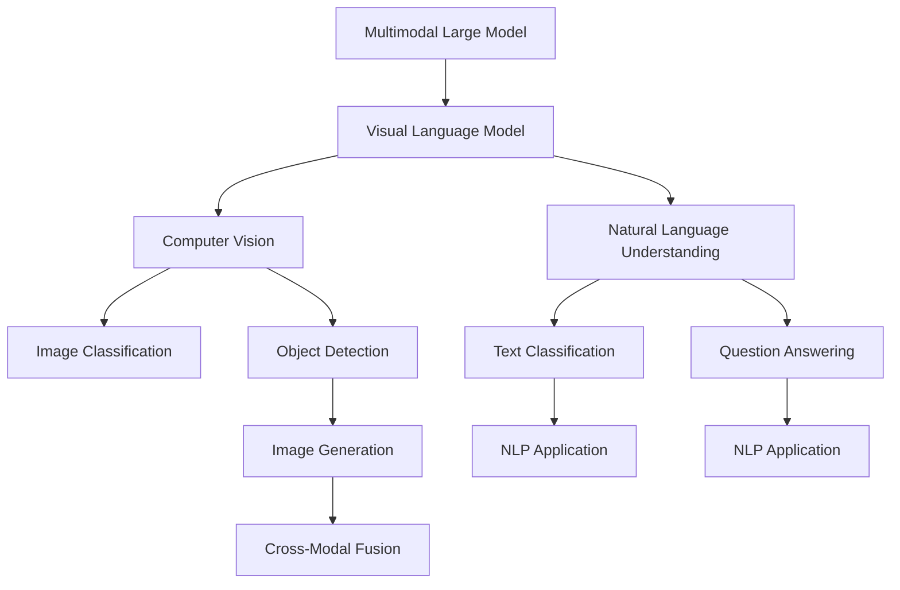
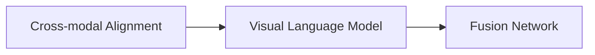
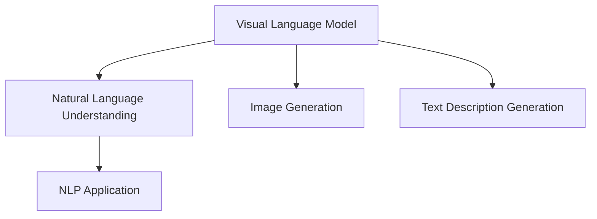
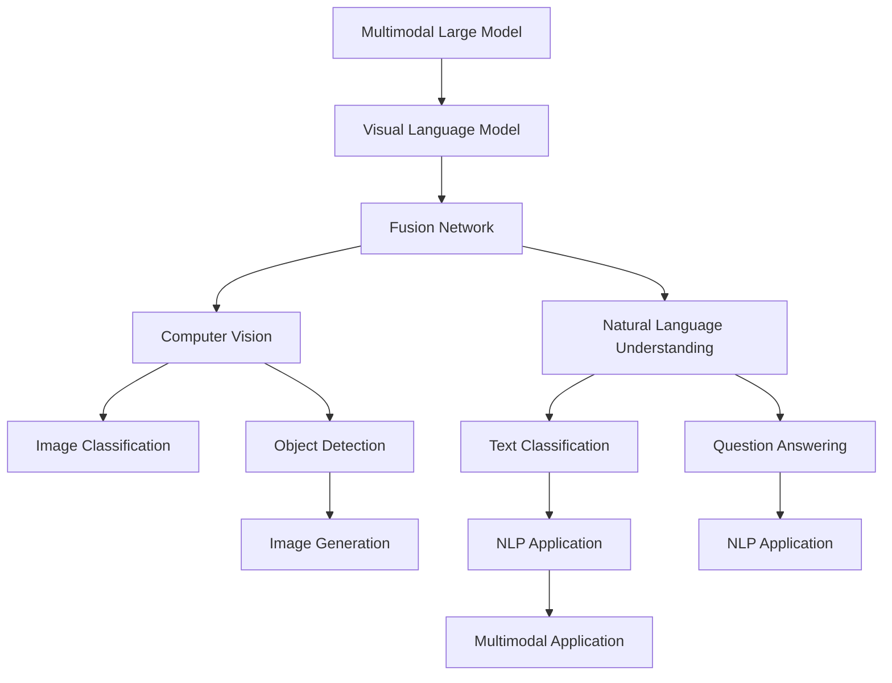

                 

# 多模态大模型：技术原理与实战 OpenAI特殊的股权设计带来的启示

> 关键词：多模态大模型,自然语言处理,图像处理,视觉语言模型,计算机视觉,自然语言理解

## 1. 背景介绍

### 1.1 问题由来
近年来，随着深度学习技术的快速发展，多模态大模型在人工智能领域取得了显著进展。这些模型通过同时处理文本、图像、音频等多种数据模态，展示了强大的跨模态理解和生成能力。OpenAI的DALL·E 2模型、Meta的M2T模型等便是其中的佼佼者，为视觉语言理解和生成、跨模态信息检索、多模态人机交互等领域带来了革命性的变化。

然而，多模态大模型面临的挑战也尤为严峻。由于其复杂性和多样性，训练和优化过程需要大量的计算资源和时间，并且对于数据质量和标注的依赖尤为强烈。此外，多模态模型如何处理跨模态的语义一致性和数据对齐问题，如何设计有效的多模态融合策略，都是亟待解决的难题。

### 1.2 问题核心关键点
多模态大模型的核心在于如何融合文本、图像、音频等多种数据模态，构建统一的语义空间，并在此基础上进行高效的跨模态推理和生成。常见的方法包括：

1. **跨模态对齐**：通过多模态自监督学习任务，如Siamese网络、triplet损失等，学习多种数据模态之间的相似性度量和映射。
2. **融合网络**：利用注意力机制、加权求和等方法，将不同模态的信息进行融合，得到更具表现力的跨模态表示。
3. **多模态编码器**：使用深度学习模型（如Transformer、CNN等）分别处理不同模态的数据，然后通过交叉注意力或跨层连接进行信息交流和融合。
4. **跨模态任务设计**：设计特定的跨模态任务，如视觉问答、跨模态检索等，通过任务导向的监督学习，提升模型在多模态数据上的表现。

这些方法的目的都是为了构建一个能够同时理解、生成和处理多模态数据的大型模型，从而推动人工智能技术在多个领域的深入应用。

### 1.3 问题研究意义
研究多模态大模型，对于推动跨模态信息处理技术的进步，拓展人工智能的应用边界，具有重要意义：

1. **提升智能交互体验**：多模态大模型能够同时理解和生成文本、图像、音频等多种信息，为自然语言理解和生成、视觉语言推理、语音识别和合成等任务提供新的突破。
2. **加速信息检索和推荐**：通过多模态信息的融合，能够更好地理解用户查询，提升信息检索和推荐系统的精准度和用户体验。
3. **促进跨领域应用**：多模态大模型能够处理多种数据源，将不同领域的信息融合在一起，推动人工智能技术在医疗、金融、教育等多个垂直领域的产业化进程。
4. **增强模型鲁棒性**：通过融合多模态数据，可以提高模型对数据噪声和变化环境的鲁棒性，降低单模态数据对模型性能的限制。
5. **拓展跨模态认知**：通过多模态大模型，可以构建更加全面、准确的认知模型，增强对复杂现实世界的理解能力。

## 2. 核心概念与联系

### 2.1 核心概念概述

为更好地理解多模态大模型的技术原理与实战，本节将介绍几个密切相关的核心概念：

- **多模态大模型(Multimodal Large Model)**：通过深度学习同时处理文本、图像、音频等多种数据模态的大模型。典型的多模态大模型包括DALL·E 2、M2T等，能够实现多模态数据的理解、生成和推理。

- **跨模态对齐(Cross-modal Alignment)**：通过多模态自监督学习任务，学习多种数据模态之间的相似性度量和映射，从而实现跨模态数据的对齐。

- **融合网络(Fusion Network)**：利用注意力机制、加权求和等方法，将不同模态的信息进行融合，得到更具表现力的跨模态表示。

- **多模态编码器(Multimodal Encoder)**：使用深度学习模型（如Transformer、CNN等）分别处理不同模态的数据，然后通过交叉注意力或跨层连接进行信息交流和融合。

- **视觉语言模型(Visual Language Model)**：同时处理视觉和语言数据的模型，能够实现视觉场景描述、图像生成、文本描述生成等任务。

- **计算机视觉(Computer Vision)**：专注于图像和视频数据的处理和分析，包括图像分类、物体检测、图像生成等任务。

- **自然语言理解(Natural Language Understanding)**：通过模型理解自然语言文本的语义和结构，实现语言生成、信息抽取、问答系统等任务。

这些核心概念之间存在着紧密的联系，形成了多模态大模型的完整生态系统。

### 2.2 概念间的关系

这些核心概念之间存在着紧密的联系，形成了多模态大模型的完整生态系统。

#### 2.2.1 多模态大模型的学习范式



这个流程图展示了大模型处理多模态数据的一般流程：

1. 多模态大模型先对图像和文本进行分别处理。
2. 图像处理部分通过计算机视觉模型进行分类、检测等任务。
3. 文本处理部分通过自然语言理解模型进行分类、问答等任务。
4. 最后，通过跨模态融合网络，将视觉和文本信息进行整合，得到跨模态表示。
5. 再通过视觉语言模型进行语义生成或推理。

#### 2.2.2 跨模态对齐与融合的关系



这个流程图展示了跨模态对齐与融合网络的关系：

1. 跨模态对齐通过多模态自监督学习任务，学习多种数据模态之间的相似性度量和映射。
2. 融合网络通过注意力机制、加权求和等方法，将不同模态的信息进行融合。
3. 最终通过融合网络得到的跨模态表示，可以作为视觉语言模型的输入。

#### 2.2.3 视觉语言模型与自然语言理解的关系



这个流程图展示了视觉语言模型与自然语言理解之间的关系：

1. 视觉语言模型能够生成文本描述或图像，增强对视觉数据的理解。
2. 自然语言理解模型能够理解文本语义，提升语言生成或推理的准确度。
3. 两者通过多模态融合网络进行信息交流和融合，提升模型的跨模态推理能力。

### 2.3 核心概念的整体架构

最后，我们用一个综合的流程图来展示这些核心概念在大模型微调过程中的整体架构：



这个综合流程图展示了从预训练到微调，再到实际应用的多模态大模型流程：

1. 大模型通过预训练学习多种数据模态的通用表示。
2. 微调过程中，通过添加任务适配层，学习特定任务的表示。
3. 实际应用中，通过多模态融合网络，将不同模态的数据进行整合，输出跨模态的推理结果。

通过这些流程图，我们可以更清晰地理解多模态大模型的学习过程和各个环节的作用。

## 3. 核心算法原理 & 具体操作步骤
### 3.1 算法原理概述

多模态大模型的核心在于如何构建一个能够同时理解、生成和处理多种数据模态的模型，并在此基础上进行高效的跨模态推理和生成。常见的方法包括跨模态对齐、融合网络和多模态编码器等。

形式化地，假设多模态大模型为 $M_{\theta}$，其中 $\theta$ 为模型参数。假设训练数据集为 $\{(x_{i,im}, x_{i,lt})\}_{i=1}^N, x_{i,im} \in \mathcal{X}_{im}, x_{i,lt} \in \mathcal{X}_{lt}$，分别表示图像和文本的输入，$y_{i,lt} \in \mathcal{Y}_{lt}$ 表示文本的输出。

定义模型 $M_{\theta}$ 在数据样本 $(x_{i,im}, x_{i,lt})$ 上的损失函数为 $\ell(M_{\theta}(x_{i,im}, x_{i,lt}), y_{i,lt})$，则在数据集上的经验风险为：

$$
\mathcal{L}(\theta) = \frac{1}{N} \sum_{i=1}^N \ell(M_{\theta}(x_{i,im}, x_{i,lt}), y_{i,lt})
$$

微调的优化目标是最小化经验风险，即找到最优参数：

$$
\theta^* = \mathop{\arg\min}_{\theta} \mathcal{L}(\theta)
$$

通过梯度下降等优化算法，微调过程不断更新模型参数 $\theta$，最小化损失函数 $\mathcal{L}$，使得模型输出逼近真实标签。由于 $\theta$ 已经通过预训练获得了较好的初始化，因此即便在小规模数据集上，微调也能较快收敛到理想的模型参数 $\hat{\theta}$。

### 3.2 算法步骤详解

多模态大模型的微调一般包括以下几个关键步骤：

**Step 1: 准备多模态数据和模型**

- 选择合适的多模态大模型 $M_{\theta}$ 作为初始化参数，如DALL·E 2、M2T等。
- 准备多模态任务的标注数据集 $D=\{(x_{i,im}, x_{i,lt}, y_{i,lt})\}_{i=1}^N$，划分为训练集、验证集和测试集。一般要求标注数据与预训练数据的分布不要差异过大。

**Step 2: 添加任务适配层**

- 根据任务类型，在多模态大模型顶层设计合适的输出层和损失函数。
- 对于分类任务，通常在顶层添加线性分类器和交叉熵损失函数。
- 对于生成任务，通常使用语言模型的解码器输出概率分布，并以负对数似然为损失函数。

**Step 3: 设置微调超参数**

- 选择合适的优化算法及其参数，如 AdamW、SGD 等，设置学习率、批大小、迭代轮数等。
- 设置正则化技术及强度，包括权重衰减、Dropout、Early Stopping 等。
- 确定冻结预训练参数的策略，如仅微调顶层，或全部参数都参与微调。

**Step 4: 执行梯度训练**

- 将训练集数据分批次输入模型，前向传播计算损失函数。
- 反向传播计算参数梯度，根据设定的优化算法和学习率更新模型参数。
- 周期性在验证集上评估模型性能，根据性能指标决定是否触发 Early Stopping。
- 重复上述步骤直到满足预设的迭代轮数或 Early Stopping 条件。

**Step 5: 测试和部署**

- 在测试集上评估微调后模型 $M_{\hat{\theta}}$ 的性能，对比微调前后的精度提升。
- 使用微调后的模型对新样本进行推理预测，集成到实际的应用系统中。
- 持续收集新的数据，定期重新微调模型，以适应数据分布的变化。

以上是多模态大模型微调的一般流程。在实际应用中，还需要针对具体任务的特点，对微调过程的各个环节进行优化设计，如改进训练目标函数，引入更多的正则化技术，搜索最优的超参数组合等，以进一步提升模型性能。

### 3.3 算法优缺点

多模态大模型的微调方法具有以下优点：

1. 简单高效。只需准备少量标注数据，即可对预训练模型进行快速适配，获得较大的性能提升。
2. 通用适用。适用于各种多模态下游任务，包括分类、匹配、生成等，设计简单的任务适配层即可实现微调。
3. 参数高效。利用参数高效微调技术，在固定大部分预训练参数的情况下，仍可取得不错的提升。
4. 效果显著。在学术界和工业界的诸多任务上，基于微调的方法已经刷新了最先进的性能指标。

同时，该方法也存在一定的局限性：

1. 依赖标注数据。微调的效果很大程度上取决于标注数据的质量和数量，获取高质量标注数据的成本较高。
2. 迁移能力有限。当目标任务与预训练数据的分布差异较大时，微调的性能提升有限。
3. 负面效果传递。预训练模型的固有偏见、有害信息等，可能通过微调传递到下游任务，造成负面影响。
4. 可解释性不足。微调模型的决策过程通常缺乏可解释性，难以对其推理逻辑进行分析和调试。

尽管存在这些局限性，但就目前而言，多模态大模型的微调方法仍然是大模型应用的最主流范式。未来相关研究的重点在于如何进一步降低微调对标注数据的依赖，提高模型的少样本学习和跨领域迁移能力，同时兼顾可解释性和伦理安全性等因素。

### 3.4 算法应用领域

多模态大模型微调方法在NLP、CV、多媒体信息处理等多个领域已经得到了广泛的应用，覆盖了几乎所有常见任务，例如：

- 图像描述生成：将图像输入大模型，生成对应的文本描述。
- 视觉问答：回答关于图像的文本问题。
- 跨模态检索：从图像或文本中检索出相应的信息。
- 多模态对话系统：使机器能够同时理解和处理文本和图像，实现更自然的人机交互。
- 医学影像诊断：利用图像和文本信息，辅助医生进行疾病诊断和分析。
- 多媒体检索：从图像、视频和文本中检索出相关信息。
- 跨模态推荐：将图像和文本信息结合，提升推荐系统的精准度和用户体验。

除了上述这些经典任务外，多模态大模型微调也被创新性地应用到更多场景中，如可控生成、视觉推理、交互式可视化等，为多模态信息处理带来了新的突破。

## 4. 数学模型和公式 & 详细讲解 & 举例说明

### 4.1 数学模型构建

本节将使用数学语言对多模态大模型的微调过程进行更加严格的刻画。

记多模态大模型为 $M_{\theta}:\mathcal{X}_{im} \times \mathcal{X}_{lt} \rightarrow \mathcal{Y}_{lt}$，其中 $\mathcal{X}_{im}$ 和 $\mathcal{X}_{lt}$ 分别为图像和文本的输入空间，$\mathcal{Y}_{lt}$ 为输出空间，$\theta \in \mathbb{R}^d$ 为模型参数。假设微调任务的训练集为 $D=\{(x_{i,im}, x_{i,lt}, y_{i,lt})\}_{i=1}^N, x_{i,im} \in \mathcal{X}_{im}, x_{i,lt} \in \mathcal{X}_{lt}, y_{i,lt} \in \mathcal{Y}_{lt}$。

定义模型 $M_{\theta}$ 在数据样本 $(x_{i,im}, x_{i,lt})$ 上的损失函数为 $\ell(M_{\theta}(x_{i,im}, x_{i,lt}), y_{i,lt})$，则在数据集 $D$ 上的经验风险为：

$$
\mathcal{L}(\theta) = \frac{1}{N} \sum_{i=1}^N \ell(M_{\theta}(x_{i,im}, x_{i,lt}), y_{i,lt})
$$

微调的优化目标是最小化经验风险，即找到最优参数：

$$
\theta^* = \mathop{\arg\min}_{\theta} \mathcal{L}(\theta)
$$

在实践中，我们通常使用基于梯度的优化算法（如SGD、Adam等）来近似求解上述最优化问题。设 $\eta$ 为学习率，$\lambda$ 为正则化系数，则参数的更新公式为：

$$
\theta \leftarrow \theta - \eta \nabla_{\theta}\mathcal{L}(\theta) - \eta\lambda\theta
$$

其中 $\nabla_{\theta}\mathcal{L}(\theta)$ 为损失函数对参数 $\theta$ 的梯度，可通过反向传播算法高效计算。

### 4.2 公式推导过程

以下我们以图像描述生成任务为例，推导多模态大模型的损失函数及其梯度的计算公式。

假设模型 $M_{\theta}$ 在图像输入 $x_{i,im}$ 和文本输入 $x_{i,lt}$ 上的输出为 $\hat{y}_{i,lt}=M_{\theta}(x_{i,im}, x_{i,lt})$，表示模型对图像的描述。真实标签 $y_{i,lt} \in \mathcal{Y}_{lt}$。则多模态大模型的损失函数定义为：

$$
\ell(M_{\theta}(x_{i,im}, x_{i,lt}), y_{i,lt}) = -[y_{i,lt}\log \hat{y}_{i,lt} + (1-y_{i,lt})\log (1-\hat{y}_{i,lt})]
$$

将其代入经验风险公式，得：

$$
\mathcal{L}(\theta) = -\frac{1}{N}\sum_{i=1}^N [y_{i,lt}\log M_{\theta}(x_{i,im}, x_{i,lt})+(1-y_{i,lt})\log(1-M_{\theta}(x_{i,im}, x_{i,lt}))]
$$

根据链式法则，损失函数对参数 $\theta_k$ 的梯度为：

$$
\frac{\partial \mathcal{L}(\theta)}{\partial \theta_k} = -\frac{1}{N}\sum_{i=1}^N (\frac{y_{i,lt}}{M_{\theta}(x_{i,im}, x_{i,lt})}-\frac{1-y_{i,lt}}{1-M_{\theta}(x_{i,im}, x_{i,lt}))}) \frac{\partial M_{\theta}(x_{i,im}, x_{i,lt})}{\partial \theta_k}
$$

其中 $\frac{\partial M_{\theta}(x_{i,im}, x_{i,lt})}{\partial \theta_k}$ 可进一步递归展开，利用自动微分技术完成计算。

在得到损失函数的梯度后，即可带入参数更新公式，完成模型的迭代优化。重复上述过程直至收敛，最终得到适应下游任务的最优模型参数 $\theta^*$。

## 5. 项目实践：代码实例和详细解释说明
### 5.1 开发环境搭建

在进行多模态大模型微调实践前，我们需要准备好开发环境。以下是使用Python进行PyTorch开发的环境配置流程：

1. 安装Anaconda：从官网下载并安装Anaconda，用于创建独立的Python环境。

2. 创建并激活虚拟环境：
```bash
conda create -n multimodal-env python=3.8 
conda activate multimodal-env
```

3. 安装PyTorch：根据CUDA版本，从官网获取对应的安装命令。例如：
```bash
conda install pytorch torchvision torchaudio cudatoolkit=11.1 -c pytorch -c conda-forge
```

4. 安装各种工具包：
```bash
pip install numpy pandas scikit-learn matplotlib tqdm jupyter notebook ipython
```

完成上述步骤后，即可在`multimodal-env`环境中开始多模态大模型的微调实践。

### 5.2 源代码详细实现

下面我们以视觉问答任务为例，给出使用Transformers库对DALL·E 2模型进行微调的PyTorch代码实现。

首先，定义视觉问答任务的数据处理函数：

```python
from transformers import DALL_E_2ForQuestionAnswering, AdamW

class VisualQuestionAnsweringDataset(Dataset):
    def __init__(self, images, questions, answers, tokenizer, max_len=128):
        self.images = images
        self.questions = questions
        self.answers = answers
        self.tokenizer = tokenizer
        self.max_len = max_len
        
    def __len__(self):
        return len(self.questions)
    
    def __getitem__(self, item):
        image = self.images[item]
        question = self.questions[item]
        answer = self.answers[item]
        
        encoding = self.tokenizer(question, return_tensors='pt', max_length=self.max_len, padding='max_length', truncation=True)
        input_ids = encoding['input_ids'][0]
        attention_mask = encoding['attention_mask'][0]
        
        # 将图像特征转换为token embedding
        image_tokenized = tokenizer.encode_plus(image, return_tensors='pt')
        input_ids = torch.cat([input_ids, image_tokenized['input_ids']], dim=1)
        attention_mask = torch.cat([attention_mask, image_tokenized['attention_mask']], dim=1)
        
        # 将答案转换为token embedding
        answer_tokenized = tokenizer.encode_plus(answer, return_tensors='pt')
        labels = torch.tensor(answer_tokenized['input_ids'][0][len(input_ids):], dtype=torch.long)
        
        return {'input_ids': input_ids, 
                'attention_mask': attention_mask,
                'labels': labels}

# 定义模型和优化器
model = DALL_E_2ForQuestionAnswering.from_pretrained('dall-e-2')
optimizer = AdamW(model.parameters(), lr=2e-5)
```

然后，定义训练和评估函数：

```python
from torch.utils.data import DataLoader
from tqdm import tqdm
from sklearn.metrics import accuracy_score

device = torch.device('cuda') if torch.cuda.is_available() else torch.device('cpu')
model.to(device)

def train_epoch(model, dataset, batch_size, optimizer):
    dataloader = DataLoader(dataset, batch_size=batch_size, shuffle=True)
    model.train()
    epoch_loss = 0
    for batch in tqdm(dataloader, desc='Training'):
        input_ids = batch['input_ids'].to(device)
        attention_mask = batch['attention_mask'].to(device)
        labels = batch['labels'].to(device)
        model.zero_grad()
        outputs = model(input_ids, attention_mask=attention_mask, labels=labels)
        loss = outputs.loss
        epoch_loss += loss.item()
        loss.backward()
        optimizer.step()
    return epoch_loss / len(dataloader)

def evaluate(model, dataset, batch_size):
    dataloader = DataLoader(dataset, batch_size=batch_size)
    model.eval()
    preds, labels = [], []
    with torch.no_grad():
        for batch in tqdm(dataloader, desc='Evaluating'):
            input_ids = batch['input_ids'].to(device)
            attention_mask = batch['attention_mask'].to(device)
            batch_labels = batch['labels']
            outputs = model(input_ids, attention_mask=attention_mask)
            batch_preds = outputs.logits.argmax(dim=2).to('cpu').tolist()
            batch_labels = batch_labels.to('cpu').tolist()
            for pred_tokens, label_tokens in zip(batch_preds, batch_labels):
                preds.append(pred_tokens)
                labels.append(label_tokens)
                
    return accuracy_score(labels, preds)
```

最后，启动训练流程并在测试集上评估：

```python
epochs = 5
batch_size = 16

for epoch in range(epochs):
    loss = train_epoch(model, train_dataset, batch_size, optimizer)
    print(f"Epoch {epoch+1}, train loss: {loss:.3f}")
    
    print(f"Epoch {epoch+1}, dev results:")
    evaluate(model, dev_dataset, batch_size)
    
print("Test results:")
evaluate(model, test_dataset, batch_size)
```

以上就是使用PyTorch对DALL·E 2进行视觉问答任务微调的完整代码实现。可以看到，得益于Transformers库的强大封装，我们可以用相对简洁的代码完成DALL·E 2模型的加载和微调。

### 5.3 代码解读与分析

让我们再详细解读一下关键代码的实现细节：

**VisualQuestionAnsweringDataset类**：
- `__init__`方法：初始化图像、问题、答案、分词器等关键组件。
- `__len__`方法：返回数据集的样本数量。
- `__getitem__`方法：对单个样本进行处理，将问题输入编码为token ids，将图像特征和答案转换为token embedding，并对其进行定长padding，最终返回模型所需的输入。

**代码解读与分析**：
- 使用PyTorch的

