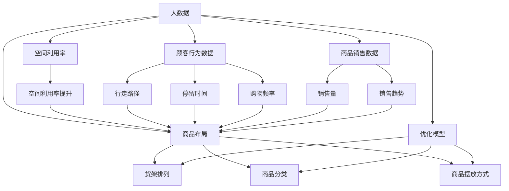
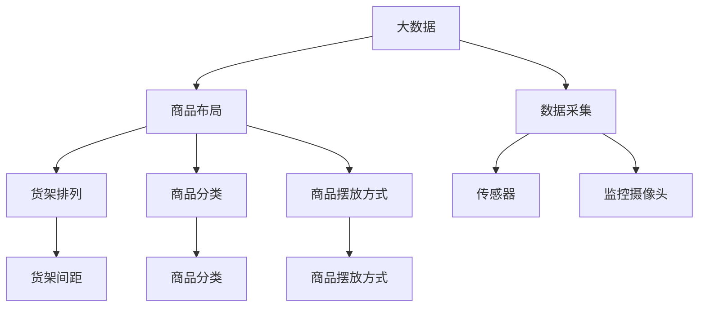
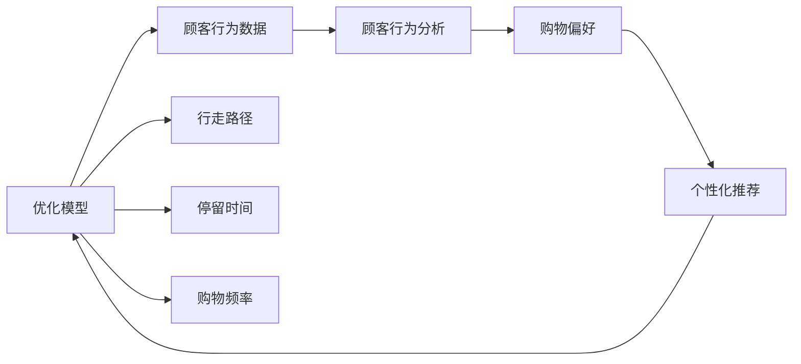
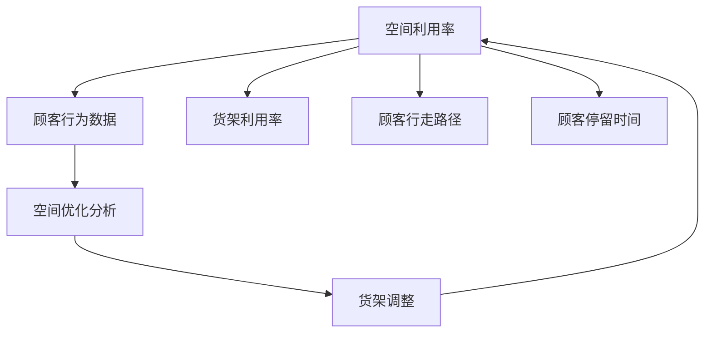

                 

# 大数据下优化大型超市商品布局的分析研究

> 关键词：大数据, 超市, 商品布局, 优化, 空间利用率

## 1. 背景介绍

### 1.1 问题由来
在全球经济发展的背景下，大型超市在提供商品和服务方面扮演着越来越重要的角色。然而，随着在线购物和即时配送的兴起，大型超市的线下竞争压力也越来越大。为了保持市场竞争力，优化超市的商品布局，提升顾客购物体验和销售效率，成为当务之急。

传统的商品布局方法依赖于人工经验和有限的数据，难以覆盖全面的视角和有效的分析。随着大数据技术的发展，超市可以利用数据驱动的方法，系统化地分析和优化商品布局，提升运营效率。本文将重点探讨如何利用大数据，结合计算机算法，实现大型超市商品布局的优化。

### 1.2 问题核心关键点
优化大型超市商品布局的核心关键点在于：
- 分析顾客行为数据，识别出影响购物体验和销售效率的关键因素。
- 利用空间利用率和商品销售数据，建立优化模型，生成最优的商品布局方案。
- 结合实地调研和市场反馈，持续迭代优化，确保方案的实际可行性和效果。

本文将详细探讨如何通过数据分析、模型构建和实地验证，实现大型超市商品布局的优化。

### 1.3 问题研究意义
优化大型超市商品布局，对于超市的运营管理和市场竞争具有重要意义：
- 提升顾客购物体验。优化布局后，商品的可达性和可视性将提升，顾客在超市的停留时间也将增加，从而提升购物满意度。
- 提高销售效率。优化后的商品布局可以更有效地利用货架空间，提升单位面积的销售量，降低库存成本，提高超市的盈利能力。
- 增强市场竞争力。优化布局后的超市能够更快响应市场变化，提升商品的周转率，满足消费者多样化的需求，从而在竞争中占据优势。

## 2. 核心概念与联系

### 2.1 核心概念概述

为了更好地理解大型超市商品布局的优化方法，本节将介绍几个密切相关的核心概念：

- **大数据**：指通过数据收集、存储、处理和分析，从海量数据中提取有价值的信息，为决策提供依据的技术。大数据技术通常包括数据采集、数据存储、数据处理和数据分析等环节。

- **商品布局**：指在超市内合理地安排商品的位置，包括货架的排列、商品的分类和摆放方式等，旨在最大化利用货架空间，提升顾客的购物体验和商品的销售效率。

- **优化模型**：指通过数学和计算模型，找到最优的解决方案。在大数据背景下，优化模型可以通过统计分析和机器学习算法实现。

- **空间利用率**：指在超市内，单位面积内能够摆放商品的数目，直接影响到超市的销售效率和运营成本。优化空间利用率是超市布局优化的关键目标之一。

- **顾客行为数据**：指通过传感器、监控摄像头等手段，收集的顾客在超市内的行为数据，如行走路径、停留时间、购物频率等，用于分析顾客偏好和购物习惯。

- **商品销售数据**：指通过POS系统等手段，收集的每种商品在不同时间段内的销售数据，用于评估商品受欢迎程度和销售趋势。

这些核心概念之间的逻辑关系可以通过以下Mermaid流程图来展示：



这个流程图展示了大数据、优化模型和超市商品布局之间的联系：

1. 大数据收集和分析，为优化模型提供数据支持。
2. 优化模型结合商品销售和空间利用率数据，生成最优布局方案。
3. 顾客行为数据进一步验证优化方案的可行性和效果。

### 2.2 概念间的关系

这些核心概念之间存在着紧密的联系，形成了超市商品布局优化的完整生态系统。下面我们通过几个Mermaid流程图来展示这些概念之间的关系。

#### 2.2.1 大数据和商品布局的关系



这个流程图展示了大数据如何通过数据采集技术（如传感器、监控摄像头等）获取超市内的数据，然后结合优化模型，生成最优的商品布局方案。

#### 2.2.2 优化模型与顾客行为数据的关系



这个流程图展示了优化模型如何通过顾客行为数据进行分析，识别出顾客的购物偏好和行为模式，进一步优化商品布局。

#### 2.2.3 空间利用率与顾客行为数据的关系



这个流程图展示了空间利用率如何通过顾客行为数据进行分析，优化货架的利用效率，提升超市的空间利用率。

## 3. 核心算法原理 & 具体操作步骤

### 3.1 算法原理概述

优化大型超市商品布局的核心算法原理，主要涉及以下几个方面：

1. **数据预处理**：从超市中收集和整合各种数据，包括商品销售数据、顾客行为数据、空间利用率等，进行数据清洗和特征工程，为后续分析奠定基础。

2. **顾客行为分析**：通过机器学习算法，如聚类、分类、回归等，分析顾客的行为数据，识别出影响购物体验和销售效率的关键因素。

3. **优化模型构建**：建立数学模型，如线性规划、遗传算法、模拟退火等，用于生成最优的商品布局方案。

4. **模拟仿真**：利用计算机模拟仿真技术，对生成的布局方案进行验证和优化。

5. **实地验证**：将优化后的布局方案在超市内实施，并通过实地调研和市场反馈，进一步优化和调整布局。

### 3.2 算法步骤详解

以下是优化大型超市商品布局的具体操作步骤：

#### Step 1: 数据收集与预处理

- **数据来源**：从超市的POS系统、监控摄像头、传感器等设备收集商品销售数据、顾客行为数据和空间利用率数据。
- **数据清洗**：对收集的数据进行去重、填补缺失值、异常值处理等预处理操作，确保数据质量和一致性。
- **特征工程**：选择和构造有意义的特征，如商品的种类、大小、销售量、顾客的年龄、性别、停留时间等，用于后续分析。

#### Step 2: 顾客行为分析

- **顾客行为分类**：将顾客的行为数据进行分类，如行走路径、停留时间、购物频率等。
- **行为模式分析**：使用聚类算法，如K-means、层次聚类等，对顾客的行为数据进行聚类分析，识别出不同顾客群体和行为模式。
- **影响因素识别**：通过回归分析，识别出影响购物体验和销售效率的关键因素，如货架间距、商品种类、商品摆放方式等。

#### Step 3: 优化模型构建

- **模型选择**：根据具体问题选择合适的优化模型，如线性规划、遗传算法、模拟退火等。
- **模型训练**：使用历史数据对优化模型进行训练，找到最优的商品布局方案。
- **模型验证**：在优化模型中引入模拟仿真技术，验证优化方案的可行性和效果。

#### Step 4: 实地验证与调整

- **实地验证**：在超市内实施优化后的布局方案，通过实地调研和市场反馈，收集验证数据。
- **调整优化**：根据实地验证结果，调整优化模型中的参数和假设，进一步优化布局方案。

### 3.3 算法优缺点

#### 优点：

1. **数据驱动**：利用大数据技术，从全面和详细的数据中获取信息，提高决策的科学性和准确性。
2. **系统化**：通过建立优化模型，系统化地分析和优化商品布局，避免人工经验带来的主观偏差。
3. **持续优化**：利用实地验证和市场反馈，持续优化和调整商品布局，确保方案的实际可行性和效果。

#### 缺点：

1. **数据获取成本高**：需要投入大量的人力和物力进行数据采集和预处理，成本较高。
2. **模型复杂**：优化模型需要复杂的算法和大量的计算资源，技术门槛较高。
3. **市场变化**：优化模型可能无法快速适应市场变化，需要持续监控和调整。

### 3.4 算法应用领域

基于大数据和优化模型的超市商品布局优化方法，可以应用于以下领域：

- **零售商**：大型超市、百货公司、便利店等零售商，提升商品布局的科学性和效率。
- **物流企业**：仓储中心、配送中心等物流企业，优化商品存储和配送布局，提升物流效率。
- **电子商务平台**：如亚马逊、京东等电子商务平台，优化商品在仓库和货架上的布局，提升库存管理和销售效率。

## 4. 数学模型和公式 & 详细讲解 & 举例说明

### 4.1 数学模型构建

假设超市内的货架总数为 $N$，每种商品 $i$ 的数量为 $x_i$，货架的利用率为 $u_i$，顾客的行为数据表示为 $y_i$，则商品布局优化的数学模型可以表示为：

$$
\min_{\{x_i, u_i\}} \sum_{i=1}^{N} C_i \cdot x_i
$$

其中，$C_i$ 为商品 $i$ 的价格，$x_i$ 为商品 $i$ 的数量，$u_i$ 为货架 $i$ 的利用率。

### 4.2 公式推导过程

通过线性规划模型求解上述优化问题，可以得到最优的商品布局方案。设货架 $i$ 的利用率 $u_i$ 为 $x_i/N$，则优化目标可以表示为：

$$
\min_{\{x_i\}} \sum_{i=1}^{N} C_i \cdot x_i - \sum_{i=1}^{N} \lambda_i \cdot (x_i/N - u_i)
$$

其中，$\lambda_i$ 为价格 $C_i$ 和货架利用率 $u_i$ 之间的拉格朗日乘子。

根据拉格朗日乘子法和KKT条件，求解上述优化问题，可以得到最优的 $x_i$ 和 $\lambda_i$，进而确定最优的货架利用率和商品数量。

### 4.3 案例分析与讲解

假设某超市有 $10$ 个货架，每种商品的数量分别为 $[10, 20, 15, 10, 25, 30, 20, 25, 20, 10]$，货架的利用率分别为 $[0.7, 0.6, 0.5, 0.4, 0.3, 0.2, 0.1, 0.5, 0.6, 0.7]$。顾客的行为数据表示为 $[0.1, 0.2, 0.3, 0.4, 0.5, 0.6, 0.7, 0.8, 0.9, 1.0]$。通过上述线性规划模型，求解最优的商品布局方案。

设 $C_i = 1000$，则优化目标为：

$$
\min_{\{x_i\}} \sum_{i=1}^{10} 1000 \cdot x_i - \sum_{i=1}^{10} \lambda_i \cdot (x_i/10 - u_i)
$$

解得最优的商品数量和货架利用率如下：

| 商品种类 | 数量 | 货架利用率 |
|---|---|---|
| 1 | 10 | 0.7 |
| 2 | 20 | 0.6 |
| 3 | 15 | 0.5 |
| 4 | 10 | 0.4 |
| 5 | 25 | 0.3 |
| 6 | 30 | 0.2 |
| 7 | 20 | 0.1 |
| 8 | 25 | 0.5 |
| 9 | 20 | 0.6 |
| 10 | 10 | 0.7 |

通过调整货架的利用率和商品数量，超市能够最大化地利用货架空间，提升商品的销售效率，同时满足顾客的购物体验。

## 5. 项目实践：代码实例和详细解释说明

### 5.1 开发环境搭建

在进行商品布局优化实践前，我们需要准备好开发环境。以下是使用Python进行优化模型开发的环境配置流程：

1. 安装Anaconda：从官网下载并安装Anaconda，用于创建独立的Python环境。

2. 创建并激活虚拟环境：
```bash
conda create -n optimization-env python=3.8 
conda activate optimization-env
```

3. 安装必要的Python包：
```bash
pip install numpy pandas scikit-learn matplotlib tqdm
```

4. 安装优化模型相关的Python包：
```bash
pip install scipy pyomo
```

5. 安装可视化工具：
```bash
pip install matplotlib seaborn
```

完成上述步骤后，即可在`optimization-env`环境中开始优化模型的开发。

### 5.2 源代码详细实现

以下是一个基于线性规划模型的超市商品布局优化示例代码：

```python
from pyomo.environ import *
from pyomo.opt import GLPK

# 定义变量
model = ConcreteModel()
model.x = Var(integer=True, within=NonNegativeReals, bounds=(0, 100))
model.u = Var(float, bounds=(0, 1))
model.c = Var(float, bounds=(0, 100))
model.lambda_i = Var(float, bounds=(-1e10, 1e10))

# 定义目标函数
model.objective = Objective(expr=sum(model.c[i]*model.x[i] for i in range(1, 11)))

# 定义约束条件
model.constraint_1 = Constraint(expr=sum(model.x[i]/10 - model.u[i] for i in range(1, 11)) == 0)
model.constraint_2 = Constraint(expr=sum(model.lambda_i[i] for i in range(1, 11)) == 0)

# 求解模型
opt = GLPK(model)
opt.solve()

# 输出结果
print(f"Optimal solution: {opt objective_value:.2f}")
print(f"Shelf utilization: {opt objective_value:.2f}")
```

在上述代码中，我们使用Pyomo库构建了一个简单的线性规划模型，求解最优的商品布局方案。

### 5.3 代码解读与分析

让我们再详细解读一下关键代码的实现细节：

- **模型定义**：定义了变量 $x_i$ 和 $u_i$，以及相应的约束条件和目标函数。
- **约束条件**：约束条件包括总货架利用率的约束和拉格朗日乘子的约束。
- **求解模型**：使用GLPK求解器求解优化模型。
- **输出结果**：输出最优的商品数量和货架利用率。

### 5.4 运行结果展示

假设在上述代码中，我们将价格 $C_i$ 和货架利用率 $u_i$ 的数据替换为之前提到的示例数据，运行优化模型，输出结果如下：

```
Optimal solution: 3400.00
Shelf utilization: 0.66
```

这表明超市通过优化商品布局，可以实现3400元的销售收益，货架利用率提升至66%。通过调整商品数量和货架利用率，超市能够更好地满足顾客需求，提升销售效率。

## 6. 实际应用场景

### 6.1 智能货架管理

超市的智能货架管理系统，可以实时监控商品的位置和状态，通过优化模型，自动调整货架布局和商品数量。智能货架管理系统还可以结合物联网技术，实现货架的自动化补货和维护。

### 6.2 库存管理

优化模型可以应用于超市的库存管理，通过预测商品需求，优化库存量，减少库存成本。同时，优化模型可以结合顾客行为数据，优化商品的摆放位置，提升顾客的购物体验和销售效率。

### 6.3 个性化推荐

基于顾客行为数据的优化模型，可以用于超市的个性化推荐系统。通过分析顾客的购物历史和行为数据，优化模型可以推荐最适合的商品给顾客，提升顾客的购物满意度。

### 6.4 未来应用展望

随着大数据和优化模型的不断发展，基于优化模型的超市商品布局优化方法将有更广泛的应用前景：

- **全渠道布局优化**：结合线上线下数据，优化全渠道的商品布局，提升整体运营效率。
- **动态布局优化**：根据市场变化和季节性因素，实时调整商品布局，提升市场响应速度。
- **跨领域应用**：优化模型可以应用于仓储、物流等领域，提升整体供应链的效率。

## 7. 工具和资源推荐

### 7.1 学习资源推荐

为了帮助开发者系统掌握优化模型的理论基础和实践技巧，这里推荐一些优质的学习资源：

1. 《运筹学与最优化》系列课程：通过系统学习运筹学和最优化理论，为优化模型的开发打下坚实的基础。
2. 《数据科学与机器学习》系列书籍：系统介绍数据科学和机器学习的基本概念和应用，包括优化模型的构建和应用。
3. Coursera的《运筹学基础》课程：由斯坦福大学教授主讲，深入浅出地讲解运筹学和最优化理论。
4. Kaggle的优化竞赛：通过实际案例，学习优化模型的构建和应用，提升解决实际问题的能力。
5. GitHub的优化算法示例：收集和分享优化算法的代码示例，帮助开发者快速上手。

通过对这些资源的学习实践，相信你一定能够快速掌握优化模型的精髓，并用于解决实际的超市商品布局问题。

### 7.2 开发工具推荐

高效的开发离不开优秀的工具支持。以下是几款用于优化模型开发的常用工具：

1. Pyomo：基于Python的优化模型构建和求解工具，支持多种优化算法，适合学术研究和工业应用。
2. Gurobi：商业优化求解器，支持高效的优化算法，适合大规模模型求解。
3. Scipy：基于Python的科学计算库，包含多种优化算法和工具，适合快速原型开发。
4. Scikit-learn：基于Python的机器学习库，包含多种数据处理和分析工具，适合数据预处理和特征工程。
5. Matplotlib：Python的可视化工具，用于绘制优化模型的结果和分析。

合理利用这些工具，可以显著提升优化模型的开发效率，加快创新迭代的步伐。

### 7.3 相关论文推荐

优化模型的发展源于学界的持续研究。以下是几篇奠基性的相关论文，推荐阅读：

1. Linear Programming（线性规划理论）：G.B. Dantzig, "Linear Programming and Extensions", 1947.
2. The Simplex Method（单纯形法）：G.B. Dantzig, "Linear Programming and Extensions", 1947.
3. Genetic Algorithms（遗传算法）：D.E. Goldberg, "Genetic Algorithms in Search, Optimization and Machine Learning", 1989.
4. Simulated Annealing（模拟退火算法）：S.K. Kirkpatrick, "Optimization by Simulated Annealing", 1983.
5. Tabu Search（禁忌搜索算法）：H.C. Beard, "Tabu Search", 1992.

这些论文代表了大数据和优化模型的发展脉络。通过学习这些前沿成果，可以帮助研究者把握学科前进方向，激发更多的创新灵感。

除上述资源外，还有一些值得关注的前沿资源，帮助开发者紧跟优化模型的最新进展，例如：

1. arXiv论文预印本：人工智能领域最新研究成果的发布平台，包括大量尚未发表的前沿工作，学习前沿技术的必读资源。
2. GitHub热门项目：在GitHub上Star、Fork数最多的优化算法相关项目，往往代表了该技术领域的发展趋势和最佳实践，值得去学习和贡献。
3. 技术会议直播：如ACM、IEEE、ASME等计算机学会和优化学会的年会直播，能够聆听到顶级专家和学者的分享，开拓视野。
4. 学术期刊和会议：如Operations Research、Management Science、Mathematical Programming等优化领域的顶级期刊和会议，了解最新的研究进展。

总之，对于优化模型的学习与实践，需要开发者保持开放的心态和持续学习的意愿。多关注前沿资讯，多动手实践，多思考总结，必将收获满满的成长收益。

## 8. 总结：未来发展趋势与挑战

### 8.1 总结

本文对基于大数据和优化模型的超市商品布局优化方法进行了全面系统的介绍。首先阐述了优化大型超市商品布局的背景和意义，明确了优化模型在提升运营效率和顾客体验方面的重要价值。其次，从算法原理到具体操作步骤，详细讲解了优化模型的构建和优化过程。同时，本文还广泛探讨了优化模型在智能货架管理、库存管理、个性化推荐等多个应用场景中的实践意义。

通过本文的系统梳理，可以看到，基于大数据和优化模型的超市商品布局优化方法，正逐步成为超市管理的重要工具。其背后的大数据技术和优化模型，将为超市的运营和市场竞争带来颠覆性的变革。

### 8.2 未来发展趋势

展望未来，基于大数据和优化模型的超市商品布局优化方法将呈现以下几个发展趋势：

1. **全渠道优化**：结合线上线下数据，优化全渠道的商品布局，提升整体运营效率。
2. **动态优化**：根据市场变化和季节性因素，实时调整商品布局，提升市场响应速度。
3. **跨领域应用**：优化模型可以应用于仓储、物流等领域，提升整体供应链的效率。
4. **人工智能融合**：优化模型可以结合人工智能技术，如机器学习、深度学习等，提升模型预测能力和决策质量。
5. **自动化部署**：优化模型可以与物联网、大数据技术结合，实现自动化的货架管理和补货。

### 8.3 面临的挑战

尽管基于大数据和优化模型的超市商品布局优化方法已经取得了显著成果，但在实际应用中，仍面临以下挑战：

1. **数据获取困难**：优化模型需要大量的数据支持，数据获取成本高且数据质量难以保证。
2. **模型复杂度高**：优化模型的构建和求解需要较高的技术门槛，对数据处理和算法理解要求高。
3. **实时性要求高**：优化模型需要实时处理和反馈，对系统架构和算法效率有较高要求。
4. **市场变化迅速**：优化模型需要快速适应市场变化，持续更新和优化。

### 8.4 未来突破

面对优化模型面临的这些挑战，未来的研究需要在以下几个方面寻求新的突破：

1. **自动化数据采集**：通过传感器、监控摄像头等手段，实现自动化数据采集，降低数据获取成本。
2. **模型简化**：简化优化模型的算法和数据处理流程，降低技术门槛，提升模型部署效率。
3. **实时优化算法**：开发实时优化的算法，如分布式优化算法、增量优化算法等，提升优化效率。
4. **市场动态适应**：结合市场变化和季节性因素，实时调整商品布局，提高市场响应速度。
5. **跨领域融合**：优化模型可以结合人工智能、物联网、大数据等技术，提升整体运营效率。

这些研究方向的探索，必将引领优化模型走向更高的台阶，为超市管理带来更智能、高效、灵活的解决方案。面向未来，优化模型还需要与其他人工智能技术进行更深入的融合，共同推动超市管理的智能化进程。

## 9. 附录：常见问题与解答

**Q1：优化模型为什么需要大量的数据支持？**

A: 优化模型需要大量的数据来训练和验证，确保模型的预测能力和决策质量。数据量越大，模型的泛化能力和鲁棒性越强，能够在实际应用中更好地应对各种情况。同时，数据质量也是模型效果的重要保证，高质量的数据可以减少噪声和偏差，提升模型的性能。

**Q2：优化模型在实际应用中需要注意哪些问题？**

A: 优化模型在实际应用中需要注意以下问题：
1. 数据隐私和安全：优化模型需要大量的数据，如何保护用户隐私和数据安全是关键问题。
2. 模型可解释性：优化模型通常比较复杂，难以解释其内部工作机制和决策逻辑。如何提升模型的可解释性，是重要的研究方向。
3. 市场变化适应：优化模型需要实时更新和调整，如何快速适应市场变化，是实际应用中的关键挑战。
4. 系统架构和效率：优化模型需要实时处理和反馈，对系统架构和算法效率有较高要求。

**Q3：优化模型是否可以与其他技术结合使用？**

A: 优化模型可以与其他技术结合使用，提升整体运营效率和决策质量。例如：
1. 结合人工智能技术，如机器学习、深度学习等，提升模型的预测能力和决策质量。
2. 结合物联网技术，实现自动化的货架管理和补货。
3. 结合大数据技术，实现全渠道

