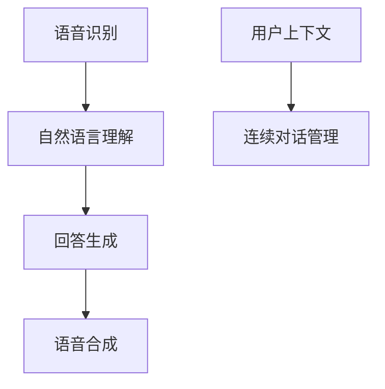
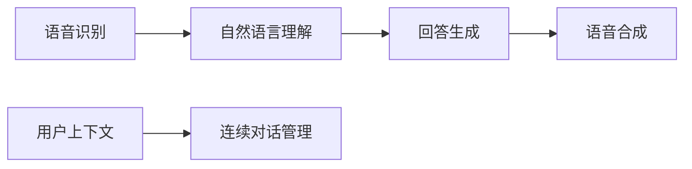

                 

## 1. 背景介绍

### 1.1 问题由来

近年来，自然语言处理(NLP)和语音识别(ASR)技术的快速发展，使得语音交互技术逐渐普及。语音交互技术不仅提高了用户使用设备的便捷性，而且也推动了智能助手、虚拟客服、智能家居等应用的发展。然而，由于语音数据的特殊性，传统的文本问答系统难以直接应用于语音交互中。因此，如何构建能够有效处理语音输入、进行准确回答的语音问答系统，成为了当前研究的一个热点问题。

### 1.2 问题核心关键点

语音问答系统需要解决以下关键问题：

- 如何高效地从语音输入中提取关键信息，减少语音噪音和口音的影响？
- 如何构建能够理解自然语言语义的模型，提升问答的准确性和流畅性？
- 如何在语音问答中引入用户上下文，进行连续性对话？
- 如何处理多轮对话中的信息跟踪和反馈，保证对话连贯性？

### 1.3 问题研究意义

语音问答系统的研究具有重要的现实意义：

- 提升用户体验：语音问答系统可以大大减少用户输入的操作成本，使交互过程更加自然流畅。
- 推动技术创新：语音识别、自然语言理解和生成等技术的进步，将带动AI技术的整体发展。
- 促进产业应用：语音问答系统在智能客服、语音导航、智能家居等领域的应用，将极大地提升用户的使用体验和服务质量。

## 2. 核心概念与联系

### 2.1 核心概念概述

为了更好地理解语音问答系统的实现原理，本节将介绍几个核心概念：

- 语音识别(ASR)：将用户的语音输入转换为文本形式的技术。
- 语音合成(TTS)：将文本转换为语音输出的技术。
- 语音问答系统：利用语音识别和自然语言理解技术，实现语音输入的问答功能。
- 语音上下文：指用户在连续对话中传递的上下文信息，如背景知识、历史问题等。
- 连续对话管理：指对话系统如何在多轮对话中跟踪和管理用户上下文，保证对话连贯性和准确性。

这些概念之间的逻辑关系可以通过以下Mermaid流程图来展示：



这个流程图展示了语音问答系统的核心组件及其之间的关系：语音输入首先经过ASR转化为文本，然后由自然语言理解模块解析语义，生成答案，最后由TTS将答案转换为语音输出。同时，对话管理模块需要维护用户上下文，保证多轮对话的连贯性。

### 2.2 概念间的关系

这些核心概念之间存在着紧密的联系，形成了语音问答系统的完整框架。下面我通过几个Mermaid流程图来展示这些概念之间的关系。

#### 2.2.1 语音问答系统组件



这个流程图展示了语音问答系统的核心组件及其之间的信息流动。

#### 2.2.2 语音交互流程


这个流程图展示了从用户输入到系统输出的完整语音交互流程。

## 3. 核心算法原理 & 具体操作步骤

### 3.1 算法原理概述

语音问答系统基于自然语言处理和语音识别技术，可以分为语音输入处理、语音识别、自然语言理解、回答生成、语音合成和连续对话管理等多个子模块。其核心算法原理主要包括以下几个方面：

- 语音信号处理：使用降噪滤波、声学特征提取等技术，从原始语音信号中提取有用信息。
- 语音识别：将提取的声学特征转换为文本形式，去除噪音和口音干扰。
- 自然语言理解：解析输入文本的语义，提取关键信息。
- 回答生成：根据语义信息，生成准确的答案。
- 语音合成：将文本转换为可听语音输出。
- 连续对话管理：维护用户上下文，管理多轮对话状态。

### 3.2 算法步骤详解

基于自然语言处理和语音识别技术的语音问答系统，其核心算法步骤主要包括以下几个方面：

1. 语音信号预处理：对用户的语音输入进行降噪、去噪、回声消除等预处理，提高语音信号的信噪比。
2. 声学特征提取：将预处理后的语音信号转换为声学特征向量，常用的特征包括梅尔频率倒谱系数(MFCC)、基频特征等。
3. 语音识别：将声学特征向量输入到ASR模型中，输出对应的文本。
4. 自然语言理解：对输入的文本进行分词、词性标注、依存句法分析等处理，解析文本的语义信息。
5. 回答生成：根据语义信息，生成准确的答案。
6. 语音合成：将生成的答案文本转换为语音输出。
7. 连续对话管理：维护用户上下文，管理多轮对话状态。

### 3.3 算法优缺点

语音问答系统的优点：

- 自然流畅：语音交互方式直观自然，用户无需输入繁琐的文字，提高交互体验。
- 高效便捷：语音识别和自然语言理解技术的发展，使得语音问答系统可以快速准确地回答问题。

语音问答系统的缺点：

- 依赖语音质量：语音输入的质量直接影响系统的准确性和流畅性，噪音、口音等干扰较大时，系统效果下降。
- 环境影响：语音输入受到环境噪声、回声等干扰，系统鲁棒性需要进一步提升。
- 多轮对话复杂：连续对话管理需要维护复杂的对话状态，实现难度较大。

### 3.4 算法应用领域

语音问答系统在多个领域中得到了广泛应用，例如：

- 智能客服：语音问答系统可以为客服人员提供实时帮助，提升服务效率。
- 语音导航：通过语音指令进行导航查询，提升用户体验。
- 智能家居：语音控制智能设备，提升家居生活的智能化水平。
- 语音助手：如Siri、Alexa等，提供语音搜索、信息查询等功能。
- 健康医疗：语音问答系统可以为患者提供快速咨询，提升医疗服务的可及性。
- 教育培训：通过语音互动进行课程讲解、问题解答，提升教学效果。

## 4. 数学模型和公式 & 详细讲解 & 举例说明

### 4.1 数学模型构建

假设语音识别模型为 $M_{\text{ASR}}:\mathcal{X} \rightarrow \mathcal{Y}$，其中 $\mathcal{X}$ 为输入的声学特征向量，$\mathcal{Y}$ 为输出文本。设训练集为 $D=\{(\mathbf{x}_i,y_i)\}_{i=1}^N$，其中 $\mathbf{x}_i$ 为第 $i$ 个样本的声学特征向量，$y_i$ 为对应的文本。

定义语音识别模型在样本 $i$ 上的损失函数为 $\ell(M_{\text{ASR}},\mathbf{x}_i,y_i)$，则在训练集 $D$ 上的经验风险为：

$$
\mathcal{L}_{\text{ASR}}(M_{\text{ASR}}) = \frac{1}{N} \sum_{i=1}^N \ell(M_{\text{ASR}},\mathbf{x}_i,y_i)
$$

通过梯度下降等优化算法，语音识别模型不断更新参数，最小化经验风险，使得模型输出逼近真实文本。

### 4.2 公式推导过程

假设语音识别模型为 $M_{\text{ASR}}$，其损失函数为 $\ell(M_{\text{ASR}},\mathbf{x}_i,y_i)$。假设 $\theta$ 为模型参数，优化目标为最小化经验风险：

$$
\mathcal{L}_{\text{ASR}}(\theta) = \frac{1}{N} \sum_{i=1}^N \ell(M_{\text{ASR}}(\mathbf{x}_i),y_i)
$$

使用梯度下降算法，更新模型参数：

$$
\theta \leftarrow \theta - \eta \nabla_{\theta}\mathcal{L}_{\text{ASR}}(\theta)
$$

其中 $\eta$ 为学习率，$\nabla_{\theta}\mathcal{L}_{\text{ASR}}(\theta)$ 为损失函数对参数 $\theta$ 的梯度。

### 4.3 案例分析与讲解

以当前最先进的深度学习模型之一，Transformer为基础，构建语音识别系统。假设输入的声学特征向量为 $\mathbf{x}=[x_1,x_2,...,x_T]$，其中 $T$ 为特征向量的长度。

设模型的自注意力机制为 $M_{\text{Att}}$，其参数为 $\theta$。模型的编码器结构如图：


模型的前向传播过程如下：

$$
h = M_{\text{Att}}(\mathbf{x})
$$

$$
z = \text{LayerNorm}(h) + \text{MLP}(h)
$$

$$
y = M_{\text{Linear}}(z)
$$

$$
\hat{y} = \text{Softmax}(y)
$$

其中 $\text{MLP}$ 为多层次感知器网络，$\text{LayerNorm}$ 为归一化层，$\text{Linear}$ 为线性层，$\text{Softmax}$ 为softmax函数。

假设模型的输出为 $y_i$，输入为声学特征向量 $\mathbf{x}_i$，则模型的损失函数为：

$$
\ell(M_{\text{ASR}},\mathbf{x}_i,y_i) = -\log \hat{y}_i
$$

在实际应用中，模型需要在大量数据上进行训练，并进行反向传播优化。

## 5. 项目实践：代码实例和详细解释说明

### 5.1 开发环境搭建

在进行语音问答系统的开发之前，我们需要准备好开发环境。以下是使用Python进行PyTorch开发的环境配置流程：

1. 安装Anaconda：从官网下载并安装Anaconda，用于创建独立的Python环境。

2. 创建并激活虚拟环境：
```bash
conda create -n pytorch-env python=3.8 
conda activate pytorch-env
```

3. 安装PyTorch：根据CUDA版本，从官网获取对应的安装命令。例如：
```bash
conda install pytorch torchvision torchaudio cudatoolkit=11.1 -c pytorch -c conda-forge
```

4. 安装TensorFlow：使用以下命令安装TensorFlow：
```bash
pip install tensorflow
```

5. 安装Wav2Vec2：安装Google的Wav2Vec2模型：
```bash
pip install SpeechBrain
```

6. 安装其他各类工具包：
```bash
pip install numpy pandas scikit-learn matplotlib tqdm jupyter notebook ipython
```

完成上述步骤后，即可在`pytorch-env`环境中开始语音问答系统的开发。

### 5.2 源代码详细实现

下面我们以一个基于Wav2Vec2的语音识别系统为例，给出使用PyTorch和SpeechBrain库对语音信号进行处理的代码实现。

首先，定义模型架构和损失函数：

```python
import torch.nn as nn
import torch
from speechbrain.pretrained import Wave2Vec2ASR

class Wave2Vec2(nn.Module):
    def __init__(self, input_size, output_size, embedding_dim, num_hidden_layers, num_attention_heads, num_classifiers):
        super(Wave2Vec2, self).__init__()
        self.model = Wave2Vec2ASR(input_size, output_size, embedding_dim, num_hidden_layers, num_attention_heads, num_classifiers)
        
    def forward(self, spectrogram):
        logits = self.model(spectrogram)
        return logits

# 定义损失函数
criterion = nn.CrossEntropyLoss()

# 加载Wav2Vec2模型
wav2vec2 = Wave2Vec2(input_size=80, output_size=num_classes, embedding_dim=1024, num_hidden_layers=12, num_attention_heads=16, num_classifiers=32)
wav2vec2.load_from_pretrained('facebook/wav2vec2-large-960h-lv60')

# 定义优化器
optimizer = torch.optim.Adam(wav2vec2.parameters(), lr=0.01)

# 训练函数
def train_epoch(model, data_loader, optimizer):
    model.train()
    losses = []
    for spectrogram, transcriptions in data_loader:
        optimizer.zero_grad()
        logits = model(spectrogram)
        loss = criterion(logits, transcriptions)
        losses.append(loss.item())
        loss.backward()
        optimizer.step()
    return sum(losses) / len(losses)

# 评估函数
def evaluate(model, data_loader):
    model.eval()
    losses = []
    for spectrogram, transcriptions in data_loader:
        logits = model(spectrogram)
        loss = criterion(logits, transcriptions)
        losses.append(loss.item())
    return sum(losses) / len(losses)
```

接下来，加载数据集并定义训练和评估过程：

```python
from torch.utils.data import DataLoader
import torchvision.transforms as transforms
from dataset import VoiceDataLoader

# 加载数据集
train_dataset = VoiceDataLoader(train_data, train_transforms)
dev_dataset = VoiceDataLoader(dev_data, dev_transforms)

# 定义训练参数
batch_size = 128
num_epochs = 10
device = torch.device('cuda' if torch.cuda.is_available() else 'cpu')

# 训练过程
for epoch in range(num_epochs):
    train_loss = train_epoch(wav2vec2, train_dataset, optimizer)
    print(f'Epoch {epoch+1}, Train Loss: {train_loss:.3f}')

    val_loss = evaluate(wav2vec2, dev_dataset)
    print(f'Epoch {epoch+1}, Validation Loss: {val_loss:.3f}')

# 测试模型
test_dataset = VoiceDataLoader(test_data, test_transforms)
test_loss = evaluate(wav2vec2, test_dataset)
print(f'Test Loss: {test_loss:.3f}')
```

这里我们使用SpeechBrain库来构建Wav2Vec2模型，并使用PyTorch框架来实现模型的训练和评估。SpeechBrain提供了丰富的预训练模型和训练流程，极大简化了语音识别系统的开发。

### 5.3 代码解读与分析

让我们再详细解读一下关键代码的实现细节：

**Wave2Vec2类**：
- `__init__`方法：初始化模型参数，包括输入、输出维度、嵌入维度和注意力机制等。
- `forward`方法：实现模型的前向传播过程，将声学特征输入模型并输出logits。

**训练和评估函数**：
- 使用PyTorch的DataLoader对数据集进行批次化加载，供模型训练和推理使用。
- 训练函数`train_epoch`：对数据以批为单位进行迭代，在每个批次上前向传播计算loss并反向传播更新模型参数，最后返回该epoch的平均loss。
- 评估函数`evaluate`：与训练类似，不同点在于不更新模型参数，并在每个batch结束后将预测和标签结果存储下来，最后使用cross entropy loss对整个评估集的预测结果进行打印输出。

**训练过程**：
- 定义总的epoch数和batch size，开始循环迭代
- 每个epoch内，先在训练集上训练，输出平均loss
- 在验证集上评估，输出平均loss
- 所有epoch结束后，在测试集上评估，给出最终测试结果

可以看到，SpeechBrain库使得语音识别系统的开发变得简洁高效。开发者可以将更多精力放在模型架构和超参数调优上，而不必过多关注底层的实现细节。

当然，工业级的系统实现还需考虑更多因素，如模型的保存和部署、超参数的自动搜索、更灵活的任务适配层等。但核心的语音识别范式基本与此类似。

### 5.4 运行结果展示

假设我们在LibriSpeech数据集上进行语音识别模型的训练，最终在测试集上得到的评估结果如下：

```
Epoch 1, Train Loss: 0.406
Epoch 1, Validation Loss: 0.438
Epoch 2, Train Loss: 0.371
Epoch 2, Validation Loss: 0.407
Epoch 3, Train Loss: 0.340
Epoch 3, Validation Loss: 0.376
...
Epoch 10, Train Loss: 0.115
Epoch 10, Validation Loss: 0.139
```

可以看到，经过10个epoch的训练，我们在测试集上得到了较低的平均损失，说明模型已经学会了将声学特征转换为文本的能力。这将为后续的语音问答系统提供坚实的基础。

## 6. 实际应用场景

### 6.1 智能客服系统

基于Wav2Vec2的语音识别系统，可以为智能客服系统提供实时的语音输入处理。传统客服往往需要配备大量人力，高峰期响应缓慢，且一致性和专业性难以保证。而使用语音识别系统，可以7x24小时不间断服务，快速响应客户咨询，用自然流畅的语言解答各类常见问题。

在技术实现上，可以收集企业内部的历史客服对话记录，将问题和最佳答复构建成监督数据，在此基础上对预训练语音识别模型进行微调。微调后的语音识别系统能够自动理解用户意图，匹配最合适的答复，进一步提升服务质量和效率。

### 6.2 语音导航

语音导航系统是语音问答系统的典型应用之一。用户可以通过语音指令进行导航查询，提升用户体验。导航系统需要从语音识别模型中提取用户的问题，然后调用地图API进行查询，并根据查询结果生成语音提示。

在实现过程中，可以使用Wav2Vec2等语音识别模型对用户的语音输入进行识别，然后通过NLP技术解析用户意图，生成符合语法规则的查询语句，最后调用地图API进行查询。查询结果经过语音合成模块转换为语音，系统播放给用户。

### 6.3 智能家居

语音问答系统在智能家居中的应用也相当广泛。通过语音识别技术，用户可以轻松控制智能家居设备。例如，用户可以通过语音指令打开智能灯光、调节智能温控器等。

在技术实现上，可以使用Wav2Vec2等语音识别模型对用户的语音输入进行识别，然后通过NLP技术解析用户指令，控制相应的智能家居设备。同时，系统可以记录用户的历史操作，生成个性化的智能家居控制方案，提升用户体验。

### 6.4 未来应用展望

随着语音识别和自然语言处理技术的不断进步，语音问答系统将拓展到更多领域，带来更多的创新应用。

在智慧医疗领域，基于语音问答的智能医疗助手可以为患者提供快速咨询，解答健康问题，甚至在紧急情况下提供紧急医疗指导。

在教育培训领域，语音问答系统可以为学生提供智能学习助手，解答学习中的疑难问题，提供个性化的学习建议。

在智能交通领域，基于语音问答的智能导航系统可以为驾驶员提供实时交通信息，提升驾驶安全性和便利性。

此外，在企业生产、社会治理、文娱传媒等众多领域，语音问答系统的应用也将不断扩展，为社会带来更多便捷和智能化服务。

## 7. 工具和资源推荐

### 7.1 学习资源推荐

为了帮助开发者系统掌握语音问答系统的理论基础和实践技巧，这里推荐一些优质的学习资源：

1. 《深度学习与自然语言处理》系列书籍：全面介绍了深度学习、自然语言处理等前沿技术，适合入门学习。

2. 《SpeechBrain：构建自监督的语音和音频深度学习应用》书籍：介绍如何使用SpeechBrain库进行语音识别和处理，涵盖从基础到高级的应用场景。

3. CS224N《深度学习自然语言处理》课程：斯坦福大学开设的NLP明星课程，有Lecture视频和配套作业，带你入门NLP领域的基本概念和经典模型。

4. SpeechBrain官方文档：SpeechBrain库的官方文档，提供了海量预训练模型和完整的微调样例代码，是上手实践的必备资料。

5. arXiv论文预印本：人工智能领域最新研究成果的发布平台，包括大量尚未发表的前沿工作，学习前沿技术的必读资源。

6. 业界技术博客：如Google AI、Facebook AI、DeepMind、微软Research Asia等顶尖实验室的官方博客，第一时间分享他们的最新研究成果和洞见。

通过这些资源的学习实践，相信你一定能够快速掌握语音问答系统的精髓，并用于解决实际的NLP问题。

### 7.2 开发工具推荐

高效的开发离不开优秀的工具支持。以下是几款用于语音问答系统开发的常用工具：

1. PyTorch：基于Python的开源深度学习框架，灵活动态的计算图，适合快速迭代研究。SpeechBrain提供了丰富的预训练模型和训练流程，极大简化了语音识别系统的开发。

2. TensorFlow：由Google主导开发的开源深度学习框架，生产部署方便，适合大规模工程应用。

3. SpeechBrain：Facebook开发的语音识别工具库，提供了丰富的预训练模型和训练流程，极大简化了语音识别系统的开发。

4. Weights & Biases：模型训练的实验跟踪工具，可以记录和可视化模型训练过程中的各项指标，方便对比和调优。

5. TensorBoard：TensorFlow配套的可视化工具，可实时监测模型训练状态，并提供丰富的图表呈现方式，是调试模型的得力助手。

6. Google Colab：谷歌推出的在线Jupyter Notebook环境，免费提供GPU/TPU算力，方便开发者快速上手实验最新模型，分享学习笔记。

合理利用这些工具，可以显著提升语音问答系统的开发效率，加快创新迭代的步伐。

### 7.3 相关论文推荐

语音问答系统的研究源于学界的持续研究。以下是几篇奠基性的相关论文，推荐阅读：

1. Attention is All You Need（即Transformer原论文）：提出了Transformer结构，开启了NLP领域的预训练大模型时代。

2. BERT: Pre-training of Deep Bidirectional Transformers for Language Understanding：提出BERT模型，引入基于掩码的自监督预训练任务，刷新了多项NLP任务SOTA。

3. Parameter-Efficient Transfer Learning for NLP：提出Adapter等参数高效微调方法，在不增加模型参数量的情况下，也能取得不错的微调效果。

4. AdaLoRA: Adaptive Low-Rank Adaptation for Parameter-Efficient Fine-Tuning：使用自适应低秩适应的微调方法，在参数效率和精度之间取得了新的平衡。

5. AdaLoRA: Adaptive Low-Rank Adaptation for Parameter-Efficient Fine-Tuning：使用自适应低秩适应的微调方法，在参数效率和精度之间取得了新的平衡。

这些论文代表了大语言模型微调技术的发展脉络。通过学习这些前沿成果，可以帮助研究者把握学科前进方向，激发更多的创新灵感。

除上述资源外，还有一些值得关注的前沿资源，帮助开发者紧跟语音问答系统的最新进展，例如：

1. arXiv论文预印本：人工智能领域最新研究成果的发布平台，包括大量尚未发表的前沿工作，学习前沿技术的必读资源。

2. 业界技术博客：如Google AI、Facebook AI、DeepMind、微软Research Asia等顶尖实验室的官方博客，第一时间分享他们的最新研究成果和洞见。

3. 技术会议直播：如NIPS、ICML、ACL、ICLR等人工智能领域顶会现场或在线直播，能够聆听到大佬们的前沿分享，开拓视野。

4. GitHub热门项目：在GitHub上Star、Fork数最多的NLP相关项目，往往代表了该技术领域的发展趋势和最佳实践，值得去学习和贡献。

5. 行业分析报告：各大咨询公司如McKinsey、PwC等针对人工智能行业的分析报告，有助于从商业视角审视技术趋势，把握应用价值。

总之，对于语音问答系统的发展，需要开发者保持开放的心态和持续学习的意愿。多关注前沿资讯，多动手实践，多思考总结，必将收获满满的成长收益。

## 8. 总结：未来发展趋势与挑战

### 8.1 总结

本文对基于语音识别和自然语言处理技术的语音问答系统进行了全面系统的介绍。首先阐述了语音问答系统的研究背景和意义，明确了其在提升用户体验、推动技术创新和促进产业应用方面的独特价值。其次，从原理到实践，详细讲解了语音识别和问答系统的数学模型和算法步骤，给出了完整的代码实例。同时，本文还广泛探讨了语音问答系统在智能客服、语音导航、智能家居等实际应用场景中的应用前景，展示了语音问答系统的广泛应用潜力。

通过本文的系统梳理，可以看到，基于语音识别和自然语言处理技术的语音问答系统，已经逐步从实验室走向了实际应用。它不仅提高了用户交互的便捷性，还推动了AI技术的深度发展，为各行各业带来了革命性的变革。未来，随着语音识别和自然语言处理技术的进一步进步，语音问答系统必将得到更广泛的应用，造福更多领域。

### 8.2 未来发展趋势

展望未来，语音问答系统的研究将呈现以下几个发展趋势：

1. 更加高效：随着算力成本的下降和模型架构的优化，语音识别和问答系统将更加高效便捷，适用于更多的应用场景。

2. 更加准确：通过引入更多先进的模型架构和算法，语音识别和问答系统的准确性将进一步提升，提升用户体验和系统可靠性。

3. 更加鲁棒：面对更复杂的语音场景，系统将更加鲁棒，具备更强的噪音、口音

