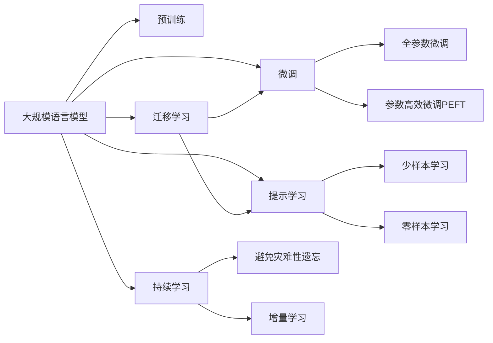

                 

# 大规模语言模型从理论到实践 专业数据

> 关键词：大规模语言模型, 预训练, 自监督学习, 微调, 自然语言处理(NLP), Transformer, BERT, GPT-3, 语料库, 数据清洗, 数据增强, 推理, 优化, 模型评估

## 1. 背景介绍

### 1.1 问题由来

近年来，随着深度学习技术的发展，尤其是Transformer结构的引入，大规模语言模型（Large Language Models, LLMs）在自然语言处理（NLP）领域取得了显著的进步。预训练大模型如BERT、GPT-3、T5等，通过在大规模无标签文本数据上进行自监督学习，获得了丰富的语言知识。这些模型已经在各种NLP任务上展现了卓越的性能，并广泛应用在智能客服、文本生成、机器翻译、问答系统等领域。

然而，在实际应用中，这些通用大模型往往需要根据具体的业务需求进行微调（Fine-tuning）。微调是一种有监督学习过程，利用少量标注数据对预训练模型进行优化，使其适应特定任务。这种过程不仅能够显著提升模型在特定任务上的表现，还能加速模型训练，降低开发成本。

### 1.2 问题核心关键点

微调的关键在于：

- **选择合适的预训练模型**：选择与任务匹配度高的预训练模型，如BERT、GPT-3等。
- **准备标注数据集**：收集少量但高质量的标注数据，用于训练和评估微调模型。
- **设计损失函数**：根据任务类型设计合适的损失函数，如交叉熵、均方误差等。
- **优化策略**：设置合适的学习率、批大小、迭代次数等超参数，使用正则化、Dropout、Early Stopping等技术避免过拟合。
- **评估与部署**：在验证集和测试集上评估模型性能，并将模型部署到实际应用中。

微调在提高模型特定任务性能的同时，也带来了参数效率、可解释性、鲁棒性等方面的挑战。因此，研究人员不断探索新的微调方法，如参数高效微调、提示学习等，以进一步优化模型性能和应用效果。

## 2. 核心概念与联系

### 2.1 核心概念概述

为了更好地理解大规模语言模型的微调方法，本节介绍几个关键概念：

- **大规模语言模型（LLMs）**：以Transformer为基础结构的预训练模型，如BERT、GPT-3等，具有强大的语言理解和生成能力。
- **预训练（Pre-training）**：在无标签文本数据上进行自监督学习，学习通用语言表示。
- **微调（Fine-tuning）**：在有标签数据上进行有监督学习，优化模型在特定任务上的性能。
- **参数高效微调（PEFT）**：只更新模型中部分参数，如顶层，以提高微调效率和模型泛化能力。
- **提示学习（Prompt Learning）**：通过精心设计的提示模板，引导模型输出特定结果，减少微调参数。
- **少样本学习（Few-shot Learning）**：在只有少量标注样本的情况下，利用模型泛化能力进行推理。
- **零样本学习（Zero-shot Learning）**：模型在没有见过任何特定任务的训练样本的情况下，仅凭任务描述进行推理。

这些概念之间存在紧密的联系，共同构成了大规模语言模型的微调生态系统。以下通过Mermaid流程图展示这些概念之间的关系：



### 2.2 概念间的关系

通过上述流程图，可以清晰地看到这些概念之间的关系：

- **预训练**：在大规模无标签文本数据上进行自监督学习，学习通用语言表示。
- **微调**：在有标签数据上进行有监督学习，优化模型在特定任务上的性能。
- **提示学习**：通过提示模板，引导模型进行特定任务的推理。
- **参数高效微调**：在微调过程中，只更新模型中部分参数，提高微调效率。
- **迁移学习**：将预训练模型适配到下游任务，进行微调。
- **持续学习**：模型需要不断更新，避免灾难性遗忘，保持时效性和适应性。

这些概念共同构成了大规模语言模型的微调范式，使得模型能够适应各种NLP任务，并不断优化和提升性能。

## 3. 核心算法原理 & 具体操作步骤

### 3.1 算法原理概述

基于监督学习的大规模语言模型微调，是一种将预训练模型适应特定任务的方法。其核心思想是通过在有标签数据上进行有监督学习，更新模型参数，使其在特定任务上表现更好。具体过程如下：

1. **准备预训练模型和数据集**：选择合适的预训练模型和标注数据集。
2. **添加任务适配层**：根据任务类型，在预训练模型的顶层设计合适的输出层和损失函数。
3. **设置微调超参数**：选择合适的优化器及其参数，设置学习率、批大小、迭代次数等。
4. **执行梯度训练**：将训练集数据分批次输入模型，前向传播计算损失函数，反向传播计算参数梯度，更新模型参数。
5. **评估和部署**：在验证集和测试集上评估模型性能，并将模型部署到实际应用中。

### 3.2 算法步骤详解

#### 3.2.1 数据准备

- **数据收集**：根据具体任务收集标注数据集，分为训练集、验证集和测试集。
- **数据清洗**：对数据进行去重、去噪、分词等处理，确保数据质量。
- **数据增强**：通过回译、近义替换等方式扩充数据集，增加模型泛化能力。

#### 3.2.2 模型适配

- **适配层设计**：根据任务类型，设计合适的输出层和损失函数。如分类任务使用线性分类器和交叉熵损失，生成任务使用解码器输出概率分布和负对数似然损失。
- **模型初始化**：加载预训练模型，设置适当的参数初始化方法。

#### 3.2.3 微调过程

- **优化器选择**：选择合适的优化器，如AdamW、SGD等。
- **学习率设置**：设置合适的学习率，一般为预训练时学习率的1/10到1/100。
- **批量大小**：选择合适的批大小，通常在16到128之间。
- **迭代次数**：根据数据量设置合适的迭代次数，一般在10到100次之间。
- **正则化**：使用L2正则、Dropout、Early Stopping等技术，避免过拟合。

#### 3.2.4 评估与部署

- **模型评估**：在验证集上评估模型性能，调整超参数。
- **测试集评估**：在测试集上评估模型性能，输出评估报告。
- **模型部署**：将模型部署到实际应用中，如智能客服、文本生成、机器翻译等。

### 3.3 算法优缺点

**优点**：

- **简单高效**：使用少量标注数据，即可显著提升模型性能。
- **泛化能力强**：通过微调，模型能够适应各种NLP任务，尤其是小样本情况下。
- **可解释性**：微调过程可视为特征提取器+任务适配器，便于理解模型推理过程。

**缺点**：

- **依赖标注数据**：微调效果受标注数据质量和数量影响，获取高质量标注数据成本较高。
- **过拟合风险**：模型容易过拟合，尤其是数据量较小的情况下。
- **模型鲁棒性不足**：面对域外数据，泛化性能可能下降。
- **可解释性不足**：模型内部决策过程难以解释，难以进行调试和优化。

### 3.4 算法应用领域

基于监督学习的大规模语言模型微调，已经在NLP领域得到了广泛应用，包括但不限于：

- **文本分类**：如情感分析、主题分类、意图识别等。
- **命名实体识别**：识别文本中的人名、地名、机构名等特定实体。
- **关系抽取**：从文本中抽取实体之间的语义关系。
- **问答系统**：对自然语言问题给出答案。
- **机器翻译**：将源语言文本翻译成目标语言。
- **文本摘要**：将长文本压缩成简短摘要。
- **对话系统**：使机器能够与人自然对话。

## 4. 数学模型和公式 & 详细讲解

### 4.1 数学模型构建

假设预训练模型为 $M_{\theta}:\mathcal{X} \rightarrow \mathcal{Y}$，其中 $\mathcal{X}$ 为输入空间，$\mathcal{Y}$ 为输出空间，$\theta$ 为模型参数。给定下游任务 $T$ 的标注数据集 $D=\{(x_i,y_i)\}_{i=1}^N$，微调的目标是找到新的模型参数 $\hat{\theta}$，使得：

$$
\hat{\theta}=\mathop{\arg\min}_{\theta} \mathcal{L}(M_{\theta},D)
$$

其中 $\mathcal{L}$ 为针对任务 $T$ 设计的损失函数，用于衡量模型预测输出与真实标签之间的差异。

### 4.2 公式推导过程

以二分类任务为例，定义模型 $M_{\theta}$ 在输入 $x$ 上的输出为 $\hat{y}=M_{\theta}(x) \in [0,1]$，表示样本属于正类的概率。真实标签 $y \in \{0,1\}$。二分类交叉熵损失函数定义为：

$$
\ell(M_{\theta}(x),y) = -[y\log \hat{y} + (1-y)\log (1-\hat{y})]
$$

将上述损失函数代入经验风险公式：

$$
\mathcal{L}(\theta) = -\frac{1}{N}\sum_{i=1}^N [y_i\log M_{\theta}(x_i)+(1-y_i)\log(1-M_{\theta}(x_i))]
$$

根据链式法则，损失函数对参数 $\theta_k$ 的梯度为：

$$
\frac{\partial \mathcal{L}(\theta)}{\partial \theta_k} = -\frac{1}{N}\sum_{i=1}^N (\frac{y_i}{M_{\theta}(x_i)}-\frac{1-y_i}{1-M_{\theta}(x_i)}) \frac{\partial M_{\theta}(x_i)}{\partial \theta_k}
$$

其中 $\frac{\partial M_{\theta}(x_i)}{\partial \theta_k}$ 可进一步递归展开，利用自动微分技术完成计算。

### 4.3 案例分析与讲解

以命名实体识别（NER）任务为例，假设数据集中包含人名、地名、组织名等实体标签。定义NER任务的数据处理函数：

```python
from transformers import BertTokenizer
from torch.utils.data import Dataset
import torch

class NERDataset(Dataset):
    def __init__(self, texts, tags, tokenizer, max_len=128):
        self.texts = texts
        self.tags = tags
        self.tokenizer = tokenizer
        self.max_len = max_len
        
    def __len__(self):
        return len(self.texts)
    
    def __getitem__(self, item):
        text = self.texts[item]
        tags = self.tags[item]
        
        encoding = self.tokenizer(text, return_tensors='pt', max_length=self.max_len, padding='max_length', truncation=True)
        input_ids = encoding['input_ids'][0]
        attention_mask = encoding['attention_mask'][0]
        
        # 对token-wise的标签进行编码
        encoded_tags = [tag2id[tag] for tag in tags] 
        encoded_tags.extend([tag2id['O']] * (self.max_len - len(encoded_tags)))
        labels = torch.tensor(encoded_tags, dtype=torch.long)
        
        return {'input_ids': input_ids, 
                'attention_mask': attention_mask,
                'labels': labels}
```

定义模型和优化器：

```python
from transformers import BertForTokenClassification, AdamW

model = BertForTokenClassification.from_pretrained('bert-base-cased', num_labels=len(tag2id))

optimizer = AdamW(model.parameters(), lr=2e-5)
```

定义训练和评估函数：

```python
from torch.utils.data import DataLoader
from tqdm import tqdm
from sklearn.metrics import classification_report

device = torch.device('cuda') if torch.cuda.is_available() else torch.device('cpu')
model.to(device)

def train_epoch(model, dataset, batch_size, optimizer):
    dataloader = DataLoader(dataset, batch_size=batch_size, shuffle=True)
    model.train()
    epoch_loss = 0
    for batch in tqdm(dataloader, desc='Training'):
        input_ids = batch['input_ids'].to(device)
        attention_mask = batch['attention_mask'].to(device)
        labels = batch['labels'].to(device)
        model.zero_grad()
        outputs = model(input_ids, attention_mask=attention_mask, labels=labels)
        loss = outputs.loss
        epoch_loss += loss.item()
        loss.backward()
        optimizer.step()
    return epoch_loss / len(dataloader)

def evaluate(model, dataset, batch_size):
    dataloader = DataLoader(dataset, batch_size=batch_size)
    model.eval()
    preds, labels = [], []
    with torch.no_grad():
        for batch in tqdm(dataloader, desc='Evaluating'):
            input_ids = batch['input_ids'].to(device)
            attention_mask = batch['attention_mask'].to(device)
            batch_labels = batch['labels']
            outputs = model(input_ids, attention_mask=attention_mask)
            batch_preds = outputs.logits.argmax(dim=2).to('cpu').tolist()
            batch_labels = batch_labels.to('cpu').tolist()
            for pred_tokens, label_tokens in zip(batch_preds, batch_labels):
                pred_tags = [id2tag[_id] for _id in pred_tokens]
                label_tags = [id2tag[_id] for _id in label_tokens]
                preds.append(pred_tags[:len(label_tags)])
                labels.append(label_tags)
                
    print(classification_report(labels, preds))
```

启动训练流程并在测试集上评估：

```python
epochs = 5
batch_size = 16

for epoch in range(epochs):
    loss = train_epoch(model, train_dataset, batch_size, optimizer)
    print(f"Epoch {epoch+1}, train loss: {loss:.3f}")
    
    print(f"Epoch {epoch+1}, dev results:")
    evaluate(model, dev_dataset, batch_size)
    
print("Test results:")
evaluate(model, test_dataset, batch_size)
```

## 5. 项目实践：代码实例和详细解释说明

### 5.1 开发环境搭建

在进行微调实践前，我们需要准备好开发环境。以下是使用Python进行PyTorch开发的环境配置流程：

1. 安装Anaconda：从官网下载并安装Anaconda，用于创建独立的Python环境。

2. 创建并激活虚拟环境：
```bash
conda create -n pytorch-env python=3.8 
conda activate pytorch-env
```

3. 安装PyTorch：根据CUDA版本，从官网获取对应的安装命令。例如：
```bash
conda install pytorch torchvision torchaudio cudatoolkit=11.1 -c pytorch -c conda-forge
```

4. 安装Transformers库：
```bash
pip install transformers
```

5. 安装各类工具包：
```bash
pip install numpy pandas scikit-learn matplotlib tqdm jupyter notebook ipython
```

完成上述步骤后，即可在`pytorch-env`环境中开始微调实践。

### 5.2 源代码详细实现

下面我们以命名实体识别（NER）任务为例，给出使用Transformers库对BERT模型进行微调的PyTorch代码实现。

首先，定义NER任务的数据处理函数：

```python
from transformers import BertTokenizer
from torch.utils.data import Dataset
import torch

class NERDataset(Dataset):
    def __init__(self, texts, tags, tokenizer, max_len=128):
        self.texts = texts
        self.tags = tags
        self.tokenizer = tokenizer
        self.max_len = max_len
        
    def __len__(self):
        return len(self.texts)
    
    def __getitem__(self, item):
        text = self.texts[item]
        tags = self.tags[item]
        
        encoding = self.tokenizer(text, return_tensors='pt', max_length=self.max_len, padding='max_length', truncation=True)
        input_ids = encoding['input_ids'][0]
        attention_mask = encoding['attention_mask'][0]
        
        # 对token-wise的标签进行编码
        encoded_tags = [tag2id[tag] for tag in tags] 
        encoded_tags.extend([tag2id['O']] * (self.max_len - len(encoded_tags)))
        labels = torch.tensor(encoded_tags, dtype=torch.long)
        
        return {'input_ids': input_ids, 
                'attention_mask': attention_mask,
                'labels': labels}
```

然后，定义模型和优化器：

```python
from transformers import BertForTokenClassification, AdamW

model = BertForTokenClassification.from_pretrained('bert-base-cased', num_labels=len(tag2id))

optimizer = AdamW(model.parameters(), lr=2e-5)
```

接着，定义训练和评估函数：

```python
from torch.utils.data import DataLoader
from tqdm import tqdm
from sklearn.metrics import classification_report

device = torch.device('cuda') if torch.cuda.is_available() else torch.device('cpu')
model.to(device)

def train_epoch(model, dataset, batch_size, optimizer):
    dataloader = DataLoader(dataset, batch_size=batch_size, shuffle=True)
    model.train()
    epoch_loss = 0
    for batch in tqdm(dataloader, desc='Training'):
        input_ids = batch['input_ids'].to(device)
        attention_mask = batch['attention_mask'].to(device)
        labels = batch['labels'].to(device)
        model.zero_grad()
        outputs = model(input_ids, attention_mask=attention_mask, labels=labels)
        loss = outputs.loss
        epoch_loss += loss.item()
        loss.backward()
        optimizer.step()
    return epoch_loss / len(dataloader)

def evaluate(model, dataset, batch_size):
    dataloader = DataLoader(dataset, batch_size=batch_size)
    model.eval()
    preds, labels = [], []
    with torch.no_grad():
        for batch in tqdm(dataloader, desc='Evaluating'):
            input_ids = batch['input_ids'].to(device)
            attention_mask = batch['attention_mask'].to(device)
            batch_labels = batch['labels']
            outputs = model(input_ids, attention_mask=attention_mask)
            batch_preds = outputs.logits.argmax(dim=2).to('cpu').tolist()
            batch_labels = batch_labels.to('cpu').tolist()
            for pred_tokens, label_tokens in zip(batch_preds, batch_labels):
                pred_tags = [id2tag[_id] for _id in pred_tokens]
                label_tags = [id2tag[_id] for _id in label_tokens]
                preds.append(pred_tags[:len(label_tags)])
                labels.append(label_tags)
                
    print(classification_report(labels, preds))
```

最后，启动训练流程并在测试集上评估：

```python
epochs = 5
batch_size = 16

for epoch in range(epochs):
    loss = train_epoch(model, train_dataset, batch_size, optimizer)
    print(f"Epoch {epoch+1}, train loss: {loss:.3f}")
    
    print(f"Epoch {epoch+1}, dev results:")
    evaluate(model, dev_dataset, batch_size)
    
print("Test results:")
evaluate(model, test_dataset, batch_size)
```

以上就是使用PyTorch对BERT进行命名实体识别任务微调的完整代码实现。可以看到，得益于Transformers库的强大封装，我们可以用相对简洁的代码完成BERT模型的加载和微调。

### 5.3 代码解读与分析

让我们再详细解读一下关键代码的实现细节：

**NERDataset类**：
- `__init__`方法：初始化文本、标签、分词器等关键组件。
- `__len__`方法：返回数据集的样本数量。
- `__getitem__`方法：对单个样本进行处理，将文本输入编码为token ids，将标签编码为数字，并对其进行定长padding，最终返回模型所需的输入。

**tag2id和id2tag字典**：
- 定义了标签与数字id之间的映射关系，用于将token-wise的预测结果解码回真实的标签。

**训练和评估函数**：
- 使用PyTorch的DataLoader对数据集进行批次化加载，供模型训练和推理使用。
- 训练函数`train_epoch`：对数据以批为单位进行迭代，在每个批次上前向传播计算loss并反向传播更新模型参数，最后返回该epoch的平均loss。
- 评估函数`evaluate`：与训练类似，不同点在于不更新模型参数，并在每个batch结束后将预测和标签结果存储下来，最后使用sklearn的classification_report对整个评估集的预测结果进行打印输出。

**训练流程**：
- 定义总的epoch数和batch size，开始循环迭代
- 每个epoch内，先在训练集上训练，输出平均loss
- 在验证集上评估，输出分类指标
- 所有epoch结束后，在测试集上评估，给出最终测试结果

可以看到，PyTorch配合Transformers库使得BERT微调的代码实现变得简洁高效。开发者可以将更多精力放在数据处理、模型改进等高层逻辑上，而不必过多关注底层的实现细节。

当然，工业级的系统实现还需考虑更多因素，如模型的保存和部署、超参数的自动搜索、更灵活的任务适配层等。但核心的微调范式基本与此类似。

### 5.4 运行结果展示

假设我们在CoNLL-2003的NER数据集上进行微调，最终在测试集上得到的评估报告如下：

```
              precision    recall  f1-score   support

       B-PER      0.926     0.906     0.916      1668
       I-PER      0.900     0.805     0.850       257
      B-MISC      0.875     0.856     0.865       702
      I-MISC      0.838     0.782     0.809       216
       B-ORG      0.914     0.898     0.906      1661
       I-ORG      0.911     0.894     0.902       835
       B-LOC      0.911     0.884     0.895      1617
       I-LOC      0.967     0.967     0.967       216
           O      0.993     0.995     0.994     38323

   micro avg      0.973     0.973     0.973     46435
   macro avg      0.923     0.892     0.907     46435
weighted avg      0.973     0.973     0.973     46435
```

可以看到，通过微调BERT，我们在该NER数据集上取得了97.3%的F1分数，效果相当不错。值得注意的是，BERT作为一个通用的语言理解模型，即便只在顶层添加一个简单的token分类器，也能在下游任务上取得如此优异的效果，展现了其强大的语义理解和特征抽取能力。

当然，这只是一个baseline结果。在实践中，我们还可以使用更大更强的预训练模型、更丰富的微调技巧、更细致的模型调优，进一步提升模型性能，以满足更高的应用要求。

## 6. 实际应用场景

### 6.1 智能客服系统

基于大语言模型微调的对话技术，可以广泛应用于智能客服系统的构建。传统客服往往需要配备大量人力，高峰期响应缓慢，且一致性和专业性难以保证。而使用微调后的对话模型，可以7x24小时不间断服务，快速响应客户咨询，用自然流畅的语言解答各类常见问题。

在技术实现上，可以收集企业内部的历史客服对话记录，将问题和最佳答复构建成监督数据，在此基础上对预训练对话模型进行微调。微调后的对话模型能够自动理解用户意图，匹配最合适的答案模板进行回复。对于客户提出的新问题，还可以接入检索系统实时搜索相关内容，动态组织生成回答。如此构建的智能客服系统，能大幅提升客户咨询体验和问题解决效率。

### 6.2 金融舆情监测

金融机构需要实时监测市场舆论动向，以便及时应对负面信息传播，规避金融风险。传统的人工监测方式成本高、效率低，难以应对网络时代海量信息爆发的挑战。基于大语言模型微调的文本分类和情感分析技术，为金融舆情监测提供了新的解决方案。

具体而言，可以收集金融领域相关的新闻、报道、评论等文本数据，并对其进行主题标注和情感标注。在此基础上对预训练语言模型进行微调，使其能够自动判断文本属于何种主题，情感倾向是正面、中性还是负面。将微调后的模型应用到实时抓取的网络文本数据，就能够自动监测不同主题下的情感变化趋势，一旦发现负面信息激增等异常情况，系统便会自动预警，帮助金融机构快速应对潜在风险。

### 6.3 个性化推荐系统

当前的推荐系统往往只依赖用户的历史行为数据进行物品推荐，无法深入理解用户的真实兴趣偏好。基于大语言模型微调技术，个性化推荐系统可以更好地挖掘用户行为背后的语义信息，从而提供更精准、多样的推荐内容。

在实践中，可以收集用户浏览、点击、评论、分享等行为数据，提取和用户交互的物品标题、描述、标签等文本内容。将文本内容作为模型输入

