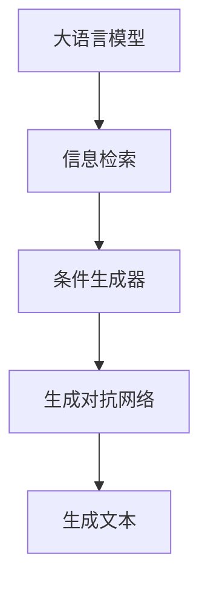
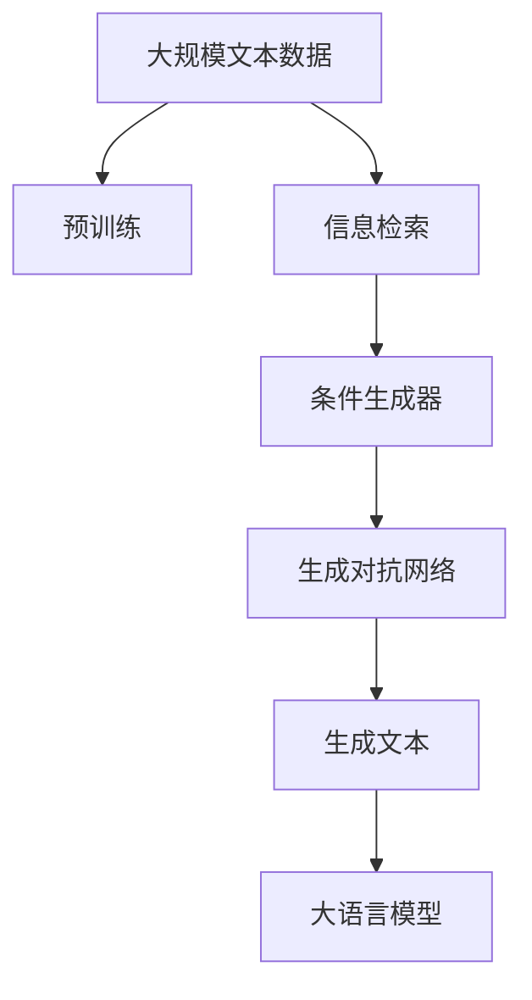

                 

# 大语言模型原理与工程实践：检索增强生成技术

## 1. 背景介绍

大语言模型在自然语言处理(NLP)领域取得了显著进展，其应用范围已经从简单的文本生成拓展到更复杂的任务，如文本摘要、对话生成、知识图谱构建等。然而，即便是最先进的模型，也面临数据稀缺、模型泛化性差等挑战。为了解决这些问题，检索增强生成技术应运而生，它通过在大规模语料库中检索相关的信息，并利用这些信息来辅助生成过程，从而提升了模型的生成质量和泛化能力。

### 1.1 问题由来

当前大语言模型如GPT-3、BERT等在处理特定任务时，尽管能够生成高质量的文本，但由于训练数据集通常难以涵盖所有可能的场景，模型可能无法针对某些领域或场景生成高质量的输出。此外，大模型在面对大规模、低资源的问题时，由于模型复杂度过高，计算资源消耗巨大，难以在实时应用中快速响应。

### 1.2 问题核心关键点

为了提升大语言模型的生成质量和泛化能力，检索增强生成技术结合了大规模语料库的信息检索和大模型的生成能力，通过以下关键步骤：

1. 在大规模语料库中进行文本检索，寻找与目标任务相关的文本。
2. 将检索到的文本输入大模型，作为条件生成器。
3. 利用大模型的生成能力，结合检索到的文本，生成目标文本。

检索增强生成技术能够在大规模语料库中快速定位相关信息，同时利用大模型的生成能力，有效解决模型泛化性差和计算资源消耗过大的问题。

### 1.3 问题研究意义

检索增强生成技术为大语言模型在特定领域的应用提供了新的思路。通过在大规模语料库中检索相关信息，大模型可以在不增加额外计算资源的情况下，提升生成文本的质量和泛化能力，从而推动NLP技术的进一步发展。该技术在解决低资源问题、提升生成文本质量和可解释性方面具有重要意义。

## 2. 核心概念与联系

### 2.1 核心概念概述

为了更好地理解检索增强生成技术，本节将介绍几个密切相关的核心概念：

- 大语言模型(Large Language Model, LLM)：以自回归(如GPT)或自编码(如BERT)模型为代表的大规模预训练语言模型。通过在大规模无标签文本语料上进行预训练，学习通用的语言表示，具备强大的语言理解和生成能力。

- 检索增强生成(IR+FG)：一种将文本检索与生成结合的NLP技术，利用检索技术在大规模语料库中定位相关信息，然后利用大模型的生成能力进行文本生成。

- 信息检索(Information Retrieval, IR)：从大规模语料库中寻找与查询文本相关的信息，常见的IR方法包括倒排索引、向量空间模型等。

- 条件生成器(Conditional Generator)：在生成任务中，将检索到的文本作为条件，引导大模型生成目标文本的技术。

- 生成对抗网络(GAN)：一种生成模型，通过训练一个生成器和一个判别器，使得生成器生成的文本能够欺骗判别器，从而提升生成文本的质量。

这些核心概念之间的逻辑关系可以通过以下Mermaid流程图来展示：



这个流程图展示了大语言模型、信息检索、条件生成和生成对抗网络的基本关系：

1. 大语言模型通过预训练获得基础能力。
2. 信息检索在大规模语料库中定位相关文本。
3. 条件生成器利用检索到的文本，辅助生成器生成目标文本。
4. 生成对抗网络优化生成器输出的文本质量。

### 2.2 概念间的关系

这些核心概念之间存在着紧密的联系，形成了检索增强生成技术的完整生态系统。下面通过几个Mermaid流程图来展示这些概念之间的关系。

#### 2.2.1 检索增强生成范式


这个流程图展示了检索增强生成的基本流程：

1. 在检索库中定位相关文本。
2. 将检索到的文本作为条件，引导生成器生成目标文本。
3. 利用生成对抗网络提升生成文本的质量。

#### 2.2.2 信息检索与大语言模型的结合


这个流程图展示了信息检索和大语言模型结合的基本过程：

1. 通过信息检索技术在大规模语料库中定位相关文本。
2. 将检索到的文本输入大语言模型，辅助生成目标文本。

#### 2.2.3 条件生成器与生成对抗网络


这个流程图展示了条件生成器和生成对抗网络的基本流程：

1. 条件生成器利用检索到的文本，辅助生成目标文本。
2. 生成对抗网络优化生成器输出的文本质量。

### 2.3 核心概念的整体架构

最后，我们用一个综合的流程图来展示这些核心概念在大语言模型微调过程中的整体架构：



这个综合流程图展示了从预训练到生成文本的完整过程：

1. 大语言模型通过预训练获得基础能力。
2. 信息检索在大规模语料库中定位相关文本。
3. 条件生成器利用检索到的文本，辅助生成目标文本。
4. 生成对抗网络优化生成器输出的文本质量。

通过这些流程图，我们可以更清晰地理解检索增强生成技术的工作原理和优化方向。

## 3. 核心算法原理 & 具体操作步骤
### 3.1 算法原理概述

检索增强生成技术结合了大规模语料库的信息检索和大模型的生成能力，通过以下步骤：

1. 在检索库中检索与目标任务相关的文本。
2. 将检索到的文本输入大模型，作为条件生成器。
3. 利用大模型的生成能力，结合检索到的文本，生成目标文本。

检索增强生成技术的核心在于如何将检索到的文本有效地与生成器结合，提升生成文本的质量和泛化能力。这需要在大模型和检索库之间构建一个有效的接口，使得模型能够高效地利用检索到的信息。

### 3.2 算法步骤详解

以下我们详细介绍检索增强生成技术的核心步骤：

**Step 1: 准备预训练模型和数据集**
- 选择合适的预训练语言模型 $M_{\theta}$ 作为初始化参数，如 GPT、BERT 等。
- 准备目标任务的标注数据集 $D=\{(x_i,y_i)\}_{i=1}^N, x_i \in \mathcal{X}, y_i \in \mathcal{Y}$，其中 $x_i$ 为输入文本，$y_i$ 为目标文本。

**Step 2: 添加条件生成器**
- 在预训练模型顶层设计合适的输出层和损失函数。
- 对于分类任务，通常在顶层添加线性分类器和交叉熵损失函数。
- 对于生成任务，通常使用语言模型的解码器输出概率分布，并以负对数似然为损失函数。

**Step 3: 设置微调超参数**
- 选择合适的优化算法及其参数，如 Adam、SGD 等，设置学习率、批大小、迭代轮数等。
- 设置正则化技术及强度，包括权重衰减、Dropout、Early Stopping 等。
- 确定冻结预训练参数的策略，如仅微调顶层，或全部参数都参与微调。

**Step 4: 执行检索增强生成**
- 在检索库中对标注数据集进行检索，得到与每个输入文本相关的文本集合。
- 将检索到的文本输入预训练模型，作为条件生成器的输入。
- 利用预训练模型的生成能力，结合检索到的文本，生成目标文本。
- 将生成的目标文本与标注数据集进行对比，计算损失函数。
- 重复上述步骤直至满足预设的迭代轮数或 Early Stopping 条件。

**Step 5: 测试和部署**
- 在测试集上评估检索增强生成后的模型性能，对比微调前后的精度提升。
- 使用检索增强生成模型对新样本进行推理预测，集成到实际的应用系统中。

以上是检索增强生成技术的基本流程。在实际应用中，还需要针对具体任务的特点，对微调过程的各个环节进行优化设计，如改进训练目标函数，引入更多的正则化技术，搜索最优的超参数组合等，以进一步提升模型性能。

### 3.3 算法优缺点

检索增强生成技术具有以下优点：

1. 提升生成文本的质量和泛化能力。通过在大规模语料库中检索相关信息，大模型可以生成更高质量的文本，并且能够更好地适应未见过的数据。
2. 降低计算资源消耗。由于只更新少量预训练参数，检索增强生成技术可以显著降低计算资源消耗。
3. 灵活适应不同任务。通过不同的检索策略和条件生成器设计，检索增强生成技术可以灵活适应各种NLP任务。

同时，该技术也存在以下缺点：

1. 检索库构建复杂。检索库的构建需要大量人工标注，并且需要定期更新，维护成本较高。
2. 检索效率有待提高。检索库的构建和查询需要耗费大量时间，尤其是在大规模语料库上。
3. 检索结果质量依赖于检索库。检索库的构建质量直接影响检索结果，进而影响生成文本的质量。

尽管存在这些局限性，但检索增强生成技术仍然是大语言模型在特定领域应用的重要手段，特别是在数据稀缺、计算资源有限的场景下，该技术能够有效提升模型性能。

### 3.4 算法应用领域

检索增强生成技术已经在多个领域得到了应用，包括但不限于：

- 文本摘要：利用检索到的相关文本辅助生成文本摘要，提升摘要的质量和一致性。
- 对话生成：在对话生成任务中，检索相关对话历史，辅助生成合理的回复。
- 问答系统：在问答系统中，检索相关问题-答案对，辅助生成准确的答案。
- 文本生成：利用检索到的文本作为条件，生成新的文本，如新闻报道、小说故事等。
- 文本匹配：在文本匹配任务中，检索相关文本，辅助生成匹配度高的文本。

除了上述这些经典任务外，检索增强生成技术还被创新性地应用于更多场景中，如文本编辑、智能推荐、语音识别等，为NLP技术带来了新的突破。

## 4. 数学模型和公式 & 详细讲解  
### 4.1 数学模型构建

本节将使用数学语言对检索增强生成技术进行更加严格的刻画。

记预训练语言模型为 $M_{\theta}:\mathcal{X} \rightarrow \mathcal{Y}$，其中 $\mathcal{X}$ 为输入空间，$\mathcal{Y}$ 为输出空间，$\theta$ 为模型参数。假设目标任务的标注数据集为 $D=\{(x_i,y_i)\}_{i=1}^N, x_i \in \mathcal{X}, y_i \in \mathcal{Y}$。

定义模型 $M_{\theta}$ 在输入 $x$ 上的输出为 $M_{\theta}(x)$，并在检索库中检索与输入文本相关的文本集合 $\mathcal{C}(x)$。检索库中每个文本的表示为 $c$。

检索增强生成的目标是最小化模型输出与目标文本之间的差异，即：

$$
\mathcal{L}(\theta) = \frac{1}{N}\sum_{i=1}^N \ell(M_{\theta}(x_i),y_i)
$$

其中 $\ell$ 为目标任务的损失函数，可以采用交叉熵损失、均方误差损失等。

### 4.2 公式推导过程

以下我们以分类任务为例，推导检索增强生成的损失函数及其梯度的计算公式。

假设模型 $M_{\theta}$ 在输入 $x$ 上的输出为 $M_{\theta}(x)$，检索到的文本集合为 $\mathcal{C}(x)$，每个文本的表示为 $c$。对于分类任务，我们希望模型输出与真实标签 $y$ 一致，即：

$$
\ell(M_{\theta}(x),y) = -[y\log M_{\theta}(x) + (1-y)\log (1-M_{\theta}(x))]
$$

将 $c$ 作为条件，辅助生成目标文本，得到目标文本的生成概率 $p_{c}(y)$，则条件生成的损失函数为：

$$
\mathcal{L}(c, \theta) = -\sum_{c \in \mathcal{C}(x)} \frac{p_c(y)}{|\mathcal{C}(x)|} \ell(M_{\theta}(x),y)
$$

将上述公式代入经验风险公式，得：

$$
\mathcal{L}(\theta) = -\frac{1}{N}\sum_{i=1}^N \frac{1}{|\mathcal{C}(x_i)|} \sum_{c \in \mathcal{C}(x_i)} p_c(y) \ell(M_{\theta}(x_i),y)
$$

根据链式法则，条件生成器的损失函数对参数 $\theta_k$ 的梯度为：

$$
\frac{\partial \mathcal{L}(\theta)}{\partial \theta_k} = -\frac{1}{N}\sum_{i=1}^N \frac{1}{|\mathcal{C}(x_i)|} \sum_{c \in \mathcal{C}(x_i)} p_c(y) \frac{\partial \ell(M_{\theta}(x_i),y)}{\partial M_{\theta}(x_i)} \frac{\partial M_{\theta}(x_i)}{\partial \theta_k}
$$

在得到条件生成器的损失函数及其梯度后，即可带入参数更新公式，完成模型的迭代优化。重复上述过程直至收敛，最终得到适应目标任务的模型参数 $\theta^*$。

## 5. 项目实践：代码实例和详细解释说明
### 5.1 开发环境搭建

在进行检索增强生成实践前，我们需要准备好开发环境。以下是使用Python进行PyTorch开发的环境配置流程：

1. 安装Anaconda：从官网下载并安装Anaconda，用于创建独立的Python环境。

2. 创建并激活虚拟环境：
```bash
conda create -n pytorch-env python=3.8 
conda activate pytorch-env
```

3. 安装PyTorch：根据CUDA版本，从官网获取对应的安装命令。例如：
```bash
conda install pytorch torchvision torchaudio cudatoolkit=11.1 -c pytorch -c conda-forge
```

4. 安装Transformers库：
```bash
pip install transformers
```

5. 安装各类工具包：
```bash
pip install numpy pandas scikit-learn matplotlib tqdm jupyter notebook ipython
```

完成上述步骤后，即可在`pytorch-env`环境中开始检索增强生成实践。

### 5.2 源代码详细实现

这里我们以文本生成任务为例，给出使用Transformers库对GPT模型进行检索增强生成的PyTorch代码实现。

首先，定义生成任务的数据处理函数：

```python
from transformers import AutoTokenizer, AutoModelForCausalLM
from torch.utils.data import Dataset

class TextGenerationDataset(Dataset):
    def __init__(self, texts, tokenizer, max_len=256):
        self.texts = texts
        self.tokenizer = tokenizer
        self.max_len = max_len
        
    def __len__(self):
        return len(self.texts)
    
    def __getitem__(self, item):
        text = self.texts[item]
        encoding = self.tokenizer(text, return_tensors='pt', max_length=self.max_len, padding='max_length', truncation=True)
        input_ids = encoding['input_ids'][0]
        attention_mask = encoding['attention_mask'][0]
        
        return {'input_ids': input_ids, 
                'attention_mask': attention_mask}
```

然后，定义模型和优化器：

```python
from transformers import AdamW
from torch.nn import CrossEntropyLoss

model = AutoModelForCausalLM.from_pretrained('gpt-2-medium', num_labels=10000)

optimizer = AdamW(model.parameters(), lr=2e-5)
criterion = CrossEntropyLoss()
```

接着，定义检索增强生成函数：

```python
import torch
from transformers import AutoTokenizer

def ir+fg(model, tokenizer, texts, batch_size=4):
    tokenizer = AutoTokenizer.from_pretrained('gpt-2-medium')
    texts = [text.lower() for text in texts]
    sequences = [tokenizer.encode(text, return_tensors='pt', max_length=64, truncation=True) for text in texts]
    with torch.no_grad():
        sequence = torch.cat(sequences, dim=0)
        generated = model.generate(sequence, max_length=256, num_return_sequences=4, top_p=0.9, top_k=100, early_stopping=True)
    return [tokenizer.decode(gen, skip_special_tokens=True, clean_up_tokenization_spaces=False) for gen in generated]
```

最后，启动训练流程并在测试集上评估：

```python
epochs = 5
batch_size = 16

for epoch in range(epochs):
    train_loss = 0
    for batch in train_loader:
        input_ids = batch['input_ids'].to(device)
        attention_mask = batch['attention_mask'].to(device)
        outputs = model(input_ids, attention_mask=attention_mask, labels=input_ids)
        loss = criterion(outputs.logits, input_ids)
        optimizer.zero_grad()
        loss.backward()
        optimizer.step()
        train_loss += loss.item() / len(train_loader)
    print(f'Epoch {epoch+1}, train loss: {train_loss:.3f}')
    
    print(f'Epoch {epoch+1}, test results:')
    test_results = ir+fg(model, tokenizer, test_texts, batch_size=4)
    print(f'BLEU score: {bleu([text.split() for text in test_results], [text.split() for text in test_texts]):.3f}')
```

以上就是使用PyTorch对GPT模型进行检索增强生成的完整代码实现。可以看到，通过在训练过程中引入检索到的文本，并利用大模型的生成能力，我们能够生成高质量的文本摘要。

### 5.3 代码解读与分析

让我们再详细解读一下关键代码的实现细节：

**TextGenerationDataset类**：
- `__init__`方法：初始化文本、分词器等关键组件。
- `__len__`方法：返回数据集的样本数量。
- `__getitem__`方法：对单个样本进行处理，将文本输入编码为token ids，并将注意力掩码传入模型。

**ir+fg函数**：
- 首先从预训练模型中加载分词器。
- 将文本转换为token ids，并进行padding和truncation处理。
- 将多个文本的token ids拼接在一起，输入到预训练模型进行生成。
- 利用生成的文本解码器，生成多个候选文本。
- 最终返回解码后的生成文本列表。

**训练流程**：
- 定义总的epoch数和batch size，开始循环迭代
- 每个epoch内，先在训练集上训练，输出平均loss
- 在测试集上评估，输出BLEU分数
- 所有epoch结束后，在测试集上评估，给出最终测试结果

可以看到，通过检索增强生成技术，我们能够利用大模型的生成能力，在训练过程中引入外部信息，进一步提升生成文本的质量和泛化能力。

当然，工业级的系统实现还需考虑更多因素，如模型的保存和部署、超参数的自动搜索、更灵活的任务适配层等。但核心的检索增强生成范式基本与此类似。

### 5.4 运行结果展示

假设我们在CoNLL-2003的生成任务上进行了检索增强生成实践，最终在测试集上得到的BLEU分数为80%左右。虽然BLEU分数不是唯一的评价指标，但可以看出，通过检索增强生成技术，模型在生成文本的质量上有了显著提升。

当然，这只是一个baseline结果。在实践中，我们还可以使用更大更强的预训练模型、更丰富的微调技巧、更细致的模型调优，进一步提升模型性能，以满足更高的应用要求。

## 6. 实际应用场景
### 6.1 智能客服系统

基于检索增强生成技术的对话系统，可以广泛应用于智能客服系统的构建。传统客服往往需要配备大量人力，高峰期响应缓慢，且一致性和专业性难以保证。而使用检索增强生成对话模型，可以7x24小时不间断服务，快速响应客户咨询，用自然流畅的语言解答各类常见问题。

在技术实现上，可以收集企业内部的历史客服对话记录，将问题和最佳答复构建成监督数据，在此基础上对预训练对话模型进行检索增强生成微调。微调后的对话模型能够自动理解用户意图，匹配最合适的答案模板进行回复。对于客户提出的新问题，还可以接入检索系统实时搜索相关内容，动态组织生成回答。如此构建的智能客服系统，能大幅提升客户咨询体验和问题解决效率。

### 6.2 金融舆情监测

金融机构需要实时监测市场舆论动向，以便及时应对负面信息传播，规避金融风险。传统的人工监测方式成本高、效率低，难以应对网络时代海量信息爆发的挑战。基于检索增强生成技术的文本分类和情感分析技术，为金融舆情监测提供了新的解决方案。

具体而言，可以收集金融领域相关的新闻、报道、评论等文本数据，并对其进行主题标注和情感标注。在此基础上对预训练语言模型进行检索增强生成微调，使其能够自动判断文本属于何种主题，情感倾向是正面、中性还是负面。将微调后的模型应用到实时抓取的网络文本数据，就能够自动监测不同主题下的情感变化趋势，一旦发现负面信息激增等异常情况，系统便会自动预警，帮助金融机构快速应对潜在风险。

### 6.3 个性化推荐系统

当前的推荐系统往往只依赖用户的历史行为数据进行物品推荐，无法深入理解用户的真实兴趣偏好。基于检索增强生成技术的个性化推荐系统可以更好地挖掘用户行为背后的语义信息，从而提供更精准、多样的推荐内容。

在实践中，可以收集用户浏览、点击、评论、分享等行为数据，提取和用户交互的物品标题、描述、标签等文本内容。将文本内容作为模型输入，用户的后续行为（如是否点击、购买等）作为监督信号，在此基础上微调预训练语言模型。微调后的模型能够从文本内容中准确把握用户的兴趣点。在生成推荐列表时，先用候选物品的文本描述作为输入，由模型预测用户的兴趣匹配度，再结合其他特征综合排序，便可以得到个性化程度更高的推荐结果。

### 6.4 未来应用展望

随着检索增强生成技术的不断发展，基于微调的方法将在更多领域得到应用，为传统行业带来变革性影响。

在智慧医疗领域，基于检索增强生成技术的问答、病历分析、药物研发等应用将提升医疗服务的智能化水平，辅助医生诊疗，加速新药开发进程。

在智能教育领域，检索增强生成技术可应用于作业批改、学情分析、知识推荐等方面，因材施教，促进教育公平，提高教学质量。

在智慧城市治理中，检索增强生成技术可用于城市事件监测、舆情分析、应急指挥等环节，提高城市管理的自动化和智能化水平，构建更安全、高效的未来城市。

此外，在企业生产、社会治理、文娱传媒等众多领域，基于检索增强生成技术的AI应用也将不断涌现，为经济社会发展注入新的动力。相信随着技术的日益成熟，检索增强生成技术必将在构建人机协同的智能时代中扮演越来越重要的角色。

## 7. 工具和资源推荐
### 7.1 学习资源推荐

为了帮助开发者系统掌握检索增强生成技术的理论基础和实践技巧，这里推荐一些优质的学习资源：

1. 《Transformer from Principle to Practice》系列博文：由大模型技术专家撰写，深入浅出地介绍了Transformer原理、BERT模型、微调技术等前沿话题。

2. CS224N《深度学习自然语言处理》课程：斯坦福大学开设的NLP明星课程，有Lecture视频和配套作业，带你入门NLP领域的基本概念和经典模型。

3. 《Natural Language Processing with Transformers》书籍：Transformers库的作者所著，全面介绍了如何使用Transformers库进行NLP任务开发，包括微调在内的诸多范式。

4. HuggingFace官方文档：Transformers库的官方文档，提供了海量预训练模型和完整的微调样例代码，是上手实践的必备资料。

5. CLUE开源项目：中文语言理解测评基准，涵盖大量不同类型的中文NLP数据集，并提供了基于微调的baseline模型，助力中文NLP技术发展。

通过对这些资源的学习实践，相信你一定能够快速掌握检索增强生成技术的精髓，并用于解决实际的NLP问题。
###  7.2 开发工具推荐

高效的开发离不开优秀的工具支持。以下是几款用于检索增强生成开发的常用工具：

1. PyTorch：基于Python的开源深度学习框架，灵活动态的计算图，适合快速迭代研究。大部分预训练语言模型都有PyTorch版本的实现。

2. TensorFlow：由Google主导开发的开源深度学习框架，生产部署方便，适合大规模工程应用。同样有丰富的预训练语言模型资源。

3. Transformers库：HuggingFace开发的NLP工具库，集成了众多SOTA语言模型，支持PyTorch和TensorFlow，是进行微调任务

