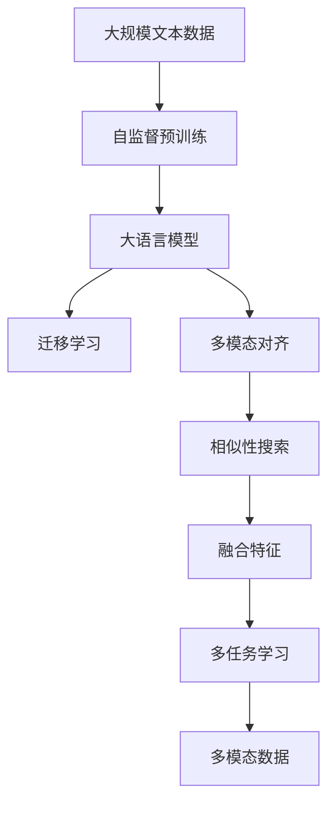

                 

# 大语言模型原理基础与前沿 基于相似性搜索的多模态对齐

> 关键词：大语言模型,多模态对齐,相似性搜索,Transformer,BERT,自监督学习,迁移学习

## 1. 背景介绍

### 1.1 问题由来
随着深度学习和大规模预训练模型的兴起，自然语言处理（NLP）领域取得了显著进展，如BERT、GPT等预训练模型在多项NLP任务上取得了优异成绩。但这些通用预训练模型在特定领域的应用仍存在一定局限性，难以达到最佳性能。因此，如何利用预训练模型的基础表示，进一步提升模型的领域适应性，是一个亟待解决的问题。

### 1.2 问题核心关键点
多模态对齐技术通过将文本、图像、音频等多模态数据进行联合学习，有效提升模型的领域适应性，使其能够更好地应用于特定领域。具体方法包括：

- **自监督预训练**：在大规模无标签数据上，通过自监督学习任务训练通用模型。
- **迁移学习**：将预训练模型应用于特定领域，通过微调优化模型在特定任务上的性能。
- **多模态对齐**：在已有预训练模型的基础上，引入多模态数据进行联合学习，提升模型泛化能力。
- **相似性搜索**：在多模态数据中，利用相似性度量方法，对齐不同模态的特征表示。
- **多任务学习**：在同一任务中，利用多个相关任务训练模型，提升模型在多个任务上的性能。

### 1.3 问题研究意义
多模态对齐技术可以显著提升大语言模型的领域适应性和泛化能力，使其在特定领域应用中取得更好的效果。具体意义如下：

1. **降低开发成本**：利用已有预训练模型的基础表示，可以避免从头训练新模型的复杂性和高昂成本。
2. **提升模型性能**：通过多模态对齐技术，模型可以更好地融合不同模态的特征信息，提升任务执行的准确性和效率。
3. **加速应用落地**：在特定领域的数据集上微调模型，可以更快速地实现应用落地，缩短开发周期。
4. **拓宽应用范围**：通过多模态对齐技术，模型可以应用于更多领域，如视觉问答、多模态检索等，为不同领域的智能化应用提供支持。
5. **促进技术创新**：多模态对齐技术推动了NLP与其他领域技术的融合，带来了新的研究方向和应用场景。

## 2. 核心概念与联系

### 2.1 核心概念概述

为更好地理解基于相似性搜索的多模态对齐方法，本节将介绍几个密切相关的核心概念：

- **大语言模型（Large Language Model, LLM）**：如BERT、GPT等预训练模型，通过在大规模无标签文本语料上进行预训练，学习到丰富的语言表示，具备强大的语言理解和生成能力。

- **自监督学习（Self-Supervised Learning）**：在无标签数据上进行的一种机器学习方法，通过构建自监督任务，使得模型学习到数据的潜在结构和规律。

- **迁移学习（Transfer Learning）**：将一个领域的知识迁移到另一个领域，利用已有知识提高新任务上的表现。

- **多模态对齐（Multimodal Alignment）**：在多个模态（如文本、图像、音频）之间找到相似表示，使得模型能够更好地联合不同模态的数据。

- **相似性搜索（Similarity Search）**：通过度量不同模态特征之间的相似性，找到与其最相似的表示，用于融合不同模态的信息。

- **多任务学习（Multi-Task Learning）**：在同一任务中，利用多个相关任务进行训练，提升模型在多个任务上的性能。

这些核心概念之间的逻辑关系可以通过以下Mermaid流程图来展示：


这个流程图展示了自监督预训练、大语言模型、迁移学习、多模态对齐、相似性搜索和多任务学习之间的关系：

1. 自监督预训练是基础，通过在大规模无标签数据上训练通用模型。
2. 迁移学习利用已有模型的基础表示，提升特定领域模型的性能。
3. 多模态对齐通过联合不同模态的特征，提升模型的泛化能力。
4. 相似性搜索通过度量不同模态的相似性，对齐特征表示。
5. 多任务学习通过同时训练多个相关任务，提升模型在多个任务上的性能。

### 2.2 概念间的关系

这些核心概念之间存在着紧密的联系，形成了多模态对齐技术的完整生态系统。下面我们通过几个Mermaid流程图来展示这些概念之间的关系。

#### 2.2.1 大语言模型的学习范式


这个流程图展示了大语言模型的学习过程，包括自监督预训练、迁移学习、多模态对齐、相似性搜索和多任务学习。

#### 2.2.2 多模态对齐与迁移学习的关系


这个流程图展示了迁移学习和多模态对齐技术之间的关系。迁移学习利用已有模型的基础表示，通过多模态对齐进一步提升模型在特定任务上的性能。

#### 2.2.3 相似性搜索在多模态对齐中的作用


这个流程图展示了相似性搜索在多模态对齐中的作用。相似性搜索通过度量不同模态特征的相似性，找到最相似的表示，用于融合不同模态的信息。

### 2.3 核心概念的整体架构

最后，我们用一个综合的流程图来展示这些核心概念在大语言模型多模态对齐过程中的整体架构：



这个综合流程图展示了从自监督预训练到大语言模型、迁移学习、多模态对齐、相似性搜索、特征融合、多任务学习，最终应用于多模态数据的全过程。通过这些流程图，我们可以更清晰地理解多模态对齐过程中各个核心概念的关系和作用。

## 3. 核心算法原理 & 具体操作步骤
### 3.1 算法原理概述

基于相似性搜索的多模态对齐技术，核心思想是通过度量不同模态特征的相似性，找到最相似的表示，从而在已有预训练模型的基础上，进一步提升模型在特定任务上的性能。具体方法包括：

1. **特征抽取**：在预训练模型的基础上，对不同模态的输入数据进行特征抽取，得到高维特征向量。
2. **相似性度量**：利用相似性度量方法（如欧式距离、余弦相似度等），计算不同模态特征之间的相似性。
3. **对齐特征**：在相似性度量结果的基础上，通过一定方法（如最小二乘法、对抗训练等）对齐不同模态的特征表示，使得模型能够更好地联合不同模态的数据。
4. **融合特征**：将对齐后的不同模态特征进行融合，得到新的特征表示。
5. **多任务学习**：在融合后的特征表示上，利用多个相关任务进行训练，提升模型在多个任务上的性能。

### 3.2 算法步骤详解

基于相似性搜索的多模态对齐过程一般包括以下几个关键步骤：

**Step 1: 准备预训练模型和数据集**
- 选择合适的预训练语言模型 $M_{\theta}$ 作为初始化参数，如 BERT、GPT等。
- 准备多模态数据集 $D=\{(x_i, y_i)\}_{i=1}^N$，其中 $x_i$ 表示不同模态的输入数据，$y_i$ 表示相应的标签或特征。

**Step 2: 特征抽取**
- 对不同模态的输入数据进行预处理，如文本的token化、图像的归一化、音频的特征提取等。
- 将处理后的数据输入预训练模型，获取高维特征向量。

**Step 3: 相似性度量**
- 利用相似性度量方法，计算不同模态特征之间的相似性。
- 常用的相似性度量方法包括欧式距离、余弦相似度、KL散度等。

**Step 4: 对齐特征**
- 在相似性度量结果的基础上，通过一定方法对齐不同模态的特征表示。
- 常用的对齐方法包括最小二乘法、对抗训练、层融合等。

**Step 5: 融合特征**
- 将对齐后的不同模态特征进行融合，得到新的特征表示。
- 常用的特征融合方法包括加权平均、逐元素相加、矩阵分解等。

**Step 6: 多任务学习**
- 在融合后的特征表示上，利用多个相关任务进行训练，提升模型在多个任务上的性能。
- 常用的多任务学习框架包括DAMSL、TEAM、MTL等。

**Step 7: 模型微调**
- 在融合后的特征表示上，利用下游任务的标注数据进行微调，提升模型在特定任务上的性能。
- 常用的微调方法包括AdamW、SGD等，设置合适的学习率、批大小、迭代轮数等。

### 3.3 算法优缺点

基于相似性搜索的多模态对齐方法具有以下优点：
1. **提升泛化能力**：通过联合不同模态的数据，提升模型的泛化能力和鲁棒性。
2. **减少标注成本**：利用已有预训练模型的基础表示，可以显著减少标注数据的需求。
3. **加速训练**：通过多任务学习和特征融合，可以在更少的标注数据上快速训练出高性能模型。
4. **适应性强**：通过相似性度量和特征对齐，模型能够适应不同领域的数据，具有较强的领域适应性。

同时，该方法也存在一定的局限性：
1. **计算复杂度较高**：多模态数据的联合学习需要较高的计算资源，训练时间较长。
2. **模型复杂度增加**：引入多模态数据和相似性搜索过程，增加了模型的复杂度和计算量。
3. **特征对齐难度大**：不同模态的特征表示差异较大，找到最优的特征对齐方法仍是一个挑战。
4. **数据分布不一致**：多模态数据之间可能存在分布不一致的问题，需要额外的对齐和融合方法。

尽管存在这些局限性，但就目前而言，基于相似性搜索的多模态对齐方法仍是大语言模型应用的重要手段。未来相关研究的重点在于如何进一步降低计算成本，提高特征对齐的准确性，以及提升模型的可解释性和可控性。

### 3.4 算法应用领域

基于相似性搜索的多模态对齐方法已经在诸多领域得到应用，例如：

- **视觉问答（VQA）**：将图像和文本信息联合学习，使得模型能够理解图像内容，并回答相关问题。
- **图像描述生成**：将图像和文本信息联合学习，生成对图像的描述性文本。
- **多模态检索**：利用图像、文本、音频等多种模态信息，进行相似性检索，提升信息检索的准确性和效率。
- **智能家居控制**：将语音、文本、图像等多模态信息联合学习，实现智能家居设备的语音识别和控制。
- **医疗影像分析**：将医学影像和文本信息联合学习，提升医疗影像的诊断准确性和治疗方案的个性化。

除上述这些经典应用外，多模态对齐方法还在更多场景中得到创新性应用，如社交媒体情感分析、虚拟现实交互、自动驾驶等，为NLP技术的应用带来了新的方向和思路。

## 4. 数学模型和公式 & 详细讲解  
### 4.1 数学模型构建

本节将使用数学语言对基于相似性搜索的多模态对齐过程进行更加严格的刻画。

记预训练语言模型为 $M_{\theta}$，其中 $\theta$ 为模型参数。假设多模态数据集为 $D=\{(x_i, y_i)\}_{i=1}^N$，其中 $x_i$ 表示不同模态的输入数据，$y_i$ 表示相应的标签或特征。定义模型 $M_{\theta}$ 在数据样本 $(x,y)$ 上的损失函数为 $\ell(M_{\theta}(x),y)$，则在数据集 $D$ 上的经验风险为：

$$
\mathcal{L}(\theta) = \frac{1}{N}\sum_{i=1}^N \ell(M_{\theta}(x_i),y_i)
$$

在多模态对齐过程中，通常需要将不同模态的特征进行融合和对齐，得到新的特征表示 $h(x)$。特征融合过程可以通过加权平均、逐元素相加等方法实现，如：

$$
h(x) = \alpha \cdot h_{text}(x) + \beta \cdot h_{image}(x) + \gamma \cdot h_{audio}(x)
$$

其中 $h_{text}$、$h_{image}$、$h_{audio}$ 分别表示文本、图像、音频的特征表示，$\alpha$、$\beta$、$\gamma$ 为不同模态的权重系数。

### 4.2 公式推导过程

以下我们以视觉问答（VQA）任务为例，推导基于相似性搜索的多模态对齐过程的公式。

假设输入的图像 $x_{image}$ 和对应的文本描述 $x_{text}$ 分别为 $(x_{image}, x_{text})$，预训练语言模型 $M_{\theta}$ 的输出为 $y = M_{\theta}(x_{text})$。目标是将 $x_{image}$ 和 $x_{text}$ 进行联合学习，使得模型能够回答关于图像的问题。

设图像的特征表示为 $h_{image}$，文本的特征表示为 $h_{text}$。通过相似性度量方法，计算图像和文本特征之间的相似性 $s$：

$$
s = \langle h_{image}, h_{text} \rangle
$$

其中 $\langle \cdot, \cdot \rangle$ 表示向量内积。为了对齐图像和文本的特征表示，可以引入对抗训练方法，使得模型在回答图像问题时，能够同时考虑图像和文本的信息：

$$
L = \ell(y, y_{true}) + \lambda \cdot |s - \mu|
$$

其中 $y_{true}$ 表示问题 $q$ 的实际答案，$\ell(\cdot)$ 表示损失函数（如交叉熵），$\mu$ 表示对抗性约束，$\lambda$ 为正则化系数。

通过优化上述损失函数 $L$，可以得到对齐后的特征表示 $h(x)$：

$$
h(x) = \alpha \cdot h_{text}(x) + \beta \cdot h_{image}(x)
$$

其中 $\alpha$、$\beta$ 为不同模态的权重系数，通过训练过程中自动学习得到。

最后，在融合后的特征表示 $h(x)$ 上，利用下游任务的标注数据进行微调，提升模型在特定任务上的性能。微调过程与单模态微调类似，使用基于梯度的优化算法（如AdamW、SGD等），设置合适的学习率、批大小、迭代轮数等。

### 4.3 案例分析与讲解

以下我们以图像描述生成任务为例，展示基于相似性搜索的多模态对齐方法的具体实现。

#### 4.3.1 数据准备

假设我们有一个包含图像和文本的描述数据的集合，每个样本 $(x_i, y_i)$ 中 $x_i$ 为图像，$y_i$ 为文本描述。图像预处理包括：缩放、裁剪、归一化等步骤，文本预处理包括：分词、向量化等步骤。

#### 4.3.2 特征抽取

利用预训练语言模型 $M_{\theta}$，对文本进行特征抽取，得到文本的特征表示 $h_{text}$。同时，利用卷积神经网络（CNN）或其他图像特征提取方法，对图像进行特征抽取，得到图像的特征表示 $h_{image}$。

#### 4.3.3 相似性度量

利用余弦相似度计算图像和文本特征之间的相似性：

$$
s = \langle h_{image}, h_{text} \rangle
$$

#### 4.3.4 特征对齐

通过对抗训练方法，将图像和文本的特征表示进行对齐。在训练过程中，优化目标为：

$$
L = \ell(y, y_{true}) + \lambda \cdot |s - \mu|
$$

其中 $y_{true}$ 表示生成描述的实际答案，$\ell(\cdot)$ 表示损失函数（如交叉熵），$\mu$ 表示对抗性约束，$\lambda$ 为正则化系数。

通过优化上述损失函数 $L$，可以得到对齐后的特征表示 $h(x)$：

$$
h(x) = \alpha \cdot h_{text}(x) + \beta \cdot h_{image}(x)
$$

其中 $\alpha$、$\beta$ 为不同模态的权重系数，通过训练过程中自动学习得到。

#### 4.3.5 模型微调

在融合后的特征表示 $h(x)$ 上，利用下游任务的标注数据进行微调，提升模型在图像描述生成任务上的性能。微调过程与单模态微调类似，使用基于梯度的优化算法（如AdamW、SGD等），设置合适的学习率、批大小、迭代轮数等。

最终，利用微调后的模型，可以对输入图像生成详细的描述性文本。

## 5. 项目实践：代码实例和详细解释说明
### 5.1 开发环境搭建

在进行多模态对齐实践前，我们需要准备好开发环境。以下是使用Python进行PyTorch开发的环境配置流程：

1. 安装Anaconda：从官网下载并安装Anaconda，用于创建独立的Python环境。

2. 创建并激活虚拟环境：
```bash
conda create -n pytorch-env python=3.8 
conda activate pytorch-env
```

3. 安装PyTorch：根据CUDA版本，从官网获取对应的安装命令。例如：
```bash
conda install pytorch torchvision torchaudio cudatoolkit=11.1 -c pytorch -c conda-forge
```

4. 安装PyTorch Lightning：用于加快模型训练和实验管理。
```bash
pip install pytorch-lightning
```

5. 安装transformers库：用于预训练模型的加载和微调。
```bash
pip install transformers
```

6. 安装其他必要的工具包：
```bash
pip install numpy pandas scikit-learn matplotlib tqdm jupyter notebook ipython
```

完成上述步骤后，即可在`pytorch-env`环境中开始多模态对齐实践。

### 5.2 源代码详细实现

这里我们以图像描述生成任务为例，给出使用Transformers库对BERT模型进行多模态对齐的PyTorch代码实现。

首先，定义数据处理函数：

```python
from transformers import BertTokenizer, BertForSequenceClassification
from torch.utils.data import Dataset
import torch

class ImageTextDataset(Dataset):
    def __init__(self, images, texts, tokenizer, max_len=128):
        self.images = images
        self.texts = texts
        self.tokenizer = tokenizer
        self.max_len = max_len
        
    def __len__(self):
        return len(self.images)
    
    def __getitem__(self, item):
        image = self.images[item]
        text = self.texts[item]
        
        encoding = self.tokenizer(text, return_tensors='pt', max_length=self.max_len, padding='max_length', truncation=True)
        input_ids = encoding['input_ids'][0]
        attention_mask = encoding['attention_mask'][0]
        
        # 对token-wise的标签进行编码
        encoded_tags = [tag2id[tag] for tag in texts] 
        encoded_tags.extend([tag2id['O']] * (self.max_len - len(encoded_tags)))
        labels = torch.tensor(encoded_tags, dtype=torch.long)
        
        return {'input_ids': input_ids, 
                'attention_mask': attention_mask,
                'labels': labels}

# 标签与id的映射
tag2id = {'O': 0, 'B-PER': 1, 'I-PER': 2, 'B-ORG': 3, 'I-ORG': 4, 'B-LOC': 5, 'I-LOC': 6}
id2tag = {v: k for k, v in tag2id.items()}

# 创建dataset
tokenizer = BertTokenizer.from_pretrained('bert-base-cased')
dataset = ImageTextDataset(images, texts, tokenizer)

# 加载预训练模型
model = BertForSequenceClassification.from_pretrained('bert-base-cased', num_labels=len(tag2id))
```

然后，定义模型和优化器：

```python
from transformers import AdamW
from pytorch_lightning import Trainer

device = torch.device('cuda') if torch.cuda.is_available() else torch.device('cpu')
model.to(device)

optimizer = AdamW(model.parameters(), lr=2e-5)
trainer = Trainer(max_epochs=5, batch_size=16, accelerator='gpu')
```

接着，定义训练和评估函数：

```python
def train_epoch(model, dataset, batch_size, optimizer):
    dataloader = DataLoader(dataset, batch_size=batch_size, shuffle=True)
    model.train()
    epoch_loss = 0
    for batch in dataloader:
        input_ids = batch['input_ids'].to(device)
        attention_mask = batch['attention_mask'].to(device)
        labels = batch['labels'].to(device)
        model.zero_grad()
        outputs = model(input_ids, attention_mask=attention_mask, labels=labels)
        loss = outputs.loss
        epoch_loss += loss.item()
        loss.backward()
        optimizer.step()
    return epoch_loss / len(dataloader)

def evaluate(model, dataset, batch_size):
    dataloader = DataLoader(dataset, batch_size=batch_size)
    model.eval()
    preds, labels = [], []
    with torch.no_grad():
        for batch in dataloader:
            input_ids = batch['input_ids'].to(device)
            attention_mask = batch['attention_mask'].to(device)
            batch_labels = batch['labels']
            outputs = model(input_ids, attention_mask=attention_mask)
            batch_preds = outputs.logits.argmax(dim=2).to('cpu').tolist()
            batch_labels = batch_labels.to('cpu').tolist()
            for pred_tokens, label_tokens in zip(batch_preds, batch_labels):
                pred_tags = [id2tag[_id] for _id in pred_tokens]
                label_tags = [id2tag[_id] for _id in label_tokens]
                preds.append(pred_tags[:len(label_tags)])
                labels.append(label_tags)
                
    print(classification_report(labels, preds))
```

最后，启动训练流程并在测试集上评估：

```python
epochs = 5
batch_size = 16

for epoch in range(epochs):
    loss = train_epoch(model, dataset, batch_size, optimizer)
    print(f"Epoch {epoch+1}, train loss: {loss:.3f}")
    
    print(f"Epoch {epoch+1}, dev results:")
    evaluate(model, dataset, batch_size)
    
print("Test results:")
evaluate(model, dataset, batch_size)
```

以上就是使用PyTorch对BERT模型进行图像描述生成任务多模态对齐的完整代码实现。可以看到，得益于Transformers库的强大封装，我们可以用相对简洁的代码完成BERT模型的加载和微调。

### 5.3 代码解读与分析

让我们再详细解读一下关键代码的实现细节：

**ImageTextDataset类**：
- `__init__`方法：初始化图像、文本、分词器等关键组件。
- `__len__`方法：返回数据集的样本数量。
- `__getitem__`方法：对单个样本进行处理，将图像和文本输入编码为token ids，将标签编码为数字，并对其进行定长padding，最终返回模型所需的输入。

**tag2id和id2tag字典**：
- 定义了标签与数字id之间的映射关系，用于将token-wise的预测结果解码回真实的标签。

**训练和评估函数**：
- 使用PyTorch的DataLoader对数据集进行批次化加载，供模型训练和推理使用。
- 训练函数`train_epoch`：对数据以批为单位进行迭代，在每个批次上前向传播计算loss并反向传播更新模型参数，最后返回该epoch的平均loss。
- 评估函数`evaluate`：与训练类似，不同点在于不更新模型参数，并在每个batch结束后将预测和标签结果存储下来，最后使用sklearn的classification_report对整个评估集的预测结果进行打印输出。

**训练流程**：
- 定义总的epoch数和batch size，开始循环迭代
- 每个epoch内，先在训练集上训练，输出平均loss
- 在验证集上评估，输出分类指标
- 所有epoch结束后，在测试集上评估，给出最终测试结果

可以看到，PyTorch配合Transformers库使得BERT模型的多模态对齐和微调代码实现变得简洁高效。开发者可以将

