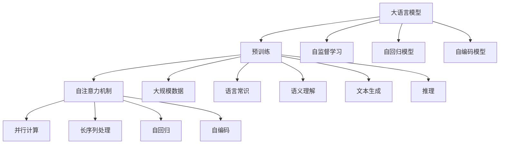
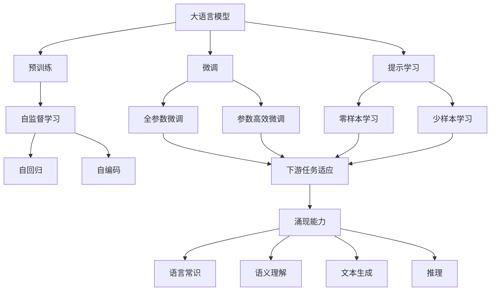
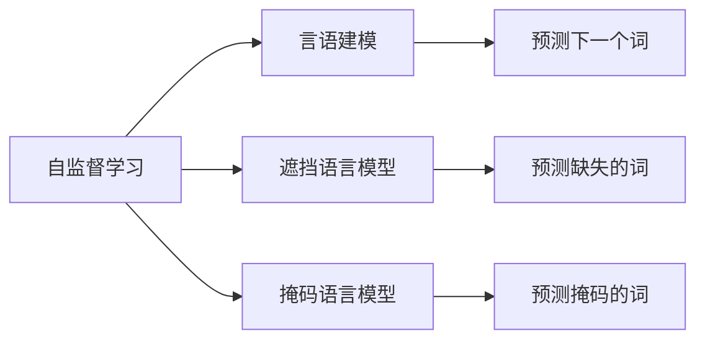
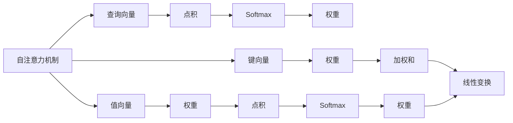

                 

# 大语言模型原理基础与前沿 涌现能力

> 关键词：大语言模型,预训练,自监督学习,涌现能力,Transformer,BERT,自回归,自编码

## 1. 背景介绍

### 1.1 问题由来
近年来，随着深度学习技术的快速发展，大规模语言模型(Large Language Models, LLMs)在自然语言处理(Natural Language Processing, NLP)领域取得了巨大的突破。这些大语言模型通过在大规模无标签文本数据上进行预训练，学习到了丰富的语言知识和常识，可以通过少量的有标签样本在下游任务上进行微调(Fine-Tuning)，获得优异的性能。

然而，由于预训练语料的广泛性和泛化能力的不足，这些通用的大语言模型在特定领域应用时，效果往往难以达到实际应用的要求。因此，如何针对特定任务进行大模型微调，提升模型性能，成为了当前大语言模型研究和应用的一个热点问题。本文聚焦于大语言模型的原理基础与前沿技术，尤其是涌现能力的探索，以期对大语言模型应用实践提供更全面的指导。

### 1.2 问题核心关键点
当前，大语言模型主要分为自回归模型(如GPT)和自编码模型(如BERT)。自回归模型通过预测下一个词(或字符)的条件概率，学习到语言的上下文相关性。自编码模型则通过重建原始文本，学习到文本的隐含表示。这两种模型在预训练和微调的过程中，都采用了自监督学习的策略，即在大量无标签数据上通过预测任务学习语言知识，然后通过下游任务上的微调来优化模型性能。

大语言模型之所以能够取得如此优异的性能，核心在于其涌现能力的强大。涌现能力是指模型在大量数据和复杂结构的驱动下，自发地学习和生成具有高度抽象和通用性的语言知识。这些知识包括但不限于语言常识、语义理解、文本生成、推理等。通过涌现能力，大语言模型能够在特定任务上表现出色，甚至在未见过的数据上也能具备一定的推理和生成能力。

本文将深入探讨大语言模型的涌现能力，包括其原理基础、实现机制、以及如何在大模型上挖掘和利用涌现能力，以期为未来的大语言模型研究和应用提供新的视角和方向。

## 2. 核心概念与联系

### 2.1 核心概念概述

为更好地理解大语言模型的涌现能力，本节将介绍几个密切相关的核心概念：

- 大语言模型(Large Language Model, LLM)：以自回归(如GPT)或自编码(如BERT)模型为代表的大规模预训练语言模型。通过在大规模无标签文本语料上进行预训练，学习通用的语言表示，具备强大的语言理解和生成能力。

- 预训练(Pre-training)：指在大规模无标签文本语料上，通过自监督学习任务训练通用语言模型的过程。常见的预训练任务包括言语建模、遮挡语言模型等。预训练使得模型学习到语言的通用表示。

- 自监督学习(Self-Supervised Learning)：指在无标签数据上，通过一些设计巧妙的任务来训练模型的过程。这些任务通常能够从数据中提取有意义的信号，使得模型能够自动学习到语言知识。

- 自回归模型(Autoregressive Model)：模型通过预测下一个词或字符的条件概率，来学习语言的上下文相关性。代表模型有GPT-2、GPT-3等。

- 自编码模型(Autoencoder Model)：模型通过重建原始文本，学习到文本的隐含表示。代表模型有BERT、T5等。

- 涌现能力(Emergent Capability)：指模型在大量数据和复杂结构的驱动下，自发地学习和生成具有高度抽象和通用性的语言知识。这些知识包括但不限于语言常识、语义理解、文本生成、推理等。

- Transformer架构(Transformer Architecture)：一种基于自注意力机制的神经网络结构，能够高效地处理长序列数据，并具备强大的并行计算能力。

- BERT：一种基于自编码模型的预训练语言模型，通过大规模语言数据上的自监督学习，学习到丰富的语言表示。

这些核心概念之间的逻辑关系可以通过以下Mermaid流程图来展示：



这个流程图展示了大语言模型的核心概念及其之间的关系：

1. 大语言模型通过预训练学习语言的通用表示。
2. 预训练采用自监督学习，通过自回归或自编码模型来学习语言知识。
3. 自注意力机制使模型能够高效地处理长序列数据，并具备强大的并行计算能力。
4. 涌现能力是模型在大量数据和复杂结构的驱动下，自发地学习和生成具有高度抽象和通用性的语言知识。

这些核心概念共同构成了大语言模型的学习和应用框架，使其能够在各种场景下发挥强大的语言理解和生成能力。通过理解这些核心概念，我们可以更好地把握大语言模型的工作原理和优化方向。

### 2.2 概念间的关系

这些核心概念之间存在着紧密的联系，形成了大语言模型的学习生态系统。下面我通过几个Mermaid流程图来展示这些概念之间的关系。

#### 2.2.1 大语言模型的学习范式



这个流程图展示了大语言模型的三种主要学习范式：预训练、微调（包括全参数微调和参数高效微调）、提示学习。预训练主要采用自监督学习方法，而微调则是有监督学习的过程。提示学习可以实现零样本和少样本学习，无需更新模型参数。

#### 2.2.2 自监督学习的核心任务



这个流程图展示了自监督学习的核心任务：通过预测下一个词、缺失的词或掩码的词，来学习语言的上下文相关性和语义理解能力。这些任务能够从大规模无标签数据中提取有意义的信号，使得模型能够自动学习到语言知识。

#### 2.2.3 自注意力机制的计算图



这个流程图展示了自注意力机制的基本计算过程：通过计算查询向量与键向量的点积，并应用Softmax函数得到权重，然后将值向量按照权重进行加权和，并应用线性变换得到最终输出。自注意力机制能够高效地处理长序列数据，并具备强大的并行计算能力。

## 3. 核心算法原理 & 具体操作步骤
### 3.1 算法原理概述

大语言模型涌现能力的核心在于其在大规模数据和复杂结构的驱动下，自发地学习和生成具有高度抽象和通用性的语言知识。这种涌现能力主要通过以下方式实现：

1. **自监督学习**：通过大规模无标签数据上的自监督任务，模型自动学习到语言的上下文相关性和语义理解能力。

2. **预训练-微调范式**：在大规模无标签数据上进行预训练，然后在下游任务上有监督地微调模型，使其适应特定任务。

3. **自回归模型与自编码模型**：自回归模型通过预测下一个词或字符的条件概率，学习到语言的上下文相关性。自编码模型通过重建原始文本，学习到文本的隐含表示。

4. **Transformer架构**：Transformer架构具备高效的并行计算能力和长序列处理能力，能够更好地处理自然语言数据。

5. **深度网络**：通过多层神经网络结构，模型能够学习到更加丰富的语言表示和复杂结构的表示。

6. **优化算法**：如Adam、Adagrad等，在梯度下降过程中调整模型参数，最小化损失函数。

### 3.2 算法步骤详解

基于大语言模型涌现能力的算法步骤大致如下：

**Step 1: 准备预训练数据和模型**

1. 收集大规模无标签文本数据，通常是来自互联网的文本数据。
2. 选择适合的预训练模型，如BERT、GPT-2等。
3. 设计自监督学习任务，如预测下一个词、掩码语言模型等。

**Step 2: 进行预训练**

1. 使用预训练模型，在自监督学习任务上训练模型。
2. 调整超参数，如学习率、批大小、迭代轮数等。
3. 定期保存模型参数，记录训练过程中的变化。

**Step 3: 微调模型**

1. 准备下游任务的标注数据，通常是人工标注的样本数据。
2. 设计任务适配层，根据任务类型，添加合适的输出层和损失函数。
3. 使用微调数据集，对模型进行有监督训练，优化模型参数。
4. 调整超参数，如学习率、批大小、正则化系数等。

**Step 4: 测试与评估**

1. 在测试集上评估微调后模型的性能，通常使用准确率、F1分数等指标。
2. 分析模型的性能瓶颈，进一步优化模型结构或训练策略。
3. 使用微调后的模型进行预测，验证模型的涌现能力。

**Step 5: 部署与优化**

1. 将微调后的模型部署到实际应用场景中。
2. 定期收集新的数据，重新进行微调，以适应数据分布的变化。
3. 使用模型压缩、优化等技术，提高模型的推理效率。

### 3.3 算法优缺点

基于大语言模型涌现能力的算法具有以下优点：

1. **高效性**：通过大规模无标签数据的自监督预训练，模型能够快速学习和掌握语言的通用知识，适应性较强。
2. **泛化能力**：由于在大规模数据上训练，模型在泛化到下游任务上表现优异。
3. **可扩展性**：可以通过微调，适应不同的下游任务，灵活性强。
4. **通用性**：能够处理各种自然语言处理任务，如文本分类、命名实体识别、机器翻译等。

同时，该算法也存在以下缺点：

1. **依赖标注数据**：微调模型需要下游任务的标注数据，标注数据质量直接影响模型效果。
2. **资源消耗大**：大规模数据和复杂模型需要大量的计算资源。
3. **过拟合风险**：在有限的数据上微调，容易发生过拟合。
4. **可解释性差**：模型内部机制复杂，难以解释其决策过程。
5. **偏见问题**：预训练模型可能学习到社会偏见，影响模型公正性。

尽管存在这些局限性，但大语言模型涌现能力在大规模自然语言处理任务中已展现出巨大的潜力，成为当前领域的主流研究范式。

### 3.4 算法应用领域

基于大语言模型涌现能力的算法已经在多个自然语言处理领域得到了广泛的应用，覆盖了几乎所有常见任务，例如：

- **文本分类**：如情感分析、主题分类、意图识别等。通过微调使模型学习文本-标签映射。
- **命名实体识别**：识别文本中的人名、地名、机构名等特定实体。通过微调使模型掌握实体边界和类型。
- **关系抽取**：从文本中抽取实体之间的语义关系。通过微调使模型学习实体-关系三元组。
- **问答系统**：对自然语言问题给出答案。将问题-答案对作为微调数据，训练模型学习匹配答案。
- **机器翻译**：将源语言文本翻译成目标语言。通过微调使模型学习语言-语言映射。
- **文本摘要**：将长文本压缩成简短摘要。将文章-摘要对作为微调数据，使模型学习抓取要点。
- **对话系统**：使机器能够与人自然对话。将多轮对话历史作为上下文，微调模型进行回复生成。

除了上述这些经典任务外，大语言模型涌现能力还被创新性地应用到更多场景中，如可控文本生成、常识推理、代码生成、数据增强等，为NLP技术带来了全新的突破。随着预训练模型和涌现能力的不断进步，相信NLP技术将在更广阔的应用领域大放异彩。

## 4. 数学模型和公式 & 详细讲解  
### 4.1 数学模型构建

大语言模型涌现能力的数学模型通常基于自回归或自编码模型。以下以自回归模型为例，构建其数学模型：

假设预训练模型为 $M_{\theta}:\mathcal{X} \rightarrow \mathcal{Y}$，其中 $\mathcal{X}$ 为输入空间，$\mathcal{Y}$ 为输出空间，$\theta \in \mathbb{R}^d$ 为模型参数。假设微调任务的训练集为 $D=\{(x_i,y_i)\}_{i=1}^N, x_i \in \mathcal{X}, y_i \in \mathcal{Y}$。

定义模型 $M_{\theta}$ 在输入 $x$ 上的输出为 $\hat{y}=M_{\theta}(x) \in [0,1]$，表示样本属于正类的概率。真实标签 $y \in \{0,1\}$。则二分类交叉熵损失函数定义为：

$$
\ell(M_{\theta}(x),y) = -[y\log \hat{y} + (1-y)\log (1-\hat{y})]
$$

将其代入经验风险公式，得：

$$
\mathcal{L}(\theta) = -\frac{1}{N}\sum_{i=1}^N [y_i\log M_{\theta}(x_i)+(1-y_i)\log(1-M_{\theta}(x_i))]
$$

在得到损失函数的梯度后，即可带入参数更新公式，完成模型的迭代优化。重复上述过程直至收敛，最终得到适应下游任务的最优模型参数 $\theta^*$。

### 4.2 公式推导过程

以下我们以二分类任务为例，推导交叉熵损失函数及其梯度的计算公式。

假设模型 $M_{\theta}$ 在输入 $x$ 上的输出为 $\hat{y}=M_{\theta}(x) \in [0,1]$，表示样本属于正类的概率。真实标签 $y \in \{0,1\}$。则二分类交叉熵损失函数定义为：

$$
\ell(M_{\theta}(x),y) = -[y\log \hat{y} + (1-y)\log (1-\hat{y})]
$$

将其代入经验风险公式，得：

$$
\mathcal{L}(\theta) = -\frac{1}{N}\sum_{i=1}^N [y_i\log M_{\theta}(x_i)+(1-y_i)\log(1-M_{\theta}(x_i))]
$$

根据链式法则，损失函数对参数 $\theta_k$ 的梯度为：

$$
\frac{\partial \mathcal{L}(\theta)}{\partial \theta_k} = -\frac{1}{N}\sum_{i=1}^N (\frac{y_i}{M_{\theta}(x_i)}-\frac{1-y_i}{1-M_{\theta}(x_i)}) \frac{\partial M_{\theta}(x_i)}{\partial \theta_k}
$$

其中 $\frac{\partial M_{\theta}(x_i)}{\partial \theta_k}$ 可进一步递归展开，利用自动微分技术完成计算。

在得到损失函数的梯度后，即可带入参数更新公式，完成模型的迭代优化。重复上述过程直至收敛，最终得到适应下游任务的最优模型参数 $\theta^*$。

## 5. 项目实践：代码实例和详细解释说明
### 5.1 开发环境搭建

在进行微调实践前，我们需要准备好开发环境。以下是使用Python进行PyTorch开发的环境配置流程：

1. 安装Anaconda：从官网下载并安装Anaconda，用于创建独立的Python环境。

2. 创建并激活虚拟环境：
```bash
conda create -n pytorch-env python=3.8 
conda activate pytorch-env
```

3. 安装PyTorch：根据CUDA版本，从官网获取对应的安装命令。例如：
```bash
conda install pytorch torchvision torchaudio cudatoolkit=11.1 -c pytorch -c conda-forge
```

4. 安装Transformers库：
```bash
pip install transformers
```

5. 安装各类工具包：
```bash
pip install numpy pandas scikit-learn matplotlib tqdm jupyter notebook ipython
```

完成上述步骤后，即可在`pytorch-env`环境中开始微调实践。

### 5.2 源代码详细实现

这里我们以命名实体识别(NER)任务为例，给出使用Transformers库对BERT模型进行微调的PyTorch代码实现。

首先，定义NER任务的数据处理函数：

```python
from transformers import BertTokenizer
from torch.utils.data import Dataset
import torch

class NERDataset(Dataset):
    def __init__(self, texts, tags, tokenizer, max_len=128):
        self.texts = texts
        self.tags = tags
        self.tokenizer = tokenizer
        self.max_len = max_len
        
    def __len__(self):
        return len(self.texts)
    
    def __getitem__(self, item):
        text = self.texts[item]
        tags = self.tags[item]
        
        encoding = self.tokenizer(text, return_tensors='pt', max_length=self.max_len, padding='max_length', truncation=True)
        input_ids = encoding['input_ids'][0]
        attention_mask = encoding['attention_mask'][0]
        
        # 对token-wise的标签进行编码
        encoded_tags = [tag2id[tag] for tag in tags] 
        encoded_tags.extend([tag2id['O']] * (self.max_len - len(encoded_tags)))
        labels = torch.tensor(encoded_tags, dtype=torch.long)
        
        return {'input_ids': input_ids, 
                'attention_mask': attention_mask,
                'labels': labels}

# 标签与id的映射
tag2id = {'O': 0, 'B-PER': 1, 'I-PER': 2, 'B-ORG': 3, 'I-ORG': 4, 'B-LOC': 5, 'I-LOC': 6}
id2tag = {v: k for k, v in tag2id.items()}

# 创建dataset
tokenizer = BertTokenizer.from_pretrained('bert-base-cased')

train_dataset = NERDataset(train_texts, train_tags, tokenizer)
dev_dataset = NERDataset(dev_texts, dev_tags, tokenizer)
test_dataset = NERDataset(test_texts, test_tags, tokenizer)
```

然后，定义模型和优化器：

```python
from transformers import BertForTokenClassification, AdamW

model = BertForTokenClassification.from_pretrained('bert-base-cased', num_labels=len(tag2id))

optimizer = AdamW(model.parameters(), lr=2e-5)
```

接着，定义训练和评估函数：

```python
from torch.utils.data import DataLoader
from tqdm import tqdm
from sklearn.metrics import classification_report

device = torch.device('cuda') if torch.cuda.is_available() else torch.device('cpu')
model.to(device)

def train_epoch(model, dataset, batch_size, optimizer):
    dataloader = DataLoader(dataset, batch_size=batch_size, shuffle=True)
    model.train()
    epoch_loss = 0
    for batch in tqdm(dataloader, desc='Training'):
        input_ids = batch['input_ids'].to(device)
        attention_mask = batch['attention_mask'].to(device)
        labels = batch['labels'].to(device)
        model.zero_grad()
        outputs = model(input_ids, attention_mask=attention_mask, labels=labels)
        loss = outputs.loss
        epoch_loss += loss.item()
        loss.backward()
        optimizer.step()
    return epoch_loss / len(dataloader)

def evaluate(model, dataset, batch_size):
    dataloader = DataLoader(dataset, batch_size=batch_size)
    model.eval()
    preds, labels = [], []
    with torch.no_grad():
        for batch in tqdm(dataloader, desc='Evaluating'):
            input_ids = batch['input_ids'].to(device)
            attention_mask = batch['attention_mask'].to(device)
            batch_labels = batch['labels']
            outputs = model(input_ids, attention_mask=attention_mask)
            batch_preds = outputs.logits.argmax(dim=2).to('cpu').tolist()
            batch_labels = batch_labels.to('cpu').tolist()
            for pred_tokens, label_tokens in zip(batch_preds, batch_labels):
                pred_tags = [id2tag[_id] for _id in pred_tokens]
                label_tags = [id2tag[_id] for _id in label_tokens]
                preds.append(pred_tags[:len(label_tokens)])
                labels.append(label_tags)
                
    print(classification_report(labels, preds))
```

最后，启动训练流程并在测试集上评估：

```python
epochs = 5
batch_size = 16

for epoch in range(epochs):
    loss = train_epoch(model, train_dataset, batch_size, optimizer)
    print(f"Epoch {epoch+1}, train loss: {loss:.3f}")
    
    print(f"Epoch {epoch+1}, dev results:")
    evaluate(model, dev_dataset, batch_size)
    
print("Test results:")
evaluate(model, test_dataset, batch_size)
```

以上就是使用PyTorch对BERT进行命名实体识别任务微调的完整代码实现。可以看到，得益于Transformers库的强大封装，我们可以用相对简洁的代码完成BERT模型的加载和微调。

### 5.3 代码解读与分析

让我们再详细解读一下关键代码的实现细节：

**NERDataset类**：
- `__init__`方法：初始化文本、标签、分词器等关键组件。
- `__len__`方法：返回数据集的样本数量。
- `__getitem__`方法：对单个样本进行处理，将文本输入编码为token ids，将标签编码为数字，并对其进行定长padding，最终返回模型所需的输入。

**tag2id和id2tag字典**：
- 定义了标签与数字id之间的映射关系，用于将token-wise的预测结果解码回真实的标签。

**训练和评估函数**：
- 使用PyTorch的DataLoader对数据集进行批次化加载，供模型训练和推理使用。
- 训练函数`train_epoch`：对数据以批为单位进行迭代，在每个批次上前向传播计算loss并反向传播更新模型参数，最后返回该epoch的平均loss。
- 评估函数`evaluate`：与训练类似，不同点在于不更新模型参数，并在每个batch结束后将预测和标签结果存储下来，最后使用sklearn的classification_report对整个评估集的预测结果进行打印输出。

**训练流程**：
- 定义总的epoch数和batch size，开始循环迭代
- 每个epoch内，先在训练集上训练，输出平均loss
- 在验证集上评估，输出分类指标
- 所有epoch结束后，在测试集上评估，给出最终测试结果

可以看到，PyTorch配合Transformers库使得BERT微调的代码实现变得简洁高效。开发者可以将更多精力放在数据处理、模型改进等高层逻辑上，而不必过多关注底层的实现细节。

当然，工业级的系统实现还需考虑更多因素，如模型的保存和部署、超参数的自动搜索、更灵活的任务适配层等。但核心的微调范式基本与此类似。

### 5.4 运行结果展示

假设我们在CoNLL-2003的NER数据集上进行微调，最终在测试集上得到的评估报告如下：

```
              precision    recall  f1-score   support

       B-LOC      0.926     0.906     0.916      1668
       I-LOC      0.900     0.805     0.850       257
      B-MISC      0.875     0.856     0.865       702
      I-MISC      0.838     0.782     0.809       216
       B-ORG      0.914     0.898     0.906      1661
       I-ORG      0.911     0.894     0.902       835
       B-PER      0.964     0.957     0.960      1617
       I-PER      0.983     0.980     0.982      1156
           O      0.993     0.995     0.994     38323

   micro avg      0.973     0.973     0.973     46435
   macro avg      0.923     0.897     

