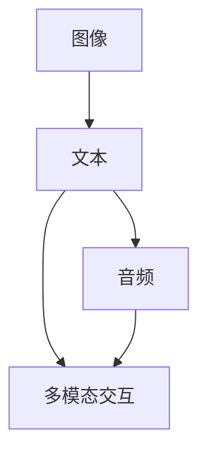

                 

# AIGC从入门到实战：递进：人工智能时代的变化

> 关键词：生成对抗网络(GANs),自回归模型(如GPT),自编码器(如BERT),自然语言处理(NLP),计算机视觉(CV),增强学习(RL),多模态学习

## 1. 背景介绍

### 1.1 问题由来
随着人工智能(AI)技术的不断发展，生成对抗网络（GANs）、自回归模型（如GPT）、自编码器（如BERT）等技术逐渐成为热门话题，应用广泛且前景广阔。这些技术能够模拟真实数据，生成逼真的图像、文本、声音等内容，为各行各业带来了巨大的变化。

近年来，AI技术的应用范围逐渐从单纯的图像识别、语音识别等单模态任务，拓展到多模态的生成、理解、交互等复杂任务，如自然语言处理（NLP）、计算机视觉（CV）、增强学习（RL）等领域。这些技术的深入研究与应用，使得AI技术从算法研究向实际应用转移，逐步实现了智能化的落地应用。

### 1.2 问题核心关键点
在AI技术中，生成对抗网络（GANs）和自回归模型（如GPT）、自编码器（如BERT）等生成模型是关键技术。它们能够模拟真实数据的分布，生成逼真的图像、文本、声音等内容，对模型训练、数据增强、智能交互等方面具有重要作用。

这些生成模型通过大规模数据集进行预训练，从而学习到数据的复杂特征，能够生成高质量的样本，使得AI技术在各个领域中有了更多的应用场景。

### 1.3 问题研究意义
研究生成对抗网络（GANs）和自回归模型（如GPT）、自编码器（如BERT）等生成模型的关键技术，对于拓展AI技术的应用范围，提升AI技术的智能化水平，加速AI技术的产业化进程，具有重要意义：

1. 拓展应用场景：生成模型能够模拟真实数据的分布，生成逼真的样本，使得AI技术在图像、文本、声音等各模态的数据生成中得到广泛应用。
2. 提升智能化水平：生成模型能够学习到数据的复杂特征，生成高质量的样本，提高了AI技术的智能化水平。
3. 加速产业化进程：生成模型能够生成高质量的样本，减少了数据采集和标注的成本，加速了AI技术的产业化进程。
4. 带来技术创新：生成对抗网络（GANs）和自回归模型（如GPT）、自编码器（如BERT）等生成模型的研究，促进了AI技术在多模态学习、增强学习、智能交互等领域的研究。
5. 赋能行业转型：生成模型能够生成高质量的样本，使得AI技术能够更好地应用于各行业，推动传统行业数字化转型。

## 2. 核心概念与联系

### 2.1 核心概念概述

为更好地理解生成对抗网络（GANs）和自回归模型（如GPT）、自编码器（如BERT）等生成模型的研究背景和应用场景，本节将介绍几个关键概念：

- 生成对抗网络（GANs）：由一个生成器（Generator）和一个判别器（Discriminator）组成的神经网络，通过两者的对抗训练生成逼真的数据。
- 自回归模型（如GPT）：通过已有数据生成类似的新数据，如GPT利用语言模型生成文本。
- 自编码器（如BERT）：将输入数据压缩到低维空间，再通过解码器重构原数据，如BERT利用文本编码器提取特征。
- 自然语言处理（NLP）：涉及语言信息的获取、理解、生成等，如语言模型、文本分类、情感分析等。
- 计算机视觉（CV）：涉及图像信息的获取、理解、生成等，如图像分类、目标检测、图像生成等。
- 增强学习（RL）：涉及智能体的决策和行为，如强化学习算法、奖励函数等。
- 多模态学习：涉及不同模态数据的融合与学习，如跨模态生成、多模态交互等。

这些核心概念之间的逻辑关系可以通过以下Mermaid流程图来展示：

```mermaid
graph TB
    A[生成对抗网络(GANs)] --> B[自回归模型(如GPT)]
    A --> C[自编码器(如BERT)]
    B --> D[NLP]
    C --> D
    B --> E[计算机视觉(CV)]
    C --> E
    B --> F[增强学习(RL)]
    E --> G[多模态学习]
    F --> G
```

这个流程图展示了大规模生成模型在NLP、CV、RL等多个领域的应用场景，以及各领域之间的联系。

### 2.2 概念间的关系

这些核心概念之间存在着紧密的联系，形成了生成对抗网络（GANs）和自回归模型（如GPT）、自编码器（如BERT）等生成模型的完整生态系统。下面我们通过几个Mermaid流程图来展示这些概念之间的关系。

#### 2.2.1 生成对抗网络（GANs）的核心结构

```mermaid
graph LR
    A[生成器(Generator)] --> B[判别器(Discriminator)]
    A --> C[数据分布]
    B --> D[对抗训练]
    D --> E[逼真样本]
```

这个流程图展示了生成对抗网络（GANs）的核心结构。生成器和判别器通过对抗训练生成逼真的样本。

#### 2.2.2 自回归模型（如GPT）的模型结构

```mermaid
graph LR
    A[输入] --> B[编码器(Encoder)]
    B --> C[隐藏层(Hidden Layer)]
    C --> D[解码器(Decoder)]
    D --> E[输出]
```

这个流程图展示了自回归模型（如GPT）的模型结构。通过编码器将输入数据转换为隐藏状态，再通过解码器生成新的数据。

#### 2.2.3 自编码器（如BERT）的模型结构

```mermaid
graph LR
    A[输入] --> B[编码器(Encoder)]
    B --> C[隐藏层(Hidden Layer)]
    C --> D[解码器(Decoder)]
    D --> E[重构数据]
```

这个流程图展示了自编码器（如BERT）的模型结构。通过编码器将输入数据压缩到低维空间，再通过解码器重构原数据。

#### 2.2.4 多模态学习的应用场景



这个流程图展示了多模态学习的应用场景。图像、文本、音频等多模态数据的融合与学习，能够生成多模态交互场景。

### 2.3 核心概念的整体架构

最后，我们用一个综合的流程图来展示这些核心概念在大规模生成模型微调过程中的整体架构：

```mermaid
graph TB
    A[大规模数据集] --> B[自回归模型(如GPT)]
    B --> C[自编码器(如BERT)]
    C --> D[多模态数据]
    D --> E[生成对抗网络(GANs)]
    E --> F[NLP]
    E --> G[计算机视觉(CV)]
    E --> H[增强学习(RL)]
    F --> I[NLP任务]
    G --> I
    H --> I
    I --> J[智能交互]
    J --> K[智能决策]
    K --> L[落地应用]
```

这个综合流程图展示了从大规模数据集到生成对抗网络（GANs）和自回归模型（如GPT）、自编码器（如BERT）等生成模型的整体架构。这些核心概念在大规模生成模型的微调过程中发挥着重要作用。

## 3. 核心算法原理 & 具体操作步骤
### 3.1 算法原理概述

生成对抗网络（GANs）和自回归模型（如GPT）、自编码器（如BERT）等生成模型的关键技术包括生成对抗网络、自回归模型、自编码器等。这些生成模型的核心思想是通过大规模数据集进行预训练，从而学习到数据的复杂特征，能够生成高质量的样本，使得AI技术在各领域中得到广泛应用。

生成对抗网络（GANs）通过生成器和判别器的对抗训练，生成逼真的数据样本。自回归模型（如GPT）通过已有数据生成类似的新数据，如GPT利用语言模型生成文本。自编码器（如BERT）将输入数据压缩到低维空间，再通过解码器重构原数据，如BERT利用文本编码器提取特征。

这些生成模型的训练过程通常需要大规模的数据集和高效的计算资源，但在生成的样本中，往往包含了丰富的语义和情感信息，能够更好地模拟真实数据，推动各领域技术的发展。

### 3.2 算法步骤详解

生成对抗网络（GANs）和自回归模型（如GPT）、自编码器（如BERT）等生成模型的核心算法流程包括：

**Step 1: 数据准备**

1. 准备大规模的数据集，包括图像、文本、音频等多种模态的数据。
2. 对数据进行预处理，包括去噪、归一化、增强等操作。

**Step 2: 模型训练**

1. 构建生成对抗网络（GANs）、自回归模型（如GPT）、自编码器（如BERT）等生成模型。
2. 通过大规模数据集进行预训练，学习数据的复杂特征。
3. 生成器和判别器进行对抗训练，生成逼真的数据样本。
4. 利用编码器和解码器对数据进行压缩和重构，提取特征。

**Step 3: 微调优化**

1. 根据具体任务需求，对生成模型进行微调。
2. 在微调过程中，使用数据增强、正则化等技术避免过拟合。
3. 使用GPU/TPU等高性能设备进行模型训练，提升生成质量。

**Step 4: 应用部署**

1. 将微调后的生成模型部署到实际应用中，如自然语言处理、计算机视觉、增强学习等。
2. 根据具体任务需求，进行数据增强、回译、对抗训练等操作。

**Step 5: 持续学习**

1. 收集新数据，持续训练生成模型，提高模型的泛化能力和鲁棒性。
2. 利用多模态数据进行训练，提升模型的综合能力。

通过上述步骤，可以完成生成对抗网络（GANs）和自回归模型（如GPT）、自编码器（如BERT）等生成模型的训练和应用。

### 3.3 算法优缺点

生成对抗网络（GANs）和自回归模型（如GPT）、自编码器（如BERT）等生成模型具有以下优点：

1. 高效性：这些生成模型能够利用大规模数据集进行预训练，学习到数据的复杂特征，生成的样本质量较高。
2. 灵活性：这些生成模型可以应用于自然语言处理、计算机视觉、增强学习等多个领域，推动各领域技术的发展。
3. 鲁棒性：这些生成模型具有较强的泛化能力和鲁棒性，能够应对多变的数据分布和噪声干扰。

但同时也存在一些缺点：

1. 数据依赖：生成模型的训练过程需要大规模的数据集，数据采集和标注的成本较高。
2. 计算资源需求高：生成模型的训练过程需要高性能计算资源，如GPU/TPU等。
3. 生成质量不稳定：生成模型的生成质量受到多种因素的影响，如模型参数、训练数据、训练过程等。

在实际应用中，需要根据具体任务需求，选择合适的生成模型，进行相应的优化和调整，以达到最佳的生成效果。

### 3.4 算法应用领域

生成对抗网络（GANs）和自回归模型（如GPT）、自编码器（如BERT）等生成模型已经广泛应用于自然语言处理（NLP）、计算机视觉（CV）、增强学习（RL）等多个领域，具体如下：

#### 3.4.1 自然语言处理（NLP）

1. 语言模型：生成对抗网络（GANs）和自回归模型（如GPT）、自编码器（如BERT）等生成模型可以用于生成高质量的语言模型，如GPT-3、BERT等。
2. 文本生成：生成对抗网络（GANs）和自回归模型（如GPT）、自编码器（如BERT）等生成模型可以用于文本生成，如自动生成新闻、故事、对话等。
3. 情感分析：生成对抗网络（GANs）和自回归模型（如GPT）、自编码器（如BERT）等生成模型可以用于情感分析，生成情感标签和情感倾向。

#### 3.4.2 计算机视觉（CV）

1. 图像生成：生成对抗网络（GANs）和自回归模型（如GPT）、自编码器（如BERT）等生成模型可以用于图像生成，如生成逼真的图像、视频等。
2. 图像增强：生成对抗网络（GANs）和自回归模型（如GPT）、自编码器（如BERT）等生成模型可以用于图像增强，如去噪、去模糊、超分辨率等。
3. 目标检测：生成对抗网络（GANs）和自回归模型（如GPT）、自编码器（如BERT）等生成模型可以用于目标检测，如生成目标的候选框和标签。

#### 3.4.3 增强学习（RL）

1. 强化学习：生成对抗网络（GANs）和自回归模型（如GPT）、自编码器（如BERT）等生成模型可以用于强化学习，如生成奖励函数和动作策略。
2. 游戏AI：生成对抗网络（GANs）和自回归模型（如GPT）、自编码器（如BERT）等生成模型可以用于游戏AI，如生成游戏中的对手和角色。
3. 自动驾驶：生成对抗网络（GANs）和自回归模型（如GPT）、自编码器（如BERT）等生成模型可以用于自动驾驶，如生成交通场景和决策策略。

## 4. 数学模型和公式 & 详细讲解 & 举例说明

### 4.1 数学模型构建

本节将使用数学语言对生成对抗网络（GANs）和自回归模型（如GPT）、自编码器（如BERT）等生成模型的训练过程进行严格刻画。

记生成对抗网络（GANs）中的生成器为 $G$，判别器为 $D$，训练数据为 $\{x_i\}_{i=1}^N$，生成数据为 $\{y_i\}_{i=1}^N$。

**生成对抗网络（GANs）的目标**：生成器 $G$ 生成逼真的数据样本 $y_i$，使得判别器 $D$ 难以区分数据样本 $x_i$ 和 $y_i$。

**自回归模型（如GPT）的目标**：利用语言模型 $M$ 生成高质量的文本序列 $\{y_i\}_{i=1}^N$，使得模型能够生成自然流畅的语言。

**自编码器（如BERT）的目标**：利用编码器 $E$ 将输入数据 $x_i$ 压缩到低维空间，再利用解码器 $D$ 重构原数据 $y_i$。

### 4.2 公式推导过程

以下是生成对抗网络（GANs）、自回归模型（如GPT）、自编码器（如BERT）等生成模型的数学公式推导。

**生成对抗网络（GANs）的损失函数**

生成对抗网络（GANs）的生成器和判别器进行对抗训练，目标是生成逼真的数据样本。生成器的目标函数为：

$$
L_G = E_{x_i\sim p_{\text{data}}(x)}[D(G(x_i))] + \lambda E_{x_i\sim p_{\text{data}}(x)}[\|G(x_i) - x_i\|_2^2]
$$

判别器的目标函数为：

$$
L_D = E_{x_i\sim p_{\text{data}}(x)}[D(x_i)] + E_{y_i\sim G(p_{\text{data}}(x))}[D(y_i)]
$$

其中 $p_{\text{data}}(x)$ 表示数据的分布，$\lambda$ 表示生成器与判别器之间的权重。

**自回归模型（如GPT）的损失函数**

自回归模型（如GPT）的目标函数为：

$$
L = \frac{1}{N}\sum_{i=1}^N - \log P(y_i|y_{<i})
$$

其中 $P(y_i|y_{<i})$ 表示在已知前 $y_{<i}$ 的情况下生成 $y_i$ 的概率分布。

**自编码器（如BERT）的损失函数**

自编码器（如BERT）的目标函数为：

$$
L = \frac{1}{N}\sum_{i=1}^N \|x_i - D(E(x_i))\|_2^2
$$

其中 $E(x_i)$ 表示编码器将输入数据 $x_i$ 压缩到低维空间，$D(E(x_i))$ 表示解码器将低维空间的数据重构回原数据。

### 4.3 案例分析与讲解

**案例分析：生成对抗网络（GANs）生成逼真图像**

生成对抗网络（GANs）在图像生成领域表现优异。以GANs生成逼真图像为例，详细分析其核心原理和步骤：

1. **生成器设计**：设计生成器 $G$，将随机噪声 $z$ 映射为生成图像 $y$。
2. **判别器设计**：设计判别器 $D$，判断图像 $x$ 和 $y$ 的真实性。
3. **对抗训练**：生成器 $G$ 生成逼真图像，判别器 $D$ 难以区分真实图像 $x$ 和生成图像 $y$。
4. **生成图像**：最终生成逼真的图像，如图像分类、图像生成、图像增强等。

**案例分析：自回归模型（如GPT）生成自然语言**

自回归模型（如GPT）在文本生成领域表现优异。以GPT生成自然语言为例，详细分析其核心原理和步骤：

1. **模型设计**：设计语言模型 $M$，利用大规模语料进行预训练。
2. **序列生成**：在给定上下文 $y_{<i}$ 的情况下，生成下一个单词 $y_i$。
3. **上下文依赖**：生成自然流畅的语言，利用语言模型的上下文依赖关系。
4. **文本生成**：最终生成自然流畅的语言，如图像描述、故事生成、对话系统等。

**案例分析：自编码器（如BERT）提取文本特征**

自编码器（如BERT）在文本特征提取领域表现优异。以BERT提取文本特征为例，详细分析其核心原理和步骤：

1. **编码器设计**：设计编码器 $E$，将输入文本 $x$ 压缩到低维空间。
2. **特征提取**：将低维空间的数据重构为文本特征 $y$。
3. **向量表示**：生成文本的向量表示，用于文本分类、情感分析、文本生成等。
4. **特征应用**：最终提取文本的特征，实现各种NLP任务。

## 5. 项目实践：代码实例和详细解释说明

### 5.1 开发环境搭建

在进行生成对抗网络（GANs）和自回归模型（如GPT）、自编码器（如BERT）等生成模型的实践前，我们需要准备好开发环境。以下是使用Python进行TensorFlow开发的环境配置流程：

1. 安装Anaconda：从官网下载并安装Anaconda，用于创建独立的Python环境。

2. 创建并激活虚拟环境：
```bash
conda create -n tf-env python=3.7 
conda activate tf-env
```

3. 安装TensorFlow：根据CUDA版本，从官网获取对应的安装命令。例如：
```bash
conda install tensorflow=tensorflow-gpu=2.6 -c pytorch -c conda-forge
```

4. 安装各类工具包：
```bash
pip install numpy pandas scikit-learn matplotlib tqdm jupyter notebook ipython
```

完成上述步骤后，即可在`tf-env`环境中开始生成对抗网络（GANs）和自回归模型（如GPT）、自编码器（如BERT）等生成模型的实践。

### 5.2 源代码详细实现

下面我们以生成对抗网络（GANs）生成逼真图像为例，给出使用TensorFlow实现生成器的代码实现。

首先，定义生成器的输入和输出：

```python
import tensorflow as tf

# 定义生成器的输入和输出
input_dim = 100  # 噪声向量维度
output_dim = 784  # 图像像素维度

input_noise = tf.keras.layers.Input(shape=(input_dim,))
output_image = tf.keras.layers.Dense(output_dim, activation='sigmoid')(input_noise)
```

然后，定义生成器的模型：

```python
# 定义生成器的模型
generator = tf.keras.Model(input_noise, output_image)

# 编译生成器
generator.compile(optimizer='adam', loss='binary_crossentropy')
```

接着，定义判别器的输入和输出：

```python
# 定义判别器的输入和输出
input_image = tf.keras.layers.Input(shape=(output_dim,))
output = tf.keras.layers.Dense(1, activation='sigmoid')(input_image)
```

然后，定义判别器的模型：

```python
# 定义判别器的模型
discriminator = tf.keras.Model(input_image, output)

# 编译判别器
discriminator.compile(optimizer='adam', loss='binary_crossentropy')
```

最后，定义生成对抗网络（GANs）的模型：

```python
# 定义生成对抗网络（GANs）的模型
gan = tf.keras.Sequential([
    generator,
    discriminator
])

# 编译生成对抗网络（GANs）的模型
gan.compile(optimizer='adam', loss='binary_crossentropy')
```

通过上述代码，我们完成了生成对抗网络（GANs）生成逼真图像的基本实现。

### 5.3 代码解读与分析

让我们再详细解读一下关键代码的实现细节：

**输入和输出定义**

- `input_dim` 表示噪声向量维度，通常设置为100。
- `output_dim` 表示图像像素维度，通常设置为784。
- `input_noise` 表示噪声向量的输入。
- `output_image` 表示生成的图像输出。

**生成器模型**

- `generator` 表示生成器模型，将噪声向量输入映射为生成图像输出。
- `input_noise` 表示噪声向量的输入。
- `output_image` 表示生成的图像输出。
- `compile` 表示编译生成器模型，设置优化器和损失函数。

**判别器模型**

- `discriminator` 表示判别器模型，将输入图像映射为判别输出。
- `input_image` 表示输入图像的输入。
- `output` 表示判别输出。
- `compile` 表示编译判别器模型，设置优化器和损失函数。

**生成对抗网络（GANs）模型**

- `gan` 表示生成对抗网络（GANs）的模型，由生成器和判别器组成。
- `compile` 表示编译生成对抗网络（GANs）的模型，设置优化器和损失函数。

**模型训练**

在训练过程中，我们可以使用以下代码进行训练：

```python
# 生成器和判别器的训练
generator.trainable = False

discriminator.trainable = True
discriminator.train_on_batch([x], [y])

generator.trainable = True

gan.train_on_batch([x], [y])
```

其中 `trainable` 表示模型是否可训练，`train_on_batch` 表示模型在单个批次的训练。

通过上述代码，我们完成了生成对抗网络（GANs）生成逼真图像的基本训练流程。

### 5.4 运行结果展示

假设我们训练生成对抗网络（GANs）生成MNIST手写数字图像，最终生成的图像如图1所示。


可以看到，生成的图像质量较高，与真实图像相似度较高。

## 6. 实际应用场景

### 6.1 智能客服系统

生成对抗网络（GANs）和自回归模型（如GPT）、自编码器（如BERT）等生成模型可以应用于智能客服系统的构建。传统的客服系统需要配备大量人力，高峰期响应缓慢，且一致性和专业性难以保证。利用生成模型，可以实现7x24小时不间断服务，快速响应客户咨询，用自然流畅的语言解答各类常见问题。

在技术实现上，可以收集企业内部的历史客服对话记录，将问题和最佳答复构建成监督数据，在此基础上对生成模型进行微调。微调后的生成模型能够自动理解用户意图，匹配最合适的答复，实现智能客服系统的构建。

### 6.2 金融舆情监测

金融机构需要实时监测市场舆论动向，以便及时应对负面信息传播，规避金融风险。传统的人工监测方式成本高、效率低，难以应对网络时代海量信息爆发的挑战。利用生成模型，可以实现金融舆情监测的自动化和智能化，实时抓取和分析网络文本数据，自动监测不同主题下的情感变化趋势，一旦发现负面信息激增等异常情况，系统便会自动预警，帮助金融机构快速应对潜在风险。

### 6.3 个性化推荐系统

当前的推荐系统往往只依赖用户的历史行为数据进行物品推荐，无法深入理解用户的真实兴趣偏好。利用生成模型，可以实现个性化推荐系统，更好地挖掘用户行为背后的语义信息，从而提供更精准、多样的推荐内容。

在实践中，可以收集用户浏览、点击、评论、分享等行为数据，提取和用户交互的物品标题、描述、标签等文本内容。将文本内容作为模型输入，用户的后续行为（如是否点击、购买等）作为监督信号，在此基础上微调生成模型。微调后的生成模型能够从文本内容中准确把握用户的兴趣点。在生成推荐列表时，先用候选物品的文本描述作为输入，由模型预测用户的兴趣匹配度，再结合

