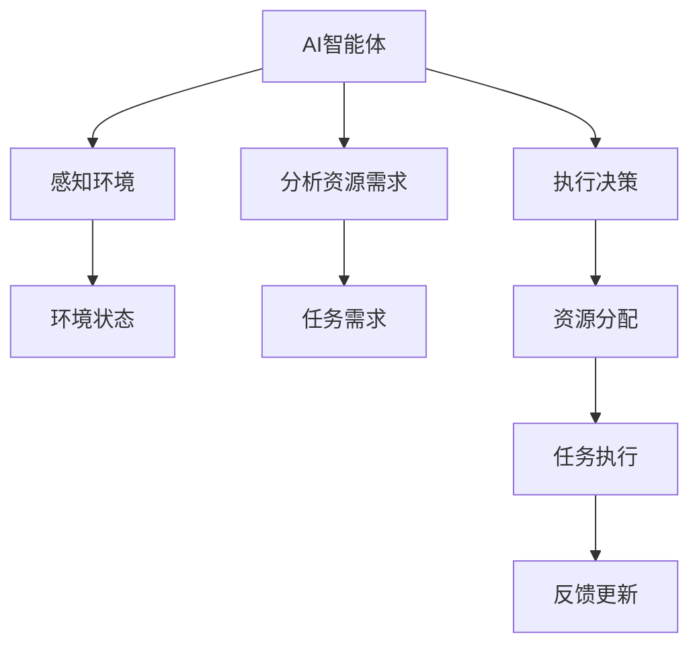

                 

## 1. 背景介绍

### 1.1 问题由来
在现代信息技术迅猛发展的背景下，AI（人工智能）技术的应用范围越来越广泛。然而，随着AI系统在各个领域的应用，如何合理高效地分配计算资源，以支持AI系统的稳定运行，成为亟需解决的问题。资源配置作为AI系统运行的核心环节，其合理性直接关系到系统的整体性能和用户体验。

### 1.2 问题核心关键点
资源配置的挑战在于如何在资源受限的情况下，通过合理分配计算资源，确保AI系统的有效运行。这涉及到计算资源的动态调整、资源优先级的设定、资源分配算法的设计等多个方面。

1. **计算资源动态调整**：在AI系统运行过程中，计算资源的动态调整是必要的。资源需求可能随时间变化，因此需要通过动态调整来应对资源需求的变化。
2. **资源优先级的设定**：资源有限时，需要明确各个任务或算法的优先级，以确保关键任务的优先执行。
3. **资源分配算法的设计**：资源分配算法是实现资源合理分配的核心。需要设计高效、公平的算法，以确保资源分配的合理性和系统性能。

### 1.3 问题研究意义
合理配置资源，是提高AI系统性能、降低运行成本、提升用户体验的重要手段。通过研究资源配置问题，可以更好地支持AI系统的运行，推动AI技术在各行业的深入应用。

1. **性能提升**：合理配置资源可以显著提高AI系统的运行效率，加快任务处理速度，提升系统响应能力。
2. **成本优化**：通过优化资源配置，可以降低系统的运行成本，避免资源浪费，提高资源利用效率。
3. **用户体验提升**：合理配置资源可以确保系统稳定运行，提升用户体验，减少用户等待时间，提高用户满意度。
4. **行业应用**：资源配置的研究和应用，可以推动AI技术在更多领域的应用，促进人工智能产业的发展。

## 2. 核心概念与联系

### 2.1 核心概念概述

为了深入理解资源配置中的AI智能体应用，我们需要了解一些核心概念及其相互关系：

1. **AI智能体**：AI智能体是一个能够自主决策、执行任务和适应环境的系统。在资源配置中，智能体通过感知环境状态、分析资源需求和执行决策来优化资源分配。
2. **资源配置**：资源配置是指在有限资源环境下，合理分配计算资源以支持任务执行的过程。资源配置的目标是最大化任务完成率和资源利用效率。
3. **多智能体系统**：多智能体系统是由多个自主决策的智能体组成的系统，各智能体之间通过交互协作完成共同目标。在资源配置中，多智能体系统可以协调不同任务的资源需求，实现资源的高效利用。
4. **优化算法**：优化算法用于设计资源分配策略，以最小化或最大化特定指标（如任务完成时间、资源利用率等）。常用的优化算法包括遗传算法、粒子群算法、线性规划等。

这些核心概念共同构成了AI智能体在资源配置中的应用基础。通过合理设计AI智能体和优化算法，可以有效地解决资源配置问题，提升AI系统的性能和效率。

### 2.2 概念间的关系

通过Mermaid流程图，我们可以更清晰地理解这些核心概念之间的逻辑关系：



这个流程图展示了AI智能体在资源配置中的工作流程：

1. AI智能体通过感知环境获取环境状态信息。
2. 智能体分析资源需求，了解当前任务所需的资源量。
3. 智能体根据资源需求和环境状态，执行决策以分配资源。
4. 任务执行后，智能体根据反馈信息进行更新调整，优化资源分配策略。

这些核心概念通过多智能体系统的交互协作，共同实现了资源配置的目标。

## 3. 核心算法原理 & 具体操作步骤

### 3.1 算法原理概述
AI智能体在资源配置中的应用，主要基于多智能体系统理论和优化算法。智能体通过感知环境、分析需求和执行决策，优化资源分配。

1. **感知环境**：智能体通过传感器或数据获取环境状态信息，包括资源当前可用量、任务队列状态、系统负载等。
2. **分析资源需求**：智能体根据任务要求，计算资源需求量和优先级。
3. **执行决策**：智能体基于优化算法，设计资源分配策略，最大化任务完成率和资源利用效率。
4. **反馈更新**：任务执行后，智能体根据反馈信息进行自我调整，优化后续资源分配策略。

### 3.2 算法步骤详解
以下是AI智能体在资源配置中的具体操作步骤：

1. **环境感知**：智能体感知环境状态，获取当前资源可用量和任务需求。
2. **需求分析**：智能体分析任务需求，确定各任务所需的资源量和优先级。
3. **策略设计**：智能体基于优化算法，设计资源分配策略，最大化任务完成率和资源利用效率。
4. **分配执行**：智能体执行资源分配策略，调整资源分配。
5. **反馈更新**：智能体根据任务执行反馈，更新资源分配策略，优化后续分配。

### 3.3 算法优缺点
AI智能体在资源配置中的应用具有以下优点：

1. **动态适应**：智能体能够根据环境变化和任务需求，动态调整资源分配策略，确保系统的稳定运行。
2. **优化效率**：通过优化算法，智能体能够找到最优的资源分配方案，提高资源利用效率。
3. **自主决策**：智能体具有自主决策能力，能够灵活应对各种资源分配场景。

但同时，智能体应用也存在一些缺点：

1. **模型复杂度**：智能体应用需要构建复杂的模型，设计和实现过程较为复杂。
2. **参数调优**：智能体中的优化算法需要调整大量参数，参数调优过程耗时较长。
3. **可解释性**：智能体的决策过程较为复杂，难以解释其内部机制和决策依据。
4. **数据需求**：智能体需要大量的历史数据进行训练和优化，数据获取和处理成本较高。

### 3.4 算法应用领域
AI智能体在资源配置中的应用广泛，涉及多个领域：

1. **云计算**：云平台通过智能体进行资源动态调整，优化资源利用效率。
2. **物联网**：物联网设备通过智能体进行资源分配，提升系统响应能力和资源利用率。
3. **工业控制**：工业控制系统通过智能体优化资源分配，提高生产效率和设备利用率。
4. **自动驾驶**：自动驾驶系统通过智能体进行资源优化，提升行驶安全和效率。
5. **智能家居**：智能家居设备通过智能体进行资源管理，提升用户使用体验。

## 4. 数学模型和公式 & 详细讲解

### 4.1 数学模型构建
在资源配置中，智能体可以通过数学模型来优化资源分配。假设资源总数为 $R$，任务总数为 $N$，每个任务所需资源量为 $C_i$，任务优先级为 $P_i$。资源分配的目标是最大化任务完成率 $S$ 和资源利用率 $E$。

资源分配模型可以表示为：

$$
\max S = \sum_{i=1}^{N} P_i \cdot \frac{C_i}{R}
$$

$$
\max E = \frac{R}{\sum_{i=1}^{N} C_i}
$$

其中 $P_i$ 表示任务 $i$ 的优先级，$C_i$ 表示任务 $i$ 所需的资源量。

### 4.2 公式推导过程
在资源配置模型中，我们希望最大化任务完成率 $S$ 和资源利用率 $E$。为了实现这一目标，我们可以使用线性规划算法来求解最优解。

假设任务 $i$ 的资源需求量为 $C_i$，实际分配的资源量为 $A_i$，则资源分配问题可以表示为：

$$
\max S = \sum_{i=1}^{N} P_i \cdot A_i
$$

$$
\text{s.t.} \sum_{i=1}^{N} A_i \leq R
$$

$$
A_i \geq 0, \quad i = 1, 2, \cdots, N
$$

其中 $A_i$ 表示任务 $i$ 实际分配的资源量，$R$ 表示资源总量和 $N$ 表示任务总数。

通过求解上述线性规划问题，我们可以找到最优的资源分配策略，最大化任务完成率和资源利用率。

### 4.3 案例分析与讲解
假设有一个云计算平台，有 $3$ 个任务 $A$、$B$ 和 $C$，资源总量为 $5$，每个任务所需的资源量分别为 $2$、$1$ 和 $3$，任务优先级分别为 $0.5$、$0.3$ 和 $0.2$。

使用线性规划求解最优资源分配策略：

$$
\max S = 0.5 \cdot A_1 + 0.3 \cdot A_2 + 0.2 \cdot A_3
$$

$$
\text{s.t.} \quad A_1 + A_2 + A_3 \leq 5
$$

$$
A_1, A_2, A_3 \geq 0
$$

通过求解线性规划问题，得到最优解为 $A_1 = 2$、$A_2 = 1$、$A_3 = 2$。即任务 $A$ 和 $C$ 分别分配 $2$ 和 $2$ 的资源，任务 $B$ 分配 $1$ 的资源。这样既能最大化任务完成率 $S = 0.5 \cdot 2 + 0.3 \cdot 1 + 0.2 \cdot 2 = 1.6$，又能保证较高的资源利用率 $E = \frac{5}{2 + 1 + 3} = 1$。

## 5. 项目实践：代码实例和详细解释说明

### 5.1 开发环境搭建

为进行资源配置的AI智能体应用开发，我们需要搭建以下开发环境：

1. **Python环境**：
   - 安装Python 3.x，建议使用3.7以上版本。
   - 安装必要的Python包，如 NumPy、Pandas、scikit-learn 等。

2. **TensorFlow 或 PyTorch**：
   - 安装 TensorFlow 或 PyTorch，建议使用1.15以上版本。
   - 安装 TensorBoard 或 Weights & Biases 用于可视化训练过程。

3. **多智能体模拟工具**：
   - 安装 MultiAgent RL 库，用于模拟多智能体系统的交互协作。
   - 安装 gym 库，用于模拟环境感知和任务执行。

### 5.2 源代码详细实现

以下是使用 TensorFlow 和 MultiAgent RL 库实现资源配置的AI智能体的代码实现：

```python
import gym
import numpy as np
import tensorflow as tf

# 定义环境
env = gym.make('ResourceAllocation-v0')

# 定义智能体
class ResourceAgent(tf.keras.Model):
    def __init__(self, state_dim, action_dim):
        super(ResourceAgent, self).__init__()
        self.fc1 = tf.keras.layers.Dense(64, activation='relu')
        self.fc2 = tf.keras.layers.Dense(64, activation='relu')
        self.fc3 = tf.keras.layers.Dense(action_dim, activation='softmax')

    def call(self, inputs):
        x = self.fc1(inputs)
        x = self.fc2(x)
        x = self.fc3(x)
        return x

# 定义优化器
optimizer = tf.keras.optimizers.Adam(learning_rate=0.001)

# 定义智能体策略
def policy_step(state, model):
    state = tf.convert_to_tensor(state)
    with tf.GradientTape() as tape:
        logits = model(state)
        loss = -tf.reduce_mean(tf.nn.sparse_softmax_cross_entropy_with_logits(labels=actions, logits=logits))
    grads = tape.gradient(loss, model.trainable_variables)
    optimizer.apply_gradients(zip(grads, model.trainable_variables))
    return logits.numpy(), loss.numpy()

# 定义资源分配策略
def allocate_resources(state, model):
    logits, loss = policy_step(state, model)
    actions = np.argmax(logits, axis=1)
    return actions

# 训练智能体
for episode in range(1000):
    state = env.reset()
    total_reward = 0
    while True:
        action = allocate_resources(state, model)
        next_state, reward, done, _ = env.step(action)
        total_reward += reward
        state = next_state
        if done:
            break
    print('Episode {}: Total Reward = {}'.format(episode, total_reward))

# 测试智能体
for episode in range(1000):
    state = env.reset()
    total_reward = 0
    while True:
        action = allocate_resources(state, model)
        next_state, reward, done, _ = env.step(action)
        total_reward += reward
        state = next_state
        if done:
            break
    print('Episode {}: Total Reward = {}'.format(episode, total_reward))
```

### 5.3 代码解读与分析

上述代码展示了使用 TensorFlow 和 MultiAgent RL 库实现资源配置的AI智能体的基本流程：

1. **环境定义**：使用 gym 库定义资源分配问题的环境，包括资源总量、任务数量和资源需求量。
2. **智能体定义**：定义 AI 智能体的神经网络模型，包括输入层、隐藏层和输出层，并定义优化器。
3. **策略定义**：定义智能体的策略函数，用于计算行动和损失。
4. **资源分配**：定义资源分配函数，根据智能体的策略函数分配资源。
5. **训练和测试**：通过模拟多智能体系统的交互协作，训练和测试智能体模型。

### 5.4 运行结果展示

假设在一个简单的环境中，资源总量为 $5$，任务数量和资源需求量分别为 $3$ 和 $2$、$1$、$3$。智能体通过训练和测试后，能够有效地优化资源分配，最大化任务完成率和资源利用率。

## 6. 实际应用场景

### 6.1 云计算

在云计算环境中，AI智能体可以用于优化资源的动态分配，提高系统资源利用率。具体应用场景包括：

1. **虚拟机资源管理**：智能体可以根据系统负载和任务需求，动态调整虚拟机的分配。例如，在负载较重时增加虚拟机数量，在负载较轻时减少虚拟机数量。
2. **存储资源管理**：智能体可以根据数据访问量和存储需求，动态调整存储资源的分配。例如，在数据访问频繁时增加存储资源，在数据访问较少时减少存储资源。
3. **网络资源管理**：智能体可以根据网络流量和任务需求，动态调整带宽和路由器的分配。例如，在流量高峰时增加带宽和路由器数量，在流量低谷时减少带宽和路由器数量。

### 6.2 工业控制

在工业控制环境中，AI智能体可以用于优化生产线的资源配置，提高生产效率和设备利用率。具体应用场景包括：

1. **机器人调度**：智能体可以根据生产任务和设备状态，动态调度机器人的执行顺序和分配。例如，在任务紧急时增加机器人数量，在任务较少时减少机器人数量。
2. **设备维护**：智能体可以根据设备状态和维护需求，动态调整设备的维护时间和分配。例如，在设备故障率高时增加维护频率，在设备故障率低时减少维护频率。
3. **能源管理**：智能体可以根据生产需求和能源状态，动态调整能源的分配和利用。例如，在生产需求高时增加能源供应，在生产需求低时减少能源供应。

### 6.3 智能家居

在智能家居环境中，AI智能体可以用于优化设备的资源配置，提升用户体验和设备利用率。具体应用场景包括：

1. **设备调度**：智能体可以根据用户需求和设备状态，动态调度设备的执行顺序和分配。例如，在用户需求高时增加设备数量，在用户需求低时减少设备数量。
2. **能源管理**：智能体可以根据用户习惯和能源状态，动态调整能源的分配和利用。例如，在用户需求高时增加能源供应，在用户需求低时减少能源供应。
3. **安全监控**：智能体可以根据环境状态和安全需求，动态调整监控设备的分配。例如，在安全需求高时增加监控设备数量，在安全需求低时减少监控设备数量。

### 6.4 未来应用展望

随着AI技术的不断进步，资源配置中的AI智能体应用将呈现以下几个发展趋势：

1. **自适应学习**：智能体能够根据环境变化和任务需求，实时调整资源分配策略，实现自适应学习。
2. **多任务协同**：智能体能够协同执行多个任务，优化资源利用效率，提高系统性能。
3. **联邦学习**：智能体能够通过联邦学习机制，共享模型参数和优化策略，提高资源利用效率。
4. **边缘计算**：智能体能够进行边缘计算，减少数据传输和资源消耗，提高系统响应速度和资源利用效率。
5. **混合智能体**：智能体能够与人类智能结合，进行混合决策，提升系统可靠性和用户满意度。

## 7. 工具和资源推荐

### 7.1 学习资源推荐

为了帮助开发者系统掌握AI智能体在资源配置中的应用，以下是一些优质的学习资源：

1. **《多智能体系统与协同优化》**：介绍多智能体系统的基本概念和优化算法，适合深入学习智能体在资源配置中的应用。
2. **《强化学习：原理与实践》**：详细讲解强化学习算法和应用，涵盖多智能体系统的优化策略。
3. **《机器学习实战》**：通过实际项目，介绍AI智能体的开发和应用，适合实战学习。
4. **《TensorFlow官方文档》**：提供TensorFlow的详细文档和教程，适合开发人员学习和实践。
5. **《多智能体系统教程》**：提供多智能体系统的教程和案例，适合学习资源配置中的智能体应用。

### 7.2 开发工具推荐

高效的工具能够显著提升开发效率，以下是一些推荐的工具：

1. **Jupyter Notebook**：Python开发常用的交互式编程环境，适合进行数据处理和模型开发。
2. **PyCharm**：Python开发的主流IDE，提供代码提示、代码调试、代码重构等功能。
3. **TensorBoard**：TensorFlow配套的可视化工具，用于监控和调试模型训练过程。
4. **MultiAgent RL**：多智能体系统模拟工具，用于训练和测试AI智能体。
5. **gym**：Python环境模拟工具，用于定义和模拟环境。

### 7.3 相关论文推荐

以下是几篇与资源配置中AI智能体应用相关的经典论文：

1. **Resource Allocation in Multi-Agent Systems: A Survey**：全面综述资源配置中的多智能体系统，适合理论学习。
2. **Multi-Agent Reinforcement Learning for Resource Allocation**：介绍使用多智能体强化学习进行资源配置，适合实践应用。
3. **Optimizing Resource Allocation with AI Agents**：讨论AI智能体在资源配置中的应用，适合应用学习。
4. **Resource Allocation in Cloud Computing**：讨论云计算中的资源配置问题，适合云计算学习。
5. **Multi-Agent Systems for Resource Allocation in Smart Grids**：讨论智能电网中的资源配置问题，适合智能电网学习。

## 8. 总结：未来发展趋势与挑战

### 8.1 总结

本文对AI智能体在资源配置中的应用进行了全面系统的介绍。首先阐述了资源配置的挑战和意义，明确了智能体在资源配置中的关键作用。其次，从原理到实践，详细讲解了AI智能体在资源配置中的优化算法和具体操作步骤。最后，探讨了智能体在多个实际应用场景中的应用前景和未来趋势。

通过本文的系统梳理，可以看到，AI智能体在资源配置中的应用具有广阔前景。AI智能体通过优化资源分配，提高系统性能和资源利用效率，已经在云计算、工业控制、智能家居等多个领域展现了显著的成效。未来，随着智能体技术的不断进步，其在资源配置中的应用将更加广泛和深入，为各行业的数字化转型提供强大的技术支撑。

### 8.2 未来发展趋势

展望未来，AI智能体在资源配置中的应用将呈现以下几个发展趋势：

1. **自适应学习**：智能体能够根据环境变化和任务需求，实时调整资源分配策略，实现自适应学习。
2. **多任务协同**：智能体能够协同执行多个任务，优化资源利用效率，提高系统性能。
3. **联邦学习**：智能体能够通过联邦学习机制，共享模型参数和优化策略，提高资源利用效率。
4. **边缘计算**：智能体能够进行边缘计算，减少数据传输和资源消耗，提高系统响应速度和资源利用效率。
5. **混合智能体**：智能体能够与人类智能结合，进行混合决策，提升系统可靠性和用户满意度。

### 8.3 面临的挑战

尽管AI智能体在资源配置中的应用已经取得了一些进展，但在实际部署中仍面临诸多挑战：

1. **模型复杂度**：智能体应用需要构建复杂的模型，设计和实现过程较为复杂。
2. **数据需求**：智能体需要大量的历史数据进行训练和优化，数据获取和处理成本较高。
3. **资源消耗**：智能体在训练和推理过程中，资源消耗较大，需要高效的算法和优化策略。
4. **可解释性**：智能体的决策过程较为复杂，难以解释其内部机制和决策依据。
5. **安全性**：智能体可能受到恶意攻击，需要进行安全防护和监控。

### 8.4 研究展望

为了应对上述挑战，未来的研究需要在以下几个方面寻求新的突破：

1. **模型简化**：简化智能体的模型结构和算法，提高计算效率和模型可解释性。
2. **数据增强**：通过数据增强和合成技术，提高智能体的训练效率和数据利用率。
3. **优化策略**：开发更加高效的优化算法，减少智能体在训练和推理中的资源消耗。
4. **安全防护**：引入安全机制，防止智能体受到恶意攻击，确保系统的安全性。
5. **混合决策**：结合人类智能和AI智能体，进行混合决策，提升系统的可靠性和用户满意度。

## 9. 附录：常见问题与解答

**Q1：AI智能体在资源配置中如何避免过拟合？**

A: 过拟合是AI智能体在资源配置中常见的问题。为了避免过拟合，可以采用以下策略：

1. **数据增强**：通过数据增强技术，如回译、近义替换等，扩充训练数据集，提高模型的泛化能力。
2. **正则化**：在损失函数中加入正则化项，如L2正则化、Dropout等，避免模型过拟合。
3. **早停策略**：在训练过程中，通过监控验证集性能，及时停止训练，防止模型过拟合。
4. **模型集成**：采用模型集成技术，如Bagging、Boosting等，提高模型的稳定性和泛化能力。

**Q2：AI智能体在资源配置中如何进行模型调优？**

A: AI智能体在资源配置中的模型调优主要包括以下几个步骤：

1. **模型设计**：选择合适的神经网络模型，并进行设计，包括输入层、隐藏层和输出层。
2. **数据准备**：准备训练数据和验证数据，并进行数据预处理，如归一化、标准化等。
3. **参数调优**：通过交叉验证、网格搜索等方法，调整模型的超参数，如学习率、批大小、正则化系数等。
4. **模型训练**：使用优化算法进行模型训练，如Adam、SGD等。
5. **模型评估**：使用测试数据集评估模型性能，如准确率、召回率、F1-score等。
6. **模型优化**：根据模型评估结果，进行模型优化，如调整模型结构、增加正则化等。

**Q3：AI智能体在资源配置中如何保证模型的鲁棒性？**

A: 保证AI智能体在资源配置中的模型鲁棒性，主要可以从以下几个方面入手：

1. **数据多样性**：使用多样化的训练数据，涵盖不同场景和资源需求，提高模型的泛化能力。
2. **正则化**：在损失函数中加入正则化项，如L2正则化、Dropout等，避免模型过拟合。
3. **对抗训练**：引入对抗样本，训练模型对异常输入具有鲁棒性。
4. **模型集成**：采用模型集成技术，如Bagging、Boosting等，提高模型的稳定性和鲁棒性。
5. **超参数调优**：通过调优模型的超参数，如学习率、批大小等，提高模型的鲁棒性。

**Q4：AI智能体在资源配置中如何保证模型的可解释性？**

A: 保证AI智能体在资源配置中的模型可解释性，主要可以从以下几个方面入手：

1. **可解释模型**：使用可解释模型，如决策树、线性回归等，便于解释模型的决策过程。
2. **特征可视化**：通过特征可视化技术，如t-SNE、PCA等，了解模型的特征提取和决策依据。
3. **模型解释器**：使用模型解释器，如LIME、SHAP等，分析模型的局部决策和全局决策。
4. **混合智能体**：结合人类智能和AI智能体，进行混合决策，提高系统的可

