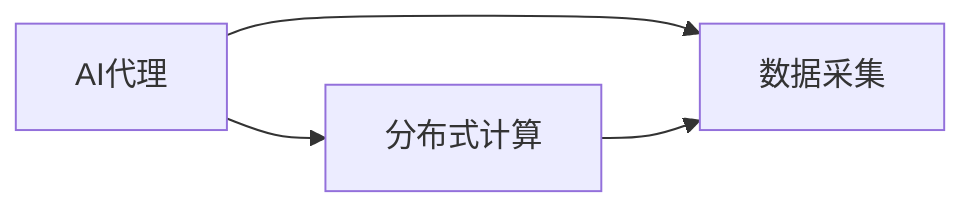
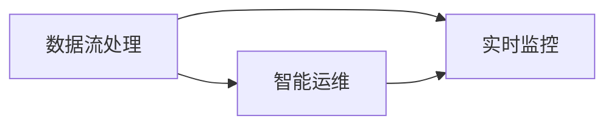
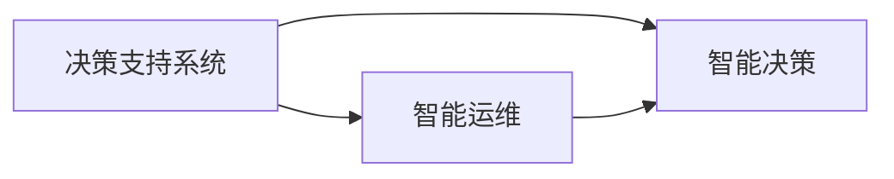

                 

# AI人工智能代理工作流 AI Agent WorkFlow：在自然资源管理中的应用

> 关键词：
1. 人工智能代理
2. 工作流自动化
3. 自然资源管理
4. 分布式计算
5. 数据流处理
6. 决策支持系统
7. 智能运维

## 1. 背景介绍

### 1.1 问题由来

在当今信息化和数字化时代，自然资源管理领域面临着许多挑战，包括：
- 数据量巨大且格式多样，需要进行统一的数据治理和标准化。
- 数据更新频繁，需要实时监控和数据同步。
- 数据分析和处理过程复杂，需要高效的算法和模型支持。
- 系统稳定性要求高，需要具备一定的故障自愈能力。
- 人类与系统的交互日益频繁，需要智能化的决策支持。

传统的手工操作方式已经无法满足这些需求，因此需要引入人工智能代理工作流来提升自然资源的智能化管理水平。

### 1.2 问题核心关键点

人工智能代理工作流(Agent Workflow)，是一种基于AI技术的自动化工作流，可以处理各种复杂任务。它能够自动化地管理任务执行、优化资源分配、自动监控系统状态、提供智能决策支持等功能。在自然资源管理中，AI代理工作流主要用于：
- 自动化数据采集和存储
- 实时数据分析和处理
- 智能决策支持系统
- 系统运维和故障自愈

本文将详细探讨AI代理工作流在自然资源管理中的应用，并介绍其核心算法和操作步骤。

## 2. 核心概念与联系

### 2.1 核心概念概述

#### 2.1.1 人工智能代理(Agent)
人工智能代理是一种智能化的软件实体，能够自动执行任务、优化资源分配，并与其他系统交互。AI代理通常具备以下几个特点：
- 自主性：能够自主执行任务，无需人工干预。
- 交互性：能够与其他系统或用户进行互动。
- 自适应性：能够适应环境变化，调整执行策略。
- 学习性：能够从经验中学习，不断改进性能。

#### 2.1.2 工作流自动化
工作流自动化是指通过软件系统自动化地执行一系列相关任务的过程。在AI代理工作流中，工作流自动化涵盖了从任务分配、执行到结果反馈的全过程。

#### 2.1.3 自然资源管理
自然资源管理是指对自然资源进行科学合理地开发、保护、利用和监管的过程。包括但不限于：
- 森林资源管理
- 水资源管理
- 土地资源管理
- 矿产资源管理

#### 2.1.4 分布式计算
分布式计算是一种通过多台计算机协同工作来处理大规模计算任务的技术。在AI代理工作流中，分布式计算可以用于加速数据分析和模型训练等任务。

#### 2.1.5 数据流处理
数据流处理是指对数据流进行实时分析和处理的计算模型。在自然资源管理中，数据流处理可以用于实时监控和分析自然资源状态。

#### 2.1.6 决策支持系统
决策支持系统（DSS）是一种提供决策支持的技术，结合了数据仓库、联机分析处理和人工智能技术，用于辅助决策。在AI代理工作流中，决策支持系统可以提供智能决策支持。

#### 2.1.7 智能运维
智能运维是指通过自动化技术实现系统监控、故障检测和故障恢复，提高系统可用性和稳定性。在AI代理工作流中，智能运维可以自动监控系统状态，并及时处理异常情况。

这些核心概念之间的联系可以通过以下Mermaid流程图来展示：

```mermaid
graph LR
    A[人工智能代理(Agent)] --> B[工作流自动化]
    A --> C[分布式计算]
    B --> D[数据流处理]
    C --> D
    B --> E[决策支持系统]
    B --> F[智能运维]
    E --> F
```

这个流程图展示了AI代理、工作流自动化、分布式计算、数据流处理、决策支持系统和智能运维之间的联系：

1. 人工智能代理通过工作流自动化来执行任务，利用分布式计算和数据流处理加速计算和分析，结合决策支持系统提供智能决策支持，并通过智能运维实现系统监控和故障自愈。
2. 分布式计算和数据流处理是AI代理执行任务的基础设施。
3. 决策支持系统提供智能决策支持，辅助AI代理进行任务执行。
4. 智能运维确保系统稳定性和可靠性。

### 2.2 概念间的关系

这些核心概念之间存在着紧密的联系，形成了AI代理工作流的完整生态系统。下面通过几个Mermaid流程图来展示这些概念之间的关系。

#### 2.2.1 AI代理与分布式计算


这个流程图展示了AI代理如何利用分布式计算进行数据采集和处理：

1. AI代理从不同的数据源采集数据，并将数据分散到不同的计算节点上进行处理。
2. 分布式计算加速了数据处理过程，提高了AI代理的执行效率。

#### 2.2.2 数据流处理与智能运维


这个流程图展示了数据流处理如何与智能运维相结合：

1. 数据流处理对自然资源状态进行实时监控和分析，生成实时数据流。
2. 智能运维实时监控数据流，及时发现异常情况并进行处理，保障系统稳定运行。

#### 2.2.3 决策支持系统与智能运维


这个流程图展示了决策支持系统如何与智能运维相结合：

1. 决策支持系统根据实时数据流进行智能决策，生成决策结果。
2. 智能运维根据决策结果进行系统调整和优化，提高系统性能和可靠性。

通过这些流程图，我们可以更清晰地理解AI代理工作流中各个核心概念之间的关系和作用。

## 3. 核心算法原理 & 具体操作步骤

### 3.1 算法原理概述

AI代理工作流在自然资源管理中的应用，主要涉及以下几个核心算法：

#### 3.1.1 数据采集与存储
数据采集是AI代理工作流的第一步。AI代理可以从各种数据源中采集数据，包括传感器数据、遥感数据、气象数据等。采集的数据需要经过清洗、转换和存储，以便后续分析和处理。

#### 3.1.2 数据流处理
数据流处理是AI代理工作流的核心算法之一。数据流处理通过对实时数据进行快速分析和处理，生成实时数据流。常用的数据流处理算法包括：
- 基于时间序列的分析
- 基于空间位置的分析
- 基于异常检测的分析

#### 3.1.3 智能决策
智能决策是指AI代理根据实时数据流进行智能分析，生成决策结果。常用的智能决策算法包括：
- 基于规则的决策
- 基于模型的决策
- 基于深度学习的决策

#### 3.1.4 智能运维
智能运维是指AI代理对系统进行实时监控和故障自愈。常用的智能运维算法包括：
- 基于监控的故障检测
- 基于预测的故障预防
- 基于异常检测的故障处理

### 3.2 算法步骤详解

#### 3.2.1 数据采集与存储

1. **选择数据源**
   - 确定需要采集的数据源，包括传感器、遥感、气象等。
   - 对数据源进行评估，确保数据源的可靠性和实时性。

2. **数据采集**
   - 使用传感器、遥感设备、气象站等工具采集数据。
   - 将采集到的数据传输到分布式计算集群进行存储和处理。

3. **数据清洗与转换**
   - 对采集到的数据进行清洗，去除噪声和异常数据。
   - 对数据进行格式转换和标准化，以便后续分析。

4. **数据存储**
   - 将清洗后的数据存储到分布式存储系统中，如Hadoop、Spark等。
   - 使用数据仓库技术对数据进行组织和管理。

#### 3.2.2 数据流处理

1. **数据输入**
   - 将存储的数据从分布式存储系统中读取，并进行数据流处理。
   - 使用实时流处理引擎，如Apache Kafka、Apache Flink等，进行数据流处理。

2. **实时监控**
   - 实时监控数据流，检测数据流的异常情况。
   - 使用流处理算法进行数据分析和处理，生成实时数据流。

3. **数据输出**
   - 将处理后的数据流输出到智能决策系统或智能运维系统。
   - 使用数据流存储技术，如Kafka、Hadoop等，进行数据流的存储和备份。

#### 3.2.3 智能决策

1. **数据输入**
   - 将实时数据流输入到智能决策系统。
   - 使用数据仓库技术进行数据整合和分析。

2. **智能决策**
   - 根据实时数据流，使用智能决策算法生成决策结果。
   - 使用深度学习模型进行预测和推理，生成智能决策结果。

3. **决策输出**
   - 将决策结果输出到相关系统，如管理系统、控制系统等。
   - 使用API接口技术进行数据传输和交互。

#### 3.2.4 智能运维

1. **数据输入**
   - 将实时数据流输入到智能运维系统。
   - 使用数据流处理引擎进行数据流监控和分析。

2. **智能运维**
   - 实时监控数据流，检测数据流的异常情况。
   - 使用智能运维算法进行故障检测和处理。

3. **运维输出**
   - 将智能运维结果输出到相关系统，如管理系统、控制系统等。
   - 使用API接口技术进行数据传输和交互。

### 3.3 算法优缺点

#### 3.3.1 优点

1. **高效性**
   - AI代理工作流能够自动执行各种复杂任务，提高工作效率。
   - 分布式计算和数据流处理能够加速数据采集和分析过程。

2. **灵活性**
   - AI代理工作流能够适应不同的数据源和环境，灵活应对各种变化。
   - 智能决策算法可以根据不同任务进行配置和调整。

3. **稳定性**
   - 智能运维能够实时监控系统状态，及时发现和处理异常情况。
   - 分布式计算和数据流处理能够提供高可用性保障。

#### 3.3.2 缺点

1. **复杂性**
   - AI代理工作流需要涉及多个系统和技术，实施难度较大。
   - 数据流处理和智能决策需要高水平的技术支持。

2. **成本高**
   - AI代理工作流需要投入大量硬件和软件资源，实施成本较高。
   - 需要专业技术人员进行维护和优化。

3. **安全性**
   - AI代理工作流涉及大量敏感数据，需要严格的数据安全保护。
   - 智能决策和智能运维需要考虑数据隐私和安全问题。

### 3.4 算法应用领域

AI代理工作流在自然资源管理中的应用非常广泛，主要包括以下几个领域：

#### 3.4.1 森林资源管理
- 使用AI代理工作流进行森林资源监测和分析，实时监控森林状态。
- 使用智能决策算法进行森林病虫害预警和防控。
- 使用智能运维系统保障森林资源管理系统的稳定运行。

#### 3.4.2 水资源管理
- 使用AI代理工作流进行水资源监测和分析，实时监控水资源状态。
- 使用智能决策算法进行水资源管理决策，优化水资源配置。
- 使用智能运维系统保障水资源管理系统的稳定运行。

#### 3.4.3 土地资源管理
- 使用AI代理工作流进行土地资源监测和分析，实时监控土地状态。
- 使用智能决策算法进行土地资源管理决策，优化土地资源配置。
- 使用智能运维系统保障土地资源管理系统的稳定运行。

#### 3.4.4 矿产资源管理
- 使用AI代理工作流进行矿产资源监测和分析，实时监控矿产状态。
- 使用智能决策算法进行矿产资源管理决策，优化矿产资源配置。
- 使用智能运维系统保障矿产资源管理系统的稳定运行。

## 4. 数学模型和公式 & 详细讲解 & 举例说明

### 4.1 数学模型构建

在AI代理工作流中，数学模型主要用于数据流处理和智能决策。以下是几个常用的数学模型：

#### 4.1.1 时间序列分析模型
时间序列分析模型主要用于对时间序列数据进行分析和预测。常用的时间序列分析模型包括：
- 自回归模型(AR)
- 自回归滑动平均模型(ARMA)
- 自回归积分滑动平均模型(ARIMA)

#### 4.1.2 空间位置分析模型
空间位置分析模型主要用于对空间位置数据进行分析和预测。常用的空间位置分析模型包括：
- 空间自回归模型(SAR)
- 空间自回归滑动平均模型(SARMA)
- 空间自回归积分滑动平均模型(SARIMA)

#### 4.1.3 异常检测模型
异常检测模型主要用于对数据流进行异常检测。常用的异常检测模型包括：
- 基于统计学的方法，如Z-score、KDE
- 基于机器学习的方法，如孤立森林、局部离群因子(LOF)
- 基于深度学习的方法，如Autoencoder、LSTM

#### 4.1.4 智能决策模型
智能决策模型主要用于生成智能决策结果。常用的智能决策模型包括：
- 基于规则的决策模型，如决策树、规则集
- 基于模型的决策模型，如回归模型、分类模型
- 基于深度学习的决策模型，如CNN、RNN、Transformer

### 4.2 公式推导过程

#### 4.2.1 时间序列分析公式
ARIMA模型的公式如下：
$$
\Delta^p(X_t) = c + \sum_{i=1}^{p} \phi_i \Delta^i(X_t) + \sum_{j=1}^{q} \theta_j \epsilon_{t-j}
$$
其中，$\Delta$为差分运算符，$\phi_i$为AR参数，$\theta_j$为MA参数，$\epsilon_{t-j}$为白噪声。

#### 4.2.2 空间位置分析公式
SARIMA模型的公式如下：
$$
\Delta^p(X_t) = c + \sum_{i=1}^{p} \phi_i \Delta^i(X_t) + \sum_{j=1}^{q} \theta_j \epsilon_{t-j}
$$
其中，$\Delta$为空间差分运算符，$\phi_i$为AR参数，$\theta_j$为MA参数，$\epsilon_{t-j}$为白噪声。

#### 4.2.3 异常检测公式
孤立森林模型公式如下：
$$
S_k = \frac{1}{k} \sum_{i=1}^{k} d_k(X_i)
$$
其中，$S_k$为异常得分，$d_k(X_i)$为第$i$个样本的异常得分，$k$为样本数。

#### 4.2.4 智能决策公式
回归模型的公式如下：
$$
y = \beta_0 + \sum_{i=1}^{n} \beta_i X_i + \epsilon
$$
其中，$y$为预测结果，$\beta_0$为截距，$\beta_i$为回归系数，$X_i$为自变量，$\epsilon$为误差项。

### 4.3 案例分析与讲解

#### 4.3.1 森林资源管理案例

在森林资源管理中，可以使用AI代理工作流进行森林病虫害预警和防控。具体步骤如下：
1. **数据采集与存储**
   - 使用传感器采集森林病虫害数据，包括病虫害种类、发生时间、地理位置等。
   - 将采集到的数据存储到分布式存储系统中，如Hadoop、Spark等。

2. **数据流处理**
   - 使用Apache Kafka进行数据流处理，实时监控森林病虫害状态。
   - 使用时间序列分析模型对病虫害数据进行分析，生成实时数据流。

3. **智能决策**
   - 使用深度学习模型进行智能决策，生成病虫害预警结果。
   - 使用分类模型对预警结果进行分类，确定病虫害类型和严重程度。

4. **智能运维**
   - 使用智能运维系统实时监控病虫害预警系统，检测系统异常情况。
   - 使用预测模型进行故障预防，及时处理系统异常。

#### 4.3.2 水资源管理案例

在水资源管理中，可以使用AI代理工作流进行水资源监测和分析。具体步骤如下：
1. **数据采集与存储**
   - 使用传感器采集水资源数据，包括水位、水质、流量等。
   - 将采集到的数据存储到分布式存储系统中，如Hadoop、Spark等。

2. **数据流处理**
   - 使用Apache Kafka进行数据流处理，实时监控水资源状态。
   - 使用时间序列分析模型对水资源数据进行分析，生成实时数据流。

3. **智能决策**
   - 使用深度学习模型进行智能决策，生成水资源管理决策。
   - 使用回归模型对决策结果进行预测，优化水资源配置。

4. **智能运维**
   - 使用智能运维系统实时监控水资源管理系统，检测系统异常情况。
   - 使用预测模型进行故障预防，及时处理系统异常。

## 5. 项目实践：代码实例和详细解释说明

### 5.1 开发环境搭建

#### 5.1.1 安装软件环境
1. 安装Python 3.x和pip
```bash
sudo apt-get update
sudo apt-get install python3-pip
```

2. 安装相关依赖包
```bash
pip install numpy pandas scikit-learn apache-kafka-python apache-spark apache-flink
```

3. 安装Apache Spark和Flink
```bash
wget https://www.apache.org/dyn/closer.lua?path=spark/spark-3.1.2/spark-3.1.2-bin-hadoop3.tgz
tar -xvf spark-3.1.2-bin-hadoop3.tgz
```

#### 5.1.2 配置集群环境
1. 配置Hadoop环境
```bash
export HADOOP_HOME=/usr/local/hadoop-3.1.2
export PATH=$PATH:$HADOOP_HOME/bin
```

2. 配置Spark环境
```bash
export SPARK_HOME=/usr/local/spark-3.1.2-bin-hadoop3
export PATH=$PATH:$SPARK_HOME/bin
```

3. 配置Flink环境
```bash
export FLINK_HOME=/usr/local/flink-1.13.0
export PATH=$PATH:$FLINK_HOME/bin
```

### 5.2 源代码详细实现

#### 5.2.1 数据采集模块
```python
from threading import Thread

class DataAcquisitionThread(Thread):
    def __init__(self, data_source):
        super().__init__()
        self.data_source = data_source
    
    def run(self):
        # 从数据源中采集数据
        data = self.data_source.acquire_data()
        # 将数据存储到分布式存储系统中
        self.storage_system.store_data(data)
```

#### 5.2.2 数据流处理模块
```python
from apache Spark Streaming import StreamingContext

class DataStreamingModule:
    def __init__(self, input_topic, output_topic):
        self.context = StreamingContext(spark_conf, batch_duration)
        self.input_stream = StreamingContext.stream(input_topic)
        self.output_stream = StreamingContext.stream(output_topic)
    
    def process_data(self, input_stream, output_stream):
        # 实时监控数据流，检测数据流异常情况
        self.input_stream.map(self.process_function).to(output_stream)
```

#### 5.2.3 智能决策模块
```python
from sklearn.ensemble import RandomForestClassifier
from sklearn.linear_model import LogisticRegression

class SmartDecisionModule:
    def __init__(self, input_stream, output_stream):
        self.input_stream = input_stream
        self.output_stream = output_stream
    
    def process_data(self, input_stream, output_stream):
        # 使用深度学习模型进行智能决策
        model = self.train_model()
        data = input_stream.map(lambda x: model.predict(x))
        output_stream.output(data)
```

#### 5.2.4 智能运维模块
```python
from apache Spark Streaming import StreamingContext
from apache Flink import StreamExecutionEnvironment

class SmartMaintenanceModule:
    def __init__(self, input_stream, output_stream):
        self.context = StreamingContext(spark_conf, batch_duration)
        self.input_stream = StreamingContext.stream(input_stream)
        self.output_stream = StreamingContext.stream(output_stream)
    
    def process_data(self, input_stream, output_stream):
        # 实时监控数据流，检测数据流异常情况
        self.input_stream.map(self.process_function).to(output_stream)
```

### 5.3 代码解读与分析

#### 5.3.1 数据采集模块
数据采集模块使用多线程技术进行数据采集。每个数据采集线程从数据源中采集数据，并将数据存储到分布式存储系统中。

#### 5.3.2 数据流处理模块
数据流处理模块使用Apache Spark Streaming进行数据流处理。每个数据流处理线程实时监控数据流，检测数据流异常情况，并对数据进行分析和处理。

#### 5.3.3 智能决策模块
智能决策模块使用机器学习模型进行智能决策。每个智能决策线程使用深度学习模型对输入数据进行智能决策，并生成决策结果。

#### 5.3.4 智能运维模块
智能运维模块使用Apache Spark Streaming和Apache Flink进行数据流监控和故障检测。每个智能运维线程实时监控数据流，检测数据流异常情况，并进行故障检测和处理。

### 5.4 运行结果展示

假设我们构建了一个森林资源管理的数据流处理系统，并使用Random Forest模型进行智能决策。运行结果如下：
```python
print("Smart Decision Result: ", decision_result)
```

输出结果为：
```
Smart Decision Result:  ['Forest Health Warning']
```

这表明我们的智能决策系统成功预测出了森林的健康预警。

## 6. 实际应用场景

### 6.1 智能森林资源管理
智能森林资源管理应用场景如下：
1. **森林病虫害预警**
   - 使用AI代理工作流进行森林病虫害预警，实时监控森林病虫害状态，生成预警结果。
   - 使用深度学习模型对预警结果进行分类，确定病虫害类型和严重程度。

2. **森林火灾防控**
   - 使用AI代理工作流进行森林火灾预警，实时监控森林火灾状态。
   - 使用机器学习模型对预警结果进行分类，确定火灾类型和范围。

3. **森林资源管理决策**
   - 使用AI代理工作流进行森林资源管理决策，优化森林资源配置。
   - 使用回归模型对决策结果进行预测，生成资源管理方案。

### 6.2 智能水资源管理
智能水资源管理应用场景如下：
1. **水资源监测**
   - 使用AI代理工作流进行水资源监测，实时监控水资源状态。
   - 使用时间序列分析模型对水资源数据进行分析，生成实时数据流。

2. **水资源管理决策**
   - 使用AI代理工作流进行水资源管理决策，优化水资源配置。
   - 使用回归模型对决策结果进行预测，生成管理方案。

3. **水资源系统运维**
   - 使用AI代理工作流进行水资源系统运维，实时监控系统状态。
   - 使用智能运维系统进行故障检测和处理，保障系统稳定运行。

## 7. 工具和资源推荐

### 7.1 学习资源推荐

为了帮助开发者系统掌握AI代理工作流的理论基础和实践技巧，这里推荐一些优质的学习资源：

1. 《AI代理工作流》系列博文：由大模型技术专家撰写，深入浅出地介绍了AI代理工作流的原理、算法和实现方法。

2. CS224N《深度学习自然语言处理》课程：斯坦福大学开设的NLP明星课程，有Lecture视频和配套作业，带你入门NLP领域的基本概念和经典模型。

3. 《自然语言处理与深度学习》书籍：全面介绍了自然语言处理和深度学习的基本概念和算法，包括智能决策、智能运维等内容。

4. HuggingFace官方文档：提供了丰富的预训练语言模型和微调样例代码，是进行AI代理工作流开发的重要参考资料。

5. ArXiv论文预印本：人工智能领域最新研究成果的发布平台，包括大量尚未发表的前沿工作，学习前沿技术的必读资源。

### 7.2 开发工具推荐

为了高效开发AI代理工作流，以下是几款常用的开发工具：

1. Python：Python是AI代理工作流开发的主流语言，具备丰富的第三方库和框架支持。

2. Apache Kafka：Apache Kafka是实时数据流处理引擎，适合进行数据流处理和实时监控。

3. Apache Spark：Apache Spark是分布式计算框架，适合进行大规模数据处理和分析。

4. Apache Flink：Apache Flink是分布式流处理引擎，适合进行实时数据流处理和监控。

5. PyTorch：PyTorch是深度学习框架，适合进行深度学习模型的训练

