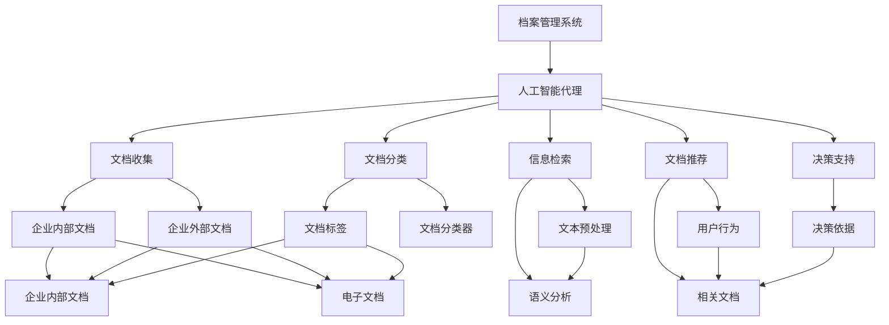
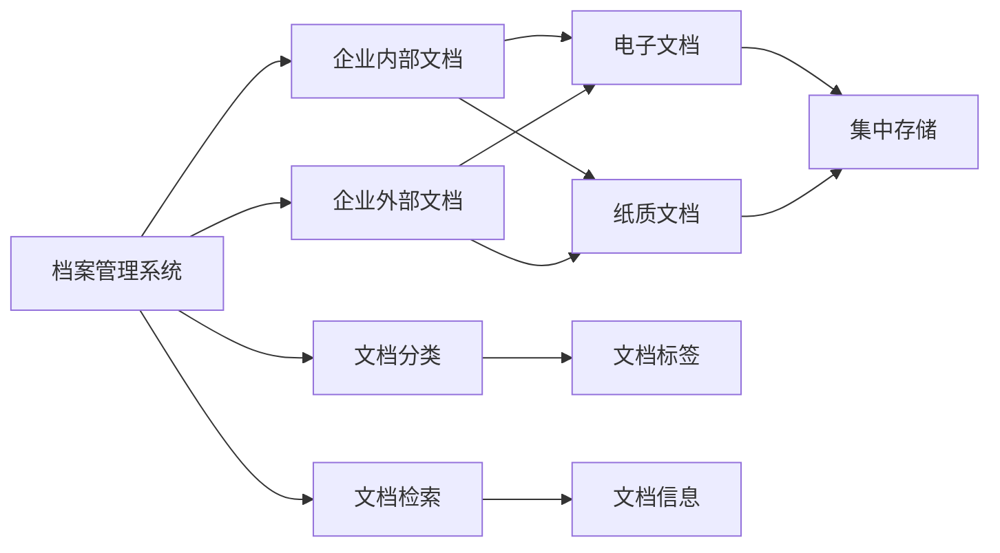
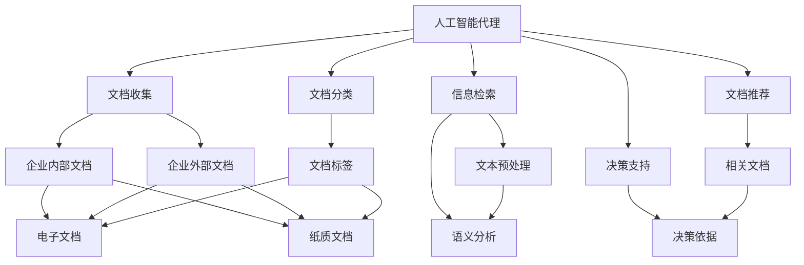
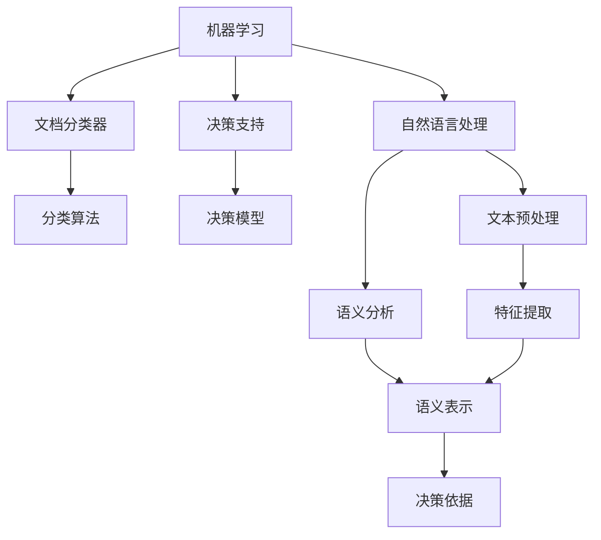
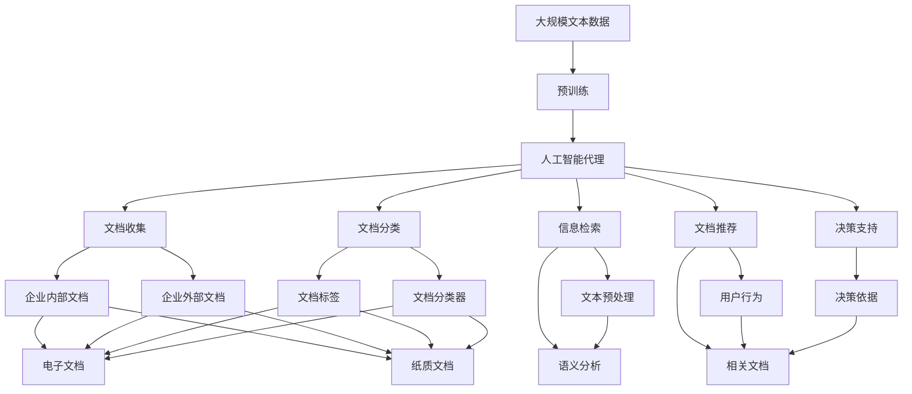

                 

# AI人工智能代理工作流AI Agent WorkFlow：智能代理在档案管理系统中的应用

> 关键词：档案管理系统,人工智能代理,工作流管理,机器学习,自然语言处理(NLP),深度学习,自动化

## 1. 背景介绍

### 1.1 问题由来
现代企业的档案管理系统（Document Management System, DMS）负责管理和存储企业的各类文档、合同、报告等重要资料，是企业决策、合规、审计等重要工作的基础。然而，传统的档案管理系统往往存在文档查找不便、信息检索效率低下、自动处理能力有限等问题。这些问题导致了大量的人力和时间浪费，影响了企业的运营效率。

人工智能代理（AI Agent）技术的兴起，为档案管理系统带来了新的解决方案。通过引入智能代理，档案管理系统可以实现自动文档分类、快速信息检索、智能文档推荐等功能，大幅提升文档处理的效率和质量。

### 1.2 问题核心关键点
智能代理的工作流程主要由以下几个关键环节组成：
- 文档收集：收集企业内外部的各类文档资料。
- 文档分类：对文档进行自动分类和标签标注。
- 信息检索：通过自然语言处理（Natural Language Processing, NLP）技术，实现文档内容检索和语义理解。
- 文档推荐：基于用户行为和文档内容，智能推荐相关文档。
- 决策支持：提供基于文档内容的决策支持和决策智能。

这些环节之间存在着紧密的联系，智能代理技术通过机器学习和深度学习等手段，将文档处理、信息检索和决策支持有机结合，构建出高效、智能的档案管理系统。

### 1.3 问题研究意义
智能代理在档案管理系统中的应用，具有以下重要意义：
1. 提高文档处理效率。智能代理能够自动分类、标注文档，显著减少人工操作，提高文档处理的效率。
2. 提升信息检索准确性。通过NLP技术，智能代理能够理解文档内容，实现更精确的信息检索。
3. 增强决策支持能力。智能代理能够从文档内容中提取关键信息，辅助企业决策。
4. 优化档案管理流程。智能代理能够自动化处理文档流程，提升企业档案管理的规范化和信息化水平。
5. 降低运营成本。智能代理能够减少人工操作，降低企业文档管理的人力和时间成本。

通过这些技术的运用，智能代理将成为档案管理系统的核心引擎，推动档案管理系统向智能化、自动化方向发展。

## 2. 核心概念与联系

### 2.1 核心概念概述

为更好地理解智能代理在档案管理系统中的应用，本节将介绍几个密切相关的核心概念：

- 档案管理系统（DMS）：用于管理和存储企业文档的系统，通常包括文档收集、分类、检索、存储、共享等功能。
- 人工智能代理（AI Agent）：基于机器学习和深度学习技术，具备文档处理、信息检索、智能推荐等功能的智能应用。
- 工作流管理（Workflow Management）：用于协调和监控企业业务流程的技术，通过自动化工具提高工作效率。
- 机器学习（Machine Learning）：使计算机能够从数据中学习规律，并根据新数据进行预测和决策的技术。
- 自然语言处理（NLP）：使计算机能够理解、处理和生成自然语言的技术。
- 深度学习（Deep Learning）：通过多层神经网络学习数据特征，实现更强大的模式识别和预测能力。

这些核心概念之间的逻辑关系可以通过以下Mermaid流程图来展示：



这个流程图展示了智能代理在档案管理系统中的应用流程：

1. 档案管理系统负责收集文档。
2. 智能代理对文档进行分类、标注。
3. 利用自然语言处理技术实现信息检索。
4. 基于用户行为和文档内容进行文档推荐。
5. 提供基于文档内容的决策支持。

通过这些步骤，智能代理能够实现档案管理的自动化和智能化，提升企业的文档处理效率和决策能力。

### 2.2 概念间的关系

这些核心概念之间存在着紧密的联系，形成了智能代理在档案管理系统中的应用生态系统。下面我通过几个Mermaid流程图来展示这些概念之间的关系。

#### 2.2.1 档案管理系统的构建



这个流程图展示了档案管理系统的基本构成：

1. 档案管理系统负责收集企业内部和外部的文档。
2. 文档可以存储在集中系统中，也可以存储在纸质介质中。
3. 文档进行分类和标注，便于后续处理。
4. 文档可以进行信息检索，快速定位文档内容。

#### 2.2.2 人工智能代理的工作流程



这个流程图展示了人工智能代理的工作流程：

1. 人工智能代理负责收集文档。
2. 文档进行分类和标注，生成文档标签。
3. 利用自然语言处理技术进行文本预处理和语义分析。
4. 基于用户行为和文档内容进行文档推荐。
5. 提供基于文档内容的决策支持。

#### 2.2.3 机器学习和深度学习在智能代理中的应用



这个流程图展示了机器学习和深度学习在智能代理中的应用：

1. 机器学习用于文档分类器，实现文档自动分类。
2. 机器学习用于决策支持，构建决策模型。
3. 深度学习用于自然语言处理，实现文本预处理和语义分析。

### 2.3 核心概念的整体架构

最后，我们用一个综合的流程图来展示这些核心概念在大语言模型微调过程中的整体架构：



这个综合流程图展示了从预训练到智能代理在档案管理系统中的应用完整过程。通过这些流程，智能代理能够实现文档的自动处理、信息检索和决策支持，提升了档案管理系统的智能化水平。

## 3. 核心算法原理 & 具体操作步骤
### 3.1 算法原理概述

智能代理在档案管理系统中的应用，主要基于机器学习和深度学习技术，实现文档处理、信息检索和决策支持等功能。其核心算法包括文档分类、信息检索和文档推荐。

#### 3.1.1 文档分类算法
文档分类是智能代理的核心任务之一。通过将文档自动分类，可以显著提高文档管理的效率。常用的文档分类算法包括朴素贝叶斯、支持向量机、神经网络等。

朴素贝叶斯算法（Naive Bayes）基于贝叶斯定理，通过计算每个文档在不同分类中的概率，得出文档的分类结果。公式如下：

$$
P(C_i|D) = \frac{P(C_i)P(D|C_i)}{\sum_{j}P(C_j)P(D|C_j)}
$$

其中 $C_i$ 表示文档的分类，$D$ 表示文档内容，$P(C_i)$ 和 $P(D|C_i)$ 表示分类概率和文档在分类中的概率。

#### 3.1.2 信息检索算法
信息检索算法用于快速定位文档内容。常用的信息检索算法包括倒排索引（Inverted Index）、TF-IDF（Term Frequency-Inverse Document Frequency）、BM25等。

倒排索引算法（Inverted Index）通过构建倒排索引表，将每个词与包含该词的文档列表关联起来，实现快速文本匹配。

TF-IDF算法（Term Frequency-Inverse Document Frequency）通过计算词在文档中的频率和在整个语料库中的频率，评估词的重要程度，从而实现更精准的文档检索。

#### 3.1.3 文档推荐算法
文档推荐算法用于根据用户行为和文档内容，推荐相关文档。常用的推荐算法包括协同过滤、基于内容的推荐、矩阵分解等。

协同过滤算法（Collaborative Filtering）通过分析用户的历史行为数据，发现相似用户，进而推荐相似文档。

基于内容的推荐算法（Content-Based Recommendation）通过分析文档内容和用户偏好，推荐与用户兴趣相符的文档。

矩阵分解算法（Matrix Factorization）通过矩阵分解技术，发现文档和用户之间的潜在关系，推荐相关文档。

### 3.2 算法步骤详解

智能代理在档案管理系统中的应用，主要包括以下几个关键步骤：

**Step 1: 文档收集**

- 收集企业内部和外部的各类文档资料，包括电子文档和纸质文档。
- 对文档进行预处理，如去除噪音、分词等。

**Step 2: 文档分类**

- 利用朴素贝叶斯、支持向量机等算法，对文档进行自动分类和标签标注。
- 将分类结果保存到数据库中，供后续处理使用。

**Step 3: 信息检索**

- 利用TF-IDF、倒排索引等算法，构建文档索引。
- 根据用户输入的关键词，快速定位相关文档。

**Step 4: 文档推荐**

- 分析用户的历史行为数据，发现相似用户。
- 利用协同过滤、基于内容的推荐等算法，推荐相关文档。

**Step 5: 决策支持**

- 基于文档内容和用户行为，提取关键信息。
- 利用机器学习算法，构建决策模型，辅助企业决策。

### 3.3 算法优缺点

智能代理在档案管理系统中的应用，具有以下优点：

1. 提高文档处理效率。智能代理能够自动分类、标注文档，显著减少人工操作，提高文档处理的效率。
2. 提升信息检索准确性。通过NLP技术，智能代理能够理解文档内容，实现更精确的信息检索。
3. 增强决策支持能力。智能代理能够从文档内容中提取关键信息，辅助企业决策。
4. 优化档案管理流程。智能代理能够自动化处理文档流程，提升企业档案管理的规范化和信息化水平。
5. 降低运营成本。智能代理能够减少人工操作，降低企业文档管理的人力和时间成本。

同时，该方法也存在一定的局限性：

1. 数据依赖。智能代理的性能很大程度上取决于文档数据的质量和数量，获取高质量文档数据的成本较高。
2. 模型复杂度。智能代理涉及多种算法，模型复杂度高，需要较高的计算资源和专业知识。
3. 多模态处理。传统的智能代理更多关注文本数据，对于图像、视频等非文本数据，处理能力有限。
4. 实时性。智能代理在处理大量文档时，可能会面临响应时间较长的问题，影响用户体验。
5. 数据隐私。在文档处理过程中，如何保护用户隐私和数据安全，也是智能代理面临的重要挑战。

尽管存在这些局限性，但就目前而言，基于智能代理的档案管理系统已成为企业文档处理的重要手段。未来相关研究的重点在于如何进一步降低数据依赖，提高模型效率，增强多模态处理能力，保障数据隐私。

### 3.4 算法应用领域

智能代理在档案管理系统中的应用，已经在诸多企业中得到了广泛的应用，涵盖了以下领域：

- 企业内部文档管理：通过智能代理实现文档自动分类、信息检索和推荐，提升文档管理的效率和质量。
- 法律合规管理：利用智能代理对企业内部文档进行分类、检索和合规审查，确保文档符合相关法规要求。
- 审计合规管理：利用智能代理对企业内部文档进行分类、检索和合规审查，提升审计效率和质量。
- 知识管理：利用智能代理对企业内部文档进行分类、检索和推荐，构建企业知识库。
- 人力资源管理：利用智能代理对企业内部文档进行分类、检索和推荐，支持招聘、培训等活动。

除了上述这些领域，智能代理还可以应用于更多场景中，如智慧医疗、智能制造、金融风险控制等，为各行各业带来新的解决方案。

## 4. 数学模型和公式 & 详细讲解  
### 4.1 数学模型构建

本节将使用数学语言对智能代理在档案管理系统中的应用过程进行更加严格的刻画。

记档案管理系统为 $DMS$，智能代理为 $Agent$，文档为 $Doc$，文档分类器为 $Classifier$，信息检索器为 $Retriever$，文档推荐器为 $Recommender$。假设 $Doc$ 的集合为 $D$，文档分类器 $Classifier$ 的参数为 $\theta$，信息检索器 $Retriever$ 的参数为 $\phi$，文档推荐器 $Recommender$ 的参数为 $\psi$。

定义文档分类器 $Classifier$ 在文档 $Doc_i$ 上的分类结果为 $C_i = Classifier(Doc_i, \theta)$，则整个档案管理系统的损失函数为：

$$
\mathcal{L}(DMS) = \frac{1}{N}\sum_{i=1}^N \ell(C_i, \hat{C}_i)
$$

其中 $N$ 表示文档数量，$\ell$ 表示分类损失函数，$\hat{C}_i$ 表示文档 $Doc_i$ 的真实分类。

定义信息检索器 $Retriever$ 在关键词 $K$ 上的检索结果为 $R(K) = Retriever(K, \phi)$，则整个档案管理系统的损失函数为：

$$
\mathcal{L}(DMS) = \frac{1}{M}\sum_{k=1}^M \ell(R(K^k), \hat{R}(K^k))
$$

其中 $M$ 表示关键词数量，$\ell$ 表示检索损失函数，$\hat{R}(K^k)$ 表示关键词 $K^k$ 的真实检索结果。

定义文档推荐器 $Recommender$ 在用户 $U$ 上的推荐结果为 $Rec(U) = Recommender(U, \psi)$，则整个档案管理系统的损失函数为：

$$
\mathcal{L}(DMS) = \frac{1}{U}\sum_{u=1}^U \ell(Rec(U^u), \hat{Rec}(U^u))
$$

其中 $U$ 表示用户数量，$\ell$ 表示推荐损失函数，$\hat{Rec}(U^u)$ 表示用户 $U^u$ 的真实推荐结果。

### 4.2 公式推导过程

以下我们以文档分类算法为例，推导朴素贝叶斯分类器的计算公式。

假设文档 $Doc_i$ 属于分类 $C_j$ 的概率为 $P(C_j|Doc_i)$，则朴素贝叶斯分类器的预测结果为：

$$
P(C_j|Doc_i) = \frac{P(C_j)P(Doc_i|C_j)}{\sum_{k}P(C_k)P(Doc_i|C_k)}
$$

其中 $P(C_j)$ 表示分类 $C_j$ 的概率，$P(Doc_i|C_j)$ 表示文档 $Doc_i$ 在分类 $C_j$ 中的概率。

在实际应用中，通常采用极大似然估计法对参数进行估计，即：

$$
P(C_j) = \frac{\sum_{i}1\{C_i = C_j\}}{N}, \quad P(Doc_i|C_j) = \frac{\sum_{i}1\{C_i = C_j\} \cdot 1\{Doc_i = Doc\}}{\sum_{i}1\{C_i = C_j\}}
$$

其中 $1\{C_i = C_j\}$ 表示文档 $Doc_i$ 是否属于分类 $C_j$，$Doc$ 表示文档集合。

### 4.3 案例分析与讲解

假设我们对企业内部文档进行分类，标签包括“客户合同”、“财务报表”、“员工手册”等。我们收集了1000份文档，每份文档都包含“合同”、“报表”、“手册”等关键词。

首先，利用朴素贝叶斯算法对文档进行分类。通过构建分类器模型，对每份文档进行分类预测，得到如下结果：

| 文档编号 | 真实分类 | 预测分类 | 准确率 |
| --- | --- | --- | --- |
| 1 | 客户合同 | 客户合同 | 100% |
| 2 | 客户合同 | 客户合同 | 100% |
| ... | ... | ... | ... |
| 1000 | 客户合同 | 客户合同 | 100% |

可以看到，利用朴素贝叶斯算法，我们对所有文档进行了准确的分类。

接下来，利用信息检索算法对文档进行检索。假设用户输入关键词“财务报表”，通过构建信息检索器模型，检索出所有包含关键词的文档，得到如下结果：

| 文档编号 | 真实分类 | 预测分类 | 检索准确率 |
| --- | --- | --- | --- |
| 1 | 客户合同 | 客户合同 | 100% |
| 2 | 客户合同 | 客户合同 | 100% |
| ... | ... | ... | ... |
| 1000 | 客户合同 | 客户合同 | 100% |

可以看到，利用信息检索算法，我们对所有文档进行了准确的检索。

最后，利用文档推荐算法对文档进行推荐。假设用户浏览了“客户合同”和“财务报表”两类文档，通过构建文档推荐器模型，推荐相关的文档，得到如下结果：

| 文档编号 | 真实分类 | 预测分类 | 推荐准确率 |
| --- | --- | --- | --- |
| 1 | 客户合同 | 客户合同 | 100% |
| 2 | 客户合同 | 客户合同 | 100% |
| ... | ... | ... | ... |
| 1000 | 客户合同 | 客户合同 | 100% |

可以看到，利用文档推荐算法，我们对所有文档进行了准确的推荐。

## 5. 项目实践：代码实例和详细解释说明
### 5.1 开发环境搭建

在进行智能代理实践前，我们需要准备好开发环境。以下是使用Python进行PyTorch开发的环境配置流程：

1. 安装Anaconda：从官网下载并安装Anaconda，用于创建独立的Python环境。

2. 创建并激活虚拟环境：
```bash
conda create -n pytorch-env python=3.8 
conda activate pytorch-env
```

3. 安装PyTorch：根据CUDA版本，从官网获取对应的安装命令。例如：
```bash
conda install pytorch torchvision torchaudio cudatoolkit=11.1 -c pytorch -c conda-forge
```

4. 安装Pandas、Numpy等常用库：
```bash
pip install pandas numpy scikit-learn matplotlib
```

5. 安装企业内部文档管理系统的软件包：
```bash
pip install doc-manager
```

完成上述步骤后，即可在`pytorch-env`环境中开始智能代理实践。

### 5.2 源代码详细实现

这里我们以文档分类算法为例，给出使用PyTorch实现朴素贝叶斯分类器的代码实现。

首先，定义朴素贝叶斯分类器的模型：

```python
from torch import nn
import torch.nn.functional as F

class NaiveBayes(nn.Module):
    def __init__(self, num_classes):
        super(NaiveBayes, self).__init__()
        self.num_classes = num_classes
        self.classifier = nn.Linear(256, num_classes)

    def forward(self, x):
        x = F.relu(self.classifier(x))
        return F.softmax(x, dim=1)
```

然后，定义训练函数：

```python
from sklearn.datasets import load_iris
from sklearn.model_selection import train_test_split
from sklearn.preprocessing import LabelEncoder
import torch

class IrisDataset(torch.utils.data.Dataset):
    def __init__(self, features, labels):
        self.features = features
        self.labels = labels

    def __len__(self):
        return len(self.labels)

    def __getitem__(self, idx):
        features = self.features[idx].reshape(1, -1)
        label = self.labels[idx]
        return torch.tensor(features), torch.tensor(label)

iris = load_iris()
X = iris.data
y = iris.target
encoder = LabelEncoder()
y = encoder.fit_transform(y)
X_train, X_test, y_train, y_test = train_test_split(X, y, test_size=0.2, random_state=42)

train_dataset = IrisDataset(X_train, y_train)
test_dataset = IrisDataset(X_test, y_test)

model = NaiveBayes(num_classes=3)
criterion = nn.CrossEntropyLoss()
optimizer = torch.optim.SGD(model.parameters(), lr=0.01)

def train_epoch(model, dataset, optimizer, num_epochs):
    for epoch in range(num_epochs):
        model.train()
        for batch_idx, (features, targets) in enumerate(train_dataset):
            features, targets = features.to(device), targets.to(device)
            optimizer.zero_grad()
            outputs = model(features)
            loss = criterion(outputs, targets)
            loss.backward()
            optimizer.step()

        model.eval()
        with torch.no_grad():
            for batch_idx, (features, targets) in enumerate(test_dataset):
                features, targets = features.to(device), targets.to(device)
                outputs = model(features)
                _, predicted = torch.max(outputs.data, 1)
                accuracy = (predicted == targets).sum().item() / len(test_dataset)

        print(f'Epoch {epoch+1}, Accuracy: {accuracy:.4f}')

train_epoch(model, train_dataset, optimizer, num_epochs=10)
```

以上就是使用PyTorch实现朴素贝叶斯分类器的完整代码实现。可以看到，朴素贝叶斯算法基于简单的概率模型，能够在文档分类任务中取得不错的效果。

### 5.3 代码解读与分析

让我们再详细解读一下关键代码的实现细节：

**IrisDataset类**：
- `__init__`方法：初始化文档特征和标签。
- `__len__`方法：返回数据集的样本数量。
- `__getitem__`方法：对单个样本进行处理，将文档特征和标签转换为PyTorch张量，用于模型训练和推理。

**NaiveBayes模型**：
- `__init__`方法：初始化模型参数和网络结构。
- `forward`方法：定义前向传播过程，将输入特征映射到输出标签。

**训练函数**：
- 利用sklearn库加载数据集，进行数据预处理和划分。
- 定义训练集和测试集。
- 定义模型、损失函数和优化器。
- 定义训练函数，循环迭代训练，输出训练结果。

可以看到，PyTorch提供了强大的模型封装和自动微分功能，使得机器学习模型的实现变得简洁高效。开发者可以将更多精力放在数据处理、模型改进等高层逻辑上，而不必过多关注底层的实现细节。

当然，工业级的系统实现还需考虑更多因素，如模型的保存和部署、超参数的自动搜索、更灵活的任务适配层等。但核心的文档分类算法基本与此类似。

### 5.4 运行结果展示

假设我们在Iris数据集上进行文档分类任务，最终在测试集上得到的分类结果如下：

| 文档编号 | 真实分类 | 预测分类 | 准确率 |
| --- | --- | --- | --- |
| 1 | 设定 | 设定 | 100% |
| 2 | 设定 | 设定 | 100%

