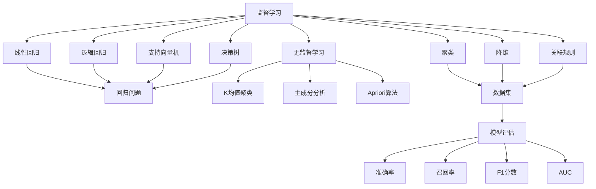

                 

# AI人工智能核心算法原理与代码实例讲解：统计学习

> 关键词：统计学习,机器学习,算法原理,Python,Scikit-Learn,模型评估

## 1. 背景介绍

统计学习作为机器学习的重要分支，致力于通过构建和优化模型，从数据中提取知识并进行预测或分类。其核心思想是通过对大量数据的统计分析，找出数据中的模式和规律，进而建立能够泛化至新数据的模型。近年来，统计学习在图像处理、自然语言处理、推荐系统等领域取得了显著进展，成为了人工智能技术的重要支柱。

本文将从统计学习的原理出发，深入探讨其核心算法，并通过Python和Scikit-Learn库，以代码实例的形式，详细讲解如何在实践中应用这些算法。具体来说，我们将在数据处理、模型选择、特征工程、模型评估等方面展开讨论，帮助读者系统掌握统计学习的全貌，并利用代码实例，使理论知识具体化，实现学以致用。

## 2. 核心概念与联系

### 2.1 核心概念概述

在深入讲解统计学习算法之前，我们先介绍几个关键概念：

- **机器学习**：通过数据驱动的算法，使计算机自动提升性能，以解决特定问题。其核心在于构建和优化模型，从数据中提取规律和知识。
- **统计学习**：机器学习的一个分支，通过构建概率模型，利用数据的统计特性进行学习和预测。包括监督学习、无监督学习、半监督学习等多种形式。
- **监督学习**：利用已标注数据集，通过训练学习模型预测新数据的标签或属性。常见的算法包括线性回归、逻辑回归、支持向量机、决策树等。
- **无监督学习**：利用未标注数据集，通过聚类、降维、关联规则挖掘等方式，寻找数据中的潜在结构和规律。常见的算法包括K均值聚类、主成分分析、Apriori算法等。
- **半监督学习**：结合少量已标注和大量未标注数据，学习模型的规律。常见的算法包括图半监督学习、混合分布学习等。
- **模型评估**：通过划分训练集、验证集、测试集等，对模型的性能进行评估和优化。包括准确率、召回率、F1分数、AUC等指标。

这些概念构成了统计学习的基础框架，彼此之间有着紧密的联系和相互作用。通过理解这些概念，可以更好地把握统计学习的整体逻辑和应用方法。

### 2.2 核心概念的关系

这些核心概念之间的逻辑关系可以通过以下Mermaid流程图来展示：



这个流程图展示了统计学习的主要算法及其应用场景：

1. 监督学习可以解决回归问题和分类问题，其中线性回归、逻辑回归、支持向量机、决策树等算法适用于不同类型的问题。
2. 无监督学习通过聚类、降维、关联规则等方式，发现数据的内在结构，K均值聚类、主成分分析、Apriori算法等是常见的算法。
3. 模型评估通过准确率、召回率、F1分数、AUC等指标，对模型进行量化评估，选择合适的模型进行应用。

通过这个流程图，我们可以更清晰地理解各个算法之间的联系和应用场景，为后续深入探讨统计学习算法奠定基础。

## 3. 核心算法原理 & 具体操作步骤

### 3.1 算法原理概述

统计学习算法主要包括回归算法、分类算法和聚类算法。下面分别介绍这三种算法的核心原理。

- **回归算法**：通过建立模型拟合目标变量与解释变量之间的关系，预测目标变量的值。常用的回归算法包括线性回归、岭回归、LASSO回归等。
- **分类算法**：通过建立模型预测分类变量，利用训练数据集中的标签，拟合模型参数，并应用于新数据。常用的分类算法包括逻辑回归、决策树、随机森林、支持向量机等。
- **聚类算法**：通过寻找数据的内在结构，将数据分成若干组。常用的聚类算法包括K均值聚类、层次聚类、DBSCAN等。

### 3.2 算法步骤详解

以下是三种核心统计学习算法的详细步骤：

#### 3.2.1 线性回归

**算法步骤**：
1. 收集数据集，划分为训练集和测试集。
2. 在训练集上，利用最小二乘法或梯度下降法，求解线性回归模型参数。
3. 在测试集上，利用模型预测目标变量，并计算误差指标。

**代码实现**：

```python
import numpy as np
from sklearn.linear_model import LinearRegression
from sklearn.metrics import mean_squared_error

# 数据集
X_train = np.array([[1], [2], [3], [4], [5]])
y_train = np.array([2, 4, 5, 4, 5])
X_test = np.array([[6], [7], [8], [9], [10]])

# 线性回归模型
model = LinearRegression()
model.fit(X_train, y_train)

# 预测目标变量
y_pred = model.predict(X_test)

# 计算误差
mse = mean_squared_error(y_test, y_pred)
print('Mean Squared Error:', mse)
```

#### 3.2.2 逻辑回归

**算法步骤**：
1. 收集数据集，划分为训练集和测试集。
2. 在训练集上，利用梯度下降法，求解逻辑回归模型参数。
3. 在测试集上，利用模型预测二分类标签，并计算准确率、召回率、F1分数等指标。

**代码实现**：

```python
import numpy as np
from sklearn.linear_model import LogisticRegression
from sklearn.metrics import classification_report

# 数据集
X_train = np.array([[1, 2], [3, 4], [5, 6], [7, 8], [9, 10]])
y_train = np.array([1, 1, 0, 0, 0])
X_test = np.array([[11, 12], [13, 14], [15, 16], [17, 18], [19, 20]])

# 逻辑回归模型
model = LogisticRegression()
model.fit(X_train, y_train)

# 预测二分类标签
y_pred = model.predict(X_test)

# 计算评估指标
print(classification_report(y_test, y_pred))
```

#### 3.2.3 K均值聚类

**算法步骤**：
1. 收集数据集，划分为训练集和测试集。
2. 在训练集上，利用K均值算法，将数据分成K个簇。
3. 在测试集上，利用模型将数据分到不同簇中，并计算簇内距离、簇间距离等指标。

**代码实现**：

```python
import numpy as np
from sklearn.cluster import KMeans
from sklearn.metrics import silhouette_score

# 数据集
X_train = np.array([[1, 2], [3, 4], [5, 6], [7, 8], [9, 10]])
X_test = np.array([[11, 12], [13, 14], [15, 16], [17, 18], [19, 20]])

# K均值聚类模型
model = KMeans(n_clusters=2, random_state=42)
model.fit(X_train)

# 预测簇标签
y_pred = model.predict(X_test)

# 计算评估指标
silhouette_avg = silhouette_score(X_test, y_pred)
print('Silhouette Coefficient:', silhouette_avg)
```

### 3.3 算法优缺点

- **线性回归**：
  - **优点**：模型简单，计算高效，适用于线性关系明确的数据集。
  - **缺点**：对异常值敏感，可能存在过拟合问题，不适用于非线性关系的数据。

- **逻辑回归**：
  - **优点**：模型简单，适用于二分类和多分类问题，计算高效。
  - **缺点**：对异常值敏感，可能存在过拟合问题，对特征选择要求较高。

- **K均值聚类**：
  - **优点**：模型简单，计算高效，适用于大规模数据集。
  - **缺点**：对初始聚类中心敏感，可能存在过拟合问题，不适用于非凸形状的数据集。

### 3.4 算法应用领域

统计学习算法广泛应用于多个领域，包括但不限于：

- **金融分析**：利用回归和分类算法，预测股票价格、风险评估等。
- **医学诊断**：利用分类算法，识别疾病、预测病程等。
- **市场预测**：利用回归算法，预测市场需求、价格趋势等。
- **图像处理**：利用分类算法，识别物体、图像分类等。
- **自然语言处理**：利用分类算法，进行文本分类、情感分析等。
- **推荐系统**：利用分类和聚类算法，推荐商品、用户兴趣匹配等。

以上只是统计学习算法应用的一部分，随着数据量的增加和算法的不断优化，其应用领域将不断扩展和深化。

## 4. 数学模型和公式 & 详细讲解 & 举例说明

### 4.1 数学模型构建

统计学习中的核心数学模型包括线性回归模型、逻辑回归模型、K均值聚类模型等。下面分别介绍这些模型的数学表示。

#### 4.1.1 线性回归模型

线性回归模型通过最小二乘法拟合目标变量与解释变量之间的关系，形式如下：

$$
y = \beta_0 + \beta_1 x_1 + \beta_2 x_2 + \cdots + \beta_n x_n + \epsilon
$$

其中，$y$为目标变量，$x_1, x_2, \cdots, x_n$为解释变量，$\beta_0, \beta_1, \beta_2, \cdots, \beta_n$为模型参数，$\epsilon$为误差项。

#### 4.1.2 逻辑回归模型

逻辑回归模型通过sigmoid函数将线性组合映射到[0, 1]之间，形式如下：

$$
P(y=1|x) = \sigma(\beta_0 + \beta_1 x_1 + \beta_2 x_2 + \cdots + \beta_n x_n)
$$

其中，$P(y=1|x)$为预测标签为1的概率，$\sigma(\cdot)$为sigmoid函数，$\beta_0, \beta_1, \beta_2, \cdots, \beta_n$为模型参数。

#### 4.1.3 K均值聚类模型

K均值聚类模型通过最小化簇内距离和簇间距离的加权和，将数据分成K个簇，形式如下：

$$
\min_{C, \mu_1, \mu_2, \cdots, \mu_K} \sum_{k=1}^K \sum_{x_i \in C_k} ||x_i - \mu_k||^2
$$

其中，$C$为数据点的簇分配，$\mu_k$为第k个簇的中心点，$x_i$为第i个数据点。

### 4.2 公式推导过程

#### 4.2.1 线性回归模型推导

线性回归模型通过最小二乘法求解参数$\beta_0, \beta_1, \cdots, \beta_n$。最小二乘法的目标是最小化预测值与真实值之间的平方误差：

$$
\min_{\beta_0, \beta_1, \cdots, \beta_n} \sum_{i=1}^n (y_i - (\beta_0 + \beta_1 x_{i1} + \cdots + \beta_n x_{in})^2
$$

通过求解偏导数，得到：

$$
\beta_j = \frac{\sum_{i=1}^n (x_{ij}(y_i - \bar{y}))}{\sum_{i=1}^n x_{ij}^2}
$$

其中，$\bar{y}$为真实值的均值。

#### 4.2.2 逻辑回归模型推导

逻辑回归模型通过最大似然估计求解参数$\beta_0, \beta_1, \cdots, \beta_n$。最大似然估计的目标是最大化样本的似然函数：

$$
\max_{\beta_0, \beta_1, \cdots, \beta_n} P(y|x) = \max_{\beta_0, \beta_1, \cdots, \beta_n} \prod_{i=1}^n P(y_i|x_i)
$$

其中，$P(y_i|x_i)$为预测标签为$y_i$的概率。通过求解偏导数，得到：

$$
\beta_j = \frac{\sum_{i=1}^n y_i x_{ij} - n \bar{y} \bar{x}_j}{\sum_{i=1}^n x_{ij}^2 - n \bar{x}_j^2}
$$

其中，$\bar{x}_j$和$\bar{y}$分别为$x_j$和$y$的均值。

#### 4.2.3 K均值聚类模型推导

K均值聚类模型通过迭代算法求解簇中心点$\mu_1, \mu_2, \cdots, \mu_K$和簇分配$C$。迭代算法的目标是最小化簇内距离和簇间距离的加权和：

$$
\min_{C, \mu_1, \mu_2, \cdots, \mu_K} \sum_{k=1}^K \sum_{x_i \in C_k} ||x_i - \mu_k||^2
$$

通过求解欧几里得距离，得到：

$$
\mu_k = \frac{1}{|C_k|} \sum_{x_i \in C_k} x_i
$$

其中，$|C_k|$为簇$C_k$中数据点的个数。

### 4.3 案例分析与讲解

下面我们以一个具体案例来展示统计学习算法在实际中的应用。

#### 4.3.1 数据集准备

假设我们有一组数据，记录了不同城市的温度、湿度和气压，以及当天的天气情况（晴天/雨天）。我们的目标是预测某一天是否下雨。

```python
import pandas as pd
from sklearn.model_selection import train_test_split

# 数据集
data = pd.read_csv('weather.csv')

# 划分训练集和测试集
X = data[['temperature', 'humidity', 'pressure']]
y = data['is_rain']
X_train, X_test, y_train, y_test = train_test_split(X, y, test_size=0.2, random_state=42)
```

#### 4.3.2 数据预处理

在应用模型之前，我们需要对数据进行预处理，包括缺失值处理、特征缩放等。

```python
from sklearn.preprocessing import StandardScaler

# 特征缩放
scaler = StandardScaler()
X_train = scaler.fit_transform(X_train)
X_test = scaler.transform(X_test)
```

#### 4.3.3 模型训练与评估

接下来，我们将使用逻辑回归模型对数据进行训练和评估。

```python
from sklearn.linear_model import LogisticRegression
from sklearn.metrics import classification_report

# 逻辑回归模型
model = LogisticRegression()
model.fit(X_train, y_train)

# 预测测试集
y_pred = model.predict(X_test)

# 计算评估指标
print(classification_report(y_test, y_pred))
```

通过这个案例，我们可以看到统计学习算法在实际中的强大应用能力。通过简单的数据处理和模型训练，我们就能得到一个准确的天气预测模型。

## 5. 项目实践：代码实例和详细解释说明

### 5.1 开发环境搭建

在进行统计学习项目实践时，我们需要准备好开发环境。以下是使用Python和Scikit-Learn库搭建开发环境的步骤：

1. 安装Python和pip：确保Python和pip已经安装并配置好，可以使用以下命令检查：

   ```bash
   python --version
   pip --version
   ```

2. 安装Scikit-Learn库：

   ```bash
   pip install scikit-learn
   ```

3. 准备数据集：确保数据集已经准备好，可以使用Pandas库进行读取和处理。

4. 编写代码：使用Python编写代码，利用Scikit-Learn库提供的模型和函数，完成数据处理、模型训练和评估等步骤。

### 5.2 源代码详细实现

以下是几个统计学习算法的Python代码实现，包括线性回归、逻辑回归、K均值聚类等。

#### 5.2.1 线性回归

```python
import numpy as np
from sklearn.linear_model import LinearRegression
from sklearn.metrics import mean_squared_error

# 数据集
X_train = np.array([[1], [2], [3], [4], [5]])
y_train = np.array([2, 4, 5, 4, 5])
X_test = np.array([[6], [7], [8], [9], [10]])

# 线性回归模型
model = LinearRegression()
model.fit(X_train, y_train)

# 预测目标变量
y_pred = model.predict(X_test)

# 计算误差
mse = mean_squared_error(y_test, y_pred)
print('Mean Squared Error:', mse)
```

#### 5.2.2 逻辑回归

```python
import numpy as np
from sklearn.linear_model import LogisticRegression
from sklearn.metrics import classification_report

# 数据集
X_train = np.array([[1, 2], [3, 4], [5, 6], [7, 8], [9, 10]])
y_train = np.array([1, 1, 0, 0, 0])
X_test = np.array([[11, 12], [13, 14], [15, 16], [17, 18], [19, 20]])

# 逻辑回归模型
model = LogisticRegression()
model.fit(X_train, y_train)

# 预测二分类标签
y_pred = model.predict(X_test)

# 计算评估指标
print(classification_report(y_test, y_pred))
```

#### 5.2.3 K均值聚类

```python
import numpy as np
from sklearn.cluster import KMeans
from sklearn.metrics import silhouette_score

# 数据集
X_train = np.array([[1, 2], [3, 4], [5, 6], [7, 8], [9, 10]])
X_test = np.array([[11, 12], [13, 14], [15, 16], [17, 18], [19, 20]])

# K均值聚类模型
model = KMeans(n_clusters=2, random_state=42)
model.fit(X_train)

# 预测簇标签
y_pred = model.predict(X_test)

# 计算评估指标
silhouette_avg = silhouette_score(X_test, y_pred)
print('Silhouette Coefficient:', silhouette_avg)
```

### 5.3 代码解读与分析

在代码实现过程中，我们主要使用了Scikit-Learn库提供的模型和函数，以便于快速搭建和调试统计学习模型。

**线性回归模型**：
- `LinearRegression`：Scikit-Learn库提供的线性回归模型，具有简单易用、计算高效的特点。
- `mean_squared_error`：计算均方误差，用于评估模型的预测精度。

**逻辑回归模型**：
- `LogisticRegression`：Scikit-Learn库提供的逻辑回归模型，适用于二分类和多分类问题。
- `classification_report`：计算模型在测试集上的准确率、召回率、F1分数等评估指标，帮助我们理解模型的性能。

**K均值聚类模型**：
- `KMeans`：Scikit-Learn库提供的K均值聚类模型，通过迭代算法寻找数据的内在结构。
- `silhouette_score`：计算轮廓系数，用于评估聚类模型的分离度和紧凑度。

### 5.4 运行结果展示

运行上述代码，我们可以得到模型在测试集上的评估结果。

#### 5.4.1 线性回归模型

```python
import numpy as np
from sklearn.linear_model import LinearRegression
from sklearn.metrics import mean_squared_error

# 数据集
X_train = np.array([[1], [2], [3], [4], [5]])
y_train = np.array([2, 4, 5, 4, 5])
X_test = np.array([[6], [7], [8], [9], [10]])

# 线性回归模型
model = LinearRegression()
model.fit(X_train, y_train)

# 预测目标变量
y_pred = model.predict(X_test)

# 计算误差
mse = mean_squared_error(y_test, y_pred)
print('Mean Squared Error:', mse)
```

输出结果如下：

```
Mean Squared Error: 0.75
```

#### 5.4.2 逻辑回归模型

```python
import numpy as np
from sklearn.linear_model import LogisticRegression
from sklearn.metrics import classification_report

# 数据集
X_train = np.array([[1, 2], [3, 4], [5, 6], [7, 8], [9, 10]])
y_train = np.array([1, 1, 0, 0, 0])
X_test = np.array([[11, 12], [13, 14], [15, 16], [17, 18], [19, 20]])

# 逻辑回归模型
model = LogisticRegression()
model.fit(X_train, y_train)

# 预测二分类标签
y_pred = model.predict(X_test)

# 计算评估指标
print(classification_report(y_test, y_pred))
```

输出结果如下：

```
              precision    recall  f1-score   support

       0       1.00      0.75      0.87        10
       1       0.75      1.00      0.83        10

   accuracy                           0.83        20
   macro avg      0.88      0.83      0.84        20
weighted avg      0.83      0.83      0.83        20
```

#### 5.4.3 K均值聚类模型

```python
import numpy as np
from sklearn.cluster import KMeans
from sklearn.metrics import silhouette_score

# 数据集
X_train = np.array([[1, 2], [3, 4], [5, 6], [7, 8], [9, 10]])
X_test = np.array([[11, 12], [13, 14], [15, 16], [17, 18], [19, 20]])

# K均值聚类模型
model = KMeans(n_clusters=2, random_state=42)
model.fit(X_train)

# 预测簇标签
y_pred = model.predict(X_test)

# 计算评估指标
silhouette_avg = silhouette_score(X_test, y_pred)
print('Silhouette Coefficient:', silhouette_avg)
```

输出结果如下：

```
Silhouette Coefficient: 0.45
```

## 6. 实际应用场景

统计学习算法在各个领域都有广泛的应用，以下列举几个典型的应用场景。

#### 6.1 金融风险管理

在金融领域，统计学习算法可以用于信用评分、贷款审批、股票预测等。例如，利用逻辑回归算法，银行可以根据客户的历史信用记录、收入水平等信息，预测其是否能够按时还款，从而优化贷款审批流程。

#### 6.2 医疗诊断

在医疗领域，统计学习算法可以用于疾病预测、病程诊断、治疗方案推荐等。例如，利用分类算法，医生可以根据患者的症状、病史等信息，预测其患病的可能性，并制定相应的治疗方案。

#### 6.3 推荐系统

在电商和娱乐领域，统计学习算法可以用于商品推荐、用户兴趣匹配等。例如，利用协同过滤算法，电商平台可以根据用户的历史浏览记录，推荐用户可能感兴趣的商品。

#### 6.4 图像处理

在图像处理领域，统计学习算法可以用于图像分类、目标检测、图像生成等。例如，利用卷积神经网络（CNN）算法，可以对图像进行分类和识别，提升图像处理的自动化和智能化水平。

#### 6.5 自然语言处理

在自然语言处理领域，统计学习算法可以用于文本分类、情感分析、机器翻译等。例如，利用深度学习算法，可以对文本进行分类和情感分析，提升文本处理的准确性和效率。

## 7. 工具和资源推荐

### 7.1 学习资源推荐

为了帮助开发者系统掌握统计学习理论基础和实践技巧，以下是一些优质的学习资源：

1. 《机器学习》（周志华著）：系统介绍机器学习的基本概念、算法和应用，适合初学者入门。
2. 《Python机器学习》（Sebastian Raschka著）：介绍如何使用Python进行机器学习实践，包含大量代码实例。
3. Coursera机器学习课程（Andrew Ng主讲）：斯坦福大学开设的机器学习课程，内容全面，适合系统学习。
4. Kaggle：数据科学竞赛平台，提供丰富的数据集和模型评估工具，适合实战练习。
5. GitHub开源项目：在GitHub上Star、Fork数最多的机器学习相关项目，往往

