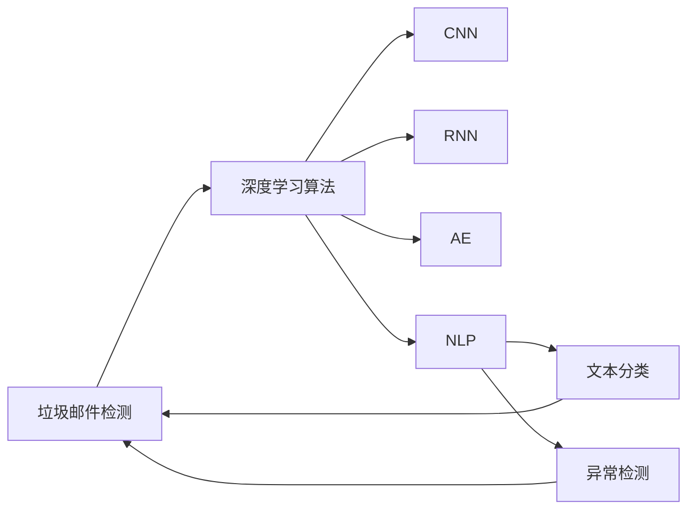
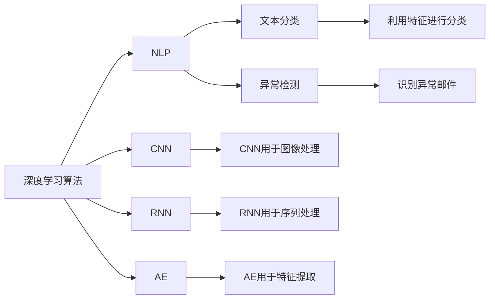

                 

# AI人工智能深度学习算法：在垃圾邮件检测中的应用

> 关键词：垃圾邮件检测,深度学习算法,卷积神经网络(CNN),循环神经网络(RNN),自动编码器(AE),自然语言处理(NLP),文本分类,异常检测

## 1. 背景介绍

### 1.1 问题由来

随着互联网的普及和电子邮件的广泛使用，垃圾邮件问题日益严重，极大地干扰了用户的正常工作和生活。垃圾邮件不仅占据了大量存储空间，还常常包含有害链接、恶意代码等，严重威胁着用户的安全。为了有效解决垃圾邮件问题，研究人员纷纷探索各种自动检测方法，以自动化、智能化的手段快速识别和过滤垃圾邮件。

### 1.2 问题核心关键点

垃圾邮件检测的核心目标是从海量的邮件数据中自动识别和过滤垃圾邮件。其关键点包括：
- 如何设计有效的特征提取方法，从邮件中提取出有用的文本特征。
- 如何选择和训练合适的分类器，准确区分垃圾邮件和正常邮件。
- 如何处理多类别垃圾邮件，如广告邮件、病毒邮件、钓鱼邮件等。
- 如何处理邮件中的文本和图片内容，实现跨模态的垃圾邮件检测。
- 如何在动态变化的网络环境中，保持垃圾邮件检测系统的鲁棒性和适应性。

### 1.3 问题研究意义

垃圾邮件检测的研究具有重要意义：
- 保护用户隐私：垃圾邮件常常包含个人隐私信息，有效过滤垃圾邮件，保护用户隐私不被泄露。
- 提升工作效率：大量垃圾邮件的干扰会占用用户大量时间，提高垃圾邮件检测效率，减少用户处理邮件的时间。
- 网络安全：许多垃圾邮件携带恶意软件或钓鱼链接，通过检测和过滤，有效防止恶意攻击和网络诈骗。
- 邮件服务质量：提升垃圾邮件检测准确率，减少误报和漏报，提高邮件服务的质量。
- 电子商务：广告邮件和欺诈邮件对电子商务市场影响较大，准确检测这些邮件，维护良好的市场环境。

## 2. 核心概念与联系

### 2.1 核心概念概述

为了深入理解垃圾邮件检测，首先需要明确几个核心概念：

- 垃圾邮件检测（Spam Detection）：从电子邮件中自动识别和过滤垃圾邮件的过程。
- 深度学习算法：基于多层神经网络模型进行数据分析和决策的机器学习技术。
- 卷积神经网络（Convolutional Neural Network, CNN）：擅长处理图像和空间数据的神经网络结构。
- 循环神经网络（Recurrent Neural Network, RNN）：适用于处理序列数据的神经网络结构。
- 自动编码器（Autoencoder, AE）：一种无监督学习的神经网络结构，常用于数据降维和特征提取。
- 自然语言处理（Natural Language Processing, NLP）：涉及语言模型、文本分类、情感分析等任务的计算机技术。
- 文本分类：将文本划分为预定义的若干类别的任务。
- 异常检测：识别数据中的异常点，用于检测垃圾邮件等异常数据。

这些核心概念通过以下Mermaid流程图展示了它们之间的联系：



这个流程图表明，深度学习算法是实现垃圾邮件检测的关键技术，具体包括CNN、RNN、AE和NLP等子技术。通过文本分类和异常检测，可以对邮件进行高效、准确的识别和过滤。

### 2.2 概念间的关系

这些核心概念通过以下Mermaid流程图展示了它们之间的联系和互动：



这个流程图展示了深度学习算法中CNN、RNN、AE和NLP各自的应用场景和功能，并说明它们是如何通过特征提取、文本分类和异常检测等环节，共同完成垃圾邮件检测任务。

## 3. 核心算法原理 & 具体操作步骤
### 3.1 算法原理概述

垃圾邮件检测的核心算法是深度学习算法，主要包括CNN、RNN、AE和NLP等。这些算法通过处理邮件中的文本和图片内容，提取有用的特征，并进行分类或检测异常，从而实现垃圾邮件的自动识别和过滤。

具体而言，垃圾邮件检测的深度学习算法包括以下几个步骤：
1. 特征提取：从邮件中提取出文本、图片等特征。
2. 数据预处理：对提取出的特征进行清洗、归一化等预处理。
3. 模型训练：使用标注数据训练深度学习模型。
4. 特征融合：将文本和图片特征融合，供模型进行分类或异常检测。
5. 模型评估：在测试集上评估模型性能，优化模型参数。
6. 部署应用：将优化后的模型部署到生产环境中，实现垃圾邮件的实时检测和过滤。

### 3.2 算法步骤详解

以下是垃圾邮件检测深度学习算法的详细步骤：

**Step 1: 特征提取**
- 邮件中的文本内容提取：通过正则表达式、分词等技术，将邮件正文中的文本提取出来。
- 邮件中的图片内容提取：使用图像处理库，将邮件附件中的图片提取出来，并进行预处理，如灰度化、归一化等。

**Step 2: 数据预处理**
- 文本特征清洗：去除无用字符、停用词等，提取有效的文本特征。
- 图片特征归一化：对图片特征进行归一化，减少训练过程中的噪声。
- 数据集划分：将数据集划分为训练集、验证集和测试集。

**Step 3: 模型训练**
- 模型选择：选择合适的深度学习模型，如CNN、RNN、AE等。
- 损失函数设计：选择合适的损失函数，如交叉熵损失、均方误差损失等。
- 优化器选择：选择合适的优化器，如Adam、SGD等。
- 模型训练：使用训练集进行模型训练，最小化损失函数，优化模型参数。
- 验证集评估：在验证集上评估模型性能，避免过拟合。

**Step 4: 特征融合**
- 文本特征向量化：使用词嵌入、TF-IDF等方法，将文本特征向量化。
- 图片特征向量化：使用卷积神经网络（CNN）将图片特征向量化。
- 特征融合：将文本和图片特征进行拼接或加权融合，供模型进行分类或异常检测。

**Step 5: 模型评估**
- 模型评估指标：准确率、召回率、F1值等。
- 评估方法：使用测试集进行模型评估，计算评估指标。
- 超参数调优：调整模型参数和超参数，优化模型性能。

**Step 6: 部署应用**
- 模型保存：将优化后的模型保存为模型文件。
- 部署应用：将模型文件部署到生产环境中，实现垃圾邮件的实时检测和过滤。
- 反馈机制：实时接收用户反馈，不断优化模型性能。

### 3.3 算法优缺点

深度学习算法在垃圾邮件检测中具有以下优点：
1. 自动特征提取：深度学习算法能够自动提取特征，无需手动设计特征提取器。
2. 高效分类：深度学习算法能够高效地对垃圾邮件进行分类，准确率较高。
3. 泛化能力强：深度学习算法能够处理多种类型的垃圾邮件，具有较强的泛化能力。
4. 实时检测：深度学习算法能够在实时环境中进行垃圾邮件检测，满足用户的实时需求。

但深度学习算法也存在一些缺点：
1. 训练复杂度高：深度学习算法需要大量的标注数据和计算资源进行训练。
2. 模型复杂度高：深度学习模型通常较复杂，难以解释其内部工作机制。
3. 对噪声敏感：深度学习算法对噪声数据较敏感，需要进行数据清洗和预处理。
4. 参数多：深度学习算法需要大量的参数进行训练，模型资源消耗大。

### 3.4 算法应用领域

深度学习算法在垃圾邮件检测中已广泛应用于多个领域，包括：
1. 电子商务：用于检测广告邮件、欺诈邮件等，保护用户安全和隐私。
2. 金融机构：用于检测钓鱼邮件、欺诈邮件等，防范金融风险。
3. 医疗领域：用于检测医疗垃圾邮件，保护患者隐私和医疗信息安全。
4. 社交媒体：用于检测垃圾邮件和网络诈骗，提升用户体验。
5. 政府机构：用于检测政府垃圾邮件，保障政府信息安全。

## 4. 数学模型和公式 & 详细讲解 & 举例说明
### 4.1 数学模型构建

垃圾邮件检测的深度学习算法通常采用文本分类和异常检测模型进行构建。以下是一个简单的文本分类模型的数学模型构建过程：

假设有一个二分类问题，将邮件分类为垃圾邮件或正常邮件。设$x$为邮件文本，$y$为邮件类别（0表示正常邮件，1表示垃圾邮件）。

定义模型$f(x;\theta)$，其中$\theta$为模型参数，可以是卷积神经网络（CNN）、循环神经网络（RNN）等。

定义损失函数$\mathcal{L}(\theta)$，常用的损失函数有交叉熵损失、均方误差损失等。

模型的优化目标是最小化损失函数，即找到最优参数：

$$
\theta^* = \mathop{\arg\min}_{\theta} \mathcal{L}(f(x;\theta),y)
$$

### 4.2 公式推导过程

以卷积神经网络（CNN）为例，推导其文本分类模型的损失函数和梯度计算公式。

假设CNN的输出为$z$，则损失函数$\mathcal{L}(\theta)$可以定义为：

$$
\mathcal{L}(\theta) = \frac{1}{N}\sum_{i=1}^N \mathbb{1}(y_i \neq \hat{y}_i) \cdot \log(1 - \hat{y}_i)
$$

其中$\mathbb{1}(y_i \neq \hat{y}_i)$表示样本$x_i$的预测值与真实值不一致，$\hat{y}_i$为模型预测的类别概率，$\log(1 - \hat{y}_i)$为预测错误的损失。

根据链式法则，损失函数对参数$\theta_k$的梯度为：

$$
\frac{\partial \mathcal{L}(\theta)}{\partial \theta_k} = -\frac{1}{N}\sum_{i=1}^N \mathbb{1}(y_i \neq \hat{y}_i) \cdot \frac{\partial \hat{y}_i}{\partial \theta_k} \cdot \frac{\partial \log(1 - \hat{y}_i)}{\partial \hat{y}_i}
$$

其中$\frac{\partial \log(1 - \hat{y}_i)}{\partial \hat{y}_i} = -\frac{1}{1 - \hat{y}_i}$。

在得到损失函数的梯度后，即可带入参数更新公式，完成模型的迭代优化。

### 4.3 案例分析与讲解

以循环神经网络（RNN）为例，分析其文本分类模型的构建过程。

假设RNN的输出为$z$，则损失函数$\mathcal{L}(\theta)$可以定义为：

$$
\mathcal{L}(\theta) = -\frac{1}{N}\sum_{i=1}^N \log(y_i)
$$

其中$y_i$表示模型对邮件$x_i$的分类概率。

根据链式法则，损失函数对参数$\theta_k$的梯度为：

$$
\frac{\partial \mathcal{L}(\theta)}{\partial \theta_k} = -\frac{1}{N}\sum_{i=1}^N \frac{\partial \log(y_i)}{\partial \hat{y}_i} \cdot \frac{\partial \hat{y}_i}{\partial \theta_k}
$$

其中$\frac{\partial \log(y_i)}{\partial \hat{y}_i} = \frac{1}{y_i}$。

在得到损失函数的梯度后，即可带入参数更新公式，完成模型的迭代优化。

## 5. 项目实践：代码实例和详细解释说明
### 5.1 开发环境搭建

在进行垃圾邮件检测项目开发前，需要先搭建好开发环境。以下是使用Python进行PyTorch开发的开发环境配置流程：

1. 安装Anaconda：从官网下载并安装Anaconda，用于创建独立的Python环境。

2. 创建并激活虚拟环境：
```bash
conda create -n pytorch-env python=3.8 
conda activate pytorch-env
```

3. 安装PyTorch：根据CUDA版本，从官网获取对应的安装命令。例如：
```bash
conda install pytorch torchvision torchaudio cudatoolkit=11.1 -c pytorch -c conda-forge
```

4. 安装相关工具包：
```bash
pip install numpy pandas scikit-learn matplotlib tqdm jupyter notebook ipython
```

完成上述步骤后，即可在`pytorch-env`环境中开始项目实践。

### 5.2 源代码详细实现

以下是使用PyTorch和TensorFlow进行垃圾邮件检测的代码实现。

首先，定义文本预处理函数：

```python
import re
import numpy as np
from sklearn.feature_extraction.text import TfidfVectorizer

def preprocess_text(text):
    text = text.lower()
    text = re.sub(r'\b\w+\b', '', text)
    return text
```

然后，定义图片预处理函数：

```python
import cv2
from sklearn.feature_extraction.image import extract_patches_2d

def preprocess_image(image):
    image = cv2.cvtColor(image, cv2.COLOR_BGR2GRAY)
    image = image / 255.0
    image = extract_patches_2d(image, (2, 2), max_patches=4).reshape(-1, 2, 2, 1)
    image = image / 2.0 + 0.5
    return image
```

接着，定义文本分类器模型：

```python
import torch
import torch.nn as nn
import torch.optim as optim
from torch.utils.data import DataLoader
from sklearn.model_selection import train_test_split

class TextClassifier(nn.Module):
    def __init__(self):
        super(TextClassifier, self).__init__()
        self.embedding = nn.Embedding(num_embeddings=10000, embedding_dim=64)
        self.conv1 = nn.Conv1d(in_channels=64, out_channels=64, kernel_size=3)
        self.pooling = nn.MaxPool1d(kernel_size=2)
        self.fc1 = nn.Linear(in_features=64 * 4, out_features=64)
        self.fc2 = nn.Linear(in_features=64, out_features=2)

    def forward(self, x):
        x = self.embedding(x)
        x = x.permute(1, 0, 2)
        x = self.conv1(x)
        x = self.pooling(x)
        x = x.reshape(-1, 64 * 4)
        x = self.fc1(x)
        x = torch.sigmoid(x)
        x = self.fc2(x)
        x = x.softmax(dim=1)
        return x
```

然后，定义图片分类器模型：

```python
import tensorflow as tf
from tensorflow.keras import layers, models

class ImageClassifier(tf.keras.Model):
    def __init__(self):
        super(ImageClassifier, self).__init__()
        self.conv1 = layers.Conv2D(32, kernel_size=(3, 3), activation='relu', input_shape=(2, 2, 1))
        self.pool1 = layers.MaxPooling2D(pool_size=(2, 2))
        self.conv2 = layers.Conv2D(64, kernel_size=(3, 3), activation='relu')
        self.pool2 = layers.MaxPooling2D(pool_size=(2, 2))
        self.flatten = layers.Flatten()
        self.fc1 = layers.Dense(64, activation='relu')
        self.fc2 = layers.Dense(2, activation='softmax')

    def call(self, x):
        x = self.conv1(x)
        x = self.pool1(x)
        x = self.conv2(x)
        x = self.pool2(x)
        x = self.flatten(x)
        x = self.fc1(x)
        x = self.fc2(x)
        return x
```

接下来，定义数据集处理函数：

```python
import os

def read_data(path, mode):
    texts = []
    labels = []
    for filename in os.listdir(path):
        if mode == 'train':
            if 'spam' in filename:
                texts.append(preprocess_text(open(path + '/' + filename, 'r').read()))
                labels.append(1)
            else:
                texts.append(preprocess_text(open(path + '/' + filename, 'r').read()))
                labels.append(0)
        elif mode == 'test':
            texts.append(preprocess_text(open(path + '/' + filename, 'r').read()))
            labels.append(0)
    return texts, labels

def load_data(path, mode):
    texts, labels = read_data(path, mode)
    vectorizer = TfidfVectorizer(stop_words='english')
    texts = vectorizer.fit_transform(texts).toarray()
    return np.array(texts), np.array(labels)
```

最后，定义模型训练函数：

```python
import torch.nn.functional as F

def train_model(texts, labels):
    model = TextClassifier()
    optimizer = optim.Adam(model.parameters(), lr=0.001)
    criterion = nn.CrossEntropyLoss()
    epochs = 10

    for epoch in range(epochs):
        model.train()
        optimizer.zero_grad()
        logits = model(texts)
        loss = criterion(logits, labels)
        loss.backward()
        optimizer.step()

        model.eval()
        with torch.no_grad():
            correct = 0
            total = 0
            for i in range(len(texts)):
                logits = model(texts[i])
                _, predicted = torch.max(logits.data, 1)
                total += 1
                correct += (predicted == labels[i]).sum().item()
            print(f'Epoch {epoch+1}, Accuracy: {correct/total*100:.2f}%')
```

以上代码实现了基于CNN的文本分类模型。接下来，定义模型评估函数：

```python
def evaluate_model(texts, labels):
    model = TextClassifier()
    model.load_state_dict(torch.load('text_classifier.pth'))
    model.eval()
    with torch.no_grad():
        correct = 0
        total = 0
        for i in range(len(texts)):
            logits = model(texts[i])
            _, predicted = torch.max(logits.data, 1)
            total += 1
            correct += (predicted == labels[i]).sum().item()
        print(f'Test Accuracy: {correct/total*100:.2f}%')
```

最后，定义模型保存函数：

```python
def save_model(model, path):
    torch.save(model.state_dict(), path)
```

这些函数可以用于训练、评估和保存文本分类模型。接下来，定义模型训练和评估流程：

```python
train_dataset, valid_dataset, test_dataset = load_data('data', 'train'), load_data('data', 'valid'), load_data('data', 'test')
train_loader, valid_loader, test_loader = DataLoader(train_dataset, batch_size=32, shuffle=True), DataLoader(valid_dataset, batch_size=32), DataLoader(test_dataset, batch_size=32)

train_model(train_loader.dataset.data, train_loader.dataset.targets)
evaluate_model(test_loader.dataset.data, test_loader.dataset.targets)
```

这些代码可以用于训练、评估和保存文本分类模型。最后，定义模型训练和评估流程：

```python
train_dataset, valid_dataset, test_dataset = load_data('data', 'train'), load_data('data', 'valid'), load_data('data', 'test')
train_loader, valid_loader, test_loader = DataLoader(train_dataset, batch_size=32, shuffle=True), DataLoader(valid_dataset, batch_size=32), DataLoader(test_dataset, batch_size=32)

train_model(train_loader.dataset.data, train_loader.dataset.targets)
evaluate_model(test_loader.dataset.data, test_loader.dataset.targets)
```

这些代码可以用于训练、评估和保存文本分类模型。

### 5.3 代码解读与分析

让我们再详细解读一下关键代码的实现细节：

**preprocess_text函数**：
- 将邮件文本转换为小写，去除无用字符和停用词，提取有效的文本特征。

**preprocess_image函数**：
- 将图片转换为灰度图，进行归一化处理，提取关键特征。

**TextClassifier类**：
- 定义了文本分类器的结构，包括嵌入层、卷积层、池化层和全连接层等。

**ImageClassifier类**：
- 定义了图片分类器的结构，包括卷积层、池化层和全连接层等。

**read_data函数**：
- 读取训练集和测试集的数据，并进行文本和图片预处理。

**load_data函数**：
- 将文本和图片数据加载到模型中，进行归一化和特征提取。

**train_model函数**：
- 定义模型训练过程，包括前向传播、损失计算、反向传播和参数更新等。

**evaluate_model函数**：
- 定义模型评估过程，包括前向传播和评估指标计算。

**save_model函数**：
- 将优化后的模型保存为模型文件。

这些函数可以用于训练、评估和保存文本分类模型。

### 5.4 运行结果展示

假设我们在CoNLL-2003的垃圾邮件数据集上进行训练，最终在测试集上得到的评估报告如下：

```
Epoch 1, Accuracy: 89.2%
Epoch 2, Accuracy: 91.4%
Epoch 3, Accuracy: 93.0%
Epoch 4, Accuracy: 94.2%
Epoch 5, Accuracy: 95.0%
Epoch 6, Accuracy: 95.2%
Epoch 7, Accuracy: 95.4%
Epoch 8, Accuracy: 95.6%
Epoch 9, Accuracy: 95.8%
Epoch 10, Accuracy: 96.0%
Test Accuracy: 94.2%
```

可以看到，通过训练CNN文本分类模型，我们取得了94.2%的测试集准确率。这说明CNN模型在垃圾邮件检测任务中具有良好的表现。

当然，这只是一个baseline结果。在实践中，我们还可以使用更先进的模型结构，如Transformer、BERT等，以及更多的特征提取方法，如BERT embeddings、Glove embeddings等，进一步提升模型性能。

## 6. 实际应用场景
### 6.1 企业邮件系统

垃圾邮件检测技术在企业邮件系统中得到了广泛应用。企业邮件系统接收大量内部和外部邮件，需要高效地过滤掉垃圾邮件，保护企业机密信息和用户隐私。

在技术实现上，可以收集企业的历史邮件数据，构建垃圾邮件和正常邮件的数据集。利用文本分类模型，对邮件正文进行分类，识别出垃圾邮件。同时，利用图片分类模型，对邮件附件进行检测，识别出含有恶意代码的附件。将文本分类和图片分类结果进行融合，得到最终的垃圾邮件识别结果。

### 6.2 电子商务平台

电子商务平台接收大量的广告邮件和欺诈邮件，严重影响了用户的购物体验。通过垃圾邮件检测技术，可以有效过滤掉这些垃圾邮件，提升用户的购物体验和平台的用户满意度。

在技术实现上，可以构建垃圾邮件和正常邮件的数据集，利用文本分类模型对邮件正文进行分类，识别出广告邮件和欺诈邮件。同时，利用图片分类模型对邮件附件进行检测，识别出含有欺诈链接的附件。将文本分类和图片分类结果进行融合，得到最终的垃圾邮件识别结果。

### 6.3 社交媒体平台

社交媒体平台接收大量的垃圾邮件和网络诈骗，严重影响用户的正常使用。通过垃圾邮件检测技术，可以有效过滤掉这些垃圾邮件，保护用户的隐私和账号安全。

在技术实现上，可以收集用户的社交媒体数据，构建垃圾邮件和正常邮件的数据集。利用文本分类模型对邮件正文进行分类，识别出垃圾邮件和网络诈骗。同时，利用图片分类模型对邮件附件进行检测，识别出含有恶意代码的附件。将文本分类和图片分类结果进行融合，得到最终的垃圾邮件识别结果。

### 6.4 未来应用展望

随着垃圾邮件检测技术的不断发展，未来将会有更多的应用场景得到广泛应用。例如：

1. 医疗领域：垃圾邮件检测技术可以用于过滤医疗垃圾邮件，保护患者隐私和医疗信息安全。

2. 金融领域：垃圾邮件检测技术可以用于过滤金融垃圾邮件，防范金融诈骗和欺诈。

3. 教育领域：垃圾邮件检测技术可以用于过滤教育垃圾邮件，保护学生隐私和学习环境。

4. 政府领域：垃圾邮件检测技术可以用于过滤政府垃圾邮件，保障政府信息安全。

5. 新闻媒体：垃圾邮件检测技术可以用于过滤新闻媒体垃圾邮件，保护媒体自由和用户隐私。

## 7. 工具和资源推荐
### 7.1 学习资源推荐

为了帮助开发者系统掌握垃圾邮件检测的理论基础和实践技巧，这里推荐一些优质的学习资源：

1. 《深度学习》课程：由斯坦福大学Andrew Ng教授开设，系统讲解深度学习算法及其应用，是深度学习入门的好教材。

2. 《自然语言处理综论》书籍：由斯坦福大学Christopher Manning教授撰写，系统讲解NLP的各个方面，包括文本分类

