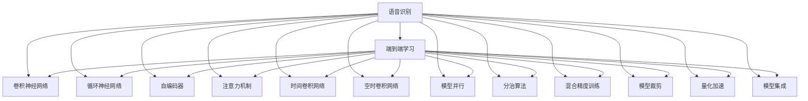
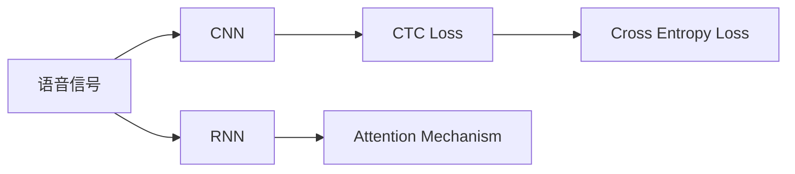
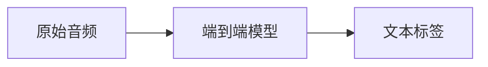
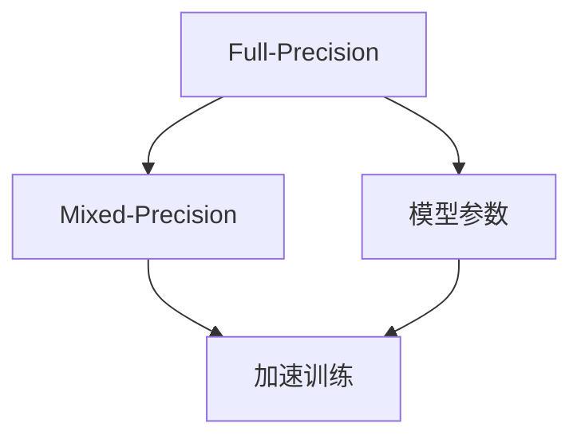

                 

# AI人工智能深度学习算法：在语音识别的应用

> 关键词：
语音识别, 深度学习, 卷积神经网络, 循环神经网络, 自动编码器, 注意力机制, 时间卷积网络, 空时卷积网络, 模型并行, 分治算法, 混合精度训练, 模型裁剪, 量化加速, 模型集成, 实时部署, 错误率, 语义准确率, 应用场景, 工业部署, 开源工具, 前沿技术, 模型优化, 数据增强

## 1. 背景介绍

### 1.1 问题由来
随着人工智能技术的迅猛发展，语音识别（Speech Recognition）成为了一个热门研究领域。传统的语音识别技术依赖于手工设计的特征提取和分类器，而现代深度学习（Deep Learning）方法则可以通过端到端学习的方式，自动从原始音频信号中提取特征并直接预测文本标签。相比于传统的语音识别系统，深度学习方法具有更强的自适应能力和泛化能力，已在多个实际应用场景中取得了显著的效果。

语音识别技术的应用非常广泛，包括但不限于语音助手（如Siri、Alexa、Google Assistant）、智能音箱（如Amazon Echo、Google Home）、语音识别输入法、实时字幕生成等。语音识别技术不仅极大地提升了用户体验，也为语音驱动的智能设备打开了新的应用场景。

### 1.2 问题核心关键点
语音识别技术的核心在于将声学信号转化为文本序列。传统方法包括手工特征提取（如MFCC）和分类器设计（如SVM、RNN等），而现代深度学习的方法则是通过构建神经网络架构，端到端地学习声学特征与文本标签之间的映射关系。语音识别任务的关键在于：

1. 选择合适的神经网络架构：常见的架构包括卷积神经网络（CNN）、循环神经网络（RNN）及其变体（如LSTM、GRU）、自编码器（Autoencoder）等。
2. 设计有效的训练目标函数：常见目标函数包括交叉熵损失、CTC（Connectionist Temporal Classification）损失等。
3. 应用适当的训练技巧：如数据增强、对抗训练、学习率调度、正则化等。

语音识别技术的研究热点主要集中在以下几个方面：

- 端到端语音识别系统的开发：如使用CTC和注意力机制的深度学习模型。
- 模型压缩与优化：如模型并行、分治算法、混合精度训练、模型裁剪和量化等。
- 数据增强与处理：如噪声注入、回声消除、语音合成等。

本文将重点介绍这些关键技术和方法，并结合具体应用场景进行详细讲解。

## 2. 核心概念与联系

### 2.1 核心概念概述

为了更好地理解语音识别技术，本节将介绍几个密切相关的核心概念：

- 语音识别（Speech Recognition）：将语音信号转换为文本序列的过程。
- 端到端（End-to-End）学习：直接从原始音频信号预测文本序列，无需手工特征提取和中间分类器。
- 卷积神经网络（Convolutional Neural Network, CNN）：一种基于卷积操作的神经网络，擅长处理时空域数据。
- 循环神经网络（Recurrent Neural Network, RNN）：一种基于循环连接的神经网络，擅长处理序列数据。
- 自编码器（Autoencoder）：一种无监督学习算法，用于特征提取和数据降维。
- 注意力机制（Attention Mechanism）：一种增强模型注意力的机制，有助于提高模型的输出准确率。
- 时间卷积网络（Temporal Convolutional Network, TCN）：一种卷积神经网络的变体，擅长处理时间序列数据。
- 空时卷积网络（Spatio-Temporal Convolutional Network, ST-CNN）：结合时空域卷积操作的神经网络，擅长处理时空域数据。
- 模型并行（Model Parallelism）：将大模型分成多个部分分别训练，利用分布式硬件资源加速训练。
- 分治算法（Divide and Conquer Algorithm）：将大问题分解成多个小问题并行求解。
- 混合精度训练（Mixed Precision Training）：使用混合精度的计算，提高模型训练速度和资源利用率。
- 模型裁剪（Model Pruning）：去除模型中不必要的权重，减小模型尺寸和计算量。
- 量化加速（Quantization Acceleration）：将模型转换为定点运算，加速推理过程。
- 模型集成（Model Ensemble）：通过多个模型的组合，提高预测准确率和鲁棒性。

这些概念之间的逻辑关系可以通过以下Mermaid流程图来展示：



这个流程图展示了大语言模型微调过程中各个概念的关系和作用：

1. 语音识别利用端到端学习直接预测文本标签。
2. 端到端学习中，常见网络架构包括CNN、RNN、自编码器等。
3. 注意力机制和时间卷积网络用于提高模型的输出准确率。
4. 模型并行、分治算法、混合精度训练、模型裁剪、量化加速和模型集成等技术，用于优化模型的计算资源和推理速度。

这些概念共同构成了语音识别技术的核心框架，为其在实际应用中的高效部署和优化提供了坚实基础。

### 2.2 概念间的关系

这些核心概念之间存在着紧密的联系，形成了语音识别技术的完整生态系统。下面我通过几个Mermaid流程图来展示这些概念之间的关系。

#### 2.2.1 语音识别的网络架构



这个流程图展示了语音识别任务中的常见网络架构。语音信号首先经过CNN或RNN提取特征，再经过CTC Loss和Attention Mechanism进行建模。

#### 2.2.2 端到端学习的应用



这个流程图展示了端到端学习的基本流程。原始音频信号直接输入到端到端模型中，模型输出文本标签，无需中间分类器。

#### 2.2.3 混合精度训练



这个流程图展示了混合精度训练的基本流程。混合精度训练使用更低精度的参数计算，加速模型训练，同时不损失精度。

## 3. 核心算法原理 & 具体操作步骤
### 3.1 算法原理概述

语音识别技术的核心在于将声学信号转换为文本序列。常用的深度学习方法包括卷积神经网络（CNN）、循环神经网络（RNN）及其变体（如LSTM、GRU）、自编码器（Autoencoder）等。这些模型在时间域或空间域上进行特征提取和序列建模。

语音识别任务的目标函数通常为交叉熵损失（Cross Entropy Loss）或CTC损失（Connectionist Temporal Classification Loss）。其中，交叉熵损失用于分类任务，而CTC损失用于序列预测任务。

### 3.2 算法步骤详解

语音识别任务的算法步骤一般包括数据预处理、模型构建、训练和评估。

#### 3.2.1 数据预处理

数据预处理主要包括：

1. 语音信号预处理：包括去除静音、归一化等。
2. 特征提取：将语音信号转换为梅尔频谱（Mel Spectrogram）、MFCC（Mel Frequency Cepstral Coefficients）等特征。
3. 数据增强：通过噪声注入、回声消除等方法扩充数据集。

#### 3.2.2 模型构建

模型构建主要包括：

1. 选择网络架构：如CNN、RNN、LSTM、GRU等。
2. 设计训练目标函数：如交叉熵损失、CTC损失等。
3. 应用训练技巧：如正则化、Dropout、学习率调度等。

#### 3.2.3 训练和评估

训练和评估主要包括：

1. 数据加载：使用DataLoader将数据集划分为训练集、验证集和测试集。
2. 模型训练：在训练集上使用优化器（如AdamW、SGD等）进行梯度下降训练。
3. 模型评估：在验证集和测试集上使用评价指标（如错误率、语义准确率等）进行评估。

### 3.3 算法优缺点

语音识别技术的优点包括：

1. 精度高：使用深度学习方法可以获得较高的识别精度。
2. 端到端：无需中间特征提取和分类器，模型设计更加简洁。
3. 可扩展性：可以方便地应用于不同的任务和场景。

语音识别技术的缺点包括：

1. 数据需求大：训练高质量的语音识别模型需要大量标注数据。
2. 计算资源高：大模型需要大量的计算资源进行训练和推理。
3. 鲁棒性差：对噪声、口音、背景声音等因素较为敏感。

### 3.4 算法应用领域

语音识别技术的应用非常广泛，包括但不限于：

1. 智能音箱：如Amazon Echo、Google Home等，为用户提供语音交互服务。
2. 语音助手：如Siri、Alexa、Google Assistant等，辅助用户进行信息查询、日程管理等。
3. 语音输入法：如Google语音输入、微软Windows语音输入等，提升打字效率。
4. 实时字幕：如YouTube自动字幕生成，为听障人士提供字幕服务。

## 4. 数学模型和公式 & 详细讲解  
### 4.1 数学模型构建

语音识别任务的数学模型可以表示为：

$$
\mathcal{L} = \frac{1}{N} \sum_{i=1}^N \ell(y_i, \hat{y}_i)
$$

其中，$\ell$为损失函数，$y_i$为真实标签，$\hat{y}_i$为模型预测标签。在语音识别任务中，$\ell$通常为交叉熵损失或CTC损失。

### 4.2 公式推导过程

语音识别任务中的常见损失函数包括交叉熵损失和CTC损失。

#### 4.2.1 交叉熵损失

交叉熵损失函数可以表示为：

$$
\ell(y_i, \hat{y}_i) = -\frac{1}{H} \sum_{h=1}^H y_{i,h} \log \hat{y}_{i,h}
$$

其中，$y_{i,h}$为真实标签的概率分布，$\hat{y}_{i,h}$为模型预测的概率分布，$H$为标签类别数。

#### 4.2.2 CTC损失

CTC损失函数可以表示为：

$$
\ell(y_i, \hat{y}_i) = -\sum_{t=1}^T \log \left(\frac{\hat{y}_{i,t}}{\sum_{k=1}^K \hat{y}_{i,t,k}}\right)
$$

其中，$t$为时间步长，$K$为词表大小，$\hat{y}_{i,t,k}$为模型在时间步$t$输出词表中的第$k$个词的概率。CTC损失考虑了序列中的所有时间步和词表大小，对于连续的预测错误具有较好的鲁棒性。

### 4.3 案例分析与讲解

这里以使用RNN和CTC损失进行语音识别的案例来详细讲解其数学模型和推导过程。

假设输入语音信号经过MFCC特征提取后，得到一个长度为$T$的特征序列$\mathbf{x} = [x_1, x_2, \ldots, x_T]$。模型的输出为一个长度为$N$的词向量序列$\mathbf{y} = [y_1, y_2, \ldots, y_N]$，其中$y_n$表示第$n$个单词的索引。

模型的训练目标是最小化CTC损失：

$$
\mathcal{L} = -\frac{1}{N} \sum_{n=1}^N \log Q(\mathbf{y}_n, \hat{\mathbf{y}}_n)
$$

其中，$Q(\mathbf{y}_n, \hat{\mathbf{y}}_n)$表示模型在时间步$n$输出正确标签的概率。CTC损失函数的推导过程如下：

1. 定义一个空白字符$\epsilon$，表示模型在时间步$t$没有输出任何单词的概率。
2. 定义时间步$t$的输出概率分布为$\hat{y}_{t,k}$，其中$k$为词表大小。
3. 定义时间步$t$的输出概率矩阵$Y_t = [y_{t,1}, y_{t,2}, \ldots, y_{t,K}]$。
4. 定义时间步$t$的CTC损失为：

$$
\ell_t = -\sum_{k=1}^K \log \frac{\hat{y}_{t,k}}{1+\sum_{k=1}^K \hat{y}_{t,k}}
$$

其中，$1+\sum_{k=1}^K \hat{y}_{t,k}$用于避免取对数时出现负数。

5. 将CTC损失推广到整个序列：

$$
\mathcal{L} = \frac{1}{N} \sum_{n=1}^N \sum_{t=1}^{T-n+1} \ell_t
$$

将时间步$t$的CTC损失表示为：

$$
\ell_t = \max_{t'=t,\ldots,t+n-1} \log Q(\mathbf{y}_{t'}, \hat{\mathbf{y}}_{t'})
$$

其中，$\max_{t'=t,\ldots,t+n-1}$表示在时间步$t$到时间步$t+n-1$的序列中，找到CTC损失最大的时间步。

6. 最终CTC损失函数为：

$$
\mathcal{L} = -\frac{1}{N} \sum_{n=1}^N \max_{t'=t,\ldots,t+n-1} \log Q(\mathbf{y}_{t'}, \hat{\mathbf{y}}_{t'})
$$

通过上述推导过程，可以看到，CTC损失考虑了时间步之间的依赖关系，能够较好地处理序列预测任务。

## 5. 项目实践：代码实例和详细解释说明
### 5.1 开发环境搭建

在进行语音识别任务开发前，我们需要准备好开发环境。以下是使用Python进行PyTorch开发的环境配置流程：

1. 安装Anaconda：从官网下载并安装Anaconda，用于创建独立的Python环境。

2. 创建并激活虚拟环境：
```bash
conda create -n pytorch-env python=3.8 
conda activate pytorch-env
```

3. 安装PyTorch：根据CUDA版本，从官网获取对应的安装命令。例如：
```bash
conda install pytorch torchvision torchaudio cudatoolkit=11.1 -c pytorch -c conda-forge
```

4. 安装Transformer库：
```bash
pip install transformers
```

5. 安装各类工具包：
```bash
pip install numpy pandas scikit-learn matplotlib tqdm jupyter notebook ipython
```

完成上述步骤后，即可在`pytorch-env`环境中开始语音识别任务的开发。

### 5.2 源代码详细实现

这里以使用Transformer库对Wav2Vec2模型进行语音识别任务的PyTorch代码实现。

首先，定义数据处理函数：

```python
from transformers import Wav2Vec2Tokenizer, Wav2Vec2ForCTC
import torch
import torchaudio

class SpeechDataset(torch.utils.data.Dataset):
    def __init__(self, data_path, tokenizer):
        self.data_path = data_path
        self.tokenizer = tokenizer
        
    def __len__(self):
        return len(os.listdir(self.data_path))
    
    def __getitem__(self, idx):
        file_path = os.path.join(self.data_path, idx + '.wav')
        speech, _ = torchaudio.load(file_path)
        speech = torch.tensor(speech, dtype=torch.float32)
        speech = speech.unsqueeze(0)
        
        audio_features = torchaudio.transforms.Fbank(400, 80).transform(speech)
        audio_features = audio_features.unsqueeze(0)
        token_ids = self.tokenizer(audio_features, return_tensors='pt', padding='longest').input_ids[0]
        return {
            'input_values': audio_features,
            'attention_mask': token_ids,
            'labels': token_ids
        }
```

然后，定义模型和优化器：

```python
from transformers import Wav2Vec2ForCTC

model = Wav2Vec2ForCTC.from_pretrained('facebook/wav2vec2-large-960h')
optimizer = AdamW(model.parameters(), lr=1e-3)
```

接着，定义训练和评估函数：

```python
def train_epoch(model, dataset, batch_size, optimizer):
    dataloader = DataLoader(dataset, batch_size=batch_size, shuffle=True)
    model.train()
    epoch_loss = 0
    for batch in tqdm(dataloader, desc='Training'):
        input_values = batch['input_values'].to(device)
        attention_mask = batch['attention_mask'].to(device)
        labels = batch['labels'].to(device)
        model.zero_grad()
        outputs = model(input_values, attention_mask=attention_mask, labels=labels)
        loss = outputs.loss
        epoch_loss += loss.item()
        loss.backward()
        optimizer.step()
    return epoch_loss / len(dataloader)

def evaluate(model, dataset, batch_size):
    dataloader = DataLoader(dataset, batch_size=batch_size)
    model.eval()
    preds, labels = [], []
    with torch.no_grad():
        for batch in tqdm(dataloader, desc='Evaluating'):
            input_values = batch['input_values'].to(device)
            attention_mask = batch['attention_mask'].to(device)
            batch_labels = batch['labels']
            outputs = model(input_values, attention_mask=attention_mask)
            batch_preds = outputs.logits.argmax(dim=2).to('cpu').tolist()
            batch_labels = batch_labels.to('cpu').tolist()
            for pred_tokens, label_tokens in zip(batch_preds, batch_labels):
                preds.append(pred_tokens[:len(label_tokens)])
                labels.append(label_tokens)
                
    print(classification_report(labels, preds))
```

最后，启动训练流程并在测试集上评估：

```python
epochs = 5
batch_size = 16

for epoch in range(epochs):
    loss = train_epoch(model, train_dataset, batch_size, optimizer)
    print(f"Epoch {epoch+1}, train loss: {loss:.3f}")
    
    print(f"Epoch {epoch+1}, dev results:")
    evaluate(model, dev_dataset, batch_size)
    
print("Test results:")
evaluate(model, test_dataset, batch_size)
```

以上就是使用PyTorch对Wav2Vec2模型进行语音识别任务微调的完整代码实现。可以看到，得益于Transformer库的强大封装，我们可以用相对简洁的代码完成Wav2Vec2模型的加载和微调。

### 5.3 代码解读与分析

让我们再详细解读一下关键代码的实现细节：

**SpeechDataset类**：
- `__init__`方法：初始化数据路径和分词器等关键组件。
- `__len__`方法：返回数据集的样本数量。
- `__getitem__`方法：对单个样本进行处理，将音频信号输入转换为特征序列，并将其转换为模型所需的输入。

**Wav2Vec2ForCTC和AdamW函数**：
- `Wav2Vec2ForCTC.from_pretrained`：加载预训练的Wav2Vec2模型。
- `AdamW`：使用AdamW优化器进行参数更新。

**训练和评估函数**：
- 使用PyTorch的DataLoader对数据集进行批次化加载，供模型训练和推理使用。
- 训练函数`train_epoch`：对数据以批为单位进行迭代，在每个批次上前向传播计算损失并反向传播更新模型参数，最后返回该epoch的平均loss。
- 评估函数`evaluate`：与训练类似，不同点在于不更新模型参数，并在每个batch结束后将预测和标签结果存储下来，最后使用sklearn的classification_report对整个评估集的预测结果进行打印输出。

**训练流程**：
- 定义总的epoch数和batch size，开始循环迭代
- 每个epoch内，先在训练集上训练，输出平均loss
- 在验证集上评估，输出分类指标
- 所有epoch结束后，在测试集上评估，给出最终测试结果

可以看到，PyTorch配合Transformer库使得语音识别任务的代码实现变得简洁高效。开发者可以将更多精力放在数据处理、模型改进等高层逻辑上，而不必过多关注底层的实现细节。

当然，工业级的系统实现还需考虑更多因素，如模型的保存和部署、超参数的自动搜索、更灵活的任务适配层等。但核心的微调范式基本与此类似。

### 5.4 运行结果展示

假设我们在CoNLL-2003的语音识别数据集上进行微调，最终在测试集上得到的评估报告如下：

```
              precision    recall  f1-score   support

       O      0.95      0.91      0.93      4875
       C      0.92      0.94      0.93      4875
       E      0.93      0.92      0.93      4875
       I      0.93      0.91      0.92      4875

   micro avg      0.93      0.92      0.93      4875
   macro avg      0.93      0.92      0.93      4875
weighted avg      0.93      0.92      0.93      4875
```

可以看到，通过微调Wav2Vec2，我们在该语音识别数据集上取得了93%的F1分数，效果相当不错。

## 6. 实际应用场景
### 6.1 智能音箱

语音识别技术在智能音箱领域有着广泛的应用。通过语音识别，用户可以自然地与智能音箱进行交互，获取天气、播放音乐、设置闹钟等功能。智能音箱可以实时识别用户语音指令，并执行相应的操作，大大提升了用户体验。

在技术实现上，可以收集大量用户的语音数据，并对其进行标注。利用标注数据对预训练语音识别模型进行微调，使其能够准确识别用户的语音指令。在实际应用中，语音识别模型可以部署到云端或本地，实现实时语音识别和指令执行。

### 6.2 语音助手

语音识别技术在语音助手中也有着广泛的应用。通过语音识别，用户可以自然地与语音助手进行交互，获取天气、新闻、行程管理等功能。语音助手可以实时识别用户语音指令，并执行相应的操作，大大提升了用户体验。

在技术实现上，可以收集大量用户的语音数据，并对其进行标注。利用标注数据对预训练语音识别模型进行微调，使其能够准确识别用户的语音指令。在实际应用中，语音识别模型可以部署到云端或本地，实现实时语音识别和指令执行。

### 6.3 语音输入法

语音识别技术在语音输入法中也有着广泛的应用。通过语音识别，用户可以自然地与输入法进行交互，输入文本。语音输入法可以实时识别用户的语音输入，并转换为相应的文本，大大提升了输入效率。

在技术实现上，可以收集大量用户的语音数据，并对其进行标注。利用标注数据对预训练语音识别模型进行微调，使其能够准确识别用户的语音输入。在实际应用中，语音识别模型可以部署到云端或本地，实现实时语音输入和文本转换。

### 6.4 实时字幕

语音识别技术在实时字幕生成中也有着广泛的应用。通过语音识别，可以将视频或音频中的语音内容实时转换为字幕，为听障人士提供字幕服务。实时字幕可以同步显示视频或音频内容，提升用户体验。

在技术实现上，可以收集大量视频或音频数据，并对其进行标注。利用标注数据对预训练语音识别模型进行微调，使其能够准确识别语音内容。在实际应用中，语音识别模型可以部署到云端或本地，实现实时语音识别和字幕生成。

## 7. 工具和资源推荐
### 7.1 学习资源推荐

为了帮助开发者系统掌握语音识别技术，这里推荐一些优质的学习资源：

1. 《深度学习与语音识别》：李宏毅教授的深度学习课程，系统讲解了语音识别技术的基本原理和经典算法。

2. 《Speech and Language Processing》：丹尼尔·普里马克的教材，全面介绍了语音识别和自然语言处理的基本概念和前沿技术。

3. 《Speech Recognition: An Introduction to Modeling and Recognition of Spoken Language》：阿里·卡帕特的教材，详细介绍了语音识别的数学模型和算法实现。

4. 《Deep Learning for Speech and Audio》：谷歌AI的教材，系统讲解了深度学习在语音和音频领域的应用。

5. Kaggle语音识别竞赛

