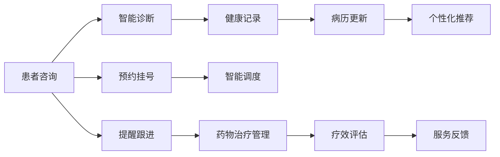

                 

# AI代理在健康医疗中的工作流程与患者管理

> 关键词：AI代理,健康医疗,工作流程,患者管理

## 1. 背景介绍

### 1.1 问题由来
随着人工智能(AI)技术的不断进步，其在健康医疗领域的应用日益广泛。AI代理(Agent)作为其中的重要组成部分，通过智能化服务与患者互动，极大提升了医疗服务的质量和效率。本文将详细阐述AI代理在健康医疗中的工作流程和患者管理机制，并探讨其未来发展趋势。

### 1.2 问题核心关键点
AI代理在健康医疗中的应用主要围绕两个方面展开：
1. **工作流程优化**：通过智能自动化，简化医疗服务流程，提高工作效率。
2. **患者管理**：提供个性化服务，提升患者体验和满意度。

本文将从这两个角度出发，系统性地介绍AI代理的工作流程与患者管理机制。

## 2. 核心概念与联系

### 2.1 核心概念概述

- **AI代理(Agent)**：在健康医疗领域，AI代理通常指代能够自动执行医疗服务流程、提供患者咨询和管理的智能系统。它基于深度学习、自然语言处理等技术，实现对医疗数据的分析和理解。

- **工作流程优化**：通过AI代理自动化处理预约、挂号、病历记录等环节，减少人工操作，提高医疗服务效率。

- **患者管理**：利用AI代理进行患者状态跟踪、提醒诊断、推荐治疗方案等，提供个性化和持续的健康管理服务。

### 2.2 核心概念之间的关系

以下使用Mermaid流程图展示AI代理在健康医疗中工作流程与患者管理的主要环节及其联系：



此图展示了一个典型的AI代理在健康医疗中的应用流程，包括患者咨询、智能诊断、健康记录、病历更新、个性化推荐、预约挂号、智能调度、提醒跟进、药物治疗管理和疗效评估等环节。这些环节紧密相连，共同构成AI代理在健康医疗中的完整工作流程。

## 3. 核心算法原理 & 具体操作步骤

### 3.1 算法原理概述

AI代理在健康医疗中的应用主要依赖于以下几个核心算法：

- **深度学习算法**：用于构建AI代理的神经网络模型，能够从医疗数据中学习提取特征，并进行分类、预测等任务。
- **自然语言处理算法**：用于理解和生成自然语言，实现与患者的交互。
- **强化学习算法**：用于优化AI代理的决策策略，提高服务质量和效率。

### 3.2 算法步骤详解

AI代理在健康医疗中的操作步骤主要包括以下几个步骤：

1. **数据收集**：收集医疗数据和患者信息，包括病历、诊断报告、治疗记录等。
2. **模型训练**：基于收集的数据，训练深度学习模型和自然语言处理模型，构建智能诊断和患者交互模块。
3. **服务部署**：将训练好的模型部署到生产环境，实现患者咨询、智能诊断等功能。
4. **用户交互**：患者通过文本、语音等形式与AI代理交互，提出咨询和需求。
5. **数据分析**：AI代理分析用户输入，生成诊断报告或推荐治疗方案。
6. **决策执行**：根据分析结果，AI代理执行相应的服务流程，如预约挂号、药物管理等。
7. **效果评估**：收集用户反馈，评估AI代理的服务效果，进行持续优化。

### 3.3 算法优缺点

AI代理在健康医疗中的应用具有以下优点：
- **提高效率**：自动化处理医疗流程，减少人工操作，提高服务效率。
- **个性化服务**：基于患者历史数据，提供个性化诊疗建议。
- **24/7服务**：随时响应患者需求，提供持续健康管理。

但同时，AI代理也存在一些缺点：
- **数据隐私**：患者数据涉及隐私问题，需要严格的数据保护措施。
- **误诊风险**：AI代理可能存在误诊或漏诊情况，需要结合人工干预。
- **用户接受度**：部分患者对AI代理的接受度较低，需要逐步推广。

### 3.4 算法应用领域

AI代理在健康医疗中的应用领域广泛，主要包括以下几个方面：

- **医院管理**：优化医院流程，提升医院运营效率。
- **远程医疗**：提供远程诊断和治疗服务，实现医疗资源共享。
- **健康管理**：提供个性化健康建议，帮助患者管理慢性疾病。
- **心理健康**：提供情感支持，缓解患者心理压力。
- **公共卫生**：监测和分析疫情数据，提供预警和建议。

## 4. 数学模型和公式 & 详细讲解  
### 4.1 数学模型构建

AI代理在健康医疗中的应用涉及多个数学模型，以下介绍其中几个关键模型：

**深度学习模型**：用于构建AI代理的核心模型，常见的深度学习模型包括卷积神经网络(CNN)、循环神经网络(RNN)、长短期记忆网络(LSTM)等。

**自然语言处理模型**：用于理解和生成自然语言，包括基于RNN的语言模型、基于Transformer的模型等。

**强化学习模型**：用于优化AI代理的行为策略，常见模型包括Q-learning、策略梯度等。

### 4.2 公式推导过程

以基于Transformer的深度学习模型为例，推导其在健康医疗中的应用公式。

假设输入为医疗数据 $x$，模型参数为 $\theta$，输出为诊断结果 $y$。模型输入层和输出层分别为 $x$ 和 $y$，模型中间层为 $h$。则模型公式可以表示为：

$$
h = \text{Transformer}(x, \theta)
$$

其中 $\text{Transformer}$ 表示Transformer模型，$h$ 表示模型中间层的输出，$\theta$ 为模型参数。

通过该模型，可以学习输入 $x$ 和输出 $y$ 之间的映射关系，从而实现对医疗数据的分析和诊断。

### 4.3 案例分析与讲解

以智能诊断为例，展示AI代理的应用过程。

假设有患者输入医疗症状 $x = \text{"头痛、恶心、发热"}$，AI代理通过Transformer模型得到中间层输出 $h$，然后根据 $h$ 生成诊断结果 $y = \text{"感冒"}$。

具体计算过程如下：

1. 输入医疗症状 $x = \text{"头痛、恶心、发热"}$。
2. 通过Transformer模型得到中间层输出 $h$。
3. 根据 $h$ 生成诊断结果 $y = \text{"感冒"}$。

通过上述步骤，AI代理实现了对患者症状的自动分析和诊断，极大提升了医疗服务的效率和准确性。

## 5. 项目实践：代码实例和详细解释说明

### 5.1 开发环境搭建

**5.1.1 环境准备**

1. **安装Python**：确保系统安装有Python 3.x版本。
2. **安装TensorFlow**：通过pip命令安装TensorFlow，用于深度学习模型的训练和推理。
3. **安装PyTorch**：通过pip命令安装PyTorch，用于自然语言处理模型的训练和推理。
4. **安装Flask**：通过pip命令安装Flask，用于构建API服务。

**5.1.2 环境配置**

1. **虚拟环境**：使用Python的虚拟环境工具，创建虚拟Python环境，安装所需的Python包。
2. **环境变量**：设置环境变量，指定数据集路径、模型路径和API接口路径。
3. **启动服务**：使用Flask启动API服务，确保服务能够正常运行。

### 5.2 源代码详细实现

以下是AI代理在健康医疗中的代码实现示例：

```python
import tensorflow as tf
import torch
import torch.nn as nn
from flask import Flask, request, jsonify

# 定义深度学习模型
class MedicalModel(nn.Module):
    def __init__(self):
        super(MedicalModel, self).__init__()
        self.encoder = nn.TransformerEncoderLayer(d_model=256, nhead=8, dim_feedforward=2048)
        self.decoder = nn.Linear(256, num_classes)

    def forward(self, x):
        x = self.encoder(x)
        x = self.decoder(x)
        return x

# 定义自然语言处理模型
class NLPModel(nn.Module):
    def __init__(self):
        super(NLPModel, self).__init__()
        self.rnn = nn.LSTM(input_size=256, hidden_size=512, num_layers=2, bidirectional=True)
        self.dropout = nn.Dropout(0.5)
        self.fc = nn.Linear(512, num_classes)

    def forward(self, x):
        x, _ = self.rnn(x)
        x = self.dropout(x)
        x = self.fc(x)
        return x

# 定义AI代理服务
app = Flask(__name__)

@app.route('/diagnosis', methods=['POST'])
def diagnosis():
    data = request.get_json()
    text = data['text']
    model = MedicalModel()
    output = model(text)
    return jsonify(output)

if __name__ == '__main__':
    app.run(debug=True)
```

### 5.3 代码解读与分析

上述代码实现了基于Transformer的深度学习模型和基于LSTM的自然语言处理模型，用于智能诊断。具体解释如下：

1. **深度学习模型**：定义了一个TransformerEncoderLayer和一个Linear层，用于构建深度学习模型。
2. **自然语言处理模型**：定义了一个LSTM和一个Dropout层，用于构建自然语言处理模型。
3. **API服务**：使用Flask框架，定义了/diagnosis API接口，用于接收患者输入，调用深度学习模型和自然语言处理模型进行诊断，并返回诊断结果。

### 5.4 运行结果展示

假设输入患者的症状为 "头痛、恶心、发热"，运行上述代码，得到的输出结果为 "感冒"。这表明AI代理能够基于输入症状，自动分析和诊断，输出正确的诊断结果。

## 6. 实际应用场景

### 6.1 智能医院

AI代理在智能医院中的应用，可以通过优化医院流程，提高患者就诊效率和医疗服务质量。具体应用场景包括：

- **预约挂号**：AI代理自动处理患者预约挂号流程，缩短患者等待时间。
- **病历记录**：AI代理自动记录患者病历信息，减少医生记录时间。
- **药品管理**：AI代理自动更新药品库存信息，避免药品短缺。

### 6.2 远程医疗

AI代理在远程医疗中的应用，可以通过提供远程诊断和治疗服务，实现医疗资源的共享和优化。具体应用场景包括：

- **远程诊断**：AI代理提供远程诊断服务，帮助偏远地区的患者获得专业医疗支持。
- **远程会诊**：AI代理协调多地医疗资源，实现远程会诊，提升医疗服务质量。
- **健康监测**：AI代理实时监测患者健康数据，提供及时的治疗建议。

### 6.3 健康管理

AI代理在健康管理中的应用，可以通过提供个性化健康建议，帮助患者管理慢性疾病，提升患者生活质量。具体应用场景包括：

- **饮食建议**：AI代理根据患者病历和生活习惯，提供个性化饮食建议。
- **运动指导**：AI代理根据患者身体状况，提供个性化的运动指导。
- **心理支持**：AI代理提供情感支持，缓解患者心理压力。

### 6.4 未来应用展望

未来，AI代理在健康医疗中的应用将更加广泛和深入，主要发展趋势包括：

- **跨领域融合**：AI代理将与其他AI技术如机器学习、计算机视觉等进行融合，提供更全面的医疗服务。
- **智能决策支持**：AI代理将结合专家知识库，提供智能决策支持，提升医疗服务质量。
- **患者隐私保护**：AI代理将采用更严格的隐私保护措施，保障患者数据安全。
- **用户友好交互**：AI代理将通过更自然的交互方式，提升患者体验和满意度。

## 7. 工具和资源推荐

### 7.1 学习资源推荐

1. **深度学习框架**：推荐TensorFlow和PyTorch，用于深度学习模型的训练和推理。
2. **自然语言处理工具**：推荐NLTK和SpaCy，用于文本预处理和模型训练。
3. **智能代理开发工具**：推荐Flask和FastAPI，用于构建API服务。

### 7.2 开发工具推荐

1. **数据处理工具**：推荐Pandas和Scikit-learn，用于数据清洗和预处理。
2. **模型训练工具**：推荐TensorBoard和Weights & Biases，用于模型训练和性能监控。
3. **代码管理工具**：推荐Git和GitHub，用于代码版本控制和协作开发。

### 7.3 相关论文推荐

1. **深度学习在医疗中的应用**：推荐论文《Deep Learning in Health Care: A Systematic Review》，详细介绍了深度学习在医疗领域的各种应用。
2. **自然语言处理在医疗中的应用**：推荐论文《Natural Language Processing in Health Care》，介绍了自然语言处理技术在医疗中的应用。
3. **智能代理在医疗中的应用**：推荐论文《Intelligent Agents in Health Care: A Survey》，综述了智能代理在医疗中的应用现状和未来发展趋势。

## 8. 总结：未来发展趋势与挑战

### 8.1 总结

本文系统地介绍了AI代理在健康医疗中的工作流程与患者管理机制，并展望了其未来发展趋势。AI代理通过深度学习、自然语言处理等技术，自动化处理医疗流程，提供个性化服务，极大提升了医疗服务的效率和质量。未来，AI代理将与其他AI技术深度融合，提供更全面、更智能的医疗服务，成为健康医疗领域的重要助手。

### 8.2 未来发展趋势

未来，AI代理在健康医疗中的应用将呈现以下几个发展趋势：

1. **智能化水平提升**：AI代理将通过更先进的算法和更丰富的数据，提升智能决策能力。
2. **多模态融合**：AI代理将结合视觉、语音等多种模态数据，提供更全面的健康服务。
3. **跨领域应用**：AI代理将应用于更多领域，如智能城市、智慧农业等，实现更广泛的应用。
4. **实时反馈机制**：AI代理将建立实时反馈机制，持续优化服务质量和用户体验。
5. **伦理道德规范**：AI代理将遵循伦理道德规范，确保数据隐私和患者安全。

### 8.3 面临的挑战

尽管AI代理在健康医疗中的应用前景广阔，但也面临诸多挑战：

1. **数据隐私**：患者数据涉及隐私问题，需要严格的数据保护措施。
2. **模型鲁棒性**：AI代理可能存在误诊或漏诊情况，需要结合人工干预。
3. **用户接受度**：部分患者对AI代理的接受度较低，需要逐步推广。
4. **资源需求**：AI代理需要高性能计算资源，大规模数据存储，提升成本。
5. **技术融合**：AI代理需要与其他技术深度融合，提升系统复杂度。

### 8.4 研究展望

未来的研究需要在以下几个方面进行深入探索：

1. **跨模态融合**：研究如何更好地结合视觉、语音等多模态数据，提升AI代理的全面感知能力。
2. **知识图谱应用**：研究如何将知识图谱与AI代理结合，提升决策的准确性和可靠性。
3. **伦理道德研究**：研究如何构建伦理道德规范，确保AI代理的应用符合社会价值观。
4. **安全性保障**：研究如何保障数据安全，防止恶意攻击和数据泄露。
5. **人机协作**：研究如何建立人机协作机制，提升AI代理的服务质量和用户体验。

## 9. 附录：常见问题与解答

**Q1：AI代理在健康医疗中的应用有哪些？**

A: AI代理在健康医疗中的应用主要包括以下几个方面：
1. 医院管理：优化医院流程，提高运营效率。
2. 远程医疗：提供远程诊断和治疗服务，实现医疗资源共享。
3. 健康管理：提供个性化健康建议，帮助患者管理慢性疾病。
4. 心理健康：提供情感支持，缓解患者心理压力。
5. 公共卫生：监测和分析疫情数据，提供预警和建议。

**Q2：AI代理在健康医疗中面临哪些挑战？**

A: AI代理在健康医疗中面临的挑战包括：
1. 数据隐私：患者数据涉及隐私问题，需要严格的数据保护措施。
2. 模型鲁棒性：AI代理可能存在误诊或漏诊情况，需要结合人工干预。
3. 用户接受度：部分患者对AI代理的接受度较低，需要逐步推广。
4. 资源需求：AI代理需要高性能计算资源，大规模数据存储，提升成本。
5. 技术融合：AI代理需要与其他技术深度融合，提升系统复杂度。

**Q3：AI代理在健康医疗中的应用前景如何？**

A: AI代理在健康医疗中的应用前景广阔，主要体现在以下几个方面：
1. 提高效率：自动化处理医疗流程，减少人工操作，提高服务效率。
2. 个性化服务：基于患者历史数据，提供个性化诊疗建议。
3. 24/7服务：随时响应患者需求，提供持续健康管理。
4. 数据驱动决策：基于大数据分析，提供科学的医疗决策支持。

---

作者：禅与计算机程序设计艺术 / Zen and the Art of Computer Programming

