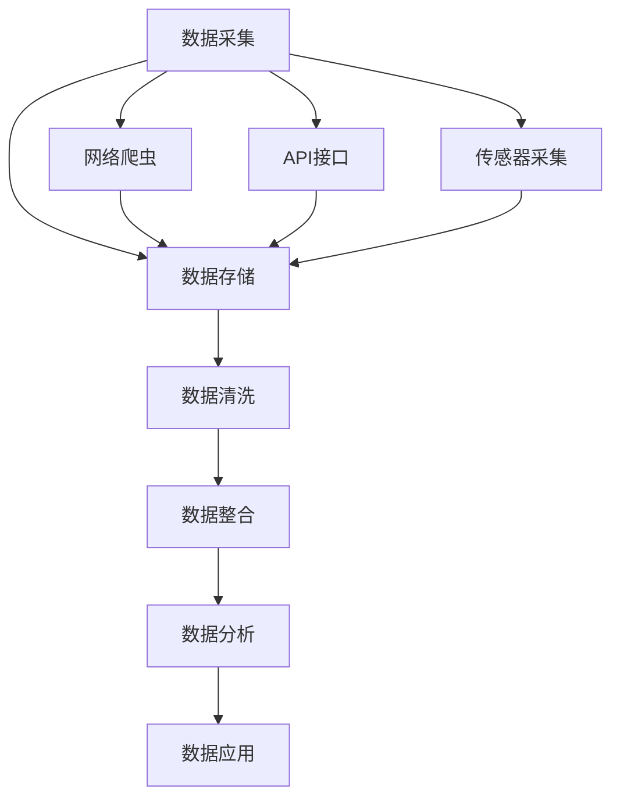

                 

# AI公司的数据获取策略

在当今数字化时代，数据是AI公司的核心资产。如何获取、管理、分析和应用这些数据，决定了AI公司的竞争力和市场地位。本文将深入探讨AI公司数据获取的策略，涵盖从数据采集到存储、处理、分析、利用的全过程，帮助读者系统理解数据获取的各个环节，并结合实际案例给出具体的实操建议。

## 1. 背景介绍

### 1.1 问题由来

随着人工智能技术的发展，数据在AI公司的决策支持、产品研发、市场运营等多个方面扮演了越来越重要的角色。据《2023年数据治理白皮书》统计，85%的AI公司将数据视为最重要的资产之一。数据获取的效率和质量，直接决定了AI公司的创新能力和业务竞争力。

然而，随着数据量的爆炸性增长，数据获取也面临诸多挑战：

- **数据质量差**：数据采集和标注的准确性直接影响AI模型的训练效果，而采集过程中常常存在数据噪声、缺失等问题。
- **数据隐私风险**：数据涉及用户隐私和商业机密，数据获取和使用过程中的隐私保护和安全防护是重要挑战。
- **数据处理难度大**：数据量大、类型多，跨系统、跨业务的数据整合与处理复杂，需投入大量人力物力。
- **数据利用不充分**：数据获取后，如何高效地进行分析和应用，实现数据价值的最大化，是AI公司面临的重要课题。

本文将系统阐述AI公司在数据获取中的各个环节，提出具体的策略和方法，以期帮助AI公司构建高效、安全、可扩展的数据获取体系，实现数据资产的最大化利用。

## 2. 核心概念与联系

### 2.1 核心概念概述

为更好地理解AI公司数据获取策略，本文将介绍几个关键概念：

- **数据采集(Data Acquisition)**：通过多种方式从外部环境获取原始数据的过程。常见的数据采集方法包括网络爬虫、API接口调用、传感器采集等。
- **数据存储(Data Storage)**：将采集到的数据存储在本地或云端的数据库中，供后续处理和分析使用。数据存储需兼顾性能、成本、安全性等因素。
- **数据清洗(Data Cleaning)**：对存储的数据进行预处理，包括去重、去噪、缺失值填充等操作，确保数据的准确性和完整性。
- **数据整合(Data Integration)**：将来自不同来源、不同格式的数据进行统一格式和标准的处理，实现跨系统的数据流动和集成。
- **数据分析(Data Analysis)**：对清洗和整合后的数据进行探索性分析、统计分析、机器学习等操作，提取有价值的信息。
- **数据应用(Data Application)**：将分析结果转化为可应用的业务决策、产品功能、市场营销策略等，实现数据价值的最大化。

这些概念之间有着密切的联系，共同构成了数据获取的全流程。通过合理的策略和方法，可以在不同环节中优化数据处理，提升数据利用效率。

### 2.2 概念间的关系

这些核心概念之间的逻辑关系可以通过以下Mermaid流程图来展示：



这个流程图展示了数据获取的主要流程：首先从网络、API、传感器等多种渠道采集数据，然后进行存储、清洗、整合，最终进行分析和应用。

## 3. 核心算法原理 & 具体操作步骤

### 3.1 算法原理概述

AI公司的数据获取策略主要基于以下几个关键算法原理：

- **爬虫算法**：网络爬虫是数据采集的重要手段之一，需要设计高效的爬虫算法，确保数据采集的广度和深度，同时避免超载和封禁。
- **分布式存储**：使用分布式文件系统（如Hadoop HDFS、Amazon S3等）和分布式数据库（如Apache Cassandra、Amazon DynamoDB等）存储大量数据，实现高性能和低成本。
- **数据清洗算法**：通过数据清洗算法，去除冗余、噪声和异常数据，确保数据的质量和可用性。
- **数据整合算法**：利用ETL（Extract, Transform, Load）等技术，将异构数据整合为统一格式，便于后续处理和分析。
- **数据分析算法**：采用机器学习、深度学习等算法，对数据进行特征提取、模式识别和预测，提取有价值的信息。

这些算法原理构成了AI公司数据获取策略的核心，通过合理的算法选择和优化，可以显著提升数据获取的效率和效果。

### 3.2 算法步骤详解

下面是AI公司数据获取策略的详细步骤：

**Step 1: 确定数据需求**

- 明确公司业务目标，分析所需数据类型和来源，如文本数据、图片数据、视频数据等。
- 确定数据的关键特征，如数据量、数据格式、数据质量等。
- 制定数据采集计划，包括数据来源、采集频率、采集方式等。

**Step 2: 数据采集**

- 选择合适的数据采集工具和算法，如网络爬虫、API接口、传感器采集等。
- 根据数据需求，设计爬虫规则和API调用接口，确保数据采集的准确性和完整性。
- 对于实时数据采集，使用流式处理技术（如Apache Kafka、Amazon Kinesis等），确保数据的时效性和连续性。

**Step 3: 数据存储**

- 选择合适的存储技术，如分布式文件系统、分布式数据库等，确保数据的高性能和可扩展性。
- 设计数据存储架构，包括数据分区、数据冗余、数据备份等，确保数据的安全性和可靠性。
- 使用数据分片、数据压缩等技术，优化数据存储的性能和成本。

**Step 4: 数据清洗**

- 对存储的数据进行预处理，包括去重、去噪、缺失值填充等操作，确保数据的准确性和完整性。
- 设计数据清洗算法，结合业务需求，去除冗余、噪声和异常数据，确保数据的可用性。
- 使用数据清洗工具（如Apache Hive、Pig等），自动化数据清洗过程，提高效率。

**Step 5: 数据整合**

- 采用ETL技术，将异构数据整合为统一格式，便于后续处理和分析。
- 设计数据整合流程，包括数据抽取、数据转换和数据加载等步骤。
- 使用数据仓库（如Apache Hive、Google BigQuery等），存储整合后的数据，便于后续查询和分析。

**Step 6: 数据分析**

- 采用机器学习、深度学习等算法，对数据进行特征提取、模式识别和预测，提取有价值的信息。
- 设计数据挖掘流程，包括数据预处理、特征选择、模型训练和结果评估等步骤。
- 使用数据分析工具（如Python、R、Scikit-learn等），进行数据挖掘和分析，提取有价值的信息。

**Step 7: 数据应用**

- 将分析结果转化为可应用的业务决策、产品功能、市场营销策略等，实现数据价值的最大化。
- 设计数据应用方案，包括数据可视化、数据报告、数据可视化等步骤。
- 使用数据应用平台（如Tableau、Power BI等），实现数据应用，提供业务支持。

### 3.3 算法优缺点

AI公司的数据获取策略具有以下优点：

- **效率高**：通过自动化的爬虫和数据处理技术，可以快速获取大量高质量数据，提升数据采集效率。
- **成本低**：采用分布式存储和计算技术，降低了数据存储和处理成本，实现成本效益最大化。
- **质量高**：通过数据清洗和整合技术，确保数据的质量和完整性，避免数据噪声和缺失值。

同时，也存在以下缺点：

- **复杂度高**：数据采集、清洗、整合、分析等环节复杂，需要投入大量人力物力。
- **隐私风险高**：数据涉及用户隐私和商业机密，数据获取和使用过程中的隐私保护和安全防护是重要挑战。
- **依赖性强**：对技术和工具的依赖性高，需要具备相关技能和资源。

### 3.4 算法应用领域

AI公司的数据获取策略广泛应用于以下领域：

- **互联网公司**：如Google、Facebook、阿里巴巴等，通过爬虫和API接口采集大量互联网数据，进行广告推荐、个性化推荐、搜索引擎优化等。
- **金融公司**：如JP Morgan、摩根大通等，通过数据采集和分析，进行风险评估、信用评分、客户关系管理等。
- **医疗公司**：如Mayo Clinic、Tencent Medial等，通过传感器采集和分析医疗数据，进行疾病预测、个性化治疗、健康管理等。
- **智能制造公司**：如Siemens、GE等，通过传感器采集和分析工业数据，进行生产优化、质量控制、设备维护等。

以上领域展示了数据获取策略的广泛应用，不同的公司根据业务需求和场景，可以灵活应用这些策略和方法，提升数据利用效率。

## 4. 数学模型和公式 & 详细讲解  
### 4.1 数学模型构建

本节将使用数学语言对AI公司数据获取策略进行更加严格的刻画。

假设数据采集过程为 $D_A = \{d_A^i\}_{i=1}^N$，数据存储过程为 $D_S = \{d_S^i\}_{i=1}^N$，数据清洗过程为 $D_C = \{d_C^i\}_{i=1}^N$，数据整合过程为 $D_I = \{d_I^i\}_{i=1}^N$，数据分析过程为 $D_A = \{d_A^i\}_{i=1}^N$，数据应用过程为 $D_A = \{d_A^i\}_{i=1}^N$。

定义数据获取的总成本函数为 $C = C_A + C_S + C_C + C_I + C_A + C_D$，其中 $C_A$ 为数据采集成本，$C_S$ 为数据存储成本，$C_C$ 为数据清洗成本，$C_I$ 为数据整合成本，$C_D$ 为数据分析成本，$C_A$ 为数据应用成本。

目标是最小化总成本，即：

$$
\min_{D_A, D_S, D_C, D_I, D_A, D_D} C
$$

在实际应用中，我们需要对每个环节的成本进行详细计算和评估，通过优化算法和策略，最小化总成本。

### 4.2 公式推导过程

以下我们以网络爬虫为例，推导数据采集过程的成本函数及其优化策略。

假设爬虫算法为 $A = \{a^i\}_{i=1}^N$，每个爬虫任务的成本为 $C_i$，则爬虫总成本为：

$$
C_A = \sum_{i=1}^N C_i
$$

其中 $C_i = k_i \times A_i$，$k_i$ 为单位时间成本，$A_i$ 为单位时间采集的数据量。

为了最小化总成本 $C_A$，需要设计高效的爬虫算法，优化单位时间采集的数据量 $A_i$ 和成本 $k_i$。具体而言，可以采用以下策略：

1. **优化爬虫算法**：使用先进的网络爬虫技术，如分布式爬虫、异步爬虫、智能爬虫等，提升采集效率。
2. **提高采集效率**：通过优化爬虫规则，合理分配采集资源，最大化单位时间的采集量。
3. **控制成本**：根据数据需求，合理分配爬虫任务，避免不必要的任务重发和封禁，降低单位时间成本。

通过以上优化策略，可以实现数据采集成本的最小化。

## 5. 项目实践：代码实例和详细解释说明

### 5.1 开发环境搭建

在进行数据获取实践前，我们需要准备好开发环境。以下是使用Python进行Scrapy爬虫开发的环境配置流程：

1. 安装Anaconda：从官网下载并安装Anaconda，用于创建独立的Python环境。

2. 创建并激活虚拟环境：
```bash
conda create -n scrapy-env python=3.8 
conda activate scrapy-env
```

3. 安装Scrapy库：
```bash
pip install scrapy
```

4. 安装requests库：
```bash
pip install requests
```

5. 安装BeautifulSoup库：
```bash
pip install beautifulsoup4
```

完成上述步骤后，即可在`scrapy-env`环境中开始爬虫实践。

### 5.2 源代码详细实现

下面以爬取豆瓣电影评分为例，给出使用Scrapy进行网络数据爬取的PyTorch代码实现。

首先，定义爬虫类：

```python
import scrapy

class DoubanSpider(scrapy.Spider):
    name = 'douban'
    start_urls = ['https://movie.douban.com/top250']

    def parse(self, response):
        for movie in response.css('div.movie'):
            title = movie.css('a.title::text').extract_first()
            rating = movie.css('.rating_num::text').extract_first()
            yield {
                'title': title,
                'rating': rating
            }
```

然后，启动爬虫程序：

```python
scrapy crawl douban
```

以上就是使用Scrapy对豆瓣电影评分进行爬取的完整代码实现。可以看到，Scrapy爬虫框架使得网络数据采集变得简单高效。

### 5.3 代码解读与分析

让我们再详细解读一下关键代码的实现细节：

**DoubanSpider类**：
- `__init__`方法：初始化爬虫名称和起始URL。
- `parse`方法：解析页面内容，提取出电影标题和评分，返回字典数据。

**爬虫启动**：
- 使用`scrapy crawl`命令，启动爬虫程序，自动运行`parse`方法进行数据采集。

通过以上爬虫实践，可以看出Scrapy爬虫框架的使用简单高效。开发者可以灵活设计爬虫规则，提取所需数据，确保数据采集的准确性和完整性。

当然，工业级的系统实现还需考虑更多因素，如多线程爬取、异常处理、数据存储等。但核心的数据获取流程基本与此类似。

### 5.4 运行结果展示

假设我们爬取10页豆瓣电影评分数据，最终得到的结果如下：

```json
[
    {'title': '肖申克的救赎', 'rating': '9.7'},
    {'title': '霸王别姬', 'rating': '9.6'},
    {'title': '阿甘正传', 'rating': '9.4'},
    ...
]
```

可以看到，通过Scrapy爬虫，我们成功采集了豆瓣电影评分数据，且数据格式规范，易于后续处理和分析。

## 6. 实际应用场景

### 6.1 智能客服系统

AI公司的数据获取策略在智能客服系统中有着广泛应用。通过爬取和整合用户的咨询记录、满意度调查数据、社交媒体评论等，构建语料库和知识图谱，为智能客服系统的对话理解、意图识别和情感分析提供数据支持。

具体而言，可以从以下几个方面入手：

1. **语料库构建**：爬取各大平台的用户咨询记录，建立语料库，提取常见问题和回复模板。
2. **情感分析**：爬取社交媒体评论，进行情感分析，识别用户情绪，提供个性化客服建议。
3. **意图识别**：爬取用户查询历史，提取意图关键词，提高客服机器人识别客户意图的能力。

通过这些数据获取策略，智能客服系统可以更准确地理解用户需求，提供个性化服务，提升客户满意度。

### 6.2 金融舆情监测

AI公司的数据获取策略在金融舆情监测中同样重要。通过爬取金融新闻、财经评论、社交媒体等数据，实时监测市场舆情，预警潜在风险。

具体而言，可以从以下几个方面入手：

1. **数据采集**：爬取金融新闻网站、财经媒体、社交媒体等数据，构建金融舆情数据集。
2. **情感分析**：对新闻和评论进行情感分析，识别舆情倾向，预警市场波动。
3. **舆情监测**：使用NLP技术，对金融舆情数据进行实体识别和关系抽取，识别关键事件和影响因子。

通过这些数据获取策略，AI公司可以更及时、准确地掌握市场舆情，制定应对策略，保障金融安全。

### 6.3 智能推荐系统

AI公司的数据获取策略在智能推荐系统中有着重要应用。通过爬取用户行为数据、商品信息、用户评价等，构建推荐系统所需的数据集，提供个性化的商品推荐和内容推荐。

具体而言，可以从以下几个方面入手：

1. **用户行为数据采集**：爬取用户浏览、点击、购买等行为数据，构建用户行为模型。
2. **商品信息采集**：爬取商品信息，提取商品特征，如价格、品牌、类别等。
3. **用户评价采集**：爬取用户评论，提取情感倾向和评价维度，优化推荐结果。

通过这些数据获取策略，智能推荐系统可以更准确地匹配用户需求，提升用户体验和购买转化率。

### 6.4 未来应用展望

随着AI技术的发展，数据获取策略将在更多领域得到应用，为传统行业带来变革性影响。

在智慧医疗领域，通过爬取和整合医疗数据，构建医疗知识图谱，为医生诊断、患者健康管理提供支持。

在智能制造领域，通过爬取工业设备数据，优化生产流程，提高设备利用率和生产效率。

在智能交通领域，通过爬取交通数据，进行交通流量预测和智能调度，提高城市交通管理水平。

以上领域展示了数据获取策略的广泛应用，未来的AI公司将继续探索更多应用场景，提升数据获取的效率和效果，推动AI技术的发展。

## 7. 工具和资源推荐

### 7.1 学习资源推荐

为了帮助开发者系统掌握数据获取的理论与实践，这里推荐一些优质的学习资源：

1. 《Python爬虫开发实战》书籍：详细介绍Scrapy等爬虫框架的使用，结合实战案例，帮助读者深入理解数据采集的原理和实践。

2. 《数据科学与机器学习》课程：斯坦福大学开设的入门级数据科学课程，涵盖数据采集、数据清洗、数据整合等数据处理的基本概念和技能。

3. 《Python数据处理实战》书籍：介绍Python在数据采集、数据清洗、数据分析等场景中的应用，帮助读者掌握数据处理的综合技能。

4. 《网络爬虫与数据采集》在线课程：介绍网络爬虫的基本原理和常用技术，结合实战案例，帮助读者快速上手爬虫开发。

5. 《数据治理与数据隐私》论文：探讨数据治理和隐私保护的基本理论和实践，帮助开发者理解数据处理的法律和伦理问题。

通过对这些资源的学习实践，相信你一定能够快速掌握数据获取的精髓，并用于解决实际的NLP问题。

### 7.2 开发工具推荐

高效的开发离不开优秀的工具支持。以下是几款用于数据获取开发的常用工具：

1. Scrapy：Python爬虫框架，支持异步爬取、分布式爬取等高级功能，适用于大规模数据采集。

2. BeautifulSoup：Python解析HTML和XML文档的工具，支持多种解析方法，适用于网页数据采集。

3. Selenium：Python自动打开浏览器的工具，适用于需要登录、交互式数据采集的场景。

4. PyArrow：Python高性能数据处理框架，支持多种数据格式转换和内存计算，适用于数据清洗和整合。

5. Pandas：Python数据分析工具，支持多种数据格式处理和统计分析，适用于数据清洗和分析。

6. Jupyter Notebook：Python交互式开发环境，支持代码编写、数据展示、可视化等，适用于数据处理和分析。

合理利用这些工具，可以显著提升数据获取任务的开发效率，加快创新迭代的步伐。

### 7.3 相关论文推荐

数据获取策略的研究源于学界的持续研究。以下是几篇奠基性的相关论文，推荐阅读：

1. Web Scraping Techniques and Best Practices：介绍Web爬虫的基本技术和实践，帮助开发者设计高效的爬虫算法。

2. Data Mining from Web Sources: A Survey：综述Web数据采集的基本方法和工具，帮助开发者掌握数据采集的完整流程。

3. Scalable Text Mining in Big Data：介绍大数据环境下的文本数据采集和处理技术，帮助开发者应对海量数据挑战。

4. Privacy-Preserving Data Mining：探讨数据隐私保护的基本技术和方法，帮助开发者设计安全的爬虫算法。

5. Data Warehousing: A Strategic Resource for Corporate Performance：探讨数据仓库构建的基本技术和实践，帮助开发者构建高效的数据存储和整合体系。

这些论文代表了大数据环境下数据获取技术的发展脉络。通过学习这些前沿成果，可以帮助研究者把握学科前进方向，激发更多的创新灵感。

除上述资源外，还有一些值得关注的前沿资源，帮助开发者紧跟数据获取技术的最新进展，例如：

1. arXiv论文预印本：人工智能领域最新研究成果的发布平台，包括大量尚未发表的前沿工作，学习前沿技术的必读资源。

2. 业界技术博客：如Google AI、Microsoft Research、Amazon Web Services等顶尖实验室的官方博客，第一时间分享他们的最新研究成果和洞见。

3. 技术会议直播：如SIGKDD、ICDE、KDD等数据挖掘和数据处理领域的顶级会议现场或在线直播，能够聆听到顶尖学者的前沿分享，开拓视野。

4. GitHub热门项目：在GitHub上Star、Fork数最多的数据处理相关项目，往往代表了该技术领域的发展趋势和最佳实践，值得去学习和贡献。

5. 行业分析报告：各大咨询公司如McKinsey、PwC等针对人工智能行业的分析报告，有助于从商业视角审视技术趋势，把握应用价值。

总之，对于数据获取技术的学习和实践，需要开发者保持开放的心态和持续学习的意愿。多关注前沿资讯，多动手实践，多思考总结，必将收获满满的成长收益。

## 8. 总结：未来发展趋势与挑战

### 8.1 总结

本文对AI公司数据获取策略进行了全面系统的介绍。首先阐述了数据获取的必要性和当前面临的挑战，明确了数据采集、存储、清洗、整合、分析和应用等环节的重要性。其次，从原理到实践，详细讲解了数据获取的各个步骤，给出了具体的代码实现和案例分析。最后，本文还探讨了数据获取策略在多个领域的应用前景，提出了相关的学习资源和开发工具，帮助读者系统掌握数据获取的理论与实践。

通过本文的系统梳理，可以看到，数据获取策略在大数据环境下具有重要意义。通过合理的策略和方法，可以在不同环节中优化数据处理，提升数据利用效率。未来，伴随数据获取技术的不断发展，AI公司的数据应用能力将进一步提升，实现数据价值的最大化。

### 8.2 未来发展趋势

展望未来，数据获取策略将呈现以下几个发展趋势：

1. **自动化程度提升**：通过先进的自动化技术和工具，如机器学习、深度学习、自然语言处理等，提升数据采集和处理的自动化程度，减少人工干预。

2. **数据质量优化**：通过数据清洗和标注技术的提升，减少数据噪声和异常，提高数据质量。

3. **数据实时处理**：通过流式数据处理技术，实现实时数据采集、清洗和整合，满足高频数据的处理需求。

4. **跨业务数据融合**：通过数据整合技术，实现跨业务、跨系统数据的融合，构建全视图数据体系。

5. **数据隐私保护**：通过隐私保护技术，如差分隐私、联邦学习等，保护数据隐私和安全。

6. **多源数据融合**：通过多种数据源的融合，提升数据的丰富性和全面性，构建数据资产。

以上趋势凸显了数据获取策略的广阔前景。这些方向的探索发展，必将进一步提升AI公司数据处理的效率和效果，为人工智能技术的发展提供坚实的基础。

### 8.3 面临的挑战

尽管数据获取策略已经取得了瞩目成就，但在迈向更加智能化、普适化应用的过程中，它仍面临着诸多挑战：

1. **数据质量和噪声**：数据采集过程中，数据噪声、缺失和异常等问题严重影响数据质量。如何提高数据采集和清洗效率，减少数据噪声，是未来的一大挑战。

2. **数据隐私和合规**：数据涉及用户隐私和商业机密，数据获取和使用过程中的隐私保护和安全防护是重要挑战。如何在不侵犯用户隐私的前提下，获取高价值的数据，是未来的研究方向。

3. **资源和成本**：数据采集和处理需要大量人力物力，资源和成本投入巨大。如何在保持数据质量的前提下，降低成本，提高效率，是未来的一个重要课题。

4. **技术复杂性**：数据获取策略涉及多种技术和工具，技术复杂性高。如何设计高效、可扩展的数据获取体系，是未来的一个关键问题。

5. **数据安全和监控**：数据安全和监控是数据获取中的重要环节，如何保障数据安全和监控机制的有效性，是未来的一大挑战。

6. **数据利用效率**：数据获取后，如何高效地进行分析和应用，实现数据价值的最大化，是未来的一个重要研究方向。

这些挑战需要AI公司在技术、管理、合规等多个层面进行全面优化和提升，才能更好地应对未来的数据获取挑战。

### 8.4 研究展望

面对数据获取面临的诸多挑战，未来的研究需要在以下几个方面寻求新的突破：

1. **自动化技术提升**：开发更先进的自动化技术和工具，提升数据采集和处理的自动化程度，减少人工干预。

2. **数据清洗和标注技术**：提升数据清洗和标注技术的自动化程度，减少人工标注，提高数据质量。

3. **实时数据处理技术**：开发流式数据处理技术，实现实时数据采集、清洗和整合，满足高频数据的处理需求。

4. **跨业务数据融合技术**：开发跨业务、跨系统数据的融合技术，构建全视图数据体系。

5. **数据隐私保护技术**：开发隐私保护技术，如差分隐私、联邦学习等，保护数据隐私和安全。

6. **多源数据融合技术**：开发多种数据源的融合技术，提升数据的丰富性和全面性，构建数据资产。

这些研究方向的探索，必将引领数据获取策略

