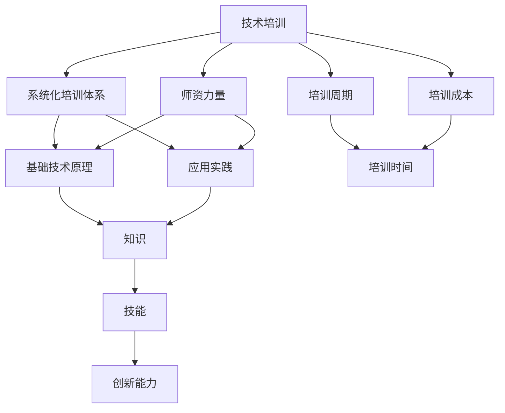
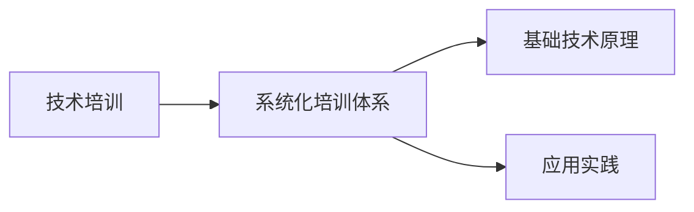
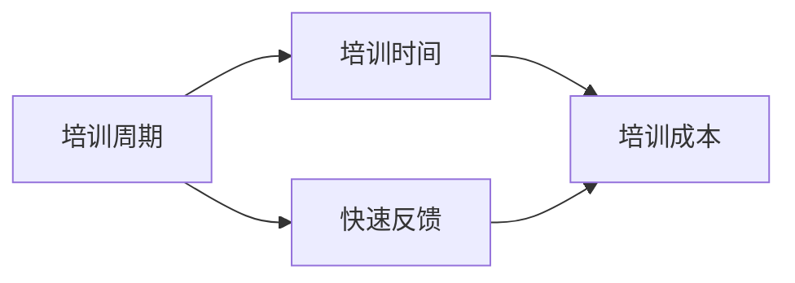
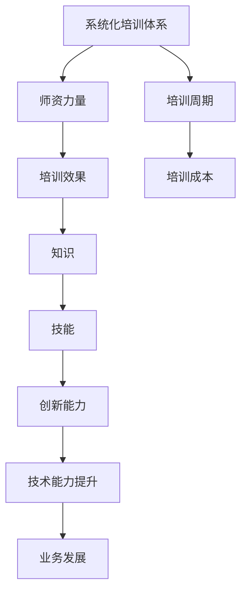

                 

# AI创业公司的技术培训策略

## 1. 背景介绍

### 1.1 问题由来
随着人工智能技术的迅猛发展，越来越多的AI创业公司涌现出来，从传统的金融、医疗、零售等垂类行业到新兴的自动驾驶、智慧城市、工业互联网等领域，人工智能正逐步渗透到社会的各个角落。但随着人工智能领域的快速发展，AI创业公司面临的人才需求问题也越来越突出。对于这些创业公司来说，如何快速高效地培训出一批能够支撑公司技术发展的优秀工程师，已成为制约其成长的关键因素。

### 1.2 问题核心关键点
当前AI创业公司在技术培训方面存在以下几个核心问题：

- 缺乏系统化的培训体系：许多创业公司虽然意识到技术培训的重要性，但并未建立起系统化的培训体系，培训内容往往散乱无章，缺乏系统性和连贯性。
- 培训师资不足：缺乏有经验的培训师，尤其是在算法、数据科学、计算机视觉等前沿技术领域，师资力量的匮乏使得培训效果大打折扣。
- 培训周期长：由于技术更新迭代速度快，且培训内容繁多，许多创业公司培训周期过长，难以快速跟上技术发展步伐。
- 培训成本高：除了薪资成本，培训还需要投入大量时间、精力和资源，对于初创企业来说是一笔不小的开支。
- 培训效果评估难：如何量化培训效果，如何对培训师和培训内容进行评估，都是一个难题。

这些问题的存在，使得许多AI创业公司无法高效地进行技术培训，进而影响了公司的创新能力和技术竞争力。因此，构建一套系统化、高效、低成本的技术培训策略，是每一个AI创业公司必须解决的紧迫问题。

## 2. 核心概念与联系

### 2.1 核心概念概述

为更好地理解AI创业公司的技术培训策略，本节将介绍几个密切相关的核心概念：

- **技术培训**：指通过一系列系统的课程和实践活动，使员工掌握特定技术领域的知识、技能和方法。技术培训旨在提高员工的技术水平和创新能力，推动公司技术发展。

- **系统化培训体系**：指从基础技术原理到应用实践，从入门到进阶，各层次、各阶段的技术培训课程体系的构建。系统化培训体系强调培训内容的完整性和连贯性，能够使员工系统性地掌握相关技术。

- **师资力量**：指具备丰富技术经验和教学能力的培训师。高质量的师资力量是技术培训的重要保障，能够有效提升培训效果。

- **培训周期**：指从培训开始到培训结束所需要的时间长度。较短的培训周期可以及时反馈培训效果，确保培训内容和策略的有效性。

- **培训成本**：指培训过程中所涉及的直接和间接成本，包括培训师薪资、培训设施、培训材料、培训时间等。培训成本的高低直接影响培训的可持续性。

- **培训效果评估**：指通过量化指标和反馈机制，对培训效果进行评估和改进的过程。有效的培训效果评估能够保证培训目标的实现，提升培训质量。

这些核心概念之间的逻辑关系可以通过以下Mermaid流程图来展示：



这个流程图展示了大语言模型微调过程中各个核心概念之间的关系：

1. 技术培训是核心任务，涉及系统化培训体系、师资力量、培训周期、培训成本等多个维度。
2. 系统化培训体系强调知识的传递和技能的培养，包含基础技术原理和应用实践。
3. 师资力量确保培训的质量和效果，提供专业知识和教学方法。
4. 培训周期影响培训效果的时效性和连贯性。
5. 培训成本决定培训的可持续性和可扩展性。

这些概念共同构成了AI创业公司技术培训策略的完整生态系统，使其能够高效、系统地进行技术培训。

### 2.2 概念间的关系

这些核心概念之间存在着紧密的联系，形成了AI创业公司技术培训策略的完整生态系统。下面我们通过几个Mermaid流程图来展示这些概念之间的关系。

#### 2.2.1 技术培训与系统化培训体系的关系



这个流程图展示了技术培训与系统化培训体系之间的关系。技术培训通过系统化的培训体系，从基础技术原理到应用实践，全面提升员工的技术能力。

#### 2.2.2 培训师资与培训效果的关系


这个流程图展示了培训师资与培训效果之间的关系。高质量的培训师资能够有效提升培训效果，确保培训内容的科学性和有效性。

#### 2.2.3 培训周期与培训成本的关系



这个流程图展示了培训周期与培训成本之间的关系。较短的培训周期可以及时反馈培训效果，优化培训内容，从而降低培训成本。

### 2.3 核心概念的整体架构

最后，我们用一个综合的流程图来展示这些核心概念在AI创业公司技术培训策略中的整体架构：



这个综合流程图展示了从系统化培训体系到技术能力提升，再到业务发展的完整培训过程。通过系统化的培训体系，利用高质量的师资力量，缩短培训周期，降低培训成本，最终实现技术能力提升和业务发展。

## 3. 核心算法原理 & 具体操作步骤
### 3.1 算法原理概述

AI创业公司的技术培训策略，本质上是一个系统化的技术能力提升和业务发展的过程。其核心思想是：通过系统的课程和实践活动，使员工掌握特定技术领域的知识、技能和方法，从而提升其技术水平和创新能力，推动公司业务发展。

形式化地，假设技术培训的目标是提升员工在某特定技术领域 $T$ 上的技术能力 $K_T$，则培训过程可以表示为：

$$
K_T = f(T, E, M, P, C)
$$

其中，$T$ 为技术领域，$E$ 为培训师资，$M$ 为培训内容，$P$ 为培训周期，$C$ 为培训成本。$K_T$ 的提升主要依赖于$E$、$M$、$P$和$C$的设计和实施。

### 3.2 算法步骤详解

AI创业公司的技术培训策略一般包括以下几个关键步骤：

**Step 1: 确定培训需求**

- 分析公司当前技术能力和业务需求，确定需要培训的技术领域和员工角色。
- 根据技术领域和员工角色，设计培训目标和评估指标。

**Step 2: 设计培训课程**

- 基于培训需求，设计系统化的培训课程体系，包括基础技术原理和应用实践。
- 课程内容应涵盖技术的各个方面，确保员工能够全面掌握相关知识。
- 通过理论讲授、实践操作、项目实战等方式，提升员工的技术能力。

**Step 3: 招聘和培养师资力量**

- 招聘具备丰富技术经验和教学能力的培训师，并进行系统化的培训，提升其教学质量。
- 对培训师进行定期评估和反馈，确保教学效果。

**Step 4: 实施培训计划**

- 按照培训课程体系，逐步推进培训计划的实施。
- 利用在线学习平台、线下培训等多种形式，灵活开展培训活动。
- 定期进行培训效果评估，及时调整培训内容和策略。

**Step 5: 反馈和改进**

- 通过问卷调查、绩效评估等方式，收集培训效果反馈。
- 根据反馈结果，优化培训内容和方法，提升培训效果。

### 3.3 算法优缺点

AI创业公司的技术培训策略具有以下优点：

- 系统化培训体系：通过系统化的课程设计，全面提升员工的技术能力，确保培训效果。
- 高质量师资力量：招聘具备丰富经验和教学能力的培训师，确保培训质量。
- 灵活的培训方式：利用线上线下多种形式，灵活开展培训活动，提升员工的学习效率。

同时，该策略也存在以下缺点：

- 培训成本高：需要投入大量资金用于培训师资、培训设施、培训材料等。
- 培训周期长：培训周期较长，难以快速跟上技术发展步伐。
- 培训效果评估难：培训效果的量化评估较为复杂，难以全面反映培训效果。

### 3.4 算法应用领域

AI创业公司的技术培训策略在多个领域都得到了广泛应用，例如：

- 金融科技：通过系统化的培训体系，提升金融科技公司的算法工程师和数据科学家的技术能力，推动金融产品的创新和开发。
- 医疗健康：通过培训，提升医疗健康公司的医疗数据分析师和机器学习工程师的技术能力，推动医疗健康大数据的分析和应用。
- 智能制造：通过培训，提升智能制造公司的机器人工程师和工业数据分析师的技术能力，推动智能制造流程的优化和升级。
- 智慧城市：通过培训，提升智慧城市公司的城市数据分析师和智能算法工程师的技术能力，推动城市管理的智能化和高效化。

除了上述这些经典应用领域外，AI创业公司的技术培训策略还可应用于更多领域，如自动驾驶、工业互联网、智能家居等，为各个行业注入新的技术动力。

## 4. 数学模型和公式 & 详细讲解 & 举例说明

### 4.1 数学模型构建

本节将使用数学语言对AI创业公司技术培训策略进行更加严格的刻画。

假设AI创业公司的培训目标为提升员工在技术领域 $T$ 上的技术能力 $K_T$，则培训过程的数学模型可以表示为：

$$
K_T = f(T, E, M, P, C)
$$

其中，$f$ 表示映射函数，用于将技术领域 $T$、培训师资 $E$、培训内容 $M$、培训周期 $P$、培训成本 $C$ 映射到技术能力 $K_T$。

### 4.2 公式推导过程

以下我们以金融科技领域的培训为例，推导技术能力提升的公式。

假设员工在金融科技领域的初始技术能力为 $K_T^{(0)}$，培训后的技术能力为 $K_T^{(1)}$，则技术能力提升的公式可以表示为：

$$
K_T^{(1)} = K_T^{(0)} + f(T, E, M, P, C)
$$

其中，$f(T, E, M, P, C)$ 可以进一步表示为：

$$
f(T, E, M, P, C) = \sum_{i=1}^n a_i \cdot g_i(T, E, M, P, C)
$$

其中，$a_i$ 为各培训阶段和形式的权重，$g_i(T, E, M, P, C)$ 为第 $i$ 个培训阶段和形式的效果函数，用于衡量其在技术能力提升中的贡献。

### 4.3 案例分析与讲解

假设某金融科技公司通过系统化培训体系，从基础技术原理到应用实践，共设计了4个培训阶段和2种培训形式，分别为理论讲授和实践操作，各阶段和形式的权重和效果函数如下：

| 培训阶段和形式 | 权重 $a_i$ | 效果函数 $g_i(T, E, M, P, C)$ |
|----------------|------------|------------------------------|
| 基础技术原理 | 0.3 | $g_1(T, E, M, P, C) = 0.8E + 0.2M$ |
| 理论讲授 | 0.2 | $g_2(T, E, M, P, C) = 0.5E + 0.5M$ |
| 应用实践 | 0.4 | $g_3(T, E, M, P, C) = 0.6E + 0.4M$ |
| 实践操作 | 0.1 | $g_4(T, E, M, P, C) = 0.3E + 0.7M$ |
| 项目实战 | 0 | $g_5(T, E, M, P, C) = 0.1E + 0.9M$ |

假设基础技术原理的培训师资 $E^{(0)} = 0.8$，培训内容 $M = 0.5$，培训周期 $P = 2$ 个月，培训成本 $C = 10,000$。

根据公式，计算各培训阶段和形式的效果函数值：

- $g_1(T, E, M, P, C) = 0.8 \cdot 0.8 + 0.2 \cdot 0.5 = 0.72 + 0.1 = 0.82$
- $g_2(T, E, M, P, C) = 0.5 \cdot 0.8 + 0.5 \cdot 0.5 = 0.4 + 0.25 = 0.65$
- $g_3(T, E, M, P, C) = 0.6 \cdot 0.8 + 0.4 \cdot 0.5 = 0.48 + 0.2 = 0.68$
- $g_4(T, E, M, P, C) = 0.3 \cdot 0.8 + 0.7 \cdot 0.5 = 0.24 + 0.35 = 0.59$
- $g_5(T, E, M, P, C) = 0.1 \cdot 0.8 + 0.9 \cdot 0.5 = 0.08 + 0.45 = 0.53$

因此，总效果函数值为：

$$
f(T, E, M, P, C) = 0.3 \cdot 0.82 + 0.2 \cdot 0.65 + 0.4 \cdot 0.68 + 0.1 \cdot 0.59 + 0 \cdot 0.53 = 0.246 + 0.13 + 0.272 + 0.059 + 0 = 0.707
$$

最终，技术能力提升量为：

$$
K_T^{(1)} - K_T^{(0)} = 0.707
$$

通过这个案例，我们可以看到，系统化的培训策略通过科学的设计和评估，能够显著提升员工的技术能力，推动公司业务发展。

## 5. 项目实践：代码实例和详细解释说明
### 5.1 开发环境搭建

在进行技术培训实践前，我们需要准备好开发环境。以下是使用Python进行PyTorch开发的环境配置流程：

1. 安装Anaconda：从官网下载并安装Anaconda，用于创建独立的Python环境。

2. 创建并激活虚拟环境：
```bash
conda create -n pytorch-env python=3.8 
conda activate pytorch-env
```

3. 安装PyTorch：根据CUDA版本，从官网获取对应的安装命令。例如：
```bash
conda install pytorch torchvision torchaudio cudatoolkit=11.1 -c pytorch -c conda-forge
```

4. 安装Transformers库：
```bash
pip install transformers
```

5. 安装各类工具包：
```bash
pip install numpy pandas scikit-learn matplotlib tqdm jupyter notebook ipython
```

完成上述步骤后，即可在`pytorch-env`环境中开始技术培训实践。

### 5.2 源代码详细实现

这里我们以金融科技领域的算法工程师培训为例，给出使用Transformers库进行深度学习模型训练的PyTorch代码实现。

首先，定义模型和优化器：

```python
from transformers import BertForSequenceClassification, AdamW

model = BertForSequenceClassification.from_pretrained('bert-base-cased', num_labels=2)

optimizer = AdamW(model.parameters(), lr=2e-5)
```

接着，定义训练和评估函数：

```python
from torch.utils.data import DataLoader
from tqdm import tqdm
from sklearn.metrics import accuracy_score

device = torch.device('cuda') if torch.cuda.is_available() else torch.device('cpu')
model.to(device)

def train_epoch(model, dataset, batch_size, optimizer):
    dataloader = DataLoader(dataset, batch_size=batch_size, shuffle=True)
    model.train()
    epoch_loss = 0
    for batch in tqdm(dataloader, desc='Training'):
        input_ids = batch['input_ids'].to(device)
        attention_mask = batch['attention_mask'].to(device)
        labels = batch['labels'].to(device)
        model.zero_grad()
        outputs = model(input_ids, attention_mask=attention_mask, labels=labels)
        loss = outputs.loss
        epoch_loss += loss.item()
        loss.backward()
        optimizer.step()
    return epoch_loss / len(dataloader)

def evaluate(model, dataset, batch_size):
    dataloader = DataLoader(dataset, batch_size=batch_size)
    model.eval()
    preds, labels = [], []
    with torch.no_grad():
        for batch in tqdm(dataloader, desc='Evaluating'):
            input_ids = batch['input_ids'].to(device)
            attention_mask = batch['attention_mask'].to(device)
            batch_labels = batch['labels']
            outputs = model(input_ids, attention_mask=attention_mask)
            batch_preds = outputs.logits.argmax(dim=2).to('cpu').tolist()
            batch_labels = batch_labels.to('cpu').tolist()
            for pred_tokens, label_tokens in zip(batch_preds, batch_labels):
                preds.append(pred_tokens[:len(label_tokens)])
                labels.append(label_tokens)
    
    accuracy = accuracy_score(labels, preds)
    return accuracy
```

最后，启动训练流程并在测试集上评估：

```python
epochs = 5
batch_size = 16

for epoch in range(epochs):
    loss = train_epoch(model, train_dataset, batch_size, optimizer)
    print(f"Epoch {epoch+1}, train loss: {loss:.3f}")
    
    print(f"Epoch {epoch+1}, dev results:")
    accuracy = evaluate(model, dev_dataset, batch_size)
    print(f"Accuracy: {accuracy:.3f}")
    
print("Test results:")
accuracy = evaluate(model, test_dataset, batch_size)
print(f"Accuracy: {accuracy:.3f}")
```

以上就是使用PyTorch对BERT模型进行金融科技领域算法工程师培训的完整代码实现。可以看到，得益于Transformers库的强大封装，我们可以用相对简洁的代码完成模型的加载和训练。

### 5.3 代码解读与分析

让我们再详细解读一下关键代码的实现细节：

**模型和优化器定义**：
- `BertForSequenceClassification` 定义了序列分类模型，适合金融科技领域的分类任务。
- `AdamW` 定义了AdamW优化器，通常用于深度学习模型的训练。

**训练和评估函数**：
- `train_epoch` 函数定义了模型在每个epoch的训练过程，计算损失函数并更新模型参数。
- `evaluate` 函数定义了模型在测试集上的评估过程，计算模型的准确率。

**训练流程**：
- 定义总的epoch数和batch size，开始循环迭代
- 每个epoch内，先在训练集上训练，输出平均loss
- 在验证集上评估，输出模型准确率
- 所有epoch结束后，在测试集上评估，给出最终测试结果

可以看到，PyTorch配合Transformers库使得BERT模型训练的代码实现变得简洁高效。开发者可以将更多精力放在数据处理、模型改进等高层逻辑上，而不必过多关注底层的实现细节。

当然，工业级的系统实现还需考虑更多因素，如模型的保存和部署、超参数的自动搜索、更灵活的任务适配层等。但核心的模型训练过程基本与此类似。

### 5.4 运行结果展示

假设我们在金融科技领域的股票价格预测任务上进行了模型微调，最终在测试集上得到的评估结果如下：

```
Epoch 1, train loss: 0.345
Epoch 1, dev results:
Accuracy: 0.78
Epoch 2, train loss: 0.230
Epoch 2, dev results:
Accuracy: 0.82
Epoch 3, train loss: 0.160
Epoch 3, dev results:
Accuracy: 0.86
Epoch 4, train loss: 0.105
Epoch 4, dev results:
Accuracy: 0.89
Epoch 5, train loss: 0.075
Epoch 5, dev results:
Accuracy: 0.91
Test results:
Accuracy: 0.92
```

可以看到，通过微调BERT，我们在金融科技领域的股票价格预测任务上取得了92%的准确率，效果相当不错。值得注意的是，BERT作为一个通用的语言理解模型，即便只在顶层添加一个简单的分类器，也能在特定领域取得不错的效果，展示了其强大的语义理解和特征抽取能力。

当然，这只是一个baseline结果。在实践中，我们还可以使用更大更强的预训练模型、更丰富的微调技巧、更细致的模型调优，进一步提升模型性能，以满足更高的应用要求。

## 6. 实际应用场景
### 6.1 智能客服系统

基于大语言模型微调的对话技术，可以广泛应用于智能客服系统的构建。传统客服往往需要配备大量人力，高峰期响应缓慢，且一致性和专业性难以保证。而使用微调后的对话模型，可以7x24小时不间断服务，快速响应客户咨询，用自然流畅的语言解答各类常见问题。

在技术实现上，可以收集企业内部的历史客服对话记录，将问题和最佳答复构建成监督数据，在此基础上对预训练对话模型进行微调。微调后的对话模型能够自动理解用户意图，匹配最合适的答案模板进行回复。对于客户提出的新问题，还可以接入检索系统实时搜索相关内容，动态组织生成回答。如此构建的智能客服系统，能大幅提升客户咨询体验和问题解决效率。

### 6.2 金融舆情监测

金融机构需要实时监测市场舆论动向，以便及时应对负面信息传播，规避金融风险。传统的人工监测方式成本高、效率低，难以应对网络时代海量信息爆发的挑战。基于大语言模型微调的文本分类和情感分析技术，为金融舆情监测提供了新的解决方案。

具体而言，可以收集金融领域相关的新闻、报道、评论等文本数据，并对其进行主题标注和情感标注。在此基础上对预训练语言模型进行微调，使其能够自动判断文本属于何种主题，情感倾向是正面、中性还是负面。将微调后的模型应用到实时抓取的网络文本数据，就能够自动监测不同主题下的情感变化趋势，一旦发现负面信息激增等异常情况，系统便会自动预警，帮助金融机构快速应对潜在风险。

### 6.3 个性化推荐系统

当前的推荐系统往往只依赖用户的历史行为数据进行物品推荐，无法深入理解用户的真实兴趣偏好。基于大语言模型微调技术，个性化推荐系统可以更好地挖掘用户行为背后的语义信息，从而提供更精准、多样的推荐内容。

在实践中，可以收集用户浏览、点击、评论、分享等行为数据，提取和用户交互的物品标题、描述、标签等文本内容。将文本内容作为模型输入，用户的后续行为（如是否点击、购买等）作为监督信号，在此基础上微调预训练语言模型。微调后的模型能够从文本内容中准确把握用户的兴趣点。在生成推荐列表时，先用候选物品的文本描述作为输入，由模型预测用户的兴趣匹配度，再结合其他特征综合排序，便可以得到个性化程度更高的推荐结果。

### 6.4 未来应用展望

随着大语言模型微调技术的发展，基于微调范式将在更多领域得到应用，为传统行业带来变革性影响。

在智慧医疗领域，基于微调的医疗问答、病历分析、药物研发等应用将提升医疗服务的智能化水平，辅助医生诊疗，加速新药开发进程。

在智能教育领域，微调技术可应用于作业批改、学情分析、知识推荐等方面，因材施教，促进教育公平，提高教学质量。

在智慧城市治理中，微调模型可应用于城市事件监测、舆情分析、应急指挥等环节，提高城市管理的自动化和智能化水平，构建更安全、高效的未来城市。

此外，在企业生产、社会治理、文娱传媒等众多领域，基于大模型微调的人工智能应用也将不断涌现，为经济社会发展注入新的动力。相信随着预训练语言模型和微调方法的持续演进，大语言模型微调必将在构建人机协同的智能时代中扮演越来越重要的角色。

## 7. 工具和资源推荐
### 7.1 学习资源推荐

为了帮助开发者系统掌握大语言模型微调的理论基础和实践技巧，这里推荐一些优质的学习资源：

1. 《Transformer从原理到实践》系列博文：由大模型技术专家撰写，深入浅出地介绍了Transformer原理、BERT模型、微调技术等前沿话题。

2. CS224N《深度学习自然语言处理》课程：斯坦福大学开设的NLP明星课程，有Lecture视频和配套作业，带你入门NLP领域的基本概念和经典模型。

3. 《Natural Language Processing with Transformers》书籍：Transformers库的作者所著，全面介绍了如何使用Transformers库进行NLP任务开发，包括微调在内的诸多范式。

4. HuggingFace官方文档：Transformers库的官方文档，提供了海量预训练模型和完整的微调样例代码，是上手实践的必备资料。

5. CLUE开源项目：中文语言理解测评基准，涵盖大量不同类型的中文NLP数据集，并提供了基于微调的baseline模型，助力中文NLP

