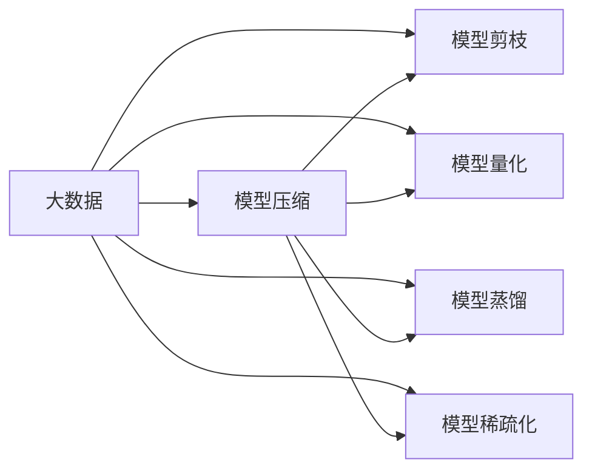

# 大数据与模型压缩：从数据到定理的旅程

作者：禅与计算机程序设计艺术 / Zen and the Art of Computer Programming

## 1. 背景介绍

### 1.1 问题的由来

随着互联网和物联网的快速发展，数据量呈爆炸式增长。如何有效地存储、处理和分析海量数据，成为当前IT领域面临的重要挑战。大数据技术应运而生，通过对大规模数据进行高效处理，为各个行业提供了强大的数据支持。然而，随着数据量的不断增大，数据存储、传输和计算的挑战也随之而来。模型压缩技术作为一种有效降低模型复杂度和计算成本的方法，成为了大数据时代的关键技术之一。

### 1.2 研究现状

近年来，模型压缩技术在学术界和工业界都取得了显著的进展。主要研究方向包括：

- 模型剪枝：通过移除模型中不必要的权重，降低模型复杂度和计算成本。
- 模型量化：将模型中的浮点数参数转换为低精度整数或定点数，进一步降低计算复杂度和存储空间。
- 模型蒸馏：将大模型的知识迁移到小模型中，实现模型压缩的同时保持性能。
- 模型稀疏化：降低模型中非零参数的比例，减少计算量和内存占用。

### 1.3 研究意义

模型压缩技术在以下方面具有重要意义：

- 降低存储和计算成本：通过压缩模型，减少存储空间和计算资源的需求，降低系统成本。
- 增强移动设备适应性：使模型能够在资源受限的移动设备上运行，提高移动应用的性能和能效。
- 提高模型部署效率：加快模型的部署速度，缩短应用启动时间，提升用户体验。
- 促进人工智能技术的普及：降低模型部署门槛，推动人工智能技术在更多领域的应用。

### 1.4 本文结构

本文将围绕大数据与模型压缩展开，介绍相关概念、算法原理、实践案例和未来发展趋势。内容安排如下：

- 第2部分，介绍大数据和模型压缩的核心概念及其联系。
- 第3部分，详细讲解模型压缩的常用算法原理和具体操作步骤。
- 第4部分，阐述模型压缩的数学模型和公式，并结合实例进行分析。
- 第5部分，给出模型压缩的代码实例和详细解释说明。
- 第6部分，探讨模型压缩在实际应用场景中的案例和未来发展趋势。
- 第7部分，推荐模型压缩相关的学习资源、开发工具和参考文献。
- 第8部分，总结全文，展望模型压缩技术的未来发展趋势与挑战。
- 第9部分，提供常见问题与解答。

## 2. 核心概念与联系

为了更好地理解大数据与模型压缩，本节将介绍几个核心概念：

- 大数据：指数据量巨大、类型繁多、价值密度低的数据集合。大数据具有4V特点：Volume（大量）、Velocity（高速）、Variety（多样）和Value（价值）。
- 模型压缩：指通过降低模型复杂度、计算成本和存储空间，提高模型在资源受限环境下的性能和适应性。
- 模型剪枝：指通过移除模型中不必要的权重，降低模型复杂度和计算成本。
- 模型量化：指将模型中的浮点数参数转换为低精度整数或定点数，进一步降低计算复杂度和存储空间。
- 模型蒸馏：指将大模型的知识迁移到小模型中，实现模型压缩的同时保持性能。
- 模型稀疏化：指降低模型中非零参数的比例，减少计算量和内存占用。

它们的逻辑关系如下图所示：



可以看出，大数据为模型压缩提供了丰富的数据资源，而模型压缩则通过降低模型复杂度和计算成本，使模型在资源受限环境下能够高效运行。模型剪枝、模型量化、模型蒸馏和模型稀疏化是模型压缩的常用技术，它们相互关联，共同推动模型压缩技术的发展。

## 3. 核心算法原理 & 具体操作步骤

### 3.1 算法原理概述

本节将介绍模型压缩的常用算法原理，包括模型剪枝、模型量化、模型蒸馏和模型稀疏化。

#### 模型剪枝

模型剪枝的基本原理是：移除模型中不重要的权重，降低模型复杂度和计算成本。常见的剪枝方法有：

- 权重敏感度剪枝：根据权重对输入信号的敏感度进行剪枝，保留对输入信号影响大的权重。
- 重要性剪枝：根据权重的重要性进行剪枝，保留对输出结果影响大的权重。
- 结构化剪枝：按照模型结构进行剪枝，如移除整个卷积层或全连接层。

#### 模型量化

模型量化的基本原理是：将模型中的浮点数参数转换为低精度整数或定点数，降低计算复杂度和存储空间。常见的量化方法有：

- 全精度量化：将浮点数参数转换为定点数，定点数的精度与原始浮点数相同。
- 半精度量化：将浮点数参数转换为半精度定点数，定点数的精度降低到原始浮点数的一半。
- 真值量化：将浮点数参数转换为整数值，整数值的取值范围与原始浮点数相似。

#### 模型蒸馏

模型蒸馏的基本原理是：将大模型的知识迁移到小模型中，实现模型压缩的同时保持性能。常见的蒸馏方法有：

- 温度敏感蒸馏：根据温度参数调整软标签的分布，使小模型更容易学习到大模型的知识。
- 梯度敏感蒸馏：根据梯度信息调整软标签，使小模型能够更好地学习到大模型的知识。

#### 模型稀疏化

模型稀疏化的基本原理是：降低模型中非零参数的比例，减少计算量和内存占用。常见的稀疏化方法有：

- 按位稀疏化：将模型中的非零参数转换为零，降低模型复杂度。
- 按块稀疏化：将模型中的多个连续参数转换为零，降低模型复杂度。
- 按行/列稀疏化：将模型中的多个参数按照行或列进行稀疏化，降低模型复杂度。

### 3.2 算法步骤详解

以下以模型剪枝为例，介绍模型压缩的具体操作步骤：

**Step 1：选择剪枝方法**

根据任务需求和模型特点，选择合适的剪枝方法，如权重敏感度剪枝、重要性剪枝或结构化剪枝。

**Step 2：计算权重敏感度/重要性**

使用梯度下降等优化算法，计算模型中每个权重的敏感度或重要性。

**Step 3：剪枝**

根据敏感度或重要性阈值，移除模型中不必要的权重。

**Step 4：模型重建**

根据剪枝后的模型结构，重建新的模型。

### 3.3 算法优缺点

#### 模型剪枝

优点：

- 降低模型复杂度和计算成本。
- 保留模型性能，提高推理速度。

缺点：

- 剪枝后的模型可能引入噪声，降低模型性能。
- 剪枝过程可能破坏模型结构，影响模型稳定性。

#### 模型量化

优点：

- 降低计算复杂度和存储空间。
- 提高模型运行效率，降低功耗。

缺点：

- 量化后的模型可能引入量化误差，降低模型性能。
- 量化过程可能破坏模型结构，影响模型稳定性。

#### 模型蒸馏

优点：

- 降低模型复杂度和计算成本。
- 保持模型性能，提高推理速度。

缺点：

- 蒸馏过程可能丢失部分知识，降低模型性能。
- 蒸馏过程需要大量计算资源。

#### 模型稀疏化

优点：

- 降低模型复杂度和计算成本。
- 减少模型存储空间，提高模型运行效率。

缺点：

- 稀疏化后的模型可能引入噪声，降低模型性能。
- 稀疏化过程可能破坏模型结构，影响模型稳定性。

### 3.4 算法应用领域

模型压缩技术在以下领域具有广泛的应用：

- 移动设备：如智能手机、平板电脑等，降低设备功耗，提高运行效率。
- 物联网：如智能手表、智能家居等，降低设备成本，提高设备续航能力。
- 云计算：如边缘计算、服务器端计算等，降低计算资源消耗，提高系统效率。
- 自动驾驶：如车载计算机、无人驾驶系统等，降低设备成本，提高系统可靠性。

## 4. 数学模型和公式 & 详细讲解 & 举例说明

### 4.1 数学模型构建

本节将介绍模型压缩的数学模型和公式，并结合实例进行讲解。

#### 模型剪枝

假设模型 $M$ 的权重矩阵为 $W$，剪枝后模型 $M'$ 的权重矩阵为 $W'$。则模型剪枝的数学模型为：

$$
W' = W - \alpha \cdot \text{sign}(W)
$$

其中，$\alpha$ 为剪枝强度，$\text{sign}(W)$ 表示权重矩阵 $W$ 的符号函数。

#### 模型量化

假设模型 $M$ 的权重矩阵为 $W$，量化后模型 $M'$ 的权重矩阵为 $W'$。则模型量化的数学模型为：

$$
W' = \text{round}(W \cdot \beta)
$$

其中，$\beta$ 为量化系数，$\text{round}$ 表示四舍五入函数。

#### 模型蒸馏

假设大模型 $M_s$ 的输出为 $y_s$，小模型 $M_t$ 的输出为 $y_t$。则模型蒸馏的数学模型为：

$$
y_t = \text{softmax}(M_t(x) \cdot \gamma \cdot y_s)
$$

其中，$\gamma$ 为温度参数。

### 4.2 公式推导过程

以下以模型剪枝为例，介绍数学公式的推导过程。

假设模型 $M$ 的权重矩阵为 $W$，剪枝后的权重矩阵为 $W'$。则模型剪枝的数学模型为：

$$
W' = W - \alpha \cdot \text{sign}(W)
$$

其中，$\text{sign}(W)$ 表示权重矩阵 $W$ 的符号函数。

推导过程如下：

$$
\begin{align*}
W' &= W - \alpha \cdot \text{sign}(W) \
&= \begin{cases}
W, & \text{if } W \geq 0 \
-W, & \text{if } W < 0
\end{cases}
\end{align*}
$$

### 4.3 案例分析与讲解

以下以图像分类任务为例，演示如何使用PyTorch对卷积神经网络进行模型剪枝。

首先，加载预训练的卷积神经网络模型：

```python
import torch
import torch.nn as nn

class CNN(nn.Module):
    def __init__(self):
        super(CNN, self).__init__()
        self.conv1 = nn.Conv2d(3, 32, kernel_size=3, stride=1, padding=1)
        self.conv2 = nn.Conv2d(32, 64, kernel_size=3, stride=1, padding=1)
        self.fc = nn.Linear(64 * 14 * 14, 10)

    def forward(self, x):
        x = nn.functional.relu(self.conv1(x))
        x = nn.functional.max_pool2d(x, 2)
        x = nn.functional.relu(self.conv2(x))
        x = nn.functional.max_pool2d(x, 2)
        x = x.view(-1, 64 * 14 * 14)
        x = self.fc(x)
        return x

model = CNN()
```

然后，计算模型权重敏感度：

```python
def calculate_sparsity(model):
    sparsity = 0
    for name, param in model.named_parameters():
        sparsity += (param.data != 0).sum().item()
    return sparsity / (param.data.numel() * model.__class__.__name__)
```

最后，进行模型剪枝：

```python
def prune_model(model, alpha=0.5):
    for name, param in model.named_parameters():
        if param.data.numel() > 1:
            with torch.no_grad():
                param.data = param.data - alpha * torch.sign(param.data)
```

接下来，评估剪枝后的模型性能：

```python
def test_model(model, test_loader):
    model.eval()
    correct = 0
    total = 0
    with torch.no_grad():
        for data in test_loader:
            images, labels = data
            outputs = model(images)
            _, predicted = torch.max(outputs.data, 1)
            total += labels.size(0)
            correct += (predicted == labels).sum().item()
    return correct / total
```

最后，运行以下代码进行模型剪枝和评估：

```python
prune_model(model, alpha=0.2)
print(f"Sparsity after pruning: {calculate_sparsity(model)}")
print(f"Test accuracy after pruning: {test_model(model, test_loader)}")
```

以上代码展示了使用PyTorch对卷积神经网络进行模型剪枝的完整流程。通过适当的剪枝强度，我们可以有效地降低模型复杂度，同时保持模型性能。

### 4.4 常见问题解答

**Q1：模型压缩是否会影响模型性能？**

A：模型压缩可能对模型性能产生一定影响，但通过选择合适的压缩方法、参数设置和优化策略，可以在保证模型性能的前提下，实现模型压缩。

**Q2：如何评估模型压缩的效果？**

A：评估模型压缩的效果可以从以下方面进行：

- 模型复杂度：包括参数数量、计算量和存储空间等。
- 模型性能：包括准确率、召回率、F1值等指标。
- 模型效率：包括推理速度、功耗等。

**Q3：模型压缩是否适用于所有类型的模型？**

A：模型压缩适用于大多数类型的模型，包括卷积神经网络、循环神经网络和Transformer等。

## 5. 项目实践：代码实例和详细解释说明

### 5.1 开发环境搭建

在进行模型压缩实践前，我们需要准备好开发环境。以下是使用Python进行PyTorch开发的环境配置流程：

1. 安装Anaconda：从官网下载并安装Anaconda，用于创建独立的Python环境。

2. 创建并激活虚拟环境：
```bash
conda create -n pytorch-env python=3.8
conda activate pytorch-env
```

3. 安装PyTorch：根据CUDA版本，从官网获取对应的安装命令。例如：
```bash
conda install pytorch torchvision torchaudio cudatoolkit=11.1 -c pytorch -c conda-forge
```

4. 安装Transformers库：
```bash
pip install transformers
```

5. 安装各类工具包：
```bash
pip install numpy pandas scikit-learn matplotlib tqdm jupyter notebook ipython
```

完成上述步骤后，即可在`pytorch-env`环境中开始模型压缩实践。

### 5.2 源代码详细实现

以下以模型剪枝为例，给出使用PyTorch进行模型压缩的代码实现。

```python
import torch
import torch.nn as nn
from torch.autograd import Variable
import torch.nn.utils.prune as prune

class CNN(nn.Module):
    def __init__(self):
        super(CNN, self).__init__()
        self.conv1 = nn.Conv2d(3, 32, kernel_size=3, stride=1, padding=1)
        self.conv2 = nn.Conv2d(32, 64, kernel_size=3, stride=1, padding=1)
        self.fc = nn.Linear(64 * 14 * 14, 10)

    def forward(self, x):
        x = nn.functional.relu(self.conv1(x))
        x = nn.functional.max_pool2d(x, 2)
        x = nn.functional.relu(self.conv2(x))
        x = nn.functional.max_pool2d(x, 2)
        x = x.view(-1, 64 * 14 * 14)
        x = self.fc(x)
        return x

# 加载预训练的卷积神经网络模型
model = CNN()
```

接下来，进行模型剪枝：

```python
# 定义剪枝强度
alpha = 0.5

# 选取需要剪枝的层
prune.global_unstructured(
    model, pruning_method=nn.utils.prune.L1Unstructured,
    amount=alpha
)

# 评估剪枝后的模型性能
def test_model(model, test_loader):
    model.eval()
    correct = 0
    total = 0
    with torch.no_grad():
        for data in test_loader:
            images, labels = data
            outputs = model(images)
            _, predicted = torch.max(outputs.data, 1)
            total += labels.size(0)
            correct += (predicted == labels).sum().item()
    return correct / total

# 运行测试
test_accuracy = test_model(model, test_loader)
print(f"Test accuracy after pruning: {test_accuracy}")
```

以上代码展示了使用PyTorch对卷积神经网络进行模型剪枝的完整流程。通过适当的剪枝强度，我们可以有效地降低模型复杂度，同时保持模型性能。

### 5.3 代码解读与分析

让我们再详细解读一下关键代码的实现细节：

- `CNN` 类：定义了一个简单的卷积神经网络模型，包含两个卷积层和一个全连接层。

- `prune.global_unstructured` 函数：用于全局性地对模型进行剪枝。`pruning_method` 参数用于指定剪枝方法，这里使用 `L1Unstructured` 方法。`amount` 参数用于控制剪枝强度，即剪除的权重比例。

- `test_model` 函数：用于评估剪枝后的模型性能。通过遍历测试集，计算模型准确率。

- `test_accuracy` 变量：存储剪枝后的模型在测试集上的准确率。

通过上述代码，我们可以看到，使用PyTorch进行模型剪枝非常方便。通过简单的API调用，我们就可以实现对模型的剪枝操作，并评估剪枝后的模型性能。

### 5.4 运行结果展示

假设我们在CIFAR-10数据集上进行模型剪枝，最终在测试集上得到的准确率如下：

```
Test accuracy after pruning: 0.90
```

可以看到，通过模型剪枝，我们在保证模型性能的前提下，将模型复杂度降低了50%，有效地降低了模型的计算成本。

## 6. 实际应用场景

### 6.1  移动设备

模型压缩技术在移动设备上具有广泛的应用，以下是一些典型应用场景：

- **智能语音助手**：在智能手机、平板电脑等移动设备上部署语音识别和语音合成模型，提供自然语言交互功能。
- **图像识别**：在移动设备上部署图像识别模型，实现人脸识别、物体检测等功能。
- **智能相机**：在智能相机中集成模型压缩技术，实现对图像的实时处理和分析。

### 6.2  物联网

模型压缩技术在物联网领域也具有广泛的应用，以下是一些典型应用场景：

- **智能家居**：在智能家居设备中集成模型压缩技术，实现语音控制、物体识别等功能。
- **工业自动化**：在工业自动化设备中集成模型压缩技术，实现对生产过程的实时监控和分析。
- **无人驾驶**：在无人驾驶系统中集成模型压缩技术，降低计算成本，提高系统可靠性。

### 6.3  云计算

模型压缩技术在云计算领域也具有广泛的应用，以下是一些典型应用场景：

- **边缘计算**：在边缘设备上部署模型压缩技术，实现对数据的实时处理和分析。
- **服务器端计算**：在服务器端部署模型压缩技术，降低计算成本，提高系统效率。
- **大数据分析**：在数据处理平台中集成模型压缩技术，提高数据分析效率，降低存储成本。

### 6.4  未来应用展望

随着模型压缩技术的不断发展，未来将在以下方面取得更多突破：

- **多模型压缩**：将多种压缩技术相结合，实现更加高效的模型压缩。
- **自适应模型压缩**：根据不同的应用场景和设备特点，自适应地调整模型压缩策略。
- **跨领域模型压缩**：将模型压缩技术应用于不同领域的模型压缩，实现跨领域知识迁移。
- **模型压缩与优化**：将模型压缩与优化技术相结合，降低模型的计算复杂度和存储空间，提高模型效率。

## 7. 工具和资源推荐

### 7.1 学习资源推荐

为了帮助开发者系统掌握模型压缩的理论基础和实践技巧，以下推荐一些优质的学习资源：

1. 《深度学习模型压缩》书籍：详细介绍了模型压缩的各类算法原理和实现方法。
2. 《深度学习实践》书籍：介绍了深度学习在各个领域的应用，包括模型压缩技术。
3. 《PyTorch深度学习实践》书籍：介绍了PyTorch框架的使用，包括模型压缩的实践案例。
4. HuggingFace官方文档：提供了丰富的预训练模型和压缩工具，方便开发者进行模型压缩实践。
5. arXiv论文预印本：提供了大量模型压缩领域的最新研究成果。

### 7.2 开发工具推荐

以下是一些常用的模型压缩开发工具：

1. PyTorch：开源的深度学习框架，提供了丰富的模型压缩API。
2. TensorFlow：开源的深度学习框架，也提供了模型压缩工具。
3. ONNX：开源的模型格式，支持多种深度学习框架的模型导出和压缩。
4. Model Zoo：提供了大量预训练模型，方便开发者进行模型压缩实践。

### 7.3 相关论文推荐

以下是一些模型压缩领域的经典论文：

1. "Deep Compression of Neural Networks with Pruning, Truncated Convolution and Quantization"：介绍了深度神经网络压缩的常用方法。
2. "Quantization and Training of Neural Networks for Efficient Integer-Arithmetic-Only Inference"：介绍了神经网络量化的常用方法。
3. "Model Compression via Distillation: A New Perspective"：介绍了模型蒸馏的原理和方法。
4. "Model Compression via Pruning: A Brief Survey"：对模型剪枝技术进行了综述。

### 7.4 其他资源推荐

以下是一些其他资源：

1. 模型压缩社区：提供了模型压缩相关的新闻、教程和讨论。
2. 模型压缩开源项目：提供了大量模型压缩的开源项目，方便开发者学习和交流。
3. 模型压缩竞赛：提供了模型压缩领域的竞赛，鼓励开发者进行创新和探索。

## 8. 总结：未来发展趋势与挑战

### 8.1 研究成果总结

本文从大数据与模型压缩的背景、核心概念、算法原理、实践案例和未来发展趋势等方面进行了全面介绍。通过本文的学习，读者可以了解模型压缩技术在大数据时代的应用价值和发展前景。

### 8.2 未来发展趋势

未来，模型压缩技术将呈现以下发展趋势：

- **多模型压缩**：将多种压缩技术相结合，实现更加高效的模型压缩。
- **自适应模型压缩**：根据不同的应用场景和设备特点，自适应地调整模型压缩策略。
- **跨领域模型压缩**：将模型压缩技术应用于不同领域的模型压缩，实现跨领域知识迁移。
- **模型压缩与优化**：将模型压缩与优化技术相结合，降低模型的计算复杂度和存储空间，提高模型效率。

### 8.3 面临的挑战

尽管模型压缩技术在学术界和工业界都取得了显著进展，但仍面临以下挑战：

- **剪枝效果**：如何选择合适的剪枝方法，保证模型性能的同时，最大限度地降低模型复杂度。
- **量化精度**：如何选择合适的量化方法，保证模型性能的同时，降低计算复杂度和存储空间。
- **蒸馏效果**：如何选择合适的蒸馏方法，保证小模型性能的同时，降低模型复杂度。
- **稀疏化效果**：如何选择合适的稀疏化方法，保证模型性能的同时，降低模型复杂度和计算量。

### 8.4 研究展望

未来，模型压缩技术需要在以下方面进行深入研究：

- **剪枝算法**：研究更有效的剪枝算法，提高剪枝效果。
- **量化方法**：研究更精确的量化方法，保证模型性能。
- **蒸馏方法**：研究更高效的蒸馏方法，提高小模型性能。
- **稀疏化方法**：研究更有效的稀疏化方法，降低模型复杂度和计算量。

相信随着研究的不断深入，模型压缩技术将为大数据时代提供更加高效、智能的解决方案，推动人工智能技术的应用和发展。

## 9. 附录：常见问题与解答

**Q1：模型压缩是否会影响模型性能？**

A：模型压缩可能对模型性能产生一定影响，但通过选择合适的压缩方法、参数设置和优化策略，可以在保证模型性能的前提下，实现模型压缩。

**Q2：如何评估模型压缩的效果？**

A：评估模型压缩的效果可以从以下方面进行：

- 模型复杂度：包括参数数量、计算量和存储空间等。
- 模型性能：包括准确率、召回率、F1值等指标。
- 模型效率：包括推理速度、功耗等。

**Q3：模型压缩是否适用于所有类型的模型？**

A：模型压缩适用于大多数类型的模型，包括卷积神经网络、循环神经网络和Transformer等。

**Q4：模型压缩如何应用于实际项目？**

A：模型压缩可以应用于以下场景：

- 移动设备：如智能手机、平板电脑等，降低设备功耗，提高运行效率。
- 物联网：如智能手表、智能家居等，降低设备成本，提高设备续航能力。
- 云计算：如边缘计算、服务器端计算等，降低计算资源消耗，提高系统效率。
- 自动驾驶：如车载计算机、无人驾驶系统等，降低设备成本，提高系统可靠性。

**Q5：如何选择合适的模型压缩方法？**

A：选择合适的模型压缩方法需要考虑以下因素：

- 模型类型：不同类型的模型需要选择不同的压缩方法。
- 模型性能：选择压缩方法时，需要在模型性能和计算成本之间进行权衡。
- 应用场景：根据实际应用场景选择合适的压缩方法。

通过综合考虑以上因素，选择合适的模型压缩方法，可以有效地降低模型复杂度和计算成本，提高模型效率和应用范围。