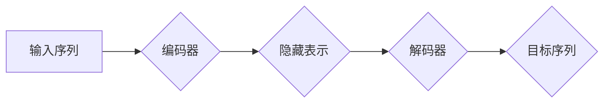

## Transformer大模型实战 训练Transformer

> 关键词：Transformer, 大模型, 自然语言处理, 序列到序列, self-attention, 预训练, fine-tuning

### 1. 背景介绍

近年来，深度学习在自然语言处理 (NLP) 领域取得了突破性进展，其中 Transformer 架构扮演着至关重要的角色。Transformer 模型凭借其强大的序列建模能力和并行计算效率，在机器翻译、文本摘要、问答系统等任务上取得了显著的成绩，成为 NLP 领域的主流架构。

传统的循环神经网络 (RNN) 在处理长序列数据时存在梯度消失和计算效率低的问题。Transformer 模型通过引入自注意力机制 (self-attention) 和多头注意力机制 (multi-head attention)，有效解决了这些问题。自注意力机制能够捕捉序列中不同词之间的依赖关系，而多头注意力机制则通过多个注意力头来学习不同层次的语义信息，从而提升模型的表达能力。

### 2. 核心概念与联系

#### 2.1 Transformer 架构

Transformer 模型主要由以下几个部分组成：

* **编码器 (Encoder):** 用于将输入序列映射到一个隐藏表示。编码器由多个相同的编码器层堆叠而成，每个编码器层包含多头注意力机制、前馈神经网络 (FFN) 和残差连接 (Residual Connection)。
* **解码器 (Decoder):** 用于根据编码器的输出生成目标序列。解码器也由多个相同的解码器层堆叠而成，每个解码器层包含多头注意力机制、前馈神经网络和残差连接。解码器还包含一个掩码机制 (Mask) 来防止模型在生成目标序列时看到未来的信息。
* **位置编码 (Positional Encoding):** Transformer 模型没有像 RNN 那样处理序列顺序信息，因此需要使用位置编码来为每个词添加位置信息。

#### 2.2 Mermaid 流程图



#### 2.3 自注意力机制

自注意力机制能够捕捉序列中不同词之间的依赖关系。对于一个序列中的每个词，自注意力机制会计算它与所有其他词之间的注意力权重，然后根据这些权重对所有词进行加权求和，从而得到一个新的表示。

### 3. 核心算法原理 & 具体操作步骤

#### 3.1 算法原理概述

Transformer 模型的核心算法是自注意力机制和多头注意力机制。自注意力机制能够捕捉序列中不同词之间的依赖关系，而多头注意力机制则通过多个注意力头来学习不同层次的语义信息。

#### 3.2 算法步骤详解

1. **输入嵌入:** 将输入序列中的每个词转换为一个词向量。
2. **位置编码:** 为每个词向量添加位置信息。
3. **多头注意力:** 对输入序列中的每个词向量进行多头注意力计算，得到每个词的上下文表示。
4. **前馈神经网络:** 对每个词的上下文表示进行前馈神经网络处理，得到更丰富的语义信息。
5. **残差连接:** 将多头注意力输出和前馈神经网络输出进行残差连接，防止梯度消失。
6. **重复步骤 3-5:** 对编码器和解码器中的所有层重复上述步骤，从而得到最终的隐藏表示和目标序列。

#### 3.3 算法优缺点

**优点:**

* 能够有效捕捉序列中不同词之间的依赖关系。
* 并行计算效率高，可以处理长序列数据。
* 表达能力强，在各种 NLP 任务上取得了优异的成绩。

**缺点:**

* 参数量大，训练成本高。
* 对于短序列数据，效果可能不如 RNN。

#### 3.4 算法应用领域

Transformer 模型在以下领域具有广泛的应用:

* 机器翻译
* 文本摘要
* 问答系统
* 语义理解
* 代码生成

### 4. 数学模型和公式 & 详细讲解 & 举例说明

#### 4.1 数学模型构建

Transformer 模型的数学模型主要基于线性变换、激活函数和注意力机制。

#### 4.2 公式推导过程

* **注意力机制:**

$$
Attention(Q, K, V) = softmax(\frac{QK^T}{\sqrt{d_k}})V
$$

其中，Q、K、V 分别代表查询矩阵、键矩阵和值矩阵，$d_k$ 代表键向量的维度。

* **多头注意力机制:**

$$
MultiHead(Q, K, V) = Concat(head_1, head_2,..., head_h)W_O
$$

其中，$head_i$ 代表第 i 个注意力头的输出，h 代表注意力头的数量，$W_O$ 代表一个线性变换矩阵。

* **前馈神经网络:**

$$
FFN(x) = \max(0, xW_1 + b_1)W_2 + b_2
$$

其中，x 代表输入向量，$W_1$、$b_1$、$W_2$、$b_2$ 分别代表前馈神经网络的权重和偏置。

#### 4.3 案例分析与讲解

假设我们有一个句子 "The cat sat on the mat"，我们使用 Transformer 模型对其进行编码。

1. 首先，我们将每个词转换为词向量。
2. 然后，我们将位置编码添加到每个词向量中。
3. 接下来，我们将词向量输入到编码器中，编码器会使用多头注意力机制和前馈神经网络来学习句子中的语义信息。
4. 最后，编码器会输出一个隐藏表示，这个隐藏表示包含了句子的语义信息。

### 5. 项目实践：代码实例和详细解释说明

#### 5.1 开发环境搭建

* Python 3.6+
* PyTorch 1.0+
* CUDA 10.0+ (可选)

#### 5.2 源代码详细实现

```python
import torch
import torch.nn as nn

class Transformer(nn.Module):
    def __init__(self, vocab_size, embedding_dim, num_heads, num_layers, ff_dim):
        super(Transformer, self).__init__()
        self.embedding = nn.Embedding(vocab_size, embedding_dim)
        self.encoder = nn.TransformerEncoder(nn.TransformerEncoderLayer(embedding_dim, num_heads, ff_dim), num_layers)
        self.decoder = nn.TransformerDecoder(nn.TransformerDecoderLayer(embedding_dim, num_heads, ff_dim), num_layers)
        self.linear = nn.Linear(embedding_dim, vocab_size)

    def forward(self, src, tgt, src_mask, tgt_mask):
        src = self.embedding(src)
        tgt = self.embedding(tgt)
        encoder_output = self.encoder(src, src_mask)
        decoder_output = self.decoder(tgt, encoder_output, tgt_mask)
        output = self.linear(decoder_output)
        return output
```

#### 5.3 代码解读与分析

* `__init__` 方法初始化模型参数，包括词嵌入层、编码器和解码器。
* `forward` 方法定义模型的正向传播过程，包括词嵌入、编码和解码。
* `nn.TransformerEncoder` 和 `nn.TransformerDecoder` 是 PyTorch 中的 Transformer 编码器和解码器模块。
* `nn.TransformerEncoderLayer` 和 `nn.TransformerDecoderLayer` 是 Transformer 编码器和解码器层的模块。
* `src_mask` 和 `tgt_mask` 是掩码矩阵，用于防止模型在生成目标序列时看到未来的信息。

#### 5.4 运行结果展示

训练完成后，我们可以使用模型对新的输入序列进行预测。例如，我们可以输入句子 "The dog is on the"，模型会预测下一个词是 "floor"。

### 6. 实际应用场景

#### 6.1 机器翻译

Transformer 模型在机器翻译领域取得了显著的成果，例如 Google 的 BERT 和 Facebook 的 BART 模型。

#### 6.2 文本摘要

Transformer 模型可以用于生成文本摘要，例如 OpenAI 的 GPT-3 模型。

#### 6.3 问答系统

Transformer 模型可以用于构建问答系统，例如 Microsoft 的 Turing 模型。

#### 6.4 未来应用展望

Transformer 模型在未来将有更广泛的应用，例如：

* 代码生成
* 图像识别
* 语音识别

### 7. 工具和资源推荐

#### 7.1 学习资源推荐

* **论文:**

    * "Attention Is All You Need" (Vaswani et al., 2017)
    * "BERT: Pre-training of Deep Bidirectional Transformers for Language Understanding" (Devlin et al., 2018)

* **博客:**

    * The Illustrated Transformer (Jay Alammar)
    * Transformer Explained Simply (Analytics Vidhya)

#### 7.2 开发工具推荐

* **PyTorch:** 深度学习框架
* **Hugging Face Transformers:** Transformer 模型库

#### 7.3 相关论文推荐

* "XLNet: Generalized Autoregressive Pretraining for Language Understanding" (Yang et al., 2019)
* "T5: Text-to-Text Transfer Transformer" (Raffel et al., 2019)

### 8. 总结：未来发展趋势与挑战

#### 8.1 研究成果总结

Transformer 模型在 NLP 领域取得了突破性进展，其强大的序列建模能力和并行计算效率使其成为主流架构。

#### 8.2 未来发展趋势

* **模型规模:** 预计 Transformer 模型的规模将继续扩大，从而提升模型的表达能力。
* **高效训练:** 研究人员将继续探索高效训练 Transformer 模型的方法，例如模型压缩和知识蒸馏。
* **多模态:** Transformer 模型将被扩展到多模态领域，例如文本-图像和文本-音频。

#### 8.3 面临的挑战

* **计算资源:** 训练大型 Transformer 模型需要大量的计算资源。
* **数据标注:** 训练 Transformer 模型需要大量的标注数据。
* **可解释性:** Transformer 模型的决策过程难以解释。

#### 8.4 研究展望

未来研究将集中在解决 Transformer 模型面临的挑战，例如开发更有效的训练方法、探索新的应用场景和提升模型的可解释性。

### 9. 附录：常见问题与解答

* **Q: Transformer 模型为什么比 RNN 模型更好？**

    A: Transformer 模型能够有效捕捉序列中不同词之间的依赖关系，并具有并行计算效率高，可以处理长序列数据等优点。

* **Q: 如何训练 Transformer 模型？**

    A: 训练 Transformer 模型需要大量的标注数据和计算资源。可以使用 PyTorch 或 TensorFlow 等深度学习框架进行训练。

* **Q: Transformer 模型有哪些应用场景？**

    A: Transformer 模型在机器翻译、文本摘要、问答系统等 NLP 任务上具有广泛的应用。

作者：禅与计算机程序设计艺术 / Zen and the Art of Computer Programming


