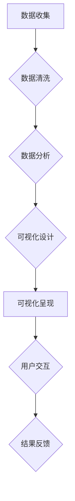

## 【AI大数据计算原理与代码实例讲解】数据可视化

> 关键词：数据可视化、大数据、AI、机器学习、Python、Matplotlib、Seaborn、Tableau

## 1. 背景介绍

在海量数据时代，数据可视化作为一种重要的数据分析和探索工具，发挥着越来越重要的作用。它能够将复杂的数据转化为直观易懂的图形和图表，帮助我们快速理解数据趋势、发现隐藏模式和做出更明智的决策。

数据可视化在各个领域都有广泛的应用，例如：

* **商业领域:** 分析市场趋势、客户行为、销售数据等，帮助企业制定更有效的营销策略。
* **科学研究:** 可视化实验数据、研究结果，帮助科学家发现新的规律和知识。
* **医疗领域:** 可视化患者数据、疾病传播情况，帮助医生诊断疾病、制定治疗方案。
* **教育领域:** 可视化学习内容、学生成绩等，帮助学生更好地理解知识和掌握学习方法。

随着人工智能和大数据的快速发展，数据可视化也迎来了新的挑战和机遇。

## 2. 核心概念与联系

数据可视化是一个多学科交叉的领域，涉及到计算机科学、统计学、心理学等多个领域。其核心概念包括：

* **数据:** 数据可视化的基础，可以是结构化数据、非结构化数据或半结构化数据。
* **可视化:** 将数据转化为图形和图表，以便人类更容易理解和分析。
* **交互:** 用户可以与可视化进行交互，例如放大、缩小、筛选数据等，以更深入地探索数据。

数据可视化流程通常包括以下几个步骤：



## 3. 核心算法原理 & 具体操作步骤

### 3.1  算法原理概述

数据可视化算法主要用于数据编码、图形生成和交互处理等方面。常见的算法包括：

* **数据编码算法:** 将数据映射到图形元素的属性，例如颜色、大小、形状等。常用的编码算法包括分层编码、连续编码、分类编码等。
* **图形生成算法:** 根据数据编码结果生成图形和图表，例如折线图、柱状图、散点图等。常用的生成算法包括投影算法、布局算法、动画算法等。
* **交互处理算法:** 处理用户与可视化之间的交互，例如鼠标点击、拖动、缩放等。常用的处理算法包括事件处理、数据过滤、视图更新等。

### 3.2  算法步骤详解

以下以柱状图为例，详细说明数据可视化算法的具体操作步骤：

1. **数据准备:** 收集和清洗数据，确定需要可视化的指标和类别。
2. **数据编码:** 将数据映射到柱状图的属性，例如高度代表数值大小，颜色代表类别。
3. **图形生成:** 根据数据编码结果生成柱状图，确定柱状图的宽度、高度、颜色等属性。
4. **交互处理:** 实现用户与柱状图的交互，例如点击柱状图查看详细数据、拖动柱状图排序数据等。

### 3.3  算法优缺点

数据可视化算法各有优缺点，需要根据具体应用场景选择合适的算法。

* **优点:**

    * 可以直观地展示数据趋势和模式。
    * 可以帮助用户快速理解复杂数据。
    * 可以促进用户之间的沟通和协作。

* **缺点:**

    * 数据可视化算法的复杂度较高，需要一定的技术基础。
    * 数据可视化结果容易受到人为因素的影响。
    * 数据可视化结果可能存在误导性。

### 3.4  算法应用领域

数据可视化算法广泛应用于各个领域，例如：

* **商业分析:** 分析销售数据、市场趋势、客户行为等。
* **科学研究:** 可视化实验数据、研究结果、模型预测等。
* **医疗诊断:** 可视化患者数据、疾病传播情况、医学影像等。
* **教育教学:** 可视化学习内容、学生成绩、教学效果等。

## 4. 数学模型和公式 & 详细讲解 & 举例说明

### 4.1  数学模型构建

数据可视化中的数学模型主要用于数据编码、图形生成和交互处理等方面。例如，在柱状图中，柱状图的高度可以根据数据值进行线性映射，可以使用以下公式表示：

$$
h = k * v
$$

其中：

* $h$ 表示柱状图的高度。
* $k$ 表示比例系数，用于调整柱状图的高度。
* $v$ 表示数据值。

### 4.2  公式推导过程

以上公式的推导过程如下：

1. 假设数据值范围为 $[min, max]$。
2. 假设柱状图的高度范围为 $[min_h, max_h]$。
3. 则比例系数 $k$ 可以计算为：

$$
k = \frac{max_h - min_h}{max - min}
$$

4. 将数据值 $v$ 代入公式，即可得到柱状图的高度 $h$。

### 4.3  案例分析与讲解

例如，假设数据值范围为 $[0, 100]$，柱状图的高度范围为 $[0, 500]$，则比例系数 $k$ 为：

$$
k = \frac{500 - 0}{100 - 0} = 5
$$

当数据值为 25 时，柱状图的高度为：

$$
h = 5 * 25 = 125
$$

## 5. 项目实践：代码实例和详细解释说明

### 5.1  开发环境搭建

本项目使用 Python 语言进行开发，需要安装以下软件：

* Python 3.x
* Matplotlib
* Seaborn

可以使用 pip 命令安装：

```bash
pip install matplotlib seaborn
```

### 5.2  源代码详细实现

以下代码示例展示了如何使用 Matplotlib 库绘制柱状图：

```python
import matplotlib.pyplot as plt
import numpy as np

# 数据
categories = ['A', 'B', 'C', 'D']
values = [15, 28, 12, 25]

# 绘制柱状图
plt.bar(categories, values)

# 设置标题和标签
plt.title('柱状图示例')
plt.xlabel('类别')
plt.ylabel('数值')

# 显示图形
plt.show()
```

### 5.3  代码解读与分析

* `import matplotlib.pyplot as plt`: 导入 Matplotlib 库，并使用别名 `plt` 进行引用。
* `import numpy as np`: 导入 NumPy 库，并使用别名 `np` 进行引用。
* `categories = ['A', 'B', 'C', 'D']`: 定义柱状图的类别。
* `values = [15, 28, 12, 25]`: 定义每个类别的数值。
* `plt.bar(categories, values)`: 使用 `bar()` 函数绘制柱状图，第一个参数为类别，第二个参数为数值。
* `plt.title('柱状图示例')`: 设置图形标题。
* `plt.xlabel('类别')`: 设置 x 轴标签。
* `plt.ylabel('数值')`: 设置 y 轴标签。
* `plt.show()`: 显示图形。

### 5.4  运行结果展示

运行以上代码，将生成一个简单的柱状图，展示每个类别的数值大小。

## 6. 实际应用场景

数据可视化在各个领域都有广泛的应用场景，例如：

* **商业分析:** 使用柱状图、折线图等可视化工具分析销售数据、市场趋势、客户行为等，帮助企业制定更有效的营销策略。
* **科学研究:** 使用散点图、热力图等可视化工具可视化实验数据、研究结果、模型预测等，帮助科学家发现新的规律和知识。
* **医疗诊断:** 使用饼图、地图等可视化工具可视化患者数据、疾病传播情况、医学影像等，帮助医生诊断疾病、制定治疗方案。
* **教育教学:** 使用图表、动画等可视化工具可视化学习内容、学生成绩、教学效果等，帮助学生更好地理解知识和掌握学习方法。

### 6.4  未来应用展望

随着人工智能和大数据的快速发展，数据可视化将迎来更加广泛的应用场景和发展机遇。例如：

* **个性化数据可视化:** 根据用户的需求和偏好，定制个性化的可视化方案。
* **交互式数据可视化:** 实现更加丰富的用户交互，例如拖动、缩放、筛选数据等，帮助用户更深入地探索数据。
* **人工智能驱动的可视化:** 利用人工智能算法自动生成可视化方案，提高可视化效率和质量。

## 7. 工具和资源推荐

### 7.1  学习资源推荐

* **书籍:**

    * 《数据可视化：设计与实践》
    * 《Storytelling with Data: A Data Visualization Guide for Business Professionals》

* **在线课程:**

    * Coursera: Data Visualization Specialization
    * edX: Data Visualization

### 7.2  开发工具推荐

* **Matplotlib:** Python 的数据可视化库，功能强大，可生成各种类型的图形。
* **Seaborn:** 基于 Matplotlib 的高级数据可视化库，提供更直观的图形风格和更易于使用的 API。
* **Tableau:** 商业数据可视化工具，功能丰富，易于使用。
* **Power BI:** 微软的商业数据可视化工具，与 Office 生态系统集成。

### 7.3  相关论文推荐

* **The Visual Display of Quantitative Information** by Edward Tufte
* **Information Visualization: Perception for Design** by Ben Shneiderman

## 8. 总结：未来发展趋势与挑战

### 8.1  研究成果总结

数据可视化领域取得了显著的进展，从传统的静态图表到交互式可视化、人工智能驱动的可视化，不断发展和创新。

### 8.2  未来发展趋势

未来数据可视化将朝着以下几个方向发展：

* **更智能化:** 利用人工智能算法自动生成可视化方案，提高可视化效率和质量。
* **更个性化:** 根据用户的需求和偏好，定制个性化的可视化方案。
* **更沉浸式:** 使用虚拟现实、增强现实等技术，打造更加沉浸式的可视化体验。

### 8.3  面临的挑战

数据可视化领域也面临着一些挑战，例如：

* **数据爆炸:** 海量数据的处理和可视化仍然是一个难题。
* **可解释性:** 一些复杂的可视化方案难以解释，需要提高可解释性。
* **伦理问题:** 数据可视化可能存在误导性，需要关注伦理问题。

### 8.4  研究展望

未来数据可视化研究将继续探索以下方向：

* **大数据可视化:** 研究处理海量数据的可视化方法。
* **可解释性可视化:** 研究如何提高可视化方案的可解释性。
* **交互式可视化:** 研究更加丰富的用户交互方式。
* **人工智能驱动的可视化:** 研究利用人工智能算法自动生成可视化方案。

## 9. 附录：常见问题与解答

### 9.1  常见问题

* **如何选择合适的可视化工具？**

选择合适的可视化工具需要根据具体应用场景、数据类型、用户需求等因素进行考虑。

* **如何设计有效的可视化方案？**

设计有效的可视化方案需要遵循以下原则：

    * 清晰、简洁、直观。
    * 突出重点信息。
    * 易于理解和解释。

* **如何避免数据可视