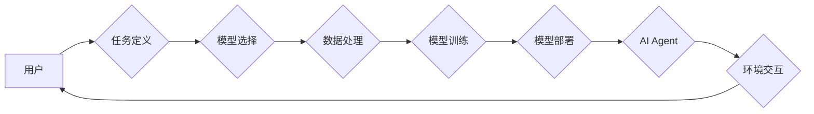

## 【大模型应用开发 动手做AI Agent】AutoGen

> 关键词：大模型、AI Agent、AutoGen、应用开发、自然语言处理、代码生成、自动化

### 1. 背景介绍

近年来，大模型技术取得了飞速发展，其强大的泛化能力和表示能力为人工智能领域带来了革命性的变革。从文本生成、机器翻译到代码编写、图像创作，大模型已在众多领域展现出令人惊叹的应用潜力。

然而，仅仅拥有强大的模型能力还不够。将大模型应用于实际场景，构建真正智能的AI Agent，需要深入理解模型的原理，并将其与特定任务和应用场景相结合。

AutoGen项目正是基于这一理念而生。它旨在提供一套完整的工具和框架，帮助开发者轻松构建基于大模型的AI Agent，并将其应用于各种实际场景。

### 2. 核心概念与联系

#### 2.1  大模型

大模型是指参数量达到数亿甚至数十亿的深度学习模型。它们通过海量数据进行训练，学习了丰富的语言知识和模式，从而能够执行各种复杂的任务。

#### 2.2  AI Agent

AI Agent是指能够感知环境、做出决策并执行行动的智能体。它通常由以下几个部分组成：

* **感知模块:** 收集环境信息，例如文本、图像、音频等。
* **推理模块:** 分析环境信息，做出决策。
* **执行模块:** 执行决策，与环境交互。

#### 2.3  AutoGen框架

AutoGen框架提供了一套完整的工具和机制，帮助开发者构建AI Agent。它包括以下几个关键部分：

* **模型选择:** 提供多种大模型选择，例如GPT-3、BERT等。
* **任务定义:** 支持多种任务类型，例如文本生成、对话系统、代码生成等。
* **数据处理:** 提供数据预处理、清洗和转换工具。
* **模型训练:** 提供模型训练和调优工具。
* **部署与监控:** 支持模型部署和监控。

**AutoGen框架架构图**



### 3. 核心算法原理 & 具体操作步骤

#### 3.1  算法原理概述

AutoGen框架的核心算法是基于Transformer模型的序列生成算法。Transformer模型是一种强大的深度学习模型，能够有效地处理序列数据，例如文本和代码。

序列生成算法的工作原理是：

1. 将输入序列转换为向量表示。
2. 使用Transformer模型对向量表示进行编码和解码。
3. 根据解码结果生成输出序列。

#### 3.2  算法步骤详解

1. **数据预处理:** 将输入数据进行清洗、格式化和编码，转换为模型可以理解的格式。
2. **模型编码:** 将预处理后的数据输入Transformer模型的编码器，编码器会将数据转换为隐藏状态表示。
3. **模型解码:** 将隐藏状态表示输入Transformer模型的解码器，解码器会根据隐藏状态生成输出序列。
4. **输出解码:** 将解码器生成的输出序列解码，转换为人类可读的格式。

#### 3.3  算法优缺点

**优点:**

* 能够处理长序列数据。
* 具有强大的泛化能力。
* 可以并行训练，提高训练效率。

**缺点:**

* 训练成本高。
* 模型参数量大，需要大量的计算资源。

#### 3.4  算法应用领域

* 文本生成: 写作、翻译、摘要等。
* 代码生成: 自动生成代码片段、完成代码补全等。
* 对话系统: 构建聊天机器人、虚拟助手等。
* 其他: 音乐创作、图像生成等。

### 4. 数学模型和公式 & 详细讲解 & 举例说明

#### 4.1  数学模型构建

AutoGen框架的核心数学模型是Transformer模型。Transformer模型基于注意力机制，能够捕捉序列数据中的长距离依赖关系。

#### 4.2  公式推导过程

Transformer模型的注意力机制使用以下公式计算注意力权重：

$$
\text{Attention}(Q, K, V) = \text{softmax}\left(\frac{QK^T}{\sqrt{d_k}}\right)V
$$

其中：

* $Q$ 是查询矩阵。
* $K$ 是键矩阵。
* $V$ 是值矩阵。
* $d_k$ 是键向量的维度。

#### 4.3  案例分析与讲解

例如，在文本生成任务中，输入文本序列会被编码成隐藏状态表示。然后，解码器会使用注意力机制计算每个输出词与输入序列的注意力权重，从而生成下一个词。

### 5. 项目实践：代码实例和详细解释说明

#### 5.1  开发环境搭建

AutoGen框架支持多种开发环境，例如Python、Java等。

#### 5.2  源代码详细实现

```python
# 代码示例：使用AutoGen框架生成文本

from autogen import AutoGen

# 初始化AutoGen框架
autogen = AutoGen(model_name="gpt-3")

# 定义文本生成任务
task = {
    "type": "text-generation",
    "prompt": "写一篇关于人工智能的文章",
}

# 生成文本
text = autogen.generate(task)

# 打印生成的文本
print(text)
```

#### 5.3  代码解读与分析

* `from autogen import AutoGen`: 导入AutoGen框架。
* `autogen = AutoGen(model_name="gpt-3")`: 初始化AutoGen框架，选择GPT-3模型。
* `task = {"type": "text-generation", "prompt": "写一篇关于人工智能的文章"}`: 定义文本生成任务，包括任务类型和提示文本。
* `text = autogen.generate(task)`: 使用AutoGen框架生成文本。
* `print(text)`: 打印生成的文本。

#### 5.4  运行结果展示

运行上述代码，将输出一篇关于人工智能的文章。

### 6. 实际应用场景

#### 6.1  文本生成

AutoGen可以用于生成各种类型的文本，例如：

* 文章、博客文章、小说
* 广告文案、营销邮件
* 代码注释、技术文档

#### 6.2  对话系统

AutoGen可以用于构建聊天机器人和虚拟助手，例如：

* 客户服务机器人
* 教育机器人
* 游戏角色

#### 6.3  代码生成

AutoGen可以用于自动生成代码片段，例如：

* 函数定义、类声明
* 数据库操作语句
* Web页面代码

#### 6.4  未来应用展望

随着大模型技术的不断发展，AutoGen框架将在更多领域得到应用，例如：

* 人工智能辅助创作
* 个性化教育
* 智能医疗

### 7. 工具和资源推荐

#### 7.1  学习资源推荐

* **论文:**

    * Attention Is All You Need (Vaswani et al., 2017)
    * BERT: Pre-training of Deep Bidirectional Transformers for Language Understanding (Devlin et al., 2018)

* **博客:**

    * The Illustrated Transformer (Jay Alammar)
    * OpenAI Blog

#### 7.2  开发工具推荐

* **Python:**

    * TensorFlow
    * PyTorch

* **云平台:**

    * Google Cloud AI Platform
    * Amazon SageMaker
    * Microsoft Azure AI

#### 7.3  相关论文推荐

* **Transformer模型:**

    * Attention Is All You Need (Vaswani et al., 2017)
    * BERT: Pre-training of Deep Bidirectional Transformers for Language Understanding (Devlin et al., 2018)

* **大模型应用:**

    * GPT-3: Language Models are Few-Shot Learners (Brown et al., 2020)
    * T5: Text-to-Text Transfer Transformer (Raffel et al., 2019)

### 8. 总结：未来发展趋势与挑战

#### 8.1  研究成果总结

AutoGen框架为构建基于大模型的AI Agent提供了便捷的工具和机制。它能够帮助开发者快速构建并部署各种类型的AI Agent，并将其应用于实际场景。

#### 8.2  未来发展趋势

* **模型规模和能力提升:** 未来大模型的规模和能力将继续提升，从而带来更强大的AI Agent。
* **多模态AI Agent:** 未来AI Agent将能够处理多种模态数据，例如文本、图像、音频等。
* **个性化AI Agent:** 未来AI Agent将能够根据用户的需求和偏好进行个性化定制。

#### 8.3  面临的挑战

* **数据安全和隐私:** 大模型的训练需要大量数据，如何保证数据安全和隐私是一个重要的挑战。
* **模型解释性和可控性:** 大模型的决策过程往往难以解释，如何提高模型的解释性和可控性是一个重要的研究方向。
* **伦理问题:** AI Agent的应用可能会带来一些伦理问题，例如算法偏见、工作岗位替代等，需要引起足够的重视。

#### 8.4  研究展望

未来，AutoGen框架将继续发展和完善，为开发者提供更强大的工具和机制，推动AI Agent技术的发展和应用。


### 9. 附录：常见问题与解答

* **Q: AutoGen框架支持哪些编程语言？**

    A: AutoGen框架目前支持Python语言。

* **Q: AutoGen框架需要哪些硬件资源？**

    A: AutoGen框架的硬件资源需求取决于模型的规模和任务的复杂度。一般来说，需要配备GPU加速器才能高效训练大模型。

* **Q: 如何获取AutoGen框架的源代码？**

    A: AutoGen框架的源代码可以在GitHub上获取。

* **Q: AutoGen框架有哪些应用案例？**

    A: AutoGen框架的应用案例包括文本生成、对话系统、代码生成等。

作者：禅与计算机程序设计艺术 / Zen and the Art of Computer Programming 


