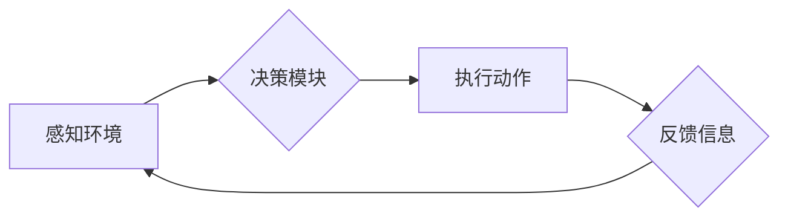

## 交通管理中AI代理的工作流程与应用

> 关键词：AI代理、交通管理、智能交通、机器学习、强化学习、路径规划、交通流量优化

## 1. 背景介绍

随着城市化进程的加速和交通拥堵问题的日益严峻，传统的交通管理模式已难以满足现代社会对高效、安全、便捷的交通需求。人工智能（AI）技术作为一种新兴技术，为交通管理领域带来了新的机遇和挑战。其中，AI代理作为一种智能化决策和控制机制，在交通管理中展现出巨大的潜力。

AI代理是指能够自主学习、决策和执行任务的智能体，它可以模拟人类的行为模式，并根据环境信息做出最优选择。在交通管理领域，AI代理可以应用于各种场景，例如：

* **智能交通信号灯控制:** AI代理可以根据实时交通流量数据，动态调整信号灯的绿灯时间，从而优化交通流量，减少拥堵。
* **自动驾驶车辆路径规划:** AI代理可以根据道路环境、交通规则和目标位置，规划最优的驾驶路径，提高驾驶效率和安全性。
* **公共交通调度优化:** AI代理可以根据乘客需求、车辆位置和交通状况，优化公共交通车辆的调度方案，提高服务效率和乘客满意度。
* **交通事故预警和预防:** AI代理可以分析道路环境和车辆行为数据，识别潜在的交通事故风险，并及时发出预警，从而降低事故发生率。

## 2. 核心概念与联系

### 2.1 AI代理的概念

AI代理是一个能够感知环境、做出决策并执行动作的智能体。它通常由以下几个核心组件组成：

* **感知模块:** 用于收集环境信息，例如道路状况、交通流量、车辆位置等。
* **决策模块:** 基于感知信息和预先设定目标，选择最优的行动方案。
* **执行模块:** 将决策转化为实际动作，例如控制车辆方向、速度、信号灯等。
* **学习模块:** 通过经验积累和数据分析，不断优化决策策略，提高代理的智能化水平。

### 2.2 交通管理中的AI代理应用

在交通管理领域，AI代理可以被视为智能交通系统中的核心组件，负责协调和控制交通流量，实现高效、安全、便捷的交通运行。

**Mermaid 流程图:**



## 3. 核心算法原理 & 具体操作步骤

### 3.1 算法原理概述

交通管理中的AI代理通常采用强化学习算法进行训练，强化学习是一种机器学习方法，通过奖励机制引导代理学习最优策略。

在强化学习中，代理与环境进行交互，根据环境反馈的信息，选择行动并获得奖励或惩罚。通过不断地试错和学习，代理最终能够找到最优的策略，以最大化累积奖励。

### 3.2 算法步骤详解

1. **环境建模:** 建立交通环境的数学模型，包括道路网络、车辆、交通信号灯等要素。
2. **状态空间定义:** 定义代理感知的环境状态，例如道路拥堵程度、车辆位置、信号灯状态等。
3. **动作空间定义:** 定义代理可以执行的动作，例如加速、减速、转向、变道等。
4. **奖励函数设计:** 设计一个奖励函数，根据代理的行为和环境状态，给予相应的奖励或惩罚。
5. **强化学习算法训练:** 使用强化学习算法，例如Q学习、SARSA等，训练代理学习最优策略。
6. **策略评估和优化:** 评估代理学习到的策略，并根据评估结果进行策略优化。

### 3.3 算法优缺点

**优点:**

* **能够学习复杂环境:** 强化学习算法能够学习复杂、动态的交通环境，并找到最优的策略。
* **适应性强:** 强化学习算法能够根据环境变化动态调整策略，提高适应性。
* **自主性强:** 强化学习算法能够使代理自主决策，减少人工干预。

**缺点:**

* **训练时间长:** 强化学习算法的训练过程通常需要大量的时间和数据。
* **奖励函数设计困难:** 设计一个合适的奖励函数是强化学习的关键，但往往比较困难。
* **数据依赖性强:** 强化学习算法需要大量的数据进行训练，数据质量直接影响算法性能。

### 3.4 算法应用领域

强化学习算法在交通管理领域有着广泛的应用，例如：

* **智能交通信号灯控制:** 优化信号灯的绿灯时间，减少拥堵。
* **自动驾驶车辆路径规划:** 规划最优的驾驶路径，提高驾驶效率和安全性。
* **公共交通调度优化:** 优化公共交通车辆的调度方案，提高服务效率和乘客满意度。
* **交通流量预测:** 预测未来交通流量，为交通管理提供决策依据。

## 4. 数学模型和公式 & 详细讲解 & 举例说明

### 4.1 数学模型构建

交通管理中的AI代理通常采用马尔可夫决策过程（MDP）模型进行建模。MDP模型由以下几个要素组成：

* **状态空间 (S):** 表示代理可以处的环境状态集合。例如，道路拥堵程度、车辆位置、信号灯状态等。
* **动作空间 (A):** 表示代理可以执行的动作集合。例如，加速、减速、转向、变道等。
* **转移概率 (P):** 表示从一个状态到另一个状态的概率，取决于代理执行的动作。
* **奖励函数 (R):** 表示代理在某个状态执行某个动作后获得的奖励或惩罚。

### 4.2 公式推导过程

强化学习算法的目标是找到一个最优策略 π，使得代理在与环境交互的过程中，累积的奖励最大化。

最优策略 π 可以通过 Bellman 方程进行推导：

$$
V^*(s) = \max_a \sum_{s'} P(s'|s,a) [R(s,a,s') + \gamma V^*(s')]
$$

其中：

* $V^*(s)$ 表示状态 $s$ 的最优价值函数。
* $a$ 表示代理可以执行的动作。
* $s'$ 表示状态 $s$ 执行动作 $a$ 后可能到达的状态。
* $P(s'|s,a)$ 表示从状态 $s$ 执行动作 $a$ 后到达状态 $s'$ 的概率。
* $R(s,a,s')$ 表示在状态 $s$ 执行动作 $a$ 后到达状态 $s'$ 获得的奖励。
* $\gamma$ 表示折扣因子，控制未来奖励的权重。

### 4.3 案例分析与讲解

例如，在智能交通信号灯控制场景中，状态空间可以包含道路拥堵程度、车辆数量、信号灯状态等信息。动作空间可以包含调整绿灯时间、红灯时间等操作。奖励函数可以设计为减少车辆等待时间、减少拥堵程度等目标。

通过强化学习算法训练，AI代理可以学习到最优的信号灯控制策略，从而优化交通流量，减少拥堵。

## 5. 项目实践：代码实例和详细解释说明

### 5.1 开发环境搭建

* **操作系统:** Ubuntu 20.04 LTS
* **编程语言:** Python 3.8
* **深度学习框架:** TensorFlow 2.0
* **其他工具:** Jupyter Notebook, Git

### 5.2 源代码详细实现

```python
import tensorflow as tf

# 定义状态空间和动作空间
state_space = 10  # 道路拥堵程度
action_space = 5  # 信号灯控制动作

# 定义神经网络模型
model = tf.keras.Sequential([
    tf.keras.layers.Dense(64, activation='relu', input_shape=(state_space,)),
    tf.keras.layers.Dense(32, activation='relu'),
    tf.keras.layers.Dense(action_space)
])

# 定义损失函数和优化器
loss_fn = tf.keras.losses.MeanSquaredError()
optimizer = tf.keras.optimizers.Adam()

# 训练模型
for epoch in range(100):
    # 训练数据
    states =...
    actions =...
    rewards =...

    with tf.GradientTape() as tape:
        predictions = model(states)
        loss = loss_fn(actions, predictions)

    gradients = tape.gradient(loss, model.trainable_variables)
    optimizer.apply_gradients(zip(gradients, model.trainable_variables))

# 评估模型
#...
```

### 5.3 代码解读与分析

* 代码首先定义了状态空间和动作空间，即代理可以感知的环境状态和可以执行的动作。
* 然后定义了一个神经网络模型，用于学习最优策略。
* 模型使用深度学习框架 TensorFlow 实现，包含多个全连接层和激活函数。
* 损失函数和优化器用于训练模型，目标是使模型预测的动作与实际动作尽可能接近。
* 训练过程循环迭代，不断更新模型参数，直到模型性能达到预期水平。

### 5.4 运行结果展示

* 训练完成后，可以评估模型的性能，例如使用测试数据计算预测准确率。
* 也可以将训练好的模型应用于实际场景，例如控制智能交通信号灯。

## 6. 实际应用场景

### 6.1 智能交通信号灯控制

AI代理可以根据实时交通流量数据，动态调整信号灯的绿灯时间，从而优化交通流量，减少拥堵。例如，在高峰时段，AI代理可以延长绿灯时间，优先保障车辆通行；在非高峰时段，AI代理可以缩短绿灯时间，提高信号灯周期的效率。

### 6.2 自动驾驶车辆路径规划

AI代理可以根据道路环境、交通规则和目标位置，规划最优的驾驶路径，提高驾驶效率和安全性。例如，在拥堵路段，AI代理可以避开拥堵区域，选择更短的路径；在复杂路况下，AI代理可以根据周围车辆的运动轨迹，做出更安全的驾驶决策。

### 6.3 公共交通调度优化

AI代理可以根据乘客需求、车辆位置和交通状况，优化公共交通车辆的调度方案，提高服务效率和乘客满意度。例如，AI代理可以根据乘客的出行需求，调整公交车线路和班次；可以根据车辆位置和交通状况，优化公交车行驶路线，减少行驶时间。

### 6.4 未来应用展望

随着人工智能技术的不断发展，AI代理在交通管理领域的应用前景更加广阔。未来，AI代理可以应用于更多场景，例如：

* **交通事故预警和预防:** AI代理可以分析道路环境和车辆行为数据，识别潜在的交通事故风险，并及时发出预警，从而降低事故发生率。
* **智能交通管理中心:** AI代理可以作为智能交通管理中心的核心组件，协调和控制整个交通系统，实现更加高效、安全、便捷的交通运行。
* **个性化交通服务:** AI代理可以根据用户的出行习惯和需求，提供个性化的交通服务，例如推荐最佳出行路线、预订交通工具等。

## 7. 工具和资源推荐

### 7.1 学习资源推荐

* **书籍:**
    * 《Reinforcement Learning: An Introduction》 by Richard S. Sutton and Andrew G. Barto
    * 《Deep Reinforcement Learning Hands-On》 by Maxim Lapan
* **在线课程:**
    * Coursera: Reinforcement Learning Specialization
    * Udacity: Deep Reinforcement Learning Nanodegree
* **博客和网站:**
    * OpenAI Blog
    * DeepMind Blog

### 7.2 开发工具推荐

* **深度学习框架:** TensorFlow, PyTorch
* **环境模拟器:** SUMO, Carla
* **数据处理工具:** Pandas, NumPy

### 7.3 相关论文推荐

* **Deep Reinforcement Learning for Autonomous Driving**
* **Traffic Light Control with Deep Reinforcement Learning**
* **Reinforcement Learning for Public Transportation Scheduling**

## 8. 总结：未来发展趋势与挑战

### 8.1 研究成果总结

近年来，AI代理在交通管理领域的应用取得了显著进展，例如智能交通信号灯控制、自动驾驶车辆路径规划、公共交通调度优化等。这些应用成果证明