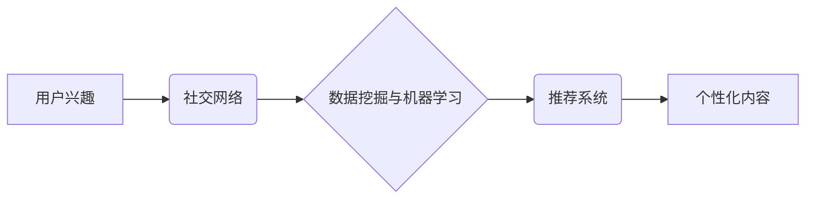

## 在线社交网络中用户兴趣演化分析与建模研究

> 关键词：用户兴趣演化，社交网络，建模，推荐系统，数据挖掘，机器学习

## 1. 背景介绍

在线社交网络已经成为人们生活的重要组成部分，用户在这些平台上分享信息、建立联系、探索兴趣。用户兴趣是社交网络中一个重要的驱动因素，它影响着用户行为、内容消费和平台发展。然而，用户兴趣并非静态的，它会随着时间推移、环境变化和个人经历而不断演化。理解和预测用户兴趣演化对于社交网络平台的个性化推荐、内容运营、用户增长等方面至关重要。

传统的兴趣建模方法往往依赖于用户历史行为数据，例如点赞、评论、分享等，但这些数据无法完全反映用户动态变化的兴趣。随着社交网络平台的不断发展，用户行为数据变得更加丰富和复杂，传统的建模方法面临着新的挑战。

## 2. 核心概念与联系

**2.1 用户兴趣演化**

用户兴趣演化是指用户兴趣随着时间推移而发生变化的动态过程。这种变化可以是渐进的，也可以是突变的，受多种因素影响，例如：

* **个人经历:** 用户的年龄、教育、职业、生活方式等都会影响其兴趣。
* **社会影响:** 用户的朋友、家人、社区等都会对用户的兴趣产生影响。
* **平台推荐:** 社交网络平台的推荐算法会根据用户的历史行为和兴趣偏好，推荐相关内容，从而影响用户的兴趣。
* **内容趋势:** 社交网络平台上的内容趋势会不断变化，用户也会随着趋势的变化而调整其兴趣。

**2.2 社交网络分析**

社交网络分析是指研究社交网络结构和用户行为的科学方法。通过分析用户之间的关系、互动模式和信息传播路径，可以更好地理解用户兴趣演化背后的机制。

**2.3 数据挖掘与机器学习**

数据挖掘和机器学习是分析海量用户数据、发现隐藏模式和预测用户行为的重要工具。通过训练机器学习模型，可以从用户行为数据中学习用户兴趣演化的规律，并预测用户的未来兴趣。

**2.4 推荐系统**

推荐系统是基于用户兴趣和行为数据，为用户推荐个性化内容的系统。用户兴趣演化分析可以帮助推荐系统更准确地预测用户的兴趣，从而提供更有效的推荐。

**2.5  核心概念架构图**



## 3. 核心算法原理 & 具体操作步骤

**3.1 算法原理概述**

用户兴趣演化分析算法通常基于以下原理：

* **时间序列分析:** 将用户兴趣视为时间序列数据，分析其变化趋势和模式。
* **关联规则挖掘:** 挖掘用户行为数据中的关联规则，发现用户兴趣之间的潜在联系。
* **聚类分析:** 将用户根据其兴趣相似度进行聚类，识别不同兴趣群体的特征。
* **机器学习:** 利用机器学习算法，从用户行为数据中学习用户兴趣演化的规律，并预测用户的未来兴趣。

**3.2 算法步骤详解**

以下是一个基于机器学习的用户兴趣演化分析算法的具体步骤：

1. **数据收集:** 收集用户行为数据，例如点赞、评论、分享、浏览等。
2. **数据预处理:** 对数据进行清洗、转换和特征提取，例如将时间戳转换为时间特征、将文本内容转换为词向量等。
3. **模型选择:** 选择合适的机器学习模型，例如循环神经网络（RNN）、长短期记忆网络（LSTM）等。
4. **模型训练:** 利用训练数据训练机器学习模型，学习用户兴趣演化的规律。
5. **模型评估:** 使用测试数据评估模型的性能，例如准确率、召回率等。
6. **模型部署:** 将训练好的模型部署到生产环境中，用于预测用户的未来兴趣。

**3.3 算法优缺点**

**优点:**

* 可以准确预测用户的未来兴趣。
* 可以处理海量用户数据。
* 可以根据用户的动态变化调整推荐内容。

**缺点:**

* 需要大量的训练数据。
* 模型训练需要较高的计算资源。
* 模型解释性较差，难以理解模型的决策过程。

**3.4 算法应用领域**

用户兴趣演化分析算法广泛应用于以下领域：

* **推荐系统:** 为用户推荐个性化内容，例如商品、视频、音乐等。
* **内容运营:** 根据用户兴趣趋势，创作和发布更受欢迎的内容。
* **用户增长:** 识别潜在用户兴趣，制定精准的营销策略。
* **市场分析:** 分析用户兴趣变化趋势，预测市场需求。

## 4. 数学模型和公式 & 详细讲解 & 举例说明

**4.1 数学模型构建**

用户兴趣演化可以建模为一个马尔可夫链，其中每个状态代表用户的兴趣类别，状态之间的转移概率取决于用户的历史行为和环境因素。

**4.2 公式推导过程**

设 $I_t$ 为用户在时间 $t$ 的兴趣类别，$P(I_{t+1}|I_t)$ 为用户从兴趣类别 $I_t$ 转移到兴趣类别 $I_{t+1}$ 的转移概率。

根据马尔可夫链的性质，转移概率只依赖于当前状态，即：

$$P(I_{t+1}|I_t, I_{t-1},..., I_1) = P(I_{t+1}|I_t)$$

转移概率可以根据用户历史行为数据进行估计，例如：

$$P(I_{t+1}|I_t) = \frac{N(I_t, I_{t+1})}{N(I_t)}$$

其中，$N(I_t, I_{t+1})$ 为用户从兴趣类别 $I_t$ 转移到兴趣类别 $I_{t+1}$ 的次数，$N(I_t)$ 为用户处于兴趣类别 $I_t$ 的总次数。

**4.3 案例分析与讲解**

假设用户在社交网络平台上关注了以下兴趣类别：

* 科技
* 娱乐
* 美食

用户在过去一周内浏览了以下内容：

* 科技新闻
* 娱乐电影
* 美食博客

根据上述数据，我们可以估计用户兴趣转移概率：

* $P(\text{科技}|\text{科技}) = 0.8$
* $P(\text{娱乐}|\text{科技}) = 0.1$
* $P(\text{美食}|\text{科技}) = 0.1$
* $P(\text{科技}|\text{娱乐}) = 0.2$
* $P(\text{娱乐}|\text{娱乐}) = 0.7$
* $P(\text{美食}|\text{娱乐}) = 0.1$
* $P(\text{科技}|\text{美食}) = 0.1$
* $P(\text{娱乐}|\text{美食}) = 0.2$
* $P(\text{美食}|\text{美食}) = 0.7$

通过这些转移概率，我们可以预测用户未来一周的兴趣类别。

## 5. 项目实践：代码实例和详细解释说明

**5.1 开发环境搭建**

* Python 3.x
* TensorFlow 或 PyTorch
* Jupyter Notebook

**5.2 源代码详细实现**

```python
import tensorflow as tf

# 定义用户兴趣演化模型
model = tf.keras.Sequential([
    tf.keras.layers.LSTM(units=64, return_sequences=True),
    tf.keras.layers.LSTM(units=32),
    tf.keras.layers.Dense(units=3, activation='softmax')
])

# 编译模型
model.compile(optimizer='adam',
              loss='sparse_categorical_crossentropy',
              metrics=['accuracy'])

# 训练模型
model.fit(X_train, y_train, epochs=10)

# 预测用户未来兴趣
predictions = model.predict(X_test)
```

**5.3 代码解读与分析**

* 使用 TensorFlow 或 PyTorch 库构建用户兴趣演化模型。
* 使用 LSTM 网络捕捉用户兴趣的时间序列特征。
* 使用 softmax 激活函数输出用户未来兴趣的概率分布。
* 使用 Adam 优化器训练模型，并使用交叉熵损失函数和准确率作为评估指标。

**5.4 运行结果展示**

训练完成后，可以评估模型的性能，并使用模型预测用户的未来兴趣。

## 6. 实际应用场景

**6.1 个性化推荐系统**

用户兴趣演化分析可以帮助推荐系统更准确地预测用户的兴趣，从而提供更个性化的推荐内容。例如，电商平台可以根据用户的浏览历史、购买记录和评价信息，预测用户的未来购买兴趣，并推荐相关商品。

**6.2 内容运营策略**

社交媒体平台可以利用用户兴趣演化分析，了解用户兴趣的变化趋势，并根据趋势调整内容创作和发布策略。例如，可以根据用户对特定主题的兴趣增长，创作更多相关内容，并将其推送到用户的时间线。

**6.3 用户增长策略**

用户兴趣演化分析可以帮助平台识别潜在用户的兴趣，并制定精准的营销策略。例如，可以根据用户对特定产品的兴趣，推送相关广告或优惠活动，从而吸引用户注册和使用平台。

**6.4 未来应用展望**

随着人工智能技术的不断发展，用户兴趣演化分析将在更多领域得到应用，例如：

* **教育领域:** 根据学生的学习兴趣和进度，提供个性化的学习内容和辅导。
* **医疗领域:** 根据患者的健康状况和生活习惯，提供个性化的健康建议和治疗方案。
* **金融领域:** 根据用户的投资偏好和风险承受能力，提供个性化的理财建议和投资产品。

## 7. 工具和资源推荐

**7.1 学习资源推荐**

* **书籍:**
    * 《深度学习》
    * 《机器学习实战》
    * 《自然语言处理》
* **在线课程:**
    * Coursera
    * edX
    * Udacity

**7.2 开发工具推荐**

* **Python:** 
    * TensorFlow
    * PyTorch
    * Scikit-learn
* **数据可视化工具:**
    * Matplotlib
    * Seaborn
    * Plotly

**7.3 相关论文推荐**

* **用户兴趣演化分析:**
    * "Modeling User Interest Evolution in Social Networks"
    * "A Deep Learning Approach to User Interest Evolution Prediction"
* **推荐系统:**
    * "Collaborative Filtering for Recommender Systems"
    * "Content-Based Recommendation Systems"

## 8. 总结：未来发展趋势与挑战

**8.1 研究成果总结**

用户兴趣演化分析已经取得了一定的进展，例如：

* 提出了一些有效的算法和模型，能够准确预测用户的未来兴趣。
* 开发了一些基于用户兴趣演化的推荐系统，能够提供更个性化的推荐内容。

**8.2 未来发展趋势**

未来用户兴趣演化分析的研究将朝着以下方向发展：

* **更精准的预测:** 利用更先进的机器学习算法和数据分析技术，提高用户兴趣预测的准确率。
* **更个性化的推荐:** 结合用户的多方面特征，例如年龄、性别、地理位置等，提供更个性化的推荐内容。
* **更动态的演化模型:** 建立更动态的兴趣演化模型，能够实时适应用户的兴趣变化。

**8.3 面临的挑战**

用户兴趣演化分析也面临一些挑战：

* **数据稀疏性:** 用户行为数据往往是稀疏的，难以训练有效的机器学习模型。
* **数据隐私:** 用户兴趣数据涉及个人隐私，需要采取措施保护用户数据安全。
* **模型解释性:** 许多机器学习模型的决策过程难以解释，难以理解模型是如何预测用户兴趣的。

**8.4 研究展望**

未来，用户兴趣演化分析的研究将继续探索新的算法、模型和应用场景，为用户提供更个性化、更智能化的体验。


## 9. 附录：常见问题与解答

**9.1