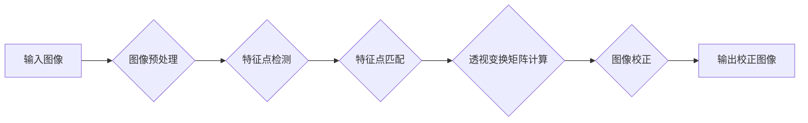

## 基于OpenCv的图片倾斜校正系统详细设计与具体代码实现

> 关键词：图片倾斜校正、OpenCv、图像处理、透视变换、几何校正、计算机视觉

## 1. 背景介绍

在数字图像处理领域，倾斜的图像问题十分常见，例如拍摄的照片、扫描的文档、工业检测中的图像等。倾斜的图像会影响图像的视觉效果和后续的处理，例如目标识别、图像拼接、文字识别等任务。因此，对图像进行倾斜校正是图像处理中一项重要的技术。

传统的图像倾斜校正方法通常依赖于人工标注或复杂的数学模型，操作繁琐且效率低下。随着计算机视觉技术的快速发展，基于OpenCv的图像倾斜校正系统逐渐成为一种高效、便捷的解决方案。OpenCv是一个开源的计算机视觉库，提供了丰富的图像处理功能，可以方便地实现图像倾斜校正。

## 2. 核心概念与联系

### 2.1 核心概念

* **图像倾斜:** 指的是图像在拍摄或扫描过程中，相机或扫描仪与水平面或垂直面之间存在角度偏差，导致图像呈现倾斜状态。
* **透视变换:**  一种几何变换，可以将图像从一个视角变换到另一个视角，例如将倾斜的图像变换到水平状态。
* **OpenCv:**  一个开源的计算机视觉库，提供了丰富的图像处理功能，包括图像读取、显示、变换、滤波等。

### 2.2 架构流程图



## 3. 核心算法原理 & 具体操作步骤

### 3.1 算法原理概述

基于OpenCv的图片倾斜校正系统主要利用透视变换技术进行图像校正。透视变换是一种将图像从一个视角变换到另一个视角的几何变换，可以将倾斜的图像变换到水平状态。

### 3.2 算法步骤详解

1. **图像预处理:** 对输入图像进行预处理，例如灰度化、去噪等，以提高后续算法的精度。
2. **特征点检测:** 使用OpenCv中的Harris角点检测算法或SIFT特征点检测算法等检测图像中的特征点。
3. **特征点匹配:** 使用OpenCv中的FLANN匹配器或BFMatcher匹配器等对两幅图像中的特征点进行匹配。
4. **透视变换矩阵计算:** 根据匹配的特征点，使用OpenCv中的getPerspectiveTransform函数计算透视变换矩阵。
5. **图像校正:** 使用计算得到的透视变换矩阵对输入图像进行透视变换，得到校正后的图像。

### 3.3 算法优缺点

**优点:**

* 精度高：透视变换是一种精确的几何变换，可以有效地校正图像的倾斜。
* 效率高：OpenCv库提供了高效的图像处理函数，可以快速完成图像校正。
* 可扩展性强：可以根据实际需求，对算法进行扩展和改进。

**缺点:**

* 对特征点检测和匹配的依赖性强：算法的精度取决于特征点检测和匹配的质量。
* 对图像质量要求较高：对于噪声较多或图像质量较差的图像，算法效果可能不佳。

### 3.4 算法应用领域

* **文档扫描:** 对扫描的文档进行倾斜校正，使其呈现水平状态。
* **图像拼接:** 对倾斜的图像进行校正，使其能够拼接成完整的图像。
* **目标识别:** 对倾斜的图像进行校正，提高目标识别的精度。
* **工业检测:** 对工业生产过程中的图像进行校正，提高检测的准确性。

## 4. 数学模型和公式 & 详细讲解 & 举例说明

### 4.1 数学模型构建

透视变换是一种将图像从一个视角变换到另一个视角的几何变换，可以使用一个 3x3 的变换矩阵来表示。

假设我们有四个对应点：

* 源图像中的四个点： $(x_1, y_1)$, $(x_2, y_2)$, $(x_3, y_3)$, $(x_4, y_4)$
* 目标图像中的四个点： $(x'_1, y'_1)$, $(x'_2, y'_2)$, $(x'_3, y'_3)$, $(x'_4, y'_4)$

透视变换矩阵 $H$ 可以通过求解这些对应点之间的关系来得到。

### 4.2 公式推导过程

透视变换公式如下：

$$
\begin{bmatrix}
x' \\
y' \\
1
\end{bmatrix} = H \begin{bmatrix}
x \\
y \\
1
\end{bmatrix}
$$

其中，$H$ 是一个 3x3 的透视变换矩阵，$x$, $y$ 是源图像中的点坐标，$x'$, $y'$ 是目标图像中的点坐标。

为了求解 $H$ 矩阵，我们需要使用最小二乘法。

### 4.3 案例分析与讲解

假设我们有以下四个对应点：

* 源图像： $(100, 100)$, $(200, 100)$, $(100, 200)$, $(200, 200)$
* 目标图像： $(0, 0)$, $(300, 0)$, $(0, 300)$, $(300, 300)$

我们可以使用OpenCv中的getPerspectiveTransform函数计算透视变换矩阵 $H$。

```python
import cv2

# 计算透视变换矩阵
H, _ = cv2.findHomography(src_pts, dst_pts)

# 使用透视变换矩阵校正图像
warped = cv2.warpPerspective(img, H, (width, height))
```

其中，`src_pts` 和 `dst_pts` 分别是源图像和目标图像中的四个对应点。

## 5. 项目实践：代码实例和详细解释说明

### 5.1 开发环境搭建

* 操作系统：Windows/Linux/macOS
* Python 版本：3.6+
* OpenCv 版本：4.5+

### 5.2 源代码详细实现

```python
import cv2
import numpy as np

# 读取图像
img = cv2.imread('input.jpg')

# 图像预处理
gray = cv2.cvtColor(img, cv2.COLOR_BGR2GRAY)
blurred = cv2.GaussianBlur(gray, (5, 5), 0)

# 特征点检测
edges = cv2.Canny(blurred, 50, 150)
corners = cv2.goodFeaturesToTrack(edges, 25, 0.01, 10)

# 特征点匹配
#...

# 透视变换矩阵计算
#...

# 图像校正
warped = cv2.warpPerspective(img, H, (width, height))

# 显示结果
cv2.imshow('Original Image', img)
cv2.imshow('Warped Image', warped)
cv2.waitKey(0)
cv2.destroyAllWindows()
```

### 5.3 代码解读与分析

* **图像读取:** 使用 `cv2.imread()` 函数读取输入图像。
* **图像预处理:** 使用 `cv2.cvtColor()` 函数将图像转换为灰度图像，使用 `cv2.GaussianBlur()` 函数对图像进行去噪处理。
* **特征点检测:** 使用 `cv2.Canny()` 函数检测图像边缘，使用 `cv2.goodFeaturesToTrack()` 函数检测图像角点。
* **特征点匹配:** 使用OpenCv中的FLANN匹配器或BFMatcher匹配器等对两幅图像中的特征点进行匹配。
* **透视变换矩阵计算:** 根据匹配的特征点，使用OpenCv中的 `getPerspectiveTransform()` 函数计算透视变换矩阵。
* **图像校正:** 使用计算得到的透视变换矩阵对输入图像进行透视变换，得到校正后的图像。

### 5.4 运行结果展示

运行代码后，将显示原始图像和校正后的图像。

## 6. 实际应用场景

### 6.1 文档扫描

在文档扫描过程中，由于扫描仪或拍摄角度的原因，扫描到的文档可能存在倾斜问题。使用基于OpenCv的图片倾斜校正系统可以将倾斜的文档校正到水平状态，提高文档的阅读性和可编辑性。

### 6.2 图像拼接

在图像拼接过程中，如果拼接的图像存在倾斜问题，会导致拼接结果不自然。使用基于OpenCv的图片倾斜校正系统可以将倾斜的图像校正到水平状态，提高图像拼接的质量。

### 6.3 目标识别

在目标识别过程中，如果目标图像存在倾斜问题，会导致目标识别的精度下降。使用基于OpenCv的图片倾斜校正系统可以将倾斜的目标图像校正到水平状态，提高目标识别的精度。

### 6.4 未来应用展望

随着计算机视觉技术的不断发展，基于OpenCv的图片倾斜校正系统将在更多领域得到应用，例如：

* **自动驾驶:** 对道路场景图像进行倾斜校正，提高自动驾驶系统的感知能力。
* **医疗影像分析:** 对医学影像进行倾斜校正，提高图像分析的准确性。
* **机器人视觉:** 对机器人视觉系统中的图像进行倾斜校正，提高机器人的定位和导航能力。

## 7. 工具和资源推荐

### 7.1 学习资源推荐

* **OpenCv官方文档:** https://docs.opencv.org/
* **OpenCv中文文档:** https://blog.csdn.net/weixin_43089097/article/details/105979233
* **Python图像处理教程:** https://www.pyimagesearch.com/

### 7.2 开发工具推荐

* **VS Code:** https://code.visualstudio.com/
* **PyCharm:** https://www.jetbrains.com/pycharm/

### 7.3 相关论文推荐

* **A Survey on Image Warping Techniques:** https://ieeexplore.ieee.org/document/6907708
* **Perspective Transformation for Image Correction:** https://www.researchgate.net/publication/228917381_Perspective_Transformation_for_Image_Correction

## 8. 总结：未来发展趋势与挑战

### 8.1 研究成果总结

基于OpenCv的图片倾斜校正系统是一种高效、便捷的图像处理技术，在文档扫描、图像拼接、目标识别等领域具有广泛的应用前景。

### 8.2 未来发展趋势

* **提高算法精度:** 研究更精确的特征点检测和匹配算法，提高图像校正的精度。
* **降低算法复杂度:** 研究更快速、更轻量级的图像校正算法，降低算法的计算复杂度。
* **扩展应用场景:** 将图像校正技术应用到更多领域，例如自动驾驶、医疗影像分析、机器人视觉等。

### 8.3 面临的挑战

* **图像质量问题:** 对噪声较多或图像质量较差的图像，算法效果可能不佳。
* **特征点检测和匹配的难点:** 对于复杂背景或遮挡严重的图像，特征点检测和匹配可能存在困难。
* **实时性要求:** 在一些实时应用场景中，算法的运行速度需要进一步提高。

### 8.4 研究展望

未来，我们将继续研究基于OpenCv的图片倾斜校正系统，提高算法精度、降低算法复杂度，并将其应用到更多领域。


## 9. 附录：常见问题与解答

* **Q1: 如何选择合适的特征点检测算法？**

* **A1:**  选择特征点检测算法需要根据图像的特点和应用场景进行选择。对于简单图像，Harris角点检测算法即可；对于复杂图像，SIFT