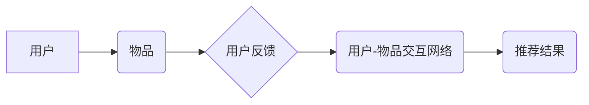

## 基于反向推荐的个性化推荐算法研究

> 关键词：反向推荐、个性化推荐、协同过滤、内容过滤、用户画像、推荐系统、机器学习

## 1. 背景介绍

在信息爆炸的时代，海量数据和内容的涌现使得用户难以从其中筛选出真正感兴趣的信息。个性化推荐系统应运而生，旨在根据用户的历史行为、偏好和兴趣，精准推荐符合其需求的内容。传统的推荐系统主要基于协同过滤和内容过滤两种方法，但这些方法存在一定的局限性。协同过滤依赖于大量用户行为数据，而内容过滤则需要丰富的物品特征信息，且难以捕捉用户隐性需求。

反向推荐作为一种新兴的推荐方法，通过分析用户对物品的反馈，挖掘用户之间的潜在关系和物品之间的关联性，从而实现个性化推荐。与传统的推荐方法相比，反向推荐具有以下优势：

* **突破数据孤岛:** 反向推荐可以利用用户对物品的反馈信息，即使用户行为数据稀疏，也能进行有效的推荐。
* **挖掘隐性需求:** 反向推荐可以分析用户对物品的评价、评论等文本信息，挖掘用户隐性需求，提供更精准的推荐。
* **提升推荐多样性:** 反向推荐可以考虑用户对不同类型物品的偏好，提供更丰富的推荐结果。

## 2. 核心概念与联系

反向推荐的核心概念是**用户-物品交互网络**。该网络将用户和物品作为节点，用户对物品的反馈作为边，通过分析网络结构和连接关系，挖掘用户之间的潜在关系和物品之间的关联性。

**反向推荐流程图:**



**核心概念:**

* **用户:** 推荐系统的目标用户群体。
* **物品:** 需要被推荐的内容，例如电影、书籍、商品等。
* **用户-物品交互网络:** 用户和物品之间的关系网络，通过用户对物品的反馈信息构建。
* **用户反馈:** 用户对物品的评价、评分、点击、购买等行为。
* **推荐结果:** 根据用户-物品交互网络分析，推荐给用户的物品列表。

## 3. 核心算法原理 & 具体操作步骤

### 3.1  算法原理概述

反向推荐算法主要基于**协同过滤**和**内容过滤**两种方法。

* **协同过滤:** 通过分析用户对物品的评分或行为，挖掘用户之间的相似性，推荐与相似用户喜欢的物品。
* **内容过滤:** 通过分析物品的特征信息，推荐与用户历史偏好相似的物品。

### 3.2  算法步骤详解

**基于协同过滤的反向推荐算法步骤:**

1. **构建用户-物品交互网络:** 收集用户对物品的反馈数据，构建用户-物品交互网络。
2. **计算用户相似度:** 使用余弦相似度、皮尔逊相关系数等方法计算用户之间的相似度。
3. **推荐物品:** 对于目标用户，找到与其相似度最高的k个用户，并推荐这些用户喜欢的物品。

**基于内容过滤的反向推荐算法步骤:**

1. **提取物品特征:** 分析物品的属性信息，提取其特征向量。
2. **构建用户兴趣模型:** 根据用户历史行为数据，构建用户兴趣模型，例如用户偏好的物品类别、风格等。
3. **推荐物品:** 计算目标用户兴趣模型与物品特征向量的相似度，推荐相似度最高的物品。

### 3.3  算法优缺点

**协同过滤:**

* **优点:** 可以挖掘用户隐性需求，推荐更精准的物品。
* **缺点:** 依赖于大量用户行为数据，数据稀疏性问题难以解决。

**内容过滤:**

* **优点:** 不依赖于用户行为数据，可以推荐新物品。
* **缺点:** 难以捕捉用户隐性需求，推荐结果可能缺乏多样性。

### 3.4  算法应用领域

反向推荐算法广泛应用于以下领域:

* **电子商务:** 商品推荐、个性化营销
* **娱乐:** 电影推荐、音乐推荐
* **社交网络:** 朋友推荐、兴趣小组推荐
* **新闻:** 个性化新闻推荐
* **教育:** 学习资源推荐

## 4. 数学模型和公式 & 详细讲解 & 举例说明

### 4.1  数学模型构建

**协同过滤模型:**

假设用户集合为U，物品集合为I，用户对物品的评分矩阵为R，其中R(u,i)表示用户u对物品i的评分。协同过滤模型的目标是预测用户u对物品i的评分R(u,i)。

**内容过滤模型:**

假设物品集合为I，物品特征向量为X，用户兴趣模型为Y。内容过滤模型的目标是预测用户u对物品i的评分R(u,i)，可以通过计算用户兴趣模型Y(u)与物品特征向量X(i)的相似度来实现。

### 4.2  公式推导过程

**协同过滤模型:**

常用的协同过滤算法包括基于用户的协同过滤和基于物品的协同过滤。

* **基于用户的协同过滤:**

$$
R(u,i) = \frac{\sum_{v \in N(u)} \frac{R(v,i) * sim(u,v)}{\sum_{w \in N(u)} sim(u,w)}}{\sum_{v \in N(u)} \frac{sim(u,v)}{\sum_{w \in N(u)} sim(u,w)}}
$$

其中，N(u)表示与用户u相似度最高的k个用户，sim(u,v)表示用户u和用户v的相似度。

* **基于物品的协同过滤:**

$$
R(u,i) = \frac{\sum_{j \in N(i)} \frac{R(u,j) * sim(i,j)}{\sum_{k \in N(i)} sim(i,k)}}{\sum_{j \in N(i)} \frac{sim(i,j)}{\sum_{k \in N(i)} sim(i,k)}}
$$

其中，N(i)表示与物品i相似度最高的k个物品，sim(i,j)表示物品i和物品j的相似度。

**内容过滤模型:**

$$
R(u,i) = \frac{Y(u) * X(i)}{\|Y(u)\| * \|X(i)\|}
$$

其中，Y(u)表示用户u的兴趣模型，X(i)表示物品i的特征向量。

### 4.3  案例分析与讲解

**协同过滤案例:**

假设用户A和用户B都喜欢电影A和电影B，但用户A还喜欢电影C，而用户B不喜欢电影C。根据协同过滤算法，可以推断出用户A和用户B之间存在一定的相似性，因此可以推荐用户B喜欢电影A和电影B，但不喜欢电影C。

**内容过滤案例:**

假设用户A喜欢动作片，而电影X是动作片，则根据内容过滤算法，可以推断出用户A可能会喜欢电影X。

## 5. 项目实践：代码实例和详细解释说明

### 5.1  开发环境搭建

* Python 3.x
* scikit-learn
* pandas
* numpy

### 5.2  源代码详细实现

```python
import pandas as pd
from sklearn.metrics.pairwise import cosine_similarity

# 加载用户-物品交互数据
data = pd.read_csv('user_item_data.csv')

# 构建用户-物品评分矩阵
ratings_matrix = data.pivot_table(index='user_id', columns='item_id', values='rating')

# 计算用户相似度
user_similarity = cosine_similarity(ratings_matrix)

# 找到与目标用户最相似的k个用户
target_user_id = 1
k = 5
similar_users = user_similarity[target_user_id].argsort()[-k:][::-1]

# 推荐物品
recommended_items = []
for user_id in similar_users:
    rated_items = ratings_matrix.loc[user_id].index
    for item_id in rated_items:
        if ratings_matrix.loc[target_user_id, item_id] == 0:
            recommended_items.append(item_id)

# 输出推荐结果
print(f'推荐给用户 {target_user_id} 的物品：{recommended_items}')
```

### 5.3  代码解读与分析

* 首先，加载用户-物品交互数据，并构建用户-物品评分矩阵。
* 然后，使用余弦相似度计算用户之间的相似度。
* 找到与目标用户最相似的k个用户，并推荐这些用户喜欢的物品。

### 5.4  运行结果展示

运行代码后，将输出推荐给目标用户的物品列表。

## 6. 实际应用场景

反向推荐算法在实际应用场景中具有广泛的应用前景。

* **电子商务:** 基于用户购买历史和评价信息，推荐个性化的商品，提高用户购买意愿。
* **娱乐:** 基于用户观看记录和评分信息，推荐个性化的电影、电视剧和音乐，提升用户娱乐体验。
* **社交网络:** 基于用户关注和互动信息，推荐个性化的朋友和兴趣小组，增强用户社交互动。

### 6.4  未来应用展望

随着人工智能技术的不断发展，反向推荐算法将更加智能化、个性化和精准化。未来，反向推荐算法将应用于更多领域，例如教育、医疗、金融等，为用户提供更加个性化的服务。

## 7. 工具和资源推荐

### 7.1  学习资源推荐

* **书籍:**
    * 推荐系统实践
    * 构建推荐系统
* **在线课程:**
    * Coursera: Recommender Systems
    * Udacity: Machine Learning Engineer Nanodegree

### 7.2  开发工具推荐

* **Python:** 作为机器学习和数据分析的常用语言，Python拥有丰富的库和工具，例如scikit-learn、pandas、numpy等。
* **Spark:** 用于大规模数据处理的开源框架，可以用于构建高性能的推荐系统。

### 7.3  相关论文推荐

* **Collaborative Filtering for Implicit Feedback Datasets**
* **Content-Based Recommendation Systems: A Survey**
* **Hybrid Recommender Systems: A Survey**

## 8. 总结：未来发展趋势与挑战

### 8.1  研究成果总结

反向推荐算法作为一种新兴的推荐方法，在挖掘用户隐性需求、提升推荐多样性和突破数据孤岛方面具有优势。

### 8.2  未来发展趋势

* **深度学习:** 将深度学习技术应用于反向推荐算法，提升推荐精度和个性化程度。
* **多模态推荐:** 将文本、图像、视频等多模态数据融合到反向推荐算法中，提供更加丰富的推荐结果。
* **联邦学习:** 利用联邦学习技术，在保护用户隐私的前提下进行反向推荐。

### 8.3  面临的挑战

* **数据稀疏性:** 用户行为数据往往稀疏，如何有效处理数据稀疏性问题是反向推荐算法面临的挑战。
* **冷启动问题:** 新用户和新物品难以获得推荐，如何解决冷启动问题是反向推荐算法需要解决的关键问题。
* **公平性问题:** 反向推荐算法可能存在偏见，如何保证推荐结果的公平性是需要进一步研究的问题。

### 8.4  研究展望

未来，反向推荐算法将朝着更加智能化、个性化和精准化的方向发展，为用户提供更加个性化的服务体验。


## 9. 附录：常见问题与解答

**Q1: 反向推荐算法与传统推荐算法有什么区别？**

**A1:** 反向推荐算法主要基于用户-物品交互网络，通过分析用户之间的关系和物品之间的关联性，挖掘用户隐性需求，提供更精准的推荐。而传统推荐算法主要基于协同过滤和内容过滤，依赖于大量用户行为数据或物品特征信息。

**Q2: 反向推荐算法如何处理