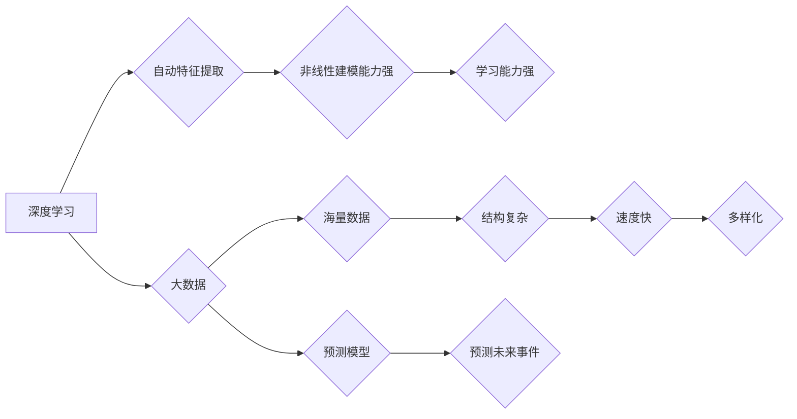

## 基于深度学习的大数据预测方法

> 关键词：深度学习、大数据、预测模型、神经网络、机器学习、数据挖掘、时间序列分析

## 1. 背景介绍

随着信息技术的飞速发展，海量数据正在各个领域爆发式增长。如何有效地挖掘数据中的潜在价值，并将其转化为可行动的洞察力，成为当今企业和研究机构面临的重大挑战。数据预测作为一种重要的数据分析技术，能够帮助我们预见未来趋势，做出更明智的决策。传统的统计模型在处理复杂非线性关系时往往表现不足，而深度学习作为一种强大的机器学习方法，凭借其强大的学习能力和非线性建模能力，在数据预测领域展现出巨大的潜力。

深度学习模型能够从海量数据中自动学习特征，并建立复杂的映射关系，从而实现对未来事件的准确预测。近年来，深度学习在各个领域取得了突破性的进展，例如图像识别、自然语言处理、语音识别等。在数据预测领域，深度学习也取得了显著的成果，例如股票价格预测、天气预报、客户行为预测等。

## 2. 核心概念与联系

### 2.1 深度学习

深度学习是一种基于人工神经网络的机器学习方法，其核心是多层神经网络结构。深度学习模型通过多层神经网络的叠加，能够学习数据中的抽象特征和复杂模式。与传统的机器学习方法相比，深度学习模型具有以下特点：

* **自动特征提取:** 深度学习模型能够自动从原始数据中提取特征，无需人工特征工程。
* **非线性建模能力强:** 深度学习模型能够学习复杂非线性关系，适用于处理复杂数据。
* **学习能力强:** 深度学习模型能够从海量数据中学习，并不断提升预测精度。

### 2.2 大数据

大数据是指规模庞大、结构复杂、速度快、多样化的数据。大数据具有以下特点：

* **海量数据:** 大数据量级巨大，难以用传统方法进行处理。
* **结构复杂:** 大数据包含多种数据类型，结构复杂多样。
* **速度快:** 大数据产生和更新速度快，需要实时处理。
* **多样化:** 大数据来自各种来源，例如传感器数据、社交媒体数据、交易记录等。

### 2.3 预测模型

预测模型是一种用于预测未来事件的数学模型。预测模型通过学习历史数据中的模式，建立预测关系，并预测未来事件的发生概率或值。

**核心概念与联系流程图:**



## 3. 核心算法原理 & 具体操作步骤

### 3.1 算法原理概述

深度学习在数据预测领域中，常用的算法包括：

* **多层感知机 (MLP):** MLP 是最基本的深度学习模型，由多个全连接神经网络层组成。
* **卷积神经网络 (CNN):** CNN 擅长处理图像数据，通过卷积操作提取图像特征。
* **循环神经网络 (RNN):** RNN 擅长处理序列数据，例如文本和时间序列数据。

这些算法通过训练数据，调整神经网络参数，学习数据中的模式和关系，从而实现对未来事件的预测。

### 3.2 算法步骤详解

**以多层感知机为例，详细说明其训练步骤:**

1. **数据预处理:** 将原始数据进行清洗、转换、归一化等处理，使其适合深度学习模型训练。
2. **模型构建:** 根据预测任务，选择合适的深度学习模型架构，例如多层感知机。
3. **参数初始化:** 为神经网络参数赋予初始值。
4. **前向传播:** 将输入数据输入到神经网络中，计算输出结果。
5. **损失函数计算:** 计算模型输出与真实值的差异，使用损失函数衡量模型预测的准确性。
6. **反向传播:** 根据损失函数的梯度，调整神经网络参数，使模型预测结果更接近真实值。
7. **迭代训练:** 重复前向传播、损失函数计算和反向传播步骤，直到模型达到预期的预测精度。
8. **模型评估:** 使用测试数据评估模型的预测性能，例如准确率、召回率、F1-score等。

### 3.3 算法优缺点

**多层感知机:**

* **优点:** 
    * 结构简单，易于理解和实现。
    * 能够处理多种类型的数据。
* **缺点:** 
    * 对数据特征依赖性强，需要人工特征工程。
    * 难以处理复杂非线性关系。

**卷积神经网络:**

* **优点:** 
    * 擅长处理图像数据，能够自动提取图像特征。
    * 具有较强的泛化能力。
* **缺点:** 
    * 计算量大，训练时间长。
    * 难以处理非图像数据。

**循环神经网络:**

* **优点:** 
    * 擅长处理序列数据，能够捕捉时间序列中的依赖关系。
    * 能够处理变长序列数据。
* **缺点:** 
    * 训练难度大，容易出现梯度消失问题。
    * 计算量大。

### 3.4 算法应用领域

深度学习在数据预测领域具有广泛的应用场景，例如：

* **金融预测:** 股票价格预测、信用风险评估、欺诈检测等。
* **天气预报:** 天气状况预测、降雨量预测、台风路径预测等。
* **医疗预测:** 疾病诊断、患者预后预测、药物研发等。
* **电商预测:** 商品销量预测、用户行为预测、推荐系统等。

## 4. 数学模型和公式 & 详细讲解 & 举例说明

### 4.1 数学模型构建

深度学习模型的数学基础是神经网络。神经网络由多个神经元组成，每个神经元接收多个输入信号，并通过激活函数进行处理，输出一个信号。神经元之间通过连接权重进行传递信息。

**多层感知机的数学模型:**

假设输入数据为 $x = (x_1, x_2,..., x_n)$, 输出为 $y$, 隐藏层神经元个数为 $m$, 则多层感知机的数学模型可以表示为:

* 隐藏层输出: $h = f(W_1x + b_1)$
* 输出层输出: $y = g(W_2h + b_2)$

其中:

* $W_1$ 和 $W_2$ 是连接权重矩阵。
* $b_1$ 和 $b_2$ 是偏置项。
* $f$ 和 $g$ 是激活函数。

### 4.2 公式推导过程

深度学习模型的训练过程是通过优化连接权重和偏置项来实现的。常用的优化算法包括梯度下降法、动量法、Adam算法等。

**梯度下降法的公式:**

$W = W - \alpha \frac{\partial L}{\partial W}$

$b = b - \alpha \frac{\partial L}{\partial b}$

其中:

* $W$ 和 $b$ 是连接权重和偏置项。
* $\alpha$ 是学习率。
* $L$ 是损失函数。

### 4.3 案例分析与讲解

**股票价格预测案例:**

假设我们想要预测股票价格的未来走势。我们可以使用深度学习模型，例如多层感知机，来学习股票价格的历史数据，并建立预测模型。

* **数据准备:** 收集股票价格的历史数据，包括开盘价、最高价、最低价、收盘价、成交量等。
* **模型构建:** 选择合适的深度学习模型架构，例如多层感知机，并设置模型参数，例如隐藏层神经元个数、激活函数等。
* **模型训练:** 使用历史数据训练深度学习模型，并使用损失函数衡量模型预测的准确性。
* **模型评估:** 使用测试数据评估模型的预测性能，例如准确率、均方误差等。
* **预测未来价格:** 将未来时间段的股票价格输入到训练好的模型中，得到未来股票价格的预测值。

## 5. 项目实践：代码实例和详细解释说明

### 5.1 开发环境搭建

* **操作系统:** Linux/macOS/Windows
* **编程语言:** Python
* **深度学习框架:** TensorFlow/PyTorch
* **其他工具:** Jupyter Notebook/VS Code

### 5.2 源代码详细实现

```python
import tensorflow as tf

# 定义模型架构
model = tf.keras.models.Sequential([
    tf.keras.layers.Dense(64, activation='relu', input_shape=(10,)),
    tf.keras.layers.Dense(32, activation='relu'),
    tf.keras.layers.Dense(1)
])

# 编译模型
model.compile(optimizer='adam', loss='mse')

# 训练模型
model.fit(x_train, y_train, epochs=100)

# 评估模型
loss, accuracy = model.evaluate(x_test, y_test)
print('Loss:', loss)
print('Accuracy:', accuracy)

# 预测未来数据
predictions = model.predict(x_new)
```

### 5.3 代码解读与分析

* **模型定义:** 使用 `tf.keras.models.Sequential` 创建一个顺序模型，并添加三个全连接层。
* **激活函数:** 使用 `relu` 作为激活函数，可以提高模型的学习能力。
* **编译模型:** 使用 `adam` 优化器和 `mse` 损失函数编译模型。
* **训练模型:** 使用 `model.fit` 方法训练模型，并设置训练轮数为 100。
* **评估模型:** 使用 `model.evaluate` 方法评估模型的性能。
* **预测未来数据:** 使用 `model.predict` 方法预测未来数据的输出值。

### 5.4 运行结果展示

训练完成后，可以查看模型的损失值和准确率，并使用测试数据进行评估。预测结果可以以图表或表格的形式展示。

## 6. 实际应用场景

### 6.1 金融预测

* **股票价格预测:** 利用历史股票价格数据，预测未来股票价格走势，帮助投资者做出投资决策。
* **信用风险评估:** 根据客户的财务数据和行为数据，评估客户的信用风险，帮助银行和金融机构进行贷款审批。
* **欺诈检测:** 利用机器学习算法，识别异常交易行为，帮助金融机构防范欺诈。

### 6.2 天气预报

* **天气状况预测:** 利用历史天气数据和气象模型，预测未来天气状况，例如晴天、雨天、雪天等。
* **降雨量预测:** 利用历史降雨数据和气象模型，预测未来降雨量，帮助农业生产和水资源管理。
* **台风路径预测:** 利用历史台风数据和气象模型，预测台风路径和强度，帮助防灾减灾。

### 6.3 医疗预测

* **疾病诊断:** 利用患者的医疗记录和症状数据，辅助医生诊断疾病。
* **患者预后预测:** 利用患者的医疗记录和生活方式数据，预测患者的疾病预后，帮助医生制定治疗方案。
* **药物研发:** 利用生物数据和药物信息，预测药物的疗效和安全性，加速药物研发过程。

### 6.4 未来应用展望

随着深度学习技术的不断发展，其在数据预测领域的应用将更加广泛和深入。例如:

* **个性化推荐:** 利用用户行为数据，为用户提供个性化的商品推荐、内容推荐和服务推荐。
* **智能制造:** 利用传感器数据和机器学习算法，实现智能生产、质量控制和故障预测。
* **自动驾驶:** 利用图像识别、传感器数据和机器学习算法，实现自动驾驶汽车的感知、决策和控制。

## 7. 工具和资源推荐

### 7.1 学习