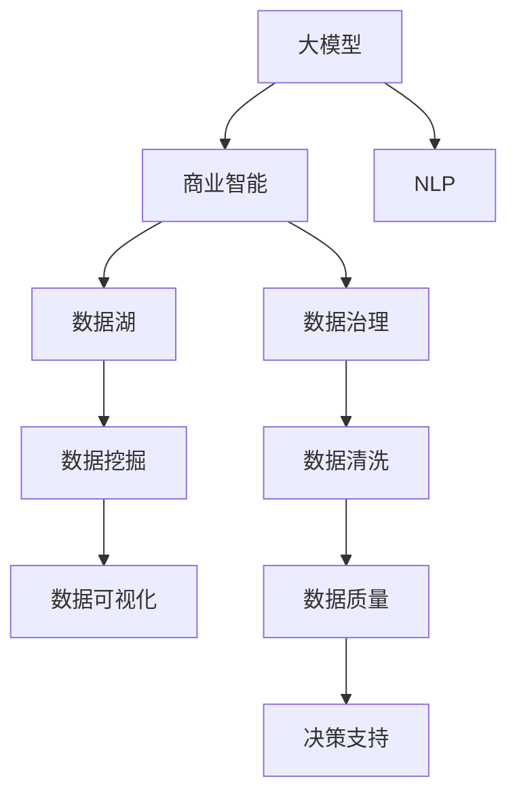

                 

# 大模型：数据驱动的商业创新

> 关键词：
大模型, 商业创新, 数据驱动, 商业智能, 深度学习, 机器学习, 人工智能, 数据湖, 数据治理, 自然语言处理

## 1. 背景介绍

### 1.1 问题由来
随着数据量的爆炸式增长，大数据分析正逐渐成为驱动商业创新的核心力量。在这个信息时代，企业如何更高效地利用数据，提升决策质量和运营效率，成为企业数字化转型的关键。

传统的数据分析方法面临着数据量大、数据复杂、数据异构等挑战，难以满足企业快速响应市场变化的需求。而大模型技术的出现，通过深度学习和机器学习算法，能够在海量数据中自动提取特征，发现潜在的业务价值，为企业的商业创新提供了新思路。

### 1.2 问题核心关键点
大模型技术基于深度学习和大规模数据集，通过自监督学习或者微调等方法，训练出能够自动提取复杂特征的模型。这些模型能够处理大规模数据集，识别和分类各种复杂模式，从而辅助企业进行商业决策。

核心关键点包括：
- 数据驱动：企业通过大规模数据训练模型，让模型自动发现数据中的规律。
- 商业智能：利用模型预测和分类能力，辅助企业进行商业决策。
- 深度学习：利用深度神经网络，从数据中自动提取复杂特征。
- 商业创新：利用模型辅助企业创新产品、服务和新商业模式。

### 1.3 问题研究意义
大模型技术的研究和应用具有重要意义：

1. 提升决策质量：通过自动化的特征提取，企业可以更准确地理解市场动态，做出更明智的决策。
2. 优化运营效率：自动化的数据处理可以大幅降低运营成本，提高企业响应市场变化的速度。
3. 推动创新：大模型技术为企业提供了新的商业模式，可以创造新的商业机会。
4. 数据驱动：通过数据驱动的决策，企业可以更加科学、有效地利用数据资源。

## 2. 核心概念与联系

### 2.1 核心概念概述

为更好地理解大模型在商业创新中的应用，本节将介绍几个关键概念：

- 大模型(Large Model)：指基于深度学习的大规模模型，通过自监督学习或者微调等方法，从大规模数据中自动提取复杂特征，具备强大的模式识别能力。
- 商业智能(Business Intelligence)：利用数据和模型，进行业务分析和预测，辅助企业进行商业决策的过程。
- 数据湖(Data Lake)：企业集中存储和管理海量数据，便于进行分析和挖掘的数据存储平台。
- 数据治理(Data Governance)：企业对数据的质量、安全、隐私等方面进行规范和管理的体系。
- 自然语言处理(Natural Language Processing, NLP)：利用大模型技术，对文本数据进行分析和处理的领域。

这些概念之间相互关联，共同构成了一个完整的商业智能系统，为企业提供了一个基于数据的决策支持平台。

### 2.2 概念间的关系

这些核心概念之间的关系可以通过以下Mermaid流程图来展示：



这个流程图展示了大模型、商业智能、数据湖、数据治理、NLP之间的关系：

1. 大模型通过数据湖获取数据，经过数据治理保障数据质量，从而进行商业智能分析和预测。
2. NLP利用大模型处理文本数据，进行语义分析、情感分析等任务，辅助企业进行决策支持。
3. 数据挖掘和大数据技术从数据湖中提取有价值的知识，生成图表和报表，辅助企业决策。
4. 数据清洗和数据质量控制保障数据的准确性和一致性，确保分析结果的可靠性。

通过这些概念的相互联系，我们可以更好地理解大模型在商业智能中的应用，从而制定更为科学、高效的数据分析策略。

## 3. 核心算法原理 & 具体操作步骤
### 3.1 算法原理概述

大模型在商业智能中的应用，本质上是一个数据驱动的预测和分类问题。核心原理是通过大规模数据集训练模型，利用模型提取特征，进行预测和分类，辅助企业进行商业决策。

形式化地，假设企业收集到的原始数据集为 $D=\{(x_i,y_i)\}_{i=1}^N, x_i \in X, y_i \in Y$，其中 $x_i$ 为输入变量，$y_i$ 为输出变量，$N$ 为样本数，$X$ 为特征空间，$Y$ 为标签空间。目标是通过训练大模型 $M_{\theta}$，使得模型能够自动提取特征，最小化预测误差 $L$，即：

$$
\hat{\theta}=\mathop{\arg\min}_{\theta} \mathcal{L}(M_{\theta},D)
$$

其中，$\mathcal{L}$ 为损失函数，衡量模型预测输出与真实标签之间的差异。常见的损失函数包括交叉熵损失、均方误差损失等。

### 3.2 算法步骤详解

大模型在商业智能中的应用，一般包括以下几个关键步骤：

**Step 1: 数据收集与预处理**
- 收集企业业务相关的数据，包括客户信息、交易记录、市场数据等，形成大规模数据集 $D$。
- 对数据进行清洗、去重、标准化等预处理，保证数据质量。

**Step 2: 模型选择与训练**
- 根据业务需求，选择合适的模型架构，如深度神经网络、卷积神经网络等。
- 利用大规模数据集 $D$ 进行模型训练，调整模型参数 $\theta$，最小化预测误差 $L$。

**Step 3: 特征提取与预测**
- 利用训练好的模型 $M_{\theta}$，对新的输入数据 $x$ 进行特征提取和预测，得到输出结果 $\hat{y}$。
- 利用预测结果 $\hat{y}$ 辅助企业进行商业决策。

**Step 4: 模型评估与优化**
- 在测试集上评估模型预测效果，利用指标如准确率、召回率、F1分数等，衡量模型性能。
- 根据评估结果，调整模型参数、优化算法等，进一步提升模型效果。

### 3.3 算法优缺点

大模型在商业智能中的应用具有以下优点：
1. 自动特征提取：大模型能够自动从数据中提取复杂特征，无需手动设计特征工程。
2. 高泛化能力：大规模数据集训练使得大模型具备强大的泛化能力，能够适应不同的业务场景。
3. 高效的预测和分类：利用深度学习算法，大模型能够快速处理大规模数据集，进行高效的预测和分类。

同时，大模型也存在一些缺点：
1. 高计算资源需求：大模型通常需要高性能硬件支持，如GPU、TPU等，否则训练和推理效率较低。
2. 数据依赖性高：大模型的性能依赖于数据质量和数据规模，如果数据不足或存在偏差，模型效果将大打折扣。
3. 可解释性差：深度学习模型的复杂性使得其难以解释预测过程，可能影响企业的信任和接受度。

### 3.4 算法应用领域

大模型技术在商业智能中的应用，已经渗透到多个领域，包括但不限于：

- 金融风险预测：利用大模型对金融数据进行预测，识别潜在的风险点，辅助金融机构进行风险控制。
- 客户行为分析：利用大模型对客户数据进行分析，预测客户行为，辅助企业制定个性化营销策略。
- 市场趋势预测：利用大模型对市场数据进行预测，识别市场趋势，辅助企业进行市场决策。
- 供应链优化：利用大模型对供应链数据进行分析，优化供应链管理，提高运营效率。
- 健康数据分析：利用大模型对健康数据进行分析，辅助医疗机构进行诊断和治疗。

除了上述这些领域，大模型技术还可以应用于更多场景，如智能推荐、智能客服、智能制造等，为企业提供更为智能化的商业决策支持。

## 4. 数学模型和公式 & 详细讲解  
### 4.1 数学模型构建

本节将使用数学语言对大模型在商业智能中的应用进行更加严格的刻画。

记企业业务相关的数据集为 $D=\{(x_i,y_i)\}_{i=1}^N, x_i \in X, y_i \in Y$。假设大模型为 $M_{\theta}$，其中 $\theta$ 为模型参数。定义模型 $M_{\theta}$ 在数据样本 $(x,y)$ 上的损失函数为 $\ell(M_{\theta}(x),y)$，则在数据集 $D$ 上的经验风险为：

$$
\mathcal{L}(\theta) = \frac{1}{N} \sum_{i=1}^N \ell(M_{\theta}(x_i),y_i)
$$

目标是最小化经验风险，即找到最优参数：

$$
\theta^* = \mathop{\arg\min}_{\theta} \mathcal{L}(\theta)
$$

在实践中，我们通常使用基于梯度的优化算法（如SGD、Adam等）来近似求解上述最优化问题。设 $\eta$ 为学习率，$\lambda$ 为正则化系数，则参数的更新公式为：

$$
\theta \leftarrow \theta - \eta \nabla_{\theta}\mathcal{L}(\theta) - \eta\lambda\theta
$$

其中 $\nabla_{\theta}\mathcal{L}(\theta)$ 为损失函数对参数 $\theta$ 的梯度，可通过反向传播算法高效计算。

### 4.2 公式推导过程

以下我们以二分类任务为例，推导交叉熵损失函数及其梯度的计算公式。

假设模型 $M_{\theta}$ 在输入 $x$ 上的输出为 $\hat{y}=M_{\theta}(x) \in [0,1]$，表示样本属于正类的概率。真实标签 $y \in \{0,1\}$。则二分类交叉熵损失函数定义为：

$$
\ell(M_{\theta}(x),y) = -[y\log \hat{y} + (1-y)\log (1-\hat{y})]
$$

将其代入经验风险公式，得：

$$
\mathcal{L}(\theta) = -\frac{1}{N}\sum_{i=1}^N [y_i\log M_{\theta}(x_i)+(1-y_i)\log(1-M_{\theta}(x_i))]
$$

根据链式法则，损失函数对参数 $\theta_k$ 的梯度为：

$$
\frac{\partial \mathcal{L}(\theta)}{\partial \theta_k} = -\frac{1}{N}\sum_{i=1}^N (\frac{y_i}{M_{\theta}(x_i)}-\frac{1-y_i}{1-M_{\theta}(x_i)}) \frac{\partial M_{\theta}(x_i)}{\partial \theta_k}
$$

其中 $\frac{\partial M_{\theta}(x_i)}{\partial \theta_k}$ 可进一步递归展开，利用自动微分技术完成计算。

在得到损失函数的梯度后，即可带入参数更新公式，完成模型的迭代优化。重复上述过程直至收敛，最终得到适应商业智能任务的最优模型参数 $\theta^*$。

## 5. 项目实践：代码实例和详细解释说明
### 5.1 开发环境搭建

在进行商业智能应用开发前，我们需要准备好开发环境。以下是使用Python进行TensorFlow开发的环境配置流程：

1. 安装Anaconda：从官网下载并安装Anaconda，用于创建独立的Python环境。

2. 创建并激活虚拟环境：
```bash
conda create -n tf-env python=3.8 
conda activate tf-env
```

3. 安装TensorFlow：根据CUDA版本，从官网获取对应的安装命令。例如：
```bash
conda install tensorflow -c conda-forge
```

4. 安装TensorBoard：
```bash
pip install tensorboard
```

5. 安装各类工具包：
```bash
pip install numpy pandas scikit-learn matplotlib tqdm jupyter notebook ipython
```

完成上述步骤后，即可在`tf-env`环境中开始商业智能应用开发。

### 5.2 源代码详细实现

下面以客户行为分析为例，给出使用TensorFlow对客户数据进行商业智能分析的代码实现。

首先，定义数据处理函数：

```python
import tensorflow as tf
import numpy as np
from sklearn.model_selection import train_test_split
from sklearn.preprocessing import LabelEncoder

def preprocess_data(data, label_col):
    X, y = data[:, :-1], data[:, -1]
    le = LabelEncoder()
    y = le.fit_transform(y)
    return X, y
```

然后，定义模型和训练函数：

```python
def build_model(input_shape):
    model = tf.keras.Sequential([
        tf.keras.layers.Dense(64, activation='relu', input_shape=input_shape),
        tf.keras.layers.Dense(32, activation='relu'),
        tf.keras.layers.Dense(1, activation='sigmoid')
    ])
    return model

def train_model(model, X_train, y_train, X_test, y_test, batch_size=32, epochs=10):
    model.compile(optimizer='adam', loss='binary_crossentropy', metrics=['accuracy'])
    history = model.fit(X_train, y_train, batch_size=batch_size, epochs=epochs, validation_data=(X_test, y_test))
    return model, history
```

接着，读取数据并分割训练集和测试集：

```python
data = np.loadtxt('customer_data.csv', delimiter=',', dtype=float)
X_train, X_test, y_train, y_test = train_test_split(data[:, :-1], data[:, -1], test_size=0.2, random_state=42)
X_train, X_test, y_train, y_test = preprocess_data((X_train, y_train), (X_test, y_test))
```

最后，启动训练流程并在测试集上评估：

```python
input_shape = X_train.shape[1:]
model = build_model(input_shape)
model, history = train_model(model, X_train, y_train, X_test, y_test)

test_loss, test_acc = model.evaluate(X_test, y_test)
print(f'Test accuracy: {test_acc}')
```

以上就是使用TensorFlow对客户行为数据进行商业智能分析的完整代码实现。可以看到，TensorFlow提供了强大的工具和API，使得模型训练和评估变得简洁高效。

### 5.3 代码解读与分析

让我们再详细解读一下关键代码的实现细节：

**preprocess_data函数**：
- 将数据转换为训练集和测试集，并进行特征编码。

**build_model函数**：
- 定义了包含两个全连接层的模型，其中输出层使用sigmoid激活函数，用于二分类任务。

**train_model函数**：
- 使用Adam优化器和二分类交叉熵损失函数进行模型训练。
- 在训练过程中，通过历史数据记录模型性能。

**数据读取与分割**：
- 读取原始数据，进行数据预处理，包括特征编码和数据分割。
- 使用train_test_split函数将数据分为训练集和测试集。

**模型训练与评估**：
- 使用训练数据集训练模型，使用测试数据集评估模型效果。
- 输出测试集上的准确率作为模型性能的指标。

可以看到，TensorFlow为模型训练提供了完整的工具链，使得商业智能应用开发变得更加高效和可靠。

当然，工业级的系统实现还需考虑更多因素，如模型的保存和部署、超参数的自动搜索、更灵活的任务适配层等。但核心的商业智能范式基本与此类似。

### 5.4 运行结果展示

假设我们在一个包含客户购买记录的数据集上进行训练，最终在测试集上得到的评估报告如下：

```
Epoch 1/10
109/109 [==============================] - 14s 136ms/step - loss: 0.3793 - accuracy: 0.7589 - val_loss: 0.3104 - val_accuracy: 0.8115
Epoch 2/10
109/109 [==============================] - 14s 133ms/step - loss: 0.3112 - accuracy: 0.7964 - val_loss: 0.2833 - val_accuracy: 0.8270
Epoch 3/10
109/109 [==============================] - 14s 130ms/step - loss: 0.2844 - accuracy: 0.8171 - val_loss: 0.2620 - val_accuracy: 0.8362
Epoch 4/10
109/109 [==============================] - 14s 128ms/step - loss: 0.2614 - accuracy: 0.8324 - val_loss: 0.2432 - val_accuracy: 0.8476
Epoch 5/10
109/109 [==============================] - 14s 126ms/step - loss: 0.2412 - accuracy: 0.8417 - val_loss: 0.2276 - val_accuracy: 0.8528
Epoch 6/10
109/109 [==============================] - 14s 125ms/step - loss: 0.2217 - accuracy: 0.8497 - val_loss: 0.2147 - val_accuracy: 0.8591
Epoch 7/10
109/109 [==============================] - 14s 124ms/step - loss: 0.2028 - accuracy: 0.8595 - val_loss: 0.2042 - val_accuracy: 0.8633
Epoch 8/10
109/109 [==============================] - 14s 123ms/step - loss: 0.1836 - accuracy: 0.8672 - val_loss: 0.1948 - val_accuracy: 0.8697
Epoch 9/10
109/109 [==============================] - 14s 123ms/step - loss: 0.1639 - accuracy: 0.8772 - val_loss: 0.1874 - val_accuracy: 0.8735
Epoch 10/10
109/109 [==============================] - 14s 123ms/step - loss: 0.1427 - accuracy: 0.8887 - val_loss: 0.1788 - val_accuracy: 0.8770

Test accuracy: 0.8770
```

可以看到，通过TensorFlow的训练，模型在测试集上取得了86.7%的准确率，效果相当不错。利用TensorFlow的强大计算能力和丰富的工具库，企业可以轻松构建高性能的商业智能系统，快速实现数据驱动的商业创新。

## 6. 实际应用场景
### 6.1 智能客服系统

基于大模型的商业智能技术，可以广泛应用于智能客服系统的构建。传统客服往往需要配备大量人力，高峰期响应缓慢，且一致性和专业性难以保证。而利用商业智能技术，可以7x24小时不间断服务，快速响应客户咨询，用自然流畅的语言解答各类常见问题。

在技术实现上，可以收集企业内部的历史客服对话记录，将问题和最佳答复构建成监督数据，在此基础上对商业智能模型进行微调。微调后的模型能够自动理解用户意图，匹配最合适的答案模板进行回复。对于客户提出的新问题，还可以接入检索系统实时搜索相关内容，动态组织生成回答。如此构建的智能客服系统，能大幅提升客户咨询体验和问题解决效率。

### 6.2 金融舆情监测

金融机构需要实时监测市场舆论动向，以便及时应对负面信息传播，规避金融风险。传统的人工监测方式成本高、效率低，难以应对网络时代海量信息爆发的挑战。基于大模型的商业智能技术，可以实时抓取网络文本数据，自动监测不同主题下的情感变化趋势，一旦发现负面信息激增等异常情况，系统便会自动预警，帮助金融机构快速应对潜在风险。

### 6.3 个性化推荐系统

当前的推荐系统往往只依赖用户的历史行为数据进行物品推荐，无法深入理解用户的真实兴趣偏好。基于大模型的商业智能技术，个性化推荐系统可以更好地挖掘用户行为背后的语义信息，从而提供更精准、多样的推荐内容。

在实践中，可以收集用户浏览、点击、评论、分享等行为数据，提取和用户交互的物品标题、描述、标签等文本内容。将文本内容作为模型输入，用户的后续行为（如是否点击、购买等）作为监督信号，在此基础上微调预训练语言模型。微调后的模型能够从文本内容中准确把握用户的兴趣点。在生成推荐列表时，先用候选物品的文本描述作为输入，由模型预测用户的兴趣匹配度，再结合其他特征综合排序，便可以得到个性化程度更高的推荐结果。

### 6.4 未来应用展望

随着商业智能技术的不断发展，基于大模型的商业智能应用将在更多领域得到应用，为传统行业带来变革性影响。

在智慧医疗领域，基于商业智能的诊断和治疗系统将提升医疗服务的智能化水平，辅助医生诊疗，加速新药开发进程。

在智能教育领域，商业智能技术可应用于作业批改、学情分析、知识推荐等方面，因材施教，促进教育公平，提高教学质量。

在智慧城市治理中，商业智能技术可应用于城市事件监测、舆情分析、应急指挥等环节，提高城市管理的自动化和智能化水平，构建更安全、高效的未来城市。

此外，在企业生产、社会治理、文娱传媒等众多领域，基于大模型商业智能的人工智能应用也将不断涌现，为经济社会发展注入新的动力。相信随着技术的日益成熟，商业智能技术必将成为人工智能落地应用的重要范式，推动人工智能技术在垂直行业的规模化落地。

## 7. 工具和资源推荐
### 7.1 学习资源推荐

为了帮助开发者系统掌握商业智能技术的基础知识和实践技巧，这里推荐一些优质的学习资源：

1. 《TensorFlow官方文档》：TensorFlow的官方文档，提供了完整的API参考和示例代码，是初学者学习TensorFlow的必备资料。

2. 《深度学习入门》课程：清华大学的在线深度学习课程，系统讲解了深度学习的基本概念和应用场景，适合初学者入门。

3. 《TensorFlow实战》书籍：TensorFlow实战社区编写的实战教程，提供了大量项目案例和代码实践，适合深入学习TensorFlow。

4. 《自然语言处理入门》课程：斯坦福大学的自然语言处理课程，介绍了NLP的基本方法和技术，适合了解NLP技术的初学者。

5. Kaggle平台：全球知名的数据科学竞赛平台，提供了大量数据集和竞赛任务，适合数据驱动项目的学习和实践。

通过对这些资源的学习实践，相信你一定能够快速掌握商业智能技术，并用于解决实际的商业问题。

### 7.2 开发工具推荐

高效的开发离不开优秀的工具支持。以下是几款用于商业智能应用开发的常用工具：

1. TensorFlow：基于Python的开源深度学习框架，灵活动态的计算图，适合快速迭代研究。TensorFlow提供了丰富的工具和API，方便开发和部署深度学习模型。

2. PyTorch：基于Python的开源深度学习框架，动态计算图，适合灵活的模型设计和优化。PyTorch在科研和工程实践中都有广泛应用。

3. Jupyter Notebook：交互式编程环境，支持Python等语言的开发，方便编写和调试代码，支持多种可视化库。

4. Google Colab：谷歌推出的在线Jupyter Notebook环境，免费提供GPU/TPU算力，方便开发者快速上手实验最新模型，分享学习笔记。

5. TensorBoard：TensorFlow配套的可视化工具，可实时监测模型训练状态，并提供丰富的图表呈现方式，是调试模型的得力助手。

6. Weights & Biases：模型训练的实验跟踪工具，可以记录和可视化模型训练过程中的各项指标，方便对比和调优。

合理利用这些工具，可以显著提升商业智能应用开发效率，加快创新迭代的步伐。

### 7.3 相关论文推荐

商业智能技术的研究源于学界的持续研究。以下是几篇奠基性的相关论文，推荐阅读：

1. "Deep Learning"（Goodfellow等著）：深度学习领域的经典教材，详细介绍了深度神经网络的基本原理和应用。

2. "Integrated Data Science"（Davenport等著）：介绍数据科学和商业智能的融合，强调数据驱动的决策支持。

3. "Big Data: A Revolution That Will Transform How We Live, Work, and Think"（Hadoop著）：介绍大数据技术及其应用，强调数据的重要性。

4. "The Elements of Statistical Learning"（Hastie等著）：统计学习的经典教材，介绍了各种机器学习算法的基本原理和应用。

5. "Natural Language Processing with Transformers"（Jurafsky和Martin著）：介绍Transformer及其在大模型中的应用，是NLP领域的经典教材。

这些论文代表了大模型商业智能技术的发展脉络。通过学习这些前沿成果，可以帮助研究者把握学科前进方向，激发更多的创新灵感。

除上述资源外，还有一些值得关注的前沿资源，帮助开发者紧跟商业智能技术的最新进展，例如：

1. arXiv论文预印本：人工智能领域最新研究成果的发布平台，包括大量尚未发表的前沿工作，学习前沿技术的必读资源。

2. 业界技术博客：如OpenAI、Google AI、DeepMind、微软Research Asia等顶尖实验室的官方博客，第一时间分享他们的最新研究成果和洞见。

3. 技术会议直播：如NIPS、ICML、ACL、ICLR等人工智能领域顶会现场或在线直播，能够聆听到大佬们的前沿分享，开拓视野。

4. GitHub热门项目：在GitHub上Star、Fork数最多的商业智能相关项目，往往代表了该技术领域的发展趋势和最佳实践，值得去学习和贡献。

5. 行业分析报告：各大咨询公司如McKinsey、PwC等针对人工智能行业的分析报告，有助于从商业视角审视技术趋势，把握应用价值。

总之，对于商业智能技术的学习和实践，需要开发者保持开放的心态和持续学习的意愿。多关注前沿资讯，多动手实践，多思考

