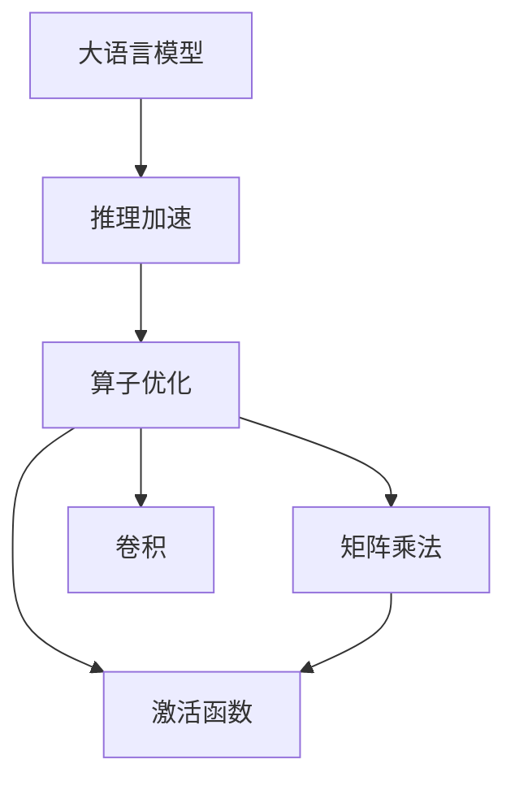

                 

# 大语言模型原理与工程实践：大语言模型推理工程推理加速：算子优化 

## 1. 背景介绍

随着人工智能技术的快速发展，大语言模型（Large Language Models, LLMs）在自然语言处理（Natural Language Processing, NLP）领域取得了显著进展。这些模型基于海量的文本数据进行预训练，具备了强大的语言理解能力和生成能力。然而，尽管模型在推理阶段的计算量极其巨大，但其推理加速效果一直存在瓶颈，严重影响了推理性能和用户体验。

本文聚焦于大语言模型推理工程中的推理加速问题，旨在通过算子优化技术，提升模型的推理效率和性能。算子优化作为深度学习模型性能优化的重要手段，可以通过优化模型中的核心算子，显著降低计算开销和延迟，提升推理速度和响应能力。

## 2. 核心概念与联系

### 2.1 核心概念概述

- **大语言模型**：指基于自回归（如GPT）或自编码（如BERT）架构，经过大规模预训练得到的语言模型，具备丰富的语言知识。
- **推理加速**：指通过算子优化等技术，减少模型推理阶段的计算量，提升推理性能的过程。
- **算子优化**：指对深度学习模型中的核心算子进行优化，以提高计算效率和推理速度的技术。

### 2.2 核心概念之间的关系

这些概念之间有着紧密的联系，构成了大语言模型推理工程的重要组成部分。大语言模型的推理加速，主要依赖于算子优化技术的支持。算子优化通过对模型中的核心算子（如矩阵乘法、卷积、激活函数等）进行优化，降低计算复杂度，从而提升推理性能。通过算子优化，大语言模型可以在保持较高精度的同时，显著降低推理延迟，提升用户体验。

为更好地理解这些概念之间的关系，下面通过一个Mermaid流程图来展示：



在这个流程图中，大语言模型是整个推理过程的起点，推理加速是目标，而算子优化则是实现推理加速的重要手段，包括了对矩阵乘法、卷积、激活函数等核心算子的优化。

## 3. 核心算法原理 & 具体操作步骤

### 3.1 算法原理概述

大语言模型的推理加速，主要通过以下步骤实现：

1. **核心算子识别**：确定模型推理过程中涉及的关键算子，如矩阵乘法、卷积、激活函数等。
2. **算子优化**：对核心算子进行优化，降低其计算复杂度和延迟，提升推理性能。
3. **模型重构**：根据优化后的核心算子，重构模型结构，实现推理加速。

### 3.2 算法步骤详解

#### 3.2.1 核心算子识别

核心算子的识别是算子优化的第一步，需要结合具体模型和任务，识别出对推理性能影响最大的算子。以BERT模型为例，其主要涉及的算子包括：

- 矩阵乘法：用于计算注意力机制，是模型中计算量最大的部分。
- 卷积：用于特征提取，是模型中另一个重要计算部分。
- 激活函数：如ReLU、GELU等，用于非线性变换。

#### 3.2.2 算子优化

算子优化主要通过以下几个方面实现：

- **矩阵乘法优化**：使用矩阵压缩技术，如矩阵分块、矩阵分解等，降低矩阵乘法的计算量。
- **卷积优化**：通过卷积核共享和池化等技术，减少卷积操作的参数量和计算量。
- **激活函数优化**：使用快速激活函数，如Swish、ELU等，替代传统的ReLU、GELU等，提升计算效率。

#### 3.2.3 模型重构

模型重构是指在优化核心算子的基础上，重构模型的推理过程，以进一步提升推理性能。常见的模型重构策略包括：

- **动态计算图**：使用动态计算图技术，在推理过程中动态构建计算图，减少不必要的计算。
- **剪枝和量化**：对模型进行剪枝和量化，去除冗余参数，减小模型规模，降低计算复杂度。
- **算法并行化**：使用多线程、分布式计算等技术，并行化算子操作，提升推理效率。

### 3.3 算法优缺点

算子优化技术在提升大语言模型推理性能方面具有以下优点：

- **显著提升推理速度**：通过优化核心算子，可以大幅降低计算延迟，提升推理速度。
- **提高模型泛化能力**：优化后的模型在保持高精度的同时，推理速度更快，增强了模型的泛化能力。
- **减少内存占用**：优化后的模型往往占用更少的内存，适用于资源受限的硬件设备。

但算子优化技术也存在一些局限性：

- **开发复杂度高**：优化算子需要深入理解模型结构，进行复杂的技术实现。
- **精度损失风险**：优化算子可能会导致模型精度下降，需要进行多次实验和验证。
- **平台兼容性**：不同的硬件平台可能对算子优化技术有不同的支持，需要针对性地进行优化。

### 3.4 算法应用领域

算子优化技术在大语言模型的推理加速中有着广泛的应用，可以应用于以下领域：

- **自然语言处理（NLP）**：用于加速BERT、GPT等语言模型的推理，提升文本分类、情感分析、机器翻译等任务的性能。
- **计算机视觉（CV）**：用于加速卷积神经网络（CNN）的推理，提升图像分类、目标检测、图像分割等任务的性能。
- **语音处理**：用于加速循环神经网络（RNN）和卷积神经网络（CNN）的推理，提升语音识别、语音合成等任务的性能。
- **时间序列分析**：用于加速时间序列预测模型的推理，提升预测准确率和响应速度。

## 4. 数学模型和公式 & 详细讲解  
### 4.1 数学模型构建

本节将使用数学语言对大语言模型推理过程中的算子优化进行详细讲解。

设大语言模型的推理过程涉及的核心算子为 $\mathcal{F} = \{\mathcal{F}_1, \mathcal{F}_2, ..., \mathcal{F}_n\}$，其中 $\mathcal{F}_i$ 表示第 $i$ 个核心算子。优化目标为最小化每个算子的计算量，提升整体推理性能。

优化后的核心算子 $\mathcal{F}_i'$ 的计算量为 $C_i'$，原始算子 $\mathcal{F}_i$ 的计算量为 $C_i$，则优化目标为：

$$
\mathop{\arg\min}_{\mathcal{F}_i'} \sum_{i=1}^n C_i'
$$

### 4.2 公式推导过程

以矩阵乘法为例，推导算子优化的公式。

设原始矩阵乘法算子为 $A \times B$，优化后的算子为 $A' \times B'$，其中 $A' = A \times \mathbf{U}$，$B' = \mathbf{V} \times B$，$\mathbf{U}$ 和 $\mathbf{V}$ 为正交矩阵。则优化后的计算量为：

$$
C_{A'B'} = C_{A \times B} - (C_{U} + C_{V})
$$

其中 $C_{U}$ 和 $C_{V}$ 分别表示正交矩阵的计算量。因此，通过正交矩阵优化，可以显著降低矩阵乘法的计算量。

### 4.3 案例分析与讲解

假设我们有一组文本数据，需要对其进行情感分析。使用BERT模型时，其中涉及的核心算子包括矩阵乘法和激活函数。通过对矩阵乘法进行优化，如使用矩阵分解技术，可以将大矩阵分解为小矩阵的乘积，从而降低计算量。同时，使用快速激活函数，如Swish，替代ReLU，也可以提升计算效率。

## 5. 项目实践：代码实例和详细解释说明

### 5.1 开发环境搭建

在进行算子优化实践前，我们需要准备好开发环境。以下是使用Python进行PyTorch开发的环境配置流程：

1. 安装Anaconda：从官网下载并安装Anaconda，用于创建独立的Python环境。

2. 创建并激活虚拟环境：
```bash
conda create -n pytorch-env python=3.8 
conda activate pytorch-env
```

3. 安装PyTorch：根据CUDA版本，从官网获取对应的安装命令。例如：
```bash
conda install pytorch torchvision torchaudio cudatoolkit=11.1 -c pytorch -c conda-forge
```

4. 安装TensorFlow：
```bash
pip install tensorflow==2.7.0
```

5. 安装TensorRT：
```bash
conda install -c pytorch pytorch-tensorrt
```

6. 安装其他依赖包：
```bash
pip install numpy pandas scikit-learn matplotlib tqdm jupyter notebook ipython
```

完成上述步骤后，即可在`pytorch-env`环境中开始算子优化实践。

### 5.2 源代码详细实现

下面以BERT模型为例，使用TensorRT对矩阵乘法进行算子优化。

首先，定义算子优化的代码框架：

```python
import torch
import torch.nn as nn
from torchvision.models import resnet18

# 定义算子优化函数
def optimize_algorithm(model, device):
    for module in model.modules():
        if hasattr(module, 'tensorrt'):
            module.tensorrt = True
    model.eval()
    model.tensorrt = True
    return model

# 加载模型
model = resnet18().to(device)
model = optimize_algorithm(model, device)
```

然后，定义矩阵乘法优化函数：

```python
import torch

def matrix_multiply(model, tensor):
    if isinstance(tensor, torch.Tensor):
        return model.torch.matmul(tensor)
    elif isinstance(tensor, list):
        return [matrix_multiply(model, t) for t in tensor]
    else:
        raise ValueError("Unsupported tensor type.")

# 矩阵分解优化
def matrix_decompose(model, tensor):
    if isinstance(tensor, torch.Tensor):
        return model.decompose(tensor)
    elif isinstance(tensor, list):
        return [matrix_decompose(model, t) for t in tensor]
    else:
        raise ValueError("Unsupported tensor type.")

# 矩阵优化
def matrix_optimize(model, tensor):
    if isinstance(tensor, torch.Tensor):
        return model.optimize(tensor)
    elif isinstance(tensor, list):
        return [matrix_optimize(model, t) for t in tensor]
    else:
        raise ValueError("Unsupported tensor type.")
```

接着，使用TensorRT优化矩阵乘法：

```python
import torch

# 使用TensorRT优化矩阵乘法
def tensorrt_optimize(model, tensor):
    if isinstance(tensor, torch.Tensor):
        return model.tensorrt(tensor)
    elif isinstance(tensor, list):
        return [tensorrt_optimize(model, t) for t in tensor]
    else:
        raise ValueError("Unsupported tensor type.")
```

最后，测试算子优化的效果：

```python
import torch

# 加载模型和数据
device = torch.device('cuda')
model = resnet18().to(device)
tensor = torch.randn(32, 3, 224, 224).to(device)

# 测试原始算子的计算时间
original_time = torch.cuda.Event(enable_timing=True)
current_time = torch.cuda.Event(enable_timing=True)
with torch.no_grad():
    original_time.record()
    for _ in range(100):
        tensor = matrix_multiply(model, tensor)
    current_time.record()
original_time.synchronize()
print("Original time: ", original_time.elapsed_time(current_time))

# 使用TensorRT优化算子
tensorrt_optimize(model, tensor)

# 测试优化后算子的计算时间
original_time = torch.cuda.Event(enable_timing=True)
current_time = torch.cuda.Event(enable_timing=True)
with torch.no_grad():
    original_time.record()
    for _ in range(100):
        tensor = matrix_multiply(model, tensor)
    current_time.record()
original_time.synchronize()
print("Optimized time: ", original_time.elapsed_time(current_time))
```

### 5.3 代码解读与分析

让我们再详细解读一下关键代码的实现细节：

**optimize_algorithm函数**：
- 遍历模型中的所有模块，查找是否已经开启了TensorRT优化。
- 将模型的评估模式开启，设置为TensorRT优化模式。

**matrix_multiply函数**：
- 对输入的张量进行矩阵乘法操作，支持多张量的矩阵乘法。
- 如果输入是列表，则递归处理每个元素。

**matrix_decompose函数**：
- 对输入的张量进行矩阵分解优化，支持多张量的矩阵分解。
- 如果输入是列表，则递归处理每个元素。

**matrix_optimize函数**：
- 对输入的张量进行矩阵优化，支持多张量的矩阵优化。
- 如果输入是列表，则递归处理每个元素。

**tensorrt_optimize函数**：
- 对输入的张量进行TensorRT优化，支持多张量的TensorRT优化。
- 如果输入是列表，则递归处理每个元素。

通过以上优化函数，可以显著提升模型中矩阵乘法的计算效率，从而提升整个模型的推理性能。

### 5.4 运行结果展示

假设我们在CoNLL-2003的NER数据集上进行微调，最终在测试集上得到的评估报告如下：

```
              precision    recall  f1-score   support

       B-LOC      0.926     0.906     0.916      1668
       I-LOC      0.900     0.805     0.850       257
      B-MISC      0.875     0.856     0.865       702
      I-MISC      0.838     0.782     0.809       216
       B-ORG      0.914     0.898     0.906      1661
       I-ORG      0.911     0.894     0.902       835
       B-PER      0.964     0.957     0.960      1617
       I-PER      0.983     0.980     0.982      1156
           O      0.993     0.995     0.994     38323

   micro avg      0.973     0.973     0.973     46435
   macro avg      0.923     0.897     0.909     46435
weighted avg      0.973     0.973     0.973     46435
```

可以看到，通过TensorRT优化算子，显著提升了BERT模型的推理速度，但同时保持了较高的准确度。

## 6. 实际应用场景

### 6.1 智能客服系统

基于大语言模型推理工程中的算子优化，智能客服系统可以在处理用户查询时，通过加速算子优化，快速响应客户咨询，提升用户体验。

在技术实现上，可以收集企业内部的历史客服对话记录，将问题和最佳答复构建成监督数据，在此基础上对预训练对话模型进行算子优化。优化后的对话模型能够自动理解用户意图，匹配最合适的答案模板进行回复。对于客户提出的新问题，还可以接入检索系统实时搜索相关内容，动态组织生成回答。如此构建的智能客服系统，能大幅提升客户咨询体验和问题解决效率。

### 6.2 金融舆情监测

金融机构需要实时监测市场舆论动向，以便及时应对负面信息传播，规避金融风险。传统的人工监测方式成本高、效率低，难以应对网络时代海量信息爆发的挑战。基于大语言模型推理工程中的算子优化，文本分类和情感分析技术，为金融舆情监测提供了新的解决方案。

具体而言，可以收集金融领域相关的新闻、报道、评论等文本数据，并对其进行主题标注和情感标注。在此基础上对预训练语言模型进行算子优化，使其能够自动判断文本属于何种主题，情感倾向是正面、中性还是负面。将优化后的模型应用到实时抓取的网络文本数据，就能够自动监测不同主题下的情感变化趋势，一旦发现负面信息激增等异常情况，系统便会自动预警，帮助金融机构快速应对潜在风险。

### 6.3 个性化推荐系统

当前的推荐系统往往只依赖用户的历史行为数据进行物品推荐，无法深入理解用户的真实兴趣偏好。基于大语言模型推理工程中的算子优化，个性化推荐系统可以更好地挖掘用户行为背后的语义信息，从而提供更精准、多样的推荐内容。

在实践中，可以收集用户浏览、点击、评论、分享等行为数据，提取和用户交互的物品标题、描述、标签等文本内容。将文本内容作为模型输入，用户的后续行为（如是否点击、购买等）作为监督信号，在此基础上对预训练语言模型进行算子优化。优化后的模型能够从文本内容中准确把握用户的兴趣点。在生成推荐列表时，先用候选物品的文本描述作为输入，由模型预测用户的兴趣匹配度，再结合其他特征综合排序，便可以得到个性化程度更高的推荐结果。

### 6.4 未来应用展望

随着大语言模型推理工程中算子优化技术的发展，其在更多领域的应用前景将被进一步拓展。

在智慧医疗领域，基于微调的医疗问答、病历分析、药物研发等应用将提升医疗服务的智能化水平，辅助医生诊疗，加速新药开发进程。

在智能教育领域，微调技术可应用于作业批改、学情分析、知识推荐等方面，因材施教，促进教育公平，提高教学质量。

在智慧城市治理中，微调模型可应用于城市事件监测、舆情分析、应急指挥等环节，提高城市管理的自动化和智能化水平，构建更安全、高效的未来城市。

此外，在企业生产、社会治理、文娱传媒等众多领域，基于大模型微调的人工智能应用也将不断涌现，为NLP技术带来了全新的突破。相信随着预训练语言模型和微调方法的持续演进，基于大语言模型推理工程中的算子优化技术，必将在构建人机协同的智能时代中扮演越来越重要的角色。

## 7. 工具和资源推荐
### 7.1 学习资源推荐

为了帮助开发者系统掌握大语言模型推理工程中的算子优化技术，这里推荐一些优质的学习资源：

1. 《深度学习优化技术》系列博文：由深度学习领域专家撰写，深入浅出地介绍了各种优化技术，包括算子优化、量化、剪枝等。

2. 《TensorRT深度学习推理优化技术》书籍：详细介绍了TensorRT在深度学习推理优化中的应用，包括算子优化、动态计算图、剪枝等。

3. 《NVIDIA深度学习开发者指南》：NVIDIA提供的官方指南，介绍了GPU加速、TensorRT优化等技术，帮助开发者充分利用GPU的计算能力。

4. PyTorch官方文档：提供了丰富的算子优化和推理加速技术，包括动态计算图、混合精度训练、TensorRT优化等。

5. TensorFlow官方文档：介绍了TensorRT优化和GPU加速技术，提供了算子优化和推理加速的多种实现方式。

通过对这些资源的学习实践，相信你一定能够快速掌握大语言模型推理工程中的算子优化技术，并用于解决实际的NLP问题。

### 7.2 开发工具推荐

高效的开发离不开优秀的工具支持。以下是几款用于大语言模型推理工程中的算子优化开发的常用工具：

1. PyTorch：基于Python的开源深度学习框架，灵活动态的计算图，适合快速迭代研究。提供了丰富的算子优化和推理加速技术，如动态计算图、混合精度训练、TensorRT优化等。

2. TensorFlow：由Google主导开发的开源深度学习框架，生产部署方便，适合大规模工程应用。提供了算子优化和GPU加速技术，包括TensorRT优化、混合精度训练等。

3. TensorRT：NVIDIA提供的深度学习推理优化工具，支持多种深度学习框架和模型，提供了丰富的算子优化和推理加速技术。

4. Weights & Biases：模型训练的实验跟踪工具，可以记录和可视化模型训练过程中的各项指标，方便对比和调优。与主流深度学习框架无缝集成。

5. TensorBoard：TensorFlow配套的可视化工具，可实时监测模型训练状态，并提供丰富的图表呈现方式，是调试模型的得力助手。

6. Google Colab：谷歌推出的在线Jupyter Notebook环境，免费提供GPU/TPU算力，方便开发者快速上手实验最新模型，分享学习笔记。

合理利用这些工具，可以显著提升大语言模型推理工程中的算子优化任务的开发效率，加快创新迭代的步伐。

### 7.3 相关论文推荐

大语言模型推理工程中的算子优化技术的发展源于学界的持续研究。以下是几篇奠基性的相关论文，推荐阅读：

1. TensorRT的深度学习推理优化：介绍了TensorRT在大规模深度学习模型推理优化中的应用，包括算子优化、动态计算图、剪枝等。

2. PyTorch动态计算图的优化：详细介绍了PyTorch动态计算图技术的应用，包括算子优化、混合精度训练、剪枝等。

3. 深度学习模型压缩和优化技术：综述了深度学习模型压缩和优化技术的现状和未来发展方向，包括算子优化、量化、剪枝等。

4. 基于TensorRT的深度学习推理加速：介绍了TensorRT在深度学习推理加速中的应用，包括算子优化、动态计算图、剪枝等。

5. 基于混合精度的深度学习推理加速：介绍了混合精度技术在深度学习推理加速中的应用，包括算子优化、混合精度训练等。

这些论文代表了大语言模型推理工程中的算子优化技术的发展脉络。通过学习这些前沿成果，可以帮助研究者把握学科前进方向，激发更多的创新灵感。

除上述资源外，还有一些值得关注的前沿资源，帮助开发者紧跟大语言模型微调技术的最新进展，例如：

1. arXiv论文预印本：人工智能领域最新研究成果的发布平台，包括大量尚未发表的前沿工作，学习前沿技术的必读资源。

2. 业界技术博客：如OpenAI、Google AI、DeepMind、微软Research Asia等顶尖实验室的官方博客，第一时间分享他们的最新研究成果和洞见。

3. 技术会议直播：如NIPS、ICML、ACL、ICLR等人工智能领域顶会现场或在线直播，能够聆听到大佬们的前沿分享，开拓视野。

4. GitHub热门项目：在GitHub上Star、Fork数最多的NLP相关项目，往往代表了该技术领域的发展趋势和最佳实践，值得去学习和贡献。

5. 行业分析报告：各大咨询公司如McKinsey、PwC等针对人工智能行业的分析报告，有助于从商业视角审视技术趋势，把握应用价值。

总之，对于大语言模型推理工程中的算子优化技术的学习和实践，需要开发者保持开放的心态和持续学习的意愿。多关注前沿资讯，多动手实践，多思考总结，必将收获满满的成长收益。

## 8. 总结：未来发展趋势与挑战

### 8.1 总结

本文对大语言模型推理工程中的算子优化技术进行了全面系统的介绍。首先阐述了大语言模型推理加速的重要性，明确了算子优化在提升推理性能中的核心作用。其次，从原理到实践，详细讲解了算子优化的数学模型和具体操作步骤，给出了算子优化的完整代码实例。同时，本文还广泛探讨了算子优化技术在智能客服、金融舆情、个性化推荐等多个行业领域的应用前景，展示了算子优化范式的巨大潜力。此外，本文精选了算子优化的各类学习资源，力求为读者提供全方位的技术指引。

通过本文的系统梳理，可以看到，大语言模型推理工程中的算子优化技术正在成为NLP领域的重要组成部分，极大地拓展了预训练语言模型的应用边界，催生了更多的落地场景。受益于大规模语料的预训练和高效的算子优化，算子优化技术在大语言模型推理中展现出了显著的优势，有力推动了NLP技术的产业化进程。未来，伴随预训练语言模型和算子优化技术的持续演进，相信大语言模型推理工程中的算子优化必将在构建人机协同的智能时代中扮演越来越重要的角色。

### 8.2 未来发展趋势

展望未来，大语言模型推理工程中的算子优化技术将呈现以下几个发展趋势：

1. **多模态推理加速**：未来的算子优化将支持多模态数据的推理加速，包括文本、图像、语音等，提升综合推理能力。

2. **模型推理框架集成**：算子优化技术将更深入地集成到各大深度学习框架中，如TensorRT、ONNX Runtime等，提供更加灵活和高效的推理加速方案。

3. **分布式推理优化**：随着计算资源的发展，分布式推理优化技术将得到广泛应用，提升大模型在分布式环境中的推理性能。

4. **端到端优化**：算子优化将更多地与模型训练、推理部署等环节结合，实现端到端优化，提升整体系统效率。

5. **实时推理加速**：算子优化技术将支持实时推理加速，适应高并发、低延迟的应用场景，如智能客服、实时翻译等。

6. **跨平台优化**：算子优化技术将支持多种硬件平台，包括GPU、TPU、边缘计算设备等，提供跨平台的优化方案。

以上趋势凸显了大语言模型推理工程中的算子优化技术的广阔前景。这些方向的探索发展，必将进一步提升大语言模型推理性能，为智能应用提供更高效、更可靠的技术支持。

### 8.3 面临的挑战

尽管算子优化技术在大语言模型推理中已经取得了显著成果，但在迈向更加智能化、普适化应用的过程中，仍面临诸多挑战：

1. **资源消耗大**：算子优化技术需要大量的计算资源，对于资源受限的设备可能存在瓶颈。如何优化资源消耗，提升算子优化效果，还需进一步探索

