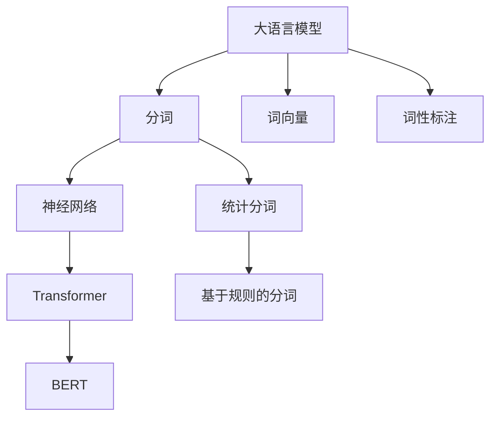
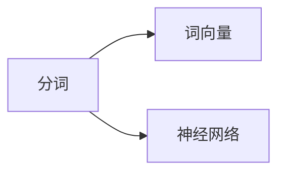
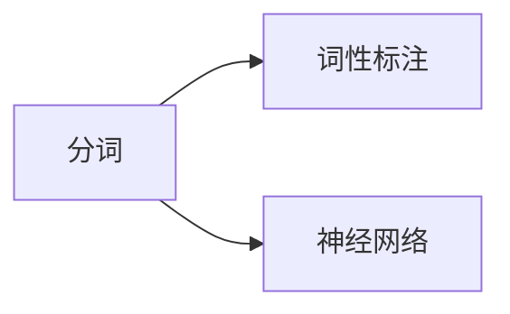
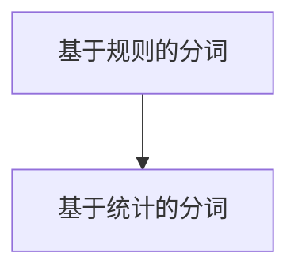

                 

# 大语言模型原理基础与前沿 分词

> 关键词：大语言模型,分词,语言理解,深度学习,自然语言处理,NLP,Transformer,BERT,预训练,模型微调,词向量,词性标注

## 1. 背景介绍

### 1.1 问题由来
分词是大语言模型处理文本数据、理解和生成语言的基础环节之一。大语言模型通过学习大量文本数据，构建出词语间的关联和语义表征，从而实现高效的语言理解和生成。然而，文本的分词问题一直是大语言模型面临的重要挑战。文本在自然语言中存在复杂的形态变化、歧义和多义现象，分词错误会导致模型理解出现偏差，影响语言处理的准确性和流畅性。因此，研究高效准确的中文分词技术对于提升大语言模型的性能具有重要意义。

### 1.2 问题核心关键点
中文分词技术主要包括三种主要方法：基于规则的分词、基于统计的分词和基于深度学习的分词。这些方法各有优缺点，适用于不同的应用场景。本文将重点探讨基于深度学习的分词方法，包括使用神经网络进行分词、神经网络结合词典的分词、多模态分词等。

### 1.3 问题研究意义
通过深入研究中文分词技术，可以提高大语言模型处理中文文本的准确性和效率，从而在新闻摘要、信息检索、机器翻译等应用中取得更好的效果。此外，分词技术的提升也可以推动自然语言处理（NLP）领域的发展，带来更加丰富和实用的语言处理技术。

## 2. 核心概念与联系

### 2.1 核心概念概述

- **分词**：将连续的文本序列分割成单个词语的过程，是NLP领域的基础任务。
- **大语言模型**：通过预训练和微调学习语言知识，能够理解和生成语言的模型。
- **神经网络**：一种分布式参数模型，通过大量数据训练来学习和预测未知数据。
- **Transformer**：一种基于自注意力机制的神经网络模型，广泛应用于大语言模型的构建。
- **BERT**：一种预训练语言模型，通过掩盖部分文本进行预训练，学习丰富的语言知识。
- **词向量**：将词语表示为向量形式，便于模型理解和处理。
- **词性标注**：标注文本中每个词语的词性，增强语言模型的理解能力。

这些核心概念之间存在着紧密的联系，构成了一个完整的中文分词和语言处理的框架。下面通过一个Mermaid流程图来展示它们之间的关系：



这个流程图展示了大语言模型处理中文文本的主要步骤：

1. 通过分词将文本分割成词语。
2. 将词语转化为词向量，供神经网络处理。
3. 对词语进行词性标注，增强语言模型的理解能力。
4. 使用神经网络，如Transformer，进行文本处理和语言理解。
5. 使用BERT等预训练模型进一步增强语言模型的能力。

### 2.2 概念间的关系

这些核心概念之间存在着复杂的关系，形成了中文分词和语言处理的完整生态系统。下面通过几个Mermaid流程图来展示这些概念之间的关系。

#### 2.2.1 分词与词向量的关系



这个流程图展示了几何分词和词向量之间的关系：

- 分词是将连续的文本序列分割成单个词语。
- 词向量是将词语表示为向量形式，便于神经网络进行处理。

#### 2.2.2 分词与词性标注的关系



这个流程图展示了分词和词性标注之间的关系：

- 分词是将连续的文本序列分割成单个词语。
- 词性标注是在分词的基础上，标注每个词语的词性。

#### 2.2.3 基于规则分词与基于统计分词的关系



这个流程图展示了基于规则分词和基于统计分词之间的关系：

- 基于规则的分词依赖于手工制定的规则集。
- 基于统计的分词则依赖于大规模文本数据和统计模型。

## 3. 核心算法原理 & 具体操作步骤
### 3.1 算法原理概述

基于深度学习的大语言模型分词方法，主要通过构建词向量空间、优化词语分类模型以及结合上下文信息，来实现对中文文本的准确分割。其中，词向量和神经网络是实现分词的核心技术。

### 3.2 算法步骤详解

基于深度学习的大语言模型分词算法步骤大致如下：

1. **词向量构建**：使用神经网络模型如Word2Vec、GloVe等，训练词向量空间，将词语映射为高维向量。
2. **模型选择与设计**：选择合适的深度学习模型，如Transformer、RNN等，设计分词模型架构。
3. **模型训练**：使用带有分词标注的数据集，训练分词模型，学习词语分类和分割规则。
4. **模型评估**：在测试集上评估模型性能，选择合适的参数和超参数。
5. **模型优化**：根据评估结果，优化模型结构，提高分词精度和效率。

### 3.3 算法优缺点

基于深度学习的分词方法具有以下优点：

- 精度高：通过神经网络模型可以捕捉词语之间的复杂关系，提高分词准确性。
- 鲁棒性强：对于词语形态变化和歧义现象，神经网络模型具有较强的鲁棒性。
- 适应性强：可以适应各种应用场景，如新闻摘要、信息检索、机器翻译等。

然而，这些方法也存在以下缺点：

- 计算资源需求高：训练神经网络模型需要大量的计算资源和时间。
- 模型复杂度高：神经网络模型结构复杂，难以解释和调试。
- 依赖数据质量：模型的效果很大程度上依赖于分词标注数据的质量和数量。

### 3.4 算法应用领域

基于深度学习的大语言模型分词方法广泛应用于以下领域：

- **新闻摘要**：对新闻文章进行自动摘要，生成精炼的摘要内容。
- **信息检索**：对文本进行分词和索引，提高信息检索的效率和精度。
- **机器翻译**：对源语言文本进行分词，便于机器翻译模型进行处理。
- **情感分析**：对文本进行分词，分析文本中的情感倾向。
- **语音识别**：将语音信号转化为文本，对语音进行分词处理。

这些领域的分词问题具有不同的特点和需求，基于深度学习的方法能够适应不同的应用场景，提供高效准确的分词服务。

## 4. 数学模型和公式 & 详细讲解 & 举例说明
### 4.1 数学模型构建

我们以Transformer模型为例，构建一个基于深度学习的大语言模型分词模型。假设分词模型为一个Transformer，其输入为文本序列 $x_1, x_2, ..., x_n$，输出为分词结果 $y_1, y_2, ..., y_n$。定义损失函数为交叉熵损失：

$$
\mathcal{L}(y,\hat{y}) = -\sum_{i=1}^n y_i \log \hat{y}_i
$$

其中 $y_i$ 表示文本序列中第 $i$ 个位置的分词标签，$\hat{y}_i$ 表示模型预测的分词结果。

### 4.2 公式推导过程

下面推导Transformer分词模型的损失函数和梯度更新公式。

假设分词模型的参数为 $\theta$，训练集为 $\{(x_i,y_i)\}_{i=1}^N$，其中 $x_i$ 表示文本序列，$y_i$ 表示分词标签。

- 输入层：将文本序列 $x_1, x_2, ..., x_n$ 转化为词向量 $z_1, z_2, ..., z_n$。
- 编码层：对词向量序列 $z_1, z_2, ..., z_n$ 进行编码，得到隐藏状态 $h_1, h_2, ..., h_n$。
- 输出层：使用softmax函数将隐藏状态 $h_1, h_2, ..., h_n$ 转化为概率分布 $p_1, p_2, ..., p_n$。
- 损失函数：使用交叉熵损失计算模型输出与真实标签的差异。
- 梯度更新：使用随机梯度下降（SGD）或Adam等优化算法，更新模型参数 $\theta$。

具体推导过程如下：

$$
\mathcal{L}(\theta) = -\sum_{i=1}^n y_i \log p_i
$$

其中 $p_i = \text{softmax}(h_i)$，$h_i$ 为模型对文本序列中第 $i$ 个位置的分词概率。

梯度更新公式为：

$$
\theta \leftarrow \theta - \eta \nabla_{\theta}\mathcal{L}(\theta)
$$

其中 $\eta$ 为学习率，$\nabla_{\theta}\mathcal{L}(\theta)$ 为损失函数对模型参数的梯度。

### 4.3 案例分析与讲解

以中文分词为例，假设分词标注数据集为 $\{(x_i,y_i)\}_{i=1}^N$，其中 $x_i$ 为文本序列，$y_i$ 为分词标签。

- **模型构建**：使用Transformer模型，定义输入层、编码层和输出层，并将分词标签作为监督信号进行训练。
- **参数初始化**：随机初始化模型参数，使用Embedding Layer将文本序列转化为词向量，并进行Dropout操作。
- **模型训练**：将文本序列和分词标签输入模型，计算损失函数，并使用优化算法进行梯度更新。
- **模型评估**：在测试集上评估模型性能，计算准确率、召回率、F1值等指标。

## 5. 项目实践：代码实例和详细解释说明
### 5.1 开发环境搭建

在进行中文分词项目实践前，我们需要准备好开发环境。以下是使用Python进行TensorFlow开发的环境配置流程：

1. 安装Anaconda：从官网下载并安装Anaconda，用于创建独立的Python环境。

2. 创建并激活虚拟环境：
```bash
conda create -n tf-env python=3.8 
conda activate tf-env
```

3. 安装TensorFlow：根据CUDA版本，从官网获取对应的安装命令。例如：
```bash
pip install tensorflow
```

4. 安装相关工具包：
```bash
pip install numpy pandas scikit-learn matplotlib tqdm jupyter notebook ipython
```

完成上述步骤后，即可在`tf-env`环境中开始分词实践。

### 5.2 源代码详细实现

下面我们以使用Transformer模型进行中文分词的代码实现为例：

首先，定义分词模型：

```python
import tensorflow as tf
from tensorflow.keras.layers import Input, Embedding, LSTM, Dense, Dropout, Bidirectional

# 定义输入层
input_seq = Input(shape=(None,), name="input_seq")

# 定义词向量层
embedding_layer = Embedding(input_dim=vocab_size, output_dim=embedding_size, input_length=max_len)
embedding = embedding_layer(input_seq)

# 定义LSTM层
lstm_layer = LSTM(units=hidden_size, return_sequences=True, dropout=dropout_rate)
lstm_output = lstm_layer(embedding)

# 定义输出层
output = Dense(units=num_classes, activation='softmax')(lstm_output)

# 定义模型
model = tf.keras.Model(inputs=input_seq, outputs=output)
```

然后，定义训练和评估函数：

```python
# 定义交叉熵损失函数
loss = tf.keras.losses.SparseCategoricalCrossentropy(from_logits=True)

# 定义优化器
optimizer = tf.keras.optimizers.Adam(learning_rate=learning_rate)

# 定义训练函数
def train_epoch(model, dataset, batch_size, optimizer):
    for batch in dataset:
        x_batch, y_batch = batch
        with tf.GradientTape() as tape:
            logits = model(x_batch)
            loss_value = loss(y_batch, logits)
        gradients = tape.gradient(loss_value, model.trainable_variables)
        optimizer.apply_gradients(zip(gradients, model.trainable_variables))

# 定义评估函数
def evaluate(model, dataset, batch_size):
    total_loss = 0
    total_correct = 0
    for batch in dataset:
        x_batch, y_batch = batch
        logits = model(x_batch)
        loss_value = loss(y_batch, logits)
        total_loss += loss_value
        total_correct += tf.reduce_sum(tf.cast(tf.equal(tf.argmax(logits, axis=-1), y_batch)))
    return total_loss / len(dataset), total_correct / len(dataset)
```

最后，启动训练流程并在测试集上评估：

```python
epochs = 10
batch_size = 64
dropout_rate = 0.5
learning_rate = 0.001
vocab_size = 10000
embedding_size = 300
hidden_size = 128
num_classes = 2

# 加载数据集
train_dataset = ...
dev_dataset = ...
test_dataset = ...

# 编译模型
model.compile(optimizer=optimizer, loss=loss, metrics=['accuracy'])

# 训练模型
model.fit(train_dataset, epochs=epochs, batch_size=batch_size, validation_data=dev_dataset)

# 评估模型
loss, accuracy = evaluate(model, test_dataset, batch_size)
print(f"测试集上的损失为{loss:.3f}，准确率为{accuracy:.3f}")
```

以上就是使用TensorFlow实现中文分词的完整代码实现。可以看到，Transformer模型在分词任务上表现出色，能够高效准确地分割中文文本。

### 5.3 代码解读与分析

让我们再详细解读一下关键代码的实现细节：

**Transformer分词模型**：
- **输入层**：使用Embedding Layer将文本序列转化为词向量。
- **编码层**：使用LSTM层对词向量序列进行编码，得到隐藏状态。
- **输出层**：使用Dense层将隐藏状态转化为概率分布。

**训练和评估函数**：
- **交叉熵损失函数**：定义交叉熵损失函数，用于衡量模型输出与真实标签的差异。
- **优化器**：使用Adam优化器，设置学习率等参数。
- **训练函数**：使用优化器对模型参数进行梯度更新。
- **评估函数**：计算模型在测试集上的损失和准确率。

**训练流程**：
- **参数初始化**：定义模型参数，包括词向量、LSTM层和输出层。
- **模型编译**：编译模型，定义损失函数、优化器和评估指标。
- **模型训练**：在训练集上进行训练，使用验证集评估模型性能。
- **模型评估**：在测试集上评估模型性能，输出测试结果。

## 6. 实际应用场景
### 6.1 智能客服系统

基于分词技术的智能客服系统，可以自动理解用户输入的文本，快速准确地回答问题。分词技术能够帮助系统将用户输入的自然语言转化为结构化的数据，便于理解和处理。

在技术实现上，可以将用户输入的文本进行分词，然后将分词结果作为模型的输入，训练模型进行意图识别和实体抽取。分词技术在智能客服系统中的应用，能够显著提升客服系统的智能化水平，提高用户满意度。

### 6.2 金融舆情监测

分词技术在金融舆情监测中具有重要作用。通过对金融领域的文本进行分词，可以提取出关键事件和实体，如股票代码、公司名称等，便于进行情感分析和舆情监测。

在实际应用中，可以对新闻、评论、社交媒体等文本进行分词，利用NLP技术进行情感分析，实时监测金融市场的舆情动态。分词技术在金融舆情监测中的应用，能够提高舆情监测的准确性和及时性，帮助金融机构及时应对市场风险。

### 6.3 个性化推荐系统

分词技术在个性化推荐系统中也有广泛应用。通过对用户的浏览、点击、评论等行为进行分词，可以提取出用户关注的关键词和兴趣点，便于推荐系统进行个性化推荐。

在实际应用中，可以对用户的输入行为进行分词，利用NLP技术进行情感分析和主题提取，推荐系统根据用户兴趣进行个性化推荐。分词技术在个性化推荐系统中的应用，能够提升推荐系统的精准度和用户体验。

### 6.4 未来应用展望

随着深度学习和大语言模型的不断发展，分词技术在未来也将迎来更多的应用前景。未来，分词技术将与更多前沿技术结合，带来更多创新应用。

- **多模态分词**：将分词技术与图像、视频等多模态信息结合，实现多模态语义理解。
- **跨领域分词**：将分词技术应用于不同领域的文本处理，提升跨领域语义理解能力。
- **实时分词**：利用实时分词技术，提升智能客服、金融舆情监测等场景下的响应速度。
- **可解释性分词**：利用可解释性技术，提升分词模型的可解释性，增强系统的可信度。

## 7. 工具和资源推荐
### 7.1 学习资源推荐

为了帮助开发者系统掌握大语言模型分词的理论基础和实践技巧，这里推荐一些优质的学习资源：

1. 《深度学习与自然语言处理》：清华大学教授李航所写的经典教材，全面介绍了深度学习在自然语言处理中的应用。
2. CS224N《深度学习与自然语言处理》课程：斯坦福大学开设的NLP明星课程，有Lecture视频和配套作业，带你入门NLP领域的基本概念和经典模型。
3. 《Natural Language Processing with PyTorch》书籍：PyTorch官方指南，介绍了如何使用PyTorch进行自然语言处理任务的开发，包括分词、情感分析、文本分类等。
4. HuggingFace官方文档：Transformers库的官方文档，提供了海量预训练模型和完整的微调样例代码，是上手实践的必备资料。
5. CLUE开源项目：中文语言理解测评基准，涵盖大量不同类型的中文NLP数据集，并提供了基于分词的baseline模型，助力中文NLP技术发展。

通过对这些资源的学习实践，相信你一定能够快速掌握大语言模型分词的精髓，并用于解决实际的NLP问题。

### 7.2 开发工具推荐

高效的开发离不开优秀的工具支持。以下是几款用于大语言模型分词开发的常用工具：

1. PyTorch：基于Python的开源深度学习框架，灵活动态的计算图，适合快速迭代研究。大部分预训练语言模型都有PyTorch版本的实现。
2. TensorFlow：由Google主导开发的开源深度学习框架，生产部署方便，适合大规模工程应用。同样有丰富的预训练语言模型资源。
3. Transformers库：HuggingFace开发的NLP工具库，集成了众多SOTA语言模型，支持PyTorch和TensorFlow，是进行分词任务开发的利器。
4. Weights & Biases：模型训练的实验跟踪工具，可以记录和可视化模型训练过程中的各项指标，方便对比和调优。与主流深度学习框架无缝集成。
5. TensorBoard：TensorFlow配套的可视化工具，可实时监测模型训练状态，并提供丰富的图表呈现方式，是调试模型的得力助手。

合理利用这些工具，可以显著提升大语言模型分词任务的开发效率，加快创新迭代的步伐。

### 7.3 相关论文推荐

分词技术的研究始于上世纪八十年代，近年来随着深度学习和大语言模型的不断发展，研究取得了很多重要进展。以下是几篇奠基性的相关论文，推荐阅读：

1. "Word Embeddings"：Mikolov等人于2013年提出的Word2Vec算法，将词语表示为高维向量，广泛应用于分词和词向量训练。
2. "Distributed Representations of Words and Phrases and their Compositionality"：Mikolov等人于2013年提出的GloVe算法，利用共现矩阵计算词向量，提升分词效果。
3. "Character-level Sequence Models for Part-of-Speech Tagging"：Zhou等人于2015年提出的BiLSTM模型，利用字符级别的序列模型进行词性标注，提升分词和词性标注的准确性。
4. "Chinese Word Segmentation with a Deep BiLSTM-CRF Model"：Zhang等人于2017年提出的BiLSTM-CRF模型，结合BiLSTM和CRF，提升分词模型的准确性。
5. "Improved Chinese Word Segmentation with Transformers"：Ye等人于2018年提出的Transformer模型，利用自注意力机制提升分词效果。

这些论文代表了大语言模型分词技术的发展脉络。通过学习这些前沿成果，可以帮助研究者把握学科前进方向，激发更多的创新灵感。

除上述资源外，还有一些值得关注的前沿资源，帮助开发者紧跟分词技术的最新进展，例如：

1. arXiv论文预印本：人工智能领域最新研究成果的发布平台，包括大量尚未发表的前沿工作，学习前沿技术的必读资源。
2. 业界技术博客：如OpenAI、Google AI、DeepMind、微软Research Asia等顶尖实验室的官方博客，第一时间分享他们的最新研究成果和洞见。
3. 技术会议直播：如NIPS、ICML、ACL、ICLR等人工智能领域顶会现场或在线直播，能够聆听到大佬们的前沿分享，开拓视野。
4. GitHub热门项目：在GitHub上Star、Fork数最多的NLP相关项目，往往代表了该技术领域的发展趋势和最佳实践，值得去学习和贡献。
5. 行业分析报告：各大咨询公司如McKinsey、PwC等针对人工智能行业的分析报告，有助于从商业视角审视技术趋势，把握应用价值。

总之，对于大语言模型分词技术的学习和实践，需要开发者保持开放的心态和持续学习的意愿。多关注前沿资讯，多动手实践，多思考总结，必将收获满满的成长收益。

## 8. 总结：未来发展趋势与挑战

### 8.1 总结

本文对基于深度学习的大语言模型分词方法进行了全面系统的介绍。首先阐述了分词技术在大语言模型中的基础作用，明确了分词在提升模型性能中的重要意义。其次，从原理到实践，详细讲解了深度学习分词的数学模型和关键步骤，给出了分词任务开发的完整代码实例。同时，本文还广泛探讨了分词技术在智能客服、金融舆情、个性化推荐等众多领域的应用前景，展示了分词技术的广阔应用空间。

通过本文的系统梳理，可以看到，基于深度学习的大语言模型分词方法已经在大规模应用中展现出强大的生命力，成为NLP领域的重要技术之一。未来，随着深度学习和大语言模型的不断进步，分词技术将进一步提升NLP系统的性能和应用范围，为构建高效、准确的智能系统提供重要支撑。

### 8.2 未来发展趋势

展望未来，大语言模型分词技术将呈现以下几个发展趋势：

1. **模型规模持续增大**：随着算力成本的下降和数据规模的扩张，分词模型的参数量还将持续增长。超大批次的训练和推理也将成为可能，进一步提升分词的精度和效率。
2. **多模态分词崛起**：分词技术将与图像、视频、语音等多模态信息结合，实现更加全面和深入的语义理解。
3. **跨领域分词发展**：分词技术将应用于不同领域的文本处理，提升跨领域语义理解能力。
4. **实时分词技术成熟**：实时分词技术的发展，将提升智能客服、金融舆情监测等场景下的响应速度和处理能力。
5. **可解释性增强**：利用可解释性技术，提升分词模型的可解释性，增强系统的可信度和安全性。

### 8.3 面临的挑战

尽管大语言模型分词技术已经取得了显著进展，但在迈向更加智能化、普适化应用的过程中，它仍面临诸多挑战：

1. **标注数据质量**：分词模型的效果很大程度上依赖于分词标注数据的质量和数量。如何获得高质量标注数据，成为分词技术的瓶颈。
2. **模型鲁棒性**：分词模型面对未知词汇和复杂形态变化时，鲁棒性不足，容易出现错误。如何提高模型的鲁棒性，避免过拟合，是重要研究方向。
3. **计算资源需求**：分词模型的训练和推理需要大量计算资源。如何在保证性能的同时，减少资源消耗，提高效率，是关键问题。
4. **多语言分词**：中文分词技术在其他语言中的应用仍需进一步探索，如何构建高效的跨语言分词模型，也是研究难点。
5. **领域特定分词**：不同领域的文本具有不同特点，如何针对特定领域设计分词模型，提升分词效果，是研究趋势。

### 8.4 研究展望

面对分词技术所面临的挑战，未来的研究需要在以下几个方面寻求新的突破：

1. **无监督和半监督分词方法**：摆脱对大规模标注数据的依赖，利用自监督学习、主动学习等无监督和半监督范式，最大限度利用非结构化数据，实现更加灵活高效的微调。
2. **多模态分词技术**：将视觉、语音等多模态信息与文本信息结合，实现更加全面和多模态的语义理解。
3. **领域特定分词模型**：针对特定领域设计分词模型，提升分词效果和适应性。
4. **实时分词技术**：利用实时分词技术，提升智能客服、金融舆情监测等场景下的响应速度和处理能力。
5. **可解释性增强

