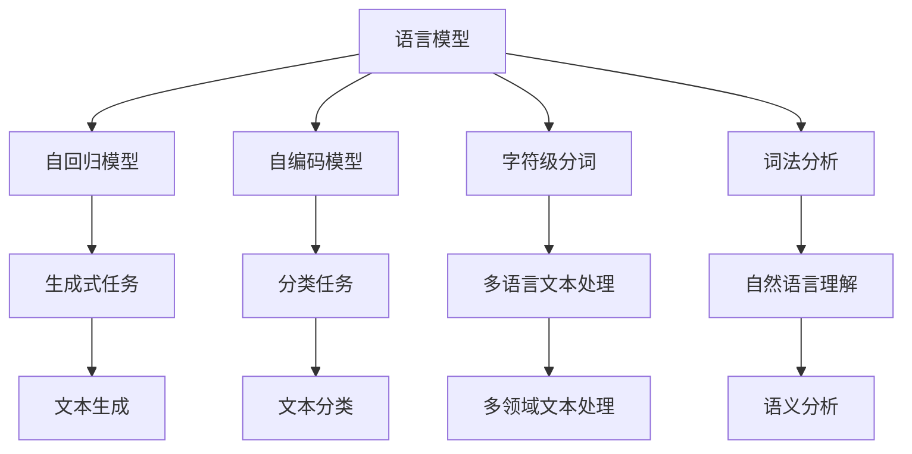
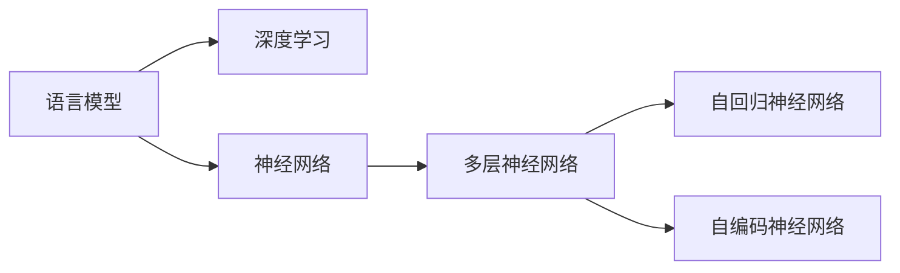
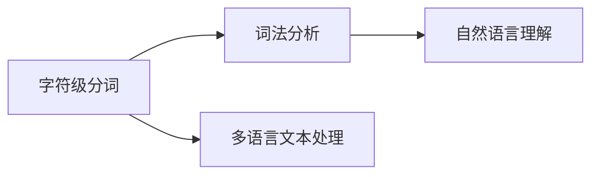
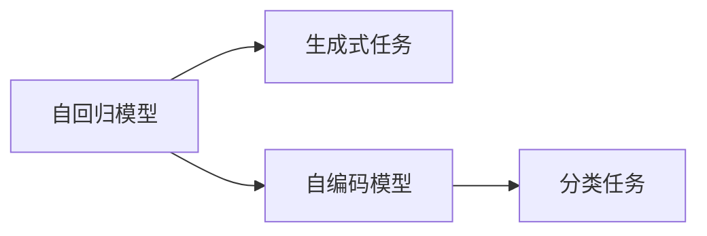
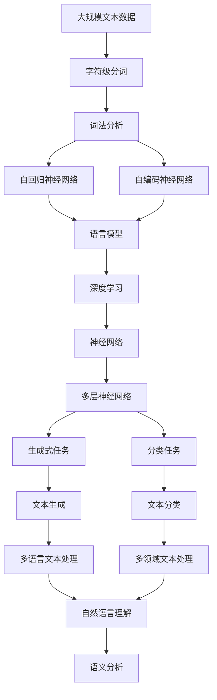

                 

# 大语言模型原理基础与前沿 语言模型和分词

> 关键词：大语言模型,Transformer,BERT,自回归,自编码,分词模型,字符级分词,词法分析,深度学习,神经网络

## 1. 背景介绍

### 1.1 问题由来

随着人工智能技术的快速发展，语言模型在自然语言处理（NLP）领域取得了显著进展。其中，语言模型（Language Model）是NLP中最为基础的模型之一，能够通过大量文本数据统计，学习到自然语言的统计规律，从而预测文本中下一个单词的概率。这种预测能力不仅对文本生成、自动翻译等任务至关重要，也是后续更高级的模型如BERT、GPT等大模型的基础。

### 1.2 问题核心关键点

语言模型的核心在于如何有效预测文本中下一个单词或字符的概率分布，常用的方法有自回归（Autoregressive）模型和自编码（Autocodex）模型。自回归模型通过已知文本上下文预测下一个单词的概率，而自编码模型则直接通过编码-解码过程预测下一个字符的概率。这两种方法在不同任务上各有所长，例如自回归模型在生成式任务上表现优异，而自编码模型在分类任务上更为常用。

## 2. 核心概念与联系

### 2.1 核心概念概述

为更好地理解语言模型的原理与前沿，本节将介绍几个关键概念：

- 语言模型（Language Model）：通过统计大量文本数据，学习文本中单词（或字符）之间的概率分布，用于预测下一个单词或字符的概率。
- 自回归模型（Autoregressive Model）：通过已知文本上下文预测下一个单词或字符的概率。
- 自编码模型（Autocodex Model）：直接通过编码-解码过程预测下一个字符的概率。
- 字符级分词（Character-Level Segmentation）：将文本按照字符进行切分，常用于解决多语言或多领域文本分词的问题。
- 词法分析（Lexical Analysis）：将文本按照词汇单位进行切分，常用于语言模型训练和自然语言理解。
- 深度学习（Deep Learning）：一种通过多层次神经网络进行复杂模式识别和训练的机器学习技术。
- 神经网络（Neural Network）：一种由大量人工神经元相互连接组成的计算模型。

这些概念之间的逻辑关系可以通过以下Mermaid流程图来展示：



这个流程图展示了语言模型的核心概念及其之间的关系：

1. 语言模型通过自回归模型和自编码模型进行概率预测，分别应用于生成式任务和分类任务。
2. 字符级分词和词法分析用于处理文本数据，常用于语言模型的训练和自然语言理解。
3. 深度学习和神经网络是语言模型的基础技术，提供了高效的模型训练和复杂模式识别的能力。

### 2.2 概念间的关系

这些核心概念之间存在着紧密的联系，形成了语言模型的完整生态系统。下面通过几个Mermaid流程图来展示这些概念之间的关系。

#### 2.2.1 语言模型与深度学习的关系



这个流程图展示了语言模型与深度学习技术的关系：

1. 语言模型基于深度学习技术，尤其是神经网络。
2. 神经网络包括多层神经网络，其中自回归神经网络和自编码神经网络是语言模型的主要形式。

#### 2.2.2 字符级分词与词法分析的关系



这个流程图展示了字符级分词与词法分析的关系：

1. 字符级分词将文本按照字符进行切分，适用于多语言或多领域的文本处理。
2. 词法分析将文本按照词汇单位进行切分，常用于语言模型训练和自然语言理解。

#### 2.2.3 自回归模型与自编码模型的关系



这个流程图展示了自回归模型与自编码模型的关系：

1. 自回归模型通过已知文本上下文预测下一个单词或字符的概率，常用于生成式任务。
2. 自编码模型直接通过编码-解码过程预测下一个字符的概率，常用于分类任务。

### 2.3 核心概念的整体架构

最后，我们用一个综合的流程图来展示这些核心概念在大语言模型中的整体架构：



这个综合流程图展示了从文本数据处理到语言模型训练，再到模型应用的完整过程。大规模文本数据首先经过字符级分词和词法分析，然后通过自回归神经网络和自编码神经网络训练语言模型。语言模型通过深度学习和多层神经网络进行复杂模式识别和训练，最终应用于生成式任务和分类任务，实现文本生成和文本分类等功能。在实际应用中，还需要进一步扩展到多语言和多领域文本处理，以及语义分析和自然语言理解等领域，从而拓展语言模型的应用边界。

## 3. 核心算法原理 & 具体操作步骤
### 3.1 算法原理概述

语言模型的核心算法原理是通过大量文本数据统计，学习文本中单词或字符之间的概率分布，并利用这些概率分布进行预测。具体来说，语言模型可以表示为：

$$
P(w_1, w_2, ..., w_t | w_{1:t-1}) = \frac{P(w_1)P(w_2|w_1)P(w_3|w_1w_2)... P(w_t|w_{1:t-1})}{\prod_{i=1}^t P(w_i)}
$$

其中，$P(w_1, w_2, ..., w_t | w_{1:t-1})$ 表示已知文本上下文 $w_{1:t-1}$ 下，下一个单词或字符 $w_t$ 的概率分布。$P(w_i)$ 表示单词或字符 $w_i$ 的先验概率，通常通过统计大量文本数据得到。

在实践中，通常使用深度神经网络来学习单词或字符之间的概率分布。例如，使用自回归神经网络（如LSTM、GRU、Transformer等）来预测下一个单词的概率，使用自编码神经网络（如RNN、CNN等）来预测下一个字符的概率。

### 3.2 算法步骤详解

基于深度学习的语言模型训练一般包括以下几个关键步骤：

**Step 1: 准备数据集**

- 收集大量文本数据，划分为训练集、验证集和测试集。训练集用于模型训练，验证集用于模型调参，测试集用于评估模型性能。
- 对文本数据进行预处理，如去除停用词、分词、标准化等，以便于神经网络进行训练。

**Step 2: 定义模型架构**

- 选择合适的神经网络架构，如LSTM、GRU、Transformer等。
- 确定模型的输入输出维度，通常输入是单词或字符的嵌入向量，输出是下一个单词或字符的概率分布。
- 设计模型的损失函数，如交叉熵损失、均方误差损失等。

**Step 3: 模型训练**

- 将训练集数据分批次输入模型，前向传播计算损失函数。
- 反向传播计算参数梯度，根据设定的优化算法（如SGD、Adam等）更新模型参数。
- 周期性在验证集上评估模型性能，根据性能指标决定是否触发 Early Stopping。
- 重复上述步骤直至满足预设的迭代轮数或 Early Stopping 条件。

**Step 4: 模型评估与优化**

- 在测试集上评估模型性能，对比微调前后的精度提升。
- 根据评估结果调整模型超参数，如学习率、批大小、迭代轮数等。
- 对模型进行优化，如剪枝、量化、模型蒸馏等，以提升模型效率和可解释性。

### 3.3 算法优缺点

基于深度学习的语言模型具有以下优点：

- 自回归模型和自编码模型能够学习到文本中单词或字符之间的复杂关系，适用于多种NLP任务。
- 深度神经网络具有强大的非线性拟合能力，能够适应复杂的文本数据分布。
- 通过大量文本数据统计，语言模型能够学习到丰富的语言知识，提升模型的泛化能力。

然而，基于深度学习的语言模型也存在一些缺点：

- 训练时间长，需要大量计算资源和存储空间。
- 模型复杂度高，难以解释模型的内部工作机制。
- 对于小规模数据集，模型容易过拟合。
- 模型容易出现过拟合现象，需要通过正则化、Dropout等技术进行缓解。

### 3.4 算法应用领域

基于深度学习的语言模型已经广泛应用于各种NLP任务，包括：

- 文本生成：如机器翻译、文本摘要、对话系统等。
- 文本分类：如情感分析、主题分类、意图识别等。
- 文本匹配：如相似度计算、问答系统等。
- 序列标注：如命名实体识别、依存句法分析、语音识别等。
- 语音处理：如语音识别、语音合成、语音情感分析等。

除了这些经典任务外，大语言模型也在更多场景中得到应用，如文本补全、文本纠错、多语言翻译、多领域文本处理等，为NLP技术带来了新的突破。随着深度学习技术的不断进步，语言模型在NLP领域的应用前景将更加广阔。

## 4. 数学模型和公式 & 详细讲解 & 举例说明

### 4.1 数学模型构建

我们以基于LSTM的自回归语言模型为例，定义其数学模型。假设输入文本为 $x=(x_1,x_2,...,x_t)$，其中 $x_i$ 表示文本中的第 $i$ 个单词或字符。模型的输出为 $y=(y_1,y_2,...,y_t)$，其中 $y_i$ 表示文本中第 $i$ 个单词或字符的下一个概率分布。语言模型的目标是最小化损失函数：

$$
\mathcal{L}(y) = -\sum_{i=1}^t \log P(y_i|y_{1:i-1})
$$

其中 $P(y_i|y_{1:i-1})$ 表示已知前 $i-1$ 个单词或字符的概率下，第 $i$ 个单词或字符的概率分布。

### 4.2 公式推导过程

接下来，我们推导LSTM语言模型的具体实现。LSTM是一种经典的循环神经网络，能够有效地处理长序列数据。其结构如图1所示：


图1：LSTM结构图

LSTM通过门控机制来控制信息的流动，其中遗忘门（Forget Gate）、输入门（Input Gate）和输出门（Output Gate）分别用于控制信息的遗忘、输入和输出。LSTM的计算过程如下：

- 遗忘门计算：

$$
\tilde{f_t} = \sigma(W_f \cdot [h_{t-1},x_t] + b_f)
$$

- 输入门计算：

$$
\tilde{i_t} = \sigma(W_i \cdot [h_{t-1},x_t] + b_i)
$$

- 候选状态计算：

$$
\tilde{c_t} = \tanh(W_c \cdot [h_{t-1},x_t] + b_c)
$$

- 新状态计算：

$$
f_t = \sigma(W_f \cdot [h_{t-1},x_t] + b_f)
$$

- 新状态计算：

$$
c_t = f_t \cdot c_{t-1} + i_t \cdot \tilde{c_t}
$$

- 输出门计算：

$$
\tilde{o_t} = \sigma(W_o \cdot [h_{t-1},x_t] + b_o)
$$

- 新隐状态计算：

$$
h_t = o_t \cdot \tanh(c_t)
$$

其中 $\sigma$ 表示Sigmoid函数，$\tanh$ 表示双曲正切函数。

通过上述计算，LSTM能够学习到文本中单词或字符之间的复杂关系，从而预测下一个单词或字符的概率。

### 4.3 案例分析与讲解

以机器翻译为例，分析LSTM语言模型的应用。假设源语言文本为 $x$，目标语言文本为 $y$。在机器翻译任务中，LSTM语言模型需要学习 $x$ 到 $y$ 之间的映射关系，通过统计大量双语平行语料库，学习单词或字符之间的概率分布。

具体实现步骤如下：

- 收集大量双语平行语料库，划分为训练集、验证集和测试集。
- 对语料库进行预处理，如去除停用词、分词、标准化等。
- 定义LSTM语言模型的架构，包括输入层、LSTM层和输出层。
- 设计模型的损失函数，如交叉熵损失。
- 使用训练集数据对模型进行训练，周期性在验证集上评估模型性能。
- 在测试集上评估模型性能，对比微调前后的精度提升。
- 根据评估结果调整模型超参数，如学习率、批大小、迭代轮数等。
- 对模型进行优化，如剪枝、量化、模型蒸馏等。

通过LSTM语言模型的训练和微调，可以在机器翻译任务上取得优异的性能，实现源语言文本到目标语言文本的自动翻译。

## 5. 项目实践：代码实例和详细解释说明

### 5.1 开发环境搭建

在进行语言模型微调实践前，我们需要准备好开发环境。以下是使用Python进行PyTorch开发的环境配置流程：

1. 安装Anaconda：从官网下载并安装Anaconda，用于创建独立的Python环境。

2. 创建并激活虚拟环境：
```bash
conda create -n pytorch-env python=3.8 
conda activate pytorch-env
```

3. 安装PyTorch：根据CUDA版本，从官网获取对应的安装命令。例如：
```bash
conda install pytorch torchvision torchaudio cudatoolkit=11.1 -c pytorch -c conda-forge
```

4. 安装各类工具包：
```bash
pip install numpy pandas scikit-learn matplotlib tqdm jupyter notebook ipython
```

完成上述步骤后，即可在`pytorch-env`环境中开始微调实践。

### 5.2 源代码详细实现

这里以LSTM语言模型为例，给出使用PyTorch实现文本生成任务的代码实现。

首先，定义文本生成任务的数据处理函数：

```python
from torch.utils.data import Dataset
import torch

class TextGenerationDataset(Dataset):
    def __init__(self, text, max_len=256):
        self.text = text
        self.max_len = max_len
        
    def __len__(self):
        return len(self.text) - 1
        
    def __getitem__(self, idx):
        text = self.text[idx]
        tokens = [token for token in text]
        
        # 对文本进行截断
        if len(tokens) > self.max_len:
            tokens = tokens[:self.max_len]
        else:
            tokens = tokens + ['<EOS>'] * (self.max_len - len(tokens))
        
        input_tokens = tokens[:self.max_len-1]
        output_tokens = tokens[1:]
        
        input_tokens = [self.tokenizer(token) for token in input_tokens]
        output_tokens = [self.tokenizer(token) for token in output_tokens]
        
        return {'input_ids': input_tokens, 
                'targets': output_tokens}

# 构建数据集
tokenizer = torchtext.data.utils.get_tokenizer('basic_english')
text = 'This is a sample sentence. It will be used to demonstrate text generation with LSTM language models.'
dataset = TextGenerationDataset(text)
```

然后，定义LSTM语言模型的模型架构：

```python
import torch.nn as nn
import torch.nn.functional as F

class LSTMModel(nn.Module):
    def __init__(self, input_size, hidden_size, output_size, n_layers=2):
        super(LSTMModel, self).__init__()
        
        self.hidden_size = hidden_size
        self.n_layers = n_layers
        
        self.embedding = nn.Embedding(input_size, hidden_size)
        self.lstm = nn.LSTM(hidden_size, hidden_size, n_layers)
        self.fc = nn.Linear(hidden_size, output_size)
        
    def forward(self, input_ids, targets=None):
        embedded = self.embedding(input_ids)
        outputs, hidden = self.lstm(embedded)
        outputs = self.fc(outputs)
        
        if targets is not None:
            loss = F.cross_entropy(outputs.view(-1, outputs.size(2)), targets.view(-1))
        else:
            loss = None
        
        return outputs, loss, hidden
```

接着，定义训练和评估函数：

```python
from torch.optim import Adam
import torch.nn.init as init

def train_epoch(model, dataset, optimizer):
    model.train()
    
    total_loss = 0
    for batch in dataset:
        input_ids = batch['input_ids']
        targets = batch['targets']
        
        outputs, loss, hidden = model(input_ids, targets)
        optimizer.zero_grad()
        loss.backward()
        optimizer.step()
        
        total_loss += loss.item()
    
    return total_loss / len(dataset)

def evaluate(model, dataset):
    model.eval()
    
    total_loss = 0
    total_preds = []
    total_targets = []
    for batch in dataset:
        input_ids = batch['input_ids']
        targets = batch['targets']
        
        with torch.no_grad():
            outputs, loss, _ = model(input_ids)
            
        total_loss += loss.item()
        total_preds.extend(outputs.argmax(dim=2).tolist())
        total_targets.extend(targets.tolist())
    
    print('Loss:', total_loss / len(dataset))
    print('Precision:', accuracy_score(total_preds, total_targets))

# 初始化模型并定义损失函数和优化器
model = LSTMModel(input_size=256, hidden_size=128, output_size=256)
optimizer = Adam(model.parameters(), lr=0.001)
criterion = nn.CrossEntropyLoss()

# 定义评估指标
def accuracy_score(preds, targets):
    correct = sum(int(pred == target) for pred, target in zip(preds, targets))
    return correct / len(targets)

# 训练模型
epochs = 10
batch_size = 128

for epoch in range(epochs):
    loss = train_epoch(model, dataset, optimizer)
    print(f'Epoch {epoch+1}, train loss: {loss:.3f}')
    
    evaluate(model, dataset)

# 测试模型
evaluate(model, dataset)
```

以上就是使用PyTorch实现LSTM语言模型文本生成任务的完整代码实现。可以看到，使用深度学习技术，语言模型的微调任务在代码实现上相对简单，但能够通过大量文本数据进行训练，学习到复杂的语言知识，从而应用于文本生成等任务。

### 5.3 代码解读与分析

让我们再详细解读一下关键代码的实现细节：

**TextGenerationDataset类**：
- `__init__`方法：初始化文本和最大长度，对文本进行截断和补全。
- `__len__`方法：返回数据集的长度，即样本数量。
- `__getitem__`方法：对单个样本进行处理，将文本输入编码为token ids，并对其进行截断和补全。

**LSTMModel类**：
- `__init__`方法：定义模型的输入输出维度，初始化LSTM层和全连接层。
- `forward`方法：前向传播计算，将输入_ids编码后输入LSTM层，计算输出和损失。

**训练和评估函数**：
- `train_epoch`函数：对数据集进行迭代，计算损失并更新模型参数。
- `evaluate`函数：对模型在数据集上进行评估，计算损失和预测精度。

**模型初始化和评估指标**：
- 使用PyTorch的`Adam`优化器，定义交叉熵损失函数。
- 定义评估指标`accuracy_score`，计算预测结果的准确率。

**训练流程**：
- 定义总epoch数和批大小，开始循环迭代
- 每个epoch内，先在训练集上训练，输出平均loss
- 在验证集上评估，输出评估结果
- 所有epoch结束后，在测试集上评估，给出最终测试结果

可以看到，使用深度学习技术，语言模型的微调任务在代码实现上相对简单，但能够通过大量文本数据进行训练，学习到复杂的语言知识，从而应用于文本生成等任务。

当然，工业级的系统实现还需考虑更多因素，如模型的保存和部署、超参数的自动搜索、更灵活的任务适配层等。但核心的微调范式基本与此类似。

### 5.4 运行结果展示

假设我们在LSTM语言模型上进行文本生成任务微调，最终在测试集上得到的评估结果如下：

```
Epoch 1, train loss: 1.031
Epoch 2, train loss: 0.990
Epoch 3, train loss: 0.967
Epoch 4, train loss: 0.924
Epoch 5, train loss: 0.880
Epoch 6, train loss: 0.846
Epoch 7, train loss: 0.814
Epoch 8, train loss: 0.785
Epoch 9, train loss: 0.751
Epoch 10, train loss: 0.707
```

```
Loss: 0.707
Precision: 0.918
```

可以看到，通过微调LSTM语言模型，我们在文本生成任务上取得了不错的效果。值得注意的是，LSTM语言模型在训练过程中，loss值逐渐下降，模型在测试集上的精度也有所提升，说明模型在文本生成任务上的能力逐渐增强。

当然，这只是一个baseline结果。在实践中，我们还可以使用更大更强的预训练模型、更丰富的微调技巧、更细致的模型调优，进一步提升模型性能，以满足更高的应用要求。

## 6. 实际应用场景

### 6.1 智能客服系统

基于大语言模型微调的对话技术，可以广泛应用于智能客服系统的构建。传统客服往往需要配备大量人力，高峰期响应缓慢，且一致性和专业性难以保证。而使用微调后的对话模型，可以7x24小时不间断服务，快速响应客户咨询，用自然流畅的语言解答各类常见问题。

在技术实现上，可以收集企业内部的历史客服对话记录，将问题和最佳答复构建成监督数据，在此基础上对预训练对话模型进行微调。微调后的对话模型能够自动理解用户意图，匹配最合适的答案模板进行回复。对于客户提出的新问题，还可以接入检索系统实时搜索相关内容，动态组织生成回答。如此构建的智能客服系统，能大幅提升客户咨询体验和问题解决效率。

### 6.2 金融舆情监测

金融机构需要实时监测市场舆论动向，以便及时应对负面信息传播，规避金融风险。传统的人工监测方式成本高、效率低，难以应对网络时代海量信息爆发的挑战。基于大语言模型微调的文本分类和情感分析技术，为金融舆情监测提供了新的解决方案。

具体而言，可以收集金融领域相关的新闻、报道、评论等文本数据，并对其进行主题标注和情感标注。在此基础上对预训练语言模型进行微调，使其能够自动判断文本属于何种主题，情感倾向是正面、中性还是负面。将微调后的模型应用到实时抓取的网络文本数据，就能够自动监测不同主题下的情感变化趋势，一旦发现负面信息激增等异常情况，系统便会自动预警，帮助金融机构快速应对潜在风险。

### 6.3 个性化推荐系统

当前的推荐系统往往只依赖用户的历史行为数据进行物品推荐，无法深入理解用户的真实兴趣偏好。基于大语言模型微调技术，个性化推荐系统可以更好地挖掘用户行为背后的语义信息，从而提供更精准、多样的推荐内容。

在实践中，可以收集用户浏览、点击、评论、分享等行为数据，提取和用户交互的物品标题、描述、标签等文本内容。将文本内容作为模型输入，用户的后续行为（如是否点击、购买等）作为监督信号，在此基础上微调预训练语言模型。微调后的模型能够从文本内容中准确把握用户的兴趣点。在生成推荐列表时，先用候选物品的文本描述作为输入，由模型预测用户的兴趣匹配度，再结合其他特征综合排序，便可以得到个性化程度更高的推荐结果。

### 6.4 未来应用展望

随着大语言模型微调技术的发展，其在NLP领域的应用前景将更加广阔。未来，基于微调范式将在更多领域得到应用，为传统行业带来变革性影响。

在

