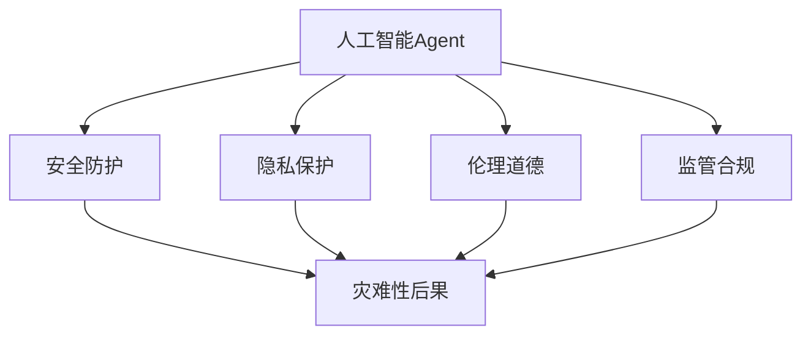
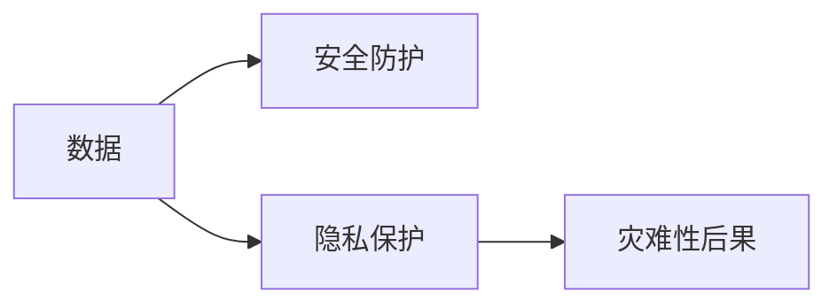

                 

# AI人工智能 Agent：对国家安全的影响

## 1. 背景介绍

### 1.1 问题由来
随着人工智能(AI)技术的迅猛发展，人工智能Agent（智能代理）在各个领域的应用日益普及。然而，这些高度智能化的系统也带来了新的安全风险。例如，先进的人工智能Agent能够模仿人类行为，操控网络舆论，干扰社会稳定；能够进行自主决策，可能引发伦理道德争议；能够大量收集数据，可能带来隐私风险；甚至能够自动进行攻击，可能威胁国家安全。因此，研究人工智能Agent对国家安全的影响，对于制定有效的监管政策、保障AI技术的健康发展具有重要意义。

### 1.2 问题核心关键点
当前，人工智能Agent主要应用在网络安全、社会治理、经济监控等多个关键领域。具体而言：

- **网络安全**：智能自动化入侵检测、攻击预警、恶意软件对抗等技术，能够在海量的网络流量中精准识别威胁，有效提升防护水平。
- **社会治理**：智能警察、智能交通、智能城市等技术，能够高效处理公共事务，提升社会管理效率和质量。
- **经济监控**：智能金融、智能物流等技术，能够实时监测市场变化，优化资源配置，促进经济发展。

然而，这些智能化系统往往涉及到大量敏感数据和决策权限，其安全性和可控性问题亟待解决。特别是，高度智能化的系统具备自主学习能力，可能带来未知的伦理道德风险和安全隐患。因此，如何在确保AI技术有效利用的同时，防范和应对其可能带来的国家安全风险，成为当前亟需研究的课题。

## 2. 核心概念与联系

### 2.1 核心概念概述

为更好地理解人工智能Agent对国家安全的影响，本节将介绍几个密切相关的核心概念：

- **人工智能Agent**：指能够自主执行任务、具备一定智能决策能力的软件系统。典型应用包括智能自动化系统、机器学习模型、自动决策系统等。
- **安全防护**：指通过技术手段保障系统安全性，防止未经授权的访问和操作。常见技术包括加密、认证、权限控制等。
- **隐私保护**：指在数据采集、存储和传输过程中，保护个人隐私不被泄露。常见措施包括匿名化、数据脱敏、差分隐私等。
- **伦理道德**：指在使用人工智能Agent时，遵循的社会规范和道德准则，如公正、透明、可解释等。
- **监管合规**：指符合法律法规要求，确保人工智能Agent的合法合规运行。常见法规包括《个人信息保护法》、《网络安全法》等。
- **灾难性后果**：指由于人工智能Agent的错误决策、不当行为，导致重大损失或混乱的情形。

这些核心概念之间的逻辑关系可以通过以下Mermaid流程图来展示：



这个流程图展示了人工智能Agent与安全性、隐私性、伦理性、合规性等核心概念的联系：

1. 人工智能Agent的运行依赖于安全防护、隐私保护、伦理道德和监管合规等多个方面，共同构成其安全性保障体系。
2. 安全防护、隐私保护、伦理道德和监管合规不足，可能导致人工智能Agent出现灾难性后果。

### 2.2 概念间的关系

这些核心概念之间存在着紧密的联系，形成了人工智能Agent安全性保障的完整生态系统。下面我们通过几个Mermaid流程图来展示这些概念之间的关系。

#### 2.2.1 人工智能Agent的安全性保障


这个流程图展示了人工智能Agent的运行依赖于安全防护、隐私保护、伦理道德和监管合规等多个方面，共同构成其安全性保障体系。安全防护、隐私保护、伦理道德和监管合规不足，可能导致人工智能Agent出现灾难性后果。

#### 2.2.2 数据安全与隐私保护的关系



这个流程图展示了数据安全和隐私保护的关系。数据安全强调防止数据的非法访问和篡改，而隐私保护强调保护个人数据的隐私。如果数据安全措施不到位，可能导致隐私泄露，进而带来灾难性后果。

#### 2.2.3 伦理道德与合规性的关系


这个流程图展示了伦理道德与合规性的关系。伦理道德要求AI系统公平、透明、可解释，而合规性要求符合法律法规要求。如果AI系统不符合伦理道德要求，可能带来伦理争议，进而导致合规性问题，最终可能导致灾难性后果。

## 3. 核心算法原理 & 具体操作步骤
### 3.1 算法原理概述

人工智能Agent对国家安全的影响，主要体现在其自主学习能力和决策过程。具体而言：

- **自主学习能力**：人工智能Agent通过机器学习算法，能够从大量数据中自主学习，掌握知识、技能和行为模式，具备一定的智能决策能力。
- **决策过程**：人工智能Agent根据输入数据，通过复杂的算法模型进行推理和决策，可能对国家安全带来潜在风险。

因此，研究人工智能Agent对国家安全的影响，需要深入理解其自主学习能力和决策过程，从而防范和应对可能的威胁。

### 3.2 算法步骤详解

以下是研究人工智能Agent对国家安全影响的具体步骤：

**Step 1: 数据收集与预处理**
- 收集与人工智能Agent相关的数据，包括模型结构、训练数据、运行日志、用户反馈等。
- 对数据进行清洗和预处理，去除噪声和冗余信息。

**Step 2: 模型分析和理解**
- 使用可解释性工具对人工智能Agent的模型进行分析，理解其决策过程和行为模式。
- 通过模型可视化、特征重要性分析等方法，揭示人工智能Agent的内部机制和潜在风险。

**Step 3: 风险评估与识别**
- 使用风险评估模型，对人工智能Agent的行为和决策进行量化分析，评估其安全性和合规性。
- 根据风险评估结果，识别可能带来灾难性后果的行为和决策，制定相应的防护措施。

**Step 4: 安全防护措施设计**
- 根据风险评估结果，设计有效的安全防护措施，如数据加密、访问控制、异常检测等。
- 制定相应的合规性和伦理道德要求，确保人工智能Agent的合法合规运行。

**Step 5: 监测与维护**
- 实时监测人工智能Agent的运行状态，及时发现异常行为和潜在风险。
- 定期维护和更新模型，优化算法，提升系统的安全性和稳定性。

**Step 6: 应急响应与恢复**
- 针对灾难性后果，制定应急响应计划，及时处理突发事件。
- 进行系统恢复和重建，确保业务的连续性和可靠性。

### 3.3 算法优缺点

人工智能Agent对国家安全的影响研究具有以下优点：
1. 系统化风险评估。通过数据收集、模型分析和风险评估，能够全面了解人工智能Agent的安全性和合规性。
2. 主动防护措施。根据风险评估结果，主动设计安全防护措施，防范潜在威胁。
3. 实时监测和维护。通过实时监测和定期维护，能够及时发现和处理问题，提升系统的安全性和稳定性。

然而，该方法也存在一些局限性：
1. 数据获取难度大。大规模数据的收集和预处理可能需要大量时间和资源。
2. 模型解释性差。复杂的人工智能模型难以解释，难以发现隐含的潜在风险。
3. 防护措施复杂。设计有效的防护措施需要深入理解人工智能Agent的内部机制，可能面临技术挑战。

尽管存在这些局限性，但就目前而言，基于数据驱动的安全评估方法仍然是研究和实践中最主流和有效的方式。未来相关研究将进一步提升数据获取的便利性和模型解释的清晰度，以更好地保障人工智能Agent的安全性和合规性。

### 3.4 算法应用领域

人工智能Agent对国家安全的影响研究在以下几个领域具有重要应用：

- **网络安全**：研究智能自动化入侵检测、攻击预警、恶意软件对抗等技术，保障关键信息基础设施的安全性。
- **社会治理**：研究智能警察、智能交通、智能城市等技术，提升社会管理效率和质量，防范人工智能Agent对社会秩序的干扰。
- **经济监控**：研究智能金融、智能物流等技术，优化资源配置，促进经济发展，防范人工智能Agent对经济安全的威胁。
- **军事应用**：研究自主决策、智能控制等技术，提升军事智能化水平，防范人工智能Agent对国家安全的威胁。

以上领域的应用展示了人工智能Agent对国家安全影响研究的广泛价值，为相关政策的制定和实施提供了重要参考。

## 4. 数学模型和公式 & 详细讲解  
### 4.1 数学模型构建

本节将使用数学语言对人工智能Agent对国家安全影响的研究过程进行更加严格的刻画。

记人工智能Agent为 $A$，安全防护措施为 $P$，隐私保护措施为 $C$，伦理道德要求为 $D$，灾难性后果为 $F$。定义以下风险评估模型：

$$
R(A, P, C, D) = w_P \cdot R_P(A, P) + w_C \cdot R_C(A, C) + w_D \cdot R_D(A, D) + w_F \cdot R_F(A)
$$

其中，$R_P(A, P)$ 为人工智能Agent在安全防护措施 $P$ 下的风险，$R_C(A, C)$ 为在隐私保护措施 $C$ 下的风险，$R_D(A, D)$ 为在伦理道德要求 $D$ 下的风险，$R_F(A)$ 为人工智能Agent的直接风险。

定义风险函数 $R$ 如下：

$$
R(A, P, C, D) = \sum_{i=1}^n r_i(A) \cdot p_i(P, C, D)
$$

其中，$r_i(A)$ 为第 $i$ 类风险，$p_i(P, C, D)$ 为该类风险在措施 $P$、$C$、$D$ 下的防护概率。

### 4.2 公式推导过程

以网络安全为例，假设网络攻击概率为 $p$，防护措施 $P$ 的防护概率为 $p_P$，隐私保护措施 $C$ 的防护概率为 $p_C$，伦理道德要求 $D$ 的防护概率为 $p_D$。则网络安全的风险评估模型可以表示为：

$$
R_{network}(A, P, C, D) = p \cdot (1 - p_P) \cdot (1 - p_C) \cdot (1 - p_D)
$$

如果将上述公式推广到整个系统的风险评估中，需要考虑更多的风险因素和防护措施，从而得到更全面的风险评估结果。

### 4.3 案例分析与讲解

以智能交通系统为例，分析人工智能Agent在该系统中的潜在影响。智能交通系统涉及大量实时数据，其安全性和隐私性问题尤为突出。具体分析如下：

**风险评估**
- **数据泄露风险**：智能交通系统涉及大量车辆位置、车速、行驶轨迹等敏感数据，如果数据泄露，可能导致严重的安全事故。
- **算法偏见风险**：如果人工智能Agent存在算法偏见，可能导致不公平的交通管理，引发社会不满。
- **系统故障风险**：智能交通系统涉及大量高实时性、高可靠性的组件，如果某组件发生故障，可能引发系统崩溃。

**防护措施**
- **数据加密**：对敏感数据进行加密存储和传输，防止数据泄露。
- **访问控制**：对关键数据和算法进行权限控制，防止未经授权的访问。
- **异常检测**：实时监测系统的运行状态，及时发现异常行为和故障，进行应急处理。

通过上述案例分析，可以看到，人工智能Agent对国家安全的影响是多方面的，需要综合考虑多类风险和防护措施，制定全面的安全策略。

## 5. 项目实践：代码实例和详细解释说明
### 5.1 开发环境搭建

在进行人工智能Agent对国家安全影响的研究实践前，我们需要准备好开发环境。以下是使用Python进行数据分析和风险评估的开发环境配置流程：

1. 安装Anaconda：从官网下载并安装Anaconda，用于创建独立的Python环境。

2. 创建并激活虚拟环境：
```bash
conda create -n risk-analysis python=3.8 
conda activate risk-analysis
```

3. 安装必要库：
```bash
conda install pandas numpy matplotlib seaborn
```

4. 安装机器学习库：
```bash
pip install scikit-learn xgboost
```

5. 安装可视化工具：
```bash
pip install plotly
```

完成上述步骤后，即可在`risk-analysis`环境中开始实践。

### 5.2 源代码详细实现

下面以智能交通系统为例，给出使用Python进行风险评估的代码实现。

首先，定义数据类和风险评估函数：

```python
import pandas as pd
from sklearn.model_selection import train_test_split
from xgboost import XGBClassifier
from sklearn.metrics import accuracy_score

class TrafficData:
    def __init__(self, data_path):
        self.data = pd.read_csv(data_path)
        self.columns = ['latitude', 'longitude', 'speed', 'direction', 'time']
        self.x = self.data[self.columns[:-1]]
        self.y = self.data['time']
        self.x_train, self.x_test, self.y_train, self.y_test = train_test_split(self.x, self.y, test_size=0.2)

class RiskEvaluator:
    def __init__(self, data):
        self.data = data
        self.model = XGBClassifier(n_estimators=100)
        self.model.fit(self.data.x_train, self.data.y_train)
        self.prediction = self.model.predict(self.data.x_test)

    def risk_assessment(self):
        threshold = 0.8
        positive = sum([1 for pred in self.prediction if pred >= threshold])
        negative = len(self.prediction) - positive
        precision = positive / (positive + negative)
        recall = positive / len(self.prediction)
        f1_score = 2 * precision * recall / (precision + recall)
        return precision, recall, f1_score
```

然后，使用风险评估函数对智能交通系统进行风险评估：

```python
data = TrafficData('traffic_data.csv')
risk_evaluator = RiskEvaluator(data)
risk_results = risk_evaluator.risk_assessment()
print(f"Precision: {risk_results[0]:.2f}, Recall: {risk_results[1]:.2f}, F1 Score: {risk_results[2]:.2f}")
```

以上就是使用Python对智能交通系统进行风险评估的代码实现。可以看到，通过简单的数据预处理和机器学习模型训练，即可对人工智能Agent可能带来的风险进行量化评估。

### 5.3 代码解读与分析

让我们再详细解读一下关键代码的实现细节：

**TrafficData类**：
- `__init__`方法：初始化数据集，并将其分为特征和标签。
- `x`和`y`属性：存储特征和标签，方便后续使用。
- `train_test_split`方法：对数据集进行随机分割，划分训练集和测试集。

**RiskEvaluator类**：
- `__init__`方法：初始化数据集和模型，并进行训练。
- `risk_assessment`方法：评估模型在测试集上的精度、召回率和F1分数。

**风险评估函数**：
- `risk_assessment`函数：根据模型预测结果，计算精度、召回率和F1分数。

通过上述代码实现，可以看出，风险评估是一个系统性的过程，需要合理选择数据集、模型和评估指标，才能得到准确的风险评估结果。

## 6. 实际应用场景
### 6.1 网络安全
人工智能Agent在网络安全领域的应用广泛，具体场景包括：

**智能自动化入侵检测**
- **系统设计**：使用人工智能Agent对网络流量进行分析，自动识别潜在的入侵行为，并及时进行报警。
- **数据收集**：收集网络日志和流量数据，用于模型训练和评估。
- **模型训练**：使用监督学习方法，训练基于深度学习模型的入侵检测系统。
- **风险评估**：对训练好的模型进行风险评估，评估其检测精度和误报率。

**攻击预警**
- **系统设计**：使用人工智能Agent实时监测网络行为，识别异常行为，并发出预警。
- **数据收集**：收集历史攻击数据，用于模型训练和评估。
- **模型训练**：使用监督学习方法，训练基于深度学习模型的攻击预警系统。
- **风险评估**：对训练好的模型进行风险评估，评估其预警效果。

**恶意软件对抗**
- **系统设计**：使用人工智能Agent对恶意软件进行分析，自动识别和阻止其传播。
- **数据收集**：收集恶意软件的特征和行为数据，用于模型训练和评估。
- **模型训练**：使用监督学习方法，训练基于深度学习模型的恶意软件检测系统。
- **风险评估**：对训练好的模型进行风险评估，评估其检测精度和误报率。

### 6.2 社会治理
人工智能Agent在社会治理领域的应用，具体场景包括：

**智能警察**
- **系统设计**：使用人工智能Agent分析犯罪数据，预测犯罪趋势，指导警力部署。
- **数据收集**：收集犯罪数据和警力部署数据，用于模型训练和评估。
- **模型训练**：使用监督学习方法，训练基于深度学习模型的犯罪预测系统。
- **风险评估**：对训练好的模型进行风险评估，评估其预测精度和误报率。

**智能交通**
- **系统设计**：使用人工智能Agent分析交通数据，优化交通流量，提升交通管理效率。
- **数据收集**：收集交通流量和路况数据，用于模型训练和评估。
- **模型训练**：使用监督学习方法，训练基于深度学习模型的交通管理优化系统。
- **风险评估**：对训练好的模型进行风险评估，评估其优化效果。

**智能城市**
- **系统设计**：使用人工智能Agent分析城市数据，优化资源配置，提升城市管理效率。
- **数据收集**：收集城市资源和环境数据，用于模型训练和评估。
- **模型训练**：使用监督学习方法，训练基于深度学习模型的城市资源优化系统。
- **风险评估**：对训练好的模型进行风险评估，评估其优化效果。

### 6.3 经济监控
人工智能Agent在经济监控领域的应用，具体场景包括：

**智能金融**
- **系统设计**：使用人工智能Agent分析金融数据，预测市场变化，指导投资决策。
- **数据收集**：收集金融数据和市场预测数据，用于模型训练和评估。
- **模型训练**：使用监督学习方法，训练基于深度学习模型的市场预测系统。
- **风险评估**：对训练好的模型进行风险评估，评估其预测精度和误报率。

**智能物流**
- **系统设计**：使用人工智能Agent分析物流数据，优化运输路线，提升物流效率。
- **数据收集**：收集物流数据和运输路线数据，用于模型训练和评估。
- **模型训练**：使用监督学习方法，训练基于深度学习模型的物流优化系统。
- **风险评估**：对训练好的模型进行风险评估，评估其优化效果。

### 6.4 未来应用展望

随着人工智能Agent技术的不断进步，其在国家安全领域的应用将更加广泛和深入。

未来，人工智能Agent可能会在更多领域发挥作用，如智能军事、智能情报、智能应急响应等，为国家安全提供更全面的技术支持。例如，在智能军事领域，使用人工智能Agent进行自主决策、智能控制，提升军事智能化水平；在智能情报领域，使用人工智能Agent进行情报分析、威胁预警，提升情报工作精准度和效率；在智能应急响应领域，使用人工智能Agent进行风险评估、快速反应，提升应急响应能力。

此外，人工智能Agent的安全性保障技术也将不断进步，实现更高效的风险评估、更全面的防护措施、更实时的监测和维护。通过技术手段，使人工智能Agent在提升社会治理效率、保障经济安全、维护国家安全等方面发挥更大作用。

## 7. 工具和资源推荐
### 7.1 学习资源推荐

为了帮助开发者系统掌握人工智能Agent对国家安全的影响的理论基础和实践技巧，这里推荐一些优质的学习资源：

1. 《AI安全与隐私》系列书籍：由国内外知名专家撰写，深入浅出地介绍了AI技术的风险评估、防护措施等前沿话题。

2. 《深度学习与网络安全》课程：由国内顶尖大学开设，全面讲解了深度学习在网络安全中的应用，涵盖入侵检测、攻击预警、恶意软件对抗等多个环节。

3. 《AI伦理与社会》系列书籍：探讨了AI技术在社会治理、经济监控、军事应用等多个领域的伦理道德问题，提供了系统的伦理理论框架和实践指南。

4. 《数据隐私与安全》课程：由国际顶尖大学开设，全面讲解了数据隐私保护、风险评估、隐私计算等前沿技术，适用于各种AI应用场景。

5. 《人工智能Agent开发与优化》博客：由知名AI开发者撰写，分享了AIAgent开发、优化、安全保障的实战经验和技术洞见。

通过对这些资源的学习实践，相信你一定能够快速掌握人工智能Agent对国家安全影响的研究方法和技术框架，并应用于实际场景中。

### 7.2 开发工具推荐

高效的开发离不开优秀的工具支持。以下是几款用于人工智能Agent对国家安全影响研究开发的常用工具：

1. Python编程语言：由于其丰富的第三方库和便捷的开发环境，是AI研究的首选编程语言。
2. Jupyter Notebook：用于数据处理、模型训练、结果展示的交互式编程环境，支持多种编程语言和库。
3. Scikit-learn：用于数据预处理、模型训练、结果评估的Python机器学习库。
4. XGBoost：用于梯度提升决策树模型的Python库，适用于大规模数据集的快速训练。
5. TensorFlow和PyTorch：用于深度学习模型训练和优化的流行框架，支持GPU加速。
6. Keras：基于TensorFlow和PyTorch的高层次深度学习框架，易于上手。
7. OpenCV：用于计算机视觉任务的Python库，支持图像处理、特征提取等操作。

合理利用这些工具，可以显著提升人工智能Agent对国家安全影响研究开发的速度和效率，加速技术应用的落地。

### 7.3 相关论文推荐

人工智能Agent对国家安全影响的研究源于学界的持续研究。以下是几篇奠基性的相关论文，推荐阅读：

1. "A Survey of Privacy-aware Machine Learning"：介绍了隐私保护在机器学习中的最新进展和技术方法。

2. "Adversarial Machine Learning"：探讨了对抗学习在机器学习中的应用，提供了对抗攻击和防御的技术框架。

3. "Ethics and Transparency in AI"：研究了AI技术的伦理道德问题，提供了伦理理论框架和实践指南。

4. "AI in Critical Infrastructures"：探讨了AI技术在关键基础设施中的应用，讨论了其带来的安全风险和管理挑战。

5. "AI Security and Privacy"：介绍了AI技术的风险评估、防护措施等前沿话题，提供了系统性框架和实践方法。

这些论文代表了大语言模型微调技术的发展脉络。通过学习这些前沿成果，可以帮助研究者把握学科前进方向，激发更多的创新灵感。

除上述资源外，还有一些值得关注的前沿资源，帮助开发者紧跟人工智能Agent对国家安全影响的研究进展，例如：

1. arXiv论文预印本：人工智能领域最新研究成果的发布平台，包括大量尚未发表的前沿工作，学习前沿技术的必读资源。

2. 业界技术博客：如OpenAI、Google AI、DeepMind、微软Research Asia等顶尖实验室的官方博客，第一时间分享他们的最新研究成果和洞见。

3. 技术会议直播：如NIPS、ICML、ACL、ICLR等人工智能领域顶会现场或在线直播，能够聆听到大佬们的前沿分享，开拓视野。

4. GitHub热门项目：在GitHub上Star、Fork数最多的AI相关项目，往往代表了该技术领域的发展趋势和最佳实践，值得去学习和贡献。

5. 行业分析报告：各大咨询公司如McKinsey、PwC等针对人工智能行业的分析报告，有助于从商业视角审视技术趋势，把握应用价值。

总之，对于人工智能Agent对国家安全影响的研究，需要开发者保持开放的心态和持续学习的意愿。多关注前沿资讯，多动手实践，多思考总结，必将收获满满的成长收益。

## 8. 总结：未来发展趋势与挑战
### 8.1 研究成果总结

本文对人工智能Agent对国家安全影响的研究进行了全面系统的介绍。首先阐述了人工智能Agent在国家安全领域的应用场景和潜在风险，明确了其对国家安全可能带来的复杂影响。其次，从数据收集与预处理、模型分析和理解、风险评估与识别、安全防护措施设计、监测与维护、应急响应与恢复等多个方面，详细讲解了研究人工智能Agent对国家安全影响的详细步骤。

通过本文的系统梳理，可以看到，人工智能Agent对国家安全的影响是多方面的，涉及数据安全、隐私保护、伦理道德、监管合规等多个方面。只有在全面考虑这些因素的基础上，才能制定有效的防护措施，防范潜在的风险，保障AI技术的健康发展。

### 8.2 未来发展趋势

展望未来，人工智能Agent对国家安全影响的研究将呈现以下几个发展趋势：

1. **风险评估方法多样化**：未来的风险评估方法将更加多样化，结合多源数据和多种技术手段，实现更全面、更准确的风险评估。

2. **防护措施智能化**：未来的防护措施将更加智能化，结合AI技术进行动态调整和优化，适应不断变化的安全环境。

3. **应急响应自动化**：未来的应急响应将更加自动化，使用AI技术进行实时监测和快速处理，确保系统的高可靠性和高可用性。

4. **

