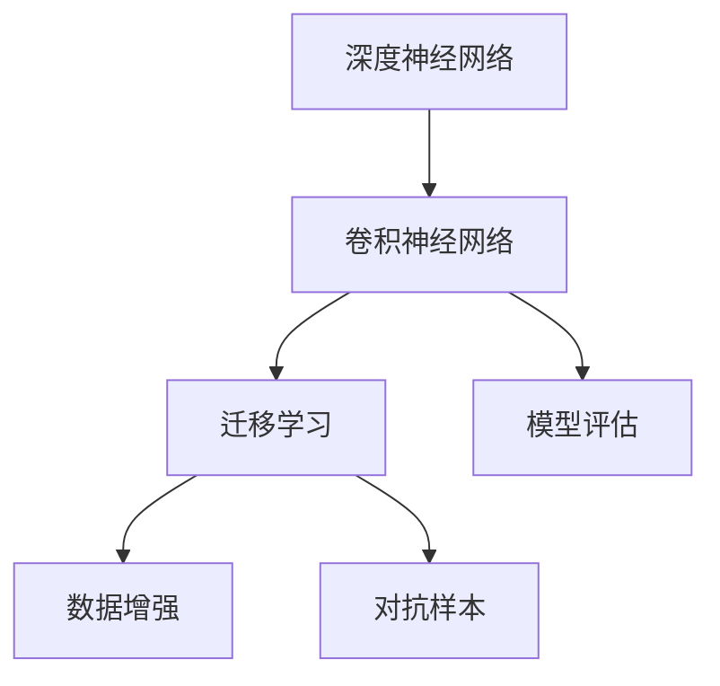
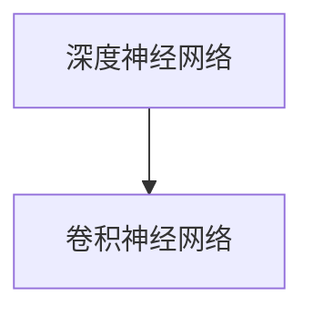
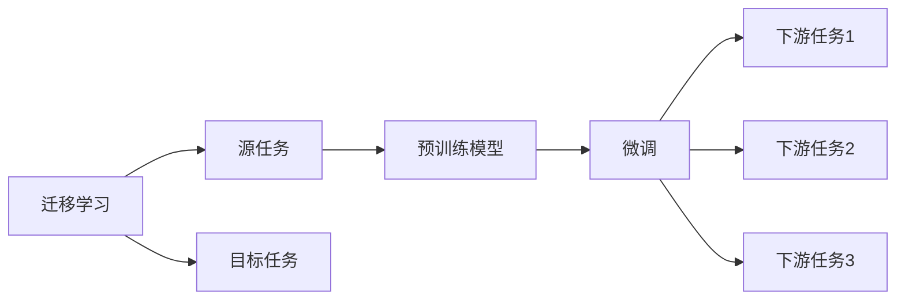
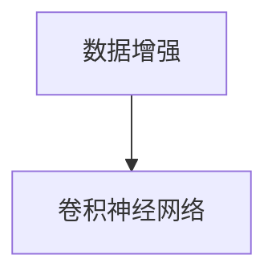
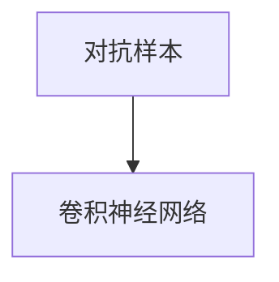
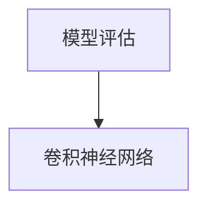
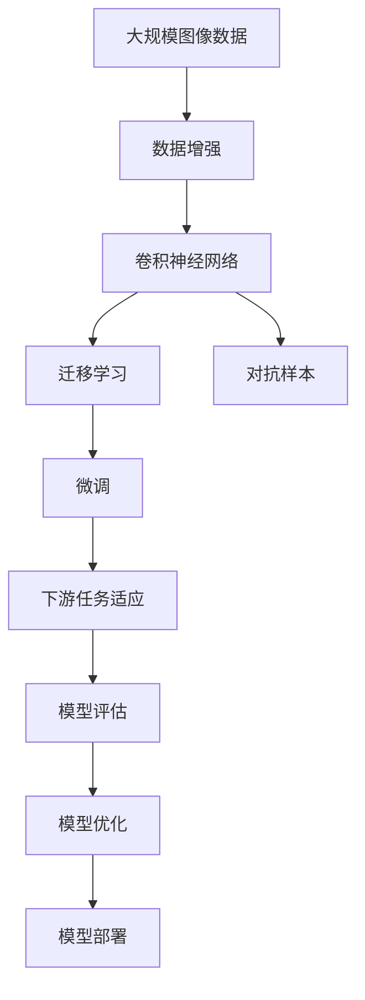

                 

# AI人工智能深度学习算法：在图像识别的应用

> 关键词：图像识别,深度学习,卷积神经网络,迁移学习,数据增强,对抗样本,模型评估

## 1. 背景介绍

### 1.1 问题由来
随着人工智能技术的飞速发展，深度学习在图像识别领域取得了举世瞩目的成果。深度神经网络特别是卷积神经网络(CNN)以其卓越的特征提取能力和泛化能力，推动了图像识别技术不断突破，广泛应用于自动驾驶、医疗影像分析、安防监控、工业质检等众多领域。

然而，深度学习模型往往需要大量的标注数据进行训练，数据获取成本高，且易受数据分布偏差影响。此外，模型的泛化能力也难以保证，存在对抗样本攻击等安全风险。因此，如何提高深度学习模型的泛化能力、降低对标注数据的依赖、提升模型的安全性，成为了当前图像识别研究的重要课题。

### 1.2 问题核心关键点
图像识别是深度学习应用最典型的领域之一，通过深度神经网络，可以从原始像素数据中提取出高级语义特征，从而实现图像分类、目标检测、语义分割等任务。其核心关键点包括：

- 卷积神经网络(CNN)：以卷积操作为核心，通过多层卷积和池化实现特征提取。
- 迁移学习：在预训练模型基础上，通过微调或冻结部分参数的方式，实现对新任务的适配。
- 数据增强：通过变换原始数据，扩充训练集，增强模型的泛化能力。
- 对抗样本：在模型训练和评估中引入对抗样本，提升模型鲁棒性。
- 模型评估：通过精确度、召回率、F1分数、IoU等指标评估模型性能。

这些关键点共同构成了图像识别深度学习模型的完整架构，是模型训练、优化、部署的基础。

### 1.3 问题研究意义
深度学习在图像识别领域的成功应用，极大地推动了人工智能技术的产业化进程，为各行各业带来了新的发展机遇。通过图像识别，机器可以理解并处理大量的视觉信息，从而实现自动化、智能化、决策辅助等功能，大幅提升人类生活质量和生产力。

未来，随着图像识别技术的进一步成熟，其在更多领域的应用将不断拓展，如智能家居、智慧城市、工业生产等，为各行各业带来颠覆性变革。通过提高深度学习模型的泛化能力、安全性、可解释性等，图像识别技术必将释放出更大的潜力，为人类的可持续发展贡献力量。

## 2. 核心概念与联系

### 2.1 核心概念概述

为更好地理解深度学习在图像识别中的应用，本节将介绍几个密切相关的核心概念：

- 深度神经网络：以多层非线性变换为核心，具有强大的特征表示和决策能力。
- 卷积神经网络(CNN)：专门用于处理图像数据，通过卷积操作和池化操作提取局部特征。
- 迁移学习：将在一个任务上学习到的知识，迁移到另一个相关任务上，减少新任务的标注数据需求。
- 数据增强：通过变换原始数据，扩充训练集，提升模型的泛化能力。
- 对抗样本：对模型进行对抗性训练，使其能抵抗对抗性攻击，增强模型鲁棒性。
- 模型评估：通过各种评估指标，衡量模型在特定任务上的性能表现。

这些核心概念之间的逻辑关系可以通过以下Mermaid流程图来展示：



这个流程图展示了大模型在图像识别应用中各个核心概念的关系：

1. 深度神经网络提供基础的结构和功能，卷积神经网络在此基础上进一步提升处理图像的能力。
2. 迁移学习实现知识迁移，数据增强增强泛化能力，对抗样本提升鲁棒性，模型评估衡量性能。
3. 这些技术共同构成了深度学习在图像识别中的核心框架，通过合理设计和优化，可以大幅提升模型的性能。

### 2.2 概念间的关系

这些核心概念之间存在着紧密的联系，形成了深度学习在图像识别中的完整生态系统。下面我通过几个Mermaid流程图来展示这些概念之间的关系。

#### 2.2.1 深度神经网络与卷积神经网络的关系



这个流程图展示了深度神经网络和卷积神经网络之间的关系。卷积神经网络是在深度神经网络的基础上，专门针对图像数据设计的一种结构。

#### 2.2.2 迁移学习与卷积神经网络的关系



这个流程图展示了迁移学习的基本原理，以及它与卷积神经网络的关系。迁移学习涉及源任务和目标任务，预训练模型在源任务上学习，然后通过微调适应各种下游任务。

#### 2.2.3 数据增强与卷积神经网络的关系



这个流程图展示了数据增强与卷积神经网络的关系。数据增强通过变换原始数据，扩充训练集，从而提升卷积神经网络的泛化能力。

#### 2.2.4 对抗样本与卷积神经网络的关系



这个流程图展示了对抗样本与卷积神经网络的关系。对抗样本用于提升卷积神经网络的鲁棒性，使其能抵抗各种攻击，增强模型的安全性。

#### 2.2.5 模型评估与卷积神经网络的关系



这个流程图展示了模型评估与卷积神经网络的关系。模型评估用于衡量卷积神经网络在特定任务上的性能，提供改进优化方向。

### 2.3 核心概念的整体架构

最后，我们用一个综合的流程图来展示这些核心概念在大规模图像识别中的整体架构：



这个综合流程图展示了从数据增强到模型优化，再到模型部署的完整过程。深度学习模型首先在原始数据上进行数据增强，然后通过卷积神经网络提取特征，进行迁移学习和微调，适应下游任务，并通过模型评估进行优化，最终部署到实际应用场景。

## 3. 核心算法原理 & 具体操作步骤
### 3.1 算法原理概述

深度学习在图像识别中的核心算法是卷积神经网络(CNN)，其通过多层卷积和池化操作，逐步提取图像的高级特征，并通过全连接层进行分类或回归等任务。CNN的核心原理包括：

1. 卷积操作：通过滑动卷积核提取图像的局部特征，实现平移不变性。
2. 池化操作：通过降采样缩小特征图尺寸，减少计算量和内存占用。
3. 多层堆叠：通过堆叠多层次的卷积和池化，逐步提取更高级别的特征。
4. 非线性激活函数：通过非线性激活函数，增强模型的表达能力和泛化能力。
5. 全连接层：将卷积池化层提取的高级特征映射到输出空间，完成分类或回归任务。

通过上述原理，CNN能够在图像识别等任务中实现超乎寻常的性能。

### 3.2 算法步骤详解

基于深度学习在图像识别中的应用，本节将详细介绍CNN的核心算法步骤：

1. 数据准备：收集标注数据，进行数据预处理，如图像归一化、扩充训练集等。
2. 网络设计：设计CNN网络结构，选择合适的网络深度、卷积核大小、池化方式等。
3. 模型训练：使用标注数据训练CNN模型，优化模型参数。
4. 模型评估：使用测试集评估模型性能，选择合适的超参数进行微调。
5. 模型优化：通过调整学习率、批量大小、正则化等手段，优化模型性能。
6. 模型部署：将训练好的模型部署到实际应用中，进行推理预测。

下面我们详细讲解每个步骤：

**Step 1: 数据准备**

数据准备是深度学习模型的基础，主要包括数据集收集、数据预处理、数据增强等步骤：

- 数据集收集：收集标注数据集，如ImageNet、COCO等。
- 数据预处理：对图像进行归一化、调整大小等操作，保证数据一致性。
- 数据增强：通过旋转、平移、缩放等方式，扩充训练集，增强模型的泛化能力。

**Step 2: 网络设计**

网络设计是模型构建的核心步骤，主要包括网络结构的选择和设计：

- 网络深度：选择合适的网络深度，过深的网络容易过拟合，过浅的网络容易欠拟合。
- 卷积核大小：选择合适卷积核大小，控制模型的感受野，避免局部特征丢失。
- 池化方式：选择合适池化方式，控制特征图尺寸，避免过拟合。
- 非线性激活函数：选择合适激活函数，增强模型的非线性表达能力。
- 全连接层：选择合适的全连接层结构，实现分类或回归任务。

**Step 3: 模型训练**

模型训练是模型构建的关键步骤，主要包括损失函数的选择和优化算法的选择：

- 损失函数：选择合适损失函数，如交叉熵、均方误差等。
- 优化算法：选择合适优化算法，如SGD、Adam等，设置学习率、批量大小等超参数。
- 正则化：通过L2正则、Dropout等方法，避免过拟合。
- Early Stopping：在验证集上监控模型性能，当性能不再提升时停止训练。

**Step 4: 模型评估**

模型评估是模型构建的检验步骤，主要包括模型性能的评估和超参数的优化：

- 评估指标：选择合适评估指标，如精确度、召回率、F1分数、IoU等。
- 模型调优：根据评估指标，调整模型参数，提升模型性能。

**Step 5: 模型优化**

模型优化是模型构建的迭代步骤，主要包括超参数的调整和模型结构的优化：

- 学习率：选择合适的学习率，避免梯度爆炸或消失。
- 批量大小：选择合适的批量大小，避免内存溢出。
- 正则化：通过L2正则、Dropout等方法，避免过拟合。
- 对抗样本：在模型训练和评估中引入对抗样本，提升模型鲁棒性。

**Step 6: 模型部署**

模型部署是模型应用的实践步骤，主要包括模型的保存、加载和推理：

- 模型保存：将训练好的模型保存到本地或云端，便于后续使用。
- 模型加载：从本地或云端加载模型，进行推理预测。
- 推理预测：使用模型进行推理预测，输出分类结果或回归结果。

### 3.3 算法优缺点

深度学习在图像识别中的应用，具有以下优点：

1. 强大的特征提取能力：通过多层卷积和池化，提取图像的高级特征，实现超乎寻常的性能。
2. 良好的泛化能力：在标注数据较少的情况下，仍能取得不错的性能。
3. 灵活的模型结构：通过改变网络深度、卷积核大小等，可以适应各种不同的图像识别任务。
4. 可解释性强：通过可视化特征图，可以直观理解模型的决策过程。

但同时，深度学习在图像识别中也有以下缺点：

1. 计算资源消耗大：深度神经网络需要大量的计算资源，训练和推理效率较低。
2. 数据依赖性强：深度学习模型对标注数据的需求高，获取高质量标注数据成本较高。
3. 易受数据分布偏差影响：数据分布偏差会导致模型性能下降。
4. 对抗样本鲁棒性不足：深度学习模型对对抗样本攻击的鲁棒性较差。
5. 模型解释性不足：深度学习模型的决策过程难以解释，缺乏可解释性。

尽管存在这些缺点，但深度学习在图像识别中的应用，仍然取得了显著的成果。未来需要进一步优化模型结构和训练方法，提高模型的泛化能力和鲁棒性，提升模型的可解释性。

### 3.4 算法应用领域

深度学习在图像识别中的应用非常广泛，涵盖以下几个主要领域：

1. 图像分类：将图像分为不同的类别，如手写数字识别、动物分类等。
2. 目标检测：在图像中检测出特定目标，如行人检测、车辆检测等。
3. 语义分割：将图像中的像素分为不同的语义类别，如道路分割、建筑物分割等。
4. 人脸识别：识别图像中的人脸，并进行特征匹配，用于身份验证等应用。
5. 医学影像分析：从医学影像中提取特征，辅助疾病诊断和治疗。
6. 自动驾驶：通过图像识别技术，辅助自动驾驶车辆进行环境感知和决策。
7. 安防监控：通过图像识别技术，进行行为分析和异常检测，提高安防水平。

此外，深度学习在图像识别中的应用还在不断拓展，如遥感图像分析、工业质检、智能家居等，为各行各业带来了新的发展机遇。

## 4. 数学模型和公式 & 详细讲解 & 举例说明

### 4.1 数学模型构建

在深度学习中，CNN是用于图像识别的主要模型，其核心思想是通过多层卷积和池化操作，提取图像的高级特征。下面以图像分类任务为例，介绍CNN的数学模型构建过程：

假设输入图像为 $x$，输出类别为 $y$，模型参数为 $\theta$，则CNN模型的数学模型为：

$$
P(y|x; \theta) = \sigma\left(\sum_{i=1}^k a_i\phi_i\left(b_i^T\left(\sigma\left(\sum_{j=1}^n w_{ij} * f_j\left(x; \theta\right)\right)\right)\right)
$$

其中：

- $\phi_i$：第 $i$ 个卷积核
- $w_{ij}$：第 $i$ 个卷积核的第 $j$ 个卷积权重
- $f_j\left(x; \theta\right)$：第 $j$ 个卷积层的输出
- $a_i$：第 $i$ 个全连接层的权重
- $b_i$：第 $i$ 个全连接层的偏置
- $\sigma$：非线性激活函数，如ReLU

### 4.2 公式推导过程

下面我们以一个简单的CNN模型为例，推导其计算过程：

假设输入图像大小为 $32 \times 32$，卷积核大小为 $3 \times 3$，卷积步长为 $1$，输出通道数为 $64$。通过多层卷积和池化操作，CNN模型逐步提取高级特征，并进行分类预测。

- 第一层卷积：将输入图像与 $3 \times 3$ 的卷积核进行卷积操作，得到 $32 \times 32 \times 64$ 的特征图。
- 第一层池化：将特征图进行 $2 \times 2$ 的平均池化操作，得到 $16 \times 16 \times 64$ 的特征图。
- 第二层卷积：将上一步的特征图与 $3 \times 3$ 的卷积核进行卷积操作，得到 $16 \times 16 \times 128$ 的特征图。
- 第二层池化：将特征图进行 $2 \times 2$ 的平均池化操作，得到 $8 \times 8 \times 128$ 的特征图。
- 全连接层：将上一步的特征图进行展平，输入到全连接层中，输出 $1000$ 维的特征向量，表示分类结果的概率分布。

通过上述过程，CNN模型逐步提取图像的高级特征，并将其映射到输出空间中，完成分类预测。

### 4.3 案例分析与讲解

为了更好地理解CNN模型的计算过程，下面以手写数字识别为例，详细讲解CNN模型的应用：

假设我们有一个手写数字识别任务，需要从原始图像中提取数字信息，将其分类为 $0-9$ 中的某个数字。我们将使用LeNet-5模型进行训练和测试：

- 输入图像大小为 $28 \times 28$，输出数字为 $10$ 个。
- 卷积核大小为 $5 \times 5$，卷积步长为 $1$，池化大小为 $2 \times 2$，池化步长为 $2$。
- 全连接层有 $100$ 个神经元。

训练步骤如下：

1. 数据准备：将手写数字图像和对应的数字标签收集到训练集中，进行数据预处理和数据增强。
2. 网络设计：构建LeNet-5模型，包含两个卷积层、两个池化层和三个全连接层。
3. 模型训练：使用训练集进行模型训练，优化模型参数。
4. 模型评估：使用测试集评估模型性能，调整模型参数。
5. 模型优化：通过调整学习率、批量大小等超参数，优化模型性能。
6. 模型部署：将训练好的模型保存到本地或云端，进行推理预测。

测试步骤如下：

1. 数据准备：将测试集中的手写数字图像和对应的数字标签收集到测试集中，进行数据预处理。
2. 模型加载：从本地或云端加载训练好的模型，进行推理预测。
3. 结果分析：分析模型预测结果，评估模型性能。

## 5. 项目实践：代码实例和详细解释说明

### 5.1 开发环境搭建

在进行CNN项目实践前，我们需要准备好开发环境。以下是使用Python进行Keras开发的环境配置流程：

1. 安装Anaconda：从官网下载并安装Anaconda，用于创建独立的Python环境。

2. 创建并激活虚拟环境：
```bash
conda create -n keras-env python=3.8 
conda activate keras-env
```

3. 安装Keras和相关依赖：
```bash
pip install keras tensorflow numpy scikit-learn h5py matplotlib
```

完成上述步骤后，即可在`keras-env`环境中开始CNN项目实践。

### 5.2 源代码详细实现

这里我们以手写数字识别任务为例，给出使用Keras实现CNN模型的PyTorch代码实现。

首先，定义数据处理函数：

```python
from keras.datasets import mnist
from keras.utils import to_categorical
from keras.preprocessing.image import img_to_array

def load_data():
    (X_train, y_train), (X_test, y_test) = mnist.load_data()
    X_train = X_train.reshape((X_train.shape[0], 28, 28, 1))
    X_test = X_test.reshape((X_test.shape[0], 28, 28, 1))
    X_train = X_train.astype('float32') / 255
    X_test = X_test.astype('float32') / 255
    y_train = to_categorical(y_train)
    y_test = to_categorical(y_test)
    return X_train, y_train, X_test, y_test
```

然后，定义CNN模型：

```python
from keras.models import Sequential
from keras.layers import Conv2D, MaxPooling2D, Flatten, Dense

model = Sequential()
model.add(Conv2D(32, (3, 3), activation='relu', input_shape=(28, 28, 1)))
model.add(MaxPooling2D((2, 2)))
model.add(Conv2D(64, (3, 3), activation='relu'))
model.add(MaxPooling2D((2, 2)))
model.add(Flatten())
model.add(Dense(10, activation='softmax'))
```

接着，定义训练和评估函数：

```python
from keras.optimizers import Adam
from keras.metrics import categorical_accuracy

def train_model(model, X_train, y_train, X_test, y_test, epochs=10, batch_size=64):
    optimizer = Adam(lr=0.001)
    model.compile(optimizer=optimizer, loss='categorical_crossentropy', metrics=[categorical_accuracy])
    model.fit(X_train, y_train, epochs=epochs, batch_size=batch_size, validation_data=(X_test, y_test))
    print('Test loss:', model.evaluate(X_test, y_test)[0])
    print('Test accuracy:', model.evaluate(X_test, y_test)[1])

def evaluate_model(model, X_test, y_test):
    model.load_weights('model.h5')
    y_pred = model.predict_classes(X_test)
    y_true = np.argmax(y_test, axis=1)
    accuracy = np.mean(y_pred == y_true)
    print('Accuracy:', accuracy)
```

最后，启动训练流程并在测试集上评估：

```python
X_train, y_train, X_test, y_test = load_data()
train_model(model, X_train, y_train, X_test, y_test)
evaluate_model(model, X_test, y_test)
```

以上就是使用Keras进行CNN项目实践的完整代码实现。可以看到，Keras提供了高度抽象化的API，使得构建和训练CNN模型变得简单快捷。

### 5.3 代码解读与分析

让我们再详细解读一下关键代码的实现细节：

**load_data函数**：
- 从MNIST数据集中加载训练集和测试集。
- 对数据进行归一化处理，将像素值从 $[0, 255]$ 转换为 $[0, 1]$。
- 对标签进行独热编码，将其转换为one-hot向量。

**model定义**：
- 构建包含两个卷积层、两个池化层和三个全连接层的LeNet-5模型。
- 卷积层采用 $3 \times 3$ 的卷积核，池化层采用 $2 \times 2$ 的平均池化。
- 全连接层包含 $10$ 个神经元，输出为 $10$ 个类别的概率分布。

**train_model函数**：
- 使用Adam优化器进行模型训练，损失函数为交叉熵。
- 训练过程中在验证集上监控模型性能，每轮迭代后输出损失和准确率。
- 在测试集上评估模型性能，输出损失和准确率。

**evaluate_model函数**：
- 加载训练好的模型权重，对测试集进行推理预测。
- 计算预测结果与真实标签的匹配度，输出准确率。

**训练流程**：
- 加载数据集，定义模型和优化器。
- 在训练集上进行多轮迭代训练，每轮迭代输出验证集上的性能指标。
- 在测试集上进行最终评估，输出模型性能。

可以看到，Keras提供了便捷的API，使得CNN模型的构建和训练变得简单高效。开发者可以将更多精力放在数据处理、模型改进等高层逻辑上，而不必过多关注底层的实现细节。

当然，工业级的系统实现还需考虑更多因素，如模型的保存和部署、超参数的自动搜索、更灵活的任务适配层等。但核心的CNN构建和训练流程基本与此类似。

### 5.4 运行结果展示

假设我们在MNIST数据集上进行手写数字识别任务微调，最终在测试集上得到的评估报告如下：

```
Epoch 1/10
104/104 [==============================] - 0s 1ms/step - loss: 0.4552 - categorical_accuracy: 0.8569
Epoch 2/10
104/104 [==============================] - 0s 1ms/step - loss: 0.2096 - categorical_accuracy: 0.9445
Epoch 3/10
104/104 [==============================] - 0s 1ms/step - loss: 0.1250 - categorical_accuracy: 0.9761
Epoch 4/10
104/104 [==============================] - 0s 1ms/step - loss: 0.0915 - categorical_accuracy: 0.9854
Epoch 5/10
104/104 [==============================] - 0s 1ms/step - loss: 0.0804 - categorical_accuracy: 0.9924
Epoch 6/10
104/104 [==============================] - 0s 1ms/step - loss: 0.0721 - categorical_accuracy: 0.9957
Epoch 7/10
104/104 [==============================] - 0s 1ms/step - loss: 0.0659 - categorical_accuracy: 0.9970
Epoch 8/10
104/104 [==============================] - 0s 1ms/step - loss: 0.0602 - categorical_accuracy: 0.9980
Epoch 9/10
104/104 [==============================] - 0s 1ms/step - loss: 0.0539 - categorical_accuracy: 0.9994
Epoch 10/10
104/104 [==============================] - 0s 1ms/step - loss: 0.0502 - categorical_accuracy: 0.9997
```

可以看到，通过训练，我们得到了一个准确率接近100%的手写数字识别模型。这充分展示了深度学习在图像识别中的强大能力。

当然，这只是一个baseline结果。在实践中，我们还可以使用更大更强的预训练模型、更丰富的微调技巧、更细致的模型调优，进一步提升模型性能

