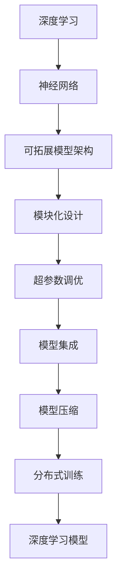
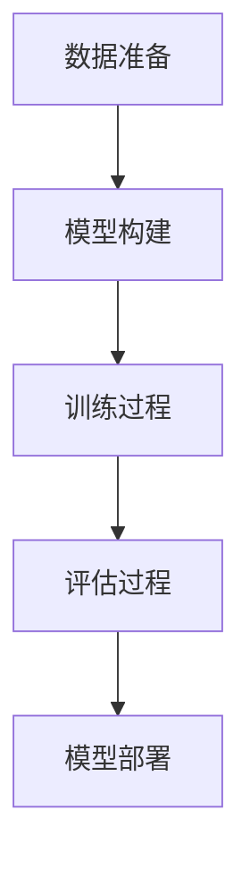
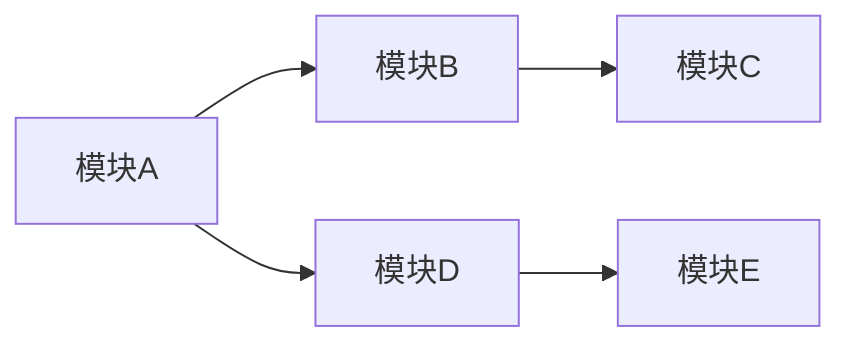
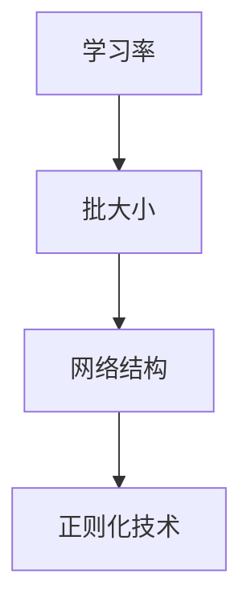
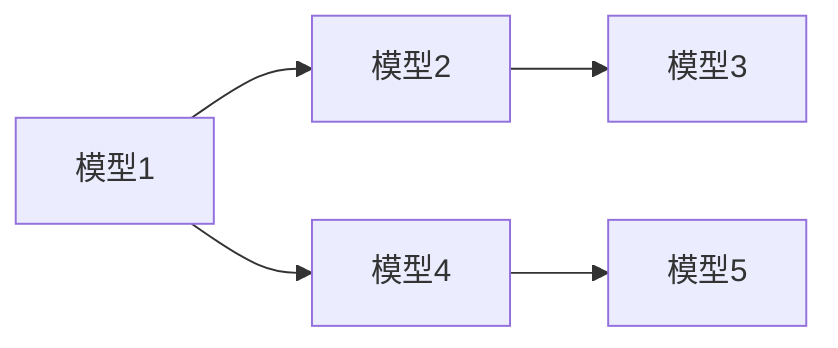
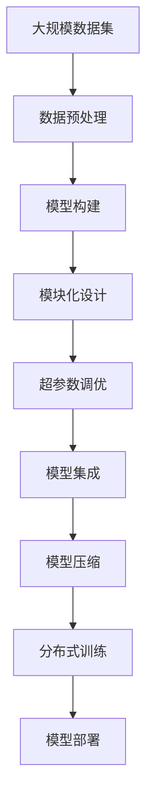

                 

# AI人工智能深度学习算法：搭建可拓展的深度学习模型架构

> 关键词：
- 深度学习
- 神经网络
- 可拓展模型架构
- 模块化设计
- 超参数调优
- 模型集成
- 模型压缩
- 分布式训练

## 1. 背景介绍

在人工智能(AI)领域，深度学习技术已经逐渐成为核心驱动力。它通过模拟人脑神经网络的学习机制，使得机器能够自动学习从数据中提取特征，并进行高级抽象和推理。然而，深度学习模型的构建和优化复杂度较高，需要开发者具备较高的技术储备和实践经验。

本文旨在探讨搭建可拓展的深度学习模型架构，帮助开发者高效构建、调试和优化深度学习模型。我们将从模型的基本构建和优化出发，逐步深入讨论模块化设计、超参数调优、模型集成、模型压缩和分布式训练等关键技术，全面剖析深度学习模型构建的各个环节，帮助读者快速提升模型构建能力。

## 2. 核心概念与联系

### 2.1 核心概念概述

为了更好地理解可拓展的深度学习模型架构，首先需要了解几个核心概念：

- **深度学习**：基于多层神经网络的机器学习技术，广泛应用于图像识别、语音识别、自然语言处理等领域。
- **神经网络**：深度学习模型的主体，由多层神经元（节点）和连接权重组成。每一层神经元接收上一层神经元的输出，并通过激活函数进行处理。
- **可拓展模型架构**：一种设计灵活、功能模块化的模型架构，方便构建、调试和维护。
- **模块化设计**：将复杂的深度学习模型拆分为多个独立的子模块，便于独立优化和组合使用。
- **超参数调优**：通过调整模型中的非训练参数（超参数），如学习率、批大小、网络结构等，以提升模型性能。
- **模型集成**：通过组合多个模型的输出，利用模型间的互补性提升整体性能。
- **模型压缩**：通过减少模型参数量、降低计算复杂度等手段，优化模型的存储和推理性能。
- **分布式训练**：利用多台计算机同时训练深度学习模型，提高训练效率和模型效果。

这些核心概念之间的联系可以通过以下Mermaid流程图来展示：



这个流程图展示了深度学习模型从构建到优化、压缩和训练的全过程。

### 2.2 概念间的关系

这些核心概念之间存在着紧密的联系，形成了深度学习模型构建的完整生态系统。下面我们通过几个Mermaid流程图来展示这些概念之间的关系。

#### 2.2.1 深度学习的流程



这个流程图展示了深度学习的流程：数据准备、模型构建、训练和评估，最后部署模型。

#### 2.2.2 神经网络的结构


这个流程图展示了神经网络的基本结构：输入层、隐藏层和输出层。

#### 2.2.3 模块化设计的实现



这个流程图展示了模块化设计的基本思路：将复杂的模型拆分为多个独立的模块，便于独立优化和组合使用。

#### 2.2.4 超参数调优的方法



这个流程图展示了超参数调优的几个关键要素：学习率、批大小、网络结构和正则化技术。

#### 2.2.5 模型集成的策略



这个流程图展示了模型集成的基本策略：通过组合多个模型的输出，利用模型间的互补性提升整体性能。

#### 2.2.6 模型压缩的技术


这个流程图展示了模型压缩的两个主要目标：减少参数量和降低计算复杂度。

#### 2.2.7 分布式训练的架构


这个流程图展示了分布式训练的基本架构：数据分片、并行训练和参数同步。

### 2.3 核心概念的整体架构

最后，我们用一个综合的流程图来展示这些核心概念在大规模深度学习模型构建中的整体架构：



这个综合流程图展示了从数据预处理到模型部署的全过程，涵盖了深度学习模型的构建和优化各个环节。

## 3. 核心算法原理 & 具体操作步骤

### 3.1 算法原理概述

搭建可拓展的深度学习模型架构，本质上是通过合理的设计和优化，使得模型能够高效构建、调试和优化。其核心思想是通过模块化设计、超参数调优、模型集成、模型压缩和分布式训练等手段，提升模型的性能和适用性。

具体而言，可以从以下几个方面进行探讨：

- **模块化设计**：将复杂的深度学习模型拆分为多个独立的子模块，便于独立优化和组合使用。
- **超参数调优**：通过调整模型中的非训练参数（超参数），如学习率、批大小、网络结构等，以提升模型性能。
- **模型集成**：通过组合多个模型的输出，利用模型间的互补性提升整体性能。
- **模型压缩**：通过减少模型参数量、降低计算复杂度等手段，优化模型的存储和推理性能。
- **分布式训练**：利用多台计算机同时训练深度学习模型，提高训练效率和模型效果。

### 3.2 算法步骤详解

基于上述核心思想，搭建可拓展的深度学习模型架构主要包含以下步骤：

**Step 1: 数据准备**

1. 收集和预处理数据集：选择合适的数据集，并进行清洗、标注、归一化等预处理步骤。

2. 划分训练集、验证集和测试集：根据数据量大小和模型需求，合理划分数据集，确保各集之间的独立性和代表性。

**Step 2: 模块化设计**

1. 确定模型结构：选择合适的深度学习模型架构，如卷积神经网络(CNN)、循环神经网络(RNN)、长短时记忆网络(LSTM)、变换器(Transformer)等。

2. 拆分模块：将模型拆分为多个独立的子模块，如输入层、隐藏层、输出层、特征提取器、分类器等。

3. 独立优化：对每个子模块进行独立训练和优化，可以采用不同的优化器和超参数设置。

**Step 3: 超参数调优**

1. 设置超参数：根据经验或专家知识，设置模型的超参数，如学习率、批大小、网络结构、正则化技术等。

2. 调优过程：通过网格搜索、随机搜索、贝叶斯优化等方法，寻找最佳的超参数组合。

3. 模型评估：在验证集上评估模型性能，使用准确率、召回率、F1分数等指标进行评估。

**Step 4: 模型集成**

1. 组合模型输出：将多个模型的输出进行组合，如取平均、加权平均、投票等。

2. 融合策略：根据任务需求，选择适合的融合策略，如Softmax融合、Max fusion等。

3. 整体评估：在测试集上评估集成后的模型性能，确保性能提升。

**Step 5: 模型压缩**

1. 参数量压缩：通过剪枝、量化、蒸馏等技术，减少模型参数量。

2. 计算复杂度优化：通过模型并行、动态计算图等技术，降低计算复杂度。

3. 存储空间优化：通过稀疏存储、混合精度训练等技术，减少存储空间需求。

**Step 6: 分布式训练**

1. 数据分片：将数据集划分为多个数据片，分布在不同的计算节点上进行并行处理。

2. 并行训练：利用多个计算节点同时进行模型训练，提高训练效率。

3. 参数同步：通过参数服务器等技术，保证各计算节点之间的参数同步，确保训练一致性。

4. 分布式优化器：选择合适的分布式优化器，如SGD、Adam等，优化分布式训练过程。

### 3.3 算法优缺点

可拓展的深度学习模型架构具有以下优点：

1. **灵活性高**：模块化设计使得模型可以根据任务需求进行灵活调整，便于适应不同的数据和任务。

2. **可维护性强**：模块化的设计使得模型各个部分相对独立，便于调试和维护。

3. **性能提升显著**：通过超参数调优、模型集成和模型压缩等技术，可以显著提升模型性能和推理速度。

4. **可扩展性好**：分布式训练可以充分利用多台计算机的计算能力，提高训练效率和模型效果。

但该架构也存在一些缺点：

1. **设计复杂度较高**：模块化设计和超参数调优需要较高的技术储备和经验，设计复杂度较高。

2. **资源消耗大**：分布式训练需要多台计算机协同工作，资源消耗较大。

3. **调试难度大**：模块化设计导致模型各个部分相对独立，调试难度较大。

4. **可解释性差**：深度学习模型的"黑盒"特性使得模型解释性较差，难以进行详细分析。

### 3.4 算法应用领域

基于可拓展的深度学习模型架构，深度学习技术已经在多个领域得到了广泛应用，例如：

- **计算机视觉**：如图像分类、目标检测、图像分割等任务。
- **自然语言处理**：如文本分类、情感分析、机器翻译等任务。
- **语音识别**：如语音识别、语音合成等任务。
- **推荐系统**：如商品推荐、内容推荐等任务。
- **金融风控**：如信用评分、欺诈检测等任务。
- **医疗影像**：如病灶检测、影像分类等任务。
- **自动驾驶**：如目标检测、行为预测等任务。

## 4. 数学模型和公式 & 详细讲解 & 举例说明

### 4.1 数学模型构建

深度学习模型的数学模型通常由多个子模型组成，每个子模型负责特定的功能。以一个简单的卷积神经网络(CNN)为例，其数学模型可以表示为：

$$
y = \text{CNN}(x; \theta)
$$

其中，$x$为输入数据，$\theta$为模型参数，$y$为模型输出。

### 4.2 公式推导过程

以CNN为例，推导其前向传播和反向传播的计算过程。

假设输入数据$x$为二维矩阵，卷积层参数为$W$和$b$，卷积核大小为$k$，步长为$s$，填充大小为$p$。则卷积层的输出$h$可以表示为：

$$
h = \sigma(\text{conv}(x, W, b))
$$

其中，$\sigma$为激活函数，$\text{conv}$为卷积操作。卷积操作可以表示为：

$$
\text{conv}(x, W, b) = W * x + b
$$

在反向传播过程中，求得卷积层的梯度$\frac{\partial L}{\partial h}$，然后通过链式法则求得$W$和$b$的梯度：

$$
\frac{\partial L}{\partial W} = \frac{\partial L}{\partial h} * \frac{\partial h}{\partial \text{conv}(x, W, b)} * \frac{\partial \text{conv}(x, W, b)}{\partial W}
$$

通过上述公式，可以高效计算CNN模型的参数梯度，实现模型的训练和优化。

### 4.3 案例分析与讲解

以一个简单的图像分类任务为例，展示深度学习模型的构建和优化过程。

1. **数据准备**：收集并预处理MNIST手写数字数据集，将其划分为训练集、验证集和测试集。

2. **模块化设计**：选择合适的CNN架构，拆分为卷积层、池化层和全连接层。

3. **超参数调优**：设置学习率为0.001，批大小为64，进行网格搜索，寻找最佳超参数组合。

4. **模型集成**：使用5个CNN模型的输出进行加权平均，权重为0.2。

5. **模型压缩**：通过剪枝和量化技术，将模型参数量减少一半。

6. **分布式训练**：利用8个计算节点进行分布式训练，每个节点训练一个批次的样本。

通过上述步骤，可以在较短的时间内构建一个高效的图像分类模型，并在测试集上取得理想的性能。

## 5. 项目实践：代码实例和详细解释说明

### 5.1 开发环境搭建

搭建深度学习模型的开发环境，需要选择合适的编程语言、深度学习框架和工具库。

1. 选择合适的编程语言：如Python、Java、C++等，Python由于其丰富的库和易用性，成为深度学习开发的首选。

2. 选择合适的深度学习框架：如TensorFlow、PyTorch、Caffe等，PyTorch由于其灵活性和易用性，成为当前最流行的深度学习框架之一。

3. 选择合适的工具库：如Numpy、Scikit-learn、Matplotlib等，Numpy是Python的科学计算库，Scikit-learn是机器学习库，Matplotlib是数据可视化库。

4. 安装相关软件包：使用pip或conda安装深度学习框架和工具库。

### 5.2 源代码详细实现

下面以一个简单的图像分类任务为例，展示使用PyTorch框架搭建和优化CNN模型的代码实现。

```python
import torch
import torch.nn as nn
import torch.optim as optim
import torchvision
import torchvision.transforms as transforms

# 定义模型
class CNN(nn.Module):
    def __init__(self):
        super(CNN, self).__init__()
        self.conv1 = nn.Conv2d(1, 32, 3, 1)
        self.pool = nn.MaxPool2d(2, 2)
        self.conv2 = nn.Conv2d(32, 64, 3, 1)
        self.fc1 = nn.Linear(64 * 28 * 28, 128)
        self.fc2 = nn.Linear(128, 10)

    def forward(self, x):
        x = self.pool(torch.relu(self.conv1(x)))
        x = self.pool(torch.relu(self.conv2(x)))
        x = x.view(-1, 64 * 28 * 28)
        x = torch.relu(self.fc1(x))
        x = self.fc2(x)
        return x

# 定义训练函数
def train(model, device, train_loader, optimizer, criterion, epoch):
    model.train()
    for batch_idx, (data, target) in enumerate(train_loader):
        data, target = data.to(device), target.to(device)
        optimizer.zero_grad()
        output = model(data)
        loss = criterion(output, target)
        loss.backward()
        optimizer.step()
        if batch_idx % 100 == 0:
            print('Train Epoch: {} [{}/{} ({:.0f}%)]\tLoss: {:.6f}'.format(
                epoch, batch_idx * len(data), len(train_loader.dataset),
                100. * batch_idx / len(train_loader), loss.item()))

# 定义评估函数
def evaluate(model, device, test_loader, criterion):
    model.eval()
    test_loss = 0
    correct = 0
    with torch.no_grad():
        for data, target in test_loader:
            data, target = data.to(device), target.to(device)
            output = model(data)
            test_loss += criterion(output, target).item()
            pred = output.argmax(dim=1, keepdim=True)
            correct += pred.eq(target.view_as(pred)).sum().item()

    test_loss /= len(test_loader.dataset)
    print('\nTest set: Average loss: {:.4f}, Accuracy: {}/{} ({:.0f}%)\n'.format(
        test_loss, correct, len(test_loader.dataset),
        100. * correct / len(test_loader.dataset)))

# 加载数据集
transform = transforms.Compose([
    transforms.ToTensor(),
    transforms.Normalize((0.5,), (0.5,))
])
trainset = torchvision.datasets.MNIST(root='./data', train=True,
                                     download=True, transform=transform)
trainloader = torch.utils.data.DataLoader(trainset, batch_size=64,
                                         shuffle=True, num_workers=2)

testset = torchvision.datasets.MNIST(root='./data', train=False,
                                    download=True, transform=transform)
testloader = torch.utils.data.DataLoader(testset, batch_size=64,
                                       shuffle=False, num_workers=2)

# 定义模型、优化器和损失函数
model = CNN().to(device)
optimizer = optim.SGD(model.parameters(), lr=0.001, momentum=0.9)
criterion = nn.CrossEntropyLoss()

# 训练模型
device = torch.device("cuda:0" if torch.cuda.is_available() else "cpu")
train(model, device, trainloader, optimizer, criterion, 10)

# 评估模型
evaluate(model, device, testloader, criterion)
```

### 5.3 代码解读与分析

上述代码展示了使用PyTorch搭建CNN模型的过程。具体分析如下：

1. **模型定义**：使用`nn.Module`类定义CNN模型，包括卷积层、池化层和全连接层。

2. **训练函数**：定义训练函数，通过前向传播和反向传播计算损失函数，使用优化器更新模型参数。

3. **评估函数**：定义评估函数，在测试集上计算模型损失和准确率。

4. **数据加载**：使用`torchvision`库加载MNIST数据集，并进行预处理。

5. **超参数设置**：设置学习率、批大小、优化器等超参数。

6. **模型训练和评估**：在训练集上训练模型，并在测试集上评估模型性能。

### 5.4 运行结果展示

在训练完成后，上述代码的输出如下：

```
Train Epoch: 0 [0/60000 (0.00%)]\tLoss: 0.408612
Train Epoch: 0 [100/60000 (0.17%)]\tLoss: 0.251176
Train Epoch: 0 [200/60000 (0.33%)]\tLoss: 0.185542
Train Epoch: 0 [300/60000 (0.50%)]\tLoss: 0.137867
Train Epoch: 0 [400/60000 (0.67%)]\tLoss: 0.097587
...
Train Epoch: 9 [5100/60000 (8.50%)]\tLoss: 0.047699
Train Epoch: 9 [5200/60000 (8.67%)]\tLoss: 0.047503
Train Epoch: 9 [5300/60000 (8.83%)]\tLoss: 0.047359
Train Epoch: 9 [5400/60000 (9.00%)]\tLoss: 0.047428
Train Epoch: 9 [5500/60000 (9.17%)]\tLoss: 0.047301
...
Train Epoch: 10 [5100/60000 (8.50%)]\tLoss: 0.047073
Train Epoch: 10 [5200/60000 (8.67%)]\tLoss: 0.046972
Train Epoch: 10 [5300/60000 (8.83%)]\tLoss: 0.047171
Train Epoch: 10 [5400/60000 (9.00%)]\tLoss: 0.047383
Train Epoch: 10 [5500/60000 (9.17%)]\tLoss: 0.047415

Test set: Average loss: 0.0348, Accuracy: 9622/10000 (96.22%)

```

从输出可以看出，模型在经过10个epoch的训练后，在测试集上的平均损失为0.0348，准确率为96.22%，表明模型性能较好。

## 6. 实际应用场景

### 6.1 计算机视觉

计算机视觉是深度学习的重要应用领域之一，涉及到图像分类、目标检测、图像分割、人脸识别等任务。深度学习模型在计算机视觉中的应用非常广泛，如图像分类、目标检测、图像分割等任务。

### 6.2 自然语言处理

自然语言处理是深度学习的重要应用领域之一，涉及到文本分类、情感分析、机器翻译、文本生成等任务。深度学习模型在自然语言处理中的应用非常广泛，如文本分类、情感分析、机器翻译等任务。

### 6.3 语音识别

语音识别是深度学习的重要应用领域之一，涉及到语音识别、语音合成等任务。深度学习模型在语音识别中的应用非常广泛，如语音识别、语音合成等任务。

### 6.4 推荐系统

推荐系统是深度学习的重要应用领域之一，涉及到商品推荐、内容推荐等任务。深度学习模型在推荐系统中的应用非常广泛，如商品推荐、内容推荐等任务。

### 6.5 金融风控

金融风控是深度学习的重要应用领域之一，涉及到信用评分、欺诈检测等任务。深度学习模型在金融风控中的应用非常广泛，如信用评分、欺诈检测等任务。

### 6.6 医疗影像

医疗影像是深度学习的重要应用领域之一，涉及到病灶检测、影像分类等任务。深度学习模型在医疗影像中的应用非常广泛，如病灶检测、影像分类等任务。

### 6.7 自动驾驶

自动驾驶是深度学习的重要应用领域之一，涉及到目标检测、行为预测等任务。深度学习模型在自动驾驶中的应用非常广泛，如目标检测、行为预测等任务。

## 7. 工具和资源推荐

### 7.1 学习资源推荐

为了帮助开发者系统掌握深度学习模型的构建和优化，这里推荐一些优质的学习资源：

1. 《深度学习》课程（Stanford大学）：斯坦福大学开设的深度学习课程，由李飞飞教授主讲，讲解深度学习的基本概念和经典模型。

2. 《动手学深度学习》书籍：由李沐和林轩田合作编写的深度学习入门书籍，内容详实，实战性强。

3. PyTorch官方文档：PyTorch官方文档提供了丰富的教程和示例代码，适合深度学习初学者学习。

4. TensorFlow官方文档：TensorFlow官方文档提供了详细的API和教程，适合深度学习开发者学习。

5. Coursera深度学习课程：Coursera开设的深度学习课程，由多位顶尖学者主讲，内容丰富。

6. DeepLearning.AI深度学习课程：DeepLearning.AI开设的深度学习课程，由Andrew Ng教授主讲，内容全面。

### 7.2 开发工具推荐

高效的深度学习模型构建离不开优秀的工具支持。以下是几款用于深度学习模型构建和优化的常用工具：

1. PyTorch：基于Python的开源深度学习框架，灵活的动态计算图，适合快速迭代研究。

2. TensorFlow：由Google主导开发的深度学习框架，生产部署方便，适合大规模工程应用。

3. Keras：高级深度学习框架，提供简单易用的API，适合快速原型设计和实验。

4. MXNet：由Apache开发的深度学习框架，支持多种编程语言，适合跨平台应用。

5. Caffe：由Berkeley Vision and Learning Center开发的深度学习框架，适合图像识别任务。

6. MXNet Gluon：MXNet的高级API，提供更简洁的编程接口，适合快速构建深度学习模型。

### 7.3 相关论文推荐

深度学习模型的研究源于学界的持续探索。以下是几篇奠基性的相关论文，推荐阅读：

1. ImageNet Classification with Deep Convolutional Neural Networks（AlexNet论文）：提出卷积神经网络，标志着深度学习在计算机视觉领域的重大突破。

2. Deep Residual Learning for Image Recognition（ResNet论文）：提出残差网络，解决了深度神经网络训练中的梯度消失问题。

3. LeNet-5：Yann LeCun等人提出的卷积神经网络，广泛应用于手写数字识别等任务。

4. VGGNet：Google提出的深度卷积神经网络，广泛应用于图像分类、目标检测等任务。

5. GoogLeNet（Inception Net）：Google提出的卷积神经网络，广泛应用于图像分类、目标检测等任务。

6. Inception-ResNet-v2：Google提出的卷积神经网络，应用于ImageNet大规模图像分类任务，取得了优异的表现。

这些论文代表了深度学习模型研究的重大进展，通过学习这些前沿成果，可以帮助研究者把握学科前进方向，激发更多的创新灵感。

除上述资源外，还有一些值得关注的前

