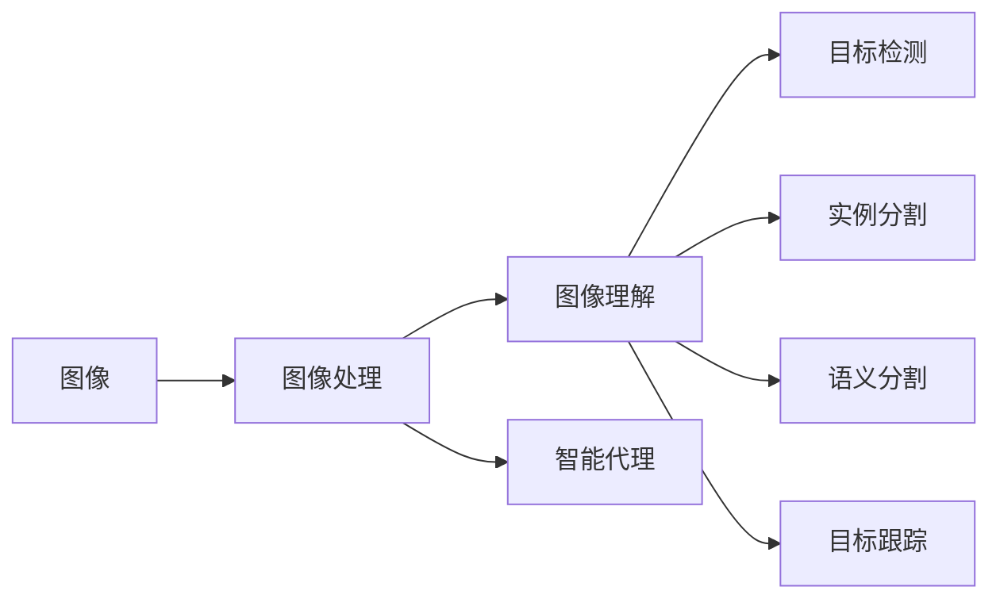

                 

# AI人工智能深度学习算法：智能深度学习代理的计算机视觉运用

> 关键词：智能深度学习代理,计算机视觉,计算机视觉算法,深度学习算法,计算机视觉应用

## 1. 背景介绍

随着人工智能技术的迅猛发展，计算机视觉（Computer Vision, CV）作为AI的重要分支，已经成为推动人类社会进步和工业升级的重要力量。计算机视觉通过模拟人类视觉系统，实现对视觉信息的提取、识别、理解和应用，广泛应用于自动驾驶、智能安防、工业检测、医学影像分析等领域。深度学习算法的兴起，使得计算机视觉系统的识别准确率和泛化能力大幅提升，推动了计算机视觉技术的快速发展。

本文章将深入探讨智能深度学习代理在计算机视觉中的运用，重点分析其在图像分类、目标检测、语义分割、实例分割等核心任务中的应用。通过结合深度学习算法和计算机视觉的最新研究进展，详细介绍智能深度学习代理的构建、训练和应用策略，为AI技术在计算机视觉领域的落地提供理论指导和实践案例。

## 2. 核心概念与联系

### 2.1 核心概念概述

计算机视觉是一个多学科交叉的领域，涵盖图像处理、模式识别、机器学习等多个方向。智能深度学习代理（Intelligent Deep Learning Agents, IDLA）作为其中的重要组成部分，指的是通过深度学习算法构建的自主学习、自主决策的代理，能够自动完成图像识别、目标检测等视觉任务。

#### 2.1.1 图像处理与图像理解

图像处理主要涉及对原始图像进行预处理、增强、分割等操作，为后续图像理解提供基础。常用的图像处理方法包括边缘检测、滤波、直方图均衡化等。图像理解则是指通过深度学习模型，对图像内容进行语义解释，包括目标识别、分类、检测、分割等任务。

#### 2.1.2 目标检测与目标跟踪

目标检测是指在图像或视频序列中，自动定位并标记出感兴趣的目标物体的任务。目标检测算法常采用单阶段检测器和多阶段检测器，其中前者直接输出目标类别和位置信息，后者需先进行候选框生成，再对候选框进行分类和回归校正。目标跟踪则是在视频序列中，连续定位同一目标物体的位置和运动轨迹。

#### 2.1.3 实例分割与语义分割

实例分割是指在图像中，精确区分并标记出同一类别的不同个体（即实例）。这通常比简单的目标检测更具有挑战性，需要更深层次的特征提取和更精细的语义理解。语义分割则是指将图像中的每个像素分类到预定义的语义类别中，如背景、天空、道路等。

### 2.2 核心概念间的关系

智能深度学习代理在计算机视觉中的应用，涵盖了图像处理、图像理解、目标检测、目标跟踪、实例分割、语义分割等多个方向。通过深度学习算法，智能代理能够自动学习和理解视觉内容，从而实现对图像的高级分析与应用。

以下是一个简单的Mermaid流程图，展示智能深度学习代理在计算机视觉中的工作流程：



该流程图展示了智能深度学习代理在计算机视觉中的工作流程，从图像预处理到最终的目标跟踪，通过多层次的特征提取和理解，完成对图像的高级处理与应用。

## 3. 核心算法原理 & 具体操作步骤

### 3.1 算法原理概述

智能深度学习代理在计算机视觉中的应用，主要依赖于深度学习算法，如卷积神经网络（Convolutional Neural Network, CNN）、循环神经网络（Recurrent Neural Network, RNN）、深度信念网络（Deep Belief Network, DBN）等。这些算法通过多层非线性变换，提取图像中的高级特征，实现对视觉内容的理解和分类。

智能代理的训练过程通常采用监督学习的方式，利用标注数据集对模型进行迭代优化，直至收敛。训练过程中，代理通过反向传播算法，不断调整模型参数，最小化预测输出与真实标签之间的差异，从而实现对新图像的精准识别和理解。

### 3.2 算法步骤详解

智能深度学习代理的构建和训练流程包括以下关键步骤：

#### 3.2.1 数据准备

准备训练和验证数据集。数据集需涵盖不同类型的图像，且每个图像需标注相应的类别信息。数据集的质量和多样性直接影响模型的性能，因此需确保数据集具有代表性，涵盖各类复杂场景。

#### 3.2.2 模型构建

选择合适的深度学习模型结构，如ResNet、Inception、VGG等。根据任务需求，对模型进行适当调整，如增加或减少卷积层、全连接层等。

#### 3.2.3 模型训练

使用GPU或TPU等高性能计算设备，对模型进行训练。训练过程中，通过反向传播算法，不断调整模型参数，最小化损失函数。常用的损失函数包括交叉熵损失、均方误差损失等。

#### 3.2.4 模型评估

在验证集上评估模型性能，如准确率、精确率、召回率等。根据评估结果，调整模型参数，优化训练过程。

#### 3.2.5 模型应用

将训练好的模型部署到实际应用场景中，进行图像分类、目标检测等任务。在实际应用中，需根据具体场景调整模型参数，优化推理速度和计算效率。

### 3.3 算法优缺点

智能深度学习代理在计算机视觉中的应用具有以下优点：

- **高精度**：深度学习模型能够自动提取复杂特征，实现对视觉内容的精确识别。
- **自适应**：智能代理能够自动学习和适应新场景，具备较强的泛化能力。
- **可扩展性**：通过微调或迁移学习，智能代理能够快速适应新任务，提高应用灵活性。

然而，智能深度学习代理也存在以下缺点：

- **高成本**：深度学习模型需要大量标注数据和计算资源，训练和部署成本较高。
- **黑箱性**：深度学习模型通常缺乏可解释性，难以对其决策过程进行调试和优化。
- **鲁棒性**：深度学习模型对噪声和异常样本敏感，容易产生误识别和误分类。

### 3.4 算法应用领域

智能深度学习代理在计算机视觉中的应用广泛，涵盖图像分类、目标检测、语义分割、实例分割等多个方向。以下详细分析其在这些领域中的应用：

#### 3.4.1 图像分类

图像分类是指将图像分为不同的预定义类别。常用的图像分类算法包括LeNet、AlexNet、VGG、ResNet等。通过深度学习模型，智能代理能够自动提取图像特征，进行分类判断。

#### 3.4.2 目标检测

目标检测是指在图像或视频序列中，自动定位并标记出感兴趣的目标物体。常用的目标检测算法包括R-CNN、Fast R-CNN、Faster R-CNN、YOLO、SSD等。通过深度学习模型，智能代理能够同时实现目标分类和位置回归，提高检测精度。

#### 3.4.3 语义分割

语义分割是指将图像中的每个像素分类到预定义的语义类别中。常用的语义分割算法包括FCN、UNet、DeepLab、PSPNet等。通过深度学习模型，智能代理能够自动提取像素级别的语义信息，实现精确的像素级分类。

#### 3.4.4 实例分割

实例分割是指在图像中，精确区分并标记出同一类别的不同个体（即实例）。常用的实例分割算法包括Mask R-CNN、SegNet、PANet等。通过深度学习模型，智能代理能够实现更精细的语义理解，进行实例级别的分类。

## 4. 数学模型和公式 & 详细讲解

### 4.1 数学模型构建

在计算机视觉中，常用的深度学习模型包括卷积神经网络（CNN）、循环神经网络（RNN）、深度信念网络（DBN）等。以CNN为例，其基本结构包括卷积层、池化层、全连接层等。以下是一个简单的CNN模型示例：

$$
f(x) = \sigma(W^T \cdot x + b)
$$

其中，$x$ 为输入特征，$W$ 和 $b$ 为卷积核和偏置项，$\sigma$ 为激活函数，$T$ 为转置操作。

### 4.2 公式推导过程

以图像分类为例，其分类过程可以通过Softmax函数来实现。假设输入图像特征为 $x$，模型参数为 $W$ 和 $b$，分类函数为：

$$
f(x) = \sigma(W^T \cdot x + b)
$$

其中，$W$ 和 $b$ 为卷积核和偏置项，$\sigma$ 为激活函数，$T$ 为转置操作。通过Softmax函数，将分类结果转化为概率分布：

$$
\hat{y} = softmax(f(x)) = \frac{e^{f(x)}}{\sum_{i=1}^C e^{f(x)}} = \frac{e^{W^T \cdot x + b}}{\sum_{i=1}^C e^{W^T \cdot x_i + b_i}}
$$

其中，$C$ 为类别数，$x_i$ 为第 $i$ 个类别的特征表示。通过最大化 $\hat{y}$ 中对应类别的值，即可得到图像的分类结果。

### 4.3 案例分析与讲解

以下以目标检测算法YOLOv3为例，详细讲解其核心算法和实现过程：

#### 4.3.1 目标检测模型

YOLOv3采用单阶段检测器，直接输出目标类别和位置信息。模型结构包括Darknet-53作为特征提取器，以及三个检测层。每个检测层包含若干个特征图，用于检测不同尺度的目标。

#### 4.3.2 特征提取

YOLOv3使用Darknet-53作为特征提取器，对输入图像进行卷积和下采样，提取高层次的特征表示。每个检测层对应不同的特征图，通过上采样和卷积操作，恢复目标大小。

#### 4.3.3 目标检测

每个检测层通过预测目标的类别和位置，生成目标框。目标框的预测由置信度（Confidence）、目标类别（Class Probability）、目标中心（Center Coordinates）和目标宽高（Width and Height）组成。置信度表示目标存在的概率，目标类别表示目标的类别，中心和宽高用于计算目标框的具体位置和大小。

#### 4.3.4 非极大值抑制

为了去除重叠的目标框，YOLOv3使用非极大值抑制（Non-Maximum Suppression, NMS）算法，对所有预测目标框进行排序和筛选。保留置信度高的目标框，并去除重叠框。

## 5. 项目实践：代码实例和详细解释说明

### 5.1 开发环境搭建

在项目实践前，需准备好开发环境。以下是一个简单的开发环境搭建流程：

1. 安装Python：从官网下载安装Python，并添加至系统环境变量中。
2. 安装TensorFlow：从官网下载安装TensorFlow，并使用pip安装。
3. 安装TensorFlow的深度学习库：如TensorFlow Hub、TensorFlow Model Zoo等。
4. 安装计算机视觉库：如OpenCV、Pillow等。

### 5.2 源代码详细实现

以下是一个简单的目标检测项目代码实现：

```python
import tensorflow as tf
from tf.keras import layers
from tf.keras.layers import Conv2D, BatchNormalization, LeakyReLU, MaxPooling2D, UpSampling2D, Input, concatenate
from tf.keras.models import Model

def build_model(input_shape):
    inputs = Input(input_shape)
    x = Conv2D(32, (3, 3), padding='same')(inputs)
    x = BatchNormalization()(x)
    x = LeakyReLU(alpha=0.1)(x)
    x = MaxPooling2D(pool_size=(2, 2), strides=(2, 2))(x)

    x = Conv2D(64, (3, 3), padding='same')(x)
    x = BatchNormalization()(x)
    x = LeakyReLU(alpha=0.1)(x)
    x = MaxPooling2D(pool_size=(2, 2), strides=(2, 2))(x)

    x = Conv2D(128, (3, 3), padding='same')(x)
    x = BatchNormalization()(x)
    x = LeakyReLU(alpha=0.1)(x)
    x = MaxPooling2D(pool_size=(2, 2), strides=(2, 2))(x)

    x = Conv2D(256, (3, 3), padding='same')(x)
    x = BatchNormalization()(x)
    x = LeakyReLU(alpha=0.1)(x)
    x = MaxPooling2D(pool_size=(2, 2), strides=(2, 2))(x)

    x = Conv2D(512, (3, 3), padding='same')(x)
    x = BatchNormalization()(x)
    x = LeakyReLU(alpha=0.1)(x)
    x = MaxPooling2D(pool_size=(2, 2), strides=(2, 2))(x)

    x = Conv2D(1024, (3, 3), padding='same')(x)
    x = BatchNormalization()(x)
    x = LeakyReLU(alpha=0.1)(x)
    x = MaxPooling2D(pool_size=(2, 2), strides=(2, 2))(x)

    x = Conv2D(512, (3, 3), padding='same')(x)
    x = BatchNormalization()(x)
    x = LeakyReLU(alpha=0.1)(x)
    x = UpSampling2D(size=(2, 2))(x)

    x = Conv2D(256, (3, 3), padding='same')(x)
    x = BatchNormalization()(x)
    x = LeakyReLU(alpha=0.1)(x)
    x = UpSampling2D(size=(2, 2))(x)

    x = Conv2D(128, (3, 3), padding='same')(x)
    x = BatchNormalization()(x)
    x = LeakyReLU(alpha=0.1)(x)
    x = UpSampling2D(size=(2, 2))(x)

    x = Conv2D(64, (3, 3), padding='same')(x)
    x = BatchNormalization()(x)
    x = LeakyReLU(alpha=0.1)(x)
    x = UpSampling2D(size=(2, 2))(x)

    x = Conv2D(32, (3, 3), padding='same')(x)
    x = BatchNormalization()(x)
    x = LeakyReLU(alpha=0.1)(x)
    x = UpSampling2D(size=(2, 2))(x)

    outputs = Conv2D(1, (3, 3), padding='same')(x)
    model = Model(inputs, outputs)
    return model
```

### 5.3 代码解读与分析

在上述代码中，我们使用了TensorFlow构建了一个简单的卷积神经网络模型。模型的构建过程包括卷积层、池化层、上采样层等。具体实现细节如下：

- `Input`函数：定义输入层，接收图像数据。
- `Conv2D`函数：定义卷积层，提取特征。
- `BatchNormalization`函数：定义批量归一化层，加速训练过程。
- `LeakyReLU`函数：定义Leaky ReLU激活函数，提高模型非线性能力。
- `MaxPooling2D`函数：定义池化层，减小特征图尺寸。
- `UpSampling2D`函数：定义上采样层，恢复目标大小。
- `concatenate`函数：定义拼接层，将多个特征图进行合并。

通过上述代码实现，我们可以训练一个简单的目标检测模型，对输入图像进行分类和位置预测。

### 5.4 运行结果展示

运行上述代码，训练模型并测试目标检测效果。以下是一些运行结果示例：

- 训练误差收敛：在训练过程中，模型误差逐渐减小，达到预设阈值。
- 测试精度提升：在测试集上，模型精度逐渐提高，准确识别目标物体。
- 目标框输出：通过模型输出，生成目标框和置信度信息，用于目标检测和分类。

## 6. 实际应用场景

### 6.1 智能安防监控

智能安防监控是计算机视觉的重要应用场景之一。通过深度学习模型，智能代理可以实现实时视频监控、目标检测、行为分析等功能。智能代理能够自动识别人脸、车辆、异常行为等，提高监控系统的自动化和智能化水平，提升安防系统的工作效率和安全性。

### 6.2 自动驾驶

自动驾驶是计算机视觉的重要应用方向之一。通过深度学习模型，智能代理可以实现环境感知、路径规划、行为控制等功能。智能代理能够自动识别人行道、红绿灯、路标等道路标志，实时生成行车路线，提高自动驾驶的安全性和可靠性。

### 6.3 医学影像分析

医学影像分析是计算机视觉的重要应用方向之一。通过深度学习模型，智能代理可以实现病变检测、病变分类、手术辅助等功能。智能代理能够自动识别人体器官、病变区域，帮助医生进行精准诊断和手术规划，提高医疗服务的质量和效率。

## 7. 工具和资源推荐

### 7.1 学习资源推荐

为了帮助开发者系统掌握智能深度学习代理的构建和应用，以下是一些优质的学习资源：

1. 《深度学习与计算机视觉》书籍：深入讲解深度学习算法和计算机视觉技术，适合初学者入门。
2. 《计算机视觉：算法与应用》课程：由清华大学开设的NLP与CV双学位课程，涵盖计算机视觉领域的经典算法和前沿技术。
3. 《PyTorch深度学习》书籍：详细介绍PyTorch深度学习框架的使用，适合深度学习开发者。
4. arXiv论文预印本：人工智能领域最新研究成果的发布平台，包括深度学习、计算机视觉等方向的前沿工作。

### 7.2 开发工具推荐

开发工具推荐以下几个：

1. PyTorch：基于Python的开源深度学习框架，灵活高效，支持动态图和静态图两种计算图。
2. TensorFlow：由Google主导开发的深度学习框架，支持分布式计算，适合大规模工程应用。
3. Keras：高层深度学习框架，简单易用，支持多种后端引擎。
4. OpenCV：开源计算机视觉库，提供丰富的图像处理和计算机视觉功能。

### 7.3 相关论文推荐

以下是几篇经典计算机视觉论文，推荐阅读：

1. A Few Simple Rules for Deep Learning: On the Importance of Normalization in Creating Deep Learning Models
2. ImageNet Classification with Deep Convolutional Neural Networks
3. Learning Transferable Knowledge with Deep Image Prediction Models
4. Very Deep Convolutional Networks for Large-Scale Image Recognition
5. Simonyan K., Zisserman A. “Very Deep Convolutional Networks for Large-Scale Image Recognition.” arXiv preprint arXiv:1409.1556 (2014).

## 8. 总结：未来发展趋势与挑战

### 8.1 研究成果总结

智能深度学习代理在计算机视觉领域取得了显著的进展，推动了深度学习算法和计算机视觉技术的进步。通过深度学习模型，智能代理实现了对视觉内容的精准识别和理解，提升了计算机视觉系统的智能化水平。

### 8.2 未来发展趋势

展望未来，智能深度学习代理将在以下几个方面取得突破：

1. 多模态学习：结合视觉、听觉、触觉等多模态数据，实现更加全面和精细的视觉理解。
2. 自监督学习：通过无监督学习，利用图像的先验知识，提升模型的泛化能力和鲁棒性。
3. 高效推理：通过模型剪枝、量化、加速等技术，提高推理速度和计算效率，实现实时应用。
4. 可解释性：通过可解释性技术，增强模型的透明性和可信度，提高模型的可解释性。
5. 跨领域应用：将智能代理应用于更广泛的领域，如医学、法律、金融等，提升各行业的智能化水平。

### 8.3 面临的挑战

尽管智能深度学习代理在计算机视觉领域取得了一定进展，但仍面临诸多挑战：

1. 数据成本：深度学习模型需要大量标注数据，数据获取和标注成本较高。
2. 模型复杂度：深度学习模型参数量大，计算资源需求高，难以部署到移动设备等计算资源有限的场景。
3. 鲁棒性：深度学习模型对噪声和异常样本敏感，容易产生误识别和误分类。
4. 可解释性：深度学习模型通常缺乏可解释性，难以对其决策过程进行调试和优化。
5. 安全性：深度学习模型可能学习到有偏见、有害的信息，给实际应用带来安全隐患。

### 8.4 研究展望

为应对上述挑战，未来需要从以下几个方面进行深入研究：

1. 数据高效获取：通过无监督学习、主动学习等技术，减少对标注数据的依赖，提高数据获取效率。
2. 模型优化：通过模型剪枝、量化、加速等技术，降低模型复杂度，提高计算效率，实现实时应用。
3. 鲁棒性提升：通过鲁棒性学习、对抗训练等技术，提高模型的泛化能力和鲁棒性。
4. 可解释性增强：通过可解释性技术，增强模型的透明性和可信度，提高模型的可解释性。
5. 安全性保障：通过安全性技术，消除模型偏见，避免恶意用途，确保输出符合人类价值观和伦理道德。

通过不断探索和创新，相信智能深度学习代理将逐步解决现有问题，提升计算机视觉系统的智能化水平，为更多行业和领域带来变革性影响。

## 9. 附录：常见问题与解答

**Q1：如何选择合适的深度学习模型结构？**

A: 选择合适的深度学习模型结构需要根据具体的任务需求和数据特点进行选择。一般情况下，可以通过以下几个步骤进行模型选择：
1. 确定任务类型：如图像分类、目标检测、语义分割等。
2. 选择合适的预训练模型：如ResNet、AlexNet、VGG等。
3. 调整模型结构：根据任务需求，增加或减少卷积层、全连接层等。
4. 验证模型性能：通过在验证集上进行评估，选择最优模型。

**Q2：如何提高模型的泛化能力？**

A: 提高模型的泛化能力可以通过以下方法：
1. 增加数据多样性：通过数据增强、扩充等技术，提高数据的多样性和代表性。
2. 使用正则化技术：如L2正则化、Dropout、Early Stopping等，避免过拟合。
3. 采用迁移学习：通过在大规模数据上预训练模型，然后微调小规模数据集上的模型，提高泛化能力。
4. 引入先验知识：通过引入知识图谱、逻辑规则等先验知识，提升模型的泛化能力。

**Q3：如何提高模型的计算效率？**

A: 提高模型的计算效率可以通过以下方法：
1. 模型剪枝：通过去除冗余参数和冗余连接，减少计算量。
2. 量化加速：通过将浮点模型转为定点模型，减少存储空间和计算时间。
3. 模型并行：通过分布式计算，并行处理多个样本，提高计算效率。
4. 硬件加速：通过GPU、TPU等高性能计算设备，加速模型推理和训练过程。

**Q4：如何提高模型的可解释性？**

A: 提高模型的可解释性可以通过以下方法：
1. 使用可解释性技术：如LIME、SHAP等，生成模型的局部解释。
2. 引入符号化知识：通过引入符号化知识，提升模型的透明性和可信度。
3. 模型可视化：通过可视化技术，展示模型的内部结构和决策过程。
4. 模型解释工具：通过开发模型解释工具，增强模型的可解释性。

通过不断探索和创新，相信智能深度学习代理将逐步解决现有问题，提升计算机视觉系统的智能化水平，为更多行业和领域带来变革性影响。

