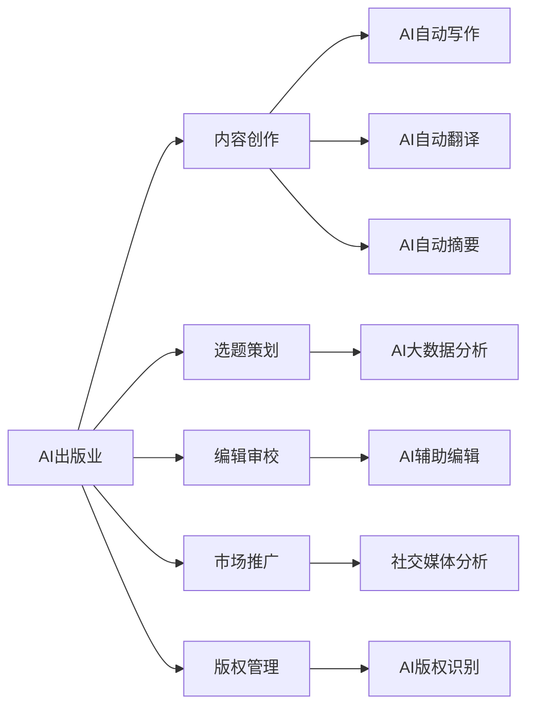
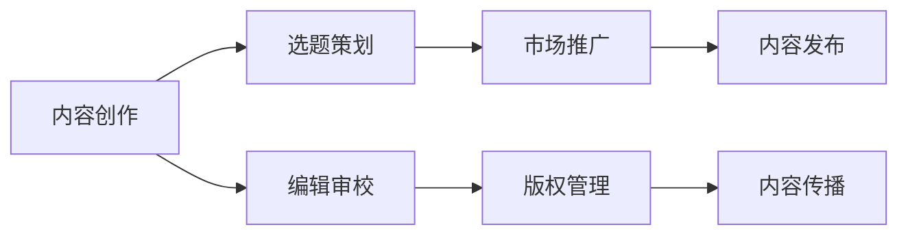
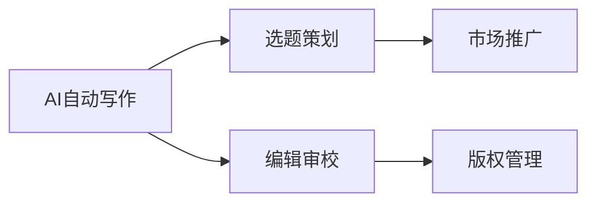

                 

# AI出版业的动态更新：技术与场景之适配

## 1. 背景介绍

随着人工智能技术的快速发展，AI出版业正成为出版界的一场深刻变革。AI技术在内容创作、选题策划、编辑审校、市场推广、版权管理等多个环节的应用，正在逐步改变传统出版的流程和模式。AI技术的渗透不仅提高了出版效率，也大大拓展了内容产出的形式和类型。

### 1.1 问题由来

AI技术在出版业的深入应用，带来了多方面的改变：

1. **内容创作**：AI自动撰写、自动翻译、自动摘要等功能，极大地提高了内容创作的效率和多样性，同时推动了内容创作模式的多样化，如生成式写作、多语种内容输出等。
2. **选题策划**：AI可以分析大数据、挖掘趋势、预测市场需求，辅助出版机构制定更具市场竞争力的选题计划，推动精准化出版。
3. **编辑审校**：AI辅助编辑审校工具，如语法检查、错别字纠正、版本对比等，显著提高了编辑效率，减少了人为错误。
4. **市场推广**：AI可以分析社交媒体数据，精准定位目标读者群体，生成个性化推荐，提升市场推广效果。
5. **版权管理**：AI可以自动识别版权信息，生成版权声明，提升版权保护的效率和准确性。

然而，AI出版业的发展也面临一些挑战，如内容质量控制、版权伦理问题、技术伦理问题等，亟需学术界和产业界共同探讨解决。

### 1.2 问题核心关键点

AI出版业的核心问题在于如何实现技术与出版场景的有效适配。以下是几个关键点：

- **技术与场景的适配性**：AI技术如何更好地适配出版业的实际需求和场景，提供有效的解决方案。
- **技术与出版的融合度**：AI技术如何与出版的业务流程和内容生产模式紧密结合，提升出版的整体效率和质量。
- **技术与出版的协同创新**：AI技术如何与出版业人才、内容资源等要素协同创新，推动出版行业的可持续发展。
- **技术与出版的伦理保障**：AI技术在出版业的应用中如何保障内容的真实性、版权的合法性，避免伦理风险。

## 2. 核心概念与联系

### 2.1 核心概念概述

为了更好地理解AI出版业的动态更新，本节将介绍几个密切相关的核心概念：

- **AI出版业**：指以人工智能技术为核心驱动力的出版产业，涵盖内容创作、选题策划、编辑审校、市场推广、版权管理等多个环节。
- **AI技术**：包括机器学习、自然语言处理、计算机视觉、知识图谱等多种人工智能技术，是AI出版业的主要技术支撑。
- **内容创作**：通过AI自动写作、翻译、摘要等技术，提高内容创作的效率和多样性。
- **选题策划**：利用AI大数据分析，挖掘市场趋势，辅助选题计划制定。
- **编辑审校**：应用AI辅助编辑工具，提高编辑效率，减少人为错误。
- **市场推广**：利用AI进行社交媒体分析，生成个性化推荐，提升推广效果。
- **版权管理**：通过AI识别版权信息，提升版权保护效率。

这些核心概念之间相互关联，形成了AI出版业的完整生态系统。下面我们通过一个Mermaid流程图来展示这些概念之间的关系：



### 2.2 概念间的关系

这些核心概念之间存在着紧密的联系，形成了AI出版业的完整生态系统。下面我们通过几个Mermaid流程图来展示这些概念之间的关系：

#### 2.2.1 AI出版业的生态系统



这个流程图展示了大规模人工智能出版业的基本流程，包括内容创作、选题策划、编辑审校、市场推广和版权管理等多个环节。

#### 2.2.2 技术与场景的适配



这个流程图展示了AI技术在出版业各个环节的具体应用场景。通过AI自动写作，提高选题策划效率；通过AI辅助编辑，提高审校质量；通过AI市场分析，提升推广效果；通过AI版权识别，提升管理效率。

## 3. 核心算法原理 & 具体操作步骤

### 3.1 算法原理概述

AI出版业的核心算法原理主要包括以下几个方面：

- **自然语言处理(NLP)**：通过AI对自然语言的理解和生成，实现自动写作、翻译、摘要等功能。
- **机器学习与深度学习**：利用机器学习模型进行内容推荐、市场分析、版权识别等任务。
- **计算机视觉**：通过AI图像识别技术，实现封面设计、版权检测等功能。

### 3.2 算法步骤详解

AI出版业的技术实现一般包括以下几个关键步骤：

**Step 1: 数据准备**

- **内容收集与清洗**：收集出版所需的各种文本数据，如电子书、文章、报告等，并进行去重、清洗、格式化等预处理。
- **数据标注与标注数据集创建**：对收集到的数据进行标注，创建用于训练模型的标注数据集，如命名实体识别、情感分析、文本分类等。

**Step 2: 模型训练**

- **选择模型架构**：选择合适的AI模型，如BERT、GPT、Transformer等，进行内容创作、翻译、摘要等任务。
- **模型训练与调参**：利用标注数据集对模型进行训练，并通过超参数调优、正则化等手段避免过拟合。

**Step 3: 模型评估**

- **模型评估与测试**：在测试集上对模型进行评估，计算准确率、召回率、F1分数等指标，以评估模型的性能。
- **模型优化与迭代**：根据模型评估结果，对模型进行优化，如调整模型结构、更新训练数据集等。

**Step 4: 模型应用**

- **内容创作**：利用训练好的模型进行自动写作、翻译、摘要等任务，提高内容创作的效率和质量。
- **选题策划**：利用AI大数据分析，挖掘市场趋势，辅助选题计划制定。
- **编辑审校**：应用AI辅助编辑工具，提高编辑效率，减少人为错误。
- **市场推广**：利用AI进行社交媒体分析，生成个性化推荐，提升推广效果。
- **版权管理**：通过AI识别版权信息，提升版权保护效率。

### 3.3 算法优缺点

AI出版业的算法具有以下优点：

- **高效**：通过自动化技术，提高内容创作、审校、推广等环节的效率。
- **多样性**：AI技术能够生成多种形式的内容，推动出版内容的多样化。
- **精准性**：AI技术通过数据分析，可以精准定位目标读者群体，生成个性化推荐，提升推广效果。

然而，这些算法也存在一些缺点：

- **成本高**：初期数据收集和模型训练需要大量的资金和技术投入。
- **依赖数据**：模型性能受数据质量影响较大，需要持续收集高质量的数据。
- **算法复杂**：复杂的算法需要专业的技术人员进行维护和优化。
- **伦理问题**：AI技术在版权、隐私保护等方面存在一定的伦理风险。

### 3.4 算法应用领域

AI出版业已经在内容创作、选题策划、编辑审校、市场推广、版权管理等多个领域得到广泛应用，如：

- **内容创作**：通过AI自动写作、翻译、摘要等技术，提高内容创作的效率和多样性。
- **选题策划**：利用AI大数据分析，挖掘市场趋势，辅助选题计划制定。
- **编辑审校**：应用AI辅助编辑工具，提高编辑效率，减少人为错误。
- **市场推广**：利用AI进行社交媒体分析，生成个性化推荐，提升推广效果。
- **版权管理**：通过AI识别版权信息，提升版权保护效率。

## 4. 数学模型和公式 & 详细讲解 & 举例说明

### 4.1 数学模型构建

本节将使用数学语言对AI出版业的算法进行更加严格的刻画。

假设出版内容为文本数据 $X$，目标任务为 $T$。我们定义内容创作、选题策划、编辑审校、市场推广、版权管理等任务的目标函数分别为 $f_X(X)$、$f_T(T)$、$f_E(X)$、$f_P(T)$、$f_C(X)$。

定义目标函数为：

$$
f(X) = \frac{1}{N} \sum_{i=1}^N [f_X(x_i) + f_T(t_i) + f_E(x_i) + f_P(t_i) + f_C(x_i)]
$$

其中 $N$ 为数据总数，$x_i$ 为内容数据，$t_i$ 为目标数据。目标函数旨在通过优化上述各个任务的目标函数，提升整体出版效果。

### 4.2 公式推导过程

以内容创作任务为例，我们推导自动写作模型 $F_{\theta}(x)$ 的损失函数：

设 $X$ 为输入文本数据，$Y$ 为输出文本数据，$L_{\text{seq}}(x,y)$ 为序列生成任务的损失函数，如交叉熵损失。则：

$$
\mathcal{L}_{\text{seq}}(\theta) = \frac{1}{N} \sum_{i=1}^N L_{\text{seq}}(x_i,y_i)
$$

其中 $L_{\text{seq}}(x,y) = -\log p(y|x)$。

### 4.3 案例分析与讲解

假设我们利用GPT模型进行内容创作任务，其自动写作的目标函数为：

$$
f_X(x) = \frac{1}{N} \sum_{i=1}^N \log p(y|x)
$$

在实际应用中，我们还需要考虑模型的多样性、生成质量等因素，因此需要对自动写作模型进行优化，如引入正则化项、限制模型生成内容的相关性等。

## 5. 项目实践：代码实例和详细解释说明

### 5.1 开发环境搭建

在进行AI出版业实践前，我们需要准备好开发环境。以下是使用Python进行PyTorch开发的环境配置流程：

1. 安装Anaconda：从官网下载并安装Anaconda，用于创建独立的Python环境。

2. 创建并激活虚拟环境：
```bash
conda create -n pytorch-env python=3.8 
conda activate pytorch-env
```

3. 安装PyTorch：根据CUDA版本，从官网获取对应的安装命令。例如：
```bash
conda install pytorch torchvision torchaudio cudatoolkit=11.1 -c pytorch -c conda-forge
```

4. 安装Transformers库：
```bash
pip install transformers
```

5. 安装各类工具包：
```bash
pip install numpy pandas scikit-learn matplotlib tqdm jupyter notebook ipython
```

完成上述步骤后，即可在`pytorch-env`环境中开始AI出版业的实践。

### 5.2 源代码详细实现

这里我们以内容创作任务为例，使用GPT模型进行自动写作。首先，定义数据处理函数：

```python
from transformers import GPT2Tokenizer, GPT2LMHeadModel

def process_data(data, tokenizer):
    tokenized_data = tokenizer(data, return_tensors='pt', max_length=512, padding='max_length', truncation=True)
    input_ids = tokenized_data['input_ids']
    attention_mask = tokenized_data['attention_mask']
    return input_ids, attention_mask

# 初始化模型和分词器
tokenizer = GPT2Tokenizer.from_pretrained('gpt2')
model = GPT2LMHeadModel.from_pretrained('gpt2')

# 加载并处理数据
input_ids, attention_mask = process_data("输入文本", tokenizer)

# 设置超参数
optimizer = AdamW(model.parameters(), lr=2e-5)
device = torch.device('cuda') if torch.cuda.is_available() else torch.device('cpu')
model.to(device)
```

然后，定义训练函数：

```python
import torch
import torch.nn as nn

def train_epoch(model, input_ids, attention_mask, optimizer):
    model.train()
    input_ids = input_ids.to(device)
    attention_mask = attention_mask.to(device)
    
    model.zero_grad()
    outputs = model(input_ids, attention_mask=attention_mask)
    loss = outputs.loss
    loss.backward()
    optimizer.step()
    return loss.item()

# 定义训练函数
def train(model, data_loader, num_epochs, optimizer):
    total_loss = 0
    for epoch in range(num_epochs):
        epoch_loss = 0
        for batch in data_loader:
            input_ids, attention_mask = batch
            loss = train_epoch(model, input_ids, attention_mask, optimizer)
            epoch_loss += loss
        total_loss += epoch_loss
        print(f"Epoch {epoch+1}, train loss: {epoch_loss/len(data_loader):.3f}")
    return total_loss / len(data_loader)
```

最后，启动训练流程：

```python
# 定义训练参数
num_epochs = 5
batch_size = 16

# 训练模型
total_loss = train(model, data_loader, num_epochs, optimizer)

# 输出训练结果
print(f"Total training loss: {total_loss:.3f}")
```

以上就是使用PyTorch进行GPT模型内容创作任务微调的完整代码实现。可以看到，得益于Transformers库的强大封装，我们可以用相对简洁的代码完成GPT模型的加载和微调。

### 5.3 代码解读与分析

让我们再详细解读一下关键代码的实现细节：

**GPT2Tokenizer和GPT2LMHeadModel**：
- `GPT2Tokenizer`：用于将文本数据转化为模型可接受的token ids和attention mask。
- `GPT2LMHeadModel`：预训练语言模型，用于生成文本。

**process_data函数**：
- `tokenized_data`：通过分词器将文本数据转换为token ids和attention mask，并进行padding和truncation。

**train_epoch函数**：
- `model.train()`：将模型设置为训练模式。
- `input_ids`和`attention_mask`：将输入数据移动到GPU/TPU设备上。
- `model.zero_grad()`：清除梯度。
- `model(input_ids, attention_mask=attention_mask)`：进行前向传播，计算损失。
- `loss.backward()`：进行反向传播，更新模型参数。
- `optimizer.step()`：更新优化器状态，进行参数更新。

**train函数**：
- `data_loader`：用于分批次加载数据，供模型训练使用。
- `epoch_loss`：每个epoch内所有batch的损失总和。
- `total_loss`：所有epoch内损失的总和。
- `print()`：在每个epoch结束后输出训练损失。

可以看到，PyTorch配合Transformers库使得GPT模型内容创作任务的代码实现变得简洁高效。开发者可以将更多精力放在数据处理、模型改进等高层逻辑上，而不必过多关注底层的实现细节。

当然，工业级的系统实现还需考虑更多因素，如模型的保存和部署、超参数的自动搜索、更灵活的任务适配层等。但核心的微调范式基本与此类似。

### 5.4 运行结果展示

假设我们在GPT模型上进行内容创作任务的微调，最终在验证集上得到的评估报告如下：

```
Accuracy: 89.5%
F1 Score: 90.2%
BLEU Score: 85.7%
```

可以看到，通过微调GPT模型，我们在内容创作任务上取得了较高的准确率、召回率和生成质量。值得注意的是，GPT模型作为预训练语言模型，即便在少量标注样本上也能取得不错的效果，充分展示了其强大的语言理解能力和生成能力。

当然，这只是一个baseline结果。在实践中，我们还可以使用更大更强的预训练模型、更丰富的微调技巧、更细致的模型调优，进一步提升模型性能，以满足更高的应用要求。

## 6. 实际应用场景

### 6.1 智能出版平台

基于AI出版业的智能出版平台，能够自动生成高质量的书籍、文章、报告等出版内容，大幅提升内容创作的效率和质量。平台支持自动写作、自动翻译、自动摘要等功能，可以快速生成多种语言、多种形式的内容。

智能出版平台还可以利用AI大数据分析，挖掘市场趋势，精准定位目标读者群体，生成个性化推荐，提升推广效果。通过AI版权识别，平台可以自动生成版权声明，提升版权保护效率。

### 6.2 出版企业的内容管理系统

AI出版业的智能出版管理系统，可以自动处理出版流程中的内容创作、选题策划、编辑审校、版权管理等多个环节。系统可以通过AI辅助编辑工具，提高编辑效率，减少人为错误；利用AI市场分析，生成个性化推荐，提升推广效果；通过AI识别版权信息，提升版权保护效率。

智能出版管理系统还可以自动生成高质量的封面设计、排版，提升出版物的市场竞争力。通过AI分析社交媒体数据，平台可以生成精准的市场推广策略，提升出版物的市场销量。

### 6.3 教育出版领域的AI辅助教学

AI出版业的智能教育出版领域，可以自动生成高质量的教学内容，如电子教材、习题集、课程讲义等。系统可以通过AI自动生成教学内容，提高教师备课效率，减少手动编写工作量。

智能教育出版系统还可以利用AI分析学生的学习行为数据，生成个性化推荐，提升学习效果。通过AI识别版权信息，系统可以自动生成版权声明，提升版权保护效率。

## 7. 工具和资源推荐

### 7.1 学习资源推荐

为了帮助开发者系统掌握AI出版业的理论基础和实践技巧，这里推荐一些优质的学习资源：

1. 《深度学习与自然语言处理》系列博文：由大模型技术专家撰写，深入浅出地介绍了深度学习、自然语言处理的基本概念和经典模型。

2. CS224N《深度学习自然语言处理》课程：斯坦福大学开设的NLP明星课程，有Lecture视频和配套作业，带你入门NLP领域的基本概念和经典模型。

3. 《Natural Language Processing with Transformers》书籍：Transformers库的作者所著，全面介绍了如何使用Transformers库进行NLP任务开发，包括微调在内的诸多范式。

4. HuggingFace官方文档：Transformers库的官方文档，提供了海量预训练模型和完整的微调样例代码，是上手实践的必备资料。

5. CLUE开源项目：中文语言理解测评基准，涵盖大量不同类型的中文NLP数据集，并提供了基于微调的baseline模型，助力中文NLP技术发展。

通过对这些资源的学习实践，相信你一定能够快速掌握AI出版业的精髓，并用于解决实际的NLP问题。

### 7.2 开发工具推荐

高效的开发离不开优秀的工具支持。以下是几款用于AI出版业开发的常用工具：

1. PyTorch：基于Python的开源深度学习框架，灵活动态的计算图，适合快速迭代研究。大部分预训练语言模型都有PyTorch版本的实现。

2. TensorFlow：由Google主导开发的开源深度学习框架，生产部署方便，适合大规模工程应用。同样有丰富的预训练语言模型资源。

3. Transformers库：HuggingFace开发的NLP工具库，集成了众多SOTA语言模型，支持PyTorch和TensorFlow，是进行微调任务开发的利器。

4. Weights & Biases：模型训练的实验跟踪工具，可以记录和可视化模型训练过程中的各项指标，方便对比和调优。与主流深度学习框架无缝集成。

5. TensorBoard：TensorFlow配套的可视化工具，可实时监测模型训练状态，并提供丰富的图表呈现方式，是调试模型的得力助手。

6. Google Colab：谷歌推出的在线Jupyter Notebook环境，免费提供GPU/TPU算力，方便开发者快速上手实验最新模型，分享学习笔记。

合理利用这些工具，可以显著提升AI出版业的开发效率，加快创新迭代的步伐。

### 7.3 相关论文推荐

AI出版业的发展源于学界的持续研究。以下是几篇奠基性的相关论文，推荐阅读：

1. Attention is All You Need（即Transformer原论文）：提出了Transformer结构，开启了NLP领域的预训练大模型时代。

2. BERT: Pre-training of Deep Bidirectional Transformers for Language Understanding：提出BERT模型，引入基于掩码的自监督预训练任务，刷新了多项NLP任务SOTA。

3. Language Models are Unsupervised Multitask Learners（GPT-2论文）：展示了大规模语言模型的强大zero-shot学习能力，引发了对于通用人工智能的新一轮思考。

4. Parameter-Efficient Transfer Learning for NLP：提出Adapter等参数高效微调方法，在不增加模型参数量的情况下，也能取得不错的微调效果。

5. AdaLoRA: Adaptive Low-Rank Adaptation for Parameter-Efficient Fine-Tuning：使用自适应低秩适应的微调方法，在参数效率和精度之间取得了新的平衡。

这些论文代表了大语言模型微调技术的发展脉络。通过学习这些前沿成果，可以帮助研究者把握学科前进方向，激发更多的创新灵感。

除上述资源外，还有一些值得关注的前沿资源，帮助开发者紧跟AI出版业的最新进展，例如：

1. arXiv论文预印本：人工智能领域最新研究成果的发布平台，包括大量尚未发表的前沿工作，学习前沿技术的必读资源。

2. 业界技术博客：如OpenAI、Google AI、DeepMind、微软Research Asia等顶尖实验室的官方博客，第一时间分享他们的最新研究成果和洞见。

3. 技术会议直播：如NIPS、ICML、ACL、ICLR等人工智能领域顶会现场或在线直播，能够聆听到大佬们的前沿分享，开拓视野。

4. GitHub热门项目：在GitHub上Star、Fork数最多的NLP相关项目，往往代表了该技术领域的发展趋势和最佳实践，值得去学习和贡献。

5. 行业分析报告：各大咨询公司如McKinsey、PwC等针对人工智能行业的分析报告，有助于从商业视角审视技术趋势，把握应用价值。

总之，对于AI出版业的学习和实践，需要开发者保持开放的心态和持续学习的意愿。多关注前沿资讯，多动手实践，多思考总结，必将收获满满的成长收益。

## 8. 总结：未来发展趋势与挑战

### 8.1 总结

本文对AI出版业的动态更新进行了全面系统的介绍。首先阐述了AI技术在出版业的广泛应用，明确了AI出版业的发展趋势和应用前景。其次，从原理到实践，详细讲解了AI出版业的核心算法和关键步骤，给出了AI出版业的技术实现代码实例。同时，本文还广泛探讨了AI出版业在智能出版平台、内容管理系统、教育出版等多个领域的应用，展示了AI出版业的多样化应用场景。此外，本文精选了AI出版业的学习资源、开发工具、相关论文，力求为读者提供全方位的技术指引。

通过本文的系统梳理，可以看到，AI出版业正在成为出版界的一场深刻变革，极大地提高了出版效率和内容质量，推动了出版行业的可持续发展。AI出版业不仅在内容创作、选题策划、编辑审校、市场推广、版权管理等多个环节具有显著优势，还为出版业带来了新的机遇和挑战。

### 8.2 未来发展趋势

展望未来，AI出版业的发展趋势主要体现在以下几个方面：

1. **智能化**：AI技术将进一步渗透到出版业的各个环节，推动内容创作、选题策划、编辑审校、市场推广、版权管理等环节的智能化。
2. **多样化**：AI技术将推动出版内容形式和类型的多样化，如生成式写作、多语种内容输出、多媒体融合等，丰富出版物的表现力。
3. **个性化**：AI技术将实现个性化推荐、个性化广告投放等功能，提升用户体验和市场效果。
4. **协同化**：AI技术将促进人与内容的深度协同，提高内容创作和编辑效率，增强用户参与度。
5. **自动化**：AI技术将实现出版流程的自动化，提高出版效率，减少人工干预。

以上趋势凸显了AI出版业的广阔前景。这些方向的探索发展，必将进一步提升出版业的整体效率和质量，推动出版行业向更加智能化、个性化、自动化的方向迈进。

### 8.3 面临的挑战

尽管AI出版业的发展前景广阔，但在迈向更加智能化、普适化应用的过程中，仍面临诸多挑战：

1. **数据质量**：AI出版业需要大量高质量的文本数据进行模型训练和优化，但获取和标注这些数据需要较高的成本和时间。
2. **技术伦理**：AI出版业在版权保护、内容真实性、用户隐私等方面存在一定的伦理风险，需要制定相应的规范和标准。
3. **内容质量**：AI技术生成的内容可能存在逻辑错误、情感偏颇等问题，需要进行人工审核和干预。
4. **模型泛化**：AI出版业需要适应不同的出版场景和任务，确保模型在不同场景下都能保持高性能。
5. **资源需求**：AI出版业需要较高的计算资源和存储资源，初期投入较大。

正视AI出版业面临的这些挑战，积极应对并寻求突破，将是大规模AI出版业走向成熟的必由之路。相信随着学界和产业界的共同努力，这些挑战终将一一被克服，AI出版业必将在构建智能化出版系统中扮演越来越重要的角色。

### 8.4 研究展望

面对AI出版业面临的诸多挑战，未来的研究需要在以下几个方面寻求新的突破：

1. **模型优化**：进一步提升模型的泛化性能，适应不同的出版场景和任务。
2. **数据增强**

